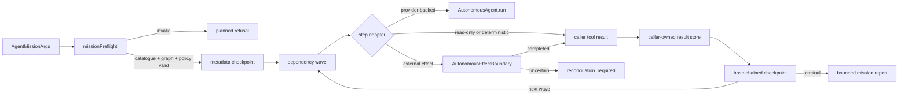

# Autonomous brain runtime

The autonomous brain is split into a deterministic decision kernel and an application-owned
provider runtime.

```mermaid
flowchart LR
    U[Protected UI or no-echo entry] --> CS[In-memory CredentialStore]
    D[Deployment environment or secret manager] --> CP[CredentialProvisioner]
    CP --> CS
    CS --> H[Opaque credential handle]
    H --> RT[LLMRuntime]
    RT --> P[Provider API]
    Q[Task and evidence metadata] --> MS[Model selection]
    MS --> CR[Cross-domain capability route]
    CR --> DP[Reviewed domain capability pack]
    CR --> PA[Prompt assembly with bounded tool schemas]
    DP --> PA
    PA --> PL[Bounded plan DAG]
    PL --> RT
    RT --> ST[Bounded SSE stream]
    ST --> O[Value response or typed tool intent]
    O --> MP[Structured mission proposal]
    MP --> MF[agent_mission preflight]
    MF --> MD[Caller dispatch approval]
    MD --> ME[Bounded multi-step executor]
    O --> EV[Held-out evaluator or human review]
    EV --> OE[Value-only outcome evidence]
    OE --> BU[Explicit bandit update]
    BU --> MS
```



## Domain execution policies

Every built-in domain now has a versioned, provider-free execution policy in both SDKs. The
policy is bound into generated task blueprints and plans, so model selection and invocation can
share explicit limits instead of inheriting one generic budget. It covers input/output tokens,
provider attempts, tool turns, aggregate cost, route and selection confidence floors, structured
response requirements, evidence posture, evaluator requirements, effect approval posture, and
learning mode. The twelve policies cover coding, browser, data, science, biomedical,
neuroscience, operations, enterprise, multi-agent, multimodal, cross-domain, and evaluation.

Use admission as a provider-free preflight. `admitted` means the metadata gates are clear, not
that the SDK has authorized a provider or external effect; `review_required` and `blocked` retain
stable reason codes for UI, queue, and operator decisions:

```typescript
const policy = autonomousDomainPolicy("biomedical");
const admission = evaluateAutonomousDomainPolicy(policy, {
  route_confidence: 1,
  selection_confidence: 1,
  selection_margin: 1,
  structured_response: true,
  evidence_ready: true,
  evaluator_configured: true,
  plan_accepted: true,
});
// admission.decision === "admitted"
// policy.effect_mode === "forbidden" still blocks effectful requests.
```

The Python API exposes the same contract through `autonomous_domain_policy(...)`,
`evaluate_autonomous_domain_policy(...)`, and `AutonomousTaskOrchestrator.admit_domain_policy(...)`.
Policy metadata is value-only and digest-addressed; prompts, credentials, evidence values, and
provider responses remain transient caller-owned data.

### Source and evaluator authority at the learning boundary

The cycle evaluator bridge can optionally compose the existing source-provenance ledger and
evaluator-calibration report into a fail-closed admission gate. A configured source callback must
return an integrity-checked receipt for the exact routed domain with an accepted observation,
non-null source digest, and non-`caller_declared` authority. A configured evaluator callback must
return a validated calibration/holdout report whose exact evaluator identity is ready. The checks
run before the evidence factory and before reward settlement, including for every cross-domain
specialist and the synthesis episode.

Only receipt/report digests and bounded source labels are exposed to the evidence factory. Raw
source values, prompts, provider responses, credentials, and evidence bodies remain caller-owned
and transient. These receipts are admission evidence, not an SDK claim that a source is truthful;
deployment policy, source authentication, human review, and external truth authority remain
explicit integration responsibilities.

### Audit versus strict execution

The default `domainPolicyMode: "audit"` (or Python `domain_policy_mode="audit"`) preserves
backward-compatible execution while attaching policy metadata to the run. Set the mode to
`"strict"` when a deployment needs a fail-closed boundary before any provider or tool dispatch.
Strict admission checks the selected route, prompt and output budgets, aggregate cost, structured
response posture, evidence readiness, evaluator configuration, explicit plan acceptance, and
effect approval. It also clamps provider failovers and tool turns to the domain policy. A strict
run returns `policy_review_required` or `policy_blocked` in TypeScript, while the Python
orchestrator raises `AutonomousDomainPolicyError` with stable reason codes; neither path invokes a
provider when admission fails.

```typescript
const held = await agent.run("review a bounded biomedical hypothesis", {
  domain: "biomedical",
  domainPolicyMode: "strict",
  structuredDomainResponse: true,
  domainPolicyEvidenceReady: true,
  domainPolicyEvaluatorConfigured: true,
  domainPolicyPlanAccepted: true,
});

if (held.status === "policy_review_required" || held.status === "policy_blocked") {
  // Present held.domain_policy_admission.reasons to an operator or workflow queue.
}
```

The Python equivalent supplies the same explicit booleans to `AutonomousTaskOrchestrator.run`
using snake_case names and catches `AutonomousDomainPolicyError`. Cross-domain TypeScript runs
evaluate every child domain and the synthesis domain independently, so one unsafe child holds the
whole run before dispatch. Strict mode is an admission layer, not a secret manager: callers still
own credentials, provider registration, and the final effect approval.

Provider-assisted planning is covered by the same boundary. `planWithProvider`, `planAndRun`, and
Python `run_auto(..., planning_mode="provider")` check strict evidence, evaluator, response, and
budget posture before model selection or planner invocation. A planner admission only authorizes a
bounded proposal to be produced; the subsequent execution re-checks the caller's actual plan
acceptance and effect posture. This prevents a planner call from becoming an unreviewed escape
hatch around the execution policy.

### Weighted model selection and online evidence

Model selection uses one explicit multi-objective policy across the Rust kernel, TypeScript SDK,
Python SDK, and provider-free selection lab. The policy is a set of utility coefficients—not
probabilities—with bounded values for `quality`, `reliability`, `cost`, `latency`, and
`exploration`. The shared default is `{ quality: 0.55, reliability: 0.25, cost: 0.10,
latency: 0.10, exploration: 0.15 }`. Hard gates (registration, credentials, circuits, capacity,
capabilities, caller budgets, and learning-policy disables) run before the score, and every ranking
row retains its reason codes plus `base_score`, `exploration_bonus`, and observed pull count.

The Python high-level entry points accept `selection_weights=...`; TypeScript accepts
`selectionWeights=...`. The older `selection_overrides={"weights": ...}` envelope remains
supported for persisted deployments, but if both forms are supplied they must normalize to the
same policy. This means a single policy can be carried through a single-domain run, cross-domain
fan-out, synthesis, planning previews, and approval revalidation without silently changing the
decision between review and dispatch:

```python
result = orchestrator.run(
    task="compare two bounded implementation strategies",
    domain="coding",
    model_candidates=models,
    credentials=credentials,
    selection_weights={
        "quality": 0.7,
        "reliability": 0.25,
        "cost": 0.05,
        "latency": 0.05,
        "exploration": 0.10,
    },
    approve_provider_call=False,
)
```

Online observations are caller-owned value-only arm statistics. They can contribute bounded mean
reward and deterministic UCB-style exploration, while `disabled: true` is an explicit hard gate;
transport success is never treated as task quality. The TypeScript preview binds the observations'
digest into its approval contract, and changing either the policy or observations requires a new
review. Persisted evaluator quality remains separate from transport health and is blended only as
a capped routing prior. No key, prompt, response, raw evaluator text, or hidden learner state is
accepted by the selection policy contract.

## Domain operating kits

The SDK also exposes a digest-bound operating kit for every built-in domain. A kit composes the
reviewed profile and workflow with its policy, task lens, structured response contract, prompt
registry coverage, evaluator profile, evidence outputs, and stage-compatible tool bindings. This
gives an application one stable, inspectable contract to use for onboarding screens, deployment
preflight, queue admission, and restart checks instead of separately guessing whether those
surfaces agree.

```typescript
const kits = await buildAutonomousDomainOperatingKits();
const operations = kits.find((kit) => kit.domain === "operations");
// operations.status === "complete"
// operations.coverage.tool_bindings === true
// operations.stages includes approval and rollback metadata
await validateAutonomousDomainOperatingKit(operations);
```

Python provides `build_autonomous_domain_operating_kits()`,
`build_autonomous_domain_operating_kit(domain)`, and
`validate_autonomous_domain_operating_kit(...)`, plus matching methods on `AutonomousAgent` and
`AutonomousBrain`. The collection is deterministic and currently covers coding, browser, data,
science, biomedical, neuroscience, operations, enterprise, multi-agent, multimodal,
cross-domain, and evaluation. Every stage carries a prompt-manifest selection, evidence labels,
evaluator signals, approval/read-only posture, compatible reviewed tool names, and its own digest;
the kit carries a digest over the complete composition. Validation rebuilds the current reviewed
composition and rejects stale or tampered metadata before it can be used as a handoff.

Operating kits remain metadata-only. They do not render prompts, resolve credentials, call a
provider, acquire evidence, execute a tool, update a bandit, or authorize an effect. The kit's
`next_actions` explicitly directs the caller to perform the ordinary route, model-selection,
evidence, approval, provider, evaluator, and learning gates. A complete kit therefore means the
domain architecture is internally wired; it does not mean a deployment has configured a model or
approved a live action.

### Domain quality gates

Structured responses now carry a second, domain-specific readiness layer. The quality registry
contains a reviewed policy for every built-in domain with critical decision fields, safety-control
fields, stage-specific reporting requirements, and provider prompt guidance. For example, coding
must report executable verification and rollback risk; operations must report blast radius,
stop conditions, recovery, approval, and the execution boundary; biomedical work must report
scope, applicability, uncertainty, and human escalation; evaluation work must report coverage,
regressions, replay outcomes, and reproduction steps.

```typescript
const policy = autonomousDomainQualityPolicy("operations");
const report = evaluateAutonomousDomainResponseQuality(response, contract, policy);
// report.passed is a structural readiness gate, not proof that an operation occurred.
// report.missing_signals and report.recommendations are safe replan feedback.
```

The existing `evaluateAutonomousDomainResponse(...)` merges these signals into the value-only
reward used by prompt learning, model selection, and explicit bandit settlement. A high aggregate
score cannot hide a missing domain safety or stage-control signal: the quality gate requires all
domain controls to be satisfied. The outer `response_integrity_gate` failure class remains stable
for existing callers, while the `quality_*` signals and recommendations identify the repair.
Policies and reports are digest-bound, provider-free, and secret-free. Python exposes matching
`autonomous_domain_quality_policy(...)`, `evaluate_autonomous_domain_response_quality(...)`, and
`validate_autonomous_domain_quality_policy(...)` functions. These checks improve composition and
decision readiness; they are not medical, scientific, operational, enterprise, or external-world
truth evaluators, and they never authorize an effect.

Workflow continuation now has its own fail-closed quality boundary. A completed stage must pass
the digest-bound `AutonomousWorkflowStageResponseEvaluation` before its output becomes a
checkpoint dependency, feeds a later stage, or creates a learning episode. Evidence-free or
notes-free completion claims are retained as a blocked stage with the evaluator's missing-signal
and replan metadata; they are never treated as a successful stage merely because the provider
transport returned HTTP success. Completed stages may leave uncertainty and next-actions empty
when their bounded notes explicitly close those disclosures, while proposed/blocked stages still
need to disclose them. Resuming a quality-gated stage is held until the caller supplies the
explicit retry control (`retryBlocked` in TypeScript or `retry_blocked` in Python). This gate is
about stage-report integrity only: it does not prove task correctness, source truth, or an
external effect.

Mission execution has the same continuation boundary. TypeScript callers can provide
`AutonomousMissionExecutorOptions.evaluateStep`, and Python callers can provide
`quality_evaluator` to `run_connector_mission(...)`. The callback sees the transient result and
returns the existing evaluator reward shape (`evaluator_id`, `evaluator_version`, `reward`, and
`passed`, with optional failure/evidence digests). The runtime adds mission, goal, domain, step,
and result digests, then persists only the resulting
`AutonomousMissionStepQualityEvaluation` projection. A rejected or unevaluable result is stored
as a quality-blocked step without saving its output, cannot satisfy dependencies, and cannot
advance learning-linked mission completion. The checkpoint remains addressable for review and
requires `retryBlocked: true` (TypeScript) or `retry_blocked=True` (Python) to dispatch again.

```typescript
const executor = new AutonomousMissionExecutor({
  catalogue,
  executeStep,
  evaluateStep: ({ step, result }) => ({
    evaluator_id: "reviewer",
    evaluator_version: "1",
    reward: result.accepted === true ? 1 : 0,
    passed: result.accepted === true,
  }),
});
```

This is deliberately an evaluator seam, not an invented correctness oracle. It lets each of the
twelve built-in domains attach its own reviewed rubric while the runtime enforces the invariant
that transport success is not durable mission success. Quality projections are safe to replicate,
digest-replay, and feed into explicit learning settlement; raw results, prompts, arguments,
credentials, and external-world evidence remain caller-owned.

### Bounded recovery planning

Held and failed runs should not force every queue or UI to reverse-engineer meaning from a status
string. Both SDKs now expose `planAutonomousRecovery(...)` / `plan_autonomous_recovery(...)`, a
provider-free recovery handoff over an explicit value-only observation. It returns a digest-bound
status, ordered next actions, retry budget, stable reason codes, and two domain guardrails for all
twelve built-in domains. Reconciliation takes precedence over retry; missing credentials lead to
credential collection; route and policy holds lead to review; response-quality and tool-approval
holds remain explicit; and exhausted or unclassified failures stop and escalate instead of being
reported as successful or silently retried.

```typescript
const recovery = planAutonomousRecovery({
  domain: "operations",
  capability: "incident_response",
  status: "failed",
  failure_code: "transport",
  retryable: true,
  retry_count: 1,
  max_retries: 3,
});
// recovery.next_action === "retry_provider"
// recovery.actions is guidance only; the caller still owns approval and dispatch.
```

The observation contract rejects task text, prompts, provider requests/responses, credentials,
headers, arguments, and raw output before planning. `validateAutonomousRecoveryPlan(...)` and its
Python equivalent recheck the digest and retention markers before a plan enters a queue or durable
operator record. Recovery planning never invokes a provider, resolves a key, executes a tool,
settles learning, or reconciles an external effect; it makes the next autonomous decision
inspectable without turning guidance into authority.

### Recovery handoff control plane

The planner is now backed by an explicit review queue in both SDKs. `AutonomousRecoveryHandoffLedger`
accepts a validated plan together with only a digest of the caller's private run identity and a
bounded attempt number. Repeating the same run/attempt/plan is idempotent; a queue record never
stores the observation, task, prompt, provider request/response, credential, tool arguments,
effect value, or raw exception. Every retained handoff carries its plan digest, domain, capability,
retry counters, recommended action, review revision, transition digest, and an independent
handoff digest.

```typescript
const ledger = new AutonomousRecoveryHandoffLedger();
const queued = ledger.submit({
  plan: recovery,
  run_id_digest: runIdDigest,
  attempt: 0,
});
const reviewed = ledger.review({
  handoff_id: queued.handoff.handoff_id,
  decision: "approve_retry",
  expected_revision: 1,
  reviewer_digest: reviewerIdentityDigest,
});
// reviewed.handoff.status === "retry_approved"
// The caller must still rehydrate the transient request and invoke its normal gates.
```

Review is compare-and-swap fenced: only a queued row at the caller's expected revision can move
to `retry_approved`, `reconciliation_required`, `escalated`, or `closed`. A credential-collection
handoff cannot be approved as a retry; an uncertain-effect handoff cannot be downgraded to a
provider retry. The ledger never performs the selected action, and a `reconciliation_required`
row is not evidence that an external effect succeeded or failed. `snapshot()` / `restore()` provide
canonical, hash-chained metadata-only persistence, while
`AutonomousRecoveryHandoffPersistenceCoordinator` adds caller-owned JSON storage and optional
compare-and-swap writes. Before sending a record across a worker or service boundary, call
`validateAutonomousRecoveryHandoff(...)` or
`validateAutonomousRecoveryHandoffSnapshot(...)` (and the snake-case Python equivalents).
This gives deployments a real failure process without turning a safety handoff into an implicit
retry engine or an external truth oracle.

Semantic provider routing is covered by the same boundary. `route_with_provider`,
`prepare_auto_with_provider`, and Python `run_auto(..., semantic_routing=True)` perform a
provider-free cross-domain admission before model selection or classifier invocation. A strict
route returns a typed policy admission with `policy_review_required` or `policy_blocked`; an
explicit provider approval is still separate from evidence and evaluator readiness. Automatic
execution preserves that semantic review result and cannot silently fall back to the deterministic
route as an authorization bypass.

## Credential lifecycle

Applications collect provider keys themselves. The SDK supports four caller-owned entry points:

```python
from prism_sdk import (
    CredentialStore,
    LLMRuntime,
    MissionPolicy,
    ProviderOnboarding,
    ProviderRequest,
    anthropic_provider,
    openai_provider,
)
from prism_sdk.brain import AutonomousBrain, BrainLearningLedger

credentials = CredentialStore()
runtime = LLMRuntime(credentials)
onboarding = ProviderOnboarding(runtime)
onboarding.register_provider(openai_provider())
onboarding.register_provider(anthropic_provider())
handle = onboarding.configure_from_prompt("openai")  # or configure_from_environment(...)
response = runtime.invoke(
    "openai",
    ProviderRequest(
        model="gpt-5",
        messages=({"role": "user", "content": "Compile the next bounded research step."},),
    ),
    credential=handle,
)
onboarding.revoke(handle)
```

For a UI request, browser session, or server job that may collect more than one provider key,
group the handles in a short-lived `CredentialSession`:

```python
import os

with onboarding.start_session(ttl_seconds=3_600) as session:
    session.configure_from_prompt("openai")
    session.configure_from_environment("anthropic", environ=os.environ)
    openai_handle = session.handle("openai")
    # pass only openai_handle to the provider runtime / brain call
    print(session.status().to_dict())  # redacted readiness only
```

Session expiry and `close()` revoke every handle created through the session. A deployment that
needs persistence should persist only a secret-manager reference outside this SDK and use
`configure_from_resolver(...)` to recreate short-lived handles after restart; the SDK never
persists the key or the reference.

`ProviderOnboarding` is the standard BYOK process. It requires non-secret provider transport
metadata first, then supports no-echo prompt entry, environment injection, protected UI
submission, or an external resolver callback for a secret-manager reference. `instructions()` is
the UI-facing contract: it reports whether the provider is registered, whether a credential is
ready, the next action, the supported input methods, and the provider's default environment
variable. It never returns a key. `status()` and `statuses()` return the same redacted readiness
(`register_provider`, `collect_user_credential`, or `ready`) without returning keys or handles.
`revoke()` removes the in-memory entry, and TTL expiry is purged before resolution or status
reporting. The value is held only in process memory. Handles expose only provider, opaque
identifier, source, expiry, and `secret_persistence: in_memory_only`; they do not implement a secret
serialization path. Provider failures do not return upstream response bodies because a proxy or
upstream error can echo request headers.

The application-level key intake process is therefore:

1. Register the provider's non-secret transport configuration during service startup.
2. Ask `onboarding.instructions(provider).to_dict()` (or
   `agent.credential_instructions(provider)`) for the redacted onboarding contract; a UI should
   render only that state and never put a key in browser-visible JSON.
3. Collect the key over the application's protected input path, or resolve it from the deployment's
   secret manager. For a UI submission, the raw value goes directly into
   `session.collect_user_credential(provider, value)`; the other paths are
   `configure_from_prompt`, `configure_from_environment`, or `configure_from_resolver`. It never
   goes into an LLM prompt, MCP argument, model catalogue, plan, learning ledger, or
   browser-visible JSON response.
4. Keep the returned handle server-side inside a short-lived `CredentialSession`, pass that handle
   only to `LLMRuntime`/`AutonomousBrain`, and expose `session.status()` or `onboarding.status()`
   to the UI as the readiness view.
5. Revoke the session after the request/job, or let its TTL expire. After a process restart, resolve
   the external reference again instead of attempting to serialize or restore the handle.

This means the SDK deliberately does not create a universal key-upload HTTP endpoint: the embedding
application owns authentication, TLS, CSRF protection, tenancy, rate limits, and secret-manager
permissions. The SDK owns the sensitive part after intake—non-echo collection helpers, bounded
in-memory lifetime, opaque handles, provider matching, expiry/revocation, and redacted readiness.

### Digest-bound stage execution packets

Every TypeScript task blueprint now includes one
`bioprism-python-autonomous-workflow-stage-plan/0.1` packet per reviewed workflow stage, matching
the Python `AutonomousWorkflowStageExecutionPlan` contract. A packet records only the reviewed
stage capabilities, evidence outputs, evaluator signals, capability-contract digests, active and
withheld tool names, selected tool order, approval/read-only posture, and the source plan digest.
It contains no task text, prompt, provider payload, tool arguments, credential, or effect authority.

`AutonomousWorkflowExecutor` forwards the packet digest, exact stage-contract digest, and selected
tool set into live dispatch. The adapter runtime rejects stale stage contracts and tool calls
outside the packet's selected portfolio before invoking the caller's executor. Checkpoints,
stage outcomes, tool receipts, and execution receipts retain the stage-plan digest so restart,
replay, evaluator review, and operator dashboards can identify exactly which reviewed capability
surface was attempted. Direct `AutonomousAgent.run()` remains domain-admitted unless a caller
supplies a reviewed workflow context; staged execution is the path that enables exact stage
portfolio narrowing.

### Keyless provider conformance

Deployments can run `runProviderProtocolConformance()` as a deterministic preflight before accepting
user credentials. It covers every built-in preset (OpenAI Responses, Anthropic Messages, and the
OpenAI-compatible DeepSeek, Groq, Mistral, OpenRouter, and xAI routes) through the real
`LLMRuntime`: registration, protocol-specific request shape, credential header policy, response
normalization, model discovery, streaming, and missing-credential refusal. The harness uses an
intercepted fetch fixture and a reserved invalid host, so it never opens a network connection and
requires no API key. Its report contains only provider/protocol/check status and a digest; synthetic
fixture credentials, prompts, request bodies, response payloads, and headers are not retained. A
deployment may call `assertProviderProtocolConformance(report)` as a release or startup gate, while
live provider availability, quotas, model permissions, and user credential readiness remain separate
runtime checks.

The Python package provides the equivalent `run_provider_protocol_conformance()` and
`assert_provider_protocol_conformance(report)` gate. It drives the same seven built-in provider
families through `LLMRuntime`, but uses an ephemeral `127.0.0.1` loopback server because Python's
HTTP runtime is intentionally exercised without an injectable fetch seam. The server is shut down
after each provider, and the report declares `local_loopback_fixture_never_external`; no external
network, caller key, prompt, request, response, or header is required or retained.

### Operator process boundary

The Python package now ships a small process boundary for operators and local integrations. It is
available as `aurora-agent` after installing the Python package, or as `python -m prism_sdk` from
the Python workspace:

```bash
python -m prism_sdk catalogue
python -m prism_sdk evidence-plan --domain browser --domain science
python -m prism_sdk route --task "compare two research hypotheses"
python -m prism_sdk provider-status --provider openai
```

`catalogue`, `evidence-plan`, and `route` never contact a provider or collect credentials. They
project the reviewed twelve-domain catalogue, workflow/evaluator contracts, deterministic routing
evidence, and evidence requirements as JSON. `provider-status` registers only non-secret provider
transport metadata and reports the redacted BYOK contract.

For a real invocation, `run` connects to a caller-owned MCP server and keeps the existing brain
boundaries intact:

```bash
python -m prism_sdk run \
  --mcp-command "python path/to/mcp_server.py" \
  --provider openai \
  --task "prepare a bounded research plan" \
  --domain science \
  --model gpt-5 \
  --model-capability reasoning \
  --approve-provider-call
```

The same command can let the reviewed autonomous router choose one or more domains instead of
requiring a domain argument:

```bash
python -m prism_sdk run \
  --mcp-command "python path/to/mcp_server.py" \
  --automatic \
  --task "compare the implementation, dataset, and evaluation evidence" \
  --hint science \
  --model gpt-5 \
  --model-capability reasoning \
  --approve-provider-call
```

Automatic mode retains the deterministic route proposal, can fan out across up to three reviewed
domains, and returns a review-required result when confidence, margin, or domain coverage is
insufficient. `--single-domain` disables fan-out. `--semantic-routing` asks the configured model
for a bounded routing proposal, while `--planning-mode provider` asks it to prioritize only the
already-reviewed workflow stages; both remain separate provider approval boundaries and neither
can create a new domain, capability, connector, credential, or effect.

#### One-shot evaluator, online-learning, and bounded replan cycles

Applications that want the full autonomous feedback loop can use the explicit cycle façade instead
of manually composing route, invocation, evaluation, and retry calls. Python exposes
`agent.run_auto_replan_cycle(...)`; TypeScript exposes `agent.runAutoReplanCycle(...)` and the
matching `runAutonomousAutoReplanCycle(...)` function. The façade resolves one route, freezes its
digest for every attempt, invokes the ordinary model-selection/prompt/provider path, sends only the
value-only execution projection to the caller-owned evaluator, settles the existing online learner,
and accepts a retry only when the evaluator requests one. `max_replans` is bounded by the SDK, so
an evaluator or provider cannot create an unbounded autonomous loop.

```python
from prism_sdk import BrainOutcomeEvaluator, BrainEpisodicMemory

memory = BrainEpisodicMemory("state/brain-memory.sqlite3")
evaluator = BrainOutcomeEvaluator(
    lambda value: {
        "reward": 1.0 if value["status"] == "completed_provider_call" else 0.0,
        "passed": value["status"] == "completed_provider_call",
        "failed": value["status"] != "completed_provider_call",
    },
    evaluator_id="application-quality",
    evaluator_version="1.0.0",
)
cycle = agent.run_auto_replan_cycle(
    task="compare the implementation, dataset, and evaluation evidence",
    credentials=user_credential_session,
    evaluator=evaluator,
    max_replans=1,
    decision_cycle_id="review-2026-08-25-001",
    decision_cycle_store=decision_cycle_store,
    approve_provider_call=True,
)
audit_metadata(cycle.to_dict())
```

Configure a `BrainEpisodicMemory` on the agent when using online or cross-domain replan learning;
the learner must have a caller-owned persistence boundary. `decision_cycle_store` adds a separate
hash-chained restart journal. On restart, the application rehydrates the private live result with
`decision_cycle_rehydrate_result`; the journal verifies task, route, selection, outcome, evaluation,
and settlement digests without storing task text, prompts, provider responses, evaluator
instructions, credential handles, or tool arguments. The public `AutonomousAutoReplanResult`
projection contains attempt/evaluation identities and instruction digests only. It is therefore
appropriate for queue events and audit records, while `final` and `attempt_results` remain
caller-transient.

Cross-domain cycles settle every specialist and synthesis decision for an attempt before allowing
the next attempt. The reviewed route, selected domains, domain policy, capability contracts,
provider approval, effect approval, and aggregate cost budget remain fixed across retries; an
evaluator can improve bounded context but cannot use feedback to widen the route or mint a new
connector. The same contract is exercised across all twelve built-in domains, including explicit
route abstention before provider invocation and credential-shaped feedback refusal.

For a deployment process that must bind launch approval before resolving a user credential, use
`agent.run_auto_replan_cycle_with_launch_admission(...)`. It compiles the automatic route without
a provider, verifies every selected domain against the approved launch record, and passes that
exact route as the cycle's override. A held or incomplete admission fails before provider,
learner, evaluator, or execution-controller setup; provider-assisted semantic routing is rejected
at this boundary because its classifier call needs its own explicit approval. A route that
abstains returns `route_review_required` without consuming admission authority or credentials.

```python
cycle = agent.run_auto_replan_cycle_with_launch_admission(
    task="compare the implementation, dataset, and evaluation evidence",
    launch_admission=approved_launch_record,
    credentials=user_credential_session,
    evaluator=evaluator,
    max_replans=2,
    approve_provider_call=True,
)
```

The ordinary evaluator-backed automatic cycle has the same launch boundary:
`agent.run_auto_cycle_with_launch_admission(...)` in Python and
`agent.runAutoCycleWithLaunchAdmission(...)` in TypeScript. Both APIs freeze the provider-free
route, require admission for every selected domain, and then enter the normal route → plan →
model-selection → prompt → provider → evaluator → learning path with that exact route override.
They reject caller-supplied route overrides and provider-assisted semantic routing until those
separate boundaries have been reviewed. TypeScript automatic cycles also accept explicit
`minConfidence`, `minMargin`, and `maxDomains` controls, so an admission preview can enforce the
same route separation and fan-out bound as execution.

```python
cycle = agent.run_auto_cycle_with_launch_admission(
    task="review a bounded biomedical evidence workflow",
    launch_admission=approved_launch_record,
    credentials=user_credential_session,
    domain="biomedical",
    evaluator=evaluator,
    approve_provider_call=True,
)
```

#### Binding a reviewed launch admission at the CLI

Deployments that require an operator or queue decision before credential intake can persist the
metadata-only result of `agent.launch_admission(...)` and pass it to either execution command:

```bash
python -m prism_sdk run \
  --mcp-command "python path/to/mcp_server.py" \
  --provider openai \
  --domain science \
  --task "prepare a bounded research plan" \
  --model gpt-5 \
  --launch-admission-file .aurora/science-launch-admission.json \
  --approve-provider-call

python -m prism_sdk batch-run \
  --mcp-command "python path/to/mcp_server.py" \
  --provider openai \
  --requests-file .aurora/review-batch.json \
  --job-id all-domain-review-001 \
  --launch-admission-file .aurora/all-domain-launch-admission.json \
  --approve-provider-call
```

The file is bounded, canonical-JSON validated, and SHA-256 digest-verified. `run` compiles an
automatic route with an offline agent when `--automatic` is used; `batch-run` previews every
explicit, automatic, or cross-domain item and checks the complete selected-domain union. These
checks happen before the CLI prompts for a user key or starts MCP. The controller then passes the
same admission into the SDK's resumable batch gate immediately before checkpoint preparation and
dispatch, so a changed request option or route cannot widen a previously reviewed scope. A held,
blocked, tampered, or under-scoped file fails closed; no provider, MCP, credential, learner, or
effect boundary is implicitly granted. The JSON result contains only admission identity, status,
digest, and approved-domain metadata, never the approval reason, task text, key, prompt, or
provider value. Automatic admission intentionally rejects `--semantic-routing` because a provider
classifier must be reviewed as its own boundary before its route can be admitted.

The same process boundary is available for every high-level Python facade. Use
`run_capability_with_launch_admission(...)` for focused capability dispatch,
`run_workflow_with_launch_admission(...)` and
`run_workflow_with_trace_and_launch_admission(...)` for staged execution, and the
`run_workflow_learning_with_launch_admission(...)`,
`run_workflow_cycle_with_launch_admission(...)`, and
`run_workflow_trajectory_learning_with_launch_admission(...)` variants for adaptive workflow
execution. Cross-domain execution has matching admission wrappers for ordinary fan-out, online
learning, delayed trajectory learning, and bounded replanning. Each wrapper validates the
blueprint or complete specialist-domain set before compiling capability plans, resolving
credentials, restoring execution state, or constructing provider/tool work. Admission is an
additional process gate; it never replaces provider, capability, tool, learner, or effect
approval.

The same ordering now covers the remaining execution surfaces: use
`run_learning_with_launch_admission(...)` for direct online learning,
`run_with_trace_and_launch_admission(...)` and
`run_cross_domain_with_trace_and_launch_admission(...)` for metadata-only traced runs, and the
`run_with_reviewed_evidence_with_launch_admission(...)`,
`run_with_llm_evidence_with_launch_admission(...)`,
`run_with_domain_evidence_catalogue_with_launch_admission(...)`,
`run_resumable_evidence_backed_with_launch_admission(...)`, and
`run_resumable_llm_evidence_with_launch_admission(...)` variants for evidence acquisition and
restart. Connector workflow/mission dispatch uses
`run_connector_workflow_with_launch_admission(...)` and
`run_connector_mission_with_launch_admission(...)`; low-level reviewed tool execution uses
`execute_capability_with_launch_admission(...)` and
`execute_capability_batch_with_launch_admission(...)`. These checks happen before trace-store,
evidence-adapter, connector-runtime, capability-runtime, learner, or credential setup. An
omitted evidence scope is conservatively treated as all twelve domains, while missions and
capability batches must explicitly expose every domain they intend to execute.

Deployment-managed credential flows use the same ordering: Python's
`run_with_provisioned_credentials_with_launch_admission(...)` checks an explicit domain before
opening a short-lived session, while
`run_auto_with_provisioned_credentials_with_launch_admission(...)` performs provider-free route
preview and admission before provisioning. Approved model-selection invocation is covered by
`run_approved_model_selection_with_launch_admission(...)`; direct connector plans by
`dispatch_connector_with_launch_admission(...)`; and portfolio execution/evidence supervision by
`execute_workflow_portfolio_with_launch_admission(...)`,
`execute_workflow_portfolio_evidence_with_launch_admission(...)`, and
`execute_workflow_portfolio_evidence_resumable_with_launch_admission(...)`. The TypeScript facade
provides the matching `executeApprovedSelectionWithLaunchAdmission(...)` boundary. These methods
prevent an approved plan, connector, or model arm from becoming an authorization bypass.

Model inventory can also be discovered from a registered provider. Discovery is bounded and
approval-gated because it is a provider call; the runtime immediately projects each row into a
`ProviderModelDescriptor` and discards the provider response. The CLI returns only model ids,
capabilities, bounded context/output limits, and an allowlisted metadata projection:

```bash
python -m prism_sdk discover-models \
  --provider openai \
  --approve-provider-call \
  --credential-source environment \
  --credential-env OPENAI_API_KEY
```

The run boundary can use the same inventory to construct candidates without manually copying
model names. `--model` is optional in this mode and acts as an allow-list filter when supplied;
`--model-limit` bounds discovery. Quality, latency, cost, and reliability are never invented from
provider marketing metadata: the caller's explicit CLI priors are applied to every discovered
candidate, while archived inventory rows are excluded from selection. Discovery approval is
separate from mission dispatch approval, and no key or raw provider payload is included in the
returned inventory or run result:

```bash
python -m prism_sdk run \
  --mcp-command "python path/to/mcp_server.py" \
  --provider openai \
  --task "prepare a bounded research plan" \
  --domain science \
  --discover-models \
  --model-capability reasoning \
  --approve-provider-call
```

For a durable provider inventory refresh, use `refresh-models`. It discovers once, derives
explicit caller-owned routing priors from the typed descriptors, atomically reconciles stale
provider arms, and computes capability coverage for every reviewed autonomous domain. Repeat
`--model-capability` for capabilities the caller has actually assessed; provider inventory alone
does not prove semantic suitability. The optional store contains only the bounded digest-bound
coverage snapshot and the matching secret-free candidate catalogue:

```bash
python -m prism_sdk refresh-models \
  --provider openai \
  --model-capability reasoning \
  --model-capability science \
  --inventory-store .aurora/model-inventory.json \
  --credential-source environment \
  --credential-env OPENAI_API_KEY \
  --approve-provider-call

python -m prism_sdk inventory-status \
  --inventory-store .aurora/model-inventory.json
```

`inventory-status` is provider-free and credential-free. A failed provider row never retires
healthy arms from another provider, and an authoritative successful empty inventory is the only
state allowed to retire all arms for that provider. `--raise-on-error` changes a refresh failure
from a redacted status snapshot into a fail-closed command error for automation.

After a successful refresh, a run can rehydrate that exact digest-bound catalogue without calling
the provider's inventory endpoint again. The live provider credential and invocation approval are
still required; persistence never implies provider readiness or execution authority:

```bash
python -m prism_sdk run \
  --mcp-command "python path/to/mcp_server.py" \
  --provider openai \
  --task "compare the retained evidence" \
  --domain science \
  --use-inventory \
  --inventory-store .aurora/model-inventory.json \
  --credential-source environment \
  --credential-env OPENAI_API_KEY \
  --approve-provider-call
```

Selection evidence can persist independently from the model catalogue. Supply `--health-store`
to retain bounded provider/model outcome observations and restore historical health overrides on
the next run. Supply `--learning-store` to use the transactional SQLite value-only ledger for
bandit state, and choose `--learning-mode online` or `--learning-mode trajectory` for automatic
routing. Supply `--memory-store` when episodic recall or restart-safe evaluator history should
survive the process; this SQLite store retains only digest-bound episode metadata, selected-model
identity, bounded lessons, and evaluator projections. If a learning mode is selected without a
memory store, the CLI creates a process-local memory store so the online loop remains executable.
Rewards still require the existing evaluator contracts; provider success is never treated as a
reward. `state-status` reads the health and bandit stores without contacting a provider:

```bash
python -m prism_sdk run \
  --mcp-command "python path/to/mcp_server.py" \
  --provider openai \
  --task "compare the retained evidence" \
  --automatic \
  --use-inventory \
  --inventory-store .aurora/model-inventory.json \
  --health-store .aurora/provider-health.jsonl \
  --learning-store .aurora/brain-learning.sqlite \
  --memory-store .aurora/brain-memory.sqlite \
  --learning-mode online \
  --credential-source environment \
  --credential-env OPENAI_API_KEY \
  --approve-provider-call

python -m prism_sdk state-status \
  --health-store .aurora/provider-health.jsonl \
  --learning-store .aurora/brain-learning.sqlite

python -m prism_sdk learning-status \
  --learning-store .aurora/brain-learning.sqlite \
  --limit 64

python -m prism_sdk execution-status \
  --execution-store .aurora/executions.jsonl
```

`learning-status` is the restart boundary for delayed evaluator workers. It returns pending
episode identities, selected-arm metadata, context/selection/prompt/plan/outcome digests, bounded
replay metadata, and all-domain learning snapshots; it never returns the retained evaluator input
envelope. A missing store is reported as unavailable without creating a new database.

The same online loop is available for a known domain or focused reviewed capability; it supplies
the contextual bandit state and ephemeral memory automatically rather than requiring callers to
construct those internal objects at the CLI boundary:

```bash
python -m prism_sdk run \
  --mcp-command "python path/to/mcp_server.py" \
  --provider local \
  --model local-model \
  --model-capability reasoning \
  --model-capability code \
  --domain coding \
  --capability debugging \
  --approve-capability \
  --learning-mode online \
  --learning-store .aurora/brain-learning.sqlite \
  --memory-store .aurora/brain-memory.sqlite \
  --task "inspect the failing implementation and report bounded evidence" \
  --approve-provider-call
```

`run` and `batch-run` report `memory_store_configured` separately from the bandit ledger. Memory
is a retrieval and evaluator substrate, not an authority channel: it cannot grant tools, alter a
reviewed contract, supply credentials, or convert provider transport success into reward.
For immediate online settlement, `--evidence-file` accepts one bounded caller-owned evaluator
object (or a shared object for eligible batch items); it is validated before provider execution
and only its normalized digest/signals cross the evaluator and learning boundaries. Delayed
reviewers can continue to use `settle-learning` when evidence is held outside the CLI process.

Runs can persist the long-horizon execution controller through the same operator boundary:

```bash
python -m prism_sdk run \
  --mcp-command "python path/to/mcp_server.py" \
  --provider local \
  --model local-model \
  --domain coding \
  --task "review the bounded implementation plan" \
  --execution-store .aurora/executions.jsonl \
  --execution-id coding-review-001 \
  --approve-provider-call

# Resume requires the exact same journal and explicit identity.
python -m prism_sdk run \
  --mcp-command "python path/to/mcp_server.py" \
  --provider local \
  --model local-model \
  --domain coding \
  --task "review the bounded implementation plan" \
  --execution-store .aurora/executions.jsonl \
  --execution-id coding-review-001 \
  --resume-execution \
  --approve-provider-call
```

`execution-status` verifies and projects hash-chained transitions without returning task text,
prompts, provider responses, credentials, tool arguments, or tool outputs. Resume is explicit and
policy-bound: the journal refuses changed policy, terminal executions, and unknown identities. The
journal is a checkpoint/accounting boundary, not a provider-conversation archive; callers must
rehydrate transient task/result material and decide whether a resumed operation is safe.

The CLI also exposes the staged workflow checkpoint itself. This is a separate, explicitly
configured caller-owned store: the execution journal accounts for policy transitions, while the
workflow store lets the runner skip already-completed stages after a process restart. Staged
automatic execution is intentionally single-domain, so use `--single-domain` and let the reviewed
all-domain router choose which domain owns the workflow:

```bash
python -m prism_sdk run \
  --mcp-command "python path/to/mcp_server.py" \
  --provider local \
  --model local-model \
  --task "review the bounded implementation plan" \
  --automatic \
  --single-domain \
  --workflow-execution \
  --workflow-max-stage-calls 2 \
  --workflow-checkpoint-store .aurora/coding-workflow.json \
  --approve-provider-call

# Resume is never implicit. The task and reviewed workflow digests must still match.
python -m prism_sdk run \
  --mcp-command "python path/to/mcp_server.py" \
  --provider local \
  --model local-model \
  --task "review the bounded implementation plan" \
  --automatic \
  --single-domain \
  --workflow-execution \
  --workflow-checkpoint-store .aurora/coding-workflow.json \
  --resume-workflow \
  --approve-provider-call

python -m prism_sdk workflow-status \
  --workflow-checkpoint-store .aurora/coding-workflow.json
```

The checkpoint store is atomically replaced only after the SDK validates the typed checkpoint and
the store digest. `workflow-status` verifies that digest and returns stage ids, statuses, attempt
counts, evidence/uncertainty counts, tool/contract counts, and identity digests; it never returns
structured stage values. The configured checkpoint file is caller-owned and may contain bounded
structured stage outputs because the workflow runner requires them to resume dependency inputs;
operators should protect that file according to their data policy. A missing status store is
reported as unavailable without creating it, and a tampered or oversized store fails closed before
credential collection or provider access.

### Bounded multi-task execution across the domain catalogue

The library's batch executor is available at the process boundary through `batch-run`. A request
file is validated before onboarding or MCP startup, and one shared opaque credential session and
model catalogue are used for every item. The file can contain explicit-domain, automatic-routing,
or cross-domain requests; each item still passes through the same provider, model-selection,
execution-mode, approval, health, learning, and journal gates as a single run:

```json
{
  "schema": "aurora-autonomous-batch-requests/0.1",
  "mode": "domain",
  "job_id": "all-domain-review-001",
  "requests": [
    {"task": "review the coding handoff", "domain": "coding"},
    {"task": "compare the evidence sources", "domain": "science"},
    {"task": "check the safety boundary", "domain": "bioethics"}
  ]
}
```

```bash
python -m prism_sdk batch-run \
  --mcp-command "python path/to/mcp_server.py" \
  --provider local \
  --model local-model \
  --requests-file .aurora/review-batch.json \
  --job-id all-domain-review-001 \
  --max-parallelism 3 \
  --batch-checkpoint-store .aurora/review-batch.checkpoint.json \
  --approve-provider-call

python -m prism_sdk batch-status \
  --batch-checkpoint-store .aurora/review-batch.checkpoint.json
```

The request boundary accepts at most 64 items, rejects credential-shaped fields before provider
access, and never echoes task text, request options, or provider values in its batch projection.
`--stop-on-error` turns the remaining items into explicit omissions after the first failure. A
status-only result manifest records only successful result statuses and item digests, allowing
independent domain, automatic, or cross-domain items to be rehydrated on an explicit
`--resume-batch`; it cannot reconstruct provider payloads. For a cross-domain item, the manifest
rehydrates only the successful batch identity/status needed to skip that independent item; the
fan-out child and synthesis values remain caller-owned and are never fabricated into the manifest.

The command accepts no API-key or token argument. By default it uses a no-echo prompt; deployment
automation can select `--credential-source environment --credential-env OPENAI_API_KEY`. The value
is converted immediately into a short-lived in-memory session, is passed to the runtime only as an
opaque handle, and is revoked on exit. The MCP process is launched with `shell=False`, and its
command is never placed in a provider request. Repeating `--model` creates a selectable candidate
set, while `--quality`, `--latency-ms`, `--cost-per-million-tokens`, `--reliability`, and capability
flags provide explicit caller-owned routing priors. Provider calls and mission dispatch remain
separate approvals (`--approve-provider-call` and `--approve-mission-dispatch`); omitting either
leaves the brain in its proposal/refusal boundary instead of widening authority implicitly.

The CLI catches parser, transport, provider, and runtime failures at the process boundary without
echoing exception text. This is intentionally conservative: a host application that needs rich
diagnostics should consume the typed SDK errors inside its own authenticated logging boundary,
while the command-line surface remains safe for terminals and automation logs.

### Credentialless local transport for development and deterministic evaluation

Applications that bring their own local model, test double, or policy-controlled inference service
can register an explicit `in_memory` provider transport. This is the supported way to exercise the
complete brain without an API key or a network socket; it is not an implicit fallback and it does
not make a remote provider credentialless.

```python
from prism_sdk import LLMRuntime, ProviderRequest

runtime = LLMRuntime()
runtime.register_in_memory_provider(
    "offline",
    lambda request: {
        "output_text": "bounded local answer",
        "usage": {"input_tokens": 8, "output_tokens": 4},
    },
)

response = runtime.invoke(
    "offline",
    ProviderRequest(
        model="offline-model",
        messages=({"role": "user", "content": "Prepare a bounded next step."},),
    ),
)
```

The handler receives a provider-neutral `ProviderRequest` and may return a bounded string,
response mapping, or `ProviderResponse`. The runtime immediately projects that value into the
same redacted `ProviderResponse` contract used by HTTP adapters. It enforces the requested model,
successful status, response and usage limits, structured-output schema, exact requested tool names,
continuation identity, and provider-neutral stream event shape. A stream handler can emit typed
`ProviderStreamEvent` values; without one, the runtime supplies a one-response text/tool/done
stream for deterministic local callers. A model-discovery handler may return a bounded
`{"data": [...]}` inventory, which is projected to `ProviderModelDescriptor` values and still
requires explicit caller-supplied routing priors before a model enters `ModelCatalogue`.

The local path remains inside the normal runtime gates: circuit state, retry policy, invocation
observers, provider/model health, tool-loop authorization, execution accounting, and brain-level
model selection are unchanged. Handler payloads are never copied to `raw`, health records, plans,
learning state, or receipts; local responses expose only the schema marker
`bioprism-llm-in-memory-provider/0.1` and `transport: caller_owned`. Because the transport is
explicitly registered, `ProviderOnboarding.status("offline")` is ready without a credential while
remote providers continue to require the normal BYOK lifecycle. This makes it suitable for offline
CI, replay fixtures, local model bridges, and all-domain contract tests, but production deployments
should register a real authenticated transport or a caller-owned adapter instead.

The operator boundary now exposes the same explicit path without collecting a key. `local` and
`in_memory` are opt-in provider names; the CLI still requires a caller-owned MCP workspace for
brain-kernel/tool operations, but the model invocation itself stays local and credentialless:

```bash
python -m prism_sdk provider-status --provider local
python -m prism_sdk onboard --provider local
python -m prism_sdk discover-models \
  --provider local \
  --approve-provider-call
python -m prism_sdk run \
  --mcp-command "python path/to/mcp_server.py" \
  --provider local \
  --model local-model \
  --domain coding \
  --task "review the bounded implementation plan" \
  --approve-provider-call
```

`onboard --provider local` completes without reading the prompt or environment. The default local
response is a bounded text fixture; `--local-response-json` supplies an explicit bounded JSON
fixture for structured-output tests. Local model discovery is still approval-gated so the same
operator can exercise discovery, catalogue selection, health observation, and durable learning
paths offline. It is a deterministic transport fixture, not an implicit substitute for a real
provider and not a claim that the fixture has domain expertise.

For native tool-loop verification, set `--execution-mode tool_loop`. The CLI snapshots the live
MCP `tools/list` catalogue, converts each bounded schema into the provider-neutral tool contract,
and gives the model only that exact advertised surface. Model-requested calls are not executed by
the runtime itself: the CLI's approval callback requires `--approve-mission-dispatch`, calls the
named MCP tool through the already-running workspace process, and returns a caller-approved
continuation result. Without that flag, the model can propose a tool call but the run ends at
`tool_authorization_required` without invoking the workspace tool.

The live surface is schema-checked twice: once when `tools/list` is converted into provider
functions, and again immediately before an approved MCP call. `--allow-mcp-tool` can be repeated
to expose an explicit subset, while `--deny-mcp-tool` removes named tools from the model surface;
unknown names, duplicate tool definitions, invalid arguments, and duplicate provider call ids
fail closed before a workspace effect. The same policy applies to batch items and automatic or
cross-domain routes, so domain fan-out cannot silently widen the tool boundary.
The CLI result exposes only the tool-surface mode, selected names, count, catalogue digest, and
approval posture for operator auditing; it does not persist schemas, arguments, or tool results.

When the live server exposes one of the reviewed exact tool names, the CLI can also activate the
domain registry instead of passing the raw MCP surface directly to the brain. Use
`--activate-domain-tools` to plan and activate every matching read-only binding in the task scope
(or all twelve domains for automatic and batch work), or repeat `--approve-domain-tool` to select
specific exact names. `--domain-tool-domain` narrows the reviewed scope. Unknown names,
effectful profile rows, and unclassified tools remain outside the registry and are reported as
review metadata. The resulting run uses the registry's activation-approved names for provider
tool selection and for the MCP authorizer; it cannot be widened by a model tool call or a raw
request-file option. This activation is still separate from `--approve-mission-dispatch`, which
is required for any tool effect:

```bash
python -m prism_sdk run \
  --mcp-command "python path/to/mcp_server.py" \
  --provider local \
  --model local-model \
  --domain coding \
  --task "inspect repository evidence" \
  --execution-mode tool_loop \
  --activate-domain-tools \
  --domain-tool-domain coding \
  --approve-provider-call \
  --approve-mission-dispatch
```

The JSON result adds a metadata-only `tool_surface.domain_binding` projection containing the
catalogue/profile/activation digests, domain coverage counts, registered names, and activation
status. It never returns a schema, argument, result, credential, or provider payload. The same
path is available to `batch-run`; its activation scope defaults to all twelve domains so a single
bounded job can reuse the registry across domain, automatic, and cross-domain items.

Activation can survive a process restart without persisting a provider key or credential handle.
Pass `--activation-store` when activating, then use `--resume-activation --activation-store` on a
later run. Rehydration always requests a fresh live `tools/list`, reconstructs the exact curated
plan, and re-registers only names that remain approved and read-only. A changed catalogue,
allowlist, or profile digest clears the approved set and reports `stale`; it never reuses the old
schema. Inspect the snapshot without starting an MCP process or collecting a credential:

```bash
python -m prism_sdk activation-status \
  --activation-store .aurora/activation.json
```

The persisted file contains provider readiness projections, domain coverage, exact tool names,
and integrity digests only. `activation-status` and the execution result both label this as
metadata-only state; activation does not authorize provider invocation, tool effects, or human
decisions.

Applications that own their MCP tool taxonomy can supply a strict binding file instead of using
the reviewed built-in profile. This is the extension point for domain-specific tools: the live
MCP schema remains authoritative, while the file supplies the caller's exact domain, capability,
risk, and approval policy. It contains no executor, credential, argument, or output value:

```json
{
  "schema": "aurora-cli-domain-tool-bindings/0.1",
  "bindings": {
    "repository_catalog": {
      "domains": ["coding", "science"],
      "capability": "repository_inspection",
      "risk_class": "read_only",
      "read_only": true,
      "approval_required": false
    },
    "repository_update": {
      "domains": ["coding"],
      "capability": "repository_mutation",
      "risk_class": "external_effect",
      "read_only": false,
      "approval_required": true
    }
  }
}
```

Use it with `run` or `batch-run`:

```bash
python -m prism_sdk run \
  --mcp-command "python path/to/mcp_server.py" \
  --provider local \
  --model local-model \
  --domain coding \
  --task "inspect and, if approved, update repository evidence" \
  --execution-mode tool_loop \
  --domain-tool-bindings-file .aurora/domain-tools.json \
  --allow-mcp-tool repository_catalog \
  --allow-mcp-tool repository_update \
  --approve-provider-call

# The same command with the separate effect gate allows repository_update to run.
python -m prism_sdk run \
  --mcp-command "python path/to/mcp_server.py" \
  --provider local \
  --model local-model \
  --domain coding \
  --task "inspect and, if approved, update repository evidence" \
  --execution-mode tool_loop \
  --domain-tool-bindings-file .aurora/domain-tools.json \
  --allow-mcp-tool repository_catalog \
  --allow-mcp-tool repository_update \
  --approve-provider-call \
  --approve-mission-dispatch
```

Read-only bindings can execute after provider approval; effectful bindings always return
`tool_authorization_required` until `--approve-mission-dispatch` is supplied. The binding file
cannot be combined with curated activation or activation resume flags, and it is re-supplied on
each process start rather than treated as durable authorization. The result retains only the file
digest, live-catalogue digest, registry digest, names, domain counts, and read-only/effectful
counts. Exact tool names must be present in the fresh `tools/list` response, and malformed domain
or safety fields fail closed before the tool call.

The local provider also supports a bounded response sequence for offline integration tests. The
array contains at most 32 JSON objects; each call consumes one object in order, and `text` or
`output_text` can provide the response text while `tool_calls` provides provider-neutral tool
intents. This makes model selection, prompt assembly, provider invocation, MCP discovery, tool
authorization, continuation, and process cleanup testable without a network request or a key:

```bash
python -m prism_sdk run \
  --mcp-command "python path/to/mcp_server.py" \
  --provider local \
  --model local-model \
  --model-capability reasoning \
  --model-capability code \
  --domain coding \
  --task "inspect the workspace evidence" \
  --execution-mode tool_loop \
  --local-response-sequence-json '[{"tool_calls":[{"id":"call-1","name":"workspace_read","arguments":{"path":"README.md"}}]},{"output_text":"workspace scan complete"}]' \
  --approve-provider-call \
  --approve-mission-dispatch
```

The sequence is intentionally explicit and fail-closed: combining it with
`--local-response-json` is rejected, malformed or empty arrays are rejected, and exhaustion is a
provider failure rather than silent response reuse. The sequence is a development fixture, not a
learning signal; evaluator-owned evidence is still required before any bandit or online-learning
update.

The TypeScript SDK exposes the same boundary with `registerInMemoryProvider`. The callback sees
the provider-neutral request, while the runtime owns bounded projection, health, retries, stream
validation, and tool-loop continuation:

```ts
import { LLMRuntime } from "@aurora-neuro/prism-sdk";

const runtime = new LLMRuntime();
runtime.registerInMemoryProvider("offline", async (request) => ({
  model: request.model,
  output_text: "bounded local answer",
  usage: { input_tokens: 8, output_tokens: 4 },
}), {
  discoverModels: async () => ({
    data: [{ id: "offline-model", context_window_tokens: 32_000, max_output_tokens: 2_000 }],
  }),
});
```

The TypeScript and Python local transports intentionally require explicit registration. They do
not turn a remote provider into a no-key provider, silently fall back when a credential is absent,
or retain handler payloads in health, planning, learning, or receipts. This gives applications a
cross-language offline path for deterministic evaluation and local model bridges while preserving
the same approval and autonomous-selection gates used in production deployments.

### Connector-backed mission execution and explicit online adaptation

`run_connector_workflow()` is the stage-oriented workflow path. For callers that already have a
typed `MissionRequest`/`MissionStep` graph, `run_connector_mission()` provides the corresponding
mission-oriented path without requiring an LLM credential:

```python
from prism_sdk import (
    InMemoryAutonomousConnectorFeedbackLedger,
    MissionRequest,
    MissionStep,
)

ledger = InMemoryAutonomousConnectorFeedbackLedger()
mission = MissionRequest(
    mission_id="review-001",
    goal="review a caller-owned repository observation",
    steps=(MissionStep(
        id="repository-observation",
        domain="coding",
        capability="review",
        objective="inspect bounded repository metadata",
        tool="repository_fixture",
        arguments={
            "repository_digest": "caller-supplied-digest",
            "changed_files": ["caller-supplied-file-digest"],
            "test_results": {"passed": 3},
        },
    ),),
)
result = agent.run_connector_mission(
    mission=mission,
    approved=True,
    feedback_ledger=ledger,
    feedback_by_step={
        "repository-observation": {
            "feedback_id": "review-001-feedback",
            "evaluator_id": "caller-reviewer",
            "evaluator_version": "2026.08",
            "reward": 0.8,
            "passed": True,
            "source": "caller_evaluator",
        },
    },
)
```

The adapter validates the dependency DAG and exact domain/capability operation contract before
dispatch. A selection plan is bound into the dispatch request, and the connector runtime still
owns approval, scope, idempotency, receipt journaling, and executor isolation. Mission checkpoints
retain step digests, attempt numbers, selection-plan digests, receipt/payload digests, and refusal
classes; they never retain goals, objectives, arguments, connector values, or credentials. If a
completed step is needed by a later step after restart, the caller must supply `resume_outputs`.
If a receipt is replayed, `rehydrate_payload` must return a JSON-safe value with exactly the stored
payload digest or the mission pauses in `reconciliation_required`.

Connector status is deliberately not reward. A caller evaluator can settle a receipt later through
`AutonomousConnectorMissionAdapter.settle_evaluator_feedback()` or at dispatch time through
`feedback_by_step`. The feedback ledger accepts only bounded, explicit `source="caller_evaluator"`
packets and stores evaluator identity, reward, pass state, and evidence digest. The next mission
selection may consume the ledger's health/success/reward projection through weighted evidence;
without a feedback packet, the adapter remains on deterministic lexicographic selection. This is
an online adaptation seam, not an automatic truth oracle: the embedding application owns the
rubric, evidence retention, evaluator trust, and decision to persist or discard the next signal.

For a connector mission that must not continue on a structurally weak observation, attach the
quality gate at execution time:

```python
def evaluate_step(context):
    return {
        "evaluator_id": "connector-reviewer",
        "evaluator_version": "1",
        "reward": 1.0 if context.result.get("observed") else 0.0,
        "passed": bool(context.result.get("observed")),
    }

result = agent.run_connector_mission(
    mission=mission,
    approved=True,
    quality_evaluator=evaluate_step,
)
# A failed decision is ``blocked`` and retries are explicit:
# agent.run_connector_mission(..., checkpoint=result.checkpoint,
#                             retry_blocked=True, quality_evaluator=evaluate_step)
```

The quality evaluator is invoked after the connector receipt is obtained but before a completed
step is admitted to the checkpoint dependency graph. Its projection is bound to the connector
result digest and carries the same value-only retention markers as the mission checkpoint. A
quality failure therefore cannot be turned into a transport reward or silently converted into a
later-step input.

The built-in offline connector is useful for CI and local development across all twelve domains.
It accepts metadata-shaped fixtures, returns field/shape/digest observations, rejects secret-shaped
fields, and never performs network access. Production connector executors can close over a short-
lived browser session, repository workspace, data client, or provider handle, but those values
remain transient and outside the mission checkpoint.

For source-backed connectors, TypeScript now provides
`createAutonomousApiSourceConnectorExecutor(client)`, matching the Python source bridge. The
executor accepts a transient `{ plan, execution }` envelope, sends the typed source plan through
the caller's `ApiClient`, takes the returned `plan_digest` as authoritative, and uses that exact
digest for source execution. It supports either REST or MCP tool routing and refuses manifest
kind/domain mismatches, missing plan digests, malformed parent digests, and unknown source
outcomes. The `ApiClient` remains responsible for its configured transport and opaque credential
session; the autonomous connector never accepts or persists a raw key:

```typescript
const executeSource = createAutonomousApiSourceConnectorExecutor(apiClient, {
  useToolRoute: true,
});
const registration = new AutonomousConnectorRegistration(
  sourceManifest,
  executeSource,
  true, // retain the normal explicit connector approval gate
);
```

The returned source report is transient connector value. Durable connector receipts retain only
the dispatch, request, manifest, source-plan, payload, parent, and failure digests. This closes
the typed source-plan-to-execute handoff without claiming that retrieval, parsing, source
interpretation, or domain truth has been independently validated.

### Bounded provider-neutral HTTP connector transport

The Python SDK now exposes the reviewed all-domain evidence catalogue that composes a typed
evidence requirement with caller-owned source routes. `create_builtin_autonomous_domain_evidence_source_catalogue()`
loads one versioned profile for each of the twelve autonomous domains. Profiles declare source
kinds, capabilities, operations, required metadata, freshness, authentication posture, pagination,
normalizer identity, quorum defaults, and explicit limitations. They are digest-bound metadata and
never discover a provider or retain a key.

```python
from prism_sdk import (
    create_builtin_autonomous_domain_evidence_source_catalogue,
    builtin_autonomous_domain_http_source_presets,
    register_autonomous_domain_http_source_matrix,
)

catalogue = create_builtin_autonomous_domain_evidence_source_catalogue()
presets = {preset.domain: preset for preset in builtin_autonomous_domain_http_source_presets()}
matrix = register_autonomous_domain_http_source_matrix(
    catalogue=catalogue,
    entries=[
        {
            "preset": presets[domain].preset_id,
            "source_id": f"caller-{domain}",
            "acquirer": caller_owned_acquirer_for(domain),
        }
        for domain in presets
    ],
)
```

Matrix registration validates complete domain coverage, profile/preset digests, route identity,
capability and operation subsets, required operation metadata, and the secret-shaped metadata
boundary. It is metadata-only: every acquirer call count remains zero until a caller prepares a
requirement, reviews the returned reconciliation plan, and passes `approve_source_dispatch=True`.
`catalogue.prepare(...)` binds one exact profile and route set to the existing bounded reconciliation
runtime; `catalogue.execute(...)` rechecks profile and route digests and requires the profile's
normalizer callback or the matching built-in registry entry. Prepared plans fail closed if a route
disappears, a profile is replaced, or the normalizer registry changes.

For a policy-gated HTTP route, `create_autonomous_domain_http_source_acquirer()` wraps the existing
bounded HTTP connector and keeps endpoint construction, short-lived header/credential resolution,
response interpretation, pagination, and transport ownership with the caller. The wrapper returns
only observed JSON to the transient reconciliation result; refusals and transient transport
classes become typed acquisition failures. Use a provider-contract registry at route registration
when the deployment has an adapter manifest: the route records the contract and adapter digests,
and registration verifies that provider, domain, capability, operation, and manifest bindings agree.

The Python catalogue also ships an `AutonomousEvidenceNormalizerRegistry`. The built-in registry
contains an exact `identity/1` normalizer and a versioned `builtin.<domain>.claim-projection/1`
normalizer for every autonomous domain. The claim projection retains no source value or field
contents: it records only the declared operation, observation kind, bounded item count and byte
count, a digest of the transient value, and a digest of its response shape. Source identity is not
part of the normalized value, so two independent routes can reach quorum when they report the same
observation. The projection remains evidence metadata rather than a truth, safety, or evaluation
verdict.

The normalizer registry digest is included in the catalogue and prepared reconciliation identity.
Replacing a callback without changing its versioned spec is refused; adding, removing, or changing
a normalizer after preparation causes execution to stop before source dispatch. Deployments may
register a custom normalizer for a custom profile, but the callback remains process-local and its
output must stay within the SDK's JSON, depth, byte, and credential-shaped-field bounds.

The Python façade can now compose the catalogue into the complete autonomous brain through
`AutonomousAgent.run_with_domain_evidence_catalogue(...)`. It compiles every selected workflow
requirement, prepares and executes the matching routes with bounded outer parallelism, verifies the
catalogue and normalizer digests, and forwards the resulting metadata through `run()`,
`run_cross_domain()`, or `run_auto()`. Source-dispatch approval and provider approval are separate;
unsettled evidence blocks the provider unless `allow_incomplete_evidence=True`. The default prompt
context is metadata-only, while an explicit `prompt_builder` may opt into transient raw and
normalized values for caller-owned prompt formatting. Prompt text, raw values, provider responses,
credentials, and keys remain outside the serialized result, and `run_options` still carries the
existing memory and learning controls unchanged.

```python
result = agent.run_with_domain_evidence_catalogue(
    task="compare two bounded reproducibility claims",
    catalogue=catalogue,
    domains=("science", "evaluation"),
    credentials=credential_handles,
    model_candidates=model_catalogue,
    approve_source_dispatch=True,
    approve_provider_call=True,
    prompt_builder=caller_owned_prompt_builder,
    run_mode="cross_domain",
    run_options={"memory": caller_owned_memory, "ledger": caller_owned_ledger},
)
```

The TypeScript catalogue can now be composed directly into the autonomous brain through
`AutonomousAgent.runWithDomainEvidenceCatalogue()`. The method compiles the selected domain
workflows into one evidence plan, prepares one digest-bound catalogue reconciliation per required
output, executes those reconciliations with bounded parallelism, and then passes the resulting
metadata into the ordinary route, prompt, model-selection, provider, memory, and optional learning
path. Source dispatch approval and provider approval remain separate. The default prompt contains
only source/result digests, normalized-claim metadata, evaluator posture, and limitations; a
caller-owned `promptBuilder` receives transient values when an application explicitly needs to
format them into the provider prompt. The returned result keeps typed reconciliation objects
available transiently while `toJSON()` excludes values, prompt text, and provider output:

```ts
const result = await agent.runWithDomainEvidenceCatalogue(task, {
  catalogue,
  domains: ["science", "data"],
  execute: { approveSourceDispatch: true },
  promptBuilder: ({ values }) => buildCallerOwnedEvidencePrompt(values),
  run: {
    candidates: callerOwnedModels,
    approveProviderCall: true,
    learning: callerOwnedLearningController,
  },
});
```

Every route and normalizer identity is rechecked before source dispatch. A disagreement,
insufficient quorum, or failed source blocks the provider by default; `allowIncompleteEvidence`
is an explicit opt-in and does not convert the evidence into a truth or evaluator verdict. The
bridge is provider-neutral and remains keyless: applications supply their own route acquirers,
credential sessions, prompt formatting, evaluator authority, and persistence/replay adapters.

The connector registry remains provider-neutral, but applications that need a real external
evidence call can now compose the same reviewed registration with a policy-gated HTTP executor.
`create_autonomous_http_connector_executor()` exists in both SDKs. It takes a caller-owned endpoint
resolver and an optional transient header resolver; neither resolver output is copied into a
manifest, request receipt, checkpoint, journal, or error message.

```python
from prism_sdk import (
    AutonomousHttpConnectorPolicy,
    AutonomousHttpConnectorRequest,
    create_autonomous_http_connector_executor,
)

transport = create_autonomous_http_connector_executor(
    lambda manifest, request: AutonomousHttpConnectorRequest(
        method="GET",
        url=f"https://evidence.example.test/v1/items/{request['item_digest']}",
    ),
    policy=AutonomousHttpConnectorPolicy(
        allowed_hosts=("evidence.example.test",),
        require_https=True,
        timeout_seconds=20,
        max_response_bytes=1_000_000,
    ),
    header_resolver=lambda manifest, request: caller_owned_short_lived_headers(manifest, request),
)
```

The TypeScript surface has the same admission contract:

```ts
const transport = createAutonomousHttpConnectorExecutor(
  (_manifest, request) => new AutonomousHttpConnectorRequest({
    method: "GET",
    url: `https://evidence.example.test/v1/items/${request.item_digest}`,
  }),
  {
    policy: new AutonomousHttpConnectorPolicy({
      allowedHosts: ["evidence.example.test"],
      requireHttps: true,
      timeoutMs: 20_000,
      maxResponseBytes: 1_000_000,
    }),
    headerResolver: (manifest, request) => callerOwnedShortLivedHeaders(manifest, request),
  },
);
```

Admission fails closed unless the caller supplies an explicit host allowlist. HTTPS is the default;
loopback and plain HTTP are test-only choices that must be explicitly enabled. Methods, headers,
URL length, request bytes, response bytes, nesting depth, and timeout are bounded. Redirects are
disabled, URL credentials/fragments and credential-shaped query/body fields are refused, and
response status is projected into stable `auth_refused`, `not_found`, `rate_limited`, timeout,
transport, or HTTP-class failures. A successful JSON response is transient evidence. Empty and
non-JSON responses produce bounded metadata and a SHA-256 body digest; oversized responses are
rejected without retaining their body. The existing observation/receipt layer still rejects
credential-shaped JSON, so an upstream access token cannot silently become evidence.

This adapter is deliberately not a provider catalogue or an authentication product. The caller
still owns provider paths, pagination, query semantics, key intake, secret-manager access, source
interpretation, domain-truth validation, and any external retry/idempotency contract. A normal
deployment should resolve a short-lived credential session inside `header_resolver`; it should not
put a raw key in the connector request, URL, task, prompt, or durable state. Local tests can inject
an in-process opener/fetch and explicitly enable loopback without contacting an external service.

For application setup, the TypeScript SDK adds `builtinAutonomousDomainHttpSourcePresets()` and
`registerAutonomousDomainHttpSourceMatrix()` above this transport. The presets provide one
digest-bound, provider-neutral source contract for coding, browser, data, science, biomedical,
neuroscience, operations, enterprise, multi-agent, multimodal, cross-domain, and evaluation.
They bind each exact evidence profile to source kinds, capabilities, operations, freshness,
pagination, auth posture, normalizer identity, limitations, and default adapter/contract
identities. Matrix registration requires one route per built-in domain by default, rejects stale
profile bindings and duplicate source identities, can auto-bind the matching provider contracts,
and still never dispatches HTTP. The caller supplies the endpoint resolver, request builder,
short-lived header/credential resolver, fetch implementation, response projector, and explicit
approval. Presets are an integration scaffold, not a provider directory or a truth claim; route
metadata contains no resolver output, requests, responses, or credentials.

For sources that paginate, compose `create_autonomous_http_paginated_connector_executor()` with
the same policy and header resolvers. The default parser accepts either a top-level JSON array or
`{"items": [...], "next_cursor": "..."}`. Provider-specific envelopes must provide an explicit
parser; the transport does not guess whether `data`, `results`, `hits`, or a nested clinical/FHIR
field is the authoritative record list.

```python
from prism_sdk import create_autonomous_http_paginated_connector_executor

transport = create_autonomous_http_paginated_connector_executor(
    endpoint_resolver,
    policy=policy,
    header_resolver=short_lived_headers,
    max_pages=8,
    max_items=512,
    # page_parser=provider_page_parser,  # required for a non-standard envelope
)
```

The resolver receives the private transient `__autonomous_http_page_cursor` only after the first
page. It is never returned or persisted: the final value contains item/page counts, a completion
flag, and at most a SHA-256 digest of an unconsumed cursor. Repeated cursors are stopped as
`cursor_cycle`; page and item ceilings are `page_limit`/`item_limit`; malformed envelopes are
`page_shape`, and aggregate item bytes are capped independently of item count. If a later page fails after useful items were collected, the executor returns a
metadata-bounded `partial` observation containing those items and the failure class. All twelve
autonomous domains use the same pagination, cycle, cap, and partial-progress contract, while the
caller still owns provider-specific record interpretation and claim validation.

### Bounded multimodal provider input

The LLM runtime now has one provider-neutral content contract for transient text and image
evidence. TypeScript callers use `providerTextPart()`, `providerImageUrlPart()`, or
`providerImageBase64Part()`; Python callers use `provider_text_part()`,
`provider_image_url_part()`, or `provider_image_base64_part()` (or the equivalent
`ProviderContentPart` constructors). A `ProviderMessage.content` may remain an ordinary string
or contain up to 64 typed parts.

The adapters translate the same input into OpenAI Responses `input_text`/`input_image`,
OpenAI-compatible Chat `text`/`image_url`, and Anthropic Messages `text`/`image` blocks. Remote
image references must be HTTPS, inline bytes must be valid bounded base64 with an allow-listed
image media type, and system/developer messages remain text-only. Unknown fields and unsupported
part types are refused before dispatch; the runtime never silently drops an image or sends an
unreviewed provider-native shape. Content remains request-local and is excluded from health,
selection, memory, learning, and public response projections.

```python
request = ProviderRequest(
    model="vision-model",
    messages=(
        {"role": "system", "content": "Follow the evidence contract."},
        {"role": "user", "content": (
            provider_text_part("Inspect this image."),
            provider_image_url_part("https://evidence.example/image.png", detail="high"),
        )},
    ),
)
runtime.invoke("openai", request, credential=session.handle("openai"))
```

This is a transport/input capability, not an image classifier or clinical truth oracle. Domain
workflows still own modality inventory, provenance, uncertainty, human review, and evaluator
evidence before any model output becomes a claim.

#### Multimodal input through the autonomous façade

The high-level autonomous APIs expose the same contract without putting image bytes or URLs into
the planner. TypeScript uses `contentParts`; Python uses `content_parts`:

```typescript
const result = await agent.run("Inspect the attached experiment image.", {
  domain: "science",
  candidates,
  approveProviderCall: true,
  contentParts: [
    providerTextPart("Focus on visible control-versus-treatment differences."),
    providerImageUrlPart("https://evidence.example/experiment.png", "high"),
  ],
});
```

```python
result = agent.run(
    task="Inspect the attached experiment image.",
    domain="science",
    credentials={"openai": handle},
    approve_provider_call=True,
    content_parts=[
        provider_text_part("Focus on visible control-versus-treatment differences."),
        provider_image_url_part("https://evidence.example/experiment.png", detail="high"),
    ],
)
```

The task text remains the only routing, planning, model-selection, and learning input. The
validated parts are attached to the final user task message immediately before provider dispatch.
For `runCrossDomain`/`run_cross_domain`, the same bounded evidence is sent to each specialist and
the synthesis call; tool-loop continuation and mission proposal requests retain it in the
in-memory provider request as well. It is never copied into a blueprint, checkpoint, memory
episode, evaluator packet, health record, learning state, or public result. A restart or a new
retry must therefore receive the caller-owned parts again. The façade does not acquire files,
download URLs, interpret pixels, or establish domain truth; those remain explicit connector and
domain-evaluator responsibilities.

### Evidence-first planning across every domain

Every reviewed domain workflow now compiles into a single `AutonomousEvidencePlan`. The plan
turns each stage's `evidence_outputs`, dependencies, capabilities, and evaluator signals into
fully qualified requirements such as `science:evidence:evidence_map`. It reports the first
dependency-safe stages, missing requirements, covered requirements, a coverage ratio, and a
digest-bound contract. A short label only satisfies a requirement when it is unambiguous; callers
can provide fully qualified requirement IDs when several domains emit labels such as
`observations` or `limitations`.

```python
plan = agent.evidence_plan(
    domains=("coding", "science", "evaluation"),
    available_evidence=("coding:inspect:observations",),
    completed_stages={"coding": ["scope"]},
)
print(plan.to_dict()["missing_requirement_ids"])
print(plan.to_dict()["next_stage_ids"])
```

```typescript
const plan = await agent.evidencePlan(["coding", "science", "evaluation"], {
  availableEvidence: ["coding:inspect:observations"],
  completedStages: { coding: ["scope"] },
});
console.log(plan.toJSON().missing_requirement_ids);
console.log(plan.toJSON().next_stage_ids);
```

Autonomous task blueprints include this plan, and prompt assembly includes it as a required
developer contract. When a caller supplies a very small prompt budget, the prompt carries a
compact digest-bound projection while the blueprint retains the complete requirement catalogue.
The model is therefore told which evidence outputs are expected before it answers, while the plan
still does not authorize a provider, tool, connector, or effect and does not claim that any
evidence was acquired. Raw source material remains caller-owned; a connector or workflow executor
must produce and evaluate it separately. The same contract is generated for all twelve built-in
domains and for each specialist in a cross-domain fan-out, so integrations can use one evidence
UI, acquisition scheduler, or evaluator adapter without domain-specific special cases.

### Value-driven information acquisition and active discovery

Evidence planning now has a provider-free acquisition-selection layer in both SDKs. It answers a
narrow but important autonomous question: given caller-owned candidate descriptions, which bounded
context or evidence request should be attempted next, and what should be left for review? The
planner does not fetch a source or treat a candidate description as evidence. It produces a
digest-bound proposal that an application-owned source adapter, approval service, or reviewed
evidence runtime may consume later.

Each candidate is a value-only description containing its domain, capability, source identity,
expected information gain, expected uncertainty reduction, reliability, freshness, coverage,
cost, latency, risk, conflict risk, priority, status, and optional dependency identities. Source
values, prompts, locators, credentials, and arbitrary secret-shaped metadata are rejected or never
returned. The deterministic score combines the positive value dimensions, subtracts normalized
cost/latency and risk/conflict penalties, adds a bounded exploration term for under-observed
choices, and adds a coverage bonus when a candidate opens a requested domain. Ties resolve by
domain and candidate identity, so a restart or a Python/TypeScript replay chooses the same order.

The policy constrains total cost, item count, latency, minimum score, minimum reliability, stale or
partial-source posture, exploration, and whether all requested domains must be covered. Selection
is dependency-aware: an eligible prerequisite is selected before its dependent request, while
unavailable, stale, low-confidence, over-budget, conflicted, approval-required, and dependency-
blocked candidates remain explicit omissions with reason codes. The resulting plan reports the
requested/selected/missing domains, ranked metadata-only selections, omission reasons, consumed
budget, policy digest, generation, and plan digest. It is explicitly marked
`planning_only`; it is not a provider, connector, tool, learner, or effect admission.

```python
plan = agent.plan_information_acquisition(
    task="choose bounded evidence for a cross-domain diagnosis",
    domains=("biomedical", "neuroscience", "evaluation"),
    candidates=candidate_descriptions,
    policy={
        "max_cost": 1.5,
        "max_items": 6,
        "require_domain_coverage": True,
        "min_reliability": 0.7,
    },
)
```

```typescript
const plan = await agent.planInformationAcquisition(
  "choose bounded evidence for a cross-domain diagnosis",
  {
    domains: ["biomedical", "neuroscience", "evaluation"],
    candidates: candidateDescriptions,
    policy: { maxCost: 1.5, maxItems: 6, requireDomainCoverage: true, minReliability: 0.7 },
  },
);
```

After reviewed acquisition, a caller can submit only value-level observations such as
`accepted`, `partial`, `rejected`, `failed`, or `reconciliation_required`, together with bounded
information/uncertainty deltas and digests. Replanning penalizes failed or rejected candidates,
updates expected value from accepted or partial observations, preserves candidate-digest fences,
and increments the generation from the prior plan. Replanning therefore supports contextual
bandit-style active discovery without pretending that transport success is a reward or that the
SDK has authority over truth. The source adapter, evaluator, approvals, and any reinforcement
learning settlement remain separate caller-owned boundaries.

### Evidence acquisition, projection, evaluation, and replay

The SDK now provides the reusable boundary between that plan and an application-owned source. It
does not guess how to fetch evidence: the caller supplies an `acquirer` that may read a file, call
a connector, inspect a browser result, or wait for human review. The runtime binds each request to
an exact fully qualified requirement ID, applies bounded metadata checks, and treats the returned
value as transient. A caller-owned `projector` converts that value into bounded labels, statuses,
confidence, and value/source digests; a caller-owned `evaluator` may then issue an explicit,
versioned `accepted`, `rejected`, or `indeterminate` verdict.

```python
runtime = agent.evidence_runtime(
    domains=("coding", "science", "evaluation"),
    journal=journal,
)
result = runtime.execute(
    requests,
    acquirer=source_adapter,
    projector=observation_projector,
    evaluator=independent_evaluator,
    parent_evidence_digests=(prior_result_digest,),
)
```

```typescript
const result = await agent.acquireEvidence(
  ["coding", "science", "evaluation"],
  requests,
  { acquirer: sourceAdapter, projector, evaluator, journal },
);
```

The durable result contains only receipt and assessment metadata: request/plan/source/workflow
digests, bounded observations, evaluator identity, verdicts, limitations, and hash-chain links.
`result.values` is deliberately transient and is absent from `to_dict()`/`toJSON()`. A result is
`completed` only when every planned requirement is covered and explicitly accepted; missing
observations, absent evaluators, rejected evidence, acquisition failures, and evaluator failures
remain distinguishable. Rehydrating a journal never restores raw values. If a replay needs one,
the caller must provide `rehydrate_value`/`rehydrateValue` whose value matches the prior digest;
otherwise the runtime returns `reconciliation_required` without reacquiring or silently treating a
transport success as evidence quality. The same runtime is available through the Python and
TypeScript facades and applies the identical contract across all twelve built-in domains.

### Connector-backed evidence gates and reconciliation

The connector workflow adapter can bind each connector-backed stage directly to the evidence
runtime. This closes the loop between a transport observation, the stage's exact
`evidence_outputs`, and an independent evaluator without storing the connector value. The
binding is opt-in for compatibility; once supplied, strict acceptance is the default. A stage is
completed only when every requirement for that stage has an observed receipt and an explicit
`accepted` evaluator verdict. Connector `observed` or HTTP-success status alone is never enough.

```python
evidence_runtime = agent.evidence_runtime(
    domains=("data",),
    journal=evidence_journal,
)
run = agent.run_connector_workflow(
    blueprint=blueprint,
    approved=True,
    evidence_runtime=evidence_runtime,
    evidence_projector=projector,
    evidence_evaluator=evaluator,
    require_evidence_acceptance=True,
)
```

```typescript
const evidenceRuntime = await agent.evidenceRuntime(["data"], { journal: evidenceJournal });
const stageExecutor = autonomousConnectorWorkflowStageExecutor({
  runtime: connectorRuntime,
  approved: true,
  evidence: { runtime: evidenceRuntime, projector, evaluator, requireAcceptance: true },
});
const run = await new AutonomousWorkflowExecutor(agent, checkpointStore, {
  stageExecutor,
}).start(task, { domain: "data", approveProviderCall: true });
```

The adapter projects only a bounded `evidence_runtime` metadata object into the structured stage
output: runtime/receipt/assessment digests, requirement IDs, status, and explicit pending or
missing IDs. Connector payloads, evaluator inputs, credentials, and task text stay caller-owned.
An indeterminate, rejected, missing, or failed evaluation returns
`reconciliation_required`; the durable workflow checkpoint remains paused at the same stage and
does not unlock dependent stages. The TypeScript executor records this as a paused checkpoint,
and the Python connector runner preserves the same status contract.

Reconciliation is idempotent at the connector boundary. Evidence-bound stage identities use a
stable attempt identity, so a resumed stage replays its digest-bound connector receipt and does
not issue a second external call. The caller must rehydrate the connector payload by its exact
receipt digest. If an evaluator previously returned `not_evaluated`, `indeterminate`, or `failed`,
the caller may re-run the same reviewed request with `reevaluatePending: true` (TypeScript) or
`reevaluate_pending=True` (Python) after rehydrating the transient value. The runtime validates the
new evaluator identity and verdict, appends a new hash-chained receipt/assessment revision without
retaining the payload, and keeps the original request digest as the replay barrier. Connector
adapters enable this mode for resumed evidence-bound stages, so evaluator recovery never reacquires
or redispatches the external connector operation. A restarted runtime should call its `rehydrate()`
method before executing against an existing evidence journal.

### Non-interactive deployment bootstrap

When no person enters a key, the deployment should register a source resolver during service
startup and let each process create fresh handles. `CredentialProvisioner` is the process-local
registry for that wiring. It accepts an environment variable name or a secret-manager reference
and callback, but its plan exposes only source labels and a reference digest. The reference and
callback are never placed in activation state, learning state, job metadata, or the provider
prompt.

```python
agent.register_provider(openai_provider())
agent.register_environment_credential_source("openai")

session, bootstrap = agent.start_provisioned_credential_session(
    providers=("openai",),
    ttl_seconds=3_600,
)
try:
    if not bootstrap.ready:
        raise RuntimeError(bootstrap.to_dict()["required_failures"])
    result = agent.run(
        task="review the next bounded implementation step",
        domain="coding",
        credentials=session,
        approve_provider_call=True,
    )
finally:
    session.close()
```

For a secret manager, replace the environment registration with the deployment's resolver
callback. The callback is invoked only inside the process that owns the session:

```python
agent.register_secret_manager_credential_source(
    "openai",
    "secret-manager://prod/aurora/openai",
    secret_manager.read,
    source_label="production provider credential",
)
session, bootstrap = agent.start_provisioned_credential_session(
    providers=("openai",),
    require_ready=True,
)
try:
    # The brain receives only session.handles(), never the reference or returned value.
    result = agent.run(
        task="produce a bounded implementation review",
        domain="coding",
        credentials=session,
        approve_provider_call=True,
    )
finally:
    session.close()
```

`agent.credential_provisioning_plan()` is the safe readiness contract for an operator or
deployment controller. `start_provisioned_credential_session()` fails closed on missing required
providers and returns a value-only receipt for each source attempt. Multiple sources are tried in
registration order, so an environment source can be a local-development path with a secret-manager
fallback; failed resolver messages are reduced to an error class. Re-registering a source with
`replace_existing=True` is the rotation path, while unregistering it does not silently revoke an
already-issued session.

The three agent-level `run_resumable_learning_job`, `run_resumable_workflow_job`, and
`run_resumable_cross_domain_job` wrappers apply the same bootstrap at each worker attempt. They
create a fresh session, inject only a transient handle mapping into the caller resolver result,
feed the current provider-health snapshot to the durable brain job, and close the session after
the attempt. A restarted worker therefore re-registers its deployment source and re-resolves a
fresh credential instead of restoring an expired handle from the job journal.

For a protected UI, the minimal request lifecycle is:

```python
with agent.start_credential_session(ttl_seconds=3_600) as session:
    # The application renders this redacted object before showing its password field.
    setup = session.instructions("openai").to_dict()
    if setup["next_action"] == "collect_user_credential":
        # `submitted_key` must come from the app's authenticated, encrypted form handler.
        session.collect_user_credential("openai", submitted_key, ttl_seconds=3_600)
    if session.instructions("openai").ready:
        result = agent.run(
            task="Bound the next research step",
            domain="research",
            credentials=session,
            approve_provider_call=True,
        )
```

The app should discard `submitted_key` after the call, keep only the live session server-side,
and call `session.close()` (provided automatically by the context manager) when the request or job
ends. This is an intake boundary, not a key verifier: the first approved provider invocation is
where provider authentication is tested, and any returned failure remains redacted.

The core brain and MCP tools never accept `api_key`, `secret`, `Authorization`, or an environment
variable value. They accept model metadata and opaque outcome references only. Do not put a handle
or a key into a plan's arbitrary `arguments` object; pass the handle to `LLMRuntime.invoke` at the
runtime boundary.

### Request-scoped deployment execution

Deployments that do not collect a key through a human-facing form can register environment or
secret-manager wiring once and use the high-level provisioning facade. It keeps the source
resolver in the application process, creates a fresh short-lived session for each request, and
passes only opaque handles to the existing orchestration path:

```python
agent.register_secret_manager_credential_source(
    "openai",
    "prod/aurora/openai",
    secret_manager.resolve,
)
run = agent.run_auto_with_provisioned_credentials(
    task="review the next bounded implementation step",
    credential_providers=("openai",),
    approve_provider_call=True,
)
transient_result = run.result
metadata_event = run.to_dict()
```

`run_with_provisioned_credentials()` is the explicit-domain variant. Both variants can set
`refresh_inventory=True` and provide `inventory_priors` or an `inventory_prior_factory`; the
fresh session is used for model discovery, and a requested discovery failure raises before task
execution instead of allowing a stale catalogue to masquerade as current. All normal `run()` and
`run_auto()` options remain available, including provider planning, workflow/cross-domain
execution, evaluator evidence, online or trajectory learning, and decision-cycle persistence.
The session closes in a `finally` block for success, route abstention, review, inventory failure,
or provider failure. The returned `.result` is caller-transient; `.to_dict()` emits only the
execution status, redacted provisioning receipts, and inventory metadata, never provider text,
raw credentials, or credential handles.

The TypeScript SDK now exposes the equivalent composition through `ProviderSetup`:
`setup.runWithProvisionedCredentials(agent, task, { domain, ... })` and
`setup.runAutoWithProvisionedCredentials(agent, task, { ... })`. It resolves sources into a
transient `credentialFor` callback, uses `credentialSession` for authenticated inventory refresh,
rejects partial/failed requested discovery before dispatch, and returns an
`AutonomousProvisionedRun` whose `toJSON()` is metadata-only. This keeps the Python and
TypeScript embedding surfaces aligned without making either runtime persist or serialize a key.

Launch admission is now composed into that same TypeScript boundary. The explicit
`...WithLaunchAdmission()` helper validates the requested domain before opening a session. The
automatic helper first recompiles the same provider-free route used by `runAuto()`, verifies that
all selected domains are approved, and rejects provider-assisted semantic routing because a
classifier call cannot precede the launch gate. The brain, cycle, and adaptive wrappers apply
the check before credential provisioning and call the facade's independent admission-aware
execution method again at the final dispatch boundary. Consequently a held or domain-mismatched
admission causes zero source resolution, zero inventory discovery, and zero provider attempts;
provider approval, effect approval, evidence acceptance, evaluator settlement, and credential
authority remain separate gates.

The same setup boundary now wraps the application-facing TypeScript brain facade through
`setup.runBrainWithProvisionedCredentials(brain, request, options)`,
`runBrainCycleWithProvisionedCredentials()`, and
`runBrainAdaptiveCycleWithProvisionedCredentials()`. These methods cover route/plan compilation,
connector observation, direct provider execution, evaluator settlement, online learning, and
bounded replan paths with one request-scoped session. Handles are injected only into the nested
provider policy; nested caller-supplied credential fields are rejected before a session opens, and
the result projection remains transient-result-free for durable job events.

## Application composition and model inventory

The lower-level APIs intentionally make every decision input visible. An embedding application can
use `AutonomousAgent` when it wants one composition object that still preserves those boundaries:

```python
from prism_sdk import AutonomousAgent, ModelCatalogue, openai_provider

agent = AutonomousAgent(workspace, runtime, model_catalogue=ModelCatalogue([
    {
        "provider": "openai",
        "model": "gpt-5",
        "capabilities": ["reasoning", "code", "science"],
        "context_window_tokens": 128_000,
        "max_output_tokens": 16_000,
        "quality": 0.8,
        "reliability": 0.9,
        "latency_ms": 900,
        "cost_per_million_tokens": 10,
    }
]))
agent.register_provider(openai_provider())

with agent.start_credential_session(ttl_seconds=3_600) as session:
    session.configure_from_environment("openai")  # or protected UI / secret-manager resolver
    result = agent.run(
        task="review the next bounded implementation step",
        domain="coding",
        credentials=session,
        approve_provider_call=True,
    )
```

`AutonomousAgent` may also be constructed with caller-owned `BrainLearningLedger` and
`BrainEpisodicMemory` instances. `agent.learning_state()` resumes the latest value-only bandit
state or returns the explicit empty state used for first-run exploration; `run(..., learn=True)`
uses that state automatically unless the caller supplies another state. The ledger and memory
remain append-only/value-only persistence owned by the embedding application.

For a multi-worker deployment, `SQLiteBrainLearningLedger` provides the same interface with a
transactional store:

```python
from prism_sdk import SQLiteBrainLearningLedger

with SQLiteBrainLearningLedger("state/brain-learning.sqlite3") as ledger:
    agent = AutonomousAgent(
        workspace,
        runtime,
        ledger=ledger,
        memory=BrainEpisodicMemory("state/brain-memory.sqlite3"),
    )
    state = agent.learning_state()  # restart-safe model-arm priors
```

The SQLite implementation uses `BEGIN IMMEDIATE`, full synchronous writes, bounded record and
byte capacity, episode-identity idempotency, and digest verification on every read. It stores the
same evaluator/bandit projection as the JSONL ledger, not a broader audit trail: prompts, provider
responses, credentials, headers, tool arguments, and raw evidence remain outside the store. This
makes concurrent online reward updates serialize safely while preserving the explicit evaluator as
the only reward authority.

The learning ledger also has a portable handoff boundary for deployments that keep the durable
ledger local but move snapshots through an object store, control plane, or HTTP resource. Both
`BrainLearningLedger` and `SQLiteBrainLearningLedger` implement `snapshot()` and `restore()`;
`BrainLearningPersistenceCoordinator` combines them with
`TransactionalJsonBrainLearningSnapshotPersistence` for an atomic compare-and-swap flow:

```python
from prism_sdk import (
    BrainLearningLedger,
    BrainLearningPersistenceCoordinator,
    TransactionalJsonBrainLearningSnapshotPersistence,
)

ledger = BrainLearningLedger("state/learning.jsonl")
persistence = TransactionalJsonBrainLearningSnapshotPersistence(snapshot_text_store)
coordinator = BrainLearningPersistenceCoordinator(ledger, persistence)
coordinator.restore()  # validates every record before it can affect selection
snapshot = coordinator.flush()  # binds row digests, head_digest, and snapshot_digest
```

The snapshot is canonical JSON with a strict envelope, per-record digests, a head digest, and a
CAS-ready `snapshot_digest`. Current `0.2` snapshots also carry an independent
`snapshot_generation` and `previous_snapshot_digest`: generation one is the only root, and every
later image must extend the exact prior snapshot. The `0.1` envelope remains readable and is
rewritten as a generation-one `0.2` root on the next coordinated flush. Restore rejects schema
drift, non-canonical rows, malformed episodes, invalid context identities, oversized replay
metadata, secret-shaped fields, and tampered records.
The projection remains value-only evaluator/bandit/replay metadata, so a stale worker cannot
overwrite a newer reward update and no provider prompt, response, credential, header, tool
argument, or raw evidence is transported by this boundary.

The Python `AutonomousAgent` can own this lifecycle without taking ownership of the storage
backend. Bind the coordinator to the exact ledger used by the façade, restore it at worker
startup, and flush it after an evaluator settlement or application transaction:

```python
from prism_sdk import (
    AutonomousAgent,
    BrainLearningLedger,
    BrainLearningPersistenceCoordinator,
    LLMRuntime,
    TransactionalJsonBrainLearningSnapshotPersistence,
)

ledger = BrainLearningLedger("state/agent-learning.jsonl")
learning_persistence = BrainLearningPersistenceCoordinator(
    ledger,
    TransactionalJsonBrainLearningSnapshotPersistence(caller_owned_text_store),
)
agent = AutonomousAgent(
    workspace,
    LLMRuntime(),
    ledger=ledger,
    learning_persistence=learning_persistence,
)

agent.restore_learning()
# All direct, adaptive, workflow, goal, mission, and cross-domain runs use this ledger.
agent.flush_learning()
```

`restore_online_learning()` and `flush_online_learning()` are equivalent aliases for hosts that
describe the ledger as their online-learning state. Both names remain explicit and fail closed
when no ledger or persistence coordinator is configured. Construction rejects a coordinator
bound to another ledger, preventing model-selection state from being restored into an object the
agent does not query. The agent does not restore or flush implicitly during `run`; deployments
therefore retain control over evaluator ordering, CAS conflicts, and feedback transactions. The
snapshot remains metadata-only across all twelve built-in domains: arm statistics, evaluator
identity, stable context digests, and replay metadata are retained, while task text, prompts,
provider responses, credentials, tool arguments, and raw evidence are excluded.

Provider/model transport health has the same high-level restart seam. The Python agent accepts a
`ProviderHealthPersistenceCoordinator` bound to its exact `ProviderHealthLedger`, so historical
success, failure, latency, circuit, and model-quality projections are restored before the next
selection and flushed after the deployment's chosen observation boundary:

```python
from prism_sdk import (
    AutonomousAgent,
    LLMRuntime,
    ProviderHealthLedger,
    ProviderHealthPersistenceCoordinator,
    TransactionalJsonProviderHealthSnapshotPersistence,
)

health_ledger = ProviderHealthLedger("state/agent-health.jsonl")
health_persistence = ProviderHealthPersistenceCoordinator(
    health_ledger,
    TransactionalJsonProviderHealthSnapshotPersistence(caller_owned_text_store),
)
agent = AutonomousAgent(
    workspace,
    LLMRuntime(),
    health_ledger=health_ledger,
    health_persistence=health_persistence,
)

agent.restore_health()
# Direct, adaptive, workflow, mission, goal, and cross-domain selection now see the prior.
agent.flush_health()
```

`restore_provider_health()` and `flush_provider_health()` are equivalent aliases. The methods
remain explicit: they refuse when the ledger or coordinator is absent, and construction rejects a
coordinator bound to another ledger. This historical ledger is a selection prior and diagnostic
projection, not an authorization gate or task-correctness oracle; the live runtime still owns
its process-local transport circuit. Snapshots retain only bounded provider/model outcomes,
latency, evaluator metadata, and digests—never prompts, responses, credentials, headers, tool
arguments, or raw evidence—and the CAS boundary rejects stale writers across every domain.

The Python runtime circuit is separately restartable when a deployment needs failover continuity.
`LLMRuntimeHealthPersistenceCoordinator` is bound to the exact `LLMRuntime`, not merely to a
provider-health ledger. It persists provider circuit counters, circuit expiry, attempt/success/
failure counts, latency totals, last model, and status code, while excluding prompts, response
text, headers, credentials, usage payloads, and tool arguments:

```python
from prism_sdk import (
    AutonomousAgent,
    LLMRuntime,
    LLMRuntimeHealthPersistenceCoordinator,
    TransactionalJsonLLMRuntimeHealthSnapshotPersistence,
)

runtime = LLMRuntime()
runtime_health = LLMRuntimeHealthPersistenceCoordinator(
    runtime,
    TransactionalJsonLLMRuntimeHealthSnapshotPersistence(caller_owned_text_store),
)
agent = AutonomousAgent(workspace, runtime, runtime_health_persistence=runtime_health)

agent.restore_runtime_health()  # after registering the same provider transports
# invoke work...
agent.flush_runtime_health()    # at the deployment's chosen checkpoint
```

Restore validates the hash-bound snapshot before replacing live state and refuses snapshots that
reference unregistered providers. JSON adapters enforce canonical encoding and a one-megabyte
bound; transactional adapters reject stale writers. `restore_transport_health()` and
`flush_transport_health()` are compatibility aliases. This runtime projection is an immediate
transport gate; the historical `ProviderHealthLedger` remains the durable model-selection prior,
so applications can persist both independently and explicitly.

### Evaluator-gated memory consolidation

Episodic recall and durable learning answer different questions. Recall can show that a similar
run happened; it must not silently turn one successful run into a reusable instruction. The
`AutonomousMemoryConsolidator` is the explicit promotion boundary between those states. It accepts
only caller-produced evaluator observations containing bounded identities, a reward in the shared
`[-1, 1]` range, a pass/fail signal, and SHA-256 digests for the episode, decision, evidence, and
lesson. It rejects contradictory replay for the same episode/lesson/evaluator identity and
deduplicates exact replays without inflating support.

Each consolidated row is grouped by concept, lesson variant, lesson digest, and transfer scope.
`transferable=false` remains domain-local; portability requires the caller to opt in explicitly.
The report computes a Wilson lower support bound, confidence, age, independent domain coverage,
and one of `candidate`, `stable`, `conflicted`, or `stale`. Competing variants are marked
`conflicted` unless one variant clears the configured dominance ratio. Only stable rows are
returned by default from `recall()`, and `prompt_references()` resolves their digest through a
caller-owned function at the last possible moment. Resolved lesson text is transient: it is not
stored in the report, snapshot, JSON persistence, prompt registry, bandit state, or public receipt.

The same contract is available in Python and TypeScript, including canonical digest-bound
snapshots and compare-and-swap persistence. The high-level façades expose the opt-in seam without
making consolidation implicit:

```python
from prism_sdk import AutonomousAgent, AutonomousMemoryConsolidator

consolidator = AutonomousMemoryConsolidator(
    min_observations=3,
    min_support_lower_bound=0.60,
    conflict_dominance=0.75,
)
agent = AutonomousAgent(workspace, runtime, memory_consolidator=consolidator)
report = agent.consolidate_memory(evaluator_observations)
references = agent.memory_references(
    domain="biomedical",
    capability="evidence_review",
    lesson_resolver=caller_owned_lesson_text_lookup,
)
```

The twelve built-in domains (`coding`, `browser`, `data`, `science`, `biomedical`,
`neuroscience`, `operations`, `enterprise`, `multi_agent`, `multimodal`, `cross_domain`, and
`evaluation`) are represented in every report, including domains with zero observations. This
makes domain drift, missing evaluator coverage, transfer assumptions, and stale lessons visible to
an operator or replay evaluator rather than hidden in a best-effort prompt heuristic. Persistence
restore validates the report, policy, canonical ordering, and snapshot digest before the agent can
use any lesson reference.

#### Closed-loop lesson recall

Consolidation becomes useful to the autonomous planner only when a run explicitly opts into the
transient resolver bridge. Supplying `memoryConsolidator`/`memory_consolidator` and
`memoryLessonResolver`/`memory_lesson_resolver` makes direct, automatic, workflow, and
cross-domain execution query stable lessons for each selected domain before prompt assembly:

```typescript
const result = await agent.run("review the next bounded implementation step", {
  domain: "coding",
  memoryLessonResolver: (lessonDigest) => lessonStore.readTransient(lessonDigest),
  consolidatedMemoryRequired: true,
  approveProviderCall: false,
});
```

The resolver is never persisted or sent to the control plane. Its returned text is inserted into
one advisory developer context with explicit non-authority and non-effect language. The run
projection keeps only consolidated lesson IDs, lesson digests, and a retrieval digest; the prompt
and provider response remain caller-transient. `consolidatedMemoryRequired`/`consolidated_memory_required`
turns missing resolver/index configuration or malformed resolution into a fail-closed error.
Without that flag, consolidated recall remains advisory and ordinary episodic retrieval keeps its
existing failure semantics. Domain-local lessons are queried only in their owning domain;
portable lessons are deduplicated across a cross-domain route, and candidate, stale, or conflicted
rows never enter the prompt. The digest is also bound into the selection context and versioned
prompt request identity, so changing the recalled lesson set cannot silently reuse a prior run
boundary.

For deployments that need tenancy, capability, or risk authorization, the digest-only callback can
be replaced with the context-aware resolver bridge. `createAutonomousMemoryConsolidationLessonResolver`
connects a caller-owned bounded text store to the consolidation index and supplies an authorization
callback with the lesson identity, scope, eligible domains, capabilities, risk classes, confidence,
and the currently requested domain/capability. Returning anything other than `true` denies the text
lookup and leaves the lesson out of the prompt:

```typescript
const lessonTextStore = new JsonAutonomousMemoryConsolidationLessonTextStore(protectedTextStore);
const resolveLesson = createAutonomousMemoryConsolidationLessonResolver(lessonTextStore, {
  authorize: (context) => tenantAllowsLesson({
    tenantId,
    requestedDomain: context.requested_domain,
    capabilities: context.capabilities,
    riskClasses: context.risk_classes,
  }),
});

const result = await agent.run("review the next bounded implementation step", {
  domain: "coding",
  memoryLessonContextResolver: resolveLesson,
  consolidatedMemoryRequired: true,
  approveProviderCall: false,
});
```

Python exposes the same contract with `JsonAutonomousMemoryConsolidationLessonTextStore`,
`create_autonomous_memory_consolidation_lesson_resolver`, and
`memory_lesson_context_resolver`. The JSON adapter is canonical, digest-bound, and bounded to
4 KiB per lesson; it rejects NUL bytes and recognizable credential-shaped material. It is a
separate caller-owned store whose raw lesson text is intentionally outside the consolidation
report/snapshot. Deployments must still provide encryption, tenant isolation, access control,
backup/retention policy, and protected rehydration. The SDK supplies the authorization seam but
does not claim to be the deployment's identity or secret authority. Both SDKs exercise this path
across all twelve built-in domains, including portable and domain-local scope behavior.

#### Durable evaluator-to-consolidator scheduling

The consolidation API is synchronous by design, while production evaluators often settle work in
another process or after a run has been checkpointed. `AutonomousMemoryConsolidationScheduler`
provides the missing bounded handoff in both SDKs. A caller submits an explicit batch of evaluator
observations with a stable job ID, priority, submission time, and retry ceiling. Repeating the same
job ID with the same immutable observation projection is idempotent; reusing it with changed
observations, domains, priority, or retry policy fails closed. The scheduler never accepts a task,
prompt, lesson text, provider response, credential, tool argument, or raw evaluator error.

Workers claim the highest-priority queued job with deterministic age and job-ID tie breakers. A
claim contains only the job digest, worker identity, attempt, lease expiry, and lease digest. The
worker calls the configured provider-free consolidator exactly once for that claim, records only the
result digest, and fences completion or failure with the lease. Expired leases are reclaimed before
the next claim; transient failures requeue until the explicit attempt limit, while the final failure
is quarantined with a stable error class. `run_until_idle`/`runUntilIdle` is cycle-bounded so a
misbehaving evaluator cannot create a hot loop.

Every scheduler snapshot projects all twelve autonomous domains in canonical order, including
zero-activity rows, job/observation counts, and queued/leased/completed/quarantined counts. Jobs
retain only normalized evaluator metadata and SHA-256 identities. Snapshot and per-job digests are
recomputed on restore, policy drift is rejected, leases remain fenced across restart, and canonical
JSON persistence supports compare-and-swap writers. A deployment can compose this queue with a
protected caller-owned store, but the SDK does not pretend that metadata persistence provides
encryption, tenancy, authorization, or exactly-once external effects:

```python
from prism_sdk import AutonomousMemoryConsolidationScheduler

scheduler = AutonomousMemoryConsolidationScheduler(consolidator, default_max_attempts=3)
scheduler.submit("eval-batch-2026-08-25", evaluator_observations, priority=0.8)
while (result := scheduler.run_next("memory-worker-1")) is not None:
    audit_metadata(result)  # result contains digests and counters, never provider values
```

The TypeScript surface has the same lifecycle as `submit`, `claimNext`, `complete`, `fail`,
`runNext`, `runUntilIdle`, `snapshot`, and `restore`, plus JSON/CAS persistence coordinators. This
means evaluator settlement can be asynchronous, restartable, and independently scalable without
making reward inference implicit or allowing a failed provider call to become a learning lesson.

### Metadata-only run traces

For operator dashboards, offline evaluation, and cross-process handoff, Python now exposes the
same run-trace boundary as the TypeScript SDK. `AutonomousRunTraceSession` creates an append-only
hash chain across the complete twelve-domain catalogue, including `cross_domain` fan-out and
`evaluation` runs. Each event records only a phase (`started`, `plan_compiled`, provider
invocation, evaluation, learning, terminal), bounded status, route/plan/selection digests,
provider/model labels, attempt/turn counters, token/tool counts, latency, and typed failure
metadata. It never accepts task text, prompts, responses, credentials, headers, connector
arguments, connector results, or raw learning evidence.

```python
from prism_sdk import (
    AutonomousRunTracePersistenceCoordinator,
    AutonomousRunTraceSession,
    InMemoryAutonomousRunTraceStore,
    TransactionalJsonAutonomousRunTracePersistence,
)

trace_store = InMemoryAutonomousRunTraceStore()
trace = AutonomousRunTraceSession(
    trace_store,
    run_id="job-2026-08-23",
    task_digest=task_digest,
    domains=("coding",),
)
trace.started()
trace.record(
    phase="plan_compiled",
    status="running",
    plan_digest=plan_digest,
    selection_digest=selection_digest,
)
# A redacted BrainRunResult.provider_invocations tuple can be projected here. The
# provider request and response themselves are never passed to this API.
trace.record_provider_receipts(provider_invocations)
trace.complete(status="completed", detail_digest=outcome_digest)
summary = trace.summary()

persistence = TransactionalJsonAutonomousRunTracePersistence(snapshot_text_store)
coordinator = AutonomousRunTracePersistenceCoordinator(trace_store, persistence)
coordinator.restore()  # verifies schema, canonical JSON, chain, and snapshot digest
coordinator.flush()    # fences stale writers with compare-and-swap
```

Applications that want the façade to own the lifecycle can call
`agent.run_with_trace(..., trace_store=trace_store, run_id=...)` or
`agent.run_cross_domain_with_trace(..., trace_store=trace_store, run_id=...)`. The returned
`AutonomousTracedRunResult.result` is the live caller-owned provider result; its `.trace` is the
metadata-only `AutonomousRunTraceSummary`, and `.to_dict()` intentionally replaces the live
result with `caller_owned_live_result_not_serialized`. The helper binds the execution-controller
id to the trace id, records compiled plan and provider receipt metadata, maps approval/refusal,
partial, failure, and reconciliation statuses conservatively, and closes the trace on exceptions
with a typed failure event. `JsonAutonomousRunTracePersistence`, its transactional CAS variant,
`InMemoryAutonomousRunTraceTextStore`, and `FileAutonomousRunTraceTextStore` are adapters only;
they do not resume provider work or grant effect authority during restore.

For an operator-facing index across many runs, use `AutonomousRunTraceRegistry` in either SDK.
Importing a source snapshot first verifies its complete hash chain, then creates one bounded
metadata record per run. Records can be queried by run, domain, status, provider, or model with a
deterministic `after_run_id` cursor; retained event metadata can be inspected separately. A
`retain_events: false` policy keeps summary counters and provider/model identities while dropping
event rows. `max_runs`, `max_events`, and `max_bytes` are enforced together: the registry evicts
the oldest eligible terminal record, protects running/partial/paused/unknown runs by default, and
rejects the import atomically if satisfying the policy would require evicting protected work.
`JsonAutonomousRunTraceRegistryPersistence` and its transactional CAS variant make this projection
restart-safe. Registry restoration validates policy, record, summary, event, and snapshot digests;
it never restores prompts, responses, credentials, evidence, tool arguments, effects, or execution
authority.

```typescript
const registry = new AutonomousRunTraceRegistry({
  max_runs: 2_000,
  max_events: 100_000,
  max_bytes: 20_000_000,
  keep_incomplete: true,
});
registry.importSnapshot(traceStore.snapshot());
const page = registry.query({ domain: "biomedical", status: "completed", limit: 100 });
const next = page.next_after_run_id
  ? registry.query({ after_run_id: page.next_after_run_id, limit: 100 })
  : null;
```

High-level execution can publish into that index at the trace boundary instead of making every
worker remember a second observability call. TypeScript `AutonomousGoalAgentRuntime.runWithTrace`
accepts `traceRegistry`, and the local and durable brain workers accept the same optional
`traceRegistry` alongside `traceStore`. Python `AutonomousGoalAgentRuntime.run_with_trace` uses
`trace_registry`. The returned `traceRegistry`/`trace_registry` publication report contains the
run import state, source and registry snapshot digests, eviction count, and sanitized failure
category. Publication is best-effort and idempotent: a failed projection is visible as
`status: "failed"` but never changes the provider result, lifecycle settlement, or retry decision
after dispatch. This prevents an observability outage from replaying an external effect.

```typescript
const traced = await goalRuntime.runWithTrace({
  traceStore,
  traceRegistry,
  runId: "goal-batch-2026-08-23",
  max_total_runs: 64,
});
if (traced.traceRegistry?.status === "failed") {
  // Alert or enqueue bounded metadata for later repair; do not retry the brain run.
}
```

The live bridge is also available when an application owns orchestration. Pass an
`AutonomousRunTraceSession.record`-compatible callback as `trace_event_callback` to
`run_connector_workflow()`, `run_connector_mission()`,
`AutonomousConnectorOperationFacade.execute()`/`execute_batch()`, or the lower-level
`AutonomousConnectorRuntime.dispatch()`. The `run_with_trace()`,
`run_cross_domain_with_trace()`, and `run_workflow_with_trace()` helpers install that same
callback internally. Provider turns are composed with the brain's adaptive policy observer
rather than replacing it; connector starts, finishes, replayed receipts, and in-flight waiters
use the same callback. This means a workflow stage, mission step, connector operation,
evaluator/learning boundary, and provider invocation can be viewed in one ordered, hash-chained
trace without copying prompts, responses, tool payloads, connector arguments, or credential
material into the observability store. Callbacks are synchronous and caller-owned, so production
deployments should keep them bounded and non-blocking or enqueue only the metadata projection for
a separate trace writer.

The TypeScript runtime also emits `model_selection_started` and
`model_selection_finished` lifecycle events through `selectionEventCallback`. A finished event
records only the selection digest, selected provider/model (when one exists), candidate and
eligible counts, strategy, confidence/detail digest, attempt number, and whether the attempt was
a failover. Selection abstentions are explicit `abstained`/`selection_abstained` events, so a
confidence floor, unavailable credentials, disabled arms, or an exhausted failover set is visible
before any provider request. A selected model is not treated as task success; provider health and
evaluator rewards remain separate learning signals.

The Python adaptive brain emits the same `model_selection_started` and
`model_selection_finished` phases through the existing `trace_event_callback` on provider,
native tool-loop, mission-proposal, workflow-stage, learning, and cross-domain execution. Its
finished projection uses `completed` for a selected arm, `refused` with
`selection_abstained` when no arm is eligible, and `failed` for a malformed or unavailable
selection result. Attempt numbers are one-based and failover attempts are visible in the
digest-bound detail projection, so a restart-safe trace can explain the decision boundary before
provider invocation without retaining the task, prompt, response, or credential.

The TypeScript SDK exposes the same boundary as `traceEventCallback` on
`AutonomousConnectorRuntime.dispatch()`/`dispatchFromPlan()`, the operation and intent facades,
durable connector workers, and the mission/workflow connector adapters. Its traced brain façade
uses the runtime callback directly, so a connector replay is represented once even when the
operation is nested inside a provider-backed run. This keeps Python and TypeScript aligned for
all twelve domains and for cross-domain fan-out, while preserving the same caller-owned opaque
credential and transient-value rules.

`ModelCatalogue` stores only deterministic model metadata and rejects credential-shaped metadata
fields; it is safe to populate before a user has supplied any key. `agent.readiness()` projects
provider registration, credential readiness, and model eligibility without exposing secret material.
For UI integrations, `agent.credential_status(provider)` and `agent.credential_statuses()` expose
the same redacted onboarding state, while `agent.start_credential_session()` creates the
request-scoped handle group. The application sends the entered value directly to
`session.collect_user_credential()` over its protected input boundary; no generic brain or MCP endpoint
accepts the raw key.

### Bounded Python task batches

The Python application façade also provides deterministic task batching without weakening any
single-run boundary. `agent.run_batch()` accepts one shared opaque credential mapping/session and
an ordered sequence of request descriptors. Each descriptor contains a `task`, `domain`, and
optional `options`, `model_candidates`, and `execution_id`; options can select ordinary online
learning, tool-loop authorization, workflow execution, or bounded replanning just as they can on
`agent.run()`. A caller-owned `options_factory(request, index)` is evaluated for every item before
the first provider call, which makes malformed per-item policy fail closed rather than producing a
partially dispatched batch.

```python
batch = agent.run_batch(
    [
        {"task": "review the migration checks", "domain": "data"},
        {"task": "inspect the delivery plan", "domain": "coding"},
    ],
    credentials=session,  # opaque handles only; never a raw key
    max_parallelism=2,
    options_factory=lambda _request, _index: {
        "approve_provider_call": True,
        "learn": True,
    },
)

for item in batch.items:
    print(item.index, item.status, item.result_status, item.task_digest)
public_batch = batch.to_dict()  # metadata-only; provider values remain in batch.results
```

The worker pool claims work under a bounded lock, preserves declaration order, and records
`succeeded`, `refused`, `failed`, and `omitted` items independently. `stop_on_error=True` prevents
new work from being claimed after a refusal/failure; already claimed calls may finish, so the
result always reports exact omission accounting. The aggregate status is `completed`, `partial`,
or `failed`, and `batch_digest` binds only item indexes, task digests, statuses, result statuses,
and bounded error codes. `to_dict()` never serializes task text, prompts, provider responses,
credential handles, tool arguments, or exception messages. `run_cross_domain_batch()` exposes the
same contract for descriptors with `subtasks`, preserving specialist child order and the separate
fan-out/synthesis approval boundary. Both APIs cover the twelve built-in domains and are also
usable with the explicit credentialless `in_memory` transport for local CI and replay tests.
When the caller wants the brain to own intake as well as model selection, `run_auto_batch()` accepts
only `task` descriptors and delegates deterministic routing, abstention, optional provider
planning, learning-mode selection, and the existing approval gates per item. Route abstentions and
planning reviews become visible `refused` items rather than silently selecting a domain.

For operational visibility across the whole automatic batch, `run_auto_batch_with_trace()` returns
the live `AutonomousBatchResult` together with an `AutonomousRunTraceSummary` written to a
caller-owned `AutonomousRunTraceStore`. The TypeScript façade provides the equivalent
`executeAutoBatchWithTrace()` and the launch-admitted
`executeAutoBatchWithLaunchAdmissionAndTrace()` variants. One trace covers every reviewed domain,
including cross-domain fan-out, and records bounded item planning, connector/model/provider
phases, provider failures, refusals, omissions, and the aggregate terminal state. Item identity is
carried only through digests in `detail_digest`; the trace never receives task text, prompts,
credentials, provider responses, tool arguments, evidence bodies, or evaluator payloads. The
trace is observability state rather than a resume token: checkpoint recovery and provider/effect
approval remain separate explicit boundaries.

Restart-safe automatic work can use `run_resumable_auto_batch_with_trace()` in Python or
`executeAutoBatchResumableWithTrace()` in TypeScript. These variants add rehydrated-item and
resumed-execution metadata to the same trace while leaving checkpoint verification, protected
receipt resolution, and provider approval in their existing gates. Their launch-admitted forms
(`run_auto_batch_with_launch_admission_and_trace()` and
`executeAutoBatchResumableWithLaunchAdmissionAndTrace()`) re-review the current route union before
trace creation can lead to any rehydration or dispatch.

```python
traced = agent.run_auto_batch_with_trace(
    requests,
    credentials=session,
    trace_store=trace_store,
    run_id="automatic-batch-trace-42",
    options_factory=lambda _request, _index: {"approve_provider_call": True},
)
assert traced.result.batch_digest
assert traced.trace.status in {"completed", "partial", "failed"}
# traced.result is the live batch; traced.trace is the persisted-safe summary.
```

For a deployment that has completed the twelve-domain launch review, the admission-aware variants
(`run_batch_with_launch_admission()`, `run_auto_batch_with_launch_admission()`,
`run_cross_domain_batch_with_launch_admission()`, and
`run_resumable_batch_with_launch_admission()`) perform a provider-free route preview for the whole
batch and authorize the union of selected domains before resolving credentials or rehydrating a
checkpoint. Automatic admission-aware batches reject provider-assisted semantic routing unless that
classifier boundary is reviewed separately. The options factory is evaluated once during the
preview and replayed unchanged by execution, preventing a nondeterministic factory from changing
the admitted route. The admission remains additive: provider, tool, source, learner, and effect
approvals are still required per item.

For a worker queue that must survive a process restart, `agent.run_resumable_batch()` adds an
explicit metadata-only job checkpoint. The caller supplies a bounded `job_id`, a checkpoint
sink, and—when resuming—a `rehydrate_result(context)` callback. The callback receives only the
job/index/mode/request/task/result digests; it must return the caller-owned transient successful
result. The runner verifies that result against the checkpoint before dispatching any unfinished
item, and only successful items are skipped. Failed, refused, or omitted items are intentionally
eligible for a later retry.

```python
checkpoints = []
first = agent.run_resumable_batch(
    requests,
    job_id="evaluation-sweep-2026-08-21",
    mode="domain",  # also: "auto" or "cross_domain"
    credentials=session,
    max_parallelism=4,
    stop_on_error=True,
    options_factory=lambda _request, _index: {"approve_provider_call": True},
    checkpoint_sink=checkpoints.append,  # atomically persist checkpoints in production
)

resumed = agent.run_resumable_batch(
    requests,
    job_id="evaluation-sweep-2026-08-21",
    mode="domain",
    credentials=session,
    checkpoint=checkpoints[-1].to_dict(),
    rehydrate_result=lambda context: load_transient_result(context.index),
    checkpoint_sink=checkpoints.append,
)
```

`AutonomousBatchCheckpoint` stores the mode, ordered request digests, successful item indexes,
redacted result digests, concurrency controls, and its own content digest. It never stores task
text, options, prompts, provider/model values, credentials, tool arguments, responses, or error
messages. For `mode="auto"`, it also requires an automatic-execution policy digest binding the
normalized model catalogue, route controls, planning, prompt/learning, connector-observation,
tool, structured-output, domain-policy, approval, learning, workflow, and decision-cycle controls.
A changed request, job, mode, control, automatic policy, checkpoint digest, or rehydrated result
fails closed before a provider call. The sink is caller-owned and should write atomically; the SDK
does not pretend that a metadata checkpoint can reconstruct a provider conversation.

`AutonomousAutomaticBatchProtectedRehydration` is the strict automatic-mode protected receipt
adapter. It requires the receipt to repeat the exact job/index/mode/request/task/result identity
and delegates tenant scope, authorization, expiry, replay fencing, and value-digest verification
to `AutonomousProtectedRehydrationBoundary`. `AutonomousBrainBatchJobController` accepts it via
`automatic_protected_rehydration`, while an explicit `rehydrate_result` callback remains
authoritative. The older shared `AutonomousBatchProtectedRehydration` remains available for
callers intentionally sharing one resolver across modes.

For remote batch workers, `JsonAutonomousBatchCheckpointPersistence` provides strict canonical
JSON over any text store, and `TransactionalJsonAutonomousBatchCheckpointPersistence` adds a
compare-and-swap write keyed by `checkpoint_digest`. `AutonomousBrainBatchJobController` detects
that capability automatically: restore records the observed digest, every progress checkpoint is
conditionally written, and a stale worker receives a typed `BrainRunError` instead of overwriting
newer completed-item evidence. The adapters reject extra fields, invalid markers, reordered or
duplicate indexes, malformed digest chains, oversized checkpoints, and any task/prompt/provider
payload shape.

The TypeScript façade exposes the same onboarding idea through a domain-wide readiness audit:

```typescript
const report = await agent.readiness();
// twelve domain rows, model/provider gates, tool coverage, learning contexts, and next actions
```

`AutonomousAgent.readiness()` is provider-free and tool-free. It reads only caller-registered
provider metadata, in-memory opaque credential status, registered model declarations, persisted
health projections, and the optional live tool catalogue; it never calls a model-discovery
endpoint, sends a prompt, executes a tool, or returns a key. The report uses the shared
`bioprism-autonomous-agent-readiness/0.1` schema and emits one row for each of coding, browser,
data, science, biomedical, neuroscience, operations, enterprise, multi-agent, multimodal,
cross-domain, and evaluation. Each row includes required model capabilities, compatible and
eligible counts, missing tool names, a digest of the normalized learning context, and next
actions. `ready_for_caller_approval` means local gates pass; it does not authorize provider
invocation or external effects. Passing `candidates: []` is supported so an onboarding screen can
report `model_catalogue_required` before any model is configured. The report also distinguishes
provider registration, credential collection, capacity/capability gaps, and mixed `partial`
states instead of collapsing them into a misleading boolean.

Readiness can also project the evaluator-learning gate before execution. Supply the
metadata-only `calibrationReport` and `requireCalibratedLearning: true` to `agent.readiness()`
when learning must be holdout-admitted. The report gains aggregate calibration status and
admitted/held domain counts, while each domain row carries a redacted admission decision and
reason list. A held calibration changes that domain to `partial` and adds an actionable next
step; the audit still performs no provider, model-discovery, tool, or learning mutation:

```typescript
const report = await agent.readiness({
  calibrationReport,
  requireCalibratedLearning: true,
});
```

The same keyless projection can include operational evidence-routing posture when the caller
passes an `AutonomousEvidenceAdapterRegistry`. `evidenceReadiness` audits the same twelve domain
rows using the optional health store and readiness policy; it never calls an adapter, provider, or
model. The top-level report gains an `evidence` summary, each affected domain gains a redacted
`evidence_readiness` row, and a `degraded` or `blocked` evidence route moves that domain to
`partial` with an explicit source-dispatch remediation. This makes startup readiness composable
without turning a registry or health observation into authorization:

```typescript
const report = await agent.readiness({
  evidenceReadiness: {
    registry: evidenceAdapters,
    healthStore: evidenceHealth,
    options: {
      policy: new AutonomousEvidenceReadinessPolicy({
        requireHealth: true,
        minAttempts: 3,
        minSuccessRate: 0.5,
      }),
    },
  },
});
// report.evidence.status is ready/degraded/blocked; no source dispatch occurred
```

When this option is omitted, the existing readiness shape is preserved. The evidence summary
contains only adapter/manifest, health, policy, and digest metadata; it excludes credentials,
requests, prompts, errors, and acquired values. A caller must still use the reviewed evidence
execution controller and explicit source-dispatch approval to acquire anything.

The Python provider-backed evidence path adds a second, executable admission layer for the
provider/source boundary. `AutonomousEvidenceProviderContractRegistry` binds each selected adapter
to its exact manifest digest, provider, protocol, operation set, domain, capability set, source
kind, authentication posture, freshness, pagination, and required request metadata. Its acquirer
checks those bindings immediately before invocation and refuses manifest drift or missing operation
metadata. `create_autonomous_evidence_source_acquirer()` then evaluates a caller-owned metadata-only
source descriptor for authority, freshness, future skew, partial/unverified status, citation and
source digests, and records accepted or refused observations in a hash-chained ledger. JSON and
compare-and-swap persistence restore the ledger across process boundaries; neither projection nor
ledger stores credentials, prompts, provider responses, raw source values, or locators. This is a
provenance/admission contract, not an authenticity oracle: callers remain responsible for provider
registration, credential onboarding, network authorization, and the truth of a source declaration.

Python failover now composes `AutonomousEvidenceRetryPolicy` inside each reviewed candidate route.
The retry wrapper replays only the exact route, accepts only classified transient failures, caps
exponential backoff, and emits metadata-only attempt observations. Candidate failover is a separate
budget: it advances only when the classification is permitted by the same policy. When the optional
`AutonomousLLMEvidenceSourceBoundary` is configured, contract and provenance admission run inside
each retry attempt for every domain, so no raw response can bypass source freshness, authority,
digest, or citation requirements. Refusals and malformed/credential failures remain non-retryable.

When one provider is not enough, Python exposes `AutonomousEvidenceSourceReconciler` for reviewed
fan-out/fan-in. `prepare()` binds the exact evidence plan, requirement, source IDs, source digests,
request metadata digests, quorum, concurrency cap, parent evidence digests, and normalizer contract;
it performs no dispatch. `execute()` requires explicit source approval, runs the caller-owned
acquirers with bounded concurrency, treats each acquisition or normalization failure as a typed
metadata-only source result, and computes deterministic consensus/dissent/disagreement status.
Values are available only through the transient result object. The strict plan/result projections
are restart-safe and contain no source payloads, prompts, credentials, locators, or exception text.
This is a conflict/adjudication signal, not a truth or authenticity oracle; the caller's evaluator
and source authority remain independent.

For a deeper contract-level startup check, the TypeScript SDK also exposes
`auditAutonomousDomainContracts()` and the same method through `AutonomousBrainFacade.domainAudit()`:

```typescript
const profiles = await builtinAutonomousDomainProfiles();
const audit = await brain.domainAudit({
  availableToolNames: profiles.flatMap((profile) =>
    profile.tool_profile.bindings.map((binding) => binding.name),
  ),
  availableEvidence: profiles.flatMap((profile) =>
    profile.workflow.stages.flatMap((stage) =>
      stage.evidence_outputs.map((label) => `${profile.domain}:${stage.id}:${label}`),
    ),
  ),
});
```

This audit is stricter than ordinary readiness. It validates every selected profile's default
model capability, guardrail and instruction metadata, workflow dependency graph, stage evidence
outputs, evaluator signals, effect approval gates, and domain tool binding consistency. If the
caller supplies live tool names or caller-owned evidence identifiers, each row additionally
reports exact missing tools, evidence coverage, next executable stages, and a runtime state of
`ready_for_review`, `partial`, or `blocked`. Omitted inventories remain `unassessed`; the audit
never treats a declared adapter as live, never invokes a provider/source/tool, and never consumes
credentials. Both rows and the report are SHA-256 digest-bound, so a worker can persist the
projection or require explicit re-audit when its profile or runtime surface changes.

The same restart contract now covers the three durable execution families, not only their
control-plane ledgers. `JsonAutonomousWorkflowSnapshotPersistence`,
`JsonAutonomousMissionSnapshotPersistence`, and
`JsonAutonomousCrossDomainSnapshotPersistence` accept only canonical JSON and revalidate the
complete checkpoint/event chain before restore. Their transactional counterparts require a
text-store `writeIfUnchanged(expectedSnapshotDigest, value)` operation. The corresponding
workflow, mission, and cross-domain persistence coordinators serialize overlapping flush/restore
operations, remember the last successfully restored or written snapshot digest, and fail with a
typed compare-and-swap conflict when a stale worker attempts to overwrite a newer execution
image. A fresh worker must explicitly restore its snapshot before its first CAS flush; an empty
local store cannot silently claim create-if-absent authority over an already populated durable
execution. These adapters retain only checkpoint/event metadata and digests—task text, prompts,
credentials, provider responses, tool arguments, and caller-owned result values remain outside
the snapshot boundary.

The local brain-job scheduler and run-trace adapters follow the same rule: their JSON writers
emit canonical key ordering and their readers reject whitespace or key-order normalization drift
before the scheduler/trace store sees the snapshot. Run-trace coordinator operations are also
serialized, so concurrent dashboard flushes cannot race a restore or advance the expected digest
out of order. This keeps model-health and operator evidence append-only at the metadata boundary
while leaving raw provider values in the caller's transient execution scope.

For restartable deployments, `AutonomousEvaluatorCalibrationRegistry` imports the validated
report projection and exposes deterministic digest/status/domain queries. Its snapshot contains
only calibration reports and registry generation metadata; `InMemoryAutonomousEvaluatorCalibrationStore`,
`JsonAutonomousEvaluatorCalibrationStore`, and the transactional JSON adapter provide reference
read/write and compare-and-swap seams. Restore revalidates every report and the snapshot digest,
so a worker can rehydrate the same readiness gate without retaining the caller's calibration cases,
labels, evidence, prompts, provider responses, or credentials.

The high-level `AutonomousAgent` now composes this boundary in both SDKs. Configure the registry
and its persistence coordinator together, then use `registerEvaluatorCalibration()` /
`register_evaluator_calibration()`, `restoreEvaluatorCalibration()` /
`restore_evaluator_calibration()`, and `flushEvaluatorCalibration()` /
`flush_evaluator_calibration()` as explicit lifecycle operations. The coordinator remembers the
last restored or committed snapshot digest and uses compare-and-swap when the persistence adapter
supports it; a coordinator bound to a different registry is rejected. Readiness can consume an
explicit `calibrationReportDigest` / `calibration_report_digest`, which prevents silently selecting
the newest report after restart. The report is still validated before projection, and a missing or
held report remains fail-closed for calibrated learning. These APIs persist aggregate evaluator
metrics and digests only—source cases, labels, prompts, responses, credentials, and evaluator
authority stay caller-owned.

Python now also exposes `AutonomousDeploymentReadinessAuditor` as the deployment-level join over
the keyless agent readiness report and `agent.credential_provisioning_plan()`. It emits one
digest-bound row for every built-in domain and explicit global/domain blockers for model catalogue,
capability, provider registration, credential, tool, evidence, learning, persistence, queue,
approval-authority, external-auth, and telemetry requirements. Deployment capabilities are
caller-owned assertions (`configured`, `operational`, `restart_safe`, and `integrity_fenced`), not
objects the SDK initializes or tests. The auditor performs no provider, model-discovery, source,
tool, queue, credential, or learning call; `agent.deployment_readiness()` is therefore safe for
onboarding and operator review before dispatch:

```python
report = agent.deployment_readiness(
    policy={
        "require_credentials": True,
        "require_persistence": True,
        "require_approval_authority": True,
        "require_learning": True,
    },
    capabilities={
        "persistence": {
            "configured": True,
            "operational": True,
            "restart_safe": True,
            "integrity_fenced": True,
            "caller_owned": True,
        },
        "approval_authority": {
            "configured": True,
            "operational": True,
            "restart_safe": True,
            "integrity_fenced": True,
            "caller_owned": True,
        },
    },
)
validate_autonomous_deployment_readiness_report(report)
```

The report has a SHA-256 `readiness_digest`, canonical validation, bounded blockers, and no
credential values, handles, prompts, responses, tool payloads, or evidence bodies. A `blocked` or
`partial` result is an actionable review state, not an authorization decision; applications still
own the final approval, secret manager, queue, persistence, external authentication, telemetry,
and source/evaluator authority.

Python now also exposes the cross-SDK all-domain contract audit through
`agent.domain_audit()` and `audit_autonomous_domain_contracts()`. It joins the selected profile
and workflow registries with reviewed exact-name tool profiles and the evidence-plan compiler,
checking default-capability closure, workflow identity/digest drift, stage dependency cycles,
stage evidence/evaluator contracts, effect approval posture, tool-capability aliases, and
caller-supplied evidence coverage. The seven Python profiles whose default capability was absent
from their declared catalogue are now closed over that capability, so the built-in static audit
reports all twelve domains as valid.

```python
audit = agent.domain_audit(
    available_tool_names=live_tool_names,
    available_evidence=caller_owned_evidence_ids,
    completed_stages={"coding": ("scope",)},
)
validate_autonomous_domain_audit_report(audit)
```

The report is row- and aggregate-digest-bound, metadata-only, and audit-only. `unassessed`,
`partial`, and `blocked` are review states rather than authorization; no credentials, providers,
sources, tools, queues, or learners are touched.

Python now also exposes the operator-side `AutonomousBrainControlPlaneMonitor` and async
counterpart. They build on the existing `BrainControlClient` rather than inventing a second
transport: status fan-out is bounded to the twelve autonomous domains, event pages preserve and
verify the global hash-chain cursor, approvals require the existing caller authorization digest,
and waits return explicit reached/timed-out states with restart cursors. Every returned job and
event is checked for supported domain, digest, attempt, boundary, and retention invariants. Any
task, prompt, request, response, credential, token, message, header, or raw effect-shaped field
is rejected before it reaches the monitor projection. Monitoring and approval routing observe or
request control-plane state; they do not execute providers, tools, sources, or effects.

The higher-level `agent.launch_preflight()` composes the structural domain audit with the current
model/provider readiness and deployment-owned capability report. It returns one digest-bound
summary covering all twelve domains, retaining only source-report digests, gate states, blocker
and warning counts, bounded next actions, and a zero-dispatch ledger. A domain is `blocked` when
its reviewed contract or deployment gate blocks, `partial` when caller-owned inventories or
runtime gates are incomplete, and `ready_for_review` only when all local preflight gates clear.
This state is intentionally not an authorization decision: provider credentials, evidence truth,
approval, effects, and durable scheduling remain separate caller-owned boundaries.

The TypeScript `AutonomousBrainFacade.launchPreflight()` exposes the same composition at the
application facade. It joins `domainAudit()`, `readiness()`, and the protected provider setup plan
with deployment-owned capability projections, preserving the same twelve per-domain states,
source digests, redacted next actions, and zero-dispatch ledger. It is validated by
`validateAutonomousLaunchPreflightReport()` and does not initialize a provider, resolve a key, or
authorize a tool, source, learner, queue, or effect.

The follow-on `launch_admission`/`admitLaunchPreflight` operation records an explicit caller
`approve` or `hold` decision against the preflight's aggregate digest. It projects all twelve
domains as `approved`, `held`, `blocked`, or `not_selected`, requires an external authorization
digest for approval, and hashes any review reason instead of retaining it. Partial or blocked rows
cannot be promoted by the SDK. This is a restart-safe review handoff, not a replacement for the
deployment's authorization service or execution boundary.

The TypeScript facade exposes `executeWithLaunchAdmission`, `executeCycleWithLaunchAdmission`,
and `executeAdaptiveCycleWithLaunchAdmission`; Python exposes
`run_with_launch_admission` and `run_cross_domain_with_launch_admission`. Each gate validates
the admission after provider-free route planning and before connector or provider dispatch, and
requires every final route domain to be explicitly approved. Provider, source, tool, learner,
queue, and effect approvals remain independent.
Admission-aware automatic execution uses provider-free routing; provider-assisted semantic routing
must be reviewed as a separate classifier boundary before it can be combined with a launch record.

### Live model inventory synchronization

`readiness()` intentionally does not contact providers. When an application wants to refresh the
model catalogue, `AutonomousAgent.refresh_model_inventory()` provides the explicit authenticated
boundary:

```python
snapshot = agent.refresh_model_inventory(
    credentials=session,
    providers=("openai", "anthropic"),
    priors={
        "openai/gpt-5": {
            "quality": 0.82,
            "reliability": 0.91,
            "latency_ms": 900,
            "cost_per_million_tokens": 10,
        },
    },
    snapshot_store=inventory_store,
)
```

Discovery rows are projected to secret-free `ProviderModelDescriptor` values. Every row must have
an explicit caller-owned quality/latency/cost prior before it becomes selectable; the provider
cannot promote its own inventory into a routing decision. Providers reconcile independently, so a
credential failure or outage cannot retire another provider's models. A successful authoritative
empty inventory retires stale arms for that provider, while a failed refresh leaves its prior
catalogue untouched. The returned snapshot reports refreshed/partial/failed provider status,
registered/replaced/removed model IDs, a catalogue digest, and static capability coverage for all
twelve domain packs. Coverage is evidence about declared capabilities only; credentials, health,
circuit, economics, and semantic quality remain live selection gates.

`AutonomousModelInventoryStore` uses an atomic, digest-checked JSON snapshot containing only
bounded metadata. It rejects tampered snapshots and never stores prompts, response bodies,
authorization headers, keys, or opaque credential handles.

Overlapping refresh workers can use `save_if_unchanged(snapshot, expected_snapshot_digest,
catalogue=...)`. The operation is serialized with the atomic replacement and uses `None` as a
create-if-absent expectation, so a stale inventory refresh returns `False` instead of replacing a
newer catalogue. Reads also require the store's canonical JSON encoding; whitespace or field
normalization drift is surfaced before model selection consumes the image.

The TypeScript façade now exposes the same inventory boundary through
`AutonomousModelInventoryCoordinator`. It wraps the bounded multi-provider refresh, then emits
one coverage row for every built-in domain with required capabilities, compatible model arms,
eligible arms, provider credential/circuit posture, catalogue and coverage digests, and a
`ready`/`partial`/`missing` summary:

```typescript
const inventory = new AutonomousModelInventoryCoordinator(agent, inventoryStore);
const snapshot = await inventory.refresh([
  { provider: "openai", defaults: callerReviewedPriors },
  { provider: "anthropic", defaults: callerReviewedPriors },
], { credentialSession: session, refreshId: "inventory-2026-08-22" });
```

`ProviderSetup.refreshModelInventory(agent, session, specs)` is the convenience bridge for this
flow. It verifies that the short-lived session belongs to the setup instance and passes only
opaque provider-scoped handles to discovery; credentialless in-memory providers are handled
without requiring a synthetic key.

For TypeScript restart workers, use `TransactionalJsonAutonomousModelInventorySnapshotPersistence`
with a text store that implements `writeIfUnchanged`. The inventory coordinator serializes refresh
and restore operations, remembers the last `inventory_digest` only after a successful write, and
requires an explicit restore before a new coordinator can refresh an already-populated CAS store.
That prevents a process with no restart image from treating its empty local expectation as
create-if-absent and erasing a newer provider catalogue.

The high-level TypeScript `AutonomousAgent` now owns one lazy inventory coordinator for its whole
process lifetime. Repeated `agent.refreshModelInventory(specs, { persistence, ... })` calls therefore
retain the last successful CAS expectation instead of recreating an empty coordinator on every
refresh. `agent.restoreModelInventory(persistence)` uses the same coordinator, restores the
validated metadata-only catalogue into the agent, and leaves the recovered digest fenced for the
next refresh. This serialization covers concurrent discovery calls at the agent boundary while
keeping provider registration, credential resolution, and discovery approval caller-owned.

The Python `AutonomousAgent` now has the same restart-safe composition. Passing an
`AutonomousModelInventoryStore` to `agent.refresh_model_inventory(..., snapshot_store=store)`
creates and retains one `AutonomousModelInventoryPersistenceCoordinator` for that store;
`agent.restore_model_inventory(store)` rehydrates the validated catalogue in place and retains the
last snapshot digest for the next refresh. A stale compare-and-swap failure rolls the live
catalogue back to its pre-refresh image, so an unsuccessful durable write cannot silently change
the models presented to selection. The restore path is provider-free and requires a catalogue
bound to the persisted snapshot; provider registrations, credentials, circuits, and evaluator
quality remain live caller-owned gates.

`refresh()` is the only operation that performs provider model discovery. Persistence and
`restore()` are provider-free, digest-bound catalogue rehydration. Discovery can establish that
an arm exists and declares a capability, but it never supplies quality, cost, reliability, task
correctness, or evaluator credit; the final selector and explicit evaluator settlement still
govern invocation and online learning.

If `learn=True` is supplied, the same
facade runs the explicit evaluator and caller-owned bandit state through the existing online
learning path; it does not turn a provider response into a reward automatically. An application
can still call `AutonomousTaskOrchestrator` directly when it needs to provide every candidate
mapping or policy field itself.

Structured domain responses add a second, explicitly separated learning signal. Python validates
the deterministic response-composition evaluation, and `AutonomousAgent.settle_structured_response()`
can settle it against a value-only `BrainLearningEpisode` after the provider boundary. The signal
updates the selected contextual bandit arm for response composition only; the normal domain
evaluator remains the authority for task quality, and no structural score is treated as evidence
of truth or an external effect. The settlement validates the canonical evaluation digest, binds
the episode to the original run, uses a distinct idempotency key, and can replay the transient
response against the reviewed contract when that response is still caller-owned. After restart,
only the episode and validated response-evaluation projection are required. Normal provider and
cross-domain online learning record this signal as a separate `structured_response` evaluation,
so it cannot collide with task-quality credit.

Direct structured runs also have an explicit admission status. A response can satisfy the JSON
contract while still failing the deterministic composition threshold; in that case the Python
orchestrator returns `response_review_required` by default, retaining only the caller-owned
response and value-only evaluation for review. `require_response_review=False` is an explicit
compatibility opt-out that restores the `completed` projection without turning the failed signal
into task-quality credit. Cross-domain fan-out passes this option as false for nested calls and
lets the parent structural assessment gate synthesis.

Python online learning applies the same ordering. A weak structured response may update the
separate response-composition arm, but task-quality evaluation, episodic-memory receipts, and
evaluator-guided replanning stop at `response_review_required`. The explicit opt-out restores the
legacy learning projection; it does not change what the structural evaluator proves.

The TypeScript restart-safe cross-domain executor preserves the same invariant. It explicitly
defers the direct status for specialist and synthesis provider calls, then records the parent
response assessment and its digest in the checkpoint. A weak specialist therefore becomes a
reviewable fan-in decision rather than a false child failure, and restart resumes the assessment
without replaying completed provider work.

### Provider-free model-selection preview

Applications that need to show an operator what the brain would choose before requesting approval
can use `agent.model_selection_preview(...)`. It compiles the same reviewed domain blueprint,
workflow identity, execution-plan digest, capability contract, health overlay, credential gates,
and contextual bandit state used by execution, then asks only the local brain kernel for its
bounded ranking:

```python
preview = agent.model_selection_preview(
    task="compare the reproducibility evidence for this experiment",
    domain="science",
    credentials={},  # empty is valid for a provider-free readiness preview
)
print(preview["selection_audit"]["ranking"])
```

The preview is available for all twelve built-in domains and accepts a focused `capability` when
the caller wants the exact capability contract rather than the domain default. It reports eligible
and rejected arms, rejection reasons, exploration observations, score margin, contextual identity,
workflow/domain-pack digests, and the next operator action. Missing credentials or unregistered
providers remain selection evidence; they do not trigger key collection, discovery, or a provider
call. The projection retains only model-arm metadata and digests, marks `provider_call` as
`not_started`, and never returns task text, prompt content, credential handles, or provider values.
The preview is therefore suitable for an onboarding screen and can be compared with the later
execution selection audit without treating routing confidence as answer correctness.

The TypeScript facade exposes the same boundary as `brain.modelSelectionPreview({ task, domain })`.
Both language surfaces require an explicit domain for this operation, so a caller cannot confuse
provider-free lexical routing with model eligibility. TypeScript uses the runtime's local selector
and health/credential posture; a configured `in_memory` provider is eligible without a key, while
an unregistered or credential-gated provider returns the same reviewable refusal metadata without
attempting transport.

### Offline selection-policy replay and regret lab

Both SDKs expose a provider-free selection-policy replay lab for measuring the decision policy
itself before it is connected to a provider. TypeScript uses
`evaluateAutonomousSelectionPolicy(...)`; Python uses
`evaluate_autonomous_selection_policy(...)`. A caller supplies bounded selection requests and
caller-owned counterfactual evaluator rewards keyed by `provider/model` arm. The lab reuses the
deterministic health/utility ranker, or a supplied selector (and TypeScript online learner), and
reports selected arms, the best eligible rewarded arm, oracle agreement, regret, abstention,
missing-reward coverage, and no-eligible-model counts for each of the twelve built-in domains.

```typescript
const report = await evaluateAutonomousSelectionPolicy(cases, {
  learner,
  requireAllDomains: true,
});

if (report.status === "insufficient_coverage") {
  throw new Error(`selection coverage is missing: ${report.missing_domains.join(", ")}`);
}
console.log(report.oracle_agreement_rate, report.mean_regret);
```

The equivalent Python entrypoint accepts the same case fields and returns the same projection
shape:

```python
from prism_sdk import evaluate_autonomous_selection_policy

report = evaluate_autonomous_selection_policy(cases, require_all_domains=True)
```

Replay quality and activation safety are separate decisions. Once a replay report exists, the
caller can pass it through the promotion gate before allowing a learned selector to affect live
routing:

```typescript
const admission = evaluateAutonomousSelectionPromotion(report, {
  requireAllDomains: true,
  minOracleAgreementRate: 0.75,
  maxMeanRegret: 0.15,
  maxNoEligibleModelRate: 0,
});

if (admission.decision !== "admit") {
  throw new Error(`selection learner remains held: ${admission.reasons.join("; ")}`);
}
```

The Python surface exposes the same thresholds as keyword arguments:

```python
from prism_sdk import evaluate_autonomous_selection_promotion

admission = evaluate_autonomous_selection_promotion(
    report,
    require_all_domains=True,
    min_oracle_agreement_rate=0.75,
    max_mean_regret=0.15,
    max_no_eligible_model_rate=0.0,
)
```

Promotion requires complete replay evidence, configurable per-domain case and evaluated-case
coverage, minimum evaluated coverage and oracle agreement, bounded mean regret, and explicit
limits on abstention, missing selected rewards, unavailable models, and missing counterfactual
rewards. Every domain receives an `admit`, `hold`, or `not_required` projection with stable
reasons. The outer decision and source-report digest are canonical and tamper-evident. The gate
does not mutate a learner, invoke a provider, open credentials, assign reward, or retain raw
tasks, candidates, selector rankings, or reward values. Both SDK promotion tests run as explicit
CI steps in addition to the full contract suites, making learner activation evidence a visible
build boundary rather than an implicit caller convention.

The promotion result becomes operational through the digest-only lifecycle. Attach
`AutonomousSelectionPromotionLifecycle` (or its Python equivalent) to the agent, apply the
admitted report, and pass `requirePromotedSelection: true` / `require_promoted_selection=True`
to readiness. Readiness then projects the lifecycle and the matching promotion digest into every
domain row. When a lifecycle is attached to a learner, selection remains an explicit abstention
until an admitted report is applied; a held report or an operator rollback removes the active
promotion digest before another learned selection can influence invocation. The lifecycle can be
persisted and restored with revision and digest checks, but it never persists bandit parameters,
task text, provider values, credentials, or evaluator payloads. A new report must be applied after
drift, so stale evidence cannot silently reactivate an older learner.

The same admission check covers provider-assisted semantic routing and single- or cross-domain
plan refinement in Python; those entry points cannot become a selector bypass while the lifecycle
is held or rolled back. Provider-free route and blueprint inspection remains available so an
operator can understand the requested domain and next action before approving promotion.

This is a policy-evaluation boundary, not a source of ground truth: the caller owns reward
construction and must define what evaluator evidence means. It never invokes a provider, reads
or requests a credential, mutates learner state, or treats selection confidence as answer
correctness. Inputs are validated for bounded candidates, health, rewards, domains, and request
identity. The returned report contains only task/request digests, arm identifiers, aggregate
metrics, and explicit abstention statuses; raw task text, candidate metadata, rewards, and raw
selector rankings are not retained. `requireAllDomains: true` turns the twelve-domain matrix
into an explicit readiness gate instead of silently accepting a partial benchmark.

### Digest-bound approval handoff

Preview output is intentionally not an authorization token. After an operator reviews a selected
arm, the caller can submit that exact projection to the approval handoff:

```python
result = agent.run_approved_model_selection(
    task="compare the reproducibility evidence for this experiment",
    domain="science",
    selection_preview=preview,
    credentials={},
)
```

The handoff recomputes the transient task blueprint and local selection against the current
candidate catalogue, provider readiness, health overlay, bandit state, constraints, workflow
identity, and selection audit. A changed digest, ranking, selected arm, or candidate list refuses
before provider dispatch and requires a new preview. Once revalidated, the runtime receives one
candidate only and provider failover is disabled, preventing an approved model from silently
becoming a different model. The TypeScript equivalents are
`agent.runApprovedModelSelection(...)` and
`brain.executeApprovedSelection({ task, domain }, preview)`.

This boundary preserves the two approvals separately: preview review approves the model decision,
while the execution call still requires the normal provider/effect gates and caller-owned opaque
credentials. The approval projection contains only task/candidate digests, bounded constraints,
model-arm metadata, and the value-only selection audit; it never contains a key, handle, prompt,
provider response, or raw task text.

### Offline all-domain scenario matrix

For integration tests, local development, and evaluator-worker contract checks, both SDKs expose an
offline scenario harness. It composes the same selection preview, digest-bound approval handoff,
local provider invocation, specialized domain evaluator, and explicit bandit settlement used by a
production embedding. The harness never treats transport success as quality. The caller supplies
the value-only evidence packet, so a successful local response with missing or failing evidence
still produces a failed evaluator decision and a bounded negative learning signal.

The Python harness settles through `brain_outcome_record` and therefore exercises the same durable
Rust/Python learning boundary as a live run:

```python
from prism_sdk import (
    AUTONOMOUS_DOMAINS,
    AutonomousOfflineScenarioHarness,
    DomainEvaluatorRegistry,
)

evaluators = DomainEvaluatorRegistry.with_builtin_autonomous_profiles()
harness = AutonomousOfflineScenarioHarness(agent, evaluator_registry=evaluators)

def evidence_for(context):
    domain = context["preview"]["domain"]
    profile = evaluators.resolve_for_autonomous_domain(domain).profile
    signals = {signal: 1.0 for signal in profile.required_signals}
    signals.update({signal: 1.0 for signal in profile.signal_weights})
    return {
        "domain": domain,
        "capability": "caller-review",
        "risk_class": "bounded-review",
        "signals": signals,
        "references": ["a" * 64],
        "limitations": ["caller-declared signals only"],
    }

report = harness.run_all(credentials={}, evidence_for=evidence_for)
assert report["case_count"] == len(AUTONOMOUS_DOMAINS)
replay = harness.replay(report)  # no provider call; verifies evaluator identity and digests
assert replay["idempotent"] is True
```

The TypeScript equivalent uses `AutonomousOfflineScenarioHarness` with an
`AutonomousOnlineLearner` attached to the `AutonomousAgent`. `runAll()` accepts one task per
domain and an `evidenceFor` callback; the learner records an outcome digest and selection-contract
digest for every completed case. `replay(report)` revalidates the report digest and evaluator
identity, then relies on the learner's credited-outcome ledger to make duplicate settlement a
no-op. Neither report contains task text, prompt messages, provider response text, credentials,
evidence bodies, or raw tool envelopes—only model identity, status, evaluator fields, and SHA-256
digests. The built-in evaluator registry covers all twelve domains and rejects cross-domain
evidence, secret-shaped fields, unsupported payloads, and tampered references.

Evaluator reliability is a separate, provider-free gate. `AutonomousEvaluatorCalibrationHarness`
accepts caller-labeled value-only cases, keeps explicit calibration and deterministic holdout
splits, and reports coverage, abstention, Brier score, expected calibration error, maximum
calibration error, threshold accuracy, and bounded reliability bins for every requested domain.
The report retains evaluator/catalogue/case-set digests only; it never persists evidence, labels,
tasks, prompts, or provider responses. `autonomousEvaluatorCalibrationAdmission()` returns an
explicit `admit_learning` or `hold_learning` decision without assigning reward. Passing
`calibrationReport` with `requireCalibratedLearning: true` to the TypeScript offline scenario
harness blocks provider execution and bandit settlement until every scenario domain meets its
holdout gate:

```typescript
const calibration = new AutonomousEvaluatorCalibrationHarness(evaluators).run({
  cases: callerLabeledCases,
  minCalibrationCasesPerDomain: 8,
  minHoldoutCasesPerDomain: 8,
  maxExpectedCalibrationError: 0.1,
  maxBrierScore: 0.2,
});
const report = await scenario.runAll({
  evidenceFor,
  calibrationReport: calibration,
  requireCalibratedLearning: true,
});
```

Calibration is measurement of the caller-declared evaluator signal, not evidence that the
evaluator is correct about the external world. Holdout failure, missing domain coverage, label
abstention, evaluator refusal, or report drift keeps learning on hold while leaving provider
execution and source truth as separate gates.

Report rehydration is also policy-checked, not merely hash-checked. The validator recomputes bin
accounting, coverage/abstention denominators, per-domain status thresholds, aggregate counts,
missing-domain coverage, admission decision, and gate reasons. Recomputing a digest over a forged
`ready` report therefore does not make it admissible; the report must be internally consistent
with its declared metrics and policy.

The same admission boundary can be installed on the primary `AutonomousLearningController` so
direct episode settlement, delayed-credit trajectories, workflow/cross-domain settlement, and
the restart-safe feedback outbox share one policy. Set `requireCalibratedLearning: true` with the
metadata-only report when constructing the controller. A blocked episode is refused before an
outbox command is queued or the local/remote bandit is mutated; the controller rechecks the domain
when a queued command is dispatched, so a worker cannot bypass the gate by replaying an older
command. This still gates evaluator-signal learning only—it does not manufacture reward or claim
that calibration establishes external-world correctness.

```typescript
const learning = new AutonomousLearningController(agent, {
  calibrationReport: calibration,
  requireCalibratedLearning: true,
  feedbackOutbox,
});
await learning.settleRun(episodeId, evaluatorReward, {
  outbox: { workerId: "learning-worker" },
});
```

Python exposes the same boundary as `AutonomousLearningController`. It can settle a prepared
`BrainLearningEpisode` or discounted `BrainLearningTrajectory` immediately, or enqueue a
value-only command for `AutonomousLearningFeedbackWorker` after a human, benchmark, or reviewed
evaluator has produced a `BrainEvaluatorDecision`. The controller checks the episode's domain
against the calibration admission immediately before every bandit mutation and again when a
queued command is dispatched:

```python
from prism_sdk import (
    AutonomousLearningFeedbackWorker,
    InMemoryAutonomousLearningFeedbackOutbox,
)

learning = agent.learning_controller(
    calibration_report=calibration_report,
    require_calibrated_learning=True,
)
episode = learning.prepare_episode(run_result)
outbox = InMemoryAutonomousLearningFeedbackOutbox()
learning.enqueue_episode_settlement(
    outbox,
    episode,
    decision=decision,
    bandit_state=agent.learning_state(),
)
worker = AutonomousLearningFeedbackWorker(outbox, learning, evaluator)
worker.run(worker_id="learning-worker")
```

Commands contain only the bounded episode/trajectory projection, evaluator decision, bandit
state, and SHA-256 identities. Prompt text, provider responses, credentials, tool arguments, and
evidence bodies are rejected at enqueue time; the worker never re-invokes a provider. Leases are
owner-fenced, retries are bounded, applied commands are idempotent, expired leases enter explicit
reconciliation, and canonical JSON/CAS/SQLite persistence can restore the queue after a process
restart. `AutonomousLearningFeedbackPersistenceCoordinator` provides the local restore/flush
seam, while production deployments still own encryption, distributed scheduling, evaluator
authority, and external authorization.

### Reviewed capability packs for every domain

The domain profile and workflow are joined by an `AutonomousDomainPack` for every built-in domain:
coding, browser, data, science, biomedical, neuroscience, operations, enterprise, multi-agent,
multimodal, cross-domain, and evaluation. A pack is a versioned, SHA-256-addressed contract
containing required model capabilities, reviewed tool capability labels, workflow and evaluator
identity, required evidence signals, planning principles, and review triggers.

```python
packs = agent.domain_packs()
coding_pack = agent.domain_pack("coding")
tool_plan = agent.domain_pack_tool_plan("coding")
```

`prepare()` binds `domain_pack_id`, `domain_pack_digest`, evidence requirements, review triggers,
and evaluator identity into transient selection context. The prompt receives the same redacted
contract as a required developer context block, and the plan includes the pack digest so a later
evaluator can identify the reviewed contract behind it. `prepare_auto()` and cross-domain fan-out
therefore carry a domain contract from provider-free route selection to execution.

When the agent automatically exposes registered domain tools, it first selects tools whose
declared capability matches the pack. If no registered tool matches, caller-defined tools remain
visible for compatibility and application-specific extensions; this fallback does not authorize
anything. Tool registration, provider approval, effect policy, and caller approval remain
independent gates. `agent.readiness()` reports the pack catalogue, registry digest, and per-domain
tool-capability coverage so a UI can show what is configured versus what is still missing.

The TypeScript registry now makes the task-level portfolio decision explicit through
`AutonomousDomainToolRegistry.planForTask()`. It walks the reviewed workflow stages for the
selected domains, chooses a bounded set of exact live tool names by stage coverage and deterministic
task relevance, and returns omissions when the catalogue, activation allow-list, or tool budget
cannot cover a stage. The task is hashed for the public plan; raw task text is not returned, and
the method performs no provider or tool call.

```typescript
const registry = await AutonomousDomainToolRegistry.create(liveCatalogue);
const portfolio = await registry.planForTask(
  "debug the repository, verify CI, and report reproducible findings",
  { domains: ["coding", "evaluation"], maxTools: 12 },
);
// Inspect portfolio.coverage and portfolio.omissions before execution.
// portfolio.authorization remains selection_does_not_authorize_tools_or_effects.
```

Each coverage row distinguishes `selected`, `activation_required`, `catalogue_missing`,
`provider_only`, and `capacity_limited`. A blueprint uses this portfolio by default for single
domain and cross-domain work; explicit caller tools remain compatibility input but are still
subject to activation, catalogue, provider, and effect gates. This keeps model-visible tools
small enough to be useful without converting discovery or selection into authority.

### Domain task lenses: useful specialization without hidden authority

The route, domain policy, workflow, and capability pack establish what the agent may consider;
the domain task lens establishes how it should think about the work. Every built-in domain has a
reviewed `bioprism-autonomous-domain-task-lens/0.1` contract. The twelve lenses are coding,
browser, data, science, biomedical, neuroscience, operations, enterprise, multi-agent,
multimodal, cross-domain, and evaluation. A lens is deterministic, versioned, and addressed by
`lens_digest`; it contains no task text, provider output, credential, tool argument, or effect
permission.

Each lens supplies bounded planning dimensions, decision checks, evidence priorities, evaluator
signals, model-capability hints, output sections, and known failure modes. The fields have
different jobs:

* Planning dimensions turn a generic objective into a domain-shaped checklist. For example,
  coding emphasizes scope, dependency impact, implementation, and verification, while
  biomedical work emphasizes population, endpoint, provenance, safety, and qualified review.
* Evidence priorities tell the planner what should be collected or made explicit before a claim
  is promoted. They do not assert that the evidence exists.
* Evaluator signals give the value-learning and replay layers stable quality dimensions. They are
  not rewards; only explicit evaluator feedback can settle a learning episode.
* Model-capability hints are preferences only. They can improve candidate ranking and explain why
  a model was considered, but they never bypass required capabilities, provider health,
  credentials, caller approval, or effect policy.
* Failure modes and output sections make uncertainty visible and give the caller a stable review
  surface without retaining the underlying task or provider response.

Python exposes the immutable built-ins directly:

```python
from prism_sdk import autonomous_domain_task_lens

lens = autonomous_domain_task_lens("biomedical")
print(lens.lens_id, lens.lens_digest)
contract = lens.prompt_contract()  # bounded strategy metadata only
```

TypeScript exposes the same canonical contract and digest:

```typescript
const lens = autonomousDomainTaskLens("evaluation");
const contract = autonomousTaskLensPromptContract(lens);
```

The normal prompt receives the full lens as a required developer contract. When the caller sets a
very small input budget, the prompt uses a compact `lens_id`/`lens_digest` marker so the evidence
contract still fits; the complete lens remains available in the provider-free blueprint and
plan. Each compiled plan step carries the lens ID and digest, and selection context carries the
digest plus the planning, evaluator, and capability-hint projections. The contextual bandit
identity intentionally remains only `(domain, capability, risk_class, task_family)`, so adding or
reviewing descriptive lens metadata cannot fragment historical learning or let task text become a
bandit key.

Replay and memory projections follow the same boundary. Lens digests may be retained as value-only
provenance, while the larger live selection context is compacted before episodic-memory storage.
Prompt and plan digests therefore identify the exact reviewed lens used for a run without storing
the user objective, model response, credentials, tool arguments, or hidden authority. A changed
lens version or digest is observable during review and replay, but cannot by itself authorize a
provider invocation or external effect.

### Task intent: make the agent's first interpretation inspectable

Routing alone answers “which domain might own this work?” It does not answer “what kind of work
does the request appear to ask for?” Before model selection, each blueprint now derives a bounded
`bioprism-autonomous-task-intent/0.1` projection. It classifies the task into a reviewed action
mode (`observe`, `investigate`, `analyze`, `create`, `modify`, `compare`, `plan`, `coordinate`,
`evaluate`, or `synthesize`), records whether the language suggests no effect, a local change,
or an external effect, and binds the domain's evidence posture.

The intent also exposes alternative action modes, ambiguity flags, planning signals, evaluator
success signals, risk signals, requested-output count, and digests of caller constraints and
desired outputs. The classifier uses deterministic reviewed vocabulary and domain defaults; it
does not call a provider and it never becomes an authorization decision. Explicit effect language
adds an approval-review signal, but cannot grant permission. Missing output criteria or competing
action cues remain visible so a UI or caller can ask for clarification instead of silently
committing to an interpretation.

```python
from prism_sdk import autonomous_domain_task_lens, content_digest, infer_autonomous_task_intent

task = "deploy the biomedical report and verify safety"
intent = infer_autonomous_task_intent(
    task=task,
    task_digest=content_digest({"task": task}),
    domain="biomedical",
    capability="biomedical_analysis",
    risk_class="clinical_review",
    workflow_id="biomedical_review",
    lens=autonomous_domain_task_lens("biomedical"),
    desired_outputs=("safety boundary",),
)
# intent.requested_effect == "external_effect"
# "effect_requires_explicit_approval" is retained in intent.ambiguity_flags
```

The intent digest is canonical across Python and TypeScript and includes the task digest, reviewed
lens digest, domain/workflow identity, classification, bounded signals, and constraint/output
digests. Raw task text is not included in the public intent projection. Normal prompts receive the
full contract; very small TypeScript prompt budgets use a compact marker or rely on the blueprint
and plan projection so the evidence contract still fits. Plan steps carry the intent ID and digest,
selection context carries the action/effect/evidence/ambiguity projection, and replay or episodic
memory can retain the digest without retaining the task or provider response.

### Intent-to-action decision posture

Task intent is descriptive by itself. The next decision layer derives a separate
`bioprism-autonomous-task-decision/0.1` projection from the intent, domain policy, and task lens.
It answers the operational question “what should happen next?” without turning that answer into
authority. Every decision emits an `admitted`, `review_required`, or `blocked` posture, a bounded
recommended path (`provider`, `evidence_first`, `workflow`, `planning`, or `cross_domain`), required
model capabilities, preferred capability hints, approval requirements, review reasons, blocking
reasons, and safe next actions.

The decision layer is intentionally conservative. Required evidence adds an explicit evidence
dispatch gate; workflow, planning, and cross-domain paths add plan acceptance; local or external
effects add effect approval when policy permits them; a forbidden effect becomes `blocked` before
provider dispatch. Intent ambiguity and domain risk remain visible as review reasons. Evaluator
settlement is retained as a post-run lifecycle requirement, never inferred from transport success.
The decision is guidance-only and cannot grant provider, source, tool, credential, or effect
authority.

The decision digest binds the task, intent, lens, policy, path, capability posture, and approval
requirements. Both SDKs carry it through the blueprint, prompt, plan-step arguments, model
selection context and selection preview contract, and Python episodic-memory provenance. Approved
selection revalidation compares the decision digest and posture along with the existing task,
catalogue, policy, and ranking identities. This prevents a changed interpretation or policy from
being treated as the same reviewed model choice after restart.

Normal single-domain, workflow, cross-domain, and approved-selection execution rechecks the
decision posture immediately before provider or domain-tool dispatch. A `blocked` posture fails
closed with its bounded blocking reasons; `review_required` remains caller-owned approval and
review state. Cross-domain execution preflights every specialist and synthesis blueprint before
starting fan-out, so a later blocked child cannot be discovered after an earlier child has already
invoked a provider.

All twelve built-in domains use the same decision algorithm with domain policy and lens inputs;
their evidence mode, effect posture, specialist boundaries, capability hints, and evaluator
requirements remain domain-specific. The projection contains no task text, provider response,
prompt, credential, source value, tool argument, or external authorization.

### Digest-bound autonomous action-plan handoff

The high-level facades now turn that decision metadata into one deterministic next-action
contract. Python callers can use `agent.action_plan(task=..., domain=...)` for an explicit domain
or omit `domain` for provider-free automatic routing. TypeScript callers can use
`await brain.actionPlan({ task, domain })`. Both return an
`autonomous-action-plan/0.1` projection with the route digest, selected domains, route confidence,
recommended path, one candidate for a single-domain route or bounded child/synthesis candidates
for a cross-domain route, required approval gates, and one `next_action`.

The action precedence is deterministic and visible: route abstention requires `review_route`; a
policy block requires `resolve_policy_block`; required evidence, plan acceptance, and effect
approval become `acquire_evidence`, `review_plan`, and `review_effect`; otherwise the next
pre-dispatch step is `approve_provider_call`, with `settle_evaluator` retained as a post-run
follow-up when the domain policy requires evaluator credit. A connector review remains an
independent connector action and is never silently satisfied by this task plan. The plan is
round-trip and tamper checked through its plan/candidate digests, so a UI or scheduler can persist
it, show exactly why a route is paused, and rehydrate it without retaining task text.

```python
action = agent.action_plan(
    task="coordinate a reproducible data and neuroscience review",
    hints=("data", "neuroscience"),
    allow_cross_domain=True,
)
if action["next_action"] == "acquire_evidence":
    request_reviewed_evidence(action["candidates"], action["plan_digest"])
```

The action plan is a handoff, not a permission. It performs no provider, connector, source,
tool, evaluator, credential, queue, or effect operation; the caller must satisfy the exact
corresponding admission boundary before dispatch. All twelve built-in domains use this same
contract, including domain-specific evidence and policy decisions, while cross-domain plans
retain independent specialist and synthesis decisions rather than flattening them into one
unreviewable instruction.

The execution handoff now provides that missing caller boundary without collapsing it into an
implicit permission. Python `agent.admit_action_plan(...)` and
`agent.execute_action_plan(...)`, together with TypeScript
`brain.executeActionPlan(...)`, validate the serialized plan, replay the provider-free plan from
the transient task and route inputs, and bind each explicit approval to the exact `plan_digest`.
The admission record exposes `admitted`, `review_required`, `blocked`, or
`route_review_required`, the selected execution path, approved and missing gates, and a stable
next action. A stale task, changed route, changed domain blueprint, or tampered approval record
fails before credentials are consumed.

When admitted, the handoff maps the reviewed decision to the existing execution kernel: workflow
decisions opt into checkpointable workflow execution, planning decisions use the provider-planning
boundary, cross-domain decisions retain specialist fan-out and synthesis, and evidence/effect
gates become strict caller-supplied policy flags. The handoff never fabricates evidence,
evaluator reward, credentials, connector observations, or effect approval. Missing gates return a
metadata-only result, so a UI can resume the same plan after review without accidentally invoking
a provider. The admission and execution projections retain no task text, prompt, source value,
tool argument, provider response, credential, or secret material.

### Durable action-admission review ledger

The action handoff now has a caller-owned persistence process rather than requiring every
application to invent one. TypeScript exposes `InMemoryAutonomousActionAdmissionLedger`, and
Python exposes `InMemoryAutonomousActionAdmissionLedger`, with the same lifecycle: submit a
plan/admission as revision one, review it with a required reviewer authorization digest, derive a
new admission from the exact stored plan, and append revision two with the predecessor record
digest. An admitted record cannot be created without an operator identity; held and blocked
records remain durable review state and cannot be mistaken for dispatch authority.

```typescript
const pending = createAutonomousActionAdmissionRecord(plan, admission, {
  actionId: "data-review-42",
});
ledger.put(pending);
const reviewed = ledger.review("data-review-42", {
  approvals: Object.fromEntries(plan.required_approvals.map((gate) => [gate, true])),
  reviewed: true,
  reviewerDigest: callerAuthorizationDigest,
  expectedRecordDigest: pending.record_digest,
});
```

`JsonAutonomousActionAdmissionSnapshotPersistence` and its Python equivalent seal canonical,
digest-bound snapshots with generation and previous-snapshot links. The transactional variants
use compare-and-set to fence concurrent operators; restore validates every plan, admission,
revision, predecessor, status, digest, retention marker, and record id before replacing memory.
The ledger covers all twelve built-in domains and cross-domain plans, while retaining only the
already-redacted plan/admission projections. A restored record can be handed to the durable brain
workers' resolver, whose existing job-spec digest then binds the review decision to dispatch.
This closes the operator-review → persistence → worker-rehydration path without storing the task,
prompt, credentials, provider response, evaluator evidence, connector payload, or effect value.

`AutonomousActionAdmissionController` is the operator-facing layer above that ledger. Its queue
projection covers every built-in domain with status counts, selected-domain counts, gate state,
next actions, and only plan/admission/record digests. `review()` requires the deployment's
authorization digest and an expected record digest, while `dispatchHandoff()` refuses held or
blocked records and returns only a downstream-gates handoff. The handoff explicitly keeps
credential scope, provider/source approval, tool/effect authority, and evaluator settlement as
separate gates; it is not an execute call and cannot authorize a provider by itself. Python and
TypeScript expose the same controller semantics, including cross-domain selected-domain checks
and stale-operator refusal. The handoff includes the already-redacted plan and admission JSON so
a worker resolver can rehydrate them directly without reaching into the ledger; it still contains
no task, prompt, credential, provider, connector, evaluator, or effect value.

The controller also exposes `submit(action_id, plan)` in both SDKs. This is the safe queue entry
point for an application that has just compiled a plan: it derives the initial admission from the
exact plan, persists a `pending_review`/`blocked` row, and refuses an already-admitted submission
unless the caller supplies an external authorization digest. The Python process boundary now
uses that same path end to end, without collecting a credential:

```bash
python -m prism_sdk action-plan \
  --task "review a bounded dataset and expose uncertainty" \
  --all-domains > plan.json

python -m prism_sdk action-admission-submit \
  --admission-store action-admissions.json \
  --plan-file plan.json \
  --action-id dataset-review-42

python -m prism_sdk action-admission-status \
  --admission-store action-admissions.json

python -m prism_sdk action-admission-review \
  --admission-store action-admissions.json \
  --action-id dataset-review-42 \
  --authorization-digest "$REVIEW_AUTHORIZATION_DIGEST" \
  --expected-record-digest "$CURRENT_RECORD_DIGEST" \
  --reviewed \
  --approve-gate provider_call

python -m prism_sdk action-admission-handoff \
  --admission-store action-admissions.json \
  --action-id dataset-review-42
```

The CLI validates canonical snapshots, restores the ledger before every mutation, flushes with
the existing compare-and-set fence, and atomically replaces the caller-owned file. Authorization
digests are reviewer identities, not API keys. The action-plan output, queue, review response, and
handoff contain no task text, prompts, credentials, provider responses, source values, tool
arguments, evaluator evidence, or effects. A handoff only names the downstream gates; a separate
worker/application must still rehydrate transient inputs and satisfy each gate before dispatch.

Before a handoff enters a separate worker or service, call
`validateAutonomousActionDispatchHandoff(...)` (TypeScript) or
`validate_autonomous_action_dispatch_handoff(...)` (Python). The verifier rehydrates the
metadata-only plan and admission, checks their digests and admitted status, proves that the
requested domains are a subset of the selected domains, verifies the fixed downstream-gate
contract, and recomputes `handoff_digest`. It does not verify the external reviewer identity,
credentials, provider/source readiness, evaluator truth, or effect safety; those must remain
separate gates after verification. A verified handoff is therefore a continuity proof for a
worker resolver, never an execution token.

Durable workers can bind that continuity proof into the job identity. In TypeScript,
`autonomousBrainJobSpecDigestForHandoff({ request, mode, policyDigest, actionHandoff })`
validates the handoff and includes its plan, admission, and handoff digests in the opaque
`spec_digest`; the resolver can return `actionHandoff` without separately reconstructing the
embedded plan and admission. In Python, `RemoteBrainJobWorker.submit_handoff()` and
`AsyncRemoteBrainJobWorker.submit_handoff()` provide the same operation. Both worker runtimes
revalidate the handoff after rehydration, require the durable job/request domains to be covered,
and reject handoff drift before credentials, providers, tools, sources, evaluators, or effects
are reached. The older separate plan/admission fields remain supported for existing jobs.

```python
plan = agent.action_plan(task="analyze a bounded dataset", domain="data")
execution = agent.execute_action_plan(
    task="analyze a bounded dataset",
    plan=plan,
    domain="data",
    approvals={gate: True for gate in plan["required_approvals"]},
    reviewed=True,
    credentials=caller_credentials,
)
if execution.status == "review_required":
    show_next_action(execution.admission.next_action)
```

Once the operator controller has produced a verified handoff, the high-level execution seam can
consume it directly. Python exposes `agent.execute_action_handoff(task=..., handoff=...)`, and
TypeScript exposes `brain.executeActionHandoff(request, handoff, options)`. Each method verifies
the outer handoff digest, replays the embedded plan against the transient request, reproduces
the admitted gate set, and then delegates to the existing autonomous route/model/provider
boundary. A changed task, domain, plan, admission, or handoff fails before dispatch; credentials,
provider/source approval, evaluator settlement, tool authority, and effects remain independent.

The long-horizon `AutonomousGoalAgentRuntime` can consume the same boundary through its optional
`action_handoff_resolver`. The resolver is caller-owned and runs while the protected task is being
rehydrated; it returns either a handoff or a handoff plus the transient routing request needed to
replay it. With this option configured, every claimed goal—single-domain, the explicit
`cross_domain` profile, or a true cross-domain plan—must pass handoff validation and execute through
`execute_action_handoff` before the provider run boundary. The goal ledger, schedule, control-loop
checkpoint, and evaluator projection retain no task, prompt, credential, callback, handoff request,
or provider value. A missing TypeScript brain facade or Python agent facade is rejected at runtime
construction rather than silently degrading to an unreviewed run.

### Provider-assisted mission ordering with replay-safe acceptance

Mission execution now has the same planner boundary as workflow and portfolio execution. The
reusable `agent.planOrderedStepsWithProvider()` primitive accepts an existing dependency-closed
step graph and asks the selected model for two value-only fields: an exact `priority_order` and a
bounded `focus_step_ids` subset. The transient prompt may include step objectives so the model can
reason about priority, but the returned proposal never contains arguments, provider content,
credentials, permissions, effects, claims, or new steps. The provider is therefore choosing among
reviewed actions rather than authorizing new actions.

`runAutonomousMissionReplanCycle()` can use this primitive through `providerPlanning`. Planning
approval and mission dispatch approval are independent. `acceptPlan: true` is still insufficient
when the provider sets `review_required`; a completed, non-review proposal must be explicitly
accepted, then the mission executor revalidates the exact step permutation and dependency order.
The protected mission digest is order-independent but binds every step contract, so reordering
cannot change tools, arguments, bindings, policy, claims, route review, or effect authority.
Mission preflight preserves the caller/provider-approved order within each dependency wave, making
the accepted priority observable without weakening graph safety.

```typescript
const result = await runAutonomousMissionReplanCycle(executor, mission, {
  providerPlanning: { candidates, approveProviderCall: true },
  acceptPlan: true,
  plannerLearning,
  evaluatePlanning: (plan) => plannerEvaluator(plan),
  evaluate: (execution) => missionEvaluator(execution),
  stateStore,
  rehydratePlanRefinement,
});
```

The planner receives the same model-selection, structured-output, failover, cost-budget, health,
and contextual-bandit machinery as ordinary autonomous calls. Planner quality is credited only
from `evaluatePlanning`; provider transport success never becomes a reward and planner credit is
kept separate from mission step trajectories. A restart persists only the planning status,
proposal digest, planner-learning status, and settlement digest. It requires a caller-owned
`rehydratePlanRefinement` callback to recover the value-only proposal, so accepted ordering can be
reapplied without replaying the provider and review-only proposals cannot silently become
accepted. The same path is tested across all built-in domains, including cross-domain mission
graphs.

For service workers, `InMemoryAutonomousMissionReplanRemoteJobQueue` and
`AutonomousMissionReplanRemoteWorker` provide a claim/lease/requeue boundary around the same
cycle. A remote job contains only the root mission identity, protected-contract digest, planner
status, plan-refinement digest, planner-quality settlement digest, lease/attempt metadata, and a
result digest. It also records whether execution has not started, is in flight, or has settled.
The resolver owns
the mission payload, executor, credentials, evaluator, provider policy, and rehydration callback.
`requeue()` is explicit for a `plan_review_required`, approval, reconciliation, or failed job;
the caller can bind the accepted plan digest before a worker claims it again. Queue snapshots are
canonical, hash-bound, capacity-limited, and persistence-adapter friendly. Workers renew leases
during private resolution and execution, expose a resolver-owned `renew()` hook, and classify
lost-lease settlement races as `leased_elsewhere` rather than fabricating completion. A worker therefore
cannot reconstruct a missing mission from queue state and cannot silently replay a provider
planner after a remote process restart.

If a lease expires before the worker marks execution as running, the job can be safely reclaimed.
If it expires after that boundary, the queue moves it to `reconciliation_required`; explicit caller
review and `requeue()` are required before another attempt. `reconcile()` records a digest-bound
caller receipt with the outcome, evidence digest, evidence kind, operator, and optional effect-absence
assertion. A `succeeded` or `failed` receipt settles the job without replay; only a
`not_executed` receipt with `effectAbsent: true`, followed by the matching
`reconciliationDigest`, can authorize `requeue()`. Unknown outcomes remain quarantined. The queue
persists no raw evidence, prompts, provider responses, credentials, or operator explanations, and
the receipt digest is chained to the observed job digest. This prevents a crashed worker from
turning an uncertain external effect into an automatic duplicate dispatch.

The receipt fields and bounded `reconciliation_history` chain are part of the `0.3` remote mission
queue/job/worker schemas; older snapshots are rejected rather than silently interpreted with weaker
execution guarantees. Requeue consumes the current no-effect receipt, clears the active receipt
fields for the fresh attempt, and retains the prior receipt digest in a bounded, duplicate-free
history. This makes repeated crash/reconcile/requeue cycles auditable without treating an old
receipt as authorization for the new attempt.
Cancellation is likewise refused while a lease is active or the execution phase is uncertain;
the caller must first settle the boundary through reconciliation.

For applications that need one reviewed plan spanning several domain workflows, the TypeScript
facade also exposes `planWorkflowPortfolio()`. Each item supplies an explicit domain and task,
may depend on earlier items, and is compiled through the same route, workflow, evidence, and
tool-plan contracts used by ordinary execution. The portfolio returns only item/task/request
digests, workflow and plan identities, stage ids, dependency waves, coverage, and blocked or
failed classifications; task text, context, prompts, credentials, and provider output remain
caller-owned. `requireAllDomains: true` is a convenient no-provider readiness gate for a complete
twelve-domain installation:

```typescript
const portfolio = await agent.planWorkflowPortfolio(
  domains.map((domain, index) => ({
    id: `domain-${domain}`,
    domain,
    task: tasks[domain],
    dependsOn: index === 0 ? [] : [`domain-${domains[index - 1]}`],
  })),
  { requireAllDomains: true, allowPartial: false },
);

// Review portfolio.coverage, dependency_graph, and each item before dispatch.
// portfolio.execution is not_started; no provider, connector, or tool was invoked.
```

For a portfolio-level startup gate, call `admitWorkflowPortfolio()` after planning and before
execution. Admission composes the plan identity with the current keyless `readiness()` image and
projects each item's compatible/eligible model arms, provider and credential gates, shared cost /
latency / quality constraints, calibration holds, optional evidence readiness, missing tools, and
dependency closure. It does not invoke a provider, source adapter, connector, tool, evaluator, or
learner. The result is a bounded `ready_for_approval` / `partial` / `blocked` projection with a
single admission digest and per-item remediation actions:

```typescript
const admission = await agent.admitWorkflowPortfolio(requests, {
  plan: portfolio,
  verifyPlan: true,
  run: {
    candidates,
    maxInputTokens: 12_000,
    maxOutputTokens: 2_000,
    minQuality: 0.75,
  },
  calibrationReport,
  requireCalibratedLearning: true,
  requireAvailableTools: false,
});

// admission.status === "ready_for_approval" still requires explicit provider approval.
// admission.items and admission.counts show exactly which domain or predecessor is held.
// validateAutonomousWorkflowPortfolioAdmission(admission) is safe before persistence/display.
```

Admission deliberately does not freeze a model selection: runtime selection is rerun against
fresh provider health after caller approval, and failover/effect/tool policies remain separate.
This prevents a stale readiness screen from becoming execution authority while giving operators a
single cross-domain view of model catalogue gaps, credentials, calibration, evidence routing, and
dependency blockers. The projection retains only plan/readiness/model-arm metadata and digests;
transient tasks, prompts, credentials, provider values, and evidence bodies remain caller-owned.

Admission images can be persisted through `InMemoryAutonomousWorkflowPortfolioAdmissionPersistence`,
`JsonAutonomousWorkflowPortfolioAdmissionPersistence`, a transactional JSON adapter, or the
browser-compatible `WebStorageAutonomousWorkflowPortfolioAdmissionTextStore`. The
`AutonomousWorkflowPortfolioAdmissionController` serializes local admission writes, validates the
restored image, and uses compare-and-swap when available. This is a handoff artifact, not a secret
store: a remote worker receives only the redacted plan/readiness/model-arm projection and digest.

Resumable execution can bind that image explicitly:

```typescript
const execution = await agent.executeWorkflowPortfolioResumable(requests, {
  jobId: "portfolio-job-42",
  plan: admission.plan,
  admission,
  requireAdmission: true,
  approveProviderCall: true,
  checkpoint: restoredCheckpoint,
  rehydrateItem,
});
```

The checkpoint now carries `admission_digest` and includes it in its input digest. A changed,
tampered, held, or plan-mismatched admission fails before rehydration or provider dispatch; held
items are materialized as blocked execution rows, so partial admission cannot silently widen into
the full plan. Existing callers may omit admission for compatibility, while durable deployments
should set `requireAdmission: true` at the worker boundary.

Evidence handoffs expose the provider admission identity directly as well. The resumable evidence
checkpoint schema `0.2` carries `admission_digest` alongside the portfolio plan and provider
execution digests, and validates that identity before journal replay or acquisition.
`requireAdmission: true` makes the evidence boundary fail closed when the provider execution was
not produced from a reviewed portfolio admission. Evidence work-queue items carry the same
nullable admission digest, so a remote worker can audit plan → admission → provider execution →
evidence continuity without receiving task text, prompts, source values, provider output, or
credentials; the provider execution digest remains the transitive integrity fence for the complete
execution image.

The portfolio compiler rejects duplicate ids, unknown dependencies, self-dependencies, and
oversized input. Cycles become explicit blocked items rather than being silently reordered, and
an item whose prerequisite failed is blocked without being dispatched. After a restart, the
caller rehydrates the original transient requests and invokes `verifyWorkflowPortfolio()`; the
verifier recompiles the plan and reports per-item task/request/workflow/plan drift without
reinvoking a provider or tool. `validateAutonomousWorkflowPortfolioPlan()` also checks the
content digest, coverage projection, dependency graph, and retention markers before a saved plan
can shape execution. The plan is a review artifact, not authorization for providers, tools,
connectors, or effects.

Execution is an explicit second operation rather than an implicit side effect of planning. Once
the caller has reviewed the plan, `executeWorkflowPortfolio()` verifies it again by default and
dispatches ready items in deterministic dependency waves. Same-wave work is capped by
`maxParallelism`; a child receives only bounded, transient summaries of direct successful
predecessors. Each child re-enters the ordinary `run()` path, so model selection, provider
credentials, prompt assembly, memory, online learning, tool authorization, cost budgets, and
effect controls apply independently to every domain item:

```typescript
const execution = await agent.executeWorkflowPortfolio(requests, {
  plan: portfolio,
  verifyPlan: true,
  approveProviderCall: true,
  maxParallelism: 4,
  stopOnError: true,
  run: {
    candidates,
    credentialFor, // returns an opaque caller-owned handle; raw keys never enter the SDK result
    learning,
    memoryStore,
  },
});

// execution.items retains transient run objects for the current caller only.
// JSON serialization contains digests, statuses, counts, and failure classes—not task text,
// prompts, credentials, provider responses, tool payloads, or predecessor output.
```

Portfolio execution can optionally add a provider-assisted planning phase to every ready item.
`providerPlanning` controls the planner provider call, while `approveProviderCall` still controls
the eventual item execution. A proposal can only reorder the already-reviewed stage catalogue;
it cannot add stages, tools, credentials, permissions, effects, or evidence. Omitting `acceptPlan`
leaves every generated proposal in `plan_review_required` and dispatches no item. This keeps a
portfolio-wide planner suitable for an operator review UI without turning model output into
authority:

```typescript
const review = await agent.executeWorkflowPortfolio(requests, {
  plan: portfolio,
  providerPlanning: { candidates, credentialFor, approveProviderCall: true },
  approveProviderCall: true,
});

const acceptedPlanRefinements = Object.fromEntries(
  review.items
    .filter((item) => item.planRefinement?.status === "completed")
    .map((item) => [item.itemId, item.planRefinement]),
);
const execution = await agent.executeWorkflowPortfolio(requests, {
  plan: portfolio,
  acceptedPlanRefinements,
  approveProviderCall: true,
});
```

Each item exposes a value-only `plan_refinement_digest` and a separate `planning_status`:
`approval_required`, `plan_review_required`, `provider_invalid`, `provider_disagreement`, or
`accepted`. Planner quality is an independent learning stream. Supplying `evaluatePlanningItem`
settles the selected planner arm through `settlePlanningQuality()`; `evaluateItem` continues to
settle execution episodes separately. The result therefore reports planner and execution counts
independently, and a successful item run never implies that its planner was good.

Accepted proposals are restart-safe. Resumable portfolio checkpoints carry only one optional
plan-refinement digest per item (never the planner transcript, task, prompt, credential, or
provider response). On restart, `rehydratePlanRefinement` must return the exact value-only
proposal for each persisted digest; the digest is checked before any item provider call. This
prevents a worker from silently invoking the planner again or applying a proposal to a changed
workflow. Older checkpoints without planner fields remain readable and behave as provider-free
portfolio executions.

For operational visibility, pass `traceId` and a caller-owned `traceSink` to the same execution.
The sink receives a serialized hash chain covering plan verification, dependency decisions,
provider dispatch intent, item outcomes, learning status, progress, and the terminal portfolio
state. The result exposes `traceDigest`, and its JSON projection binds `trace_digest` into the
execution identity. Trace events contain only plan/admission digests, item/domain identities,
statuses, failure codes, result digests, and retention markers; they never contain task text,
prompts, provider output, evidence values, credentials, or tool payloads. The sink can therefore
feed a dashboard, append-only journal, or remote worker monitor without becoming an execution
authority.

For restart-safe storage, `InMemoryAutonomousWorkflowPortfolioExecutionTraceStore` validates
every event and snapshot against the expected trace, plan, and admission identities. Wrap it in
`AutonomousWorkflowPortfolioExecutionTracePersistenceCoordinator` with a caller-owned persistence
adapter; strict JSON, transactional JSON/CAS, and browser Web Storage adapters are included. A
stale coordinator cannot overwrite a newer snapshot, and failed restore leaves the live trace
unchanged. The trace store is observability state only: restoring it never resumes provider work,
releases approval, rehydrates credentials, or authorizes tools/effects.

For a remote deployment, `admitAutonomousWorkflowPortfolioRemoteJob()` places only the reviewed
plan digest, admission digest, item/request digests, trace identity, and resumable job identity on
`InMemoryAutonomousWorkflowPortfolioRemoteJobQueue`. `AutonomousWorkflowPortfolioRemoteWorker`
claims with a lease, asks a caller-owned resolver for the private requests and reviewed artifacts,
revalidates every plan, item, and private request digest before provider dispatch, records an
explicit `not_started` → `running` → `settled` execution phase, persists checkpoint/result/trace
digests, and settles retry, failure, expiry, reconciliation, and `approval_required` states explicitly. An
approval pause is a durable terminal handoff—not a partial success—and must be explicitly requeued
after the caller supplies provider approval. The worker renews its lease heartbeat during resolver
and provider execution, with heartbeat failure treated as a transport/reconciliation boundary.
Its JSON, transactional CAS, and browser-storage persistence adapters are metadata-only. Resolver
state is never written to the queue, and queue restore or trace restore cannot itself authorize a
provider call.

Portfolio jobs use the same evidence-bound reconciliation posture as mission jobs. An expired lease
before `beginExecution()` is returned to `queued`; an expired lease after that boundary is
quarantined as `reconciliation_required`. `settleReconciliation()` stores only an evidence digest,
bounded evidence/operator labels, and the outcome. `unknown` remains quarantined, `succeeded` or
`failed` settles without replay, and only `not_executed` with `effectAbsent: true` plus the exact
receipt digest can authorize `requeue()`. Active or uncertain jobs cannot be cancelled. These
execution-phase, receipt, and bounded reconciliation-history fields are part of the remote
portfolio `0.3` schemas, so older queue snapshots fail closed rather than losing side-effect
guarantees. Requeue clears the active receipt while chaining the consumed receipt digest into the
job history, preserving a per-attempt audit trail without persisting evidence bodies or operator
explanations. The worker accepts any structural
queue adapter implementing the exported contract, allowing a deployment-owned database or queue
transport to replace the in-memory reference.

Portfolio execution can also close the evaluator-to-bandit loop for every item, but reward is
never inferred from a provider response or from `status: "completed"`. The caller supplies the
learning controller and an `evaluateItem` callback that returns one explicit bounded reward
packet. The controller settles through its existing idempotency receipt and optional feedback
outbox; the portfolio retains only `learning_status`, episode/evaluation/settlement digests, and
bounded failure classes:

```typescript
const execution = await agent.executeWorkflowPortfolio(requests, {
  plan: portfolio,
  approveProviderCall: true,
  learning,
  learningPolicyDigest: evaluatorPolicyDigest,
  learningSettlement: { outbox: { workerId: "portfolio-feedback-worker" } },
  evaluateItem: ({ domain, run, outputDigest }) => domainEvaluators[domain].reward({
    run, outputDigest, // raw output is transient and remains caller-owned
  }),
});
// settled | pending_evaluation | evaluation_failed | settlement_failed are explicit.
// A portfolio with successful provider runs but incomplete feedback is `partial`, not `completed`.
```

If `evaluateItem` is omitted while learning is enabled, completed items remain
`pending_evaluation`; this allows a restart to rehydrate the run and settle it later without
replaying the provider. `learningPolicyDigest` binds a resumable checkpoint to the caller's
evaluator contract, while reward/evidence bodies and task/output values remain transient.

For the reviewed built-in domain rubrics, `createAutonomousWorkflowPortfolioEvaluatorBridge()`
removes repetitive callback routing without taking evidence authority away from the caller. It
requires a bounded `evidenceFor` callback, resolves the adapter from the item domain, refuses a
registry that does not cover all twelve domains, and exposes the registry contract digest as the
checkpoint `learningPolicyDigest`:

```typescript
const evaluator = createAutonomousWorkflowPortfolioEvaluatorBridge({
  evidenceFor: ({ domain, required_signals }) => ({
    evidence: {
      domain,
      capability: "caller_owned_review",
      risk_class: "review_only",
      signals: Object.fromEntries(required_signals.map((signal) => [signal, 1])),
      references: [],
      limitations: [],
    },
  }),
});

await agent.executeWorkflowPortfolio(requests, {
  learning,
  learningPolicyDigest: evaluator.learningPolicyDigest,
  evaluateItem: evaluator.evaluateItem,
  approveProviderCall: true,
});
```

The bridge routes value-only evidence through the existing domain adapters; it does not read
provider responses, acquire sources, turn a score into truth, or authorize tools/effects.

When settlement is queued through the learning feedback outbox, a deployment can drain it with
`AutonomousLearningFeedbackWorker`. The worker uses the outbox's conditional leases and the
controller's settlement receipts, so a crash after learner mutation is replay-safe and a second
worker cannot claim an active lease. Its bounded run projection reports applied, failed, leased,
remaining, and command-result digests only:

```typescript
const feedbackWorker = new AutonomousLearningFeedbackWorker(learning);
const feedbackRun = await feedbackWorker.run({
  workerId: "feedback-worker-a",
  limit: 64,
  maxRounds: 4,
  maxCommands: 256,
});
// feedbackRun.status is drained, bounded, failed, or leased_elsewhere.
```

This worker is deliberately a feedback worker, not a hidden provider executor: pending portfolio
items still require caller-owned transient rehydration and explicit evidence through
`executeWorkflowPortfolioResumable()`. Only value-only reward commands can cross the durable
outbox boundary.

The evidence boundary can also be driven directly from a completed portfolio with
`executeWorkflowPortfolioEvidence()`. The caller groups bounded acquisition requests by portfolio
item, supplies the reviewed evidence plan, and owns the acquirer, projector, evaluator, and
optional append-only journal. The supervisor verifies that provider execution succeeded, rejects
requests that cross an item's domain, injects only digest-safe item metadata, and dispatches
evidence in the same dependency waves as the provider portfolio. Each item uses a domain-scoped
runtime plan, so acceptance of one domain is not held open by unrelated requirements:

```typescript
const evidence = await agent.executeWorkflowPortfolioEvidence(execution, {
  evidencePlan: await agent.evidencePlan(AUTONOMOUS_DOMAIN_NAMES),
  items: requestsByPortfolioItem,
  maxParallelism: 4,
  stopOnFailure: true,
  journalFor: ({ itemId }) => evidenceJournals.get(itemId),
  runtime: {
    acquirer: callerOwnedAcquirer,
    projector: boundedProjector,
    evaluator: reviewedEvaluator,
    rehydrateValue: callerOwnedRehydrator,
  },
});
```

The result reports `completed`, `awaiting_evaluation`, `reconciliation_required`, `failed`,
`omitted`, and `not_requested` item states. Its JSON form contains only evidence-plan/result,
receipt, assessment, dependency, retention, and failure metadata; raw acquisition values remain
available only through the current caller's transient `runtimeFor(itemId)` accessor. Reusing an
item journal requires value reconciliation and therefore never silently reacquires a source.
Unapproved provider items are omitted without invoking the evidence adapter, and a failed item can
stop later dependency waves without inventing downstream evidence. This composes acquisition,
evaluation, provider execution, learning, and restart boundaries while leaving source authority,
credentials, and production persistence with the application.

For process restarts, `executeWorkflowPortfolioEvidenceResumable()` and
`AutonomousWorkflowPortfolioEvidenceController` add a second, portfolio-level checkpoint around
the per-item evidence journals. Each checkpoint binds the job, provider execution digest,
portfolio/evidence-plan digests, ordered request digests, evaluator identity, runtime policy,
controls, and settled metadata-only result digests. Wave progress is flushed through the caller's
checkpoint store; raw source values, request metadata, evaluator payloads, and journals remain
outside the checkpoint:

```typescript
const store = new InMemoryAutonomousWorkflowPortfolioEvidenceCheckpointStore();
const controller = new AutonomousWorkflowPortfolioEvidenceController(
  agent,
  "portfolio-evidence-job-1",
  store,
);
const run = await controller.run(providerExecution, {
  evidencePlan,
  items: requestsByPortfolioItem,
  journalFor,
  runtimePolicyDigest,
  runtime: { acquirer, projector, evaluator },
});
```

After restart, the same job and reviewed provider execution must be supplied with the matching
request/evaluator policy identities, `journalFor`, and `rehydrateValue`. A completed evidence
item is replayed from its journal and value digest; a missing or mismatched value becomes
`reconciliation_required` instead of silently acquiring the source again. Tampered checkpoints,
changed request metadata, changed evaluator policy, changed execution identity, and wrong journals
are rejected before the evidence adapter can run. The in-memory store is a reference adapter for
tests and desktop processes; a deployment can implement the same atomic read/write interface with
SQLite, Postgres, IndexedDB, or object storage.

For shared workers, use `TransactionalJsonAutonomousWorkflowPortfolioEvidenceCheckpointStore`
with a text store whose `writeIfUnchanged(expectedCheckpointDigest, text)` operation is atomic.
The controller serializes its own local flushes and passes the restored checkpoint digest to the
external compare-and-swap. A stale worker receives an explicit conflict and must reload the
checkpoint rather than overwriting another worker's evidence progress. Plain JSON stores remain
supported for single-writer deployments, but do not claim multi-host safety.

Deployments that need multiple evidence workers can admit the reviewed portfolio into
`InMemoryAutonomousWorkflowPortfolioEvidenceWorkQueue` through
`admitAutonomousWorkflowPortfolioEvidenceWorkItems()`. Every work row binds the job/item/domain,
dependency wave, provider execution, evidence plan, request, and current checkpoint digests.
Claims are lease-fenced and dependency-aware: only successful provider items whose direct
predecessors are complete become runnable. Expired leases, provider approval refusals, dependency
failures, missing rehydration, evaluator handoffs, bounded retries, cancellation, and explicit
reconciliation remain separate states. `AutonomousWorkflowPortfolioEvidenceWorkWorker` invokes a
caller-owned item executor and retains only result/error metadata; it never receives task text,
source values, credentials, or provider payloads. `AutonomousWorkflowPortfolioEvidenceWorkQueuePersistenceCoordinator`
adds the same serialized flush and optional CAS fence to the queue snapshot.
For browser, Node, and embedded deployments, `JsonAutonomousWorkflowPortfolioEvidenceWorkQueuePersistence`
validates bounded serialized snapshots; `TransactionalJsonAutonomousWorkflowPortfolioEvidenceWorkQueuePersistence`
requires a digest-checked text-store compare-and-swap. The worker reaper calls `reclaimExpired()`
before claiming new work, so an abandoned lease is quarantined for explicit rehydration instead of
remaining invisible until a particular item is retried.
When multiple hosts share one queue, use
`AutonomousWorkflowPortfolioEvidenceWorkQueueAtomicCoordinator` and
`AutonomousWorkflowPortfolioEvidenceAtomicWorkWorker`. The coordinator reloads before each
admit/claim/renew/complete/fail/reconcile/requeue/cancel/reap transition and retries a bounded
compare-and-swap conflict. Thus a concurrent claim either commits one lease or observes the
already-leased item; a local snapshot flush alone is not sufficient for this guarantee.

Approval is fail-closed: with `approveProviderCall` absent or false, the first ready item returns
`approval_required`, descendants become `blocked`, and no provider call starts. Hard failures,
route review, uncertain effects, turn limits, and child failures are never converted into success;
they produce explicit item states and can stop later waves. A blocked all-domain plan dispatches
nothing. This makes the portfolio useful as both a twelve-domain execution surface and a
restart-safe preflight/review boundary.

For process restarts, `executeWorkflowPortfolioResumable()` adds a checkpoint boundary without
turning the SDK into a task store. The checkpoint binds the job id, reviewed portfolio identity,
ordered request/task digests, execution controls, and settled item/result digests. It never stores
the task, prompt, credential, provider response, tool payload, or predecessor output. On resume,
the caller supplies `rehydrateItem(context)` from its private transient store; the SDK checks the
item domain/dependencies, run status, output byte count, output digest, and settled result digest
before admitting the item. Settled work is then excluded from dependency waves, so it cannot be
silently replayed. `InMemoryAutonomousWorkflowPortfolioExecutionCheckpointStore` and
`AutonomousWorkflowPortfolioExecutionController` provide a small local adapter; production
applications can implement the same read/write interface with an atomic durable store.
Checkpoint schema `0.2` also binds the optional evaluator-policy digest. Rehydrated items with
pending, evaluation-failed, or settlement-failed learning states are admitted for feedback retry
before later dependency waves are considered; provider work is not replayed. A settlement failure
does not erase a valid provider result, but it keeps the aggregate result partial until the caller
supplies or replays the missing feedback boundary.

Packs do not contain task text, prompts, keys, provider payloads, tool arguments, or outputs. They
are reviewed planning and evidence metadata, not a source of truth. A production application can
replace a pack registry, but the orchestrator refuses to run when a pack is missing or its workflow
or evaluator mapping is inconsistent with the selected domain registries.

### Domain-specific evaluation and held-out replay

`DomainEvaluatorRegistry.with_builtin_autonomous_profiles()` adds an exact evaluator contract for
each of the twelve autonomous domains while retaining the original canonical engineering and
research evaluator keys for older control-plane callers. Autonomous learning prefers the exact
domain adapter and falls back to the profile's canonical evaluator only when a caller supplied a
legacy registry. Each specialized adapter has its own evaluator identity and required signals;
for example, browser work requires traceable evidence, source comparison, freshness reporting, and
claim-scope discipline, while operations requires safety, approval, rollback, and optional
observability evidence.

```python
from prism_sdk import DomainEvaluatorRegistry

evaluators = DomainEvaluatorRegistry.with_builtin_autonomous_profiles()
adapter = evaluators.resolve_for_autonomous_domain(
    "neuroscience",
    fallback_domain="biomedical",
)
decision = adapter.assess_value_only_input({
    "schema": "bioprism-brain-evaluator-input/0.1",
    "result_kind": "offline_replay",
    "run_id": "held-out-case-001",
    "evidence_digest": evidence_digest,
    "evidence": held_out_evidence,
})
```

Held-out replay still receives only caller-normalized signal values, reference digests, and
limitations. It never sees provider text, prompts, credentials, tool arguments, or tool outputs.
`BrainReplayEngine` can replay all twelve exact-domain contracts, compare expected decision
digests, and update a caller-owned bandit state. The evidence domain is allowed to carry the
legacy canonical alias, but the exact autonomous adapter remains the evaluator identity recorded
in the learning and replay receipt. Python replay now rejects duplicate `run_id` identities before
any evaluator or bandit update runs. `BrainReplayReport.to_dict()` emits a content digest, and
`validate_brain_replay_report()` verifies exact decision identities, per-domain counts and means,
disagreement totals, bounded next-state metadata, and the report digest before output is persisted
or promoted.

The TypeScript `AutonomousOfflineReplayEngine` now requires a non-empty batch with unique `run_id`
identities and returns a digest-bound report that can be checked with
`validateAutonomousReplayReport()`. The validator recomputes the report digest, rejects duplicate
case identities, verifies passed/failed/incomplete and mismatch counts, checks bounded signal and
evaluation metadata, and refuses a report status that contradicts its mismatch count. A caller can
therefore persist or promote replay output only after the same structural and content checks used by
the local engine; the validator still retains no raw evidence or provider material.

`resolve()` remains canonical-first for compatibility with older control-plane code. Autonomous
orchestration uses `resolve_for_autonomous_domain()` so overlapping names such as `data`,
`operations`, and `biomedical` receive their exact specialized contracts rather than silently
using the legacy canonical profile.

For restart-safe provider adaptation, give the agent a caller-owned `ProviderHealthLedger`:

```python
from prism_sdk import AutonomousAgent, ProviderHealthLedger

health = ProviderHealthLedger("state/provider-health.jsonl")
agent = AutonomousAgent(
    workspace,
    runtime,
    model_catalogue=catalogue,
    health_ledger=health,
)
```

The agent registers a value-only runtime observer that appends provider/model, success or
failure, latency, status code, circuit state, and bounded usage metadata. On every subsequent
`run()` it merges the latest historical `provider_health` and `model_health` overlays into model selection, while
preserving explicit caller overrides. Open circuits remain a hard gate until their recorded
expiry; expired historical circuits become closed and can be probed again. `health.to_dict()` and
`agent.readiness()` expose only this redacted operational summary. The ledger rejects secret-shaped
fields and never stores API keys, request messages, response text, headers, credential handles, or
model prompts. This is complementary to `BrainLearningLedger`: provider health describes
transport reliability, while evaluator rewards describe task quality and drive bandit adaptation.

The quality channel is now wired into both SDKs rather than being an application-side convention.
When a delayed or immediate evaluator settlement is accepted, TypeScript writes a separate
`evaluation` observation through `AutonomousModelHealthController.recordEvaluation()` and Python
uses `ProviderHealthLedger.record_evaluation()`. These records contribute `quality_mean`, quality
observation count, and quality pass rate to the model-arm selection overlay, but never increment
transport attempts, successes, failures, or circuit state. The feedback identity is bound to the
run/outcome digest: an exact replay is a no-op and a contradictory reuse is refused. High-level
online, trajectory, cross-domain, and replanning paths all use this bridge, so specialists,
synthesis, and retry attempts learn from the same explicit evaluator contract without replaying a
provider call. Negative learning rewards remain valid for the bandit; the routing quality prior is
clamped to its separate `[0, 1]` quality scale.

Provider planning has its own explicit settlement seam because a planner and an execution model
may be different arms. TypeScript callers can pass a completed `planWithProvider()` proposal to
`AutonomousLearningController.settlePlanningQuality(plan, { domain, evaluator })`. The method
binds the evaluator packet to the proposal's planning outcome digest, updates the contextual
bandit arm, and writes a separate model-quality health observation. Every new proposal carries
`planner_context` and `planner_context_digest`, the exact stable
`{ domain, capability, risk_class, task_family }` identity used for planner selection. Settlement
verifies that digest and credits the embedded context, so single-domain, cross-domain, workflow,
portfolio, and mission wrappers cannot accidentally reconstruct a different contextual arm.
Older proposals without these fields use the legacy caller-supplied context. Replaying the same proposal
and evaluator packet returns the same bandit state and health receipt; a changed reward for the
same planning digest is refused. A valid plan proposal still proves only plan structure—it does
not authorize tools, effects, provider calls, or task correctness.

The Python `AutonomousPlanRefinementResult` and
`AutonomousCrossDomainPlanRefinementResult` now carry the same two fields. Python settlement
validates the embedded digest before calling `brain_outcome_record` or the provider-health ledger;
the caller's `domain`, capability, risk, and task-family arguments are used only for legacy
proposals that predate the binding. This keeps Python and TypeScript replays on the same
fail-closed planner identity contract.

The complete two-phase handoff is available through
`AutonomousLearningController.evaluateAndSettlePlanAndRun(planAndRun, options)`. It requires an
explicit planner evaluator, evaluates every completed specialist and synthesis result for a
cross-domain run, settles one discounted trajectory, then settles planner quality under the same
replay identity. Its returned envelope keeps the plan-and-run result caller-owned while exposing
only value-only planner/execution settlements. Python exposes the equivalent
`AutonomousAgent.settle_planning_quality()` and `settle_auto_planning_quality()` boundaries; both
write the planning arm through `brain_outcome_record` and route quality-only observations through
`ProviderHealthLedger.record_evaluation()` without incrementing transport attempts or circuits.

The same boundary is now part of the durable TypeScript decision-cycle APIs. Supply
`learning.evaluatePlanning` to `runAutonomousDecisionCycle()` or
`runAutonomousCrossDomainDecisionCycle()` alongside the execution evaluator. The single-domain
result exposes `planner_evaluation` and `planner_settlement`; the cross-domain result keeps that
settlement separate from its discounted specialist/synthesis trajectory. Planner quality uses the
reviewed route context and planning model arm, so it can change future model selection without
pretending that a successful provider response proves the plan was good. The planner arm is
settled only after the accepted proposal and execution boundary are known, and the planner and
execution digests are bound together in the metadata-only settlement cursor.

The bounded replan variants accept the same `evaluatePlanning` callback. Every accepted proposal
in every attempt can therefore receive independent planner credit, while `planner_settlements`
and `planner_evaluations` remain separate from attempt execution credit. If a worker restarts at a
settlement boundary, it must provide both `rehydrateEvaluation` and
`rehydratePlanningEvaluation`; the SDK compares the combined digest before replaying either
value-only settlement. Planner settlement reuses the learner's outcome ledger and model-health
quality ledger, so exact retries are no-ops and contradictory rewards are rejected.

`ProviderHealthLedger` also supports `snapshot()`/`restore()` and
`ProviderHealthPersistenceCoordinator`. `TransactionalJsonProviderHealthSnapshotPersistence`
exports canonical value-only observations with per-record, head, and outer snapshot digests and
fences remote writes with compare-and-swap. Restore is atomic for the JSONL file and rejects
non-canonical rows, malformed observations, secret-shaped fields, tampered digests, and stale
workers before historical transport evidence can influence model selection.

The runtime also keeps a process-local value-only counter for immediate adaptation. Each completed
or refused invocation updates provider-level and provider/model-level attempts, successes,
failures, success rate, last/mean latency, status, circuit projection, and bounded token totals.
The provider view is available through `LLMRuntime.provider_status()` and the arm view through
`LLMRuntime.model_health_snapshot()` / `model_status()`. When the brain builds its next selection,
durable model evidence is preferred for an observed arm, then durable provider evidence, then the
live process equivalent. A capped-confidence blend nudges the specific model arm's reliability
and latency priors toward observed transport behavior. Twelve observations are enough to reach
the maximum 0.75 evidence weight, so a single transient failure cannot erase an
application-supplied prior. Model evidence is not an independent circuit: only the provider
circuit can hard-disable all sibling models. This update is transport evidence only: it never
becomes evaluator reward and cannot override capability, credential, cost, approval, or circuit
gates.

Failover refreshes the same live gate after every provider refusal. A model-specific timeout
disables only that arm for the bounded retry sequence, allowing a healthy sibling model on the
same provider to be selected. Transport, provider HTTP, or circuit failures remain provider-scoped.
If the runtime circuit opens, or the error is explicitly marked
`circuit_open`, all remaining arms for that provider are disabled for the bounded retry sequence
and the receipt records the post-failure circuit, consecutive failures, evidence count, success
rate, and gate decision. This prevents a circuit outage from being retried once per model while
still allowing a different healthy provider to continue when the caller's failover budget allows.

The same façade covers the long-horizon forms of autonomy. `prepare_cross_domain()` creates a
bounded specialist fan-out and synthesis blueprint; `run_cross_domain()` resolves catalogue
candidates and credential-session handles once, then applies the same provider-health overlay to
each child and the synthesis call. `run_workflow()` executes a checkpointable stage DAG and
automatically resumes the latest value-only bandit state, while `run_workflow_learning()` applies
one explicit evaluator update per completed stage and resumes from the latest ledger state unless
the caller supplies an override. This keeps single-task, staged, and cross-domain execution on
the same authorization, BYOK, model-selection, and learning boundaries.

For applications that want the evaluator to drive a bounded recovery loop, use the explicit
`run_workflow_cycle()` entry point. It is intentionally separate from `run_workflow_learning()`:
ordinary learning reports `replan_requested` and never silently replays a provider call, while a
cycle opts into a fresh complete workflow attempt only after a failed evaluator decision. Each
retry reuses the prepared blueprint, exact model candidates, opaque credential handles, reviewed
route/tool policy, provider approval, and execution controller. The evaluator instruction is
inserted only into a reserved transient context packet and cannot authorize a new domain,
capability, tool, credential, approval, or effect.

```python
cycle = agent.run_workflow_cycle(
    blueprint=blueprint,
    credentials={"openai": openai_handle},
    model_candidates=catalogue.candidates(),
    evaluator=domain_evaluator,
    bandit_state=bandit_state,
    stage_evidence=caller_owned_stage_evidence,
    max_replans=2,
    approve_provider_call=True,
    run_id="review-123",
)

# Persist only this metadata checkpoint in the job store. Rehydrate the transient retry packet
# and the latest caller-owned bandit state before resuming a retry_ready checkpoint.
if cycle.checkpoint is not None:
    job_store.save(cycle.checkpoint.to_dict())
```

The cycle has a hard three-replan ceiling and returns `completed`, `completed_without_replan`,
`replan_limit_reached`, or `execution_blocked`. Its checkpoint stores task/workflow identities,
attempt IDs, outcome digests, evaluator-instruction digests, and bandit-state digests only; it
never stores task text, provider responses, tool arguments, credentials, or the raw evaluator
instruction. On restart, the caller must supply the matching protected retry context and bandit
state digest. The implementation and checkpoint contract are shared by the low-level
`AutonomousBrain`, `AutonomousTaskOrchestrator`, and application-facing `AutonomousAgent`, and
the recovery path is covered across all twelve built-in domains.

For a real delayed-feedback deployment, call `brain.prepare_learning_episode(result, ledger=ledger)`
immediately after a provider, tool-loop, or mission result. The ledger stores a bounded evaluator
projection, the selected arm, and digest-bound identity only; it does not store the provider
response or the evidence packet. A later reviewer, evaluator worker, or reconciliation process can
load `ledger.pending_episodes()`, rehydrate its separately owned evidence, and call
`BrainOutcomeEvaluator.evaluate_episode(...)`. Settlement verifies the evidence digest, binds the
reward to the original selection/prompt/plan/outcome identity, advances the Rust bandit, and marks
the episode settled through the replay metadata. Reusing a settled identity is refused. If a first
run begins with `arms=[]`, the selected `provider/model` arm is bootstrapped before the update, so
the documented first-run exploration state is executable rather than a dead-end.

The application-facing equivalent keeps the brain behind the same `AutonomousAgent` boundary:

```python
episode = agent.prepare_learning_episode(
    completed_result,
    evidence=caller_owned_evidence,
    episode_id="job-123-attempt-0",
)
# Persist only episode.to_dict() in the application/job store. After restart:
decision, report = agent.settle_learning_episode(
    agent.restore_learning_episode(saved_episode),
    domain="coding",  # resolves the reviewed built-in evaluator
    evidence=caller_owned_evidence,
)
```

When an evaluator has already processed its private evidence in another process, it can hand off
only a `BrainEvaluatorDecision` and settle without reloading evidence or invoking a provider:

```bash
python -m prism_sdk settle-learning \
  --learning-store .aurora/brain-learning.sqlite \
  --episode-id job-123-attempt-0 \
  --evaluator-id autonomous-coding-quality \
  --evaluator-version 1 \
  --reward 0.85 \
  --outcome passed \
  --evidence-digest <caller-retained-evidence-sha256> \
  --mcp-command "python path/to/mcp_server.py"
```

This command accepts only bounded evaluator fields: identity, version, reward, pass/fail status,
optional feedback/failure labels, and an optional evidence digest. It has no credential arguments,
does not open a provider session, and never accepts raw evidence, prompts, responses, task text, or
tool payloads. The MCP process is used only for the caller-owned `brain_outcome_record` kernel
operation. The stored episode must still be pending, the evidence digest must match the original
episode, the evaluator identity is bound into replay metadata, and a second settlement of the same
episode is refused.

For delayed multi-step credit, `agent.prepare_learning_trajectory(...)` and
`agent.restore_learning_trajectory(...)` provide the same restart-safe boundary, while
`agent.settle_learning_trajectory(...)` requires one explicit evaluator for the whole ordered
sequence. This API works for every provider, tool-loop, mission, workflow, and cross-domain result;
the agent persists only value-only projections and replay digests, never keys, prompts, task text,
responses, tool arguments, or raw evidence.

`AutonomousAgent.run_cross_domain_learning()` applies this same loop between fan-out members and
the synthesis call. Child results are scored in declaration order, the next child receives the
updated value-only state, and synthesis receives all preceding updates. Evidence may be supplied
as a bounded mapping keyed by child id plus `synthesis`; without evidence, the evaluator remains
the only authority and can conservatively return a zero or incomplete reward. This is the generic
online-learning path for coding, browser, data, science, biomedical, neuroscience, operations,
enterprise, multi-agent, multimodal, evaluation, and cross-domain profiles; it does not infer a
reward from HTTP success or from the model's own claims.

The durable objective adapter closes the loop between these learners and goal state. Use
`AutonomousTaskOrchestrator.run_goal_learning_step(...)` for a single-domain goal and
`run_cross_domain_goal_learning_step(...)` for fan-out/fan-in goals. Both select the existing
online, trajectory, or bounded replan learner, pass explicit evaluator evidence into the bandit,
and settle the goal from three value-only digests: evaluator decisions, the next bandit state,
and progress/attempt identities. A caller-provided `cycle_id` is hashed into progress state so a
restart can correlate the same logical objective without putting task text, provider output,
replan instructions, credentials, or raw evidence in the goal ledger. The learning runner still
requires the normal model candidates, opaque credential handles, provider approval, and memory
boundaries; this adapter never creates or accepts a raw API key.

For multi-step credit assignment, use `brain.prepare_learning_trajectory(...)` to group ordered
provider, tool-loop, or mission results into a bounded value-only trajectory. A later evaluator can
settle it with `BrainOutcomeEvaluator.evaluate_trajectory(...)`; step `i` receives a clamped
discounted return-to-go (`reward_i + discount * return_(i+1)`) and an optional terminal reward. The
trajectory ledger remains restart-safe: each episode is registered before settlement, each replay
record binds `trajectory_id`, step index, raw reward, credited reward, and evidence digest, and a
settled or unregistered episode is refused. The raw provider response, prompt, task text,
credential handle, and evaluator evidence packet are never stored in the trajectory.

Use `run_adaptive_mission_learning_cycle(..., trajectory_discount=0.9)` when re-planning decisions
must happen between mission attempts but the bandit update should wait until the complete attempt
sequence is known. Use `run_workflow_trajectory_learning(...)` for a staged DAG and
`run_cross_domain_trajectory_learning(...)` for specialist fan-out plus synthesis. The latter
requires one caller-supplied evaluator identity for the whole trajectory so coding, data, and
synthesis rewards remain comparable; domain-specific rubrics should be composed into that
value-only evaluator by the application. These modes intentionally trade within-run state updates
for correct delayed credit and avoid double-counting immediate and terminal rewards.

The TypeScript evaluator-feedback outbox is now restart-capable as well. Its snapshot validator
allow-lists every command field, verifies each command digest and value-only payload, rejects
duplicate identities and unsafe metadata, and enforces a bounded canonical byte size.
`JsonAutonomousLearningFeedbackOutboxPersistence` and
`WebStorageAutonomousLearningFeedbackOutboxTextStore` provide portable JSON/browser storage;
`TransactionalJsonAutonomousLearningFeedbackOutboxPersistence` adds compare-and-swap fencing;
and `AutonomousLearningFeedbackOutboxPersistenceCoordinator` flushes every lease, retry, and
settlement transition. A worker can restore the outbox, continue evaluator credit across all
twelve domains, and safely reclaim an expired lease without replaying the provider. The outbox
contains only evaluator values, target/request digests, lease state, and settlement result digests—not
prompts, provider responses, credentials, tool arguments, or evidence bodies.

The Rust bandit state now supports three auditable policy modes. The backward-compatible default is
`strategy: "ucb1"`; `strategy: "epsilon_greedy"` uses `epsilon` and a public `seed` to make every
exploration draw deterministic from the caller-owned generation and replayable from the selection
report; `strategy: "thompson_sampling"` converts bounded evaluator rewards into fractional Beta
posterior evidence and draws a deterministic per-arm posterior sample. Thompson selection emits
posterior alpha, beta, and sample values in the ranking so a caller can audit why exploration won.
The posterior is built only from explicit evaluator credit, adds the declared failure penalty to
the negative mass, and never treats provider transport success as a reward. Unknown strategies,
invalid epsilon values, non-finite rewards, disabled arms, and empty eligible sets are refused. A
policy choice remains routing evidence—not permission, truth, or a claim of biological
reinforcement learning.

Model selection also supports an optional `min_selection_confidence` floor. The kernel computes a
bounded normalized separation between the top two eligible ranks (a unique eligible model is
confidence `1.0`) and returns `abstained_low_selection_confidence` when the floor is not met.
Python and TypeScript forward the same floor before provider dispatch, so ambiguous model priors
become a review state rather than an overconfident call. This confidence is rank stability only,
never a probability that the selected model's answer is correct.

### Provider-free automatic domain routing

Explicit `run(..., domain=...)` remains the strongest integration boundary, but an application does
not always know the domain at intake. `AutonomousTaskRouter` provides a deterministic first pass
over the complete built-in catalogue (`coding`, `browser`, `data`, `science`, `biomedical`,
`neuroscience`, `operations`, `enterprise`, `multi_agent`, `multimodal`, `cross_domain`, and
`evaluation`):

```python
from prism_sdk import AutonomousAgent

proposal = agent.route(
    task="compare EEG and fMRI preprocessing choices for a reproducible study",
    min_confidence=0.25,
    min_margin=0.10,
)
print(proposal.to_dict())  # digests, fixed-term evidence, confidence, and abstention state

blueprint = agent.prepare_auto(
    task="write Python code for the dataset quality pipeline",
    allow_cross_domain=True,
)
```

The router matches only reviewed fixed vocabulary and profile labels. It never calls a provider,
stores the task text, grants a tool, or infers authorization. A strong separated match selects one
domain; close matches can select a bounded cross-domain fan-out; no evidence, low confidence, or
insufficient margin produces `abstained=true`. `prepare_auto()` converts a routed result into the
same normal blueprint and workflow contracts used by explicit execution, while an abstained result
contains no executable blueprint.

For an application that wants the route-and-execute convenience, `agent.run_auto(...)` uses the
same opaque credential session, provider approval, tool authorization, execution journal, health
ledger, and learning arguments as `run()`/`run_cross_domain()`. It returns
`status="route_review_required"` without making a provider call when routing abstains. The result
is a routing proposal, not a claim that classification is correct; callers should allow a human or
domain-specific classifier to override it before high-impact work.

The route catalogue is included in `agent.readiness()` as `route_catalogue`, alongside the domain
profiles and workflow contracts. This lets a UI explain the available routes without showing task
text, prompts, credentials, or provider payloads. The TypeScript SDK exposes the corresponding
`AutonomousRouteProposal`, `AutonomousAutoBlueprint`, and `AutonomousAutoResult` wire types.

### BYOK semantic routing and automatic planning

The fixed-vocabulary router is intentionally useful without a key, but it cannot understand a
new phrase merely because that phrase is absent from the reviewed catalogue. A caller that has
collected a provider key may opt into one additional, approval-gated classifier call:

```python
with agent.start_credential_session(ttl_seconds=3_600) as session:
    session.collect_user_credential("openai", protected_user_value)
    result = agent.run_auto(
        task="compare synaptic oscillation artifacts across two measurement protocols",
        credentials=session,
        approve_provider_call=True,
        semantic_routing=True,
    )
    if result.status == "route_review_required":
        send_to_review(result.to_dict())
```

`route_with_provider()` and `prepare_auto_with_provider()` pass the transient task and the
reviewed twelve-domain catalogue to a selected model under a strict JSON schema. The model must
score every domain, declare selected domains, and provide an abstention decision. The SDK fuses
those scores with the provider-free evidence, binds the resulting route digest into the normal
domain pack, evaluator, prompt, plan, and tool-selection context, and only then creates a
blueprint. `run_auto(..., semantic_routing=True)` performs the same routing step before normal
execution. The routing call and the eventual execution call each retain their own approval and
budget boundary.

The TypeScript façade exposes the same boundary directly on its primary entry points. Setting
`semanticRouting: true` (or supplying `AutonomousRunSemanticRoutingOptions`) on `run()`,
`runCrossDomain()`, or `planAndRun()` invokes one approved classifier and carries the resulting
`semantic_route` projection through the returned envelope. The classifier inherits the enclosing
candidate catalogue, opaque credential resolver, execution controller, policy gates, abort
signal, failover ceiling, and aggregate `AutonomousCostBudget`; a nested semantic-routing budget
cannot be introduced to bypass the run budget. `semanticRouting.approveProviderCall` is an
independent classifier approval, while the enclosing `approveProviderCall` remains the separate
execution approval. A completed classifier proposal is still only a route hypothesis: provider
abstention, malformed output, disagreement with the deterministic baseline, policy review, or
policy block returns before blueprint/provider execution. For a successful cross-domain route,
the outer call passes the validated route as `routeOverride` into fan-out, preventing child
reclassification and duplicate classifier charges. Route, blueprint, and semantic-route
digests therefore remain auditable as one identity while the task, prompt, and provider output
remain transient.

For a routed single-domain task that should follow the domain workflow instead of one provider
decision, opt into the staged runner explicitly:

```python
result = agent.run_auto(
    task="fix the Rust tests in the repository",
    credentials=session,
    workflow_execution=True,
    workflow_max_stage_calls=2,  # persist result.result.checkpoint for continuation
    approve_provider_call=True,
)
```

The outer result remains `status="completed"` at the intake envelope for backward compatibility,
while `result.execution_status` exposes the nested workflow state (`paused`, `approval_required`,
`stage_blocked`, and so on) without requiring callers to inspect the transient result shape. Pass
its caller-owned checkpoint back through `workflow_checkpoint` to continue without replaying
completed stages. Cross-domain routes keep their specialist fan-out/synthesis path; they are never
silently coerced into a single-domain workflow. A provider planning proposal becomes executable only when the caller
passes a completed, non-review `AutonomousPlanRefinementResult` as `accepted_plan_refinement`.
The runner verifies its task, base-plan, workflow, and dependency digests, uses it only to choose
among currently-ready stages, and binds its digest into every checkpoint so a different plan
cannot be substituted during resume.

The TypeScript `AutonomousWorkflowExecutor` also exposes an
`AutonomousWorkflowExecutionReceipt` on every result, including route review, provider approval,
bounded pauses, stage failures, reconciliation pauses, and completion. The receipt contains the
ordered stage IDs, status/digest maps, completed and incomplete stage partitions, bounded
progress, a deterministic `next_action`, and `safe_to_continue`/`reconciliation_required`
signals. `validateAutonomousWorkflowExecutionReceipt()` checks the allow-listed shape, stage
partition, digest pairing, progress arithmetic, retention markers, and canonical receipt digest.
It never stores stage objectives, prompts, structured output, provider responses, tool arguments,
credentials, or task text. This gives UI progress, evaluator admission, and restart handlers one
truthful value-only view across all built-in domain workflows.

The Python `AutonomousWorkflowRun` exposes the same recovery projection through
`execution_receipt`, and `validate_autonomous_workflow_execution_receipt()` round-trips a
caller-owned receipt with strict field, stage-map, progress, retention-marker, and digest checks.
Python also marks a stage as `reconciliation_required` when its provider result crosses an
uncertain boundary, so a resume handler cannot mistake an interrupted effect for a retryable
provider failure. The receipt is deliberately separate from the transient `stage_results` field:
applications may inspect provider output in memory while persisting only the safe receipt.

The automatic entrypoint can also perform that planning step itself when the caller opts into
`planning_mode="provider"`:

```python
result = agent.run_auto(
    task="fix the Rust tests in the repository",
    credentials=session,
    planning_mode="provider",
    workflow_max_stage_calls=2,
    approve_provider_call=True,
)
if result.status == "planning_review_required":
    send_to_review(result.planning.to_dict())
```

Provider planning is a separate, explicit model call after routing. For one domain it promotes
the request into the reviewed checkpointable workflow automatically; for a cross-domain route it
can reorder only the existing `route-*` specialists. The same provider approval is required for
both calls. Missing approval, malformed JSON, dependency disagreement, abstention, or
`review_required=true` returns `planning_review_required` with no execution result. A successful
non-review proposal is accepted only because the caller explicitly selected this planning mode;
the runner still verifies the task, workflow, domain-pack, and base-plan digests before any stage
or specialist call. The returned automatic result includes the metadata-only planning proposal
and `planning_mode`, while the planner transcript, task text, credentials, and provider payload
remain transient.

The same intake path exposes explicit online-learning choices. Use
`workflow_learning=True` with caller-supplied stage evidence to update the value-only bandit
after each completed stage; use `workflow_trajectory_learning=True` with a discount and optional
terminal reward when credit should wait for the assembled trajectory:

```python
result = agent.run_auto(
    task="fix the Rust tests in the repository",
    credentials=session,
    workflow_execution=True,
    workflow_learning=True,
    workflow_stage_evidence={
        "scope": {"signals": {"schema_valid": 1.0}},
        "inspect": {"signals": {"evidence_complete": 1.0}},
    },
    bandit_state=caller_owned_bandit_state,
    approve_provider_call=True,
)
```

Missing evidence is a conservative evaluator failure, never an inferred success. The two modes
are mutually exclusive, and `learn=True` is rejected for staged intake unless one of these
explicit modes is selected. This keeps provider transport success, task quality, and delayed
credit assignment separate while still allowing automatic intake to drive the full online loop.

For an application that wants one learning control across every automatic route, use
`learning_mode` instead of repeating route-specific flags:

```python
result = agent.run_auto(
    task="fix the Rust tests in the repository",
    credentials=session,
    learning_mode="online",  # off | online | trajectory
    evidence={"signals": {"tests_passed": True}},
    approve_provider_call=True,
)
```

After the provider-free route is known, `online` selects ordinary single-domain learning,
workflow learning when `workflow_execution=True`, or sequential cross-domain learning. It starts
from `agent.learning_state()` unless the caller supplies `bandit_state`. `trajectory` selects
discounted delayed credit for a staged workflow or cross-domain fan-out/synthesis and therefore
requires `workflow_execution=True` on a single-domain route. The selected mode is returned in
`result.to_dict()["learning_mode"]`. These shortcuts only select an existing evaluator loop:
they do not turn provider success into reward, invent evidence, or persist credentials.

Provider output never becomes authorization. Invalid JSON, missing domains, out-of-range scores,
provider disagreement, abstention, insufficient confidence, or insufficient margin all produce a
non-executable review result. A semantic route cannot add a domain, capability, tool, effect,
credential, or model permission outside the reviewed registries. `AutonomousSemanticRouteResult`
retains only bounded scores, route metadata, model identity, and digests; it explicitly excludes
the classifier transcript and task text. A caller can use `semantic_weight`, `max_domains`,
`allow_cross_domain`, contextual observations, the health overlay, and the persisted bandit state
to control how exploration and reliability affect the classifier invocation without allowing
learning to bypass safety gates.

Planning can be improved under the same BYOK boundary after a deterministic blueprint exists:

```python
blueprint = agent.prepare(
    task="fix the Rust tests in the repository",
    domain="coding",
)
refinement = agent.plan_with_provider(
    blueprint=blueprint,
    credentials=session,
    approve_provider_call=True,
)
if refinement.status != "completed" or refinement.review_required:
    send_to_review(refinement.to_dict())
```

The planning contract requires the model to return every existing workflow stage exactly once in
dependency-safe priority order, plus an optional focus subset. It cannot add or remove stages,
alter workflow or domain-pack identity, invent capabilities, or authorize any tool or effect.
`AutonomousPlanRefinementResult` retains only stage identifiers, confidence, model identity, and
digests; accepting the proposal remains an application decision. This keeps model-generated
planning useful for novel tasks while preserving deterministic workflow and caller approval as
the execution authority.

Cross-domain fan-out can use the same bounded planning boundary. The planner receives the
transient parent and child task context plus reviewed child workflow, domain-pack, capability,
and synthesis metadata. It may reorder and focus existing specialists, but it cannot add a
domain, alter a workflow, grant a tool, or authorize synthesis:

```python
cross_blueprint = agent.prepare_cross_domain(
    task="combine the implementation review with the migration-quality review",
    subtasks=(
        {"id": "engineering", "task": "review implementation risk", "domain": "coding"},
        {"id": "data", "task": "review schema and lineage risk", "domain": "data"},
    ),
)
refinement = agent.plan_cross_domain_with_provider(
    blueprint=cross_blueprint,
    credentials=session,
    approve_provider_call=True,
)
if refinement.status == "completed" and not refinement.review_required:
    result = agent.run_cross_domain(
        task="combine the implementation review with the migration-quality review",
        subtasks=(
            {"id": "engineering", "task": "review implementation risk", "domain": "coding"},
            {"id": "data", "task": "review schema and lineage risk", "domain": "data"},
        ),
        credentials=session,
        accepted_plan_refinement=refinement,
        approve_provider_call=True,
    )
```

Acceptance verifies the parent task digest, every child task and context digest, workflow and
domain-pack identities, and an exact one-time priority permutation. The accepted refinement
digest is included in each child context, synthesis context, execution result, and delayed
trajectory item. Without explicit acceptance, children retain declaration order. The planner
transcript and task text remain transient; returned planning and learning records retain only
child identifiers, bounded confidence, model identity, and digests.

The TypeScript façade exposes the same provider-planning boundary as explicit proposal methods:
`agent.planWithProvider(blueprint, { approveProviderCall: true, credential })` for a single
workflow and `agent.planCrossDomainWithProvider(crossBlueprint, { approveProviderCall: true,
credential })` for an existing fan-out. Approval is checked before provider dispatch; model
selection, credential readiness, health, retry, aggregate-budget, abort, and structured-output gates
remain active. `maxTotalCostUnits` creates a planning-local ceiling, while `costBudget` lets the
caller charge planning and subsequent execution to one shared accounting boundary. The returned
`cost_budget` contains only max/consumed/remaining numeric values, and zero or exhausted accounting
fails closed before transport. The TypeScript result is intentionally proposal-only: it contains
existing stage or child ids, bounded confidence, selected-model metadata, budget accounting, and
digests, and must be accepted and applied by the caller's workflow executor after rechecking the
blueprint digests. It never authorizes tools,
effects, credentials, new domains, or synthesis. Malformed structured output becomes a typed,
digest-only `provider_invalid` result, while credential and transport failures remain typed runtime
errors for application retry or review policy.

For direct provider invocation, `agent.planAndRun()` composes the same bounded sequence: route,
blueprint, provider planning proposal, explicit plan acceptance, and execution. Planning approval
(`planning.approveProviderCall`) and execution approval (`approveProviderCall`) are separate. The
method returns `plan_review_required` after a valid proposal unless `acceptPlan: true` is supplied;
there is no execution dispatch during that pause. A single caller-owned `AutonomousCostBudget`
may be supplied to both phases, and the accepted plan's digest is carried into the direct run
result. Cross-domain calls use the same API and carry the accepted child-order digest through
specialist fan-out and synthesis. Existing caller-held proposals can be applied directly with
`acceptedSingleDomainPlanRefinement` on `agent.run()` or
`acceptedCrossDomainPlanRefinement` on `agent.runCrossDomain()`.

On the TypeScript path, single-domain acceptance is supplied as
`acceptedPlanRefinement` to `AutonomousWorkflowExecutor.start()`/`resume()`, and cross-domain
acceptance is supplied as `acceptedCrossDomainPlanRefinement` to `runCrossDomain()`. The accepted
record must be completed, non-review, task/base-plan/workflow bound, and an exact dependency-safe
permutation of the existing stage or child ids. Its SHA-256 identity is written as
`plan_refinement_digest` in the checkpoint and execution result, carried as digest-only context to
stage, specialist, and synthesis calls, and copied into value-only learning episodes. Resume
requires the same identity; omitting it or substituting a different proposal fails before the next
provider dispatch. Without explicit acceptance, TypeScript retains declaration order and no plan
digest is persisted.

TypeScript blueprints bind the reviewed route identity explicitly: a single-domain
`AutonomousTaskBlueprint` carries `route_digest`, while a cross-domain blueprint carries the
parent route digest and repeats it in each specialist and synthesis blueprint. Passing a semantic
`routeOverride` into `agent.run()` therefore binds the same route identity into the executable
blueprint instead of silently rebuilding a deterministic route for the selected domain.

The durable single-domain executor can also compose the provider-assisted semantic router for
ambiguous intake. Set `semanticRouting.enabled` with its own `approveProviderCall` and keep the
ordinary `approveProviderCall` gate for stage execution. The returned route is a hypothesis bound
to the reviewed catalogue; disagreement, abstention, malformed output, or a cross-domain result
returns `route_review_required` before a stage is dispatched. New checkpoints retain the route
digest, and a caller-owned `routeOverride` is validated against both the task digest and its own
route metadata. When a worker resumes an existing job, the persisted domain and workflow identity
are authoritative, so the semantic classifier is not replayed implicitly. This applies to every
reviewed single-domain profile, including coding, browser, data, science, biomedical,
neuroscience, operations, enterprise, multi-agent, multimodal, and evaluation.

```typescript
const first = await executor.start(task, {
  candidates: agent.models(),
  semanticRouting: { enabled: true, approveProviderCall: true, allowCrossDomain: false },
  approveProviderCall: true,
  maxStages: 2,
});
const resumed = await executor.resume(first.job_id, task, {
  candidates: agent.models(),
  approveProviderCall: true,
});
```

The TypeScript façade also exposes a restart-safe cross-domain executor for work that cannot fit
inside one process call. `AutonomousCrossDomainExecutor` is intentionally separate from the
one-shot `runCrossDomain()` convenience method. Each invocation consumes a bounded step budget:
one specialist child or, after the ordered child prefix is complete, one synthesis call. Its
`AutonomousCrossDomainCheckpoint` is metadata-only and binds task, route, base-plan, accepted-plan,
execution-contract, ordered-child, result-digest, synthesis, and generation identities. Its event
chain is predecessor-linked and snapshot-verifiable. Snapshot restore also requires generation one
to have no predecessor and every later generation to carry one; `children_pending` must identify the
next child, while `synthesis_pending` cannot carry a synthesis result. A caller cannot recompute a
forged checkpoint digest to manufacture a false restart lineage. Prompts, task text, BYOK handles, provider
responses, tool arguments, evaluator evidence, and raw provider errors remain in the application
process or a caller-owned result resolver.

For ambiguous fan-out, the durable executor accepts `semanticRouting.enabled` with a separate
classifier approval. The semantic result is carried into blueprint construction through a
task- and route-digest-validated `routeOverride`, so selected child domains cannot be replaced by
a different deterministic route. Every new checkpoint binds the exact route digest. During
restart, the caller must rehydrate that reviewed route; the executor refuses to replay semantic
classification implicitly because the checkpoint intentionally stores only the route identity,
not the private classifier evidence. Disagreement, abstention, malformed output, and missing
classifier approval remain `route_review_required` before child dispatch. This preserves the same
route-bound contract for fan-outs spanning any reviewed domain pair.

The continuation boundary is deliberately strict. Before dispatching another child, the executor
requires the caller to rehydrate exactly the completed ordered prefix and verifies each result
digest against the checkpoint; optional child-envelope task/output digests are checked as a second
line of defense. It refuses a changed route, blueprint, accepted plan, model-selection/output
contract, or rehydrated result before provider dispatch. Approval pauses preserve the same next
child or synthesis item. Child failures are projected as bounded error metadata and a failed
checkpoint; the worker never upgrades a turn limit, authorization refusal, or provider exception
into a successful partial synthesis. After fan-out, `synthesize: false` leaves an explicit
`synthesis_pending` checkpoint, so a later process can perform only the fan-in step after restoring
caller-owned child results. This gives TypeScript and Python the same operational shape: bounded
steps, digest-bound replay, caller-owned payload retention, and no claim that a checkpoint itself
authorizes external effects.

Structured durable fan-out now applies a second, post-synthesis admission boundary as well. The
pre-synthesis `response_review_required` state binds the specialist assessment digest and cannot
dispatch fan-in until its structural/alignment requirements pass. If the synthesis call returns a
blocked, incomplete, or below-threshold structured response, the continuation moves to
`synthesis_response_review_required`; its checkpoint binds the synthesis outcome digest and the
post-synthesis assessment digest but never retains the provider result. TypeScript rehydrates that
result through `resolveSynthesisResult`, while the Python worker receives it as the resolver-owned
`completed_synthesis_result`. A caller may resolve the review with updated reviewer-owned metadata,
or explicitly authorize `retrySynthesisAfterResponseReview`/
`retry_synthesis_after_response_review`; the retry is itself checkpointed before a new provider
dispatch. This preserves a truthful distinction among accepted synthesis, review-pending
synthesis, and an explicitly retried synthesis across process restarts.

Durable TypeScript fan-out also preserves the learning boundary across restart. With
`structuredDomainResponse` and a learning controller enabled, each completed specialist and
synthesis records separate task-quality and structural-response episode IDs in the checkpoint and
step result. `AutonomousLearningController.settleCrossDomainExecution()` accepts the ordinary
reward packet plus a caller-owned result resolver, verifies each rehydrated result against its
checkpoint digest, replays the reviewed domain response contract, and returns independent
`response_settlements`. The executor never persists raw response content; tampered rehydration is
rejected before response-quality credit is applied.

The Python result envelope additionally exposes `AutonomousCrossDomainExecutionReceipt`, a
stable value-only projection for every declared child across the twelve built-in domains. It
records ordered child/domain/status mappings, completed and incomplete IDs, bounded progress,
the synthesis status, outcome digests, a deterministic `next_action`, and whether synthesis is
safe to attempt or reconciliation is required. The receipt is included in the cross-domain
execution digest, so an approval pause, provider failure, partial synthesis, and successful
completion cannot share one replay identity merely because they returned a typed result. Its
`execution` summary is likewise truthful: the presence of a synthesis object alone no longer
implies completion.

Python durable cross-domain checkpoints now carry the same generation and predecessor digest
identity as the TypeScript continuation boundary. Every approval, child, synthesis, and uncertain
reconciliation transition links to the prior checkpoint; generation one must have no predecessor,
and later generations must have one. Legacy checkpoint wires remain readable through an explicit
digest-compatibility path, but newly persisted checkpoints cannot fabricate a restart lineage by
recomputing only the outer content digest.

The TypeScript façade now exposes the same operational boundary through
`AutonomousCrossDomainExecutionReceipt`, `autonomousCrossDomainExecutionReceipt()`, and
`validateAutonomousCrossDomainExecutionReceipt()`. Every `runCrossDomain()` exit path carries
the receipt, including route review, provider approval, child-only completion, partial failure,
and reconciliation. The validator checks exact field coverage, child-map partitioning, bounded
progress, synthesis/result-digest pairing, recovery flags, and the canonical receipt digest;
changing a next action or status without rebuilding the receipt is rejected. The projection
contains no response text, prompts, credentials, or tool payloads, and its `safe_to_synthesize`
and `next_action` fields are derived from actual child and synthesis statuses rather than from
the mere presence of a result object.

An uncertain provider or effect outcome is a separate durable quarantine. The TypeScript executor
records `reconciliation_required` in the checkpoint rather than collapsing it into `paused`; the
next ordinary resume returns the same status before child-result rehydration and before provider
dispatch. This ordering matters after a crash because even rehydrating private child values can be
unnecessary work, while replaying the uncertain child or synthesis call can duplicate an external
effect. A caller that has inspected its own effect journal/system of record and established that a
retry is safe must opt in with `retryReconciliation: true`. The executor records a new linked
checkpoint generation and a `reconciliation_retry_authorized` event, then applies the normal
approval, model, credential, budget, tool, and effect gates again. The flag is an explicit replay
decision, not proof that the original dispatch did not happen; idempotency and reconciliation
remain application responsibilities.

The Python `BrainWorker` applies the same quarantine to durable cross-domain steps. An exception
after the step boundary is persisted as a typed `reconciliation_required` cross-domain checkpoint
with the exact child or synthesis item, phase, bounded failure class, and unchanged next-child
position. `BrainJobStore` therefore transitions the job to `reconciliation_required` with an
unknown side-effect boundary. A caller must explicitly reconcile it; only evidence with
`metadata={"effect_absent": True}` and outcome `not_executed` may return it to the queue. The
next lease then retries the exact item under the original route, accepted plan, approval, model,
credential, budget, and tool gates. A result already marked `reconciliation_required` follows
the same path without being downgraded to an ordinary failed job.

For long-running fan-out, `BrainWorker` can execute one provider or tool-loop child per lease and
then one synthesis call. Submit a normal `BrainJobStore` packet with a caller-owned resolver and
select `execution_kind="cross_domain"`:

```python
def resolve(job_metadata):
    checkpoint = job_metadata.get("checkpoint", {}).get("cross_domain_checkpoint", {})
    completed = {
        child_id: result_cache[child_id]
        for child_id in checkpoint.get("completed_child_ids", [])
    }
    return {
        "blueprint": cross_blueprint,
        "model_candidates": model_candidates,
        "credentials": session.handles(),
        "completed_child_results": completed,
        "cross_domain_options": {
            "accepted_plan_refinement": accepted_refinement,
            "approve_provider_call": True,
        },
    }

worker = BrainWorker(
    brain,
    jobs,
    worker_id="cross-domain-worker",
    resolver=resolve,
    evaluator=None,
    bandit_state=caller_owned_bandit_state,
    execution_kind="cross_domain",
)
```

The resolver receives only public job metadata and must rehydrate completed child results from a
caller-owned cache. The journal stores child IDs, result digests, accepted-plan identity, the
next child, and synthesis state—not task text, prompts, credentials, or provider output. Each
rehydrated result is digest-checked before continuation. Provider approval parks the same item
without advancing the checkpoint; restart therefore resumes the next exact child or synthesis
step instead of replaying completed work. Effectful mission/tool work can be attached to the
TypeScript `AutonomousEffectBoundary` described below; cross-domain continuation still requires
the caller to persist and reconcile each effect ledger alongside its child-result cache.

### Held-out routing and planning evaluation

Use the held-out evaluators with caller-owned cases that are never passed as labels or reference
orders to the router or provider. Routing reports separate coverage from exact-match accuracy and
retain only case digests, route digests, and aggregate counts:

```python
from prism_sdk import (
    AutonomousRoutingHoldoutCase,
    AutonomousRoutingHoldoutEvaluator,
)

report = AutonomousRoutingHoldoutEvaluator(
    agent.orchestrator.router,
    evaluator_id="routing-holdout",
    evaluator_version="2026-08-19",
).evaluate(
    (
        AutonomousRoutingHoldoutCase(
            case_id="private-case-001",
            task=holdout_task,
            expected_domains=("neuroscience",),
        ),
    )
)
```

`AutonomousPlanHoldoutCase` additionally binds a provider planning proposal to the exact
workflow and base-plan digests before scoring stage-order fidelity. This prevents a result from
one domain, workflow version, or task from being counted against another. Both evaluators are
offline, do not invoke tools or providers, require the `holdout` split explicitly, and expose
`authorization="evaluation_only; no_tools_or_effects_authorized"`. They measure the decision
surface without becoming a second execution path or allowing a model to author its own reward.

### Restart-safe autonomous execution and tool outcome learning

Long-horizon autonomy has a second persistence layer in addition to provider health, episodic
memory, learning ledgers, and workflow checkpoints. `AutonomousExecutionJournal` is an append-only,
SHA-256 hash-chained JSONL journal for one execution envelope. It retains only an execution id,
domain/capability/risk labels, policy digest, bounded counters, tool/schema/argument/output
digests, evaluator identity, reward, and state transitions. It does not retain the task, prompt,
provider transcript, credentials, tool arguments, or tool outputs. The embedding application must
rehydrate those transient values and explicitly opt into a resume:

```python
from prism_sdk import (
    AutonomousAgent,
    AutonomousExecutionJournal,
    AutonomousExecutionPolicy,
)

journal = AutonomousExecutionJournal("state/autonomous-executions.jsonl")
policy = AutonomousExecutionPolicy(
    max_steps=64,
    max_provider_calls=16,
    max_provider_failovers=2,
    max_tool_calls=128,
    max_effectful_calls=0,       # read-only by default
    allow_side_effects=False,    # caller must opt in separately
    max_replans=4,
    max_cost_units=250,
)
agent = AutonomousAgent(
    workspace,
    runtime,
    model_catalogue=catalogue,
    tool_registry=tool_registry,
    execution_journal=journal,
    execution_policy=policy,
)

first = agent.run(
    task="inspect the bounded operational state",
    domain="operations",
    credentials=session,
    execution_id="ops-run-2026-08-19-001",
    execution_mode="tool_loop",
    approve_provider_call=True,
)

# Rehydrate the task/blueprint and short-lived credential session in the application, then:
resumed = agent.run(
    task="inspect the bounded operational state",
    domain="operations",
    credentials=session,
    execution_id="ops-run-2026-08-19-001",
    resume_execution=True,
    execution_mode="tool_loop",
    approve_provider_call=True,
)
```

Resuming is rejected unless `resume_execution=True`, the policy digest is identical, the
execution is non-terminal, and the journal hash chain verifies. Terminal runs cannot be replayed
as if they were unfinished. `agent.execution_state(id)` and `agent.execution_events(id)` expose
the redacted state machine for an operator UI; they never expose provider content. A journal is
not a transcript archive and cannot reconstruct a model conversation by itself.

For remote restart and multi-process handoff, the Python journal also exposes an integrity-checked
snapshot boundary. `AutonomousExecutionPersistenceCoordinator` serializes the complete hash chain
as canonical JSON and can restore it into a fresh local journal before the provider context is
rehydrated. `TransactionalJsonAutonomousExecutionSnapshotPersistence` adds compare-and-swap
fencing, so two workers cannot both advance the same execution history. The adapter is transport
neutral and can sit directly over `AutonomousHttpSnapshotTextStore`, a database-backed text store,
or an object-store implementation:

```python
from prism_sdk import (
    AutonomousExecutionJournal,
    AutonomousExecutionPersistenceCoordinator,
    AutonomousHttpSnapshotTextStore,
    TransactionalJsonAutonomousExecutionSnapshotPersistence,
)

remote_store = AutonomousHttpSnapshotTextStore(
    "https://state.example/snapshots",
    "tenant-42/execution-journal",
    allowed_hosts=("state.example",),
    header_resolver=lambda _context: credential_manager.transient_headers(),
)
persistence = TransactionalJsonAutonomousExecutionSnapshotPersistence(remote_store)
journal = AutonomousExecutionJournal("state/local-rehydration.jsonl")
execution_persistence = AutonomousExecutionPersistenceCoordinator(journal, persistence)

# Call once before constructing a resumable controller/agent.
execution_persistence.restore()
# After every bounded checkpoint or worker handoff:
execution_persistence.flush()
```

The TypeScript execution boundary now provides the same portable contract through
`TransactionalJsonAutonomousExecutionSnapshotPersistence`. It validates the complete event
chain before reading or writing, serializes overlapping restore/flush calls, and carries the
verified `snapshot_digest` into the next conditional write. A stale effect worker therefore gets
a typed conflict instead of replacing newer reconciliation or checkpoint history.

The snapshot digest covers every normalized envelope, sequence number, previous digest, timestamp,
and redacted event field. Extra envelope fields, malformed event digests, broken chains, invalid
retention markers, tampered head digests, oversized JSON, and stale conditional writes are refused.
The remote store receives only the metadata snapshot; credentials remain transient headers and
the provider conversation remains caller-owned.

The same policy controller is attached to every native domain-tool session. It admits bounded
tool intents before execution, fails closed when a budget or effect posture is exceeded, records
tool outcome digests, and shares metadata-only receipts across the agent's sessions. Read-only
tools can run when the policy allows; effectful tools require all three independent conditions:
the tool is declared effectful and approval-required, the execution policy explicitly enables a
positive effect budget, and the caller approval callback returns true. A model-generated tool call
never satisfies any of those conditions.

Both SDKs now add a second, stricter boundary for the moment a caller's effect executor crosses
into an external system. Python's synchronous `AutonomousEffectBoundary` and TypeScript's
`AutonomousEffectBoundary` derive a deterministic effect
identity and idempotency key from the execution id, tool, call id, and argument digest. It
hash-chains `prepared`, `dispatching`, and `dispatched` metadata before entering the external
executor, then records `completed` or conservatively `uncertain`. A crash, timeout, or thrown
exception after the dispatch marker therefore cannot be retried blindly: the next invocation
returns `reconciliation_required` until a caller-owned resolver confirms the effect as completed,
failed, or explicitly safe to retry because it was not found. The resolver receives the redacted
effect record only; task text, arguments, outputs, credentials, provider responses, and raw error
bodies stay outside durable state. The executor receives the actual idempotency key so the external
system can enforce its own idempotency semantics; exactly-once behavior is never claimed by the
SDK alone.

```typescript
const effects = new InMemoryAutonomousEffectJournal();
const boundary = new AutonomousEffectBoundary({
  journal: effects,
  resolver: { resolve: (record) => effectStore.resolveById(record.effect_id) },
});
const agent = new AutonomousAgent(llm, {
  toolCatalogue,
  effectBoundary: boundary,
  toolExecutor: (tool, arguments_, effect) => effectStore.execute(
    tool.name,
    arguments_,
    effect?.idempotency_key,
  ),
});
```

The Python adapter exposes the same lifecycle through the shared domain-tool runtime:

```python
from prism_sdk import (
    AutonomousDomainToolRuntime,
    AutonomousEffectBoundary,
    InMemoryAutonomousEffectJournal,
)

effects = InMemoryAutonomousEffectJournal()
boundary = AutonomousEffectBoundary(
    journal=effects,
    resolver=effect_store,  # caller-owned object with resolve(record)
)
runtime = AutonomousDomainToolRuntime(
    registry,
    executor=workspace_tool,
    approve=approve_effect,
    effect_boundary=boundary,
    effect_executor=lambda tool, arguments, context: effect_store.execute(
        tool.name, arguments, context.idempotency_key
    ),
)
```

`effect_executor` is optional for compatibility with existing two-argument adapters; when it is
provided, it receives the metadata-only execution context and the external idempotency key. The
boundary is applied only to approved non-read-only tools, while read-only tools keep the ordinary
receipt path. The Python and TypeScript contracts use the same statuses, resolver outcomes,
restart behavior, and all-domain coverage, so a worker can move between SDKs without weakening
uncertainty handling.

`AutonomousEffectPersistenceCoordinator` flushes/restores the hash-checked snapshot through a
caller-owned database or object store. `AutonomousExecutionController` mirrors the effect state
as metadata-only `effect_reconciliation` events and moves the enclosing run to
`reconciliation_required` for an uncertain dispatch. Read-only domain tools do not create effect
rows; they remain protected by the ordinary tool-intent and approval journal. This protocol is
available for every built-in domain profile, including cross-domain specialist and synthesis runs,
but a durable job must still persist the effect ledger and result resolver in the embedding
application.

Python applications can use `TransactionalJsonAutonomousEffectSnapshotPersistence` and
TypeScript applications can use the same-named adapter for the boundary. Both validate every event
and chain digest before a restore or write, serialize
overlapping persistence operations, and fences stale workers with the verified snapshot digest.
An uncertain effect therefore cannot be replaced by a newer or empty local journal during restart;
the caller must restore and reconcile explicitly before another dispatch is admitted.

Provider calls use the same controller rather than a separate transport-only counter. Before a
request is sent, the selected provider/model, failover attempt, estimated token cost, and
invocation kind are admitted against `max_provider_calls`, `max_provider_failovers`, and
`max_cost_units`. After the runtime returns, the journal records only bounded usage counts,
latency, status/failure class, selection digest, request-id digest, and an outcome digest. Native
streaming and every continuation turn in a tool loop are accounted separately. A provider error
therefore becomes durable failover evidence without retaining the prompt, response, tool
arguments, credential handle, or upstream error body.

The effect boundary now reaches the actual LLM transport as well as caller tool executors. Bind
one `AutonomousEffectBoundary` to `LLMRuntime` (or pass it through `ProviderInvocationOptions` in
TypeScript / the explicit `effect_boundary` argument in Python), or pass the same boundary to
`AutonomousAgent` so the façade binds it automatically. `LLMRuntime.invoke()` and the collected
`collectStream()` path derive a request digest without persisting the request, write the provider
dispatch lifecycle before transport execution, and pass the boundary idempotency key to the
provider. The live `ProviderResponse` is returned to the caller but is never cached in the effect
ledger: only provider/model/status/token/tool-count/request-id-digest metadata is projected into
the completed event. Reusing an explicit provider idempotency key after a restart therefore pauses
for caller-owned reconciliation instead of replaying a billed or otherwise ambiguous request.

The failure policy distinguishes a definite provider refusal (for example a non-retryable HTTP
4xx or an already-open local circuit) from transport ambiguity. Definite refusals are recorded as
`failed` and remain typed provider errors; connection loss, timeout, cancellation after dispatch,
and malformed post-dispatch outcomes remain `uncertain` and surface as
`AutonomousEffectReconciliationRequiredError`. This preserves normal model-selection/failover
classification where the runtime knows the provider rejected the request while preventing a
restart from treating an unknown remote outcome as a fresh model attempt.

Direct low-level stream iterators now use the same crash-safe protocol in both SDKs. The iterator
is lazy, so an application that never consumes it creates no dispatch record. On first consumption
the boundary writes `prepared`, `dispatching`, and `dispatched` before entering the provider
iterator. It forwards each transient event without retaining it, calls an optional observer with
the event and a count for caller-owned bounded accounting, and writes a digest of a safe summary
only after normal exhaustion. A consumer that closes the iterator, a stream transport that fails
after yielding deltas, or a process that disappears before exhaustion leaves the effect uncertain.
Completed streams are never replayed because deltas are intentionally not cached; applications
must use a provider status endpoint or durable outbox to reconcile the remote outcome.

Provider reconciliation can be made explicit without widening the journal's data surface. The
`AutonomousProviderEffectResolver` adapter accepts a caller-owned lookup with
`(provider, operation, idempotency_key, metadata_only_record)` and validates that it is resolving
only `provider.<name>.invoke` or `provider.<name>.stream` effects. If the original provider key was
caller-supplied, pass it transiently to `boundary.reconcile(..., idempotency_key=...)` in Python or
`boundary.reconcile(..., { idempotencyKey: ... })` in TypeScript. The key is used for the status
lookup but only its digest is retained. A resolver-confirmed provider completion supplies safe
metadata for reconciliation; it does not fabricate a `ProviderResponse` or authorize a duplicate
billable request. A fresh dispatch is allowed only when the resolver returns `not_found` with
`retry_safe=true`.

```python
from prism_sdk import AutonomousProviderEffectResolver

resolver = AutonomousProviderEffectResolver(
    lambda provider, operation, key, record: provider_status_store.lookup(
        provider=provider,
        operation=operation,
        idempotency_key=key,
        effect_id=record.effect_id,
    )
)
boundary.reconcile(effect_id, resolver, idempotency_key=original_provider_key)
```

The same adapter and key handoff are available in TypeScript. This makes restart recovery an
actual provider integration seam rather than an implicit retry policy: the embedding application
decides how to query each provider, while the SDK enforces redaction, identity, lifecycle order,
and the no-blind-replay invariant across every built-in domain and cross-domain run.

For a durable worker, construct `AutonomousProviderEffectReconciliationWorker` with the restored
effect boundary, the provider resolver, and an optional transient key lookup. `run_once()` /
`runOnce()` scans the hash-chained ledger for the latest `dispatching`, `dispatched`, and
`uncertain` provider records, bounds the number inspected, and returns counts for reconciled,
failed, retry-ready, still-uncertain, and worker-error outcomes. It never performs a fresh
provider call. A `not_found` result with `retry_safe=true` transitions to `prepared` and is
reported as retry-ready; the normal provider runtime must still re-run model selection, budget,
approval, and effect admission before a new request. Unknown outcomes remain quarantined. The
report contains only effect ids, statuses, attempts, bounded classifications, and retention
markers, so it can be checkpointed by a remote queue without copying a prompt, response,
credential, or provider key.

This worker is intentionally domain-neutral: provider effects created by every built-in domain,
specialist fan-out, and synthesis share the same recovery contract. Domain identity remains in
the execution envelope and is not used to weaken provider uncertainty handling.

For an actual brain worker lifecycle, wrap that reconciliation worker in
`AutonomousProviderEffectReconciliationCoordinator` and pass the coordinator as
`effectReconciliation` to `AutonomousBrainJobWorker` or
`AutonomousDurableBrainJobWorker`. The worker calls `admit()` before claiming work, caches the
single bounded pass so concurrent stages do not duplicate status lookups, and refuses to begin a
new provider dispatch when any prior effect remains uncertain or reconciliation produced an error.
The returned `effect_reconciliation` projection contains the admission digest and bounded counts;
it never contains a prompt, response, provider key, effect arguments, or raw resolver error. After
the caller resolves the external state, call `resetEffectReconciliation()` and start a new explicit
reconciliation cycle. This is a lifecycle gate, not a claim that the SDK can independently observe
an external provider's truth.

```typescript
const reconciliation = new AutonomousProviderEffectReconciliationCoordinator(
  new AutonomousProviderEffectReconciliationWorker(effectBoundary, providerResolver),
);
const worker = new AutonomousBrainJobWorker({
  brain, scheduler, workerId: "brain-worker-1", resolve,
  effectReconciliation: reconciliation,
});
await worker.runOnce(); // reconciliation admission precedes any fresh provider dispatch
```

The TypeScript high-level result also exposes this audit seam directly. A completed
`AutonomousRuntime.invoke()`, `invokeToolLoop()`, or `AutonomousAgent.run()` result carries an
ordered `provider_invocations` array using
`bioprism-typescript-autonomous-provider-invocation/0.1`. Each receipt contains only bounded
provider/model labels, invocation kind, zero-based selection attempt and tool turn, outcome/status,
token counts, estimated and observed cost units, latency, status/failure metadata, selection and
outcome digests, and an optional request-id digest. If a retryable failure causes a new selection,
`provider_failover` contains the bounded attempt projection, fallback count, strategy label, and
aggregate digest; it is `null` for a direct selection. Cross-domain high-level wrappers aggregate
child and synthesis receipts while child results remain the authoritative per-domain records.

This is transport and accounting evidence, not correctness evidence. Task text, prompts, response
text, tool calls or arguments, credentials, authorization headers, and raw provider errors never
enter the receipt. A receipt proves how a provider attempt was classified, not that the answer was
valid, scientifically sound, rewarded, or externally effective; those judgments remain caller-owned
evaluator and effect-reconciliation responsibilities.

Provider receipts can then feed explicit model adaptation without exposing the provider payload.
`AutonomousProviderOutcomeEvaluator` in either SDK receives only the receipt's provider/model,
status/outcome, token/cost/latency counters, digests, a stable domain context, and bounded safe
evidence. It rejects prompt/response text, messages, request/response bodies, headers, credentials,
and raw errors. Only its bounded evaluator reward can credit the `provider/model` arm; transport
completion remains an observation. `AutonomousAgent.evaluateProviderReceipts()` and
`AutonomousAgent.evaluate_provider_receipts()` return per-domain/per-model settlements and a
contextual next state, with deterministic receipt/evaluator/model digests for replay. Reusing that
state is idempotent and does not rerun a provider. Applications persist the returned value-only
state through their own snapshot/CAS boundary or supply a custom updater; this is routing
adaptation, not factual, scientific, clinical, or external-effect truth.

### TypeScript mission execution as a durable dependency runtime

The TypeScript SDK now has a local mission executor for applications that need an explicit
dependency graph to run inside the embedding process. This is distinct from the Rust-owned
`agent_mission` queue: the queue remains authoritative for remote jobs, while
`AutonomousMissionExecutor` is the caller-owned orchestration layer for a live TypeScript brain.
It is useful when a UI, worker, notebook, or service needs bounded continuation, local tool
adapters, or a durable handoff without giving the SDK ownership of the application's database.

The execution contract is:



`missionPreflight()` remains the first gate. The local executor additionally binds the live tool
catalogue digest to the checkpoint, validates every step domain against the twelve built-in
profiles, and rejects a changed graph, policy, or catalogue during resume. A serial mission runs
one step at a time. `parallel_waves` runs only dependency-independent steps and caps concurrency
at the caller's `max_parallelism` and the SDK's hard ceiling. Parallel completion timing cannot
change checkpoint ordering: step state is merged in declaration order and every persisted merge
advances the generation and digest chain contiguously.

Bindings are resolved only after prerequisite results are available. The resolver reads a value
from the caller-owned `AutonomousMissionResultStore`, verifies its result digest, extracts the
RFC 6901 source pointer, and writes it into the preflight-validated target pointer. The raw value
is passed transiently to the step adapter and is never serialized into the checkpoint, event
trace, snapshot, or error message. If the caller has not rehydrated the value after a restart,
the mission pauses with `recovery_required`; it does not call a tool with a placeholder.

Every step outcome is explicit: `succeeded`, `refused`, `failed`, `blocked`, `cancelled`,
`approval_required`, `reconciliation_required`, or `recovery_required`. The last three are
resumable states and retain the current wave. An approval pause therefore cannot be mistaken for
a successful provider call, and an uncertain external effect cannot be retried merely because a
worker restarted. The effect boundary's deterministic idempotency key remains the authority for
external retry safety.

For model-backed steps, `agentMissionStepExecutor()` composes this scheduler with
`AutonomousAgent.run()`. The provider still performs model selection and invocation, but the
adapter screens every tool call against the exact mission tool name and the digest of the
resolved arguments. This keeps planning and model choice flexible while preventing a provider
from adding a tool, changing a bound argument, or turning a mission proposal into new authority.
For deterministic adapters, applications can provide `executeStep` directly. For model-backed
learning, pass the existing `AutonomousLearningController` as the adapter's `learning` option.
Each completed provider step creates a stable, idempotent episode identity derived from the
mission and step unless the caller supplies an ID function; the checkpoint stores only that ID.
`settleAutonomousMissionLearning()` reconstructs the ordered successful episode list from the
checkpoint, requires an exact caller-supplied evaluator reward packet, and delegates discounted
return-to-go credit to the same online bandit used by direct, workflow, and cross-domain runs.
Approval pauses, refusals, failures, recovery states, and uncertain effects never create reward
episodes. The optional `onStepOutcome` callback remains useful for custom evaluator orchestration,
but network success, latency, model confidence, or a completed HTTP request is never treated as an
implicit reward.

The mission layer can also perform a provider-assisted semantic route review before dispatch. Pass
an `AutonomousAgent` to `AutonomousMissionExecutor` and set `semanticRouting.enabled` to bind the
mission goal to a reviewed route. The classifier has its own approval gate; its selected domains
must exactly cover the mission's explicit step domains, so semantic classification cannot silently
add or remove work. A successful route is persisted as `route_digest` in the metadata-only
checkpoint. On restart, the caller must supply the original `routeOverride`; the classifier is never
implicitly replayed against a changed provider, model, or prompt. Approval-required, abstained,
invalid, or disagreeing routes return `route_review_required` before a checkpoint or step dispatch
is created. `maxTotalCostUnits` is normalized into one caller-owned `AutonomousCostBudget` shared
by the classifier and provider-backed step adapters; the budget object is transient and never enters
mission persistence.

`runAutonomousMissionReplanCycle()` supplies the missing bounded feedback loop for durable
missions. It evaluates a terminal or partial attempt, settles its exact successful-step episode
rewards, and can schedule a new attempt when the evaluator explicitly requests a replan. Every
attempt gets a new mission ID, but the protected contract digest must remain identical for the
goal, policy, tools, arguments, domains, dependencies, bindings, claims, route review, workflow
binding, and effect authority. Only step objectives and the order of dependency-independent
declarations may change. The default replanner adds a credential-screened evaluator instruction
to the transient step objective; applications can provide a custom proposal callback that receives
the raw instruction only in memory. The returned cycle and optional `checkpointSink` retain the
instruction digest, evaluator digest, request digest, attempt status, and trajectory ID—not the
instruction, mission payload, evidence packet, or provider response. A hard three-replan ceiling
and preflight revalidation prevent an evaluator from widening execution authority.

Route and budget identity continue through that evaluator loop as well. Once a mission has an
approved semantic route, every replan attempt receives the same `routeOverride` and the orchestration
state records only its `route_digest`; semantic classification is never repeated implicitly. A
restart with a stored route digest requires caller-owned route rehydration before any attempt can
resume. `AutonomousCostBudget` exposes a digest-safe numeric snapshot so a cycle created from
`maxTotalCostUnits` cannot reset its aggregate spend ceiling when it advances to a new mission ID or
restarts in another process. Mismatched route or budget snapshots fail closed before provider
dispatch, while provider responses, instructions, arguments, and credentials remain transient.

For restart-safe orchestration, pass an `InMemoryAutonomousMissionReplanStateStore` in tests or a
caller-owned implementation backed by SQLite, Postgres, IndexedDB, or object storage. It stores
only the root identity, protected-contract digest, attempt/evaluation projections, learning
settlement projections, checkpoint digests, and a generation-linked state digest. Its explicit
phases are `execution_pending`, `evaluation_pending`, `replan_handoff`, and `terminal`. Saves are
idempotent for the same digest and otherwise require a contiguous generation pointing to the
previous state digest, so stale or forked workers fail closed.

The state store never serializes a proposal, mission arguments, provider output, evaluator
instruction, credentials, or raw evidence. After a restart on a non-root attempt,
`rehydrateMission` reconstructs the private mission and the SDK rechecks its identity, protected
contract, catalogue, policy, and preflight authorization. After a restart at `replan_handoff`,
`rehydrateReplanInstruction` restores transient guidance by digest; evaluation and already-settled
learning are not replayed. The executor checkpoint/result stores remain separate: the state table
is the orchestration cursor, while the executor store and caller result cache own wave metadata
and private values. `AutonomousMissionReplanPersistenceCoordinator` flushes/restores bounded,
hash-bound multi-root snapshots through a caller-owned `read()`/`write()` adapter.

The durable surface is intentionally metadata-only. Checkpoints and hash-chained events retain
mission/step IDs, contract digests, statuses, attempt numbers, bounded failure classes, result
digests, output byte counts, the next wave, and (for model-backed steps) a digest-only decision
receipt containing the route, plan, prompt, selected provider, selected model, and selection
digests. They do not retain task text, prompt messages, credentials, provider responses, tool
arguments, or raw tool outputs. Production deployments should use a transactional checkpoint
store and a separately access-controlled result store, flush snapshots through
`AutonomousMissionPersistenceCoordinator`, and rehydrate both the credential session and required
result values before resuming. The decision receipt is an audit correlation, not a replay
authorization: the live catalogue, credentials, approval, budget, and effect boundary are
revalidated on every resumed step.

The TypeScript `AutonomousAgent.runMissionReplanCycle()` façade composes this kernel with the
agent's real model-selection, provider invocation, prompt registry, and exact-tool runtime. It is
the recommended embedding boundary when a host already has a reviewed `AgentMissionArgs` graph
and wants the same twelve-domain behavior without manually wiring `AutonomousMissionExecutor`
and `agentMissionStepExecutor`:

```typescript
const cycle = await agent.runMissionReplanCycle(reviewedMission, {
  evaluate: heldOutMissionEvaluator,
  maxReplans: 2,
  checkpointStore: missionCheckpointStore,
  resultStore: privateMissionResultStore,
  stepRun: {
    candidates: agent.models(),
    credentialFor: provider => credentialSession.handle(provider),
  },
  approveEffects: false,
});
```

The façade uses the attached `ToolCatalogue` by default, converts each catalogue definition into
the transient provider tool contract, and then requires the provider to invoke exactly the
mission step's declared tool with exactly the digest-bound arguments. A missing catalogue,
unregistered domain binding, absent credential, provider refusal, approval pause, or uncertain
effect remains an explicit non-success state. The façade never invents a provider key: hosts
register providers and supply short-lived opaque credential handles through `stepRun`.

The application-facing `AutonomousBrainFacade` now exposes the same composition directly through
`runMissionReplanCycle()`. This closes the gap between the ordinary brain entry point and the
durable mission kernel: a host can provide a reviewed dependency graph and evaluator while the
facade supplies exact-tool provider invocation, prompt-arm selection, checkpoint/replan
continuation, and optional learning. `authorizeMissionLaunchAdmission()` and the
`runMissionReplanCycleWithLaunchAdmission()` variants check every declared mission domain against
one provider-free launch decision before a step can dispatch. Provider-assisted semantic mission
routing is deliberately rejected by that launch-admitted path until its classifier call is
admitted separately; provider planning remains a distinct review gate.

The facade also exposes `runMissionReplanCycleWithTrace()` and its launch-admitted variant. These
compose the trace observer and model-selection lifecycle callback into every mission step, then
return a hash-chained `AutonomousRunTraceSummary` with mission-plan, route, evaluator, learning,
and failure digests. The traced envelope keeps the raw `AutonomousMissionReplanResult` available
to the caller through a non-enumerable direct property so ordinary logging and JSON persistence
cannot accidentally retain mission goals, step arguments, rendered prompts, provider responses,
or tool outputs. This is an observability boundary, not a replay authorization: checkpoint,
result-store, credential, catalogue, evaluator, budget, and effect checks still run on every
continuation.

When an `AutonomousPromptLearningPersistenceCoordinator` is attached to the agent, each model-backed
step contributes only its validated adaptive selection receipt. `cycle.prompt_learning` and
`agent.promptLearningSelections(cycle)` expose prompt-arm IDs, registry/plan/selection digests,
and retention markers; rendered prompt messages and provider responses stay transient. Prompt
quality must be settled separately with an evaluator reward through `agent.settlePromptLearning()`.
This preserves credit assignment: transport success, latency, model confidence, and tool
completion are not silently converted into prompt reward. The same receipt path works for every
built-in domain and survives mission retries because the mission checkpoint retains only the
normalized value-only decision metadata.

`BrainRunResult.to_dict()` and `build_brain_evaluation_input()` expose these redacted provider
receipts to an explicit evaluator. Transport health continues to flow through
`ProviderHealthLedger`; task quality still requires the caller-owned evaluator and bandit update.
This separation prevents a fast HTTP success from being mistaken for a useful answer while still
letting selection adapt to reliability, cost, latency, and bounded observed usage.

Every Python brain result also carries a bounded `selection_audit` projection of the Rust
selector's ranking. It includes the selected arm, eligible/rejected counts, hard-gate reason
counts (for example missing capability, cost limit, open circuit, or unready credential), the
selected arm's exploration bonus and observed pulls, the runner-up score margin, and a routing
confidence heuristic. The heuristic combines score separation with observation coverage and is
explicitly labelled as routing stability rather than answer correctness. It cannot update the
bandit, authorize a provider call, or override a health/capability/cost gate. Failover attempt
metadata carries the audit digest and the same small stability summary, so an operator can see
why each candidate was tried without retaining task text or provider payloads. The audit is
available through `build_model_selection_audit()` for applications that want to inspect a
selection before invoking a provider, and it is included in the value-only evaluator input so a
held-out evaluator can diagnose routing quality without confusing routing confidence with reward.

Tool outcomes can be scored by an evaluator independent of the provider:

```python
from prism_sdk import AutonomousToolOutcomeEvaluator, BrainLearningLedger

evaluator = AutonomousToolOutcomeEvaluator(
    lambda safe_input: {
        "reward": 1.0 if safe_input["status"] == "executed" else -1.0,
        "passed": safe_input["status"] == "executed",
    },
    evaluator_id="operations-quality",
    evaluator_version="2026-08-19",
)
report = evaluator.evaluate_and_record(
    outcome_evidence,
    controller=tool_runtime.controller,
    bandit_state={"generation": 0, "arms": []},
    bandit_updater=update_tool_arm,
    ledger=BrainLearningLedger("state/learning.jsonl"),
)
```

The evaluator receives tool identity, status, schema digest, argument digest, output digest, and
caller-supplied safe evidence—not the argument or output itself. The optional bandit updater is
caller-owned and receives the same value-only projection. `AutonomousToolReplayCase` and
`AutonomousToolReplayEngine` replay those evaluator inputs across all built-in domains without
invoking a provider or tool, report evaluator disagreement, and return only decision digests,
domain counts, and the next bandit state. This gives model/tool routing an auditable online
learning loop while keeping reward authority outside the model and outside the action executor.

After a native tool loop, the façade can settle a selected live receipt batch in deterministic
order. This does not infer reward from `status="executed"`; the caller supplies independent,
safe evidence and receives the updated state for the next run:

```python
learning = agent.evaluate_tool_receipts(
    evaluator=tool_quality_evaluator,
    evidence={call_id: {"quality_gate": "passed"}},
    bandit_state=caller_owned_bandit_state,
    bandit_updater=update_tool_arm,
)
caller_owned_bandit_state = learning.next_bandit_state
```

Evidence keys may use the short `call_id` while IDs are unique within the selected batch. If a
provider reuses a call ID in a later execution, use the namespaced `execution_id:call_id` key;
the learning identity is always the execution/call pair, never the provider's local call ID alone.

The returned `AutonomousToolLearningReport` includes per-domain/status counts, evaluator and
decision digests, optional ledger recording metadata, and a batch digest. It never includes tool
arguments, output bodies, provider messages, credentials, or raw evaluator evidence. Receipts
from non-durable runs still carry an ephemeral execution id and the selected domain, so online
credit cannot silently fall into `cross_domain`; durable runs retain their journal-backed scope.

The OpenAI adapter targets the Responses API (`POST /v1/responses`) and Bearer authentication, as
described in the [OpenAI API reference](https://platform.openai.com/docs/api-reference/introduction)
and [quickstart](https://platform.openai.com/docs/quickstart/make-your-first-api-request). The
adapter sets no provider-side persistence option implicitly beyond the request shape; applications
must choose their provider data-retention posture separately.

## Transport control plane

The brain's durable Python orchestration and its MCP/HTTP transport now share one value-only
control-plane contract. The MCP server exposes:

- brain_job_submit: admits an idempotent, rehydratable job identity from a spec_digest,
  domain, capability, and risk class. It never accepts the task, prompt, plan, provider response,
  credential, or API key.
- brain_job_status and brain_job_events: return bounded state and cursorable
  SHA-256-prev-digest journal pages. The event journal is metadata-only and explicitly reports
  scope: mcp_process; restart-safe execution still belongs to BrainJobStore.
- brain_job_approval: moves a queued job into waiting_approval, or returns it to queued
  after a caller-authenticated authorization proof digest. The transport records that the proof
  was supplied but does not verify identity and never dispatches work.
- brain_job_claim_next, brain_job_claim, and brain_job_renew: atomically select the highest-priority
  queued job and acquire or extend bounded worker leases. `claim_next` orders priority descending,
  then creation sequence and job ID, and returns `claimed=false` for an empty queue. The server
  checks owner identity, expiry, and terminal state; competing workers are refused. Lease expiry
  before dispatch requeues work, while expiry at or after dispatch enters reconciliation_required.
- brain_job_checkpoint: stores only a phase and checkpoint digest, enforces the monotonic
  not_started -> preflight -> dispatched -> unknown boundary, and can release the lease into
  waiting_approval. The checkpoint body remains caller-owned.
- brain_job_complete and brain_job_fail: settle an owned lease with a result digest or bounded
  failure reason. Retryable pre-dispatch failures requeue within max_attempts; post-dispatch
  failures are quarantined and exhausted attempts are dead-lettered.
- brain_job_reconcile: records an evidence digest and bounded operator decision for an uncertain
  external effect. Only explicit effect_absent=true can return a quarantined job to queued; the
  transport never infers that an external effect did not happen.
- brain_job_cancel: cancels queued or pre-dispatch work idempotently. A leased/running job whose
  boundary is `dispatched` or `unknown` is moved to `reconciliation_required` instead of being
  reported as cancelled. The reason is retained only as a digest, so cancellation cannot erase an
  uncertain external effect or leak operator text into the control-plane projection.
- brain_model_health: records and projects provider/model status, latency, bounded quality,
  usage counts, registration posture, and credential readiness. A runtime can feed the resulting
  provider_health map into brain_model_select to hard-gate open circuits or unready providers,
  and can project the model rows into the selector's model_health map for adaptive arm-level
  reliability and latency evidence.
- brain_replay_evaluate: evaluates digest-bound normalized [0, 1] signals for the canonical
  evaluator domains and the twelve exact autonomous domain profiles, or an explicit custom domain
  profile. It is an offline evaluator only; it does not contact a provider or replay a domain tool.

The same tools are reachable through the existing /v1/tools/{name} HTTP route and stdio
tools/call. The typed Python bridge keeps the wire shape consistent. The Rust lifecycle operations
remain an in-memory MCP projection (`scope: mcp_process`), while Python now ships a concrete
`DurableBrainControlPlaneAdapter` over the restart-safe `BrainJobStore`. That adapter exposes the
same `brain_job_*` tool names, applies SQLite transactions through the existing state machine,
supports queued approval admission, priority-ordered atomic dequeue, and side-effect-safe
cancellation, and projects Python-only checkpoint/reason/result fields as digests. Its async
counterpart delegates the same transactions to a worker thread instead of creating a second state
machine.

The durable adapter fails closed unless the host supplies an application-owned authorization
callback. The callback receives only operation metadata, worker digests, job IDs, and any caller
authorization digest; a caller-supplied digest is evidence metadata rather than authentication.
The adapter never returns idempotency keys, prompts, task payloads, provider responses, credential
handles, raw checkpoint bodies, failure text, or reconciliation evidence. Applications still own
HTTP/MCP authentication, provider-key collection, task/prompt rehydration, identity policy, and
external-effect verification:

The TypeScript `AutonomousBrainControlPlaneMonitor` provides the matching caller-side boundary
over an `ApiClient`-compatible object. It validates job identity, domain, attempt ceilings,
digest-bound event cursors, and secret-shaped projection fields; it can fan out bounded status
checks across all twelve domains, request/approve/deny caller authorization, and wait for a
terminal or explicitly selected state. A wait timeout returns `timed_out` metadata rather than
inventing completion, and the monitor never claims that admission or transport completion is
domain truth.

`python
from prism_sdk import (
    BrainControlClient,
    BrainJobSubmission,
    BrainReplayRequest,
    BrainJobStore,
    DurableBrainControlPlaneAdapter,
)

store = BrainJobStore("brain-jobs.sqlite3")
adapter = DurableBrainControlPlaneAdapter(
    store,
    authorizer=lambda operation, metadata: application_policy_allows(operation, metadata),
)
control = BrainControlClient.from_durable(adapter)
receipt = control.submit_job(
    BrainJobSubmission(
        idempotency_key="request-001",
        spec_digest="a" * 64,
        domain="engineering",
        capability="code_change",
        risk_class="reversible",
    )
)
job_id = receipt["job"]["job_id"]
control.replay(
    BrainReplayRequest(
        case_id=job_id,
        domain="engineering",
        capability="code_change",
        risk_class="reversible",
        signals={
            "schema_valid": True,
            "tests_passed": True,
            "evidence_complete": True,
        },
    )
)
`

For a durable local host, bind `BrainControlClient.from_durable(adapter)` or
`AsyncBrainControlClient.from_durable(async_adapter)` instead. The resulting client can be
passed through the same TypeScript/Python lifecycle controller contract as the MCP/HTTP route.

Use ProviderOnboarding and LLMRuntime for the actual BYOK invocation. The normal sequence is:

1. register non-secret provider transport metadata;
2. collect a key from the embedding application's protected UI, no-echo prompt, environment, or
   secret-manager resolver;
3. hold the resulting opaque handle in a short-lived credential session;
4. select a model with value-only health and bandit observations;
5. assemble the prompt, preflight the plan, and obtain explicit effect approval;
6. invoke the provider with the handle at the runtime boundary; and
7. report only status, usage, latency, evaluator signals, and digests to the control plane before
   revoking or expiring the handle.

The Rust projection is bounded process state and intentionally does not pretend to be a durable
queue. A worker that must survive restart should submit the same metadata to BrainJobStore through
the durable adapter, rehydrate the task/prompt/plan/evaluator from its own resolver, and use the
MCP/HTTP projection for operator visibility when desired. This split prevents a public MCP endpoint
from becoming an accidental secret vault or transcript archive while keeping model selection,
invocation, approvals, replay, and online adaptation connected in one inspectable workflow.

## Decision loop

The `bioprism-brain` crate exposes the deterministic decision operations through MCP, and the
transport control plane above adds the job, approval, lease, checkpoint, settlement,
reconciliation, health, and replay lifecycle:

- `brain_model_select` applies capability, context-window, quality, latency, and cost gates, then
  ranks eligible models with deterministic utility plus an exploration bonus. Its optional
  `model_health` map is a typed, bounded transport-evidence input keyed by `provider/model`:
  evidence blends reliability and latency with confidence capped at 0.75, can demote a degraded
  sibling arm, and never becomes a model-level hard gate. `provider_health` remains the authority
  for provider registration, credential readiness, and provider circuits. A façade that has already
  blended the same evidence into model descriptors sets `prior_adjustment_applied` to prevent
  double-counting when forwarding the request to Rust.
- `brain_model_select_contextual` scopes online observations to a domain, capability, risk class,
  and optional task family. Exact context history overrides global history per arm; missing history
  falls back to global observations. The returned context digest is the caller-owned persistence
  join key.
- `brain_prompt_assemble` orders required and prioritized context under a hard input budget. It
  refuses when required material does not fit and reports optional omissions with a prompt digest.
- `brain_plan` validates an allow-listed dependency DAG, orders it deterministically, checks cost,
  and marks provider calls or external effects as approval-required. It never executes.
- `brain_bandit_select` uses caller-persisted UCB, epsilon-greedy, or deterministic Thompson arm
  statistics. Unexplored arms receive either an explicit UCB bonus or a Beta posterior draw, and
  disabled arms are excluded. Thompson rankings retain posterior alpha/beta/sample metadata for
  replay and audit. Supplying the optional
  `context_digest` and `context` selects the matching contextual arm ledger, with the global arm
  history used only as a cold-start fallback.
- `brain_bandit_update` accepts one bounded evaluator reward and returns the next state. Contextual
  updates require a canonical digest/context pair, persist under `contextual_states`, and cannot
  alter global or sibling-domain arms. A provider response is never treated as a reward without
  an explicit evaluator update.
- `brain_outcome_record` binds a completed run, selected arm, and explicit evaluator assessment to
  the next bandit state. It emits a tamper-evident, value-only learning evidence record and never
  accepts provider response text, API keys, or credentials. A caller may provide an
  `idempotency_key`; the MCP transport replays the original projection for that key while the
  returned bandit state retains a bounded credited-outcome receipt. Identical retries are no-ops,
but a changed arm, context, reward, failure flag, or evaluator contract is refused. The
transport cache is process-scoped; callers must persist the returned state for restart safety.

TypeScript applications can now make that restart boundary explicit with
`snapshotAutonomousOnlineLearner()` and `AutonomousOnlineLearnerPersistenceCoordinator`. The
coordinator validates the learner policy, arm ledger, contextual rows, credited evaluator outcome
digests, and a two-level state/snapshot hash before restore; JSON, transactional JSON/CAS, and Web
Storage adapters are included. Current `0.2` envelopes add an independent
`snapshot_generation`/`previous_snapshot_digest` chain, so repeated flushes cannot silently
reorder or replay learner images; the `0.1` envelope remains readable and is upgraded at the next
coordinator write. A stale coordinator cannot overwrite a newer learner state, and
credential-shaped fields are rejected before they reach storage. The image contains arm statistics,
bounded rewards, context labels, and evaluator/outcome digests only—never prompts, provider output,
task text, credentials, or evidence bodies.

The model-health event ledger has the same restart boundary. TypeScript
`InMemoryAutonomousModelHealthStore` and Python `BrainModelHealthStore` emit current `0.2`
snapshots with a strictly increasing `snapshot_generation` and an exact
`previous_snapshot_digest`; generation one is the only root, and every later write must extend
the digest that the store last committed. A repeated snapshot with no new health event is a
stable read, while recording an event invalidates that cached image and advances the chain. The
legacy `0.1` event envelope remains readable, but its next mutation or snapshot is upgraded to a
generation-one `0.2` root. Restore validates the complete event hash chain and snapshot digest
before replacing the in-memory or SQLite image, so a copied, reordered, forged-but-rehashed, or
stale health image cannot be accepted as a new generation. Only bounded provider/model labels,
status, latency, failure, and circuit metadata cross this boundary; credentials and provider
responses remain excluded.

`provider_health` is a value-only map generated from the live runtime. For each registered provider
it carries circuit state, consecutive failure count, credential readiness, and (when observed)
bounded attempts, success rate, and latency evidence. `model_health` carries the same bounded
projection at the provider/model arm level and takes precedence over provider evidence for that
arm. The Python boundary may adjust model priors before sending the request and marks the forwarded
row as already applied; direct MCP/TypeScript callers can omit that marker and let the Rust kernel
perform the blend. The Rust selector treats an open circuit,
missing/revoked/expired credential, unregistered provider, or caller-ineligible provider as a hard
gate and keeps the refusal reason in the candidate ranking. Health is not a credential transport
and cannot be used to smuggle a key into the kernel.

The state is caller-owned so a restart, replay, or audit can identify the exact model observations,
prompt digest, plan digest, response metadata, context identity, and reward that produced a
decision. Rust, Python, and TypeScript use the same ordered JSON context identity for
domain/capability/risk/task-family labels, so remote settlement and local replay address the same
context row. The current bandit is an online adaptation kernel, not a claim that the system has
learned a biological or general-world policy. Rewards should be generated by a held-out evaluator,
safety gate, or human review process with its own provenance.

The returned bandit state includes at most 4096 value-only credited-outcome receipts. Each receipt
binds the derived run/outcome identity to its arm, reward, and failure flag. This closes the crash
window between a successful remote evaluator write and local episode settlement: a retry can reuse
the cached projection or the persisted receipt without incrementing pulls twice, while contradictory
evidence fails closed instead of being silently ignored.

The feedback path is closed when the application supplies `bandit_state` to an adaptive call (or
to `run_autonomous(..., learn=True)` / `run_workflow_learning(...)`). The selector projects the
current arm pulls, reward sums, failures, and disabled flags into its value-only observation
contract before choosing a provider. The evaluator then returns the next state; ordinary replans,
workflow stages, and durable worker continuations feed that new state into the next selection.
Thus a reward is not merely telemetry: it can change the next eligible arm while provider health,
capability, cost, latency, credentials, and explicit approval gates remain authoritative filters.

The high-level `AutonomousAgent` also exposes `domain_learning_state(domain, capability,
risk_class)`. It resolves the reviewed domain profile, computes the same stable contextual digest
used by model selection, and returns the latest evaluator-linked bandit state plus evaluator id,
version, and count metadata. `domain_learning_coverage()` and the readiness projection summarize
that hook for all twelve built-in domains, including untouched first-run exploration contexts.
These reads make per-domain learning explicit; they do not invent a reward, infer a model's domain
skill, or treat transport success as evaluator evidence.

### Restart-safe decision cycles across both SDKs

The TypeScript façade now exposes the same autonomous boundary as a durable local orchestration
cursor. `runAutonomousDecisionCycle()` and
`runAutonomousCrossDomainDecisionCycle()` compose routing, model selection, prompt/plan assembly,
provider invocation, approval, evaluator feedback, memory, and online bandit settlement. Their
bounded replan variants, `runAutonomousReplanCycle()` and
`runAutonomousCrossDomainReplanCycle()`, add an evaluator-controlled loop with a hard three-replan
limit. A replan can add only a screened transient instruction; it cannot widen the reviewed route,
capability, tool set, budget, model gate, credential scope, effect authority, or domain set.

The automatic adaptive boundary is now symmetrical with that decision-cycle facade. TypeScript
`AutonomousAgent.runAutoReplanCycle()` and `runAutonomousAutoReplanCycle()` resolve one route,
choose the single-domain or cross-domain replan kernel, and retain that route through every
evaluator-requested attempt. The outer result exposes `mode`, `route`, `semantic_route`, the
nested attempt/settlement projection, and a bounded next action. A semantic classifier refusal
returns before any execution provider call; a provider approval refusal is still distinct from
classifier approval. Replan instructions remain transient and digest-bound, and cannot widen
domain scope, capabilities, tools, credentials, model gates, effect authority, or cost ceilings.

The automatic replan facade forwards provider planning, prompt selection, online learning,
structured-response learning, memory, execution controllers, cycle persistence, and private
rehydrators to the selected kernel. A caller-owned `AutonomousCostBudget` is shared across
semantic routing, planning, specialist fan-out, synthesis, and all retry attempts. If a terminal
metadata cursor is replayed after restart, the facade validates the same task and route contract
and returns the stored projection without invoking the provider again. Offline TypeScript tests
cover every built-in single-domain route, bounded multi-attempt refinement, cross-domain fan-out,
semantic approval refusal, and terminal replay idempotency.

The TypeScript cycle layer also exposes `createAutonomousCycleEvaluatorBridge()`. It binds the
reviewed all-domain `AutonomousValueEvaluatorRegistry` to four cycle callback shapes:
single-domain ordinary evaluation, single-domain replanning, cross-domain ordinary learning, and
cross-domain replanning. The caller supplies an `evidenceFor` function, but it receives only
route/status/episode metadata plus the selected evaluator's required signal contract. Evidence
values remain caller-owned and transient. Cross-domain replan settlement uses the exact routed
domain rubric for specialist and synthesis episode rewards while the reviewed `cross_domain`
rubric controls the aggregate pass/replan decision. The bridge refuses an incomplete registry,
preserves evaluator identity and catalogue/policy digests, and never converts provider transport
success, model confidence, or response presence into reward.

Python now exposes the parity boundary through `create_autonomous_cycle_evaluator_bridge()`. It
requires reviewed coverage for all twelve autonomous domains, including the `cross_domain`
synthesis rubric, and returns exact-domain `BrainOutcomeEvaluator` adapters that obtain evidence
from a caller-owned factory. The factory receives only bounded run/status/identity digests,
selected-domain metadata, role (`single`, `specialist`, or `synthesis`), and required signals;
task text, prompts, provider responses, tool values, credentials, and evidence bodies are absent.
Single-domain adapters preserve the reviewed evaluator identity. Cross-domain adapters route each
specialist and synthesis episode through its exact profile while exposing one stable composite
identity to the trajectory learner. Inline evidence is refused, malformed factories fail closed,
and provider completion never becomes reward. Catalogue and policy digests make the bridge's
authority and retention contract visible to readiness and restart code.
`AutonomousAgent.run_auto(..., evaluator_bridge=bridge)` binds this contract after routing and
before execution, selecting the exact single-domain evaluator or the routed cross-domain
composite without requiring the caller to predict the route. It is accepted only for explicit
learning modes and cannot be combined with inline evidence or a second evaluator source.

The same cycle APIs can run provider planning as an explicit phase before invocation. A caller sets
`providerPlanning` and receives a `plan_review_required` result containing a caller-owned,
dependency-closed proposal; no execution provider is dispatched until the caller supplies it as
`acceptedSingleDomainPlanRefinement` or `acceptedCrossDomainPlanRefinement`. Setting `acceptPlan:
true` is the convenience form for accepting a fresh proposal in the same call. Planning and
execution approvals remain separate, and one `AutonomousCostBudget` can charge both phases against
one aggregate ceiling.

Cross-domain decision cycles preserve the structured-response learning split at this higher
orchestration boundary. Enabling `structuredDomainResponse` forwards the reviewed contract into
every specialist and synthesis invocation; the result exposes separate
`response_learning_episode_ids` and `response_settlements` beside the ordinary delayed-credit
trajectory. Contract-quality feedback remains replay-bound and is never treated as task truth or
external-effect evidence. The evaluator-guided cross-domain replan loop creates the same
independent response-quality ledger for every completed attempt, carries it through each bounded
settlement, and exposes the flattened receipts without merging them into task-quality credit.

The replan façade accepts a stable caller-owned `cycleId` and an
`AutonomousCycleReplanStateStore`. The metadata-only state machine is:

```text
execution_pending
       │ accepted plan and provider outcome are available
       ▼
evaluation_pending
       │ evaluator projection is persisted
       ▼
settlement_pending
       │ value-only learning is settled
       ├───────────────┐
       │ evaluator     │ terminal or replan limit
       │ requests more │
       ▼               ▼
replan_handoff      terminal
       │
       └── next bounded attempt
```

Every state is content-addressed and generation-linked to its predecessor. The state table keeps
only the task digest, mode, attempt/status rows, route/plan/selection/outcome/evaluation digests,
ordinary and structured-response learning episode IDs, trajectory IDs, settlement digests, context
digests, and bounded terminal status. It explicitly rejects task text, prompts, provider messages,
tool arguments, evaluator instructions, credentials, raw evaluator evidence, and raw learning
payloads. Snapshot restore
validates field allow-lists, capacities, metadata depth, secret-shaped strings, every state digest,
and the aggregate snapshot digest before replacing in-memory rows.

Restart recovery is explicit rather than implicit. A worker provides `rehydrateRoute` to recover
the previously reviewed route by digest, `rehydrateRun` for a private provider outcome retained in
its own result store, `rehydrateEvaluation` when evaluation completed but learning settlement did
not, `rehydratePlanningEvaluation` when an accepted provider plan also has a pending quality
decision, and `rehydrateReplanInstruction` for transient evaluator guidance at a replan handoff. The
SDK verifies every returned object against the durable digest before continuing, skips evaluator
replay for a persisted settlement, and returns a terminal projection without dispatching a
duplicate provider call. `InMemoryAutonomousCycleReplanStateStore` is a reference implementation;
`AutonomousCycleReplanPersistenceCoordinator` connects the state table to a caller's transactional
`read()`/`write()` adapter.

The ordinary decision-cycle entry points have a separate, smaller cursor for callers that do not
need replanning. `InMemoryAutonomousDecisionCycleStateStore` and
`AutonomousDecisionCyclePersistenceCoordinator` expose `route_pending`, `execution_pending`,
`planning_pending`, `evaluation_pending`, `settlement_pending`, and `terminal` phases for both single-domain and
cross-domain cycles. A stable `cycleId` is required when persistence is enabled. The cursor keeps
only task/route/plan/selection/outcome/evaluator/episode/trajectory/settlement digests and bounded
status metadata; it also binds the digest-only task-intent identity, task-decision identity, and
aggregate posture (`admitted`, `review_required`, or `blocked`). The Python and TypeScript state
schemas are versioned at `0.3` for this addition. A cross-domain cursor hashes every specialist
decision plus synthesis in declaration order and records the most restrictive posture, so a
restart cannot silently replace one reviewed action plan with another. It never stores the task,
prompt, plan, provider response, tool arguments, credentials, evaluator evidence, or final private
result.

When a replan cycle pauses for plan review, its outer metadata ledger remains `execution_pending`
and stores the proposal digest on the attempt. This is a resumable approval boundary, not a claim
that execution happened. The next worker must rehydrate the reviewed route and provide the exact
accepted proposal before the cycle can dispatch; digest mismatches fail closed.

Ordinary-cycle recovery is callback-driven as well: `rehydrateRoute` restores a reviewed route,
`rehydrateRun` supplies a caller-owned provider result after an execution boundary,
`rehydrateEvaluation` supplies an evaluator packet after evaluation began,
`rehydratePlanningEvaluation` supplies the separate planner packet when planning quality is
enabled, and `rehydrateResult`
supplies a terminal result. The TypeScript façade checks the callback's schema and content digests
against the cursor and refuses to guess by dispatching a provider again. Rehydrated runs and
terminal results must also reproduce the persisted task-intent/decision digests and posture;
interpretation drift fails closed before replay. Evaluated learning commits
use stable cycle-scoped idempotency keys, while cross-domain cycles preserve the reviewed trajectory
identity. This makes the same restart and privacy contract apply uniformly to coding, browser, data,
science, biomedical, neuroscience, operations, enterprise, multi-agent, multimodal, evaluation,
and explicit cross-domain work.

Provider-assisted semantic routing follows the same fail-closed boundary. If the worker stops before
the classifier returns a route, restored `route_pending` state does not silently replay that model
call. The caller must either provide `rehydrateRoute` for a reviewed route held in its own result
store or explicitly opt into `retrySemanticRoutingOnRestart: true`; the latter permits one new
classifier attempt only under the original approval, model-selection, and budget gates. A completed
route is persisted as a metadata-only route receipt and is rehydrated by its canonical task and
route digests before execution. Older raw-task route digests remain readable only through a bounded
migration check. Deterministic routes and explicit route overrides stay local and are not subject to
provider replay.

This cursor provides bounded restart coordination, not a distributed exactly-once transaction.
The provider result store, learning controller, effect boundary, and external systems of record
must use stable idempotency keys and reconcile a crash between their side effect and the cursor
commit. Ambiguous provider execution is resumed only with caller-owned rehydration or is retried
under the original approval/budget contract. The cross-domain variant persists the same lifecycle
while preserving exact specialist/synthesis episode coverage and delayed-credit trajectory
identity, so partial fan-out cannot invent a synthesis reward.

The Python façade now exposes the same ordinary-cycle cursor through
`AutonomousDecisionCycle`, `InMemoryAutonomousDecisionCycleStateStore`, and
`AutonomousDecisionCyclePersistenceCoordinator`. `AutonomousAgent.run_auto(...)` can bind a
caller-owned store with `decision_cycle_id="..."` and `decision_cycle_store=...`; it records the
route, optional provider-planning, execution, selection, evaluation, settlement, and terminal
boundaries without changing the normal provider or approval policy. Selection identities are
derived from the bounded model-decision projection; evaluator identities are derived from
value-only reward metadata. Learning episode IDs and settlement receipt digests are carried when
the selected learning envelope exposes them; when an in-process learner has no receipt adapter,
the evaluator projection itself is the bounded settlement identity. A restart is never guessed:
callers must set
`resume_decision_cycle=True` and provide `decision_cycle_rehydrate_result`, which returns the
private `AutonomousAutoResult` from caller-owned storage. Provider-assisted runs also retain the
redacted `semantic_route` receipt, including its classifier selection identity, so routing and
execution model decisions remain distinguishable. On an explicit resume, the persisted cursor is
loaded before semantic routing or provider planning can run; the SDK verifies the route digest,
planning digest, outcome digest, selection digest, evaluation digest, terminal status, task digest,
mode, learning flags, and trajectory identity before returning it. A rehydration callback therefore
cannot substitute a different result or trigger a duplicate classifier, planner, or provider call.

```python
from prism_sdk import (
    AutonomousDecisionCyclePersistenceCoordinator,
    InMemoryAutonomousDecisionCycleStateStore,
)

cycle_store = InMemoryAutonomousDecisionCycleStateStore()
result = agent.run_auto(
    task="review the next bounded implementation step",
    credentials=session,
    decision_cycle_id="job-42",
    decision_cycle_store=cycle_store,
    approve_provider_call=True,
)

# Flush only the digest-bound cursor. The private result belongs in its own store.
AutonomousDecisionCyclePersistenceCoordinator(cycle_store, database_cycle_snapshots).flush()

resumed = agent.run_auto(
    task="review the next bounded implementation step",
    credentials=session,
    decision_cycle_id="job-42",
    decision_cycle_store=cycle_store,
    resume_decision_cycle=True,
    decision_cycle_rehydrate_result=result_store.load_auto_result,
)
```

The Python state schema is versioned separately for SDK diagnostics but has the same fields and
invariants as TypeScript: exact keys, six phases, generation-linked SHA-256 state digests,
digest-bound task-intent/decision metadata, posture coherence,
aggregate snapshot digests, duplicate-cycle rejection, bounded metadata, and secret/payload-shaped
field rejection. The transition handle is also useful for custom Python workers that need to
persist `evaluation_pending` or `settlement_pending` around a domain-specific evaluator; it never
turns transport status into reward. All twelve built-in domains use the same route and recovery
contract, with `cross_domain` cycles retaining the caller's trajectory identity when learning is
enabled.

### TypeScript episodic recall on direct runs

The TypeScript `AutonomousAgent` also closes the memory loop for direct callers, not only the
durable decision-cycle façade. Supplying `memoryStore` on the agent or on `run()`/
`runCrossDomain()` derives bounded task-facet digests, retrieves matching value-only episodes,
and adds them to the prompt as low-priority advisory context. A completed or paused parent run
then records one digest-only episode; cross-domain specialists and synthesis inherit the recalled
projection but do not create child duplicates. `memoryRunId` is the caller-owned stable identity
for restart-safe idempotency, while `retrieveMemory` and `recordMemory` are explicit controls for
nested compositions.

The returned `memory` projection contains only retrieved/recorded episode identities, digests,
event identity, and a redacted error class. It never contains the task, prompt, provider response,
credential, tool argument, or tool result. Memory is advisory and cannot widen a reviewed route,
model candidate set, tool allow-list, budget, permission, or effect boundary. Retrieval and
recording failures are reported in that projection without converting an otherwise valid provider
outcome into a false success or replaying a provider call.

### Direct-run learning bridge

An ordinary single-domain `AutonomousAgent.run()` can now prepare a pending online-learning
episode by receiving `learning: controller` and a stable `learningEpisodeId`. Preparation occurs
only after a completed run has a selected provider/model and retains the same value-only run
identity used by the controller. The result exposes `learning_episode_status` and
`learning_episode_id`, allowing the caller to submit an independent evaluator packet to
`controller.settleRun()`; no reward is inferred from transport success, approval, or provider
self-report. An approval pause or incomplete result is `not_eligible`, while adapter failure is
explicitly `failed` without replaying or relabeling the valid provider outcome. The cross-domain
path retains its existing specialist/synthesis trajectory and delayed-credit semantics. When
`structuredDomainResponse` is enabled with learning, a direct run prepares a second
`response_learning_episode_id`; it is deliberately separate from the task-quality episode and
`settleStructuredResponse()` can only settle that response episode. The high-level
`evaluateAndSettleRun()` and `runLearning()` helpers settle both streams independently and return
`response_settlement` beside the ordinary task settlement.

When the agent owns an episodic `memoryStore`, the learning controller adopts that store by
default, or callers can pass an explicit `memoryStore` to the controller. A completed direct run
links its pending learning episode to the value-only memory episode recorded for that run.
`settleRun()` applies the exact evaluator packet to both the online bandit and the linked memory
evaluation, exposing `memory_evaluation.status` as `recorded`, `not_linked`, `not_configured`, or
`failed`. Memory failure never converts valid bandit credit into a provider failure and never
causes a provider replay. A per-settlement `memoryStore` override is available when a run used a
different caller-owned store. Stable `memoryRunId` and `learningEpisodeId` values are the
restart-safe join keys.

Memory queries support `ranking: "relevance" | "quality" | "planning"`, `min_reward`, and
`require_plan_refinement`. Direct autonomous runs use advisory planning ranking by default: an
evaluated episode with an accepted plan-refinement digest is preferred, then evaluator quality,
then deterministic recency. `memoryRecall` selects another ranking policy. Recall remains
metadata-only context with an explicit non-authority warning; ranking cannot widen a route,
candidate set, tool portfolio, budget, permission, effect boundary, or evidence claim.

### One-call evaluated runs and cross-domain credit

TypeScript now exposes the complete execution-to-learning loop through
`AutonomousLearningController.runLearning()`. The helper runs one single-domain route, prepares
the pending episode, invokes a caller-owned `AutonomousEvaluatorMesh` (or an explicit evaluator
callback), and settles the selected provider/model arm through the normal local or remote bandit
boundary. `evaluateRun()` and `evaluateAndSettleRun()` cover callers that already executed a run.
The helper refuses a caller-provided cross-domain route rather than creating orphaned child
episodes; use `runCrossDomainLearning()` for fan-out/fan-in work.

```ts
const learning = new AutonomousLearningController(agent, { runEvaluator: evaluatorMesh });
const evaluated = await learning.runLearning("Review this data pipeline", {
  episodeId: "review-data-001",
  run: { domain: "data", approveProviderCall: true },
});
// evaluated.run is transient caller-owned output;
// evaluated.settlement is the replay-safe value-only learner receipt.
```

`runCrossDomainLearning()` evaluates every completed specialist and synthesis result in the
prepared episode order, then applies one bounded discounted trajectory settlement. Its returned
`settlement` is the value-only trajectory projection, while `response_settlements` independently
contains replay-bound structural-response updates when `structuredDomainResponse` was enabled;
the transient cross-domain result remains separately available as `run`. Replaying either helper through the
same episode/trajectory identity returns the prior receipt without another provider call or a
second bandit credit. Evaluator disagreement, missing episode coverage, calibration holds, remote
CAS conflicts, and outbox failures remain explicit typed failures. The evaluator sees transient
run values, while episode records, receipts, outbox commands, trajectory state, and bandit state
retain only identities, scores, bounded failure classes, and digests. Python already provides the
equivalent synchronous `run_learning`, `run_cross_domain_learning`, and trajectory APIs through
the application façade.

## Domain-aware autonomous task intake

Applications that do not want to hand-assemble every prompt and plan can use the high-level
orchestrator. It covers the twelve application domains exposed by the Python authoring layer:
`coding`, `browser`, `data`, `science`, `biomedical`, `neuroscience`, `operations`, `enterprise`,
`multi_agent`, `multimodal`, `cross_domain`, and `evaluation`. Each built-in profile contributes
domain-specific capability requirements, guardrails, a conservative risk class, and a mapping to
one of the five evidence-only evaluator families. The profile is a strategy scaffold, not a claim
that the model understands a domain or that the generated answer is true.

Each built-in profile is paired with a deterministic workflow strategy. The strategy is no longer
just a prompt label: it supplies dependency-ordered stages, stage capability requirements,
evidence outputs, route intents, completion criteria, and evaluator signal names. The current
strategies cover coding delivery, browser research, data quality analysis, scientific inquiry,
biomedical review, neuroscience analysis, operations change, enterprise governance, multi-agent
coordination, multimodal alignment, cross-domain synthesis, and evaluation reliability. A
workflow digest is carried into model selection, prompt assembly, planning, route requests, and
the public blueprint so a later review can identify exactly which planning contract was used.

```python
from prism_sdk import AutonomousBrain

brain = AutonomousBrain(workspace, runtime, memory=memory)
blueprint = brain.prepare_autonomous(
    task="Review the proposed data migration and list reversible checks.",
    domain="data",
    constraints=("do not execute writes", "show missing evidence"),
    desired_outputs=("risk register", "verification plan"),
    context={"migration": "warehouse-v2", "environment": "staging"},
)
print(blueprint.to_dict())  # task text is represented by a digest in this public projection

result = brain.run_autonomous(
    task="Review the proposed data migration and list reversible checks.",
    domain="data",
    model_candidates=model_catalogue,
    credentials={"openai": openai_handle},
    ledger=ledger,
    approve_provider_call=True,
)
```

The orchestrator builds a digest-bound contextual selection request, a bounded prompt with
explicit omission behavior, and a one-step provider-effect plan that the Rust planner validates.
It then delegates to `run_adaptive`, so provider registration, credential readiness, health
circuits, model failover, and caller-owned bandit observations remain active. The generated plan
uses the reserved `provider.invoke` effect and cannot execute until the caller supplies
`approve_provider_call=True`. `model_candidates` still belong to the deployment because pricing,
availability, quality priors, and capability labels are deployment-specific.

Every blueprint records one of three bounded execution modes:

* `provider` produces one provider response. This is the default and preserves the simple
  approval-gated answer path.
* `tool_loop` continues through native provider function calls. A caller may provide an explicit
  `provider_tools` tuple, or pass a `route_request` so the live capability router supplies the
  bounded schemas. Tool arguments are never executed by the brain; `tool_loop_options` must carry
  an application-owned `authorize_and_execute` callback, or a caller-supplied `MissionPolicy` can
  activate the built-in mission authorizer.
* `mission` promotes the provider proposal into the existing route/workflow executor and requires
  an explicit `MissionPolicy`. Dispatch remains separately gated by
`approve_mission_dispatch=True`.

When `require_json=True` and no response schema is supplied, the selected workflow generates a
bounded structured-output schema containing workflow identity, stage status, evidence strings,
uncertainty, summary, and next actions. A caller-provided schema still takes precedence. This
keeps structured output useful without pretending that a model-generated stage status is external
verification.

### Executing and resuming workflow stages

`run_autonomous` is the single-decision entrypoint. When a task needs a real multi-stage plan,
use the prepared blueprint with `run_workflow`:

```python
blueprint = brain.prepare_autonomous(
    task="Review the proposed implementation and produce a verified handoff.",
    domain="coding",
)
first_pass = brain.run_workflow(
    blueprint=blueprint,
    model_candidates=model_catalogue,
    credentials={"openai": openai_handle},
    approve_provider_call=True,
    run_id="review-42",
    max_stage_calls=2,       # bounded work per request; the rest becomes resumable
)

if first_pass.status == "paused":
    second_pass = brain.run_workflow(
        blueprint=blueprint,
        model_candidates=model_catalogue,
        credentials={"openai": openai_handle},
        checkpoint=first_pass.checkpoint,
        # run_id is recovered from the checkpoint when omitted
        approve_provider_call=True,
    )
```

The runner executes the strategy's dependency DAG, one stage at a time. A dependent stage is
eligible only after every declared dependency returned a structured `completed` status and
non-empty evidence. Each stage receives only bounded structured outputs from its completed
dependencies, plus the workflow, accepted-plan, and checkpoint digests. The provider response itself remains a
caller-returned result; it is not silently written to memory or the learning ledger.

The runner stops with an explicit status when a provider call needs approval, a model returns
malformed structured evidence, or a stage declares `blocked`, `proposed`, or `not_attempted`.
Completed-stage uncertainty is preserved as evidence for downstream stages; it is never silently
converted into a clean-pass signal.
`AutonomousWorkflowCheckpoint` contains only stage ids, statuses, evidence, uncertainty, bounded
structured outputs, stage-response integrity evaluations, and digests—never the raw task, credentials, provider messages, or transport
envelopes. Passing the checkpoint back verifies the task/workflow/run/accepted-plan identity and skips completed
stages. A blocked or proposed stage is not retried implicitly; the caller must pass
`retry_blocked=True` to make that decision explicit.

Stage execution can be paired with explicit online learning:

```python
learning = brain.run_workflow_learning(
    blueprint=blueprint,
    model_candidates=model_catalogue,
    credentials={"openai": openai_handle},
    approve_provider_call=True,
    bandit_state=bandit_state,
    ledger=ledger,
    memory=memory,
    stage_evidence={
        "scope": {"signals": {"schema_valid": 1.0}},
        "inspect": {"signals": {"evidence_complete": 1.0}},
    },
)
```

The built-in workflow evaluator scores only the signal names declared by the scheduled stage.
Every declared signal must reach the pass threshold; missing evidence yields a zero reward and a
replan request. Each completed stage gets its own evaluator decision and `brain_outcome_record`
update, so the selector can learn from stage-level outcomes rather than treating an entire
multi-stage run as one opaque reward. A caller may provide a custom `BrainOutcomeEvaluator` or a
domain evaluator registry, but the evaluator remains the only reward authority. Stage learning
does not automatically replay or mutate a completed stage: `learning_replan_requested` is an
explicit caller decision point, and the ledger/memory paths retain only value-only metadata and
digests. When more than one stage is requested in one call, the orchestrator checkpoints and
evaluates each stage before scheduling its dependent successor, so the successor sees the latest
bandit state rather than the state from the beginning of the workflow.

Every semantically valid stage response also receives a separate, deterministic
`workflow-stage-integrity` evaluation. It scores only the stage contract—identity, declared
status, evidence, uncertainty, bounded notes, next actions, and digest binding—and never
substitutes for the task-specific evaluator above. Online learning records that composition
signal under a distinct evaluator and idempotency key; trajectory learning preserves delayed
task-quality credit and then applies the independent stage-composition update. The checkpoint
stores the value-only evaluation projection alongside the full provider-response digest, and
replay recomputes the stage response digest so checkpoint tampering or evaluator drift is
rejected. The projection carries explicit `not_external_truth` authority and never retains stage
response text, credentials, or provider envelopes.

The TypeScript workflow executor exposes the same boundary through `response_evaluation` on each
completed stage and `response_learning_episode_id` when an `AutonomousLearningController` is
attached. `settleWorkflow()` returns independent `response_settlements` in addition to the normal
delayed-credit trajectory. Rehydrated `stageOutputs` must reproduce the persisted composition
evaluation before a dependent stage can run, preserving restart safety without treating structure
quality as proof of task correctness.

For work that genuinely spans domains, `prepare_cross_domain` and `run_cross_domain` provide a
bounded fan-out/fan-in path. Child tasks are prepared with their own domain workflow contracts,
run sequentially in declared order, and are synthesized by the `cross_domain` workflow only after
all children complete. Pending approval or child failure blocks synthesis by default; callers must
opt into `allow_partial=True` when partial synthesis is appropriate. Provider output is passed to
the synthesis prompt in process but is not implicitly written to episodic memory or the learning
ledger.

```python
result = brain.run_cross_domain(
    task="Combine engineering and data-quality review into one decision package.",
    subtasks=(
        {"id": "engineering", "domain": "coding", "task": "Review implementation risk."},
        {"id": "data", "domain": "data", "task": "Review schema and lineage risk."},
    ),
    model_candidates=model_catalogue,
    credentials={"openai": openai_handle},
    approve_provider_call=True,
)
```

Structured cross-domain runs add an automatic fan-in admission gate. When
`structured_domain_response=True` (or `structuredDomainResponse: true` in TypeScript), every
completed specialist response is revalidated against its digest-bound domain contract before a
synthesis call is allowed. The gate retains only per-domain response/evaluation digests, bounded
coverage scores, stage-status counts, alignment digests, and recovery actions. It never copies
provider text, prompts, credentials, evidence values, or the structured response itself into the
cross-domain result, receipt, learning ledger, or restart metadata.

The structural gate is intentionally not a semantic truth oracle. By default it checks domain
coverage and response-contract integrity, so a provider-free caller can proceed when specialist
outputs are structurally admissible. Set `require_response_alignment=True` in Python or
`requireResponseAlignment: true` in TypeScript when synthesis must also wait for explicit,
digest-bound pairwise alignment for every specialist pair. Alignment records are
caller/reviewer-owned signals (`support`, `contradict`, `neutral`, or `unresolved`); the runtime
does not invent agreement from lexical overlap or model self-report. High-confidence
contradictions, unresolved or low-confidence alignments, missing specialist coverage, and weak
contract evaluations all produce a reviewable gate result rather than silently synthesizing.

```python
reviewed = brain.run_cross_domain(
    task="Combine biomedical and neuroscience reviews without hiding disagreement.",
    subtasks=(
        {"id": "bio", "domain": "biomedical", "task": "Review the biomedical evidence."},
        {"id": "neuro", "domain": "neuroscience", "task": "Review the neuroscience limits."},
    ),
    model_candidates=model_catalogue,
    credentials={"openai": openai_handle},
    structured_domain_response=True,
    require_response_alignment=True,
    approve_provider_call=True,
)
if reviewed.status == "response_review_required":
    # Inspect reviewed.response_assessment.next_actions and supply explicit alignment records.
    # No synthesis provider call has occurred at this boundary.
    operator_action = reviewed.execution_receipt.next_action
```

The corresponding TypeScript options are `responseAlignments`, `requireResponseAlignment`,
`minimumResponseReward`, `minimumResponseAlignmentConfidence`, and
`responseContradictionConfidenceThreshold`. A blocked result has status
`response_review_required`, receipt action `review_response_gate`, and
`safe_to_synthesize: false`; the synthesis field remains null. The result's
`response_assessment` can therefore be persisted and replayed as metadata-only evidence while
the caller keeps the transient responses needed to construct or verify the next alignment set.
When alignment is optional and structural admission passes, the synthesis row is evaluated as a
third response and the final assessment becomes `completed`. This same gate is applied to
ordinary fan-out, learning-enabled fan-out, and the TypeScript decision-cycle wrapper, preserving
the same stop-before-synthesis behavior across both SDKs.

Automatic intake can use the same fan-out path with explicit online learning. Set
`cross_domain_learning=True` when each completed child should update the value-only selector before
the next child and synthesis decision. Set `cross_domain_trajectory_learning=True` when all child
and synthesis outcomes should be scored as one delayed-credit trajectory. Both modes require a
caller-owned `bandit_state`, an explicit evaluator (or a domain evaluator registry for online
learning), and optional evidence keyed by the routed child ids plus `synthesis`:

```python
learning = agent.run_auto(
    task="write python code for the dataset pipeline",
    credentials=session,
    min_confidence=0.20,
    min_margin=0.10,
    cross_domain_learning=True,
    cross_domain_evaluator=quality_evaluator,
    cross_domain_evidence={
        "route-coding": {"signals": {"tests_passed": 1.0}},
        "route-data": {"signals": {"lineage_checked": 1.0}},
        "synthesis": {"signals": {"decision_traceable": 1.0}},
    },
    bandit_state=caller_owned_bandit_state,
    approve_provider_call=True,
)
```

The automatic route remains fail-closed: `learn=True` is not an implicit substitute for either
explicit mode, missing evaluator evidence is not inferred from provider success, and the
cross-domain evaluator cannot grant tools or effects. Sequential child updates are visible only as
bounded evaluation receipts and bandit metadata; provider output, task text, credentials, and raw
evidence remain outside the learning stores. Trajectory mode requires one evaluator identity so
delayed credit has stable semantics across every child and the final synthesis.

For evaluator-guided recovery, use the bounded replan mode. It executes a complete fan-out/fan-in
attempt, settles every child and synthesis episode through the delayed trajectory learner, and
only then allows a new attempt. The projected bandit state from attempt `n` is therefore the input
to model selection for attempt `n + 1`; no attempt can bypass the selector, approval boundary,
credential resolution, tool policy, or caller-owned effect callbacks. `max_replans` is bounded to
three, so the total number of provider attempts is at most four. A replan is not inferred from a
transport success or a low-quality-looking response: the caller's `BrainOutcomeEvaluator` must
explicitly return `replan_requested=True` and a bounded instruction.

The live result retains the caller-visible trajectory objects for local inspection, but
`to_dict()` and the replan memory path retain only evaluator values, digests, credited rewards,
episode identities, and execution metadata. The raw replan instruction is inserted into the next
attempt through one reserved developer prompt chunk, never as user context, and is not persisted
as an episodic lesson or evaluation field. It cannot introduce a domain, model, credential, tool,
approval, or external effect:

```python
replanned = agent.run_cross_domain_replan_learning(
    task="Coordinate engineering and data review with bounded recovery.",
    subtasks=(
        {"id": "engineering", "domain": "coding", "task": "Review implementation risk."},
        {"id": "data", "domain": "data", "task": "Review schema and lineage risk."},
    ),
    model_candidates=model_catalogue,
    credentials=session,
    evaluator=quality_evaluator,
    evidence={
        "engineering": {"signals": {"tests_passed": 1.0}},
        "data": {"signals": {"lineage_checked": 1.0}},
        "synthesis": {"signals": {"decision_traceable": 1.0}},
    },
    bandit_state=caller_owned_bandit_state,
    max_replans=2,
    trajectory_discount=0.75,
    approve_provider_call=True,
)
```

The same contract is available through automatic routing with
`cross_domain_replan_learning=True` and `cross_domain_replan_max_replans`. That flag is mutually
exclusive with the sequential and one-trajectory cross-domain modes, requires an explicit
`cross_domain_evaluator`, and refuses to run when the route is single-domain or abstained. A
terminal `completed` result means every settled decision passed and no further replan was
requested; `replan_limit_reached` is an explicit bounded stop, not an implicit success.

For a route spanning different quality rubrics, pass a `DomainEvaluatorRegistry` instead of
writing one bespoke callback. The SDK constructs a `CompositeDomainEvaluator` with one stable
outer evaluator identity for the trajectory, then routes each value-only decision by the
reviewed child or synthesis domain. Missing domain coverage fails closed as a zero-reward,
replan-requesting decision rather than silently applying the wrong rubric:

```python
registry = DomainEvaluatorRegistry.with_builtin_autonomous_profiles()
quality = CompositeDomainEvaluator.from_registry(
    registry,
    domains=("coding", "data", "cross_domain"),
)
replanned = agent.run_cross_domain_replan_learning(
    task="Coordinate engineering and data review.",
    subtasks=(
        {"id": "engineering", "domain": "coding", "task": "Review implementation risk."},
        {"id": "data", "domain": "data", "task": "Review lineage risk."},
    ),
    credentials=session,
    evaluator=quality,
    bandit_state=caller_owned_bandit_state,
    memory=memory,
    evidence=domain_evidence,
    approve_provider_call=True,
)
```

Replan durability is deliberately attempt-boundary based. Supplying `checkpoint_sink` receives a
metadata-only `AutonomousCrossDomainReplanCheckpoint` after trajectory settlement and before the
next provider attempt. Persist that checkpoint with the caller's latest value-only bandit state;
after a worker restart, pass the checkpoint, the matching state, and the caller-owned raw
continuation packet back to the same method. The SDK verifies task, base-plan, trajectory, outcome,
instruction-context, and learner-state digests before dispatching the next attempt. A checkpoint
never contains task text, provider output, credentials, evidence, or the raw replan instruction.

For example, a route-aware tool loop across any supported domain can be entered through the same
facade:

```python
loop = brain.run_autonomous(
    task="Inspect the current workspace and summarize its readiness.",
    domain="operations",
    execution_mode="tool_loop",
    model_candidates=model_catalogue,
    credentials={"openai": openai_handle},
    route_request={
        "needs": [{"id": "workspace-status", "query": "workspace status"}],
        "include_tools": True,
    },
    tool_loop_options={
        "authorize_and_execute": application_authorizer,
        "max_turns": 4,
        "max_tool_calls": 16,
    },
    approve_provider_call=True,
)
```

The route is evidence and schema discovery, not permission. With a callback-authorized loop, the
facade uses the route to derive provider tool schemas but does not require a mission-policy
intersection; when `enforce_route_tools=True`, it also narrows an already-registered provider tool
surface to the route's recommended tools in deterministic route order. The callback remains the
only effect authority. If `learn=True` is added with a
bandit state, tool-loop results enter the same evaluator, metadata-only episodic memory, explicit
`brain_outcome_record`, and bounded replan path as ordinary provider responses. Replanning can
change the prompt proposal only; it cannot add tools, credentials, permissions, or effects.
When a caller does not have a route query ready, `auto_route=True` derives a bounded query from the
prepared domain profile and capability; it still performs no dispatch and still requires the same
approval/callback boundary.

For provider-only tasks, explicit online learning is available through the same entrypoint:

```python
learning = brain.run_autonomous(
    task="Improve the code-review answer using the held-out review gate.",
    domain="coding",
    model_candidates=model_catalogue,
    credentials={"openai": openai_handle},
    approve_provider_call=True,
    learn=True,
    evaluator=held_out_evaluator,
    bandit_state=bandit_state,
    memory=memory,
    ledger=ledger,
    evidence={"gate": "review-42", "signals": {"tests_passed": 1.0}},
    max_replans=1,
)
```

This path performs one bounded provider call, passes only the value-only evaluation projection to
the evaluator, records the explicit reward through `brain_outcome_record`, writes a hash-chained
episode/evaluation pair, and uses the returned bandit state on a later call. A failed evaluator
decision can add one bounded replan context before the next proposal; it cannot add credentials,
tools, permissions, or effects. Memory stores the task digest, not the task text, and never stores
provider responses or keys. The same learning contract accepts a completed native tool loop and
records only loop status, counts, route identity, model identity, and digests. Mission tasks use
the same `run_autonomous` entrypoint with a caller `MissionPolicy`; when `learn=True`, the existing
durable mission learning cycle is selected and dispatch remains separately approval-gated.

For applications that want the Python facade to assemble this request from the live runtime and
ledger, `AutonomousBrain.run_adaptive(...)` is the normal entry point:

```python
result = brain.run_adaptive(
    task="summarize the selected evidence",
    model_candidates=[
        {
            "provider": "openai",
            "model": "gpt-5",
            "capabilities": ["reasoning", "structured_output"],
            "context_window_tokens": 128_000,
            "max_output_tokens": 8_000,
            "quality": 0.9,
            "latency_ms": 900,
            "cost_per_million_tokens": 10,
            "reliability": 0.98,
        },
    ],
    prompt={"max_input_tokens": 12_000},
    plan={"allowed_tools": ["provider.invoke"], "max_cost": 10},
    credentials={"openai": handle},
    ledger=ledger,
    context={"domain": "oncology", "capability": "evidence_summary", "risk_class": "high_review"},
    approve_provider_call=True,
)
```

The facade disables candidates whose provider transport is not registered or whose required
caller credential handle is absent, expired, revoked, or owned by another runtime, so the selector
returns an explainable no-eligible-model refusal instead of failing after selection.
`run_adaptive_tool_loop(...)` uses the same selection and learning path before entering the
route-aware authorization bridge; its
`tool_loop_options` can carry `mission_policy`, `route_request`, `provider_tools`, and explicit
dispatch approval. The model catalogue remains caller-supplied because model availability,
pricing, and quality priors are deployment-specific; provider keys never belong in that catalogue.

For the complete cross-domain path, `AutonomousBrain.run_adaptive_mission(...)` composes the
same contracts into one bounded operation:

```python
mission = brain.run_adaptive_mission(
    task="inspect the current platform and prepare a release evidence report",
    model_candidates=model_catalogue,
    prompt={"max_input_tokens": 12_000},
    plan={"allowed_tools": ["provider.invoke"], "max_cost": 10},
    credentials={"openai": handle},
    mission_policy=MissionPolicy(
        allowed_tools=("developer_platform_status", "release_audit"),
        max_steps=8,
        max_step_output_bytes=200_000,
        max_total_output_bytes=1_000_000,
    ),
    route_request={
        "needs": [{"id": "release", "query": "platform release evidence"}],
        "risk_class": "release_review",
    },
    ledger=ledger,
    approve_provider_call=True,
    approve_mission_dispatch=False,  # inspect preflight before enabling effects
)
```

The operation resolves the live capability route once, derives contextual selection labels from
that route, selects an eligible provider through the health-gated kernel, assembles the route into
the bounded prompt, validates the provider plan, parses the structured mission proposal, and sends
that proposal to `agent_mission` with `execute=false`. A caller can review `mission.preflight` and
then issue a deliberate second call with dispatch approval. Route candidates, mission allow-lists,
schemas, budgets, claims, evaluator bindings, and operations gates remain caller/server-owned; the
model cannot widen any of them.

If the selected provider refuses before the mission reaches preflight, the method records
metadata-only attempt evidence, disables that provider/model, and deterministically selects the
next eligible candidate. Once `agent_mission` dispatch starts, a later transport failure is
surfaced without replaying the proposal against another provider. This keeps cross-domain
failover useful while preventing duplicate external effects.

## Durable episodic memory and bounded learning cycles

`BrainEpisodicMemory` provides a restart-safe memory boundary for applications that want the
agent to improve across jobs. It stores only a caller-authored packet of run identity, context
labels, model identity, digests, bounded tags, digest-only task facets, safe lessons, and
provenance. It never accepts raw tasks, prompts, provider responses, tool arguments, credentials,
headers, or secret-shaped fields. The Python automatic execution façade derives at most 32
short identifier-like task facets locally and stores only their namespaced SHA-256 digests. When
the caller does not provide an exact memory query, those facets plus the selected domain,
capability, and risk class form a relevance gate, so unrelated recent episodes are not injected
into a new prompt. This is bounded lexical retrieval—not an embedding index, truth claim, or
authorization signal.
Episode records and evaluator updates are separate append-only SQLite events linked by a SHA-256
previous-digest chain:

```python
from prism_sdk import BrainEpisodicMemory, BrainOutcomeEvaluator

memory = BrainEpisodicMemory("state/brain-episodes.sqlite3", max_episodes=10_000)
evaluator = BrainOutcomeEvaluator(
    evaluate_release_result,
    evaluator_id="release-quality",
    evaluator_version="2026-08-19",
)
cycle = brain.run_adaptive_mission_learning_cycle(
    task="inspect the platform and prepare release evidence",
    model_candidates=model_catalogue,
    prompt={"max_input_tokens": 12_000},
    plan={"allowed_tools": ["provider.invoke"], "max_cost": 10},
    credentials={"openai": handle},
    mission_policy=mission_policy,
    evaluator=evaluator,
    bandit_state=bandit_state,
    ledger=ledger,
    memory=memory,
    memory_query={
        "domain": "engineering",
        "capability": "release_audit",
        "risk_class": "release_review",
        "limit": 8,
    },
    max_replans=1,
    mission_options={
        "context": {
            "domain": "engineering",
            "capability": "release_audit",
            "risk_class": "release_review",
        },
        "route_request": {"needs": [{"id": "release", "query": "release evidence"}]},
        "approve_provider_call": True,
        "approve_mission_dispatch": False,
    },
)
```

The cycle recalls prior episodes as non-authorizing developer context, runs the normal route and
health-gated model decision, passes the result to the held-out evaluator, records the explicit
reward through `brain_outcome_record`, appends the episode and evaluation to durable memory, and
uses the returned next bandit state for the next attempt. An evaluator may request a bounded
replan with a failure class and safe instruction. Replanning is allowed only before mission
dispatch; after `execute=true` has been sent, the cycle returns
`replan_blocked_after_dispatch` and never guesses whether an external effect happened. The
`max_replans` bound is capped by the SDK, and memory retrieval cannot widen tools, budgets,
claims, route candidates, credentials, or approval gates.

#### Durable mission replanning from the Python agent façade

`AutonomousAgent.run_mission_replan_cycle(...)` adds a restart-safe mission boundary around the
existing `AutonomousBrain.run_adaptive_mission(...)` kernel. It is the recommended Python entry
point when a host wants all twelve built-in domains to share one process-level contract for model
selection, provider invocation, evaluator credit, bounded retry, and restart reconciliation:

```python
from prism_sdk import (
    AutonomousAgent,
    BrainOutcomeEvaluator,
    InMemoryAutonomousMissionReplanStateStore,
    MissionPolicy,
)

state_store = InMemoryAutonomousMissionReplanStateStore()
cycle = agent.run_mission_replan_cycle(
    task="prepare a bounded evidence review",
    domain="science",
    credentials={"openai": openai_handle},
    model_candidates=model_catalogue,
    mission_policy=MissionPolicy(
        allowed_tools=("read_only_source",),
        max_steps=8,
        max_step_output_bytes=200_000,
        max_total_output_bytes=1_000_000,
    ),
    evaluator=held_out_evaluator,
    bandit_state=bandit_state,
    evidence={"review_id": "review-42", "signals": {"coverage": 0.8}},
    max_replans=2,
    state_store=state_store,
    approve_provider_call=True,
    approve_mission_dispatch=False,
)
```

The façade performs the provider-free domain blueprint first, resolves model candidates through
the registered catalogue, accepts only runtime-owned opaque credential handles, and forwards the
same reviewed provider/tool/effect controls used by ordinary `agent.run(...)`. The evaluator sees
the existing value-only brain projection. A requested replan can append only a screened,
transient developer context chunk; it cannot add a tool, credential, route, budget, mission
permission, or external effect. The hard SDK limit is three replans, for at most four proposal
attempts.

Each live evaluator settlement also feeds the optional `ProviderHealthLedger` model-quality
prior. This is deliberately separate from transport health: the ledger records only provider,
model, stable domain context, evaluator identity, bounded reward/pass values, and outcome/evidence/
feedback digests, so a retry can improve future model selection without retaining provider output,
task text, prompt content, credential handles, or evaluator prose. A ledger write is best-effort
and is surfaced as a bounded diagnostic projection; it cannot change the mission result or widen
the next attempt's contract.

If the façade is constructed with `prompt_learning_coordinator`, mission replans use the same
registry-bound adaptive prompt selection as direct, workflow, and cross-domain runs. Each
evaluation retains only the validated prompt-arm receipt and its digest, so callers can recover
`agent.prompt_learning_selections(cycle)` and explicitly settle prompt quality after independent
review. Retry context is inserted into the active transient prompt override as well as the base
context, preventing a versioned prompt from silently dropping evaluator feedback on attempt two.

The optional `state_store` persists a hash-chained metadata cursor with phases
`execution_pending`, `evaluation_pending`, `replan_handoff`, and `terminal`. It contains attempt
and evaluation projections, protected-contract and outcome digests, the bandit-state digest, and
bounded counts; it never contains task text, prompt messages, provider output, credentials, tool
arguments, raw evidence, or the retry instruction. `JsonAutonomousMissionReplanSnapshotPersistence`
and `AutonomousMissionReplanPersistenceCoordinator` provide a canonical caller-owned snapshot
adapter for SQLite, object storage, browser storage, or another transactional backend.

After a process stop, call the same method with `resume=True`. At `replan_handoff`, provide
`rehydrate_instruction(context)` to return the caller-retained instruction whose digest is in the
checkpoint. At `evaluation_pending`, provide `rehydrate_result(context)` to return the caller-
retained private mission result whose outcome digest is in the checkpoint. The SDK verifies the
protected task/prompt/plan/policy/model-catalogue contract and current bandit digest before
continuing; it never silently replays an uncertain provider boundary or evaluator callback.
Provider dispatch after a confirmed replan handoff happens exactly once for the next attempt,
while a dispatched mission always terminates as `replan_blocked_after_dispatch`.

Memory can be independently inspected with `memory.retrieve(...)`, `memory.get(episode_id)`,
`memory.stats()`, and `memory.verify_integrity()`. `task_facet_digests(task)` exposes the same
deterministic digest projection for an explicit `MemoryQuery(task_facets=...)`; the original task
vocabulary is never returned by that helper. A deployment that needs stronger durability or
multi-tenant isolation should place the database behind its own encrypted storage, authorization,
backup, and retention controls; the SDK supplies bounded append/retrieval and provenance, not a
distributed database or an identity authority.

The event chain has a portable restart boundary as well. `memory.snapshot()` exports the ordered
episode/evaluation events with their sequence, previous digest, head digest, and outer
`snapshot_digest`; `memory.restore(snapshot)` validates the chain and atomically rebuilds the
materialized retrieval index without replaying providers or evaluators. For a caller-owned remote
store, `BrainMemoryPersistenceCoordinator` and
`TransactionalJsonBrainMemorySnapshotPersistence` provide the same compare-and-swap flow used by
learning, health, jobs, and execution state. The snapshot carries only normalized memory packets
and evaluator metadata—never task text, prompts, responses, tool arguments, credentials, headers,
or raw evidence—and rejects malformed payloads, duplicate episodes, unknown evaluation targets,
tampered event/head digests, and stale writers.

The Python `AutonomousAgent` exposes the same boundary at the application façade. Bind a
`BrainMemoryPersistenceCoordinator` to the exact `BrainEpisodicMemory` instance supplied to the
agent, then restore once during worker startup and flush at an explicit lifecycle boundary:

```python
from prism_sdk import (
    AutonomousAgent,
    BrainEpisodicMemory,
    BrainMemoryPersistenceCoordinator,
    LLMRuntime,
    TransactionalJsonBrainMemorySnapshotPersistence,
)

memory = BrainEpisodicMemory("state/agent-memory.sqlite3")
memory_persistence = BrainMemoryPersistenceCoordinator(
    memory,
    TransactionalJsonBrainMemorySnapshotPersistence(caller_owned_text_store),
)
agent = AutonomousAgent(
    workspace,
    LLMRuntime(),
    memory=memory,
    memory_persistence=memory_persistence,
)

agent.restore_memory()
# Run direct, adaptive, mission, workflow, goal, or cross-domain work here.
agent.flush_memory()
```

`restore_memory()` and `flush_memory()` refuse when episodic memory or its persistence boundary is
missing. Construction also rejects a coordinator bound to a different memory object, avoiding a
successful-looking restore into an unused store. The coordinator preserves the existing
hash-chain validation and compare-and-swap fence; it does not implicitly restore or flush during
`run`, so the deployment can order memory writes with evaluator settlement and its own durable
transaction. The same metadata-only snapshot contract applies uniformly to all twelve built-in
domains and cross-domain synthesis.

The TypeScript memory boundary now exposes the same guarantees through
`JsonAutonomousMemoryPersistence` and `TransactionalJsonAutonomousMemoryPersistence`. These
adapters validate the episode index and event chain before restore, emit canonical JSON, reject
non-canonical text on read, serialize coordinator operations, and fence multi-worker flushes by
the outer snapshot digest. `WebStorageAutonomousMemorySnapshotTextStore` supplies a browser
storage seam; HTTP, IndexedDB, SQLite, or object storage can implement the same caller-owned text
contract. Goal snapshots use the same canonical-read rule, so a pretty-printed or reordered copy
cannot quietly bypass the digest-bound restart boundary.

### Durable objective state across attempts

`AutonomousGoalLedger` is the objective-level state boundary above episodic memory and below an
application's orchestration policy. It stores a task digest, domain/capability/risk labels,
bounded evaluator-owned criterion digests, attempt budget, blockers, next-action digest, and a
small lifecycle state (`ready`, `running`, `paused`, `blocked`, `failed`, `completed`, or
`cancelled`). It never stores the goal text, prompt, provider response, tool arguments, credentials,
or raw criterion/evidence text. Every create/transition is optimistic-revision checked and appended
to a hash-chained SQLite event log, so a worker can resume an objective without confusing a stale
worker with current state.

Completion is fail-closed: every required criterion must be `satisfied` or `waived`, and retrying
after the bounded attempt budget is refused. Criterion evidence is caller/evaluator-owned and
represented only by a digest. The ledger is intentionally domain-neutral; instantiate it with the
same domain labels used by the built-in packs, then let the normal route, model selector, mission,
workflow, evaluator, and bandit layers supply the domain-specific meaning and authorization.

`AutonomousTaskOrchestrator.run_goal_step(...)` is the execution adapter for this boundary. It
creates or identity-checks the goal, reopens retryable `failed`/`blocked` state, claims one bounded
`running` attempt, calls the normal autonomous route/plan/model/provider path, and settles the
result into `paused`, `blocked`, `failed`, or `completed`. Approval pauses and provider exceptions
are therefore resumable states rather than implicit successes. Callers can pass evaluator-owned
criterion updates at settlement; a runtime `completed` result remains `paused` until all required
criteria are satisfied or waived. The returned provider result is transient, while the persisted
projection contains only the goal record and an outcome digest.

`AutonomousTaskOrchestrator.run_cross_domain_goal_step(...)` applies the same lifecycle to a
bounded fan-out/fan-in execution. The durable record is labeled `cross_domain`, while child task
text and specialist/synthesis outputs remain caller-owned and transient. The record can carry
separate outcome, evaluator, learning-state, and progress digests, allowing an evaluator or bandit
controller to be reconciled after restart without treating provider success as task quality.

#### Deterministic goal admission and worker claims

The goal ledger is intentionally not itself a scheduler: it records objective state, while a
worker needs a separate, replayable decision about which objectives to attempt next. The
TypeScript `AutonomousGoalScheduler` and Python `AutonomousGoalScheduler` now provide that
boundary through `scheduleAutonomousGoals(...)` / `schedule_autonomous_goals(...)`. The scheduler
accepts only current goal projections plus bounded caller/evaluator signals: priority, urgency,
deadline, estimated cost, and dependency goal IDs. It computes a deterministic score from priority,
urgency, deadline pressure, aging fairness, and retry pressure, then ranks by score-per-cost with
stable goal-ID ties.

Admission is dependency-closed and fail-closed. A goal whose dependency is incomplete, unknown, or
part of a cycle is deferred or marked ineligible; completed dependencies are satisfied, and
selected prerequisites are ordered before their dependants. `max_selected`, `max_concurrent`,
`max_cost`, optional failed-retry policy, paused-goal policy, per-domain quotas, and required-domain
coverage are explicit inputs. The result contains only revisions, statuses, scores, reasons,
dependencies, selected IDs, coverage, and a `schedule_digest`; task text, prompts, provider output,
tool arguments, evidence bodies, and credentials never enter the schedule.

Workers call `claimAutonomousGoals(...)` / `claim_autonomous_goals(...)` with the schedule and the
caller-owned ledger. Every admitted row is re-read and checked against its expected revision and
status before any transition. Ready and paused goals move directly to `running`; an explicitly
allowed failed retry first reopens to `ready` and then claims `running`. A stale or tampered
schedule is refused, and a successful claim returns only the schedule-bound claim digest. The
canonical numeric projection is quantized so the same twelve-domain schedule has the same digest
in both SDKs, making Python/TypeScript replay and worker handoff portable.

The Python and TypeScript `AutonomousGoalWorker` implementations provide the execution bridge
after admission. A worker first resolves every selected goal through a caller-owned rehydration
callback before claiming anything; this prevents a protected task lookup failure from leaving a
batch leased. It then claims the schedule, passes each transient task and caller-owned parameter
mapping to an executor, and settles the bounded result status back into the goal ledger. Executor
results may add criterion updates and digest-only evaluator, learning-state, or progress metadata.
Exceptions become durable `failed` attempts with a redacted error class and retry marker, while a
provider/evaluator status maps to `completed`, `paused`, `blocked`, or `failed` through the existing
goal policy. The live task, parameters, and executor result exist only on the initiating process;
`to_dict()` and the worker digest exclude them. The Python and TypeScript workers produce the same
single-attempt digest, so a worker can hand off a schedule or claim across the two SDKs without
leaking the protected execution context.

For process-loss recovery at this exact boundary, both SDKs expose
`AutonomousGoalWorkerJournal`. It appends a bounded SHA-256 chain of `prepared`, `claimed`,
`dispatch_started`, `settled`, `failed`, and `reconciled` metadata, and the worker accepts a caller-
supplied `batch_id` to bind those events to one execution pass. The journal never stores the
rehydrated task, prompt, parameters, credentials, provider/model payload, or executor result. A
restart must restore the journal snapshot before resuming: a goal whose last event is `claimed`
is moved to `paused` with a retry action because dispatch is known not to have started, while a
goal whose last event is `dispatch_started` is moved to `blocked` with
`goal-reconciliation-review` because the external outcome is uncertain and the provider is never
silently replayed. `JsonAutonomousGoalWorkerJournalPersistence` validates canonical JSON, and
`AutonomousGoalWorkerJournalPersistenceCoordinator` adds caller-owned restore/flush and optional
compare-and-swap fencing. This journal complements, rather than replaces, the goal ledger: the
ledger remains the authoritative objective state, while the journal explains whether an interrupted
running claim crossed the irreversible execution boundary.

The worker also verifies the transient rehydrated task against the ledger's immutable
`task_digest` before claim. A wrong tenant lookup, stale protected queue, or resolver drift is
therefore a pre-dispatch refusal and cannot execute unrelated work. Worker events may carry only
the task digest and an `execution_binding_digest` for transient parameters such as an admitted
action handoff; raw task text, handoffs, prompts, credentials, provider values, and executor
results remain excluded. `activeFor`/`active_for` and `assertNoActive`/`assert_no_active` expose
the same fail-closed restart fence in both SDKs, so callers must restore and reconcile an active
boundary before a new worker pass can resolve or dispatch that goal.

The Python `AutonomousGoalLedger` now exposes the same portable restart contract as the other
state boundaries. `snapshot()` exports the sorted current goal projection plus its complete
hash-chained lifecycle, and `restore()` validates event order, created/transition lifecycle,
current-state-to-latest-event binding, head digest, and the outer snapshot digest before
atomically rebuilding SQLite. `AutonomousGoalPersistenceCoordinator` with
`TransactionalJsonAutonomousGoalSnapshotPersistence` adds caller-owned JSON/HTTP storage and
compare-and-swap fencing, so a stale objective worker cannot overwrite a newer revision. The goal
snapshot remains value-only: task text, prompts, provider responses, tool arguments, credentials,
and raw criterion/evidence text never cross this boundary.

The TypeScript goal ledger also has a strict restart/persistence boundary. `validateAutonomousGoalSnapshot()`
checks the schema allow-list, retention marker, event sequence, hash-chain head, record identities,
snapshot digest, and the four-megabyte canonical byte limit before a caller's live ledger is touched.
`JsonAutonomousGoalPersistence` provides a dependency-free canonical JSON adapter,
`WebStorageAutonomousGoalTextStore` makes the same contract usable in browser storage, and
`TransactionalJsonAutonomousGoalPersistence` adds an atomic compare-and-swap handoff for multiple
workers. `AutonomousGoalPersistenceCoordinator` serializes local operations, remembers the restored
snapshot digest, and rejects stale flushes instead of silently overwriting a newer goal state. These
adapters persist lifecycle/evaluator/learning digests only: they do not persist prompts, provider
responses, tool arguments, evidence bodies, credentials, or approval authority.

`AutonomousGoalControlLoop` is the bounded autonomous continuation above one worker batch. It can
run up to 128 scheduler/worker cycles and 8,192 total runs, invoke a caller-owned metadata-only
`options_factory` for fresh priority, urgency, dependency, retry, and required-domain signals, and
return an explicit `all_terminal`, `no_admissible_work`, `cycle_budget_exhausted`, or
`run_budget_exhausted` stop reason. Paused goals can be re-admitted on a later cycle when the
schedule policy allows them; failed goals remain held unless failed retry is explicitly enabled;
blocked or concurrently running goals never masquerade as terminal completion. Every cycle gets a
distinct bounded batch identity when worker journaling is enabled, while the loop projection retains
only schedule/claim/worker digests, status counts, domain coverage, and its own digest. This makes
the control loop useful as a service-worker heartbeat across all twelve domains without allowing a
policy callback to inject task text, provider payloads, credentials, or execution authority.

For explicit quality feedback, pass an `evaluator(cycle)` callback. It must return exactly one
bounded packet per worker run: evaluator identity/version, a finite reward in `[-1, 1]`, pass/fail,
and optional evidence/failure digests. The loop binds each packet to the worker's goal, attempt, and
outcome digest, rejects duplicates or unsupported fields, then revision-fences the evaluator digest
back onto the goal. Transport success, HTTP status, or executor completion is never converted into
reward. If no learner is supplied, `AutonomousGoalBanditLearner` applies an explicit UCB-style,
domain-scoped value update to future admission signals; a custom learner may return only bounded
priority/urgency/dependency signals plus a learning-state digest. Feedback and learner state are
retained as digests/counts only, with evaluator values and live results remaining process-local.

The outer loop now has its own crash/restart boundary rather than relying on the worker journal
alone. Supply a stable `run_id` and a checkpoint callback (or use
`AutonomousGoalControlLoopPersistenceCoordinator` with the canonical JSON adapter) to persist a
sealed image after every completed cycle. The image binds the next cycle number, the complete
bounded cycle-summary history, aggregate selected/claimed/run counters, evaluator digest history,
learned scheduling signals, stop reason, and the value-only `AutonomousGoalBanditLearner` arm
snapshot. It is content-addressed with `snapshot_digest`, linked to its predecessor through
`previous_snapshot_digest`, and fenced by generation plus optional compare-and-swap storage.

On restart, call `restore()` and pass the result as `resume_snapshot` to a freshly constructed
loop. The loop resumes at the next cycle, restores the built-in bandit's generation/arms, carries
forward the run and cycle budgets, and exposes the restored history only as digest/count metadata
on the result. It does not replay completed worker batches. The caller must still recreate the
task resolver, model candidates, prompt policy, opaque credential handles, tools, memory, approval
callbacks, and evaluator implementation; those process-local values are obtained only after the
new worker claim. Strict validation rejects tampered digests, identity drift, missing/extra fields,
non-contiguous cycles, invalid bandit arms, oversized signals, and stale writers before execution.
Python and TypeScript use the same schema, retention posture, canonical JSON, and generation chain
so a checkpoint can be handed across runtimes without copying private execution state.

Deployments that own both stores should compose them with
`AutonomousGoalRecoveryCoordinator` (Python and TypeScript). Its restore transaction is ordered:
it restores the worker journal, enumerates every active `claimed`/`dispatch_started` boundary,
reconciles those goals through the authoritative ledger, flushes the new `reconciled` events
through the journal CAS fence, and only then restores the control-loop checkpoint. The returned
sealed recovery report includes the journal/control snapshot digests, recovered goal identities,
whether an external post-dispatch reconciliation is still required, and a ready-to-use
`resume_snapshot`; it never includes task text, parameters, handoffs, prompts, credentials,
provider values, evaluator payloads, or results. `recovery.resume(loop, ...)` owns the snapshot
argument and refuses a caller-supplied replacement, preventing a stale checkpoint from bypassing
startup recovery. A `dispatch_started` goal is safely left `blocked` for explicit external
reconciliation, while a pre-dispatch `claimed` goal is left `paused` for an explicit retry. This
is a local ordering and identity contract, not a distributed transaction: the application still
owns durable storage, ledger snapshot atomicity, tenant identity, protected rehydration, effect
idempotency, provider credentials, and the authority to resolve an uncertain external outcome.
Passing the coordinator into `AutonomousGoalAgentRuntime` additionally makes `restore()` mandatory
before `run()`, wires each loop checkpoint through journal-first persistence, and rejects a second
checkpoint callback that could bypass the recovery fence. Without a coordinator, the runtime keeps
the lower-level caller-composed behavior so deployments can choose a different orchestration layer.

`AutonomousGoalAgentRuntime` is the production composition bridge for long-horizon work. Prefer
`agent.goal_agent_runtime(...)` or `agent.run_goal_control_loop(...)`: Python binds the goal
worker to the complete `AutonomousAgent` facade, matching the TypeScript runtime. An
application-owned task resolver rehydrates text after admission, and an execution-options factory
can supply model candidates, opaque credential handles, memory, policy approvals, tool callbacks,
and provider observers only at the execution boundary. Single-domain goals enter the same
routing, prompt, model-selection, provider, connector/tool, and learning path as direct runs;
`cross_domain` goals enter the bounded specialist/fan-in path. Neither callback, its values, nor
provider output enters the goal, schedule, worker, control, or evaluator projections. This makes
the loop usable as an actual agent service while retaining the caller's authority over keys and
effect approvals.

The long-horizon facade also exposes `runWithTrace` in TypeScript and `run_with_trace` in Python.
These methods establish one append-only, hash-chained trace for the entire scheduler/worker/
evaluator/learner control loop instead of forcing operators to correlate independent provider
traces. The trace begins with a digest of bounded goal identities, emits per-goal plan and
evaluation-settlement events, composes the normal selector and provider observers, and closes with
learning counters plus an explicit `completed`, `partial`, `paused`, `failed`, or `unknown`
status. Cross-domain subtask domains are added to event coverage only after validating them against
the built-in catalogue. The task resolver, options factory, prompts, provider payloads,
credentials, evaluator evidence, and live execution results remain outside the serialized trace;
the direct result property is intentionally caller-owned. The run ID can also be passed through
the ordinary control-loop API, so trace identity, checkpoints, recovery, and learner state can be
joined without making observability an authorization boundary.

When a deployment uses an operator review ledger, configure `action_handoff_resolver` alongside the
task and execution-options factories. The resolver can return a plain verified handoff when the
goal domain is sufficient, or `{handoff, request}` when a cross-domain replay needs transient
`hints`, `capability`, `context`, connector, or cross-domain routing fields. This closes the
review-to-goal seam without making the SDK an authorization service: credentials, evaluator truth,
source/tool authority, and effects remain caller-owned.

```python
result = agent.run_goal_control_loop(
    ledger,
    task_resolver=resolve_protected_task,
    run_options_factory=build_transient_run_options,
    evaluator=evaluate_goal_cycle,
    schedule_options={"max_selected": 12, "max_concurrent": 4},
)
```

## Resumable learning jobs

For work that must survive a worker restart, `BrainJobStore` adds a separate orchestration journal.
It persists an idempotency key, spec digest, domain labels, lease, attempt count, checkpoint,
approval state, and side-effect boundary. It deliberately does not persist the job specification:
the caller supplies a resolver that rehydrates the task, prompt, plan, evaluator evidence, and fresh
credential handles in process memory.

```python
from hashlib import sha256
from prism_sdk import BrainJobStore

spec_digest = sha256(b"release-evidence-v1").hexdigest()
with BrainJobStore("state/brain-jobs.sqlite3") as jobs:
    job, receipt = jobs.submit({
        "idempotency_key": "release-evidence-request-42",
        "spec_digest": spec_digest,
        "domain": "engineering",
        "capability": "release_audit",
        "risk_class": "release_review",
        "max_attempts": 3,
    })
```

`brain.run_resumable_learning_job(...)` claims the job, invokes the caller resolver with only the
spec-free job view, runs the normal adaptive mission/evaluator cycle, and checkpoints only cycle
status, attempt counts, replans, and outcome digests. An expired lease before dispatch is safely
requeued; an expired lease at or after dispatch becomes `reconciliation_required` and cannot be
claimed until an operator handles the uncertain external state. If the mission reaches
`mission_approval_required`, the worker creates a digest-bound approval request and returns
`waiting_approval`; it cannot mark the job succeeded on the strength of a proposal alone. Approval
releases the job back to `queued`, and the next resolver-backed attempt receives the durable
approval decision as an authorization to set `approve_mission_dispatch=True`. Any exception during
an active cycle is conservatively recorded as reconciliation-required because the process cannot
infer whether a remote effect began.

### Resolving an uncertain external effect

`reconciliation_required` is a quarantine, not a retry policy. A caller or operator must inspect
provider status, an idempotency receipt, a mission trace, or another authoritative external record
and submit only the evidence digest plus bounded value-only metadata. `BrainReconciliationRouter`
is explicit and idempotent:

```python
from prism_sdk import BrainControlPlane, BrainJobStore

with BrainJobStore("state/brain-jobs.sqlite3") as jobs:
    control = BrainControlPlane(jobs)
    receipt = control.reconciliations.resolve(
        job_id,
        outcome="succeeded",  # or "failed", "not_executed", "unknown"
        evidence_digest=provider_receipt_digest,
        evidence_kind="provider_status_receipt",
        operator="release-operator",
        reason="provider receipt confirms the request completed",
        metadata={"status_code": 200, "effect_absent": False},
    )
```

`succeeded` and `failed` close the job without replaying it. `unknown` records the review while
keeping the quarantine. Only `not_executed` may return the job to `queued`, and that decision
explicitly resets the side-effect boundary because the caller has verified that no external effect
was committed. Repeating the same decision is idempotent; a conflicting decision is refused. Raw
provider responses, prompts, task text, credentials, and trace bodies never enter the job journal.

### Durable workflow jobs

Mission learning jobs and staged workflow jobs use the same journal, but they have different
continuation contracts. A workflow job runs at most one provider-backed stage per lease. After a
successful stage, it writes the workflow checkpoint and bandit state, emits a `job_released` event,
and returns to `queued`; the next worker claims the job and continues from the completed-stage
set. This makes the stage DAG a real restart boundary rather than a caller convention.

```python
from prism_sdk import BrainJobStore, BrainWorker

def resolve_workflow(job):
    # Resolve the private task/blueprint and a fresh opaque handle from the application's
    # secret manager. The job argument contains only public metadata and checkpoint digests.
    blueprint = application_prepare_blueprint(job)
    return {
        "blueprint": blueprint,
        "model_candidates": application_model_catalogue(),
        "credentials": {"openai": application_resolve_handle("openai")},
        "workflow_options": {
            "approve_provider_call": application_provider_approval(job),
            "stage_evidence": application_stage_evidence(blueprint, job),
            "accepted_plan_refinement": application_accepted_plan(blueprint, job),
        },
    }

with BrainJobStore("state/brain-jobs.sqlite3") as jobs:
    worker = BrainWorker(
        brain,
        jobs,
        worker_id="workflow-worker-1",
        resolver=resolve_workflow,
        evaluator=None,                 # built-in workflow evaluator by default
        bandit_state=bandit_state,
        execution_kind="workflow_learning",
    )
    result = worker.run_once(job_id)
```

The resolver may return a previously persisted `checkpoint` as an
`AutonomousWorkflowCheckpoint` or its dictionary form. If the checkpoint fits the bounded job
record, the journal retains it under `workflow_checkpoint`; otherwise the caller must configure
`workflow_checkpoint_sink` on `BrainWorker` (or `checkpoint_sink` on
`run_resumable_workflow_job`). The sink receives the validated checkpoint and the job retains
only `checkpoint_storage="caller_owned"`, its content digest, completed/next stage ids, and the
value-only bandit state. The resolver is responsible for loading that external checkpoint after a
restart and returning it with the same digest. Structured stage output is never silently
truncated to satisfy the SQLite journal limit. If a provider plan was accepted, the resolver must
return the same dependency-closed `AutonomousPlanRefinementResult` on every continuation. The
worker records its digest at stage start and in the persisted checkpoint, and the workflow runner
rejects a missing, changed, or blueprint-incompatible plan before any resumed provider call.

Provider approval is a durable state transition. A stage that cannot invoke its provider returns
`waiting_approval`; `BrainApprovalRouter.approve(...)` releases the job to `queued`, while the
workflow checkpoint remains attached. On the next claim, the runner forces the approved provider
approval into the rehydrated options so a resolver cannot accidentally discard it. Mission-style
dispatch approval remains a separate scope and is only forwarded when that exact approval scope
was released. A workflow learning failure that requests a replan returns
`learning_replan_requested` and is not replayed implicitly; the resolver must explicitly set
`resume_after_replan=True` after revising its evidence or continuation policy.

All durable workflow job records remain metadata-only: no raw task, prompt, provider message,
credential handle, key, or evaluator payload is written to the job journal. A worker can therefore
be restarted with a new process and new short-lived BYOK handles while preserving the exact
workflow identity, checkpoint digest, stage-level outcome updates, approval history, and lease
recovery posture. If a lease expires after a possible external dispatch, the existing
`reconciliation_required` quarantine still wins over replay.

The Python job store also supports a portable worker handoff. `BrainJobStore.snapshot()` captures
the verified event chain plus the redacted queue index, and
`TransactionalJsonBrainJobSnapshotPersistence` moves that artifact through any text store with
compare-and-swap fencing. `BrainJobPersistenceCoordinator` restores the snapshot into a fresh
SQLite queue before a worker starts claiming work:

```python
from prism_sdk import (
    BrainJobPersistenceCoordinator,
    BrainJobStore,
    TransactionalJsonBrainJobSnapshotPersistence,
)

remote_jobs = TransactionalJsonBrainJobSnapshotPersistence(
    application_snapshot_text_store("tenant-42/brain-jobs")
)
with BrainJobStore("state/worker-rehydration.sqlite3") as jobs:
    handoff = BrainJobPersistenceCoordinator(jobs, remote_jobs)
    handoff.restore()
    # Claim/checkpoint/release or reconcile one bounded stage.
    handoff.flush()
```

The snapshot validator binds every event payload, sequence, previous digest, job record digest,
lease/approval state, side-effect boundary, and queue identity into one digest. It rejects
unsupported fields, duplicate idempotency keys, missing submission events, stale record pointers,
tampered heads, unsafe checkpoint metadata, oversize JSON, and stale worker flushes. Restoring is
a full queue replacement under SQLite transaction; caller-owned task/spec resolution and external
effect reconciliation remain separate and are never inferred from the snapshot.

### Python remote high-level brain worker

`RemoteBrainJobWorker` closes the equivalent queue-to-full-brain boundary for Python deployments
whose queue is exposed through the value-only `BrainControlClient` contract. It is distinct from
the SQLite-backed `BrainWorker`: the remote service owns only job identity, lease state, approval
events, checkpoint digests, result digests, and reconciliation metadata, while the worker process
owns the actual request, plan, evaluator, model candidates, provider handles, and execution
kwargs. This makes the same worker usable over HTTP, MCP, or the local
`DurableBrainControlPlaneAdapter` test/deployment bridge.

Admission binds the private request to a deterministic composite digest over the request, execution
mode, and optional policy digest. Deployments can also include optional `plan_digest` and
`route_digest` bindings for an operator-reviewed private blueprint and routing proposal. The
bindings are digest-only: the remote control plane receives no plan, route, prompt, task text,
credentials, provider values, or execution kwargs. When the resolver rehydrates a `blueprint` or
`route`, the worker recomputes the matching identity before any runner invocation. Omitting these
optional bindings preserves the digest contract for existing jobs. Supported modes cover the
complete Python brain façade:

- `autonomous` — one autonomous selection/planning/invocation run;
- `workflow`, `workflow_learning`, `workflow_cycle`, and `workflow_trajectory_learning` — staged
  workflow execution, bounded evaluator/replan, and delayed-credit variants; and
- `cross_domain`, `cross_domain_learning`, `cross_domain_trajectory_learning`, and
  `cross_domain_replan` — specialist fan-out, synthesis, delayed-credit, and replan variants.

The resolver receives only the validated remote job projection plus approval/attempt metadata and
returns the matching private request and runner kwargs. The worker recomputes the composite digest,
checks task, reviewed plan, and route identity, validates domain coverage, and refuses dispatch on
any mismatch. Use `autonomous_remote_brain_plan_digest()` and
`autonomous_remote_brain_route_digest()` when producing the optional bindings.
Remote projections are recursively checked for task, prompt, credential, secret, token, provider
response, and tool-output shaped fields. `RemoteBrainJobRun.result` is transient for the caller;
`to_dict()` emits only status and bounded result metadata.

For action-admission work, prefer `submit_handoff()` after the application has verified a
metadata-only dispatch handoff. The helper derives and binds the plan, admission, and handoff
digests into the opaque job identity. A resolver can then return only `action_handoff`; the sync
and async workers revalidate its embedded plan/admission, selected-domain closure, downstream
gates, and outer digest before approval release or runner invocation. This closes the
plan → admission → worker continuity gap without treating the handoff as a credential,
reviewer authorization, provider approval, or execution token.

```python
from prism_sdk import (
    ProvisionedRemoteBrainCredentialScope,
    RemoteBrainJobWorker,
    autonomous_remote_brain_plan_digest,
    autonomous_remote_brain_route_digest,
)

request = {"task": private_task, "domain": "research"}
policy_digest = approved_policy_digest
plan_digest = autonomous_remote_brain_plan_digest(private_cross_domain_blueprint)
route_digest = autonomous_remote_brain_route_digest(private_route_proposal)

def resolve_private_job(context):
    job = context["job"]
    return {
        "spec_digest": job["spec_digest"],
        "policy_digest": policy_digest,
        "plan_digest": plan_digest,
        "route_digest": route_digest,
        "mode": "cross_domain_learning",
        "request": request,
        "kwargs": {
            "task": private_task,
            "domain": "research",
            "blueprint": private_cross_domain_blueprint,
            "model_candidates": private_model_catalogue,
            "cross_domain_options": private_learning_options,
        },
    }

credential_scope = ProvisionedRemoteBrainCredentialScope(
    brain,
    providers=("openai",),
)
worker = RemoteBrainJobWorker(
    brain,
    control,
    worker_id="brain-worker-1",
    resolver=resolve_private_job,
    credential_scope=credential_scope,
)
submitted = worker.submit(
    idempotency_key="research-run-42",
    request=request,
    mode="cross_domain_learning",
    domain="cross_domain",
    capability="research_synthesis",
    risk_class="review",
    policy_digest=policy_digest,
    plan_digest=plan_digest,
    route_digest=route_digest,
)
run = worker.run_once(submitted.job["job_id"])
if run is not None and run.status == "waiting_approval":
    # Authenticate and authorize this decision in the embedding application first.
    worker.approval(
        submitted.job["job_id"],
        "approve",
        authorization_digest=operator_decision_digest,
    )
    run = worker.run_once(submitted.job["job_id"])
if run is not None and run.status == "reconciliation_required":
    worker.reconcile(
        submitted.job["job_id"],
        outcome="succeeded",
        evidence_digest=provider_receipt_digest,
        evidence_kind="provider_receipt",
        operator="research-operator",
    )
```

Approval is recorded while a leased worker still owns the job, then the control plane atomically
parks it in `waiting_approval`; approval release returns it to `queued` and the next attempt
rehydrates the private context. The worker preserves the monotonic side-effect boundary across
the handoff. With `ProvisionedRemoteBrainCredentialScope`, provisioning starts only after that
approval release, creates a fresh deployment-managed `CredentialSession` per attempt, and closes
it in the worker's `finally` path. The resolver must therefore omit `credentials` and any
`credential_for` hook; the scope injects opaque handles transiently into the runner kwargs and
the remote control plane still receives neither handles nor raw keys. The async worker applies the
same contract and moves synchronous provisioning/cleanup off the event loop.
that re-entry, renews the lease during provider work, and never retries an uncertain post-dispatch
effect automatically. Typed resolver/transport failures before dispatch can be requeued within
`max_attempts`; spec drift and malformed remote metadata fail closed. The same digest and
redaction tests cover all nine modes and the built-in domain catalogue, so cross-domain execution
does not create a second security or lifecycle path.

Async Python hosts should use `AsyncRemoteBrainJobWorker` with `AsyncBrainControlClient` and
`AsyncDurableBrainControlPlaneAdapter`. It exposes the same submission, approval, lease, retry,
reconciliation, and metadata-only result types. Synchronous `AutonomousBrain` methods are run in
an executor thread so provider work does not block an event loop; a deployment may instead supply
native async runner methods. Resolver execution is also isolated from the loop, and cancellation
records the current preflight boundary or conservatively settles an active dispatch as uncertain
before propagating cancellation to the host.

## Reusable domain evaluators

`DomainEvaluatorRegistry.with_builtin_profiles()` supplies one evidence-only contract for five
common domain families: `engineering`, `research`, `operations`, `data`, and `biomedical`. Each
profile has required normalized signal names, positive weights, a pass threshold, and an evaluator
identity/version. Applications provide boolean or `[0, 1]` signal values plus digest references;
the adapter returns a reward, pass/fail gate, failure class, evidence digest, and bounded replan
instruction. These profiles are policy scaffolds, not truth or clinical authorities—domain
applications remain responsible for producing and validating the signals.

```python
from prism_sdk import DomainEvaluatorRegistry

evaluators = DomainEvaluatorRegistry.with_builtin_profiles()
evaluator = evaluators.resolve("research")
evidence = evaluator.normalize_evidence({
    "domain": "research",
    "capability": "literature_review",
    "risk_class": "high_review",
    "signals": {
        "evidence_traceable": 1.0,
        "uncertainty_reported": 1.0,
        "claim_scope_respected": 1.0,
    },
    "references": ["a" * 64],
})
```

The adapter is a `BrainOutcomeEvaluator`, so it plugs directly into
`run_adaptive_mission_learning_cycle(...)` and retains the same secret-safe replay and explicit
bandit-update boundary across all five domains.

The TypeScript SDK exposes the same contract through
`AutonomousValueEvaluatorRegistry.withBuiltinProfiles()`. Its twelve profiles correspond exactly
to the built-in autonomous domains (`coding`, `browser`, `data`, `science`, `biomedical`,
`neuroscience`, `operations`, `enterprise`, `multi_agent`, `multimodal`, `cross_domain`, and
`evaluation`). The registry is useful when a workflow, connector, or cross-domain cycle needs a
stable value-only reward packet without coupling the caller to the generic stage-signal evaluator.
It accepts only bounded normalized signals and SHA-256 references; prompt text, provider output,
credentials, raw tool payloads, and arbitrary fields are rejected before scoring.

```typescript
import {
  AutonomousCompositeValueEvaluator,
  AutonomousValueEvaluatorRegistry,
} from "@aurora-neuro/prism-sdk";

const registry = AutonomousValueEvaluatorRegistry.withBuiltinProfiles();
const evaluator = registry.resolve("science");
const evidence = {
  domain: "science",
  capability: "reproducible_analysis",
  risk_class: "high_review",
  signals: {
    evidence_traceable: 1,
    uncertainty_reported: 1,
    claim_scope_respected: 1,
    reproducible: 1,
  },
  references: ["a".repeat(64)],
};
const assessment = evaluator.assess({ evidence });
const reward = evaluator.toRewardInput({ evidence });

// Cross-domain jobs keep one outer identity while routing each child to its own rubric.
const composite = AutonomousCompositeValueEvaluator.fromRegistry(registry);
const routed = composite.assess({ context: { domain: "science" }, evidence });
```

`assess()` fails closed when evidence is absent, incomplete, below threshold, unmapped, or
outside the adapter's accepted domain set. `toRewardInput()` returns the evaluator identity,
bounded reward, pass/fail state, failure class, and digests needed by the online learner; it never
returns the evidence values as part of the settlement packet. These adapters are scoring policy
scaffolds, not truth or clinical authorities. Applications remain responsible for producing the
signals, validating sources, and deciding whether a reward is eligible for learning credit.

## Domain-scoped evidence adapters

`AutonomousEvidenceAdapterRegistry` turns the loose evidence-runtime callback into an explicit
source boundary. Each registration declares its adapter identity, version, supported domains,
capabilities, and source kinds; the registry refuses unknown domains, ambiguous unqualified
selection, and an adapter selected outside its registered scope. `createAcquirer()` and
`createProjector()` route the runtime by the reviewed requirement domain while keeping the raw
value in the caller-owned adapter/runtime path. `toJSON()` contains manifests and twelve-domain
coverage only, never credentials, source values, prompts, or adapter closures.

```typescript
const adapters = new AutonomousEvidenceAdapterRegistry();
registerAutonomousEvidenceAdaptersForAllDomains(adapters, (domain) => ({
  adapterId: `source.${domain}`,
  version: "1.0.0",
  capabilities: ["bounded_evidence"],
  sourceKinds: ["caller_fixture"],
  acquire: (context) => callerSourceResolver(domain, context),
  project: (value, context) => callerProjection(domain, value, context),
}));

const result = await new AutonomousEvidenceRuntime({ plan }).execute(requests, {
  acquirer: adapters.createAcquirer(),
  projector: adapters.createProjector(),
  evaluator: callerEvaluator,
});
```

The registry provides scope and routing, not truth: source retrieval, credential resolution,
projection semantics, and evaluator authority remain caller-owned. Use an explicit
`adapterIdForDomain` map when a domain has multiple registered providers; silent fuzzy selection
is refused.

For concrete HTTP sources, `createAutonomousHttpEvidenceAdapterRegistration()` and
`registerAutonomousHttpEvidenceAdapter()` bridge the existing bounded HTTP connector into this
registry. The caller supplies the endpoint resolver, request projection, optional header resolver,
fetch implementation, and explicit `AutonomousHttpConnectorPolicy`; host allowlists, HTTPS policy,
redirect refusal, request/response byte ceilings, JSON validation, and timeout classification are
then shared with evidence execution. HTTP refusals become failed evidence receipts, while successful
source values remain transient and are available to the caller's projector/evaluator only.

For transient source failures, wrap the reviewed acquirer with
`createAutonomousEvidenceRetryingAcquirer()`. `AutonomousEvidenceRetryPolicy` bounds attempts and
exponential delay, and retries only explicitly classified `timeout`, `rate_limited`,
`transport_error`, or `http_5xx` failures by default. Authentication, permission, validation, and
unknown failures are not retried. Each attempt can emit only domain, attempt number, outcome,
failure class, latency, and delay metadata; the original error, request, credentials, and raw value
never enter the attempt record:

```typescript
const resilient = createAutonomousEvidenceRetryingAcquirer(adapters.createAcquirer(), {
  maxAttempts: 3,
  baseDelayMs: 250,
  maxDelayMs: 2_000,
  observe: attemptMetadataSink,
});

await new AutonomousEvidenceRuntime({ plan }).execute(requests, {
  acquirer: resilient,
  projector: adapters.createProjector(),
});
```

The HTTP evidence bridge emits `AutonomousEvidenceAcquisitionError` with a stable retry class for
rate limits, timeouts, transport failures, and server errors. The retry wrapper remains caller-owned
and does not grant source authorization or bypass the existing approval/evaluator boundaries.

When a reviewed plan contains multiple eligible candidates, use
`createAutonomousEvidenceAdapterFailoverAcquirer(registry, plan, { maxFailovers })` to enable
bounded same-run fallback. Candidates are verified against the plan's registry digest and tried in
the plan's score order; `maxFailovers` defaults to zero, so fallback can never appear implicitly.
Only retry-policy-approved transient classes can trigger the next candidate. Authentication,
permission, validation, and unknown failures stop on the current candidate. Failover events retain
only candidate identity, manifest digest, rank, stable failure class, and budget counters, and the
caller still owns the overarching evidence approval.

When multiple adapters cover a domain, `AutonomousEvidenceAdapterSelector` provides a separate,
metadata-only decision boundary. Lexicographic selection is deterministic for static deployments;
`selectAdaptiveForDomains()` accepts caller-produced health, success-rate, evaluator-reward, latency,
and cost signals, applying bounded weights and explicit minimum-score/minimum-margin abstention.
Missing signals are ineligible by default. The resulting plan records candidate manifest digests,
the registry digest, selection strategy, and signal digest, and `verify()` refuses registry or
candidate drift before `createAcquirerFromSelection()` constructs an explicit domain-to-adapter
route. A selection plan never authorizes source dispatch and never contains credentials, source
requests, raw values, or prompts; the caller must still perform approval and invoke the acquirer.

### Restart-safe adapter health and feedback

`InMemoryAutonomousEvidenceAdapterHealthStore` is the reference implementation for the caller-owned
health boundary. `AutonomousEvidenceAdapterHealthController` can wrap a reviewed selection plan so
each acquisition outcome and evaluator verdict becomes a bounded, domain-scoped observation. The
ledger stores only adapter/manifest identity, outcome, latency/cost, evaluator reward, and digests;
the acquired value and evaluator input remain transient. Its events form a hash chain and its
snapshot carries a digest, so a persistence adapter can restore health without silently accepting
tampering or applying observations to a replaced adapter manifest:

```typescript
const health = new InMemoryAutonomousEvidenceAdapterHealthStore();
const healthController = new AutonomousEvidenceAdapterHealthController(health, adapters);
const initial = healthController.selector.selectForDomains(AUTONOMOUS_DOMAIN_NAMES, {
  capability: "bounded_evidence",
});
const observedAcquirer = healthController.createObservedAcquirerFromSelection(initial);
const observedEvaluator = healthController.createObservedEvaluatorFromSelection(initial, callerEvaluator);

await new AutonomousEvidenceRuntime({ plan }).execute(requests, {
  acquirer: observedAcquirer,
  projector: adapters.createProjector(),
  evaluator: observedEvaluator,
});

const next = await healthController.selectAdaptiveForDomains(AUTONOMOUS_DOMAIN_NAMES, {
  capability: "bounded_evidence",
  min_attempts: 3,
  failure_threshold: 0.75,
  minScore: 0.55,
  minMargin: 0.05,
});
```

Adaptive selection is run independently for each domain, so a failing coding source does not
poison science or operations. An open failure circuit makes that adapter ineligible; if no
current-manifest adapter clears the score/margin gates, the plan abstains. Use
`JsonAutonomousEvidenceAdapterHealthPersistence` for a bounded text-backed snapshot,
`WebStorageAutonomousEvidenceAdapterHealthSnapshotTextStore` for browser storage, or
`TransactionalJsonAutonomousEvidenceAdapterHealthPersistence` with an implementation of
`writeIfUnchanged(expectedSnapshotDigest, value)` for multi-host fencing. The
`AutonomousEvidenceAdapterHealthPersistenceCoordinator` serializes local flushes and turns a false
CAS result into an explicit stale-writer refusal; it never merges conflicting histories silently.
Production callers still own the atomic backing store, approval UX, and external authorization.

### Evidence operational readiness

`AutonomousEvidenceReadinessAuditor` turns the preceding registry, selector, health ledger,
retry policy, and failover policy into one bounded operational projection. For each requested
domain it reports coverage, registered adapter identities, candidate and eligibility counts, the
selected manifest, selection reason, health attempts/rates/circuit state, and the digest of the
bounded retry/failover posture. It classifies a domain as `ready`, `degraded`, `blocked`, or
`missing`; the aggregate is `ready`, `degraded`, or `blocked`, with explicit counts and a
content-addressed report.

The audit is intentionally read-only. It can require a minimum number of health observations,
failure-circuit threshold, and minimum success rate, but it never interprets those metrics as
source truth and never authorizes acquisition. An unobserved selected route is blocked under the
default strict policy or degraded under an explicitly permissive policy. Missing coverage,
selection abstention, manifest drift, open circuits, and below-threshold health remain visible as
different metadata reasons. The report includes the registry, selection-plan, health-snapshot,
policy, retry-policy, and failover-policy digests, while retaining no credentials, task text,
prompts, requests, errors, or raw source values. This gives a deployment an admission/UI/ops
signal before it invokes a source, without pretending that an in-memory health store is durable
telemetry or that a provider has been externally validated.

```typescript
const readiness = new AutonomousEvidenceReadinessAuditor(adapters, health);
const report = await readiness.audit(AUTONOMOUS_DOMAIN_NAMES, {
  policy: new AutonomousEvidenceReadinessPolicy({
    requireHealth: true,
    minAttempts: 3,
    failureThreshold: 0.75,
    minSuccessRate: 0.5,
  }),
});

if (report.status !== "ready") {
  // The caller decides whether to pause, ask for review, or use a reviewed fallback.
  console.warn(report.toJSON());
}
```

The auditor supports an already reviewed selection plan or can create a deterministic static
plan itself; adaptive selection is opt-in and requires the caller's health store. The resulting
projection does not dispatch a provider, source adapter, retry, or failover candidate, so it is
safe to run at startup and before an approval prompt. It also does not replace external liveness,
credential checks, on-call ownership, incident response, provider-specific source clients, or
domain-truth interpretation.

### Reviewed evidence execution orchestration

`AutonomousEvidenceExecutionController` composes that read-only readiness audit with the actual
caller-owned evidence runtime. `prepare(evidencePlan, ...)` binds the evidence-plan digest, exact
domain order, registry digest, selection plan, readiness policy/report, retry policy, failover
budget, and optional degraded-dispatch posture into one `AutonomousEvidenceExecutionPlan`.
Preparation never invokes a source. A plan with missing coverage, selection abstention, an open
health circuit, or insufficient strict health remains `blocked`; a ready plan remains
`ready_for_review` and still has no authority to dispatch.

`execute(plan, evidencePlan, requests, ...)` verifies the live registry and evidence-plan
identity, requires `approveSourceDispatch: true`, reruns readiness against the same selection and
policies, and refuses if the health/report digest changed after review. Only then does it compose
the selected adapter with the reviewed retry/failover policy and hand it to
`AutonomousEvidenceRuntime`. Projection, evaluator, journal, value rehydration, and parent
evidence digests remain explicit caller inputs. Failover is not inferred: the exact budget from
the reviewed plan is carried into execution, and tool/provider authorization is still outside
this evidence boundary.

```typescript
const controller = new AutonomousEvidenceExecutionController(adapters, health);
const reviewed = await controller.prepare(evidencePlan, {
  adaptiveSelection: true,
  healthSelectionOptions: { capability: "bounded_evidence", min_attempts: 3 },
  failoverPolicy: new AutonomousEvidenceFailoverPolicy({ maxFailovers: 1 }),
});

const result = await controller.execute(reviewed, evidencePlan, requests, {
  approveSourceDispatch: true,
  projector: callerProjector,
  evaluator: callerEvaluator,
});
```

The execution result exposes the runtime's existing completed/partial/pending/failed status and
only its metadata projection. The initiating application retains transient source values and
provider payloads; durable callers can pass the existing journal and rehydration seams. This
controller is therefore a useful end-to-end source lifecycle, not a claim that an external source
is truthful, current, credentialed, or safe to use without caller review.

For workers that may restart between source dispatch and evaluator settlement,
`AutonomousEvidenceExecutionResumableController` adds a job-level checkpoint around the reviewed
execution controller. Its content-addressed state moves through `approval_required`, `blocked`,
`dispatch_pending`, `awaiting_evaluation`, `partial`, `failed`, `reconciliation_required`, and
`completed`. The checkpoint retains only the job/plan/request/readiness digests, bounded counts,
runtime status, and result digest; it never stores requests, source values, prompts, credentials,
or provider payloads. A `dispatch_pending` or `reconciliation_required` restart pauses until the
caller explicitly resolves the boundary. A completed restart requires a caller-rehydrated runtime
journal, so replay can return the prior result without invoking the source again:

```typescript
const resumable = new AutonomousEvidenceExecutionResumableController(
  reviewedController,
  new TransactionalJsonAutonomousEvidenceExecutionCheckpointStore(textStore),
  "evidence-job-42",
);
const outcome = await resumable.run(executionPlan, evidencePlan, requests, {
  approveSourceDispatch: true,
  journal: rehydratedJournal,
  rehydrateValue: callerOwnedValueRehydrator,
});
```

The checkpoint has in-memory, JSON, transactional JSON, and browser Web Storage seams. CAS
failure is surfaced as a stale-worker refusal instead of silently merging two source histories;
readiness and the exact reviewed execution plan remain bound across the restart.
The high-level facade exposes the same path as `agent.executeReviewedEvidenceResumable(...)`,
carrying preparation-time provider contracts and health stores into the same digest-bound job
without making credentials or source transport part of the SDK checkpoint.

### Provider-specific evidence contracts

The generic adapter manifest is complemented by `AutonomousEvidenceProviderContractRegistry`.
Each contract binds a provider identity, protocol, supported operations, domain/capability/source
scope, authentication posture, freshness and pagination semantics, and required request metadata
to one exact adapter manifest digest. The registry refuses overlapping adapter/domain bindings and
fails closed when the adapter catalogue changes after registration. Its projection contains only
contract identities, digests, coverage, and declared semantics; credentials, request values, raw
responses, and provider sessions remain caller-owned.

When a contract registry is included in `AutonomousEvidenceExecutionController.prepare`, its
digest is carried into the reviewed execution plan. Every primary and fallback attempt then checks
the live binding, required evidence capabilities, required metadata, and declared operation before
calling the adapter. `AutonomousAgent.prepareReviewedEvidence` and
`AutonomousAgent.executeReviewedEvidence` expose this complete lifecycle at the high-level brain
facade, while still requiring explicit source-dispatch approval. This is a provider-specific
semantic gate, not a provider client: production callers still supply the credential/session,
protocol implementation, source interpretation, and domain-truth evaluator.

For callers that want one explicit source-to-brain operation, TypeScript also exposes
`agent.runWithReviewedEvidence(task, options)`. It composes evidence-plan compilation, adapter
selection, readiness, source approval, acquisition, projection/evaluation, and ordinary provider
invocation while preserving separate gates. The default prompt bridge sends only evidence
receipts, observation labels/status/confidence, source/value digests, evaluator verdict metadata,
missing IDs, and next-stage IDs. A caller may supply `promptBuilder` to project transient,
caller-owned values into prompt chunks; that callback receives raw values only in memory, and the
result's `toJSON()` excludes them along with the provider response. Source approval false returns
`evidence_review_required` without dispatch; blocked readiness returns `evidence_blocked`; partial,
failed, or unsettled evidence prevents provider invocation unless
`allowIncompleteEvidence: true` is explicit. Provider approval remains the normal
`AutonomousRunOptions.approveProviderCall` gate:

```typescript
const result = await agent.runWithReviewedEvidence(task, {
  registry: adapters,
  domains: ["science"],
  requests,
  prepare: { readinessPolicy, allowDegradedDispatch: true },
  execute: { approveSourceDispatch: true, projector, evaluator, journal },
  run: { domain: "science", candidates, approveProviderCall: true },
  promptBuilder: ({ values }) => callerOwnedTransientEvidencePrompt(values),
});
```

The returned in-memory object exposes the exact execution plan, transient evidence values, prompt
context, and provider run to the initiating caller. Its metadata projection binds task, evidence,
execution-plan, prompt, selection, response, and result digests without retaining payloads. This
is the intended high-level composition for all twelve domains; it still does not infer that source
retrieval, evaluator acceptance, model completion, or HTTP success proves task correctness.

The high-level run can additionally persist the source boundary alongside the provider boundary
by supplying `evidenceCheckpointStore` and a stable `evidenceJobId` in the reviewed run options.
This is opt-in because the caller must provide the matching journal and raw-value rehydrator on a
restart. `evidenceResumeAfterReconciliation: true` is an explicit retry decision after an uncertain
source dispatch; it is never inferred from a provider or transport exception:

```typescript
const result = await agent.runWithReviewedEvidence(task, {
  registry: adapters,
  requests,
  evidenceCheckpointStore: sourceCheckpointStore,
  evidenceJobId: "job-42-source",
  execute: { approveSourceDispatch: true, journal, rehydrateValue },
  run: { candidates, approveProviderCall: true },
});
```

`AutonomousEvidenceBackedController` composes this source checkpoint with its existing provider
checkpoint. Provider approval may pause after source completion; resuming with the same source
checkpoint and caller-owned journal replays evidence metadata without a second source dispatch,
then applies the provider's separate rehydration or approval decision.

For process-restart recovery, use `runAutonomousEvidenceBackedResumable()` or the
`AutonomousEvidenceBackedController`. The controller persists only task/request/policy/plan,
evidence, prompt, and provider-result digests. The caller supplies the same evidence journal and
`rehydrateValue` callback; the execution controller validates and hydrates the append-only journal
before dispatch, so completed source requests are replayed without reacquisition and missing raw
values become `reconciliation_required`. A `provider_pending` checkpoint is not an implicit retry:
the caller must either provide `rehydrateProviderRun()` whose returned run matches the stored
provider digest, or set `resumeProvider: true` as a new dispatch decision. A provider result that
cannot be rehydrated produces `provider_reconciliation_required`, never a duplicate provider call:

```typescript
const controller = new AutonomousEvidenceBackedController(agent, "job-42", checkpointStore);
const first = await controller.run(task, {
  registry: adapters,
  domains: ["science"],
  requests,
  execute: { approveSourceDispatch: true, journal, rehydrateValue },
  run: { domain: "science", candidates, approveProviderCall: true },
});

const resumed = await controller.run(task, {
  registry: adapters,
  domains: ["science"],
  requests,
  execute: { approveSourceDispatch: true, journal, rehydrateValue },
  run: { domain: "science", candidates, approveProviderCall: true },
  rehydrateProviderRun: ({ checkpoint }) => loadProviderResult(checkpoint.provider_result_digest),
});
```

`InMemoryAutonomousEvidenceBackedCheckpointStore`, the bounded JSON adapter, and its
compare-and-swap variant are reference persistence seams; deployment code owns the actual durable
store. Checkpoints and resumable projections never contain task text, evidence values, prompts,
provider responses, credentials, or resolver references.

```typescript
const contracts = new AutonomousEvidenceProviderContractRegistry(adapters);
contracts.register({
  contractId: "literature.search",
  version: "1",
  provider: "caller-literature-service",
  protocol: "http_json",
  operations: ["search"],
  domains: ["science"],
  capabilities: ["literature_search"],
  sourceKinds: ["json"],
  authMode: "caller_managed_credential",
  freshness: "bounded_cache",
  pagination: "cursor",
  requiredMetadata: ["operation", "query"],
  operationMetadataKey: "operation",
  adapterId: "literature-adapter",
});

const reviewed = await agent.prepareReviewedEvidence(
  adapters,
  ["science"],
  { providerContracts: contracts, healthStore },
);
```

### LLM-backed evidence adapters

`createAutonomousLLMEvidenceAdapterRegistration` and
`registerAutonomousLLMEvidenceAdapter` close the provider invocation seam for evidence sources
that are implemented by a configured LLM provider. The adapter uses `LLMRuntime.invoke`, so the
same provider protocol translation, opaque credential handle checking, circuit state, retries,
invocation observers, and provider/model health accounting apply to evidence acquisition. A
caller supplies the model or a transient model resolver, a prompt builder, and an optional parser;
the adapter derives a metadata-only idempotency key from the reviewed evidence identity and never
persists the prompt or provider response. Structured output can be schema-gated before the parser
sees it, and parsed objects reject credential-shaped fields before entering the transient evidence
runtime.

```typescript
registerAutonomousLLMEvidenceAdapter(adapters, {
  adapterId: "science-literature-summarizer",
  version: "1",
  domain: "science",
  provider: "openai",
  runtime,
  modelForContext: () => "caller-selected-model",
  capabilities: ["literature_search", "review"],
  credentialFor: (provider) => session.handle(provider),
  promptForContext: (context) => [{
    role: "user",
    content: `Review requirement ${context.requirement.requirement_id}: ${context.requirement.objective}`,
  }],
  requireJson: true,
  responseSchema: callerEvidenceSchema,
});
```

The bridge is provider-neutral and remains caller-owned at the source boundary: it does not
discover models, collect keys, invent a source query, or decide whether a model-generated answer
is true. `ProviderSetup`/`CredentialSession` owns protected key intake, and the evidence projector
and evaluator remain responsible for provenance, source interpretation, and domain acceptance.

The Python surface adds the matching operational audit with
`AutonomousLLMEvidenceReadinessAuditor`. Given the typed registry, optional health store, selected
plan (or an explicit adaptive-selection request), and `AutonomousLLMEvidenceReadinessPolicy`, it
returns digest-bound coverage and health rows for all twelve domains. A missing adapter is
`missing`; an open circuit or an unobserved/below-threshold route is `blocked` under strict policy;
the same unobserved route is `degraded` only when the caller explicitly chooses
`require_health=False`; a selected route with sufficient observed health is `ready`. The report
also binds the failover-policy digest and health-snapshot digest, supports strict canonical
round-trip validation, and can be included in `AutonomousAgent.readiness()` through
`evidence_readiness`. This is an audit projection only: it performs no source dispatch, provider
invocation, credential resolution, model discovery, or reward mutation, and retains no prompts,
requests, provider values, responses, keys, or raw errors.

### Source truth, freshness, and provenance admission

`createAutonomousEvidenceSourceAcquirer` is the strict source-truth boundary for adapters that
need more than a generic `source_digest`. It binds one reviewed provider contract to an explicit
source descriptor callback. The callback declares source authority (`provider_observed`,
`human_verified`, `derived`, or `caller_declared`), observation time, optional expiry, source and
citation digests, status, and bounded limitations. The gate verifies that source identity matches
the evidence request, that the provider contract has not changed, and that its declared freshness
mode is satisfied. Realtime observations are age-bounded; bounded caches require a non-expired
expiry; historical sources remain source-digest-bound; caller-declared or missing source identity
is `unverified` unless the caller explicitly opts into that posture. Partial, stale, unavailable,
future-dated, and refused observations remain distinct and fail closed by default.

Every admitted or refused attempt can be appended to `AutonomousEvidenceSourceLedger`. The
ledger is a metadata-only hash chain containing request/plan/contract/adapter identities,
value/source/citation digests, freshness and authority decisions, timestamps, limitations, and
decision reasons. It never stores the source value, locator, prompt, provider response, or
credential. The caller can restore the chain from a persistence adapter and verify sequence,
previous-entry, receipt, and ledger digests before replay. The existing evidence runtime still
receives only the transient raw value for projection; the source receipt is independently
correlated by its request digest.

For deployment persistence, `JsonAutonomousEvidenceSourceLedgerPersistence` stores one canonical,
bounded metadata snapshot through a caller-owned text store. `TransactionalJsonAutonomousEvidenceSourceLedgerPersistence`
adds a caller-provided compare-and-swap fence so two workers cannot silently overwrite a newer
provenance head; `AutonomousEvidenceSourceLedgerWebStorage` is a bounded browser adapter. Reads
validate the complete receipt chain, head digest, snapshot digest, retention markers, and byte
ceiling before the ledger can resume. A CAS refusal is surfaced as a stale-writer error, never
converted into a new source attempt.

```typescript
const sourceLedger = new AutonomousEvidenceSourceLedger(sourcePersistence);
const sourceAcquirer = createAutonomousEvidenceSourceAcquirer({
  providerContracts: contracts,
  adapterId: "literature-adapter",
  domain: "science",
  policy: new AutonomousEvidenceSourcePolicy({ maxAgeMs: 15 * 60_000 }),
  ledger: sourceLedger,
  describeSource: ({ now_ms }) => ({
    authority: "provider_observed",
    status: "observed",
    sourceDigest: callerSourceDigest,
    observedAtMs: now_ms,
    expiresAtMs: now_ms + 15 * 60_000,
    citationDigest: callerCitationDigest,
    limitations: ["provider freshness is bounded by the caller policy"],
  }),
});
```

The same boundary can be applied inside the reviewed adapter selector and bounded failover path
by passing `sourceBoundary: { policy, ledger, describeSource }` to
`AutonomousEvidenceExecutionController.execute`. The guard is installed separately for each
candidate, so source receipts retain the actual adapter and contract identity even when a reviewed
retry/failover candidate is selected. A source admission refusal is non-retryable by default;
transport failures still follow the reviewed retry/failover policy before source metadata is
recorded.

This layer is deliberately explicit rather than inferring truth from HTTP success or an LLM
answer. It applies identically to coding, browser, data, science, biomedical, neuroscience,
operations, enterprise, multi-agent, multimodal, cross-domain, and evaluation workflows; a
domain-specific adapter or evaluator still owns the meaning of its source.

### Multi-source reconciliation and disagreement

`AutonomousEvidenceSourceReconciler` adds a reviewed fan-out/fan-in boundary for requirements
that need independent source routes rather than one provider response. `prepare()` records only
the evidence-plan identity, requirement, source IDs/digests, request-metadata digests, quorum,
concurrency, parent evidence digests, and a caller-named normalizer contract. It never dispatches
or stores the query metadata. `execute()` requires explicit approval, revalidates every route and
normalizer identity, runs bounded concurrent acquisitions, and keeps each source failure separate.

The caller's normalizer converts transient provider values into a comparable JSON claim. The
reconciler groups normalized digests and returns `consensus`, `consensus_with_dissent`,
`disagreement`, `insufficient_evidence`, or `failed`. Consensus is a quorum result, not a truth
oracle: source values, normalized values, evaluator authority, and domain interpretation remain
caller-owned. The durable result contains only source/request/value/normalized digests, counts,
failure classes, retryability, disagreement digest, and explicit status.

```typescript
const reconciler = new AutonomousEvidenceSourceReconciler(evidencePlan);
const review = reconciler.prepare("science:compare:disagreements", [sourceA, sourceB], {
  quorum: 2,
  maxConcurrency: 2,
  normalizerId: "claim-projection",
  normalizerVersion: "1",
});
const result = await reconciler.execute(review, [sourceA, sourceB], {
  approveSourceDispatch: true,
  normalizerId: "claim-projection",
  normalizerVersion: "1",
  normalizer: (value) => ({ claim: value.claim, units: value.units }),
});
```

This gives browser research, scientific comparison, biomedical review, data lineage, multimodal
alignment, multi-agent handoff, cross-domain synthesis, and evaluation workflows a common way to
surface agreement and dissent without silently promoting majority vote into evidence truth.

### Domain evidence source catalogue

`AutonomousDomainEvidenceSourceCatalogue` closes the composition gap between a domain workflow's
evidence requirement and caller-owned source adapters. The built-in catalogue declares one
versioned, domain-scoped source profile for coding, browser, data, science, biomedical,
neuroscience, operations, enterprise, multi-agent, multimodal, cross-domain, and evaluation work.
Each profile names its source kinds, capabilities, operations, freshness/auth/pagination posture,
normalizer contract, default quorum, and limitations. These are contracts and routing metadata;
they do not claim that a provider exists, that a credential is valid, or that a returned source is
true.

Routes are registered with an acquirer, source/contract/adapter digests, required operation
metadata, and an opaque provider identity. Registration validates profile scope and rejects
credential-shaped metadata. `prepare()` selects eligible routes for one typed evidence requirement
without dispatch, binds the profile digest into the route metadata, and returns the existing
reconciliation plan. `execute()` revalidates the profile, every route digest, and the
normalizer-registry digest before delegating to bounded fan-out; it still requires explicit
source-dispatch approval. With no callback supplied, the catalogue resolves its built-in
digest-bound normalizer registry. A caller may provide an explicit process-local callback for a
custom profile, but a changed profile, route, source contract, adapter identity, or registry
cannot be silently reused after review.

The TypeScript catalogue ships the same `AutonomousEvidenceNormalizerRegistry` contract as the
Python SDK: every domain has `identity/1` and `builtin.<domain>.claim-projection/1` entries. The
claim projection records only operation, observation kind, bounded item/byte counts, a transient
value digest, and a response-shape digest; it never puts raw values, source identity, credentials,
or field contents into the normalized claim. Registry replacement is version-aware and
transactional, and unsafe callback output is rejected before it can participate in quorum.

```typescript
const catalogue = createBuiltinAutonomousDomainEvidenceSourceCatalogue();
const profile = catalogue.profile("builtin.science.evidence");
catalogue.registerRoute({
  sourceId: "literature-primary",
  profileId: profile.profile_id,
  provider: "caller-literature-adapter",
  metadata: { operation: "literature_search" },
  acquirer: callerOwnedLiteratureAcquirer,
});
const prepared = catalogue.prepare(evidencePlan, requirementId, {
  profileId: profile.profile_id,
  quorum: 1,
});
const result = await catalogue.execute(evidencePlan, prepared, {
  approveSourceDispatch: true,
  normalizer: (value) => callerOwnedClaimProjection(value),
});
```

The catalogue projection contains profile, route, capability, coverage, and digest metadata only;
queries, source payloads, prompts, credentials, and normalized values remain transient. This gives
every domain the same practical source-registration lifecycle while keeping domain evaluators,
provider clients, secret storage, and truth authority in the embedding application.

### Policy-gated HTTP source registration

`registerAutonomousDomainHttpEvidenceSource()` is the concrete bridge from that catalogue to the
existing bounded HTTP transport. It takes a profile, source identity, provider/adapter identity,
endpoint resolver, request builder, optional transient header resolver, and the HTTP policy. The
helper registers the adapter manifest when an `AutonomousEvidenceAdapterRegistry` is supplied and
binds its manifest digest into the catalogue route. An optional
`AutonomousEvidenceProviderContractRegistry` can also bind protocol, operation, capability,
freshness, pagination, and auth semantics; its guarded acquirer is then used for the route rather
than the unguarded adapter function. Registration does not call the endpoint.

```typescript
registerAutonomousDomainHttpEvidenceSource({
  catalogue,
  profileId: "builtin.browser.evidence",
  sourceId: "search-primary",
  provider: "caller-search-adapter",
  adapterId: "search-http",
  adapterVersion: "1",
  adapterRegistry,
  policy: new AutonomousHttpConnectorPolicy({
    allowedHosts: ["search.example"],
    requireHttps: true,
  }),
  endpointResolver: callerEndpointResolver,
  requestForContext: callerRequestBuilder,
  headerResolver: callerCredentialSessionHeaderResolver,
  fetch: callerFetch,
  metadata: { operation: "search" },
});
```

The HTTP layer enforces host/scheme/method, request/response size, timeout, redirect, and header
boundaries before the caller's fetch function runs. A caller-owned session may supply a transient
authorization header, but the header, request, response, and key never enter the route, adapter
manifest, reconciliation plan, or catalogue projection. Approval and normalizer requirements are
still enforced by the catalogue/reconciler, so HTTP success remains transport evidence rather than
evaluator success or source truth.

The Python `InMemoryAutonomousEvidenceRuntimeJournal` now has the same strict restart contract as
the other autonomous ledgers. `validate_autonomous_evidence_runtime_snapshot()` checks the exact
receipt, assessment, and journal-entry schemas, recomputes every receipt/assessment/entry/head/
snapshot digest, enforces deterministic sequence continuity, and binds every receipt to the
expected evidence-plan digest. `JsonAutonomousEvidenceRuntimeSnapshotPersistence` provides
canonical JSON over a caller-owned text store; its transactional variant and
`AutonomousEvidenceRuntimePersistenceCoordinator` fence stale writers with the restored snapshot
digest. A snapshot from a different plan, a non-canonical encoding, a receipt/assessment mismatch,
or a tampered evaluator revision is rejected before the journal changes.

The TypeScript and Python evidence-runtime envelopes now also use current `0.2` images with a
bounded `snapshot_generation` and exact `previous_snapshot_digest`. Repeated snapshots with no
new acquisition or evaluator revision are stable reads; a new append advances the chain, while a
legacy `0.1` image is accepted only as a migration input and becomes a fresh generation-one `0.2`
root on its next snapshot. The lineage relation is checked before journal replacement, including
when a forged image has been rehashed, so pending evaluator recovery and source replay cannot
silently fork the persisted evidence history.

## Durable evidence acquisition workers

The evidence runtime is intentionally caller-owned: it owns the transient acquirer input, projected
value, evaluator, and journal, but it does not know how to retrieve a source or store credentials.
`AutonomousEvidenceWorkQueue` and `AutonomousEvidenceWorker` add the missing process boundary for
real deployments. They persist only a bounded work identity, requirement/source digests, lease and
attempt metadata, receipt/assessment/result digests, and explicit lifecycle state. They never persist
the source payload, prompt, credential, request metadata value, evaluator input, or projected value.

The queue has explicit states for `queued`, `leased`, `completed`, `failed`,
`awaiting_evaluation`, `reconciliation_required`, and `cancelled`, plus an execution phase of
`not_started`, `running`, or `settled`. Lease ownership is fenced, lease expiry is observable,
retry ceilings are bounded, and snapshot digests detect tampering. An expired lease before the
worker crosses `begin_execution()` is returned to `queued`; an expired lease after that boundary
is quarantined as `reconciliation_required` and is never silently reacquired. Cancellation is
rejected for leased or uncertain work.

The worker crosses `begin_execution()` immediately before invoking the caller-owned runtime. The
queue then requires a running execution phase for completion and evaluator handoff, preventing a
stale worker from fabricating a result after its lease has expired. The worker validates that the
returned receipt matches the queued plan, requirement, domain, workflow, stage, source, and source
digest, then retains only receipt, assessment, and result digests. A runtime that reaches
`awaiting_evaluation` is not automatically retried: the application must rehydrate the value and
explicitly call `requeue(...)` after deciding that reevaluation is safe.

Every uncertain execution can be settled through `settle_reconciliation(...)`, which stores only a
content-addressed receipt containing the caller's evidence digest, evidence kind, operator, outcome,
and `effect_absent` assertion. `succeeded` and `failed` settle terminally; `unknown` remains
quarantined; and only `not_executed` with `effect_absent=True` can be requeued, using the exact
`reconciliation_digest`. This makes recovery auditable and prevents a convenient retry from
becoming a duplicate acquisition or external side effect. Python work-item, queue, worker, and
SQLite schemas, and the TypeScript work-item, queue, and worker schemas, are `0.3`; a safe
no-effect requeue consumes the current receipt into bounded
`reconciliation_history`, ensuring that a later acquisition attempt receives a fresh reconciliation
identity while prior authorizations remain auditable. Older snapshots are rejected rather than
guessed into the new shape.

```python
from prism_sdk import (
    AutonomousEvidenceWorker,
    InMemoryAutonomousEvidenceWorkQueue,
)

queue = InMemoryAutonomousEvidenceWorkQueue()
queue.enqueue(
    work_id="science-evidence-001",
    plan=evidence_plan,
    request={
        "requirement_id": evidence_plan.requirements[0].requirement_id,
        "source_id": "caller-owned-source-001",
        "source_digest": source_digest,
        "metadata": {"retrieval_mode": "caller_adapter"},
    },
)

worker = AutonomousEvidenceWorker(queue, lambda item: {
    # Resolve the plan, journal, short-lived source handle, and runtime from
    # the caller's own persistence/secret boundary. Never return raw values
    # from the rehydrator or store them in the queue snapshot.
    "plan": evidence_plan,
    "request": caller_rehydrate_request(item),
    "runtime": caller_rehydrate_runtime(item),
    "execute": {
        "acquirer": caller_acquirer,
        "projector": caller_projector,
        "evaluator": caller_evaluator,
    },
})
run = worker.run(worker_id="evidence-worker-1", limit=32)
```

TypeScript exposes the same boundary through `InMemoryAutonomousEvidenceWorkQueue`,
`AutonomousEvidenceWorkQueuePersistenceCoordinator`, and `AutonomousEvidenceWorker`. The
rehydrator returns `{ plan, runtime, request, execute }`; `execute` remains the caller-owned
runtime configuration. Python also ships `SQLiteAutonomousEvidenceWorkQueuePersistence` for a
transactional single-database deployment; call the coordinator's `flush()` after each durable queue
transition and `restore()` during process startup. Both SDKs intentionally keep the queue contract
separate from distributed consensus. TypeScript applications can attach an IndexedDB, transactional,
or service-backed adapter to `read()`/`write()`, while Python applications can use SQLite or an
equivalent adapter, preserving the same snapshot schema, fencing rules, and metadata-only retention
contract.

Both SDKs expose `JsonAutonomousEvidenceWorkQueueSnapshotPersistence` and its transactional
variant for the portable text-store path. Reads and queue restore require canonical JSON, exact
work-item fields, deterministic queue ordering, valid lease/retry state, and every item/snapshot
digest; the coordinator carries the restored digest into its next flush. A plan or request payload
is never reconstructed from the snapshot, and a stale queue worker receives a compare-and-swap
conflict before it can hide a newer lease or reconciliation decision.

This worker is the safe handoff between autonomous planning and real source adapters: it can execute
all built-in autonomous domains, but it does not decide what a source means, grant a credential,
authorize an external action, or turn provider success into learning reward. Those decisions remain
with the caller-owned acquirer, evaluator, approval layer, and value-only learning ledger.

## Cross-process control plane and offline adaptation

`BrainControlPlane` exposes the durable job journal as a bounded cursor stream for worker
processes, dashboards, and operators. Every page carries the journal head digest and each event
retains its previous digest, so a consumer can detect a stale cursor or tampered state instead of
silently missing a transition. `BrainApprovalRouter` turns a running job into a durable, role-labelled
approval request; approval releases it back to `queued`, while denial terminally cancels it. Neither
operation grants identity or policy authority—the caller remains responsible for authenticating the
approver and deciding whether the requested scope is allowed.

The TypeScript `AutonomousBrainControlPlaneMonitor` applies the same contract at the remote client
boundary. It accepts an empty head for a valid empty journal, requires the server to echo the
requested cursor and advance `next_after` exactly to the last returned sequence, rejects duplicate or
backward pages, checks predecessor digests whenever adjacent global events are present, and validates
the optional per-event head and payload digests. Job-filtered pages may have sequence gaps because
the underlying journal is global; those gaps are preserved rather than incorrectly treated as chain
breaks. Payloads still pass the secret-free metadata guard, so a dashboard cannot ingest prompts,
responses, credentials, or tool bodies while collecting operator diagnostics.

```python
from prism_sdk import BrainControlPlane, BrainJobStore

with BrainJobStore("state/brain-jobs.sqlite3") as jobs:
    control = BrainControlPlane(jobs)
    page = control.events(after_sequence=operator_cursor, limit=64)
    for event in page.events:
        audit_sink.append(event.to_dict())
    operator_cursor = page.next_after

    pending = control.approvals.pending(limit=32)
    # The application authenticates the operator before calling approve/deny.
    if pending:
        control.approvals.approve(
            pending[0].job_id,
            approver="operator-42",
            reason="release gate reviewed",
        )
```

`BrainWorker` is a process-safe execution facade. Multiple workers may share the SQLite job
journal; the lease transaction chooses one owner, the heartbeat renews the lease while the
resolver and provider runtime work, and the existing preflight/dispatched boundary still decides
whether a crash is safe to replay. The resolver is where an application reconnects its secret
manager or `ProviderOnboarding` flow and creates fresh opaque `CredentialHandle` values. A person
does not put a key into the job packet, event stream, health database, or replay case.

```python
from prism_sdk import BrainModelHealthStore, BrainWorker

with BrainModelHealthStore("state/brain-health.sqlite3") as health:
    worker = BrainWorker(
        brain,
        jobs,
        worker_id="worker-us-central-1",
        resolver=resolve_job_from_application_secret_store,
        evaluator=evaluator,
        bandit_state=ledger.latest_state() or {"arms": []},
        ledger=ledger,
        health=health,
    )
    result = worker.run_once()
```

`BrainModelHealthStore` retains only provider/model identity, bounded status, latency, token counts,
quality reward, and outcome digests. It aggregates observations across workers and projects a
historical circuit signal back into the next model-selection request without overriding live
credential, registration, or capability gates. `LLMRuntime` can emit value-only invocation
observations; `BrainWorker` attaches a best-effort observer that records provider transport
failures even when a job never produces a final brain result. Observer failures cannot change
provider authorization or retry behavior. A provider that repeatedly fails can therefore be
excluded deterministically until an operator resets or replaces the health state.

The health ledger now has a portable restart boundary as well. `BrainModelHealthStore.snapshot()`
captures the verified observation chain, while `TransactionalJsonBrainModelHealthSnapshotPersistence`
and `BrainModelHealthPersistenceCoordinator` support canonical JSON, HTTP/object-store handoff,
and CAS fencing before a restored worker feeds health back into model selection:

```python
from prism_sdk import (
    BrainModelHealthPersistenceCoordinator,
    BrainModelHealthStore,
    TransactionalJsonBrainModelHealthSnapshotPersistence,
)

persistence = TransactionalJsonBrainModelHealthSnapshotPersistence(
    application_snapshot_text_store("tenant-42/model-health")
)
with BrainModelHealthStore("state/rehydrated-health.sqlite3") as health:
    coordinator = BrainModelHealthPersistenceCoordinator(health, persistence)
    coordinator.restore()
    # The worker records bounded observations after provider calls.
    coordinator.flush()
```

The digest binds every observation payload, sequence, timestamp, previous digest, and aggregate
selection input. Tampered heads, broken chains, extra fields, unsafe provider metadata, oversize
snapshots, and stale worker writes fail closed; provider responses, prompts, credentials, and raw
evidence remain outside health persistence.

`BrainReplayEngine` is the offline learning path. The caller rehydrates evidence from its own
retained source, supplies the exact evidence digest, and selects a registered evaluator version.
The engine recomputes decisions for engineering, research, operations, data, and biomedical cases,
reports pass rates/reward by domain, detects decision-digest drift, and can call a caller-owned
bandit updater with evidence-free metadata. It never reconstructs or replays a provider request and
never lets replayed evidence widen tools, credentials, budgets, or approval state.

```python
from prism_sdk import BrainReplayEngine

replay = BrainReplayEngine().replay(
    caller_rehydrated_cases,
    evaluators=DomainEvaluatorRegistry.with_builtin_profiles(),
    bandit_state=ledger.latest_state() or {"arms": []},
    bandit_updater=rust_bandit_update_from_value_only_metadata,
)
print(replay.to_dict()["by_domain"])
```

## TypeScript-local brain scheduling and restart recovery

Node and browser-worker embeddings that cannot open the Python SQLite journal can use
`InMemoryAutonomousBrainJobScheduler` as the same explicit handoff boundary. The scheduler accepts
only a job identity, spec digest, autonomous domain, capability, risk class, priority, attempt
ceiling, and an optional checkpoint digest. It never stores the task, prompt, credential, model
response, connector value, or raw idempotency key. `claimNext()` performs deterministic priority
ordering with bounded aging, while the worker lease and owner fence prevent a different worker
from renewing or completing the job.

```typescript
import {
  InMemoryAutonomousBrainJobScheduler,
  InMemoryAutonomousBrainJobSchedulerPersistence,
  AutonomousBrainJobSchedulerPersistenceCoordinator,
} from "@aurora-neuro/prism-sdk";

const scheduler = new InMemoryAutonomousBrainJobScheduler();
const persistence = new InMemoryAutonomousBrainJobSchedulerPersistence();
const lifecycle = new AutonomousBrainJobSchedulerPersistenceCoordinator(scheduler, persistence);

scheduler.submit({
  jobId: "science-job-1",
  idempotencyKey: callerIdempotencyKey, // hashed immediately; never retained by the scheduler
  specDigest: callerSpecDigest,
  domain: "science",
  capability: "bounded_task",
  riskClass: "review",
  priority: 20,
});

const job = scheduler.claimNext("worker-browser-1");
if (job) {
  const request = callerRehydrateBrainRequest(job); // task, prompt, and credentials stay here
  const execution = await brain.execute(request, { approveProviderCall: true });
  if (execution.status === "completed_provider_call") {
    scheduler.complete(job.job_id, "worker-browser-1", callerResultDigest(execution));
  } else {
    scheduler.fail(job.job_id, "worker-browser-1", {
      reason: "caller classified the bounded execution outcome",
      retryable: false,
    });
  }
}
await lifecycle.flush();
```

Snapshots are hash-checked and include the append-only metadata event chain. Restoring an active
lease marks it as recovered; an expired preflight lease is safely requeued, while an expired lease
after dispatch is quarantined as `reconciliation_required`. External uncertainty cannot be retried
by accident: only an explicit `not_executed` reconciliation with caller-supplied evidence returns
the job to `queued`. This is a bounded local scheduler, not multi-host consensus or a provider
delivery guarantee; deployments that need cross-process durability should use Python
`BrainJobStore.claim_next()` or a transactional adapter with equivalent fencing.

For a pure TypeScript deployment, `AutonomousBrainJobWorker` closes the remaining handoff. The
resolver receives only the public job metadata and rehydrates the transient request, provider
candidate policy, evaluator, connector options, and any protected session in its own process.
`autonomousBrainJobSpecDigest()` binds that rehydrated request, execution mode, and caller-owned
policy digest to the submitted `specDigest`; drift fails before dispatch. The worker requires a
durable approval release before invoking the facade, renews its lease while asynchronous work is
running, uses the planned facade methods so the route is not silently recomputed, and returns a
metadata-only trace alongside the transient result. Direct, ordinary cycle, evaluator-guided, and
cross-domain adaptive jobs share the same boundary:

```typescript
import {
  AutonomousBrainJobWorker,
  InMemoryAutonomousRunTraceStore,
  autonomousBrainJobSpecDigest,
} from "@aurora-neuro/prism-sdk";

const request = { task: "review a bounded experiment", domain: "science", capability: "bounded_task" };
const policyDigest = callerOwnedPolicyDigest;
const specDigest = autonomousBrainJobSpecDigest({ request, mode: "adaptive", policyDigest });
scheduler.submit({
  jobId: "science-job-1",
  idempotencyKey: callerIdempotencyKey,
  specDigest,
  domain: "science",
  capability: "bounded_task",
  riskClass: "review",
});

const worker = new AutonomousBrainJobWorker({
  brain,
  scheduler,
  workerId: "worker-science-1",
  traceStore: new InMemoryAutonomousRunTraceStore(),
  resolve: ({ job }) => ({
    specDigest: job.spec_digest,
    policyDigest,
    request,
    mode: "adaptive",
    adaptive: { adaptive: evaluatorAndReplanPolicy },
  }),
});
const waiting = await worker.runOnce("science-job-1");
// Authenticate and authorize the operator in the application, then:
scheduler.resumeApproval("science-job-1", "operator-42", "reviewed scope");
const result = await worker.runOnce("science-job-1");
```

For an action-plan-first worker, bind the metadata-only plan and explicit admission to the same
job identity. `brain.actionPlan(request)` is compiled before any provider boundary; the caller
reviews its next action and approvals, then includes `actionPlanDigest` and
`actionAdmissionDigest` in `autonomousBrainJobSpecDigest()`. The resolver rehydrates the plan and
admission as value-only objects. The worker parses both, checks that the admission is `admitted`
and names the exact plan, recompiles the live request plan, and compares the resulting plan
digest before opening credentials or invoking any provider. A changed task, route, domain,
approval set, or admission record therefore fails closed even when the durable job id and generic
provider approval are unchanged:

```typescript
const actionPlan = await brain.actionPlan(request);
const actionAdmission = admitAutonomousActionPlan(actionPlan, {
  approvals: Object.fromEntries(actionPlan.required_approvals.map((gate) => [gate, true])),
  reviewed: true,
});
const specDigest = autonomousBrainJobSpecDigest({
  request,
  mode: "adaptive",
  policyDigest,
  actionPlanDigest: actionPlan.plan_digest,
  actionAdmissionDigest: actionAdmission.admission_digest,
});
// Submit specDigest, then return actionPlan.toJSON() and actionAdmission.toJSON()
// from the private resolver. No task, prompt, credential, or provider value is persisted.
```

The action digests are optional fields omitted from the canonical payload when unused, preserving
digest compatibility for older jobs. Once either action digest is present, the worker requires
both metadata objects and refuses review-required, blocked, stale, tampered, or cross-boundary
admissions before dispatch. Checkpoint digests include the action identities so operators can
audit the exact plan → admission → provider transition without storing the plan's task text.

The worker never writes the resolver's task or policy values to the scheduler. By default, a typed
`ProviderRuntimeError` with `retryable: true` is retried only when it occurs before the facade is
invoked. The scheduler's `maxAttempts` ceiling owns the bound: a queued retry is returned as
`retry_scheduled`, the batch loop stops so it cannot hot-loop the same job, and exhaustion becomes
`failed`/dead-lettered. Set `retryPreflightFailures: false` when the deployment wants every
preflight error to fail immediately. A provider error after dispatch is conservatively quarantined
for reconciliation and is never automatically retried; a spec mismatch, missing evaluator, or
route/domain mismatch fails before the external boundary. `error_retryable` is a boolean-or-null
metadata projection only, never a raw error message.

The worker deliberately does not duplicate model-health observers. Construct the underlying
`AutonomousAgent` with the caller-owned `InMemoryAutonomousModelHealthStore` or durable store, for
example `new AutonomousAgent(runtime, { modelHealthStore: healthStore })`. The agent then records
bounded invocation outcomes at the provider boundary and folds persisted health into subsequent
model selection. When the agent also has an `AutonomousOnlineLearner`, the health projection is
merged into the learner request rather than replacing it: provider readiness, circuits, and
availability remain hard gates while explicit evaluator rewards adapt the eligible model arm.
This keeps direct, cycle, adaptive, and all-domain worker jobs on the same health-and-bandit path
without retaining prompts, responses, credentials, or evaluator values.
The worker is still a single-process scheduler adapter: multi-host transactions, provider-side
idempotency, and secret manager/session ownership remain deployment responsibilities.

The TypeScript health ledger has the same durable boundary as the scheduler and run trace. Use
`JsonAutonomousModelHealthSnapshotPersistence` for a caller-owned text store or
`TransactionalJsonAutonomousModelHealthSnapshotPersistence` when multiple workers can flush the
same health image:

```ts
const persistence = new TransactionalJsonAutonomousModelHealthSnapshotPersistence(textStore);
const healthCoordinator = new AutonomousModelHealthPersistenceCoordinator(healthStore, persistence);
await healthCoordinator.restore();
// Provider observers and evaluator settlement add only bounded metadata.
await healthCoordinator.flush();
```

Every observation and hash-chain head is validated before restore, the snapshot is emitted as
canonical JSON, non-canonical text is rejected on read, and a stale coordinator receives a typed
compare-and-swap conflict. Restore and flush are serialized per coordinator, so concurrent local
calls cannot reorder the expected digest. `WebStorageAutonomousModelHealthSnapshotTextStore`
provides the browser seam; HTTP/object-store adapters can implement the same text-store contract.
The snapshot remains metadata-only and never contains prompts, responses, credentials, or raw
evaluator evidence.

### Agent-owned online learner persistence

The online bandit has a parallel CAS-fenced persistence coordinator. It can be attached to
`AutonomousAgent` itself, closing the integration gap between evaluator settlement and the
cross-domain execution façade:

```ts
const learner = new AutonomousOnlineLearner({
  policy: { strategy: "ucb1", exploration: 0.4, seed: 19 },
});
const learnerPersistence = new AutonomousOnlineLearnerPersistenceCoordinator(
  learner,
  new TransactionalJsonAutonomousOnlineLearnerSnapshotPersistence(learnerStore),
);
const agent = new AutonomousAgent(runtime, { learner, learnerPersistence });

await agent.restoreOnlineLearning();
// Explicit evaluator settlement may now adapt any built-in domain or cross-domain route.
await agent.flushOnlineLearning();
```

`restoreOnlineLearning()` and `flushOnlineLearning()` require the exact learner instance used by
the coordinator. The agent does not implicitly reset or write learning state: deployments choose
whether to restore at worker startup and when to flush alongside their own feedback transaction.
The persisted image contains only bounded arm statistics, contextual domain/capability identity,
and evaluator/outcome digests. Prompt text, task text, provider responses, credentials, tool
arguments, and live results remain outside the snapshot. This gives all twelve built-in domains
the same restart-safe contextual adaptation path without weakening the explicit evaluator gate.

### Agent-owned episodic-memory persistence

Episodic memory now has the same high-level restart seam. Attach its existing hash-chained,
CAS-fenced coordinator to the exact store queried by the agent:

```ts
const memoryPersistence = new AutonomousMemoryPersistenceCoordinator(
  memoryStore,
  new TransactionalJsonAutonomousMemoryPersistence(memoryStoreAdapter),
);
const agent = new AutonomousAgent(runtime, { memoryStore, memoryPersistence });

await agent.restoreMemory();
// Direct, goal, mission, workflow, adaptive, and cross-domain runs may now recall prior episodes.
await agent.flushMemory();
```

The agent and `AutonomousBrainFacade` expose explicit `restoreMemory()` and `flushMemory()`
operations. Construction rejects a coordinator whose `store` is not the exact `memoryStore` used
by the agent, preventing a successful-looking restore into an unused object. Restore validates the
complete event chain and snapshot digest before mutating the live store; flush uses the caller's
compare-and-swap boundary and serializes concurrent operations. The image is still metadata-only:
bounded context, route, outcome, evaluation, and integrity digests are retained, while task text,
prompts, provider responses, credentials, tool arguments, and raw evidence are excluded. The same
contract therefore applies uniformly to all twelve built-in domains and cross-domain synthesis.

The server-visible equivalent is `AutonomousDurableJobWorker` over
`AutonomousDurableJobController`. It atomically pulls `brain_job_claim_next`, hands only the
metadata projection to a caller-owned resolver, recomputes the deterministic route/task digest,
and invokes the local workflow executor only after the rehydrated private task matches the remote
specification. This closes the queue-to-provider handoff for service, browser, and Node workers
without putting task text, prompts, credentials, model candidates, or exception bodies into the
control plane. Empty queues are explicit; retryable preflight resolver failures return to `queued`
with `retry_scheduled`, while spec drift fails before dispatch and any error after the unknown
boundary is settled conservatively through the existing reconciliation lifecycle. The same
controller maps every built-in single-domain workflow profile through the shared domain catalogue;
cross-domain routing remains an explicit review outcome rather than an implicit remote dispatch.

For the complete high-level facade rather than only staged workflow execution, use
`AutonomousDurableBrainJobWorker`. Its `submit()` method compiles the request-free
`AutonomousBrainPlan`, derives the remote domain/capability/risk metadata, and binds the caller's
request, execution mode (`execute`, `cycle`, or `adaptive`), and optional private policy digest to
one composite job specification digest. `runOnce()`/`run()` then atomically claim the remote job,
rehydrate the request through the caller resolver, verify that digest and domain coverage, enforce
the remote approval event, renew the lease during long provider work, and settle completion,
retry, failure, or reconciliation. Cross-domain jobs use the same path for specialist fan-out
and synthesis; they are represented by the metadata domain `cross_domain` and require the
cross-domain plan to be present. The worker's returned brain/cycle values remain transient to the
caller; only job metadata and result/trace digests cross the control plane.

Settlement is fenced as strictly as dispatch. A completion response must preserve the claimed job
ID and specification digest, transition to `succeeded`, and persist exactly the result digest that
the worker computed from the plan, route, status, and optional trace. A failure response must retain
the same job identity and may only produce `queued`, `failed`, `dead_lettered`, or
`reconciliation_required`. Terminal observations are handled before lease validation, so a restart
or duplicate claim of an already-settled job is reported as `already_terminal` rather than being
misclassified as a missing lease.

```typescript
const submission = await brainWorker.submit({
  idempotencyKey: "private-research-42",
  request: { task: privateTask, allow_cross_domain: true },
  mode: "adaptive",
  policyDigest: approvedPolicyDigest,
});
const result = await brainWorker.run({ limit: 4 });
```

The resolver must return the same private request, mode, and policy digest that were used at
submission. A mismatch is a non-dispatch failure; a typed retryable resolver/transport failure
can return the job to `queued`; any error after the worker records `unknown` is quarantined for
caller reconciliation. This closes the remote queue-to-full-brain boundary without turning the
durable job store into a prompt, credential, evaluator, or provider-response archive.

When a worker is paired with `AutonomousBrainJobSchedulerPersistenceCoordinator`, persistence is an
explicit startup gate rather than an implicit best effort. Call `await worker.restore()` before the
first claim; execution fails closed until restore succeeds. The worker flushes the metadata-only
snapshot after claims, lease heartbeats, checkpoints, retry transitions, approval release,
reconciliation, and terminal completion. Use `worker.resumeApproval(...)` and `worker.reconcile(...)`
for those caller transitions so the corresponding state change is flushed through the same adapter:

```typescript
const persistence = new InMemoryAutonomousBrainJobSchedulerPersistence();
const lifecycle = new AutonomousBrainJobSchedulerPersistenceCoordinator(scheduler, persistence);
const worker = new AutonomousBrainJobWorker({ brain, scheduler, persistence: lifecycle, workerId, resolve });

await worker.restore(); // required once after process startup
const waiting = await worker.runOnce(jobId);
if (waiting?.status === "waiting_approval") {
  await worker.resumeApproval(jobId, "operator-42", "reviewed scope");
}
```

If a persistence write fails, the worker raises a typed configuration failure and does not proceed
to provider dispatch. The coordinator remains caller-owned: an IndexedDB, SQLite, Postgres, or
object-store adapter must provide the atomic snapshot write and cross-process fencing required by
the deployment. Adapters that may be shared by multiple workers should implement the optional
`writeIfUnchanged(expectedSnapshotDigest, snapshot)` method. The coordinator then uses the last
restored/committed snapshot digest as a compare-and-swap fence; a stale worker receives a typed
conflict before it can invoke the facade. Adapters that implement only `write()` remain suitable
for single-writer persistence, but do not claim distributed lease safety.

For stores whose native value is text, `JsonAutonomousBrainJobSchedulerPersistence` provides the
concrete bounded encoder/decoder, while `TransactionalJsonAutonomousBrainJobSchedulerPersistence`
requires an atomic text-store CAS and exposes it to the coordinator. This keeps the integration
small for IndexedDB, OPFS, SQLite bindings, or an application-owned service:

```typescript
const persistence = new TransactionalJsonAutonomousBrainJobSchedulerPersistence(textStore);
const lifecycle = new AutonomousBrainJobSchedulerPersistenceCoordinator(scheduler, persistence);
await lifecycle.restore();
```

`WebStorageAutonomousBrainJobSnapshotTextStore` is provided for a browser single-writer
`localStorage`/`sessionStorage`-compatible object. It deliberately implements only `read()` and
`write()`; multiple tabs must use a transactional store with CAS instead of treating Web Storage
as a distributed lease authority.

## Provider-neutral boundary

The current Python runtime supports:

- OpenAI Responses (`openai_provider()`);
- Anthropic Messages (`anthropic_provider()`); and
- OpenAI-compatible Chat Completions (`openai_compatible_provider(...)`), including reviewed
  presets for DeepSeek (`deepseek_provider()`), Groq (`groq_provider()`), Mistral
  (`mistral_provider()`), OpenRouter (`openrouter_provider()`), and xAI (`xai_provider()`).

The presets are transport metadata only. They register no key and make no network request. Each
uses the provider's documented OpenAI-compatible Chat Completions route, has a matching default
environment-variable name (`DEEPSEEK_API_KEY`, `GROQ_API_KEY`, `MISTRAL_API_KEY`,
`OPENROUTER_API_KEY`, or `XAI_API_KEY`), and can be overridden with a deployment-owned `base_url`
and `path` for a proxy or local gateway. The normal onboarding process is unchanged:

```python
from prism_sdk import AutonomousAgent, deepseek_provider

agent.register_provider(deepseek_provider())
with agent.start_credential_session() as session:
    session.configure_from_environment("deepseek")
    result = agent.run(
        task="compare the supplied evidence and state the uncertainty",
        domain="evaluation",
        credentials=session,
        approve_provider_call=True,
    )
```

The environment-variable path is only a convenience for the embedding application. The value
is immediately converted into an opaque in-memory handle and never enters model selection,
prompts, plans, tools, health records, or learning state.

Provider inventory discovery is available after the same protected key-entry step. It performs a
bounded authenticated `GET` against the provider's models endpoint (`/v1/models` by default, with
reviewed presets selecting their documented route), projects each row into a
`ProviderModelDescriptor`, and discards the raw body immediately. The descriptor can report model
identity, context/output limits, capabilities, modalities, and safe provider metadata; it never
contains the key or a raw authorization response. Discovery does not auto-register models and it
does not guess task quality, latency, or cost. Those are application-owned priors because only the
embedding application can benchmark its workload and choose its economic policy:

```python
descriptors = agent.discover_provider_model_descriptors("openrouter", session)
agent.register_discovered_models(
    descriptors,
    priors={
        "openrouter/openai/gpt-4o-mini": {
            "quality": 0.86,
            "latency_ms": 900,
            "cost_per_million_tokens": 150,
            # Provider metadata supplies these when available; explicit overrides are allowed.
            "reliability": 0.80,
        }
    },
)
```

For a live catalogue refresh, use `agent.reconcile_discovered_models(...)` after projecting the
provider inventory. It atomically replaces changed metadata, registers new arms, and retires stale
arms for the represented provider. Pass `providers=[provider]` when an empty inventory is
authoritative. The value-only receipt exposes `registered_model_ids`, `replaced_model_ids`, and
`removed_model_ids` without retaining provider responses or credentials.

Rows without an explicit `provider/model` prior are rejected instead of becoming silent routing
arms. This makes live availability useful to model selection while preserving the separation
between provider claims, local benchmarks, and autonomous decisions. Inventory-derived
capabilities are similarly limited to provider-visible facts such as tool calling, structured
output, modalities, and embeddings. Domain strengths such as `science`, `operations`, or
`coordination` must be explicitly declared by the application in the routing prior; the runtime
does not infer them from a model name. `catalogue.compatibility_report(...)` and the
`agent.readiness()["model_capability_coverage"]` projection show deterministic coverage for all
twelve domains without pretending that a compatible arm is credential-ready or correct. The
provider docs expose
these inventory surfaces as OpenAI-compatible model-list operations for [DeepSeek](https://api-docs.deepseek.com/api/list-models),
[Mistral](https://docs.mistral.ai/api/endpoint/models), and [OpenRouter](https://openrouter.ai/docs/api/api-reference/models/get-models);
the runtime keeps the route configurable for proxies and compatible gateways.

The TypeScript façade adds `agent.refreshModelCatalogue(specs, { credentialFor, maxParallel })` for
bounded multi-provider reconciliation. Each provider is updated atomically, so an unavailable
provider produces a redacted `partial` result without deleting healthy arms; the shared catalogue
then feeds the same capability, credential, health, and learning gates for all twelve domains,
workflow stages, cross-domain children, missions, and goals.

The TypeScript façade also exposes a restart-safe model projection through
`AutonomousModelCataloguePersistenceCoordinator`. `flush()` persists only normalized model
metadata and caller-owned priors, sealed by both a catalogue digest and a snapshot digest;
credentials, prompts, provider responses, raw inventory, and resolver references are structurally
excluded. `restore()` validates the full envelope, rejects duplicate or unsupported/secret-shaped
fields, and replaces the catalogue only after every row verifies. A failed restore leaves the
previous catalogue untouched. Applications can connect the persistence interface to a durable JSON
record, SQLite, IndexedDB, or another transactional store, then re-resolve user credentials into a
fresh in-memory session after restart. The restored catalogue is the same source used by readiness,
selection, workflow execution, cross-domain fan-out, mission execution, and goal learning across
all twelve built-in domains.

Provider transport health is persisted separately through
`LLMRuntimeHealthPersistenceCoordinator`. Its digest-bound projection contains only bounded
attempt/success/failure counters, latency/status metadata, and circuit deadlines; it never contains
credentials, headers, prompts, responses, tool payloads, or evaluator rewards. Register the same
provider transports before restoring it. Unknown providers, duplicate rows, inconsistent counters,
secret-shaped fields, and tampered digests fail closed without mutating the live runtime. This
transport ledger informs circuit and failover continuity, while the existing model-health ledger
continues to own evaluator-quality feedback and selection adaptation.

The high-level Python and TypeScript agents now compose this boundary directly. Configure the
coordinator against the exact runtime instance, then call `restore_runtime_health()` /
`flush_runtime_health()` in Python or `restoreRuntimeHealth()` / `flushRuntimeHealth()` in
TypeScript at explicit deployment checkpoints. Construction rejects a coordinator bound to a
different runtime, and compatibility aliases `restore_transport_health()` /
`flush_transport_health()` and their TypeScript camel-case equivalents are available for worker
integrations. Restoration must happen after provider registration and before dispatch; it restores
only bounded transport observations and circuit continuity, never credentials or provider
payloads. A missing coordinator is an explicit configuration error rather than an implicit fresh
health image.

The TypeScript and Python provider-health envelopes are now current `0.2` images. Every new
snapshot carries a bounded `snapshot_generation` and exact `previous_snapshot_digest`; generation
one is the only root, and a snapshot with unchanged provider/model counters is cache-stable rather
than creating a phantom history entry. Restoring a `0.1` image is supported for migration, but its
next snapshot is a fresh `0.2` root. A forged generation or predecessor is rejected even when the
attacker recomputes the outer digest, because the generation/predecessor relationship is validated
before runtime state is replaced. This keeps transport circuit continuity, remote CAS fencing, and
cross-language replay diagnostics aligned with the learner and model-health persistence layers.

For TypeScript deployments, `JsonLLMRuntimeHealthSnapshotPersistence` and
`TransactionalJsonLLMRuntimeHealthSnapshotPersistence` provide the portable text boundary for
that transport ledger. The transactional coordinator serializes overlapping restore/flush calls,
requires an explicit restored digest before updating an already-populated store, emits canonical
JSON, rejects whitespace or key-order rewrites, and fails with a typed CAS conflict when a second
worker has advanced circuit state. `WebStorageLLMRuntimeHealthSnapshotTextStore` covers browser
workers; an HTTP or object-store implementation can supply the same caller-owned text contract.
This is deliberately separate from evaluator-quality persistence: transport failures can preserve
safe circuit continuity, but they cannot manufacture quality reward or override local credential,
registration, capability, or approval gates.

All use the same `ProviderRequest` and `ProviderResponse` contract. The runtime does not follow
redirects, does not allow plain HTTP unless explicitly enabled for local/test use, bounds response
bytes, retries only classified transient failures, opens a per-provider circuit after repeated
failures, and can parse/validate bounded structured JSON locally. `AutonomousBrain.run` exposes
output limits, temperature, structured-output requirements, response schemas, and idempotency
keys without exposing credential material. Streaming and provider-native tool calling are explicit
runtime layers. `invoke_stream()` parses SSE framing into bounded `ProviderStreamEvent` deltas,
while `collect_stream()` folds the same events into a normal `ProviderResponse`. Event bodies are
not retained as raw provider payloads; text, argument fragments, event count, total bytes, and
aggregate output are bounded. A partial stream is never replayed automatically, because replaying
after a provider has emitted a tool intent could duplicate a caller-visible action. The documented
OpenAI Responses stream events for output text and function-call argument deltas/finalization are
projected into this same contract; other providers use their native event names but expose no
secret-bearing raw event channel.

Structured output is negotiated at the wire boundary rather than pretending that every provider
shares one request field. OpenAI Responses uses `text.format` with either `json_object` or a strict
`json_schema`; Chat Completions uses `response_format`, with generic compatible-provider presets
defaulting to the broadly supported `json_object` mode. A gateway with verified JSON Schema support
can opt into `structured_output_mode="json_schema"`, while `"disabled"` keeps provider hints off and
retains the runtime's local bounded validation. Anthropic's adapter uses that local validation path
without sending an unsupported OpenAI field. This distinction matters for autonomous routing:
model discovery and provider configuration can describe capability support, but the runtime still
owns schema validation and refuses malformed structured output.

The TypeScript agent and Python agent expose equivalent opt-in domain response contracts through
`structuredDomainResponse: true` and `structured_domain_response=True`, respectively. Each derives
a digest-bound schema from the selected workflow for all twelve built-in domains. Every response
then carries ordered stage results, observations,
inferences, uncertainty, evidence gaps, next actions, and domain-specific fields such as coding
verification, browser citations/freshness, data lineage/quality, biomedical provenance/escalation,
operations blast radius/rollback, or evaluation coverage/replay. The provider capability gate and
local semantic validator run together: domain/workflow identity, exact stage order, unknown fields,
and credential-shaped material are refused. This improves downstream evaluation and learning input;
it never turns a model-generated field into external-world truth or effect evidence.

Each validated response also exposes a deterministic `response_evaluation` projection. Its reward
only scores response composition—stage/reporting coverage, domain-field coverage, uncertainty and
evidence-gap disclosure, and next-action coverage—and is bound to the contract and response
digests. With a caller-supplied learning controller, `settleStructuredResponse` sends that value
through the existing idempotent bandit/outbox settlement path. Replay recomputes the same projection
from caller-owned response material and refuses digest drift; the evaluator is explicitly not a
task-quality oracle, source-truth oracle, or external-effect witness.

`ProviderTool` and `ProviderToolCall` implement the provider-native tool boundary for both
collected and streamed responses. MCP `tools/list` schemas can be converted into OpenAI Responses, OpenAI-
compatible Chat Completions, or Anthropic Messages wire shapes. Returned calls are parsed into
typed intents, and an unrequested call is refused. A call is never dispatched by `LLMRuntime`:
`AutonomousBrain.run_mission` converts routed calls into ordinary mission steps and sends them
through `agent_mission` preflight, caller-owned allow-lists, schema validation, budgets, and the
separate dispatch approval. Provider tool calls therefore improve model/tool selection without
creating a hidden execution channel.

`ProviderRequest.with_tool_results(...)` appends a caller-approved assistant/tool turn and
translates it into native continuation history: Responses receives `function_call` and
`function_call_output` items, Chat Completions receives an assistant `tool_calls` message followed
by `tool` messages, and Anthropic receives `tool_use` followed by `tool_result` content blocks.
For Responses, the runtime also retains the complete transient assistant output-item sequence
returned with the tool call, including reasoning items, before appending each approved
`function_call_output`. This preserves the provider's required context across stateless
continuations without placing raw provider items in public response projections or learning state.
`LLMRuntime.invoke_tool_loop(...)` bounds turns and total calls and requires a callback to return
one `ProviderToolResult(approved=True)` for every intent in order. A missing, refused, or malformed
result stops before the next provider request. `AutonomousBrain.run_tool_loop(...)` adds model
selection, prompt assembly, plan approval, and the existing credential boundary around that
primitive:

```python
from prism_sdk import ProviderTool, ProviderToolResult

loop = brain.run_tool_loop(
    task="inspect the current platform state",
    model_selection=selection_request,
    prompt={"max_input_tokens": 12_000},
    plan=provider_plan,
    credentials={"openai": handle},
    provider_tools=(ProviderTool("developer_platform_status"),),
    approve_provider_call=True,
    max_turns=4,
    authorize_and_execute=lambda calls: [
        ProviderToolResult(
            call_id=call.call_id,
            content=execute_after_policy_review(call),
            approved=True,
        )
        for call in calls
    ],
)
```

`run_adaptive_tool_loop(...)` may fail over between model candidates only while no tool
authorization has started. A provider refusal before authorization records metadata-only attempt
evidence, disables that provider/model for the next deterministic selection, and can continue with
the next eligible candidate. Once the authorization callback has been entered, any later provider
failure is surfaced without replaying the task against another provider. This is the important
side-effect boundary: a retry must never cause a second model to request or execute the same
caller-visible action.

The callback is application-owned: it should apply the same mission policy, schema validation,
approval, budgets, and audit/evaluator rules as `agent_mission`. For the standard path,
`authorize_and_execute` may be omitted when `mission_policy` is supplied; the brain then constructs
`MissionToolAuthorizer`. It requires each provider tool to be in the caller allow-list, in the
resolved route candidate set, and valid against any retained route schema before sending one
multi-step batch to `agent_mission`. It always previews with `execute=false`; only
`approve_mission_dispatch=True` permits the second `execute=true` request. The returned
`BrainToolLoopResult.authorization_receipts` retains bounded preflight/execution evidence and
structured step outputs, not opaque MCP envelopes or credentials. The runtime only transports the
approved result back to the model. A tool loop is therefore bounded continuation, not unrestricted
agent self-execution.

```python
loop = brain.run_tool_loop(
    task="audit the selected workspace capability",
    model_selection=selection_request,
    prompt={"max_input_tokens": 12_000},
    plan=provider_plan,
    credentials={"openai": handle},
    mission_policy=MissionPolicy(
        allowed_tools=("developer_platform_status",),
        max_steps=4,
        max_step_output_bytes=200_000,
        max_total_output_bytes=800_000,
    ),
    route_request={"needs": [{"id": "task", "query": "workspace capability audit"}]},
    approve_provider_call=True,
    approve_mission_dispatch=True,
)
```

The same route/authorizer path works for every tool returned by the live cross-domain catalogue;
domain-specific readiness, operations gates, and evidence contracts remain authoritative in the
Rust mission executor rather than being guessed by the model.

### Domain tool registry and BYOK application composition

The high-level `AutonomousAgent` façade can compose a caller-owned domain tool registry. This is
the process an embedding application uses after a person has completed provider onboarding:

1. Register only non-secret provider metadata and model candidates.
2. Collect the provider key through `ProviderOnboarding`/`CredentialSession`; pass only the opaque
   `CredentialHandle` to the agent.
3. Register each actual MCP/workspace tool with its domains, capability, exact input schema, and
   risk posture.
4. Let the agent expose only tools matching the current domain, plus deliberately shared
   `cross_domain` tools.
5. Supply an approval callback for effectful tools. Read-only tools may be automatically executed
   through the workspace adapter, while effectful tools remain refused without approval.

For a real MCP-backed workspace, use the bulk binding path after the application snapshots
`tools/list`. The catalogue owns the exact schemas; the application owns the policy mapping. Every
tool must be explicitly bound by default, so a newly exposed server tool cannot silently become
available to the model or inherit a guessed risk class:

```python
agent = AutonomousAgent(workspace, runtime, model_catalogue=model_catalogue)
agent.register_workspace_tools(
    {
        "developer_platform_status": {
            "domains": ["coding", "operations", "cross_domain"],
            "capability": "observability",
            "risk_class": "read_only",
            "read_only": True,
            "approval_required": False,
        },
        "release_apply": {
            "domains": ["coding", "operations"],
            "capability": "delivery",
            "risk_class": "external_effect",
            "read_only": False,
            "approval_required": True,
        },
    }
)
```

`register_workspace_tools()` reads `workspace.tool_catalogue()` when no catalogue snapshot is
provided, validates all bindings before mutating the registry, and wires the existing
caller-owned `workspace.tool()` adapter when available. Use `require_all=False` only when the
application intentionally wants a partial allow-list. Unknown binding names and duplicate
conflicts still fail closed. The resulting registry is provider-visible metadata; it does not
authorize a call, grant credentials, or bypass the read-only/effect approval boundary.

For an application that does not want to hand-author a 29-tool (or larger) mapping, the façade
also provides a reviewable onboarding plan. `plan_workspace_tool_bindings()` intersects the
current live catalogue with exact curated rows across all twelve built-in domains. It reports
per-domain coverage, missing capabilities, unclassified live tools, schema digests, and known
effectful rows. It never uses keyword matching, never assumes an unknown tool is safe, and never
mutates the registry:

```python
binding_plan = agent.plan_workspace_tool_bindings()

print(binding_plan["coverage"]["coding"])
print(binding_plan["unclassified_tools"])
print(binding_plan["review_required_bindings"])
```

Only read-only exact-profile rows appear in `proposed_bindings`. A human or application policy
layer chooses the names to accept, and the façade re-fetches/revalidates the catalogue digest,
profile digest, live schema digest, and curated posture before applying them:

```python
agent.register_workspace_bindings_from_plan(
    binding_plan,
    approved_tools=["repository_catalog", "developer_platform_status"],
)
```

This approval handoff is intentionally narrow: a changed live schema, edited plan row, stale
curated profile, unknown tool, or effectful row is rejected. Effectful rows such as ingestion,
mission dispatch, hub locking, and adaptive acquisition execution remain in
`review_required_bindings`; they require an explicit application binding plus the normal
runtime/mission approval callback. Applying a safe plan row only composes provider-visible
metadata—it does not execute a tool, grant the provider a credential, or authorize an effect.

For a live HTTP gateway, Python also exposes
`create_autonomous_api_tool_executor(api_client, catalogue=reviewed_catalogue)`. This is the
production composition seam between `ApiClient` and `AutonomousDomainToolRuntime`: the caller
configures the client and any credential session, snapshots and reviews the exact `ToolCatalogue`,
then binds names to domain/capability/effect metadata. The adapter never accepts a key, performs
discovery while executing, or treats HTTP success as domain success. It validates the checked
envelope, extracts only `structuredContent`/`content` from a successful MCP result, and maps
transport, schema, malformed-response, and remote-refusal paths to bounded
`AutonomousApiToolError` categories.

The runtime can additionally receive a caller-owned `receipt_sink`. The sink sees the metadata-only
`AutonomousDomainToolReceipt` already retained locally—status, schema/argument/output digests,
execution identity, domain, capability, and risk class. It never receives arguments, outputs,
provider payloads, headers, or credentials. Sink errors fail closed, so an application can connect
this seam to a durable journal or telemetry exporter without making durability an implicit SDK
side effect. The Python adapter, exact catalogue gate, all twelve profiles, refusal paths, and
receipt delivery behavior are covered by adversarial tests.

Direct tool-loop receipts can be made restart-safe with
`AutonomousDomainToolReceiptJournal(path)`. It is a bounded, append-only JSONL sink that verifies
the complete hash chain on open, fsyncs each metadata-only entry, deduplicates an identical
`execution_id`/`call_id`/tool identity, and rejects conflicting retries or tampering. It stores
only status, identities, and schema/argument/output digests; reopening it never rehydrates a raw
tool value and therefore cannot accidentally replay an external effect.

External evidence connectors use the parallel `AutonomousConnectorRegistry`/
`AutonomousConnectorRuntime` seam over `DomainEvidenceProviderConnectorManifest`. A registration
is an exact manifest plus a caller-owned executor. Dispatch checks the requested built-in domains,
capability, approval, request JSON bounds, and credential-shaped fields before invoking that
executor. The caller may close over a short-lived credential session and call the existing
source-plan/provider-handoff/external-payload APIs, but the runtime itself performs no discovery or
network I/O and accepts no raw key. A transient value is returned to the caller while the
`AutonomousConnectorDispatchReceipt` retains only request/payload/manifest digests, attempt
identity, status, and bounded failure class. All twelve domains share the same registry, approval,
and receipt contract; missing external services remain explicit rather than being simulated as
successful evidence. Attach `AutonomousConnectorReceiptJournal(path)` as `receipt_store` when
the dispatch process must survive restart. The bounded, fsynced JSONL journal verifies its full
hash chain on open, rejects identity collisions and tampering, and stores no request or response.
Reusing the same execution/dispatch/call/attempt identity returns a metadata-only
`replay="replayed"` barrier with no transient value, so retrying an uncertain or failed provider
call requires an explicit new `attempt_id`. This protects against silent duplicate work without
claiming distributed exactly-once delivery; cross-process fencing and provider idempotency remain
caller-owned.

For credentialless development and air-gapped evaluation, Python also ships a concrete built-in
adapter: `builtin_autonomous_connector_registration()` or
`register_builtin_autonomous_connectors(registry)`. It covers every operation in
`AutonomousConnectorOperationRegistry`, projects caller-supplied JSON into field names, shapes,
counts, and digests, and returns `observed` or `partial` metadata without retaining the input.
The adapter is deliberately named `local-offline` in its manifest and declares that it contacted
no external provider. It is useful for testing routing, approval, durable worker recovery,
replay, evaluator feedback, and domain-specific fixture shape; it is not a substitute for a
literature, FHIR, browser, object-store, or other authenticated source connector. A sparse input
is `partial`, not a fabricated success, and the same request still passes through the live
selection plan, approval gate, receipt journal, and metadata-only replay barrier:

```python
from prism_sdk import (
    AutonomousConnectorDispatchRequest,
    AutonomousConnectorRegistry,
    AutonomousConnectorRuntime,
    content_digest,
    register_builtin_autonomous_connectors,
)

registry = AutonomousConnectorRegistry()
registration = register_builtin_autonomous_connectors(registry)
runtime = AutonomousConnectorRuntime(registry)
plan = registry.select_for_domains(("science",), capability="hypothesis")
request = AutonomousConnectorDispatchRequest(
    dispatch_id="offline-science-dispatch",
    execution_id="offline-science-run",
    call_id="offline-science-call",
    connector_id=registration.connector_id,
    domains=("science",),
    capability="hypothesis",
    request={
        "operation_id": "science.reproducible_evidence_acquisition",
        "subject_digest": content_digest({"fixture": "science"}),
        "hypothesis": "fixture hypothesis",
        "evidence_digests": [content_digest({"evidence": 1})],
        "analysis_digest": content_digest({"analysis": "offline"}),
    },
    selection_plan_digest=plan.plan_digest,
    approved=True,
)
result = runtime.dispatch_from_plan(plan, request)
assert result.receipt.status == "observed"
```

The built-in manifest advertises each operation's primary capability plus a bounded subset of
secondary aliases because provider-manifest capability arrays are capped. The operation registry
remains authoritative for the complete vocabulary. Applications that need a composite capability
not present in that bounded projection should register a narrower caller-owned adapter with the
exact manifest they reviewed, rather than widening the built-in manifest implicitly.

For complete staged coverage, Python also exposes
`AutonomousAgent.register_builtin_domain_connectors()` and
`AutonomousAgent.run_connector_workflow()`. The former registers twelve domain-scoped manifests,
so every stage capability remains selectable without compressing unrelated domain vocabularies
into one manifest. The latter consumes an already prepared `AutonomousTaskBlueprint`, walks its
dependency DAG, and writes the same structured `AutonomousWorkflowCheckpoint` used by provider
workflows. It requires no model candidates or credential handles:

```python
agent = AutonomousAgent(workspace, LLMRuntime())
agent.register_builtin_domain_connectors(receipt_store=receipt_journal)
blueprint = agent.prepare(task="profile a supplied dataset", domain="data")
run = agent.run_connector_workflow(
    blueprint=blueprint,
    approved=True,
    request_for_stage=lambda stage: {
        "subject_digest": caller_subject_digest,
        # Caller-owned bounded evidence metadata for this exact stage.
        "schema": caller_schema_metadata,
        "row_count": caller_row_count,
        "column_count": caller_column_count,
        "lineage": caller_lineage_metadata,
    },
)
```

The callback is transient and caller-owned; its values are projected by the adapter and are not
copied into the workflow checkpoint. `observed` connector outcomes become completed stages,
`partial` outcomes become proposed stages requiring review, and approval/scope/provider failures
stop the DAG without unlocking dependents. On a journal replay the workflow pauses unless the
caller supplies `rehydrate_payload(receipt)` whose returned value matches the receipt's payload
digest. A matching value resumes the stage without a second connector invocation; a missing or
mismatched value remains `paused` for reconciliation. This makes the offline path useful for
fixture-driven evaluation and the live path useful for authenticated caller-owned adapters,
without conflating either with independently verified domain truth.

The TypeScript SDK now exposes the same connector seam with a browser-safe in-memory receipt
journal and digest snapshot. Applications can persist `journal.snapshot()` through their own
IndexedDB, SQLite, Postgres, or object-storage adapter and restore it only after snapshot and hash
chain verification. The runtime remains dependency-free and never opens a network connection or
accepts a raw key:

```typescript
const registry = new AutonomousConnectorRegistry([
  new AutonomousConnectorRegistration(manifest, async (_manifest, request) => {
    // The application may close over its short-lived provider session here.
    return providerClient.read(request);
  }),
]);
const journal = new InMemoryAutonomousConnectorReceiptJournal();
const runtime = new AutonomousConnectorRuntime(registry, { receiptStore: journal });
const plan = registry.selectForDomains(["science", "biomedical"], {
  capability: "evidence_read",
});
const result = await runtime.dispatchFromPlan(plan, new AutonomousConnectorDispatchRequest({
  dispatch_id: "evidence-dispatch-1",
  execution_id: "research-run-1",
  call_id: "source-call-1",
  connector_id: plan.rows[0].connector_id,
  domains: ["science", "biomedical"],
  capability: "evidence_read",
  request: { subject_digest },
  selection_plan_digest: plan.plan_digest,
  approved: true,
}));
```

`AutonomousAgent` exposes `connectorCoverage()`, `selectConnectors()`, `dispatchConnector()`,
and `dispatchConnectorFromPlan()` for the same routed path. TypeScript and Python now share
explicit domain/capability scope, approval-before-executor, transient values, metadata-only
receipts, replay barriers, and evaluator-driven adaptive selection across all twelve domains.
Connector completion is still not task-quality proof; explicit evidence evaluation remains the
only source of learning credit.

For a useful credentialless TypeScript bootstrap, `createBuiltinAutonomousConnectorRuntime()`
installs deterministic local registrations for every autonomous domain, attaches the default
operation registry, attaches an `operationFacade`, and returns `{ operationRegistry, registry,
runtime, operationFacade, registrations }`. The
runtime still requires the normal selection-plan and approval gates, so this convenience does not
turn local registration into authorization. Each built-in operation accepts only caller-supplied
JSON metadata, projects field names/shapes/counts/digests, and returns a transient `observed` or
`partial` observation. It never echoes the input values, contacts a provider, or accepts
credential-shaped fields. Use `domainScoped: false` for one compact all-domain registration, or
leave the default `domainScoped: true` to preserve exact per-domain capability portfolios:

```typescript
const offline = createBuiltinAutonomousConnectorRuntime({
  domainScoped: true,
  approvalRequired: false, // the surrounding mission/workflow approval gate still applies
  receiptStore: new InMemoryAutonomousConnectorReceiptJournal(),
});
const agent = new AutonomousAgent(llm, {
  connectorRegistry: offline.registry,
  connectorRuntime: offline.runtime,
});
const plan = agent.selectConnectors(["science"], {
  capability: "literature",
});
```

The built-in request contract binds `operation_id` and `subject_digest`. Durable mission and
workflow adapters add those identities automatically when given the matching operation registry;
callers can then run every domain offline before supplying real browser, repository, data, FHIR,
or model-backed connector executors. Local observations are deliberately evaluator inputs, not
independent scientific, clinical, operational, or business evidence.

For non-durable application code, `AutonomousConnectorOperationFacade` composes the same contract
without making callers hand-build a dispatch request. It resolves the operation registry, checks
domain/capability scope, selects a connector, derives replay-safe identities, and returns a
request-free plan. `execute()` then rehydrates the transient metadata and dispatches only through
that plan; `executePlanned()` refuses changed metadata before an executor can run. The facade also
offers bounded parallel batches with deterministic item ordering and explicit refused/failed/
omitted states:

```typescript
const connectorOps = new AutonomousConnectorOperationFacade({
  registry: offline.registry,
  runtime: offline.runtime,
  operationRegistry: offline.operationRegistry,
});
const operationInput = {
  domain: "science",
  capability: "literature",
  operation_id: "science.reproducible_evidence_acquisition",
  subject_digest: callerSubjectDigest,
  request: { evidence_digests: [callerEvidenceDigest], analysis_digest: callerAnalysisDigest },
  approved: true,
};
const reviewed = connectorOps.plan(operationInput);
const execution = await connectorOps.executePlanned(reviewed, operationInput);
const batch = await connectorOps.executeBatch(domainInputs, { maxParallelism: 4 });
```

Plans contain operation, subject, request, selection, and approval digests only. Dispatch values
remain transient, receipt journals retain metadata only, credential-shaped fields are rejected
before hashing, and an approval transition receives a distinct replay identity so an earlier
approval refusal cannot poison a later explicitly approved attempt. A connector status of
`observed` or `partial` is still transport/evidence posture, never evaluator reward or proof that
the underlying domain task is correct.

#### Intent-driven all-domain connector execution

Applications can let the reviewed autonomous route choose the connector operation as well as
the domain. Python exposes `agent.connector_intent_facade()`; TypeScript exposes
`AutonomousConnectorIntentFacade` directly and as `brain.connectorIntent` when an operation
facade is supplied. Both use exact terms from the operation catalogue, never
fuzzy or model-invented operation names. A task with an unambiguous route produces one operation
selection for a single domain, or one selection per selected domain for a cross-domain route:

```python
intent = agent.connector_intent_facade()
plan = intent.plan(
    task="profile a dataset schema and reproduce the scientific evidence",
    hints=("data", "science"),
    max_domains=2,
    request_by_domain={
        "data": {"schema": caller_schema_metadata},
        "science": {"hypothesis": caller_hypothesis_metadata},
    },
    approved=True,
)
if plan.status == "ready":
    result = intent.execute(
        plan,
        task="profile a dataset schema and reproduce the scientific evidence",
        hints=("data", "science"),
        max_domains=2,
        request_by_domain={
            "data": {"schema": caller_schema_metadata},
            "science": {"hypothesis": caller_hypothesis_metadata},
        },
        approved=True,
    )
```

The plan retains the task digest, route digest, selected domain/operation/capability identities,
exact matched catalogue terms, and nested operation-plan digests. It never retains task text,
request metadata, prompts, provider values, credentials, or connector observations. An
abstaining route becomes `route_review_required`; a missing reviewed connector becomes
`connector_review_required`; neither state dispatches. Re-execution rebuilds the route and exact
operation plans and refuses changed transient metadata before any connector executor runs.
The operation runtime still owns approval, replay, bounded concurrency, receipt integrity, and
credential-shaped input rejection. Lexical intent selection is a routing aid, not semantic
understanding, authorization, evaluator reward, or domain truth.

#### The provider-neutral autonomous brain façade

`AutonomousBrainFacade` is the application-facing composition boundary for the full request
lifecycle. It connects the existing deterministic route catalogue, domain workflow blueprint,
optional connector operation, provider invocation, cross-domain fan-out, and transient evidence
context without requiring an application to manually stitch those surfaces together. The façade
does not replace the lower-level APIs; it gives an application one reviewable boundary with the
same fail-closed rules:

```text
request text (caller-owned)
        |
        v
route + domain workflow metadata       -- no provider or connector call
        |
        +--> optional connector operation plan -- review/approval boundary
        |          |
        |          +--> bounded observation context (caller-transient, untrusted)
        v
provider or cross-domain invocation    -- separate provider approval boundary
        |
        v
transient run result + metadata-only plan digest
```

The façade's `plan()` method is safe to persist, review, queue, or send across a service
boundary. Its `AutonomousBrainPlan.toJSON()` contains route scores, selected domains, workflow
and prompt digests, stage metadata, capability requirements, tool names, connector selection
metadata, and retention/secret-material declarations. It intentionally does not contain the
task text, assembled prompt, caller context, connector request values, connector dispatch value,
provider response, or credential. The task is represented by a SHA-256 digest so a later caller
can prove that the transient request being reintroduced is the one that was reviewed.

```typescript
const brain = new AutonomousBrainFacade({
  agent,
  connectorOperations: offline.operationFacade, // optional
});

// No network call, provider call, or connector dispatch occurs here.
const plan = await brain.plan({
  task: "compare evidence and produce a reproducible analysis plan",
  domain: "science",
  capability: "literature",
  connector: {
    domain: "science",
    capability: "literature",
    operation_id: "science.reproducible_evidence_acquisition",
    subject_digest: callerSubjectDigest,
    request: { evidence_digests: callerEvidenceDigests },
    approved: true,
  },
});

const persistedMetadata = plan.toJSON();
const restored = AutonomousBrainPlan.fromJSON(persistedMetadata);

// The task and request are supplied only at execution time. The plan digest must match.
const result = await brain.executePlanned(restored, originalRequest, {
  approveProviderCall: true,
});
```

`execute()` is the convenience path for callers that do not persist a plan. It still performs
the same plan construction and identity checks. `executePlanned()` is the restart/review path:
it recompiles the transient input, compares the complete plan digest, refuses changed task,
domain, capability, hint, context, or connector metadata, then proceeds only if the reviewed
plan is identical. A route abstention returns `route_review_required`; a missing or unapproved
connector returns `connector_blocked`; neither path invokes the provider.

When a connector is present, execution is connector-first by default. The operation facade
enforces its own domain/capability contract and replay journal, then the brain projects only a
bounded observation envelope into the provider context. That envelope includes the operation
and receipt metadata, a replay marker, a digest of the transient connector value, and explicit
warnings that the observation may be incomplete and is not evaluator reward or external-world
truth. The raw connector value remains caller-transient and is never added to the persisted brain
plan. Set `includeConnectorObservation: false` when a caller needs the connector dispatch for
its own workflow but does not want to place the observation into the model context; set
`connectorFirst: false` only for a reviewed workflow where provider-first ordering is intentional.

Provider authorization is independent from connector authorization. A connector may be approved
while the provider call remains refused, or the provider may be approved while a connector plan
is held for review. `approveProviderCall` defaults to `false`, and provider credentials stay in
the caller-owned runtime/provider handle. The façade never reads an environment key, creates a
credential, or contacts a live provider by itself; deterministic in-memory providers and the
built-in offline connectors are sufficient for tests and local integration development.

For ambiguous intake, the façade can opt into the same provider-assisted semantic router used by
the lower-level agent and decision-cycle APIs. Set `semanticRouting` on `execute()` or
`executeWithTrace()`, or on the top-level options for `executeCycle()` and
`executeAdaptiveCycle()`:

```typescript
const originalRequest = {
  task: "triage this unfamiliar request and choose the safest specialist",
};
const reviewed = await brain.execute(
  originalRequest,
  {
    semanticRouting: { enabled: true, approveProviderCall: true },
    approveProviderCall: false,
  },
);

// The classifier may be approved while execution remains paused.
if (reviewed.status === "approval_required") {
  const plan = AutonomousBrainPlan.fromJSON(reviewed.plan);
  const resumed = await brain.executePlanned(plan, originalRequest, {
    approveProviderCall: true,
  });
}
```

The classifier is a proposal boundary, not an execution grant. Its value-only
`semantic_route` projection is stored on the plan and returned envelope, its route digest is
bound to the deterministic blueprint, and its aggregate classifier budget is shared with the
later run, fan-out, or cycle. Provider abstention, disagreement, malformed output, strict policy
holds, and missing approval remain review outcomes. Planned direct, traced, cycle, and adaptive
replay reuses the persisted route and does not classify again; the caller must still provide the
separate execution approval and any transient provider/evaluator state. Cycle and adaptive
facade options accept semantic routing only at their top level because the façade owns the
reviewed route before entering the durable loop; nested cycle semantic-routing fields are
rejected rather than silently ignored.

The same surface supports explicit cross-domain work. If routing selects a reviewed multi-domain
route, the façade calls `runCrossDomain()` and preserves the route's selected-domain order and
digest. A single-domain route calls `run()` with the exact route override, preventing an
invocation-time re-route from silently changing the reviewed workflow. The resulting run and
connector dispatch are returned to the caller as transient values; only `result.plan` is the
durable metadata projection.

For ingestion queues and evaluation harnesses, `executeBatch()` accepts at most 64 independent
requests and at most 8 concurrent workers. It preserves input order, reports `succeeded`,
`refused`, `failed`, and `omitted` item states, and computes a batch digest from status and plan
identities rather than raw task/provider/connector values. `stopOnError` can halt new work while
allowing already-running items to settle. This gives every built-in domain the same orchestration
contract—coding, browser research, data, science, biomedical, neuroscience, operations,
enterprise, multi-agent coordination, multimodal analysis, cross-domain synthesis, and
evaluation—without making domain-specific provider assumptions:

```typescript
const batch = await brain.executeBatch(
  requestsAcrossAllDomains,
  {
    maxParallelism: 4,
    stopOnError: false,
    execution: { approveProviderCall: true },
  },
);

for (const item of batch.items) {
  // item.execution?.plan is metadata-only; run and connector values are transient.
  console.log(item.index, item.status, item.task_digest, item.execution?.status);
}
```

`executeBatchWithLaunchAdmission()` and
`executeBatchResumableWithLaunchAdmission()` first compile every route without dispatching a
connector or provider, then require one approved admission to cover the complete selected-domain
union before entering the ordinary or restart path. `executeCycleBatchWithLaunchAdmission()` and
`executeAdaptiveCycleBatchWithLaunchAdmission()` apply the same protection to evaluator/replan
batches. All four variants refuse provider-assisted semantic routing at this boundary; classifier
approval must be reviewed separately. A cycle policy factory is evaluated once during admission
preview and replayed unchanged during execution.

`executeBatchResumable()` provides the same restart barrier for the ordinary TypeScript brain
batch. Its `checkpointSink` receives a digest-bound `AutonomousBrainBatchCheckpointJSON`, and its
`rehydrateExecution(context)` callback is given only digest metadata. The facade rehydrates and
verifies every successful execution before any new provider or connector dispatch; unfinished
items are retried with the same input-order accounting. The checkpoint is deliberately not a
provider conversation snapshot, so the application retains transient executions and credentials
in its own protected store. When semantic routing is enabled, the checkpoint also carries a
non-secret semantic-routing policy digest covering classifier thresholds, inherited selection
gates, and candidate metadata. Resuming with changed routing policy is refused before
rehydration or dispatch; a legacy deterministic checkpoint cannot silently opt into semantic
routing without an explicit new batch boundary.

```typescript
const first = await brain.executeBatchResumable(requests, {
  jobId: "evaluation-sweep-2026-08-21",
  maxParallelism: 4,
  stopOnError: true,
  execution: { approveProviderCall: true },
  checkpointSink: async (checkpoint) => atomicJobStore.put(checkpoint),
});

const resumed = await brain.executeBatchResumable(requests, {
  jobId: "evaluation-sweep-2026-08-21",
  maxParallelism: 4,
  stopOnError: true,
  execution: { approveProviderCall: true },
  checkpoint: await atomicJobStore.get(),
  rehydrateExecution: (context) => transientExecutionStore.get(context.index),
  checkpointSink: async (checkpoint) => atomicJobStore.put(checkpoint),
});
```

The Python and TypeScript checkpoint projections intentionally use language-qualified schemas
but the same security contract: ordered request identity, successful-index replay, caller-owned
rehydration, bounded controls, tamper-evident content digests, and no raw payload retention.
TypeScript semantic-routing checkpoints add a non-secret policy digest for classifier thresholds,
inherited selection gates, and candidate metadata; changing that policy or adding semantic
routing to a legacy deterministic checkpoint fails closed before rehydration.
Closed-loop cycle batches continue to use their existing cycle/decision persistence surfaces;
applications needing resumable evaluator settlement should persist those cycle checkpoints
alongside the batch job rather than treating a provider response as a reward.

For applications that need the complete autonomous feedback loop, `executeCycle()` extends the
same plan boundary with the existing decision-cycle engine. It can run a single-domain or
cross-domain route, optionally recall value-only memory, execute the provider, call an explicit
evaluator, settle the resulting reward into the online bandit, and persist a hash-chained
restart-safe cycle state. The provider response is never inferred to be a reward: the evaluator
must return the bounded `evaluator_id`, version, reward, pass/fail, and optional evidence digest
packet before learning credit is issued.

```typescript
const cycle = await brain.executeCycle(request, {
  approveProviderCall: true,
  cycle: {
    cycleId: "science-cycle-2026-08-21",
    decisionStateStore,
    learning: {
      controller: learningController,
      episodeId: "science-episode-1",
      evaluate: (run) => evaluateWithCallerOwnedEvidence(run),
    },
    memory: {
      store: episodicMemory,
      episodeId: "science-memory-1",
      tags: ["science"],
    },
  },
});

if (cycle.status === "completed") {
  // cycle.cycle.evaluation and cycle.cycle.settlement are value-only learning projections.
  // cycle.cycle.run.response remains transient to this caller.
}
```

The façade chooses `runAutonomousDecisionCycle()` for a single-domain route and
`runAutonomousCrossDomainDecisionCycle()` for a reviewed fan-out route. The caller supplies
the evaluator and learning controller through `cycle`; the façade supplies the already-reviewed
route, capability, hints, and connector observation so the cycle cannot silently re-route or
drop evidence between planning and execution. Provider planning remains a separate optional
review phase. When `executeCycle()` or `executeAdaptiveCycle()` receives top-level
`semanticRouting`, the façade completes the classifier review first, then hands the exact route
to the durable cycle; classifier approval and execution approval remain separate. Planned cycle
replay reuses the route receipt without replaying the classifier.

Cycle persistence records only the task/route/plan/outcome/evaluation/settlement digests and
bounded lifecycle state. If a worker restarts after a terminal transition, the caller rehydrates
the private result through `rehydrateResult`; the persisted digest is checked before the result is
returned and the provider is not invoked again. If a connector is present, its own receipt journal
provides the independent replay barrier, so a rehydrated cycle can replay the connector metadata
without dispatching the connector executor a second time. This gives every domain the same
closed-loop sequence:

```text
reviewed plan -> connector observation -> provider/model selection -> response
      -> explicit evaluator -> value-only memory/evidence -> bandit settlement
      -> terminal digest or bounded evaluator-requested replan
```

`executeCycle()` returns a `connector_blocked` or `route_review_required` result before invoking
the cycle when its prerequisites are not reviewable. `executePlannedCycle()` provides the same
closed-loop behavior after a persisted `AutonomousBrainPlan` has been rehydrated and its digest
has been matched to the transient request. Neither method widens tools, approvals, budgets,
or domain authority based on memory, connector output, evaluator text, or provider suggestions.
The cross-domain settlement preserves specialist identity and delayed return-to-go credit; the
single-domain settlement preserves episode identity and next bandit state. Both are caller-owned
transient results with metadata-only persistence projections.

For evaluator-directed recovery, the same façade now exposes `executeAdaptiveCycle()` and
`executePlannedAdaptiveCycle()`. These methods select the reviewed single-domain or cross-domain
replan engine automatically. The required evaluator returns a value-only reward packet plus an
explicit `replan_requested` decision; any instruction is screened for credential-shaped content,
bounded to the SDK limit, and passed as transient context only. The lower-level engines cap
additional attempts at three, preserve the original route and budget, settle each completed
attempt independently when learning is enabled, and expose only attempt/evaluation/settlement
projections at the façade boundary.

```typescript
const adaptive = await brain.executeAdaptiveCycle(
  { task: "design and critique a reproducible experiment", domain: "science" },
  {
    approveProviderCall: true,
    adaptive: {
      maxReplans: 2,
      evaluate: (run) => {
        const review = callerOwnedEvaluator(run); // raw evidence remains caller-owned
        return {
          evaluator_id: "science-reviewer",
          evaluator_version: "2026-08-21",
          reward: review.reward,
          passed: review.passed,
          replan_requested: review.needs_revision,
          replan_instruction: review.needs_revision ? review.instruction : null,
        };
      },
    },
  },
);
```

`adaptive.adaptive` is deliberately separate from ordinary `cycle` controls so a caller cannot
accidentally treat a one-shot evaluator as a replan evaluator. `adaptive.final` contains the
last decision-cycle projection, while `adaptive.attempts` and `adaptive.evaluations` make the
bounded trajectory auditable. A successful evaluator terminates with `completed`; a failed
evaluation without a requested retry terminates with `completed_without_replan`, and an
explicit retry after the ceiling terminates with `replan_limit_reached`. Connector review,
route review, and provider approval remain independent gates before the first attempt.

For queue workers and domain-wide evaluation sweeps, `executeCycleBatch()` and
`executeAdaptiveCycleBatch()` apply the same contracts with bounded parallelism. Results always
return in input order, `maxParallelism` is capped at eight, and a per-item policy factory can
derive evaluator, learning, persistence, or cross-domain fan-out controls from the request and
its index. `stopOnError` turns the first refusal/failure into explicit `omitted` items rather
than silently dispatching work that the caller no longer intended to run. Batch digests include
only item indexes, statuses, task/plan digests, and typed error projections.

```typescript
const batch = await brain.executeAdaptiveCycleBatch(requests, {
  maxParallelism: 4,
  stopOnError: false,
  adaptive: (request, index) => ({
    approveProviderCall: true,
    adaptive: {
      cycleId: `worker-cycle-${index}`,
      maxReplans: 2,
      evaluate: (run) => callerOwnedEvaluation(request, run),
    },
  }),
});

for (const item of batch.items) {
  // item.execution?.adaptive is transient; item.task_digest and batch.batch_digest are safe
  // metadata projections for a durable queue or audit record.
  console.log(item.index, item.status, item.task_digest);
}
```

The batch APIs do not merge independent tasks into one prompt, share provider responses, or
convert transport success into reward. Cross-domain items still fan out only through their own
reviewed route, and each adaptive item retains its own evaluator/replan ceiling and learning
identity. This makes high-throughput use auditable without weakening per-task approval or
retention boundaries.

The façade is intentionally an orchestration boundary, not a claim of general intelligence.
Routing is vocabulary/catalogue evidence, workflow stages are strategy metadata, connector
observations are untrusted inputs, provider output still requires evaluation, and learning
signals must be recorded through the explicit feedback/evaluator APIs. Applications should keep
their task text, context, provider response, connector value, and credential in a caller-owned
transient or encrypted store with a separate retention policy.

#### Binding connectors to durable workflow and mission execution

The connector runtime is not a parallel orchestration system. TypeScript can bind it directly to
the existing metadata-only workflow checkpoint and mission step executors:

```typescript
const stageExecutor = autonomousConnectorWorkflowStageExecutor({
  runtime,
  approved: true, // still requires the surrounding workflow approval gate
  requestForStage: (stage) => ({
    operation: "read_evidence",
    subject_digest: callerSubjectDigest,
    stage_id: stage.stage.id,
  }),
  // On a restart, recover from the caller-owned value store and verify its digest.
  rehydratePayload: (receipt) => callerValues.get(receipt.payload_digest ?? "") ?? null,
});

const workflow = new AutonomousWorkflowExecutor(agent, checkpointStore, { stageExecutor });
const execution = await workflow.start(task, {
  domain: "science",
  approveProviderCall: true,
});

const executeStep = autonomousConnectorMissionStepExecutor({
  runtime,
  approved: true,
  requestForStep: (step) => ({
    operation: "read_evidence",
    subject_digest: step.arguments.subject_digest,
    step_id: step.step.id,
  }),
});
const mission = new AutonomousMissionExecutor({ catalogue, executeStep });
```

For the common durable path, `autonomousConnectorMissionExecutor()` composes that adapter and
the checkpointed mission scheduler in one typed boundary. Passing the default
`AutonomousConnectorOperationRegistry` makes the twelve domain operations explicit: the adapter
selects exactly one operation for the step's domain/capability, injects its `operation_id`, binds
the operation digest into the dispatch parents, and rejects a caller-supplied operation from a
different domain. `InMemoryAutonomousConnectorFeedbackLedger` is optional and accepts only
explicit evaluator packets; when it has rows, their reward/health projection drives weighted
connector selection for the next dispatch.

```typescript
const feedback = new InMemoryAutonomousConnectorFeedbackLedger();
const receipts = [];
const missionExecutor = autonomousConnectorMissionExecutor({
  catalogue,
  checkpointStore,
  connector: {
    runtime,
    operationRegistry: new AutonomousConnectorOperationRegistry(),
    feedbackLedger: feedback,
    approved: true,
    onDispatch: (dispatch) => receipts.push(dispatch.receipt),
    rehydratePayload: (receipt) => valueStore.get(receipt.payload_digest ?? "") ?? null,
  },
});
const execution = await missionExecutor.start(missionRequest, { approveProviderCall: true });

// Transport success is not reward. A caller-owned evaluator settles it explicitly later.
settleAutonomousConnectorEvaluatorFeedback(feedback, receipts[0], {
  feedback_id: "review-001-step-0",
  evaluator_id: "caller-reviewer",
  evaluator_version: "2026.08",
  reward: 0.8,
  passed: true,
  source: "caller_evaluator",
});
```

The helper still returns the existing `AutonomousMissionExecutionResult`, so all of the normal
wave limits, result-store rehydration, output budgets, approval states, route binding, and
metadata-only checkpoint rules remain in force. `onDispatch` exposes a receipt to the caller's
feedback/evidence store without adding that receipt or its payload to the mission checkpoint.
`settleAutonomousConnectorEvaluatorFeedback()` is idempotent through the feedback ledger's
feedback identity and refuses credential-shaped request fields before connector dispatch.

Each adapter derives bounded dispatch, execution, and call identities from the durable job or
mission step, attempt number, argument digest, and execution-contract digest. The parent digest
set includes the reviewed route/workflow or step contract plus the selection-plan digest. A plan
is selected for the exact stage capability, verified against the live registry, and passed to
`dispatchFromPlan`; an adapter cannot silently substitute a connector or widen a stage's domain.
The workflow adapter projects connector observations into the existing structured stage contract,
so blocked or partial evidence follows the same stage-review path as model output. The mission
adapter returns strict step statuses and digest-only selection decisions, preserving the existing
dependency-wave, output-budget, and learning boundaries.

Connector payloads remain transient. On a metadata-only replay, the runtime returns a receipt and
no payload; the optional `rehydratePayload` callback is the only way for an adapter to restore a
caller-owned value, and the adapter verifies it against `payload_digest`. Missing or mismatched
values produce workflow reconciliation failure or mission `reconciliation_required`, rather than
silently re-invoking an external service. Approval refusals, scope refusals, executor errors,
partial observations, and replay recovery are covered across every built-in domain by the local
TypeScript test matrix.

#### Durable connector work, recovery, and evaluator feedback

For services that need a real worker boundary rather than an in-process adapter, TypeScript now
exposes `AutonomousConnectorOperationRegistry`, `InMemoryAutonomousConnectorWorkQueue`, and
`AutonomousConnectorWorker`. The default operation registry contains one explicit operation for
each of the twelve autonomous domains and enumerates both atomic and composite workflow
capabilities. An operation contract binds the domain, capability vocabulary, request identity
fields, evaluator signal vocabulary, and risk class. A request must carry the contract's
`operation_id`; a work item cannot be enqueued for a different domain, connector capability, or
selection-plan digest.

The queue is deliberately a metadata projection. It stores work identity, operation and plan
digests, connector identity, attempt number, lease owner/expiry, retry state, receipt/payload
digests, an execution phase (`not_started`, `running`, or `settled`), and bounded failure classes.
It never stores the raw request, plan object, transient connector value, prompt, or credential
material. `claim()` uses an expiring lease and worker identity fence; an expired lease before the
dispatch boundary is safely returned to `queued`, while an expiry after `begin_execution()` is
quarantined as `reconciliation_required`. Retryable pre-dispatch failures use bounded exponential
backoff and stop at the configured attempt ceiling. Non-rehydratable, identity-conflicting, or
post-dispatch work is never silently re-dispatched.

Both connector workers expose settlement with a content-addressed receipt containing caller evidence
digest, outcome, evidence kind, operator, and the `effect_absent` assertion
(`settleReconciliation(...)` in TypeScript and `settle_reconciliation(...)` in Python). Only a
matching `not_executed + effect_absent=True` receipt and exact `reconciliation_digest` can authorize
`requeue(...)`; `succeeded`, `failed`, and `unknown` outcomes cannot be treated as a convenient
retry signal. A safe requeue consumes the current receipt and appends its digest to a bounded
`reconciliation_history`, so a later attempt gets a fresh idempotency identity while the prior
no-effect authorization remains auditable. Connector work-item, queue, and worker schemas are
`0.3`, and old snapshots are rejected rather than guessed into the new execution model.

```typescript
const operations = new AutonomousConnectorOperationRegistry();
const queue = new InMemoryAutonomousConnectorWorkQueue(operations);
const work = queue.enqueue({
  work_id: "science-work-1",
  operation_id: "science.reproducible_evidence_acquisition",
  request: reviewedTypedRequest,
  selection_plan_digest: reviewedTypedRequest.selection_plan_digest,
});

const worker = new AutonomousConnectorWorker(runtime, queue, async (item) => ({
  // Rehydrate from the caller's encrypted/value store, using item digests as keys.
  plan: await callerStore.planForDigest(item.selection_plan_digest),
  request: await callerStore.requestForDigest(item.request_digest),
}));
const run = await worker.run({ workerId: "connector-worker-a", limit: 32 });
// run.rows contains receipt metadata and digests only; value_retained is always false.
```

Persist `queue.snapshot()` with `AutonomousConnectorWorkQueuePersistenceCoordinator` in the
application's own database or object store. Restore verifies the operation-registry digest, every
work-item digest, queue bounds, and the snapshot digest before making work visible. The worker
verifies the rehydrated request identity, plan digest, live registry, exact selected connector, and
operation contract before calling `dispatchFromPlan`. A runtime replay returns a metadata-only
receipt and no connector value, so a worker crash after provider completion is safe to recover
without assuming distributed exactly-once delivery.

Both SDKs provide `JsonAutonomousConnectorWorkQueueSnapshotPersistence` and
`TransactionalJsonAutonomousConnectorWorkQueueSnapshotPersistence`. The canonical text contract
and coordinator-restored digest fence stale queue writers; operation-registry drift, reordered or
extra fields, non-canonical encodings, malformed leases, and tampered item or aggregate digests
fail before queue replacement. This makes the connector worker safe to back with the same HTTP,
object-store, or transactional text adapter used by model health, goals, memory, and evidence
state.

Task quality remains a separate evaluator boundary. `InMemoryAutonomousConnectorFeedbackLedger`
accepts only an explicit `source: "caller_evaluator"`, evaluator identity/version, bounded reward,
pass/fail result, and optional evidence/failure digests. The worker never records feedback and the
ledger never derives reward from `observed`, `partial`, `refused`, `error`, or replay status. Its
`signals()` projection produces the existing weighted-selection fields—health, success rate,
evaluator reward, eligibility, and unknown latency/cost—so an application can pass them to
`selectAdaptiveForDomains()` after independent evaluation. Feedback snapshots also contain no
request, plan, prompt, connector payload, or credential.

For the gateway-backed source connector path, use
`create_autonomous_api_source_connector_executor(api_client)`. It translates a transient
`{"plan": ..., "execution": ...}` request into the typed source-plan and source-execute requests,
checks connector-kind/domain scope, and binds execution to the plan digest returned by the
gateway. It does not accept a key or perform discovery; the configured `ApiClient` and any
caller-owned credential session remain outside the autonomous metadata boundary.

### Metadata-only autonomous run traces

The TypeScript runtime also exposes an explicit run-level trace for applications that need to
explain what the autonomous brain decided and where a run stopped. `InMemoryAutonomousRunTraceStore`
is a bounded hash-chained journal; a deployment can implement the same
`AutonomousRunTraceStore` contract over its own transactional database or object store. The
trace records only run/task/route/plan/selection digests, domain identities, provider/model
metadata, invocation latency and token counts, retry/failure categories, and terminal status.
Prompts, task text, provider responses, credentials, tool arguments, connector values, and raw
evidence are never accepted by the trace schema.

Use the explicit traced execution boundary when the trace is required for an invocation:

```typescript
const traceStore = new InMemoryAutonomousRunTraceStore();
const traced = await agent.runWithTrace(
  "review this bounded experiment and report uncertainty",
  {
    traceStore,
    runId: "experiment-review-01",
    run: {
      domain: "science",
      candidates,
      approveProviderCall: true,
    },
  },
);

console.log(traced.result.status, traced.trace.trace_digest);
const events = traceStore.events({ run_id: "experiment-review-01" });
const snapshot = traceStore.snapshot();
traceStore.verifyIntegrity();
```

Application-facing orchestration can keep the same trace boundary while retaining the facade's
route, plan, connector, and provider gates. `AutonomousBrainFacade.executeWithTrace()` compiles a
transient request and records `plan_compiled` before any provider or connector work;
`executePlannedWithTrace()` additionally revalidates the supplied plan digest against the request
before opening the trace. Connector dispatch is represented by `connector_started` and
`connector_finished`, while approval-required or connector-blocked outcomes close as `paused`.
This lets a UI, worker, or API layer explain one high-level run without reaching around the brain
facade or putting task text into the journal:

```typescript
const traced = await facade.executeWithTrace(
  { task: "coordinate a bounded evidence review" },
  { traceStore, runId: "facade-review-01", approveProviderCall: true },
);
console.log(traced.execution.status, traced.trace.phases, traced.trace.trace_digest);
```

`runWithTrace()` composes with an existing provider observer and propagates through a
cross-domain route. `runCrossDomainWithTrace()` makes that propagation explicit for specialist
fan-out and synthesis: the same trace contains every provider turn while its summary exposes
only counts and digests. A terminal trace state cannot accept later events; snapshot restore
verifies the complete chain and leaves the live store unchanged when tampering is detected.
The facade extends the same lifecycle to `executeCycleWithTrace()` and
`executeAdaptiveCycleWithTrace()`: evaluator settlement and value-only learning preparation are
recorded as bounded phases, while provider turns from every evaluator-guided attempt use the same
observer. A trace status of `completed` still means only that the reviewed runtime boundary
completed; evaluator truth and domain correctness remain separate.
Trace status is intentionally weaker than task truth: `completed` means the reviewed runtime
boundary completed, not that an evaluator, source, clinical, scientific, or operational claim is
correct. Independent evaluation and learning remain separate gates.

Run traces now also have portable JSON, browser, and transactional persistence adapters:
`JsonAutonomousRunTracePersistence`, `TransactionalJsonAutonomousRunTracePersistence`, and
`WebStorageAutonomousRunTraceTextStore`. The transactional variant carries the complete
snapshot digest through the persistence coordinator, so a restarted worker restores the verified
hash chain and a stale worker cannot overwrite a newer trace image. It can be backed directly by
`AutonomousHttpSnapshotTextStore`:

```typescript
const tracePersistence = new TransactionalJsonAutonomousRunTracePersistence(
  new AutonomousHttpSnapshotTextStore({
    endpoint: "https://state.example.internal/v1/snapshots/traces",
    allowedHosts: ["state.example.internal"],
    resource: "tenant-opaque/trace-journal",
    headerResolver: ({ resource }) => deploymentHeaders({ resource }),
  }),
);
const traceCoordinator = new AutonomousRunTracePersistenceCoordinator(traceStore, tracePersistence);
await traceCoordinator.restore();
await traceCoordinator.flush();
```

The trace validator rechecks every event digest, sequence, retention marker, and chain link before
restore. Persistence retains only the bounded metadata trace; the remote service still owns
atomic CAS, access control, encryption, retention, and operational export policy.

### Conservative run-trace analytics

The SDKs now provide a second, read-only layer above the journal:
`analyze_autonomous_run_trace(snapshot, policy=None)` in Python and
`analyzeAutonomousRunTrace(snapshot, { policy })` in TypeScript. It first verifies the complete
snapshot, then emits one digest-bound report for the full built-in catalogue, provider routes,
and provider/model pairs. The report includes terminal coverage, status/phase counts, observed
provider failures, failure codes, latency mean/p50/p95, token observation counts and sums, tool
call counts, attribution gaps, and deterministic alerts. It is useful for restart reviews,
operator dashboards, and model-route comparisons without turning telemetry into a task-quality
oracle.

Missing measurements remain `null` or `unmeasured`: no latency, token, cost, provider health, or
task-correctness value is inferred. A domain that has no events is still returned as an explicit
`measurement_state: "unmeasured"` row. Policy thresholds can flag provider failure rates,
latency, incomplete runs, or unmeasured expected domains; informational coverage alerts do not
escalate the report beyond `observed`, while warning and critical alerts produce `degraded` and
`attention_required` states respectively. The report's `source_snapshot_digest`, `policy_digest`,
and `report_digest` make the exact input and interpretation reproducible.

```python
from prism_sdk import analyze_autonomous_run_trace

report = analyze_autonomous_run_trace(trace_store.snapshot())
assert report.cost_posture == "not_measured_by_trace"
assert report.authority == "verified_trace_aggregation_only;not_task_correctness_or_external_health"
for domain in report.domains:
    print(domain.identity, domain.measurement_state, domain.failure_rate)
```

The TypeScript `AutonomousAgent.analyzeRunTrace()` and Python
`AutonomousAgent.analyze_run_trace()` methods expose the same operation at the brain facade.
Analytics never invokes a provider, opens a credential session, or stores prompts, responses,
tool arguments, connector values, task text, or cost data. A report is therefore an operational
observation about the verified trace boundary—not evidence that a scientific, biomedical,
clinical, browser, coding, enterprise, or other domain claim is correct. Persistence, tenant
authorization, encryption, alert delivery, and retention remain caller-owned deployment policy.

### Longitudinal run-analytics ledger

For deployments that need more than one snapshot, both SDKs expose a bounded
`AutonomousRunAnalyticsLedger` plus JSON and optional compare-and-swap persistence. The ledger
accepts only reports that pass the existing trace-analytics validator; it never accepts a trace,
prompt, provider response, tool payload, credential, raw exception, or cost claim. Each retained
entry stores the validated metadata report, its source-snapshot/report digests, an ingestion
timestamp, and an entry digest. `accepted`, `duplicate`, and `conflict` results make replay and
interpretation drift explicit without silently adding a second interpretation of a retained
source snapshot.

Retention is intentionally bounded by `max_reports` (up to 256) and the serialized snapshot is
size-capped. Eviction is reported in the summary and snapshot, so an operator can distinguish a
complete retained window from a partial historical view. Deduplication is guaranteed within the
retained window; deployments requiring an all-time idempotency guarantee must add a caller-owned
source identity index. Restore verifies every nested report and entry digest, exact field sets,
deterministic ordering, generation/predecessor lineage, accepted-versus-evicted accounting, and
the outer snapshot digest before changing live state. Transactional persistence fences stale
workers with the previous snapshot digest.

The summary emits all twelve configured domain rows even when no report measured a domain, along
with observed provider and `provider/model` dimensions. Counts and means are additive/weighted;
`latency_p50_ms` and `latency_p95_ms` remain `null` because quantiles cannot be reconstructed from
per-report quantiles. The explicit `latency_quantile_posture` is
`not_aggregated_from_report_quantiles`. Alert counts and grouped alert occurrences are useful for
operator triage, but the ledger authority remains
`verified_report_aggregation_only;not_task_correctness_or_external_health`.

```python
from prism_sdk import AutonomousRunAnalyticsLedger, AutonomousRunAnalyticsLedgerPolicy

ledger = AutonomousRunAnalyticsLedger(
    AutonomousRunAnalyticsLedgerPolicy(max_reports=128),
)
result = ledger.ingest(report)
if result.status == "accepted":
    summary = ledger.summary()
    snapshot = ledger.snapshot()  # caller-owned canonical JSON/CAS persistence
```

The TypeScript facade provides the equivalent `createRunAnalyticsLedger()` factory. The ledger
is an aggregation and restart boundary, not an evaluator, model-health oracle, billing ledger,
alert delivery system, tenant authorization authority, or external-effect reconciler; those
deployment responsibilities remain explicit.

Run-trace snapshots in both SDKs use a versioned lineage envelope. Current `0.2` snapshots carry
an explicit generation and predecessor snapshot digest, are cached byte-for-byte when the event
journal has not changed, and advance the lineage only after a new event is appended. The stores
continue to read `0.1` snapshots and migrate them in memory without rewriting the legacy image;
the next write emits the current schema. Restore rejects forged lineage, digest, sequence, and
event mutations before changing live state, so a stale or tampered trace cannot silently become
the source for a later flush. This makes run traces consistent with the model-health, capability,
evidence-runtime, and provider-health snapshot boundaries used by cross-domain orchestration.

For deployments that need to forward those already-redacted events to an operational collector,
the TypeScript and Python SDKs provide `AutonomousHttpMetadataEventSink` as a separate bounded
delivery adapter. It accepts only
an explicit allow-list of event schemas (the default covers the run-trace and portfolio execution
trace events), rejects credential-shaped or payload-shaped fields recursively, caps each event and
batch, and uses the event digest as the collector idempotency key. `emit()` retries only rate-limit,
timeout, transport, and 5xx failures; a collector `409` is returned as `already_exported`, while
authorization and other 4xx responses remain explicit refusals. `asSink()` adapts the same contract
to trace/event callbacks without changing the journal schema:

```typescript
const metadataSink = new AutonomousHttpMetadataEventSink({
  endpoint: "https://telemetry.example.internal/v1/autonomous-events",
  policy: new AutonomousHttpConnectorPolicy({
    allowedHosts: ["telemetry.example.internal"],
    allowedMethods: ["POST"],
  }),
  headerResolver: (_manifest, request) => deploymentHeadersForCollector(request),
});
const exportEvent = metadataSink.asSink();
```

The Python equivalent uses the same schema, digest, retry, and refusal contract while reusing its
policy-gated standard-library connector:

```python
from prism_sdk import AutonomousHttpMetadataEventSink, AutonomousHttpConnectorPolicy

metadata_sink = AutonomousHttpMetadataEventSink(
    "https://telemetry.example.internal/v1/autonomous-events",
    policy=AutonomousHttpConnectorPolicy(
        allowed_hosts=("telemetry.example.internal",),
        allowed_methods=("POST",),
    ),
)
export_event = metadata_sink.as_sink()
```

The sink never returns or retains resolved headers, HTTP response bodies, prompts, task text,
provider responses, evidence values, tool arguments, or credentials. The caller-owned collector
still owns authentication, durable ingestion, tenant isolation, encryption, retention, alerting,
and any OTLP/queue translation; HTTP delivery success is not evaluator truth or domain correctness.

`AutonomousConnectorRegistry.select_for_domains()` is the explicit decision stage for connector
routing. It produces a deterministic, digest-bound selection plan for every requested
domain/capability, preserves all candidate connector and manifest digests for review, and never
dispatches. `AutonomousConnectorRuntime.dispatch_from_plan()` verifies that plan against the live
registry and requires its digest in `AutonomousConnectorDispatchRequest`; stale manifests,
uncovered domains, capability mismatches, and connector substitutions fail before an executor is
called. This gives the brain a reproducible routing decision that can later accept caller-owned
health, cost, latency, or evaluator ranking inputs without allowing an opaque callback to bypass
approval or scope checks.

For adaptive routing, pass explicit per-connector signals to
`select_adaptive_for_domains()`: bounded health and success rates, an evaluator reward in
`[-1, 1]`, latency, cost, and an eligibility flag. The runtime uses fixed weights, deterministic
connector-ID tie-breaking, and a signal digest; it does not infer reward from transport success,
silently learn from provider responses, or allow a signal to authorize an effect. The high-level
`AutonomousAgent` exposes this same reviewed path through `connector_catalogue()`,
`connector_selection_plan()`, and `dispatch_connector()`, so domain applications do not need to
rebuild the routing gate independently.

For a UI or service that must survive a process restart, attach the redacted activation state to
the agent. The activation snapshot tracks provider readiness, catalogue/profile/plan digests,
approved exact tool names, pending review, and coverage for every built-in domain. It deliberately
does not track a `CredentialHandle`, credential id, key, secret-manager reference, task, prompt,
or provider payload. The store writes an atomic, digest-verified JSON snapshot:

```python
from prism_sdk import (
    AutonomousCapabilityActivation,
    AutonomousCapabilityActivationStore,
)

activation_store = AutonomousCapabilityActivationStore("state/aurora-activation.json")
previous = activation_store.load()
agent = AutonomousAgent(
    workspace,
    runtime,
    model_catalogue=model_catalogue,
    activation=AutonomousCapabilityActivation(state=previous),
)

binding_plan = agent.plan_workspace_tool_bindings()
agent.register_workspace_bindings_from_plan(
    binding_plan,
    approved_tools=["repository_catalog", "developer_platform_status"],
)
agent.save_activation(activation_store)
```

When approval and revocation are handled by separate workers, use
`activation_store.save_if_unchanged(next_state, expected_state_digest)` for the write handoff.
It is a compare-and-swap operation: a `None` expectation means create-if-absent, while a stale
digest returns `False` without overwriting the operator's newer decision. Loads also require the
canonical JSON representation, so whitespace or key-order rewrites are rejected instead of being
treated as an equivalent activation record. Callers should reload, reconcile the current status,
and explicitly reapply their transition after a failed compare-and-swap.

After a restart, the application recreates a protected `CredentialSession` and collects or
resolves keys again; it never attempts to restore credentials from the activation file. A changed
live catalogue moves the activation to `stale` and clears its prior approvals until the new plan
is reviewed. `ready` means that provider readiness and the approved metadata path are present; it
does not mean that an external effect is approved. `agent.activation_state()` and the
`activation` member of `agent.readiness()` are UI-safe status projections only.

The TypeScript façade now exposes the same activation lifecycle rather than leaving tool
admission as an application convention. A typical keyless startup sequence is:

```typescript
const activation = new AutonomousCapabilityActivation({ activationId: "workspace-01" });
const agent = new AutonomousAgent(llm, {
  activation,
  toolCatalogue: liveCatalogue,
  toolExecutor: executeCallerOwnedTool,
});

const posture = await agent.refreshActivation(); // no provider/tool calls
const registry = await AutonomousDomainToolRegistry.create(liveCatalogue);
const plan = await registry.plan();
renderActivationReview({ posture, plan });

agent.approveActivationBindings(
  plan,
  selectedReadOnlyNames,
  liveCatalogue.definitions.length,
);

const store = new AutonomousCapabilityActivationStore();
await agent.saveActivation(store);
await new AutonomousCapabilityActivationPersistenceCoordinator(
  store,
  callerOwnedJsonPersistence,
).flush();
```

The TypeScript coordinator serializes overlapping restore/flush calls and uses
`writeIfUnchanged(expectedSnapshotDigest, snapshot)` whenever the caller-owned persistence
adapter supports it. `TransactionalJsonAutonomousCapabilityActivationSnapshotPersistence` adapts
that contract to a canonical JSON text store; a stale approval or revocation worker receives a
typed compare-and-swap conflict instead of silently overwriting newer activation state. The
non-transactional `write` contract remains available for storage systems that provide their own
single-writer guarantee.

`refreshActivation()` projects opaque provider readiness, computes one exact plan across all twelve
domains, and records only hashes, counts, statuses, and approved names. The runtime applies the
resulting allow-list to registry tools, caller-supplied `tools`, custom authorizers, and direct
tool execution. An activation plan never grants a provider credential or effect authority. A
catalogue/profile/plan digest change clears approvals and produces `stale`; `revokeActivation()`
closes every tool admission path. Restoring a snapshot restores metadata only—provider keys must
be collected again through the normal BYOK flow.

Applications using `AutonomousBrainFacade` can call the same lifecycle through
`brain.readiness()`, `brain.refreshActivation()`, `brain.activationState()`,
`brain.approveActivationBindings()`, `brain.saveActivation()`, `brain.restoreActivation()`, and
`brain.revokeActivation()`. These wrappers are intentionally keyless: user-entered credentials
are collected by the protected provider onboarding/session boundary, while the brain facade only
projects readiness and stores digest-bound activation metadata. A revoked activation cannot be
reanimated in place; restart recovery restores the saved metadata into a newly constructed agent
after the caller has re-established its provider session.

### Domain execution plans: the runtime handoff

Activation state is compiled into an explicit, non-executing domain execution plan. This is the
contract that turns reviewed configuration into runtime inputs without asking the model to
invent its own tool list or evidence standard:

```python
plan = agent.domain_execution_plan("coding")
all_plans = agent.execution_plans()

print(plan["status"])
print(plan["workflow"]["stages"])
print(plan["tools"]["registered"])
print(plan["models"]["candidates"])
print(plan["learning"]["context_digest"])
```

Each plan joins the selected domain profile, pack and digest, dependency-ordered workflow
stages, exact active/withheld tool names and schema digests, required and missing tool
capabilities, compatible model arms, redacted provider readiness, evaluator signals, evidence
outputs, review triggers, approval gates, and a stable bandit-learning scope. A stage is
`tool_ready` only when its declared capabilities map to active registered tools; the mapping may
use a reviewed exact adapter alias such as `repository_inspection -> debugging` or
`telemetry_projection -> observability`. Otherwise it is `provider_only_or_blocked`. Missing
tools are reported as a degraded capability, never silently replaced with an unclassified tool.

The `capabilities` section is the stage-level evidence contract. It is available directly through
`agent.domain_capabilities("coding")` or `agent.capability_plans()` and contains, for every
built-in domain capability, the exact adapter labels, required model capabilities, stage IDs,
evidence outputs, evaluator signals, review posture, active tool names, withheld tool names, and
an immutable contract digest. Adapter resolution is exact and reviewed; there is no fuzzy match
from a tool name or description. This makes the same runtime decision legible to a UI, a planner,
an evaluator, and the delayed-credit learning ledger.

For automatic task intake, `agent.capability_portfolio(task)` adds the missing task-level decision
without changing the underlying reviewed contracts. It walks the selected domains' workflow
stages, ranks exact live bindings by stage coverage, requested capability, a caller-owned value-only
tool-arm prior, local task relevance, and read-only posture, and caps the result with `max_tools`.
The task itself is never returned; the portfolio carries only a task digest, catalogue/profile
digests, selected names/order, bounded selection utilities, omissions, and coverage states. The
method performs no provider or tool call:

```python
portfolio = agent.capability_portfolio(
    "debug the repository, verify CI, and report reproducible findings",
    domains=("coding", "evaluation"),
    max_tools=12,
)
print(portfolio["selected_tool_names"])
print(portfolio["coverage"])
```

The adaptive prior is deliberately separate from the model bandit. It is a small, caller-owned
state with a generation and at most 512 reviewed arm rows. Each row contains only an exact
contextual arm ID (`domain.capability.tool`), pulls, reward sum in `[-pulls, pulls]`, failure
count, optional bounded latency, and an explicit disabled bit. The deterministic UCB-like utility
uses the mean evaluator reward, a failure penalty, a bounded latency penalty, and a configurable
exploration weight. It never sees task text, prompts, tool arguments, tool outputs, credentials,
or evaluator evidence bodies. Applications settle a value-only outcome after independent review,
then pass the returned state into the next portfolio:

```python
from prism_sdk import settle_autonomous_tool_selection_outcome

tool_state = settle_autonomous_tool_selection_outcome(
    None,
    domain="coding",
    capability="repository_inspection",
    tool="repository_catalog",
    reward=0.9,
    latency_ms=40,
    outcome_digest="a" * 64,
)
portfolio = agent.capability_portfolio(
    "inspect the repository and verify the evidence",
    domains=("coding", "evaluation"),
    tool_learning_state=tool_state,
    exploration=0.2,
)
```

For replay-safe settlement, pass the evaluator's stable outcome digest. The state retains a bounded
credit ledger (at most 4,096 digest/arm/value rows) in addition to the 512-arm catalogue. Reusing
the same digest with the same metadata is an idempotent no-op; reusing it with a different arm,
reward, failure flag, or latency is rejected as contradictory credit. The ledger retains no task,
prompt, evidence body, arguments, outputs, provider message, or credential.

The evaluator bridge can apply this automatically. Python `evaluate_tool_receipts()`,
`evaluate_capability_execution()`, and `evaluate_capability_executions()` accept
`tool_selection_state` and return `next_tool_selection_state`; TypeScript
`evaluateCapabilityExecution()` and `evaluateCapabilityExecutions()` accept `toolSelectionState`
and return the updated state plus its digest. This keeps the evaluator's explicit reward boundary
and the selector's replay barrier in one caller-owned feedback loop without treating transport
success as task quality.

TypeScript exposes the same `bioprism-autonomous-tool-selection-state/0.1` contract through
`settleAutonomousToolSelectionOutcome()` and accepts `toolSelectionState` plus
`toolSelectionExploration` on `AutonomousDomainToolRegistry.planForTask()` and
`AutonomousRunOptions`. Both runtimes return the normalized state digest, generation, total pulls,
and per-stage `selected_arm_id`/`selection_utility` metadata. `selected_tool_names` remains sorted
for stable set comparison, while `selected_tool_order` preserves the adaptive planner's order for
stage compilation. A disabled learned arm is reported as `learning_disabled` and can only narrow
the already reviewed live set; it cannot authorize an effect or make a missing tool available.
Malformed, duplicate, out-of-range, or secret-shaped state is rejected before provider planning.

TypeScript now also closes the ordinary provider tool-loop feedback handoff with
`AutonomousToolOutcomeEvaluator` and `agent.evaluateToolReceipts(...)`. The runtime receipts carry
the bounded `execution_id`/`call_id` pair needed to reject ambiguous batches; the evaluator input
contains only domain, capability, risk, workflow/stage identity, status, schema/argument/output
digests, bounded duration, and caller-owned safe evidence. The evaluator must explicitly return a
bounded reward and pass/fail decision. `status: "executed"` is never treated as quality by the
SDK. The returned report includes a deterministic per-domain/status projection and an updated
`next_tool_selection_state` that can be fed directly into the next `planForTask()` or `run()`:

```typescript
const evaluator = new AutonomousToolOutcomeEvaluator({
  evaluator_id: "tool-quality",
  evaluator_version: "2026-08-26",
  evaluate: (input) => ({
    reward: input.evidence.quality_gate === "passed" ? 1 : -1,
    passed: input.evidence.quality_gate === "passed",
  }),
});
const learning = await agent.evaluateToolReceipts({
  evaluator,
  evidence: Object.fromEntries(receipts.map((receipt) => [receipt.call_id, { quality_gate: "passed" }])),
});
const nextToolSelectionState = learning.next_tool_selection_state;
```

Replaying the same receipt/evaluator/evidence identity is an idempotent selector no-op, while
contradictory digest metadata, duplicate execution/call identities, unsafe evidence fields, and
out-of-range evaluator rewards fail closed. The report and its learning digest exclude evaluator
evidence bodies, tool payloads, prompts, provider messages, credentials, and transient adapter
values. This is caller-owned feedback state: persistence, evaluator provenance, and promotion
remain separate review responsibilities.

Coverage explicitly distinguishes `selected`, `activation_required`, `catalogue_missing`,
`provider_only`, `capacity_limited`, and `learning_disabled`. `run()`, workflow execution, and cross-domain façade
paths use this portfolio when the caller has not supplied explicit provider tools; a caller-owned
custom tool remains visible as a compatibility fallback when no reviewed portfolio candidate is
available. Activation can only narrow the result, and selection never authorizes provider access,
tool execution, or effects. The portfolio is sealed under
`bioprism-python-autonomous-capability-portfolio/0.1` and is separate from the older focused
`domain_capability_plan()` contract.

For work that spans several independent requests, `agent.plan_workflow_portfolio()` composes
the same reviewed workflow, domain-pack, evidence-plan, and task-decision contracts into one
dependency-aware planning artifact. It accepts up to 64 explicit items, supports up to 16
dependencies per item, emits deterministic topological waves, reports cycle/partial/required-domain
coverage, and retains only task/request/route/workflow digests and stage metadata:

```python
portfolio = agent.plan_workflow_portfolio(
    [
        {"id": "code", "task": "review the implementation", "domain": "coding"},
        {
            "id": "evaluation",
            "task": "design a bounded regression review",
            "domain": "evaluation",
            "depends_on": ["code"],
        },
    ],
    allow_partial=True,
)
print(portfolio["dependency_graph"]["waves"])
print(portfolio["coverage"])
```

The compiler is provider-, credential-, connector-, and tool-free. `portfolio["execution"]`
remains `not_started;planning_and_verification_only`; the caller reviews the artifact before
passing each ready item to the existing approved workflow runner. After restart, the caller can
rehydrate the original requests and call `agent.verify_workflow_portfolio(portfolio, requests)`.
Verification recompiles the twelve-domain contracts, detects task, dependency, workflow, evidence,
policy, and catalogue drift, and returns only bounded mismatch codes and a verification digest.
Cycles and failed items remain explicit blockers; `allow_partial` never turns a failed item into a
successful portfolio-level claim.

After review, the same plan can be dispatched through the caller-approved workflow boundary with
`agent.execute_workflow_portfolio()`. The executor replays the digest-bound plan before the first
provider call, runs ready items in deterministic dependency waves, limits concurrency, propagates
failure/approval boundaries to dependents, and writes a checkpoint after each wave. Credentials,
model candidates, and effect approval remain caller inputs; the executor never discovers or
manufactures them. Successful checkpoints contain only item/request/task/result digests and
control metadata. Raw `AutonomousWorkflowRun` values stay transient and must be restored through a
caller-owned rehydration callback before a dependent item is dispatched:

```python
checkpoints = []
execution = agent.execute_workflow_portfolio(
    portfolio,
    requests,
    credentials=credential_session,
    model_candidates=approved_candidates,
    job_id="review-batch-2026-08-24",
    max_parallelism=4,
    stop_on_error=True,
    checkpoint_sink=checkpoints.append,
)
if execution.status == "completed":
    print(execution.checkpoint.to_dict())
```

On restart, pass the last checkpoint plus `rehydrate_result(context)`. The callback receives a
metadata-only `AutonomousWorkflowPortfolioRehydrationContext` with the expected result digest; it
must return the caller-retained run whose status and canonical projection reproduce that digest.
Tampered checkpoints, request drift, plan drift, failed rehydration, and missing rehydration are
rejected before new work is dispatched. `execution.to_dict()` intentionally excludes task text,
prompts, credentials, provider output, tool arguments, and raw runs, while the returned execution
object keeps raw runs only for the caller's transient handoff.

Python also exposes the same startup boundary through `agent.admit_workflow_portfolio()`. Admission
is a provider-free, credential-free projection over a reviewed plan: it replays the plan, joins the
keyless `agent.readiness()` image to each domain, filters caller-supplied model candidates against
required capabilities and cost/latency/quality limits, and optionally enforces available tools,
evidence readiness, and calibrated learning. Dependency closure is applied before an item becomes
`eligible`, so a held predecessor cannot be bypassed by a later wave:

```python
admission = agent.admit_workflow_portfolio(
    requests,
    plan=portfolio,
    model_candidates=approved_candidates,
    require_calibrated_learning=True,
    max_latency_ms=2_000,
)
if admission["status"] == "ready_for_approval":
    execution = agent.execute_workflow_portfolio(
        portfolio,
        requests,
        admission=admission,
        credentials=credential_session,
        model_candidates=approved_candidates,
        job_id="review-batch-2026-08-24",
    )
```

The admission artifact contains only model identities, gate states, dependency statuses, bounded
remediation actions, and digests; it never resolves a key, invokes a provider, runs a tool or
connector, or authorizes an effect. Passing it to execution binds `admission_digest` into the
portfolio input digest. A restart must provide the same admission image alongside its checkpoint,
otherwise replay fails closed before rehydration or a new provider call. Runtime selection still
rechecks health and policy after caller approval, so admission is a review gate rather than a
stale model-selection authorization.

After provider execution, Python can supervise the evidence boundary for the same portfolio with
`agent.execute_workflow_portfolio_evidence()`. The caller supplies typed per-item acquisition
requests plus its own acquirer, projector, and versioned evaluator. The supervisor rejects
requests outside the reviewed domain plan, scopes each `AutonomousEvidenceRuntime` to one item,
propagates only direct predecessor evidence digests, and runs dependency waves with bounded
parallelism. Provider failures, missing evidence, evaluator handoff, reconciliation, and
downstream omission remain distinct statuses; a successful provider result is never treated as
evidence truth:

```python
evidence = agent.execute_workflow_portfolio_evidence(
    execution,
    items=caller_owned_evidence_requests,
    runtime={
        "acquirer": source_adapter,
        "projector": evidence_projector,
        "evaluator": reviewed_evaluator,
    },
    journal_for=lambda item_id, **_: journal_by_item[item_id],
    max_parallelism=4,
)
```

The returned object keeps raw values only as a transient caller handoff. `to_dict()` and every
portfolio-evidence checkpoint contain bounded counts, receipt/assessment/result digests,
evaluator identity, request-set identity, provider-execution identity, and retention markers—not
task text, prompts, source payloads, credentials, or raw values. For restartable workers,
`agent.execute_workflow_portfolio_evidence_resumable()` flushes a checkpoint after each evidence
wave. Completed items must have their caller-owned append-only journals and a `rehydrate_value`
callback on resume, so a restart replays receipts instead of silently reacquiring sources. The
exported in-memory, canonical JSON, transactional JSON, and controller adapters provide local
single-writer/CAS seams; multi-host storage, encryption, tenancy, and source retention remain
deployment responsibilities.

For service workers that need to distribute those evidence items, Python also exposes
`InMemoryAutonomousWorkflowPortfolioEvidenceWorkQueue` and its CAS-backed companion. Use
`agent.admit_workflow_portfolio_evidence_work()` (or the exported admission function) after the
provider execution and evidence request set have been reviewed. Each admitted row binds the
portfolio plan, optional admission, provider execution checkpoint, evidence plan, request digest,
and dependency wave; it contains no task text, source payload, prompt, credential, or raw value.
`AutonomousWorkflowPortfolioEvidenceWorkWorker` executes caller-owned item callbacks under a
lease, while `AutonomousWorkflowPortfolioEvidenceAtomicWorkWorker` reloads and CAS-commits each
claim/renew/settle transition for shared workers. Completed and evaluator-pending outcomes carry
only result digests, retryable failures are delayed and bounded, lease expiry becomes explicit
reconciliation, and pending/reconciliation work requires an explicit requeue before retry:

```python
queue = InMemoryAutonomousWorkflowPortfolioEvidenceWorkQueue()
agent.admit_workflow_portfolio_evidence_work(
    queue,
    execution,
    job_id="evidence-workers-2026-08-24",
    evidence_plan_digest=evidence_plan.plan_digest,
    item_request_digests=item_request_digests,
)
worker = AutonomousWorkflowPortfolioEvidenceWorkWorker(queue, execute_item)
worker_projection = worker.run(worker_id="worker-a", limit=16)
```

Canonical JSON and transactional JSON persistence are available for text stores, and the SQLite
adapter supplies a local transactional snapshot seam. The atomic coordinator still requires a
real compare-and-swap backend for multi-host safety; queue admission does not authorize sources,
providers, tools, effects, or evaluator truth.

Python now exposes the evaluator-calibration gate used by the learning and portfolio boundaries.
`agent.calibrate_evaluators()` accepts caller-owned normalized evidence plus reviewed binary
labels, runs the exact per-domain evaluator adapters on deterministic calibration/holdout splits,
and returns only aggregate coverage, abstention, reliability-bin, Brier, expected-calibration-error,
threshold-accuracy, and evaluator/case-set digests. It never persists the evidence cases, labels,
prompts, provider output, credentials, or raw evaluator values. `agent.replay_evaluator_calibration()`
recomputes the same contract and reports evaluator-catalogue or case-set drift; a report is not
trusted merely because it is signed by its own digest.

Learning admission is explicit and scoped. `agent.admit_evaluator_calibration(report, domain)`
returns `admit_learning` only when that domain and the report-wide holdout gate are ready;
insufficient calibration, insufficient holdout, miscalibration, missing coverage, and evaluator
errors remain holds. Pass the validated report as `calibration_report` in `agent.readiness()` or
`readiness_options` for `agent.admit_workflow_portfolio(..., require_calibrated_learning=True)`.
This projects calibration status into each domain learning row and makes portfolio dependency
closure respect the hold. The registry includes in-memory, canonical JSON, CAS JSON, SQLite, and
restore/flush coordinator seams for restartable workers; backing-store encryption, tenancy, label
authority, and external-world correctness remain caller/deployment responsibilities.

When the application already knows the capability, use focused dispatch to narrow provider-visible
tools and bind the evidence contract into the developer prompt:

```python
result = agent.run_capability(
    task="inspect the repository for the failing test's likely impact",
    domain="coding",
    capability="debugging",
    credentials=session,  # CredentialSession or opaque CredentialHandle values only
    approve_provider_call=True,
    execution_mode="tool_loop",
    tool_loop_options={"max_turns": 4},
)
```

`run_capability()` uses the same model selection, provider invocation, credential revalidation,
tool schema validation, effect approval, execution journal, and evaluator/learning handoff as
`run()`. It only narrows the tool set to exact aliases declared by the selected contract; it
cannot widen a recorded activation allow-list. A capability with no active adapter remains
`provider_only`, while a capability with a human checkpoint is `approval_gated`; neither state is
silently upgraded by model output or bandit preference. For an approval-gated capability, the
caller must pass `approve_capability=True`; this is intentionally separate from
`approve_provider_call=True`, because provider transport approval is not operational or business
approval.

The CLI exposes the same focused path with `--capability`; it is not merely a planner label. It
requires an explicit `--domain`, rejects automatic routing, and records a separate
`--approve-capability` decision when the selected contract is review-gated:

```bash
python -m prism_sdk run \
  --mcp-command "python path/to/mcp_server.py" \
  --provider local \
  --model local-model \
  --model-capability reasoning \
  --model-capability code \
  --domain coding \
  --capability debugging \
  --task "inspect the failing change and report bounded evidence" \
  --approve-provider-call \
  --approve-capability
```

The CLI result reports `authorization.capability_approved` separately from provider and mission
approval, while the focused contract, model requirements, stage scope, and learning identity
remain generated by the SDK rather than accepted from task text.

Workflow execution compiles the same contract one stage at a time. Each stage receives an
`AutonomousWorkflowStageExecutionPlan` containing its exact objective, required capabilities,
selected and withheld tool names, model capability requirements, evidence outputs, evaluator
signals, approval posture, and immutable `stage_plan_digest`. The packet is included in the
reserved developer context, the checkpoint snapshot, and the value-only evaluator evidence. This
keeps later evaluation and learning tied to the approved stage boundary instead of treating a
provider response as proof that the stage's evidence contract was satisfied.

```python
workflow_run = agent.run_workflow(
    task="inspect, implement, and verify the requested change",
    domain="coding",
    credentials=session,
    approve_provider_call=True,
    approved_stage_ids=("approval",),  # only needed when the selected stage is gated
)

for stage in workflow_run.stage_results:
    print(stage.stage.id, stage.stage_execution_plan["stage_plan_digest"])
```

An approval-gated stage returns `status == "approval_required"` without invoking the provider or
executing a tool. The caller can review the stage packet and resume with that exact stage ID in
`approved_stage_ids`; provider approval remains a separate gate. Resumption rehydrates the
checkpoint and preserves the stage packet digest, selected tool names, and capability-contract
digests, so delayed-credit bandit updates can be scoped to the actual stage boundary. The packet
is metadata only: it never carries task text, arguments, provider output, credentials, or effect
authority.

`execution_plans()` compiles all twelve built-in domains for readiness dashboards and startup
diagnostics. The possible plan states are `ready`, `degraded_tool_coverage`, `provider_pending`,
`activation_review_required`, `stale`, `revoked`, and `model_gap`. A plan is descriptive only:
it does not invoke a provider, execute a tool, collect a key, or authorize an effect. When an
activation plan has been recorded, the runtime enforces its exact approved tool names before
constructing `provider_tools`; caller-supplied tool metadata cannot bypass that allow-list.
Provider selection still applies live provider registration, opaque credential readiness, circuit
health, capability matching, cost/latency bounds, and learned bandit state.

For normal `AutonomousAgent.run()`, `run_workflow()`, and cross-domain calls, the façade attaches
the bounded plan packet to a reserved developer context block and adds its digest and status to
model-selection overrides. The prompt receives the workflow/evidence contract and the model
selector receives the same plan identity, so evaluator feedback can be scoped to the domain,
workflow, tool registry, activation revision, and required model capabilities. The learning
ledger still requires independent evaluator evidence: provider success or a model's
self-reported completion is never treated as reward.

The registry is metadata and schema composition; it does not grant authority. A provider-generated
tool call is still an intent. `AutonomousDomainToolRuntime` validates the call against the exact
registered schema, rejects credential-shaped fields, applies the read-only/effect approval policy,
and invokes the caller-owned executor. A mixed batch containing one unapproved call is refused as
a batch so an approved call cannot partially execute around a denied sibling. The executor's
output is bounded and returned only as a provider continuation value. `AutonomousAgent.tool_receipts()`
returns call, schema, argument, and output digests plus status—never raw arguments, outputs,
provider payloads, or credentials.

```python
from prism_sdk import (
    AutonomousAgent,
    AutonomousDomainTool,
    AutonomousDomainToolRegistry,
    AutonomousDomainToolRuntime,
)

tools = AutonomousDomainToolRegistry()
tools.register_mcp_definition(
    {
        "name": "developer_platform_status",
        "description": "Read bounded workspace status.",
        "inputSchema": {
            "type": "object",
            "properties": {"scope": {"type": "string"}},
            "required": ["scope"],
            "additionalProperties": False,
        },
    },
    domains=("coding", "operations", "cross_domain"),
    capability="observability",
    read_only=True,
)
tools.register(
    AutonomousDomainTool(
        name="release_apply",
        domains=("coding", "operations"),
        capability="delivery",
        description="Apply an already reviewed release.",
        parameters={"type": "object", "additionalProperties": False},
        risk_class="external_effect",
        read_only=False,
        approval_required=True,
    )
)

agent = AutonomousAgent(workspace, runtime, tool_registry=tools)
result = agent.run(
    task="Inspect the current workspace and summarize readiness.",
    domain="operations",
    credentials={"openai": openai_handle},  # opaque handle, never a raw key
    execution_mode="tool_loop",
    approve_provider_call=True,
    tool_loop_options={"max_turns": 4, "max_tool_calls": 16},
)
print(agent.tool_receipts())
```

### Direct reviewed capability execution, observation projection, and restart replay

Native provider tool loops are useful when a model is deciding which registered tool to call.
Applications also need a deterministic seam for executing a capability that has already been
selected by a planner, workflow stage, queue, or human operator. Python exposes that seam through
`AutonomousAgent.execute_capability(...)` and the lower-level `AutonomousCapabilityRuntime`.
It accepts a bounded request containing the exact tool name, JSON arguments, workflow identity,
stage identity, input digest, optional subject/evidence digests, and an application idempotency
key. It never accepts a credential, provider payload, arbitrary executor, or effect authority.

```python
from prism_sdk import (
    AutonomousAgent,
    InMemoryAutonomousCapabilityJournalStore,
    builtin_autonomous_workflow_strategies,
    content_digest,
)

workflow = next(
    item for item in builtin_autonomous_workflow_strategies()
    if item.domain == "operations"
)
stage = workflow.stages[0]
journal = InMemoryAutonomousCapabilityJournalStore()
agent = AutonomousAgent(
    workspace,
    runtime,
    tool_registry=tools,
    capability_journal=journal,
)

request = {
    "call_id": "operations-call-1",
    "tool": "developer_platform_status",
    "arguments": {"scope": "workspace"},
    "workflow_context": {
        "domain": "operations",
        "workflow_id": workflow.workflow_id,
        "workflow_digest": workflow.workflow_digest,
        "stage_id": stage.id,
    },
    "input_digest": content_digest({"scope": "workspace"}),
    "subject_digest": None,
    "parent_evidence_digests": [],
    "replay_key": "operations-replay-1",
    "execution_id": "operations-execution-1",
}

result = agent.execute_capability(
    request,
    project_observations=lambda value, _request: [
        {
            "id": "operations-observation-1",
            "label": "observations",
            "kind": "fact",
            "status": "observed",
            "value_digest": content_digest(value),
        }
    ],
)
```

The runtime resolves the registered schema, enforces domain membership and the built-in
workflow-stage contract, applies the same read-only/effect approval policy as the provider tool
loop, and invokes only the caller-owned executor already configured on the agent. A successful
call returns its adapter value only to the current caller. The durable
`AutonomousCapabilityExecutionRecord` retains status, domain/workflow/stage identity, schema and
argument/output digests, bounded observation labels, evidence completeness, risk posture,
duration, and explicit non-claims. It does not retain arguments, output values, prompts, task
text, credentials, or provider transcripts. Observation projection is an evaluator handoff, not
a truth oracle: the projector can declare bounded fact/measurement/provenance/limitation/warning
rows, but it cannot grant authority or turn transport success into reward.

`execute_capability_batch(requests, max_parallelism=...)` provides the same contract for up to 64
requests and returns results in input order. Parallel requests use per-replay-key in-flight
deduplication, so identical concurrent requests dispatch once and receive one fresh result plus
replay views. Conflicting replay keys fail closed. Batch parallelism is capped at 16 and is only
a scheduling hint; it does not bypass approval, schema, domain, journal, or evaluator boundaries.

For restart safety, pass a caller-owned `AutonomousCapabilityJournalStore` such as
`InMemoryAutonomousCapabilityJournalStore` in tests or a persistence-backed implementation in a
worker. Journal entries are bounded, metadata-only, hash chained, and snapshot-verifiable. After
restoring the store, call `agent.restore_capability_journal()` (or
`AutonomousCapabilityRuntime.rehydrate()`). Completed and reconciliation-required outcomes become
replay barriers; approval, refusal, and failed attempts remain retryable records rather than
permanent locks. A post-restart replay returns `replay: "replayed"` with no adapter value and does
not invoke the executor again. `agent.capability_execution_evidence()` exposes the bounded
metadata history for an independent evaluator, which must supply the actual reward or pass/fail
decision before any bandit or online-learning update.

The Python journal now has a portable persistence contract that mirrors the other autonomous
state surfaces. `JsonAutonomousCapabilityJournalSnapshotPersistence` validates the complete
hash chain and writes canonical JSON through any caller-owned text store; its transactional
variant calls `write_if_unchanged(expected_snapshot_digest, value)`. The
`AutonomousCapabilityJournalPersistenceCoordinator` remembers the restored digest and fences a
stale worker instead of allowing it to overwrite a newer replay barrier. Non-canonical JSON,
duplicate or reordered entries, unsupported record fields, digest mismatches, and snapshots over
the configured byte bound are rejected before the in-memory journal changes. The adapter stores
only the already-redacted journal projection, so an HTTP snapshot store, SQLite-backed text
store, or atomic file store can be substituted without giving the SDK access to task text,
arguments, outputs, credentials, or provider transcripts.

Current TypeScript and Python journal snapshots use `0.2` envelopes with a strictly increasing
`snapshot_generation` and an exact `previous_snapshot_digest`. A no-op snapshot is cache-stable;
appending an execution invalidates that image and advances the chain. Generation one is the only
root, so a copied, reordered, forged-but-rehashed, or stale journal image cannot masquerade as a
new restart state. The `0.1` envelope remains readable and is upgraded to a generation-one
`0.2` root on the next snapshot. Restore validates the complete entry chain and replaces the
live journal image atomically, preserving retry barriers without retaining adapter values.

The capability-to-learning boundary is explicit through
`evaluate_capability_execution(...)` and `evaluate_capability_executions(...)`. These methods
accept either a transient execution result or its metadata-only record, project only
workflow/stage identity, capability and risk labels, input/subject/parent digests, output and
observation digests, evidence completeness, effect status, and bounded caller evidence, then pass
that projection to a caller-owned evaluator. The evaluator must declare the reward, pass/fail
decision, identity, and version; transport completion, `output_digest` presence, adapter latency,
or a model claim cannot create credit. Raw adapter values are never passed to the evaluator,
stored in the learning ledger, or included in the returned learning report.

Settlement is idempotent across evaluator restarts. A stable settlement digest binds the execution
request, metadata projection, evaluator identity/version, and evidence digest. If a
`BrainLearningLedger` already contains that settlement, the agent returns the persisted value-only
report and does not call the bandit updater again. The ledger therefore acts as the durable
cross-process replay barrier; the evaluator and caller-owned updater remain the authorities for
quality and policy. A `reconciliation_required` execution is deliberately ineligible until the
caller passes `allow_reconciliation=True` after independently resolving the external effect. This
prevents uncertain dispatches from being rewarded merely because a worker restarted or a retry
observed a transport-level success. Batch settlement preserves execution order and supports
evidence keyed by request digest (or a unique call ID), so all twelve built-in domains share the
same learning seam without sharing private payloads.

```python
learning = agent.evaluate_capability_executions(
    capability_results,
    evaluator=capability_quality_evaluator,
    evidence={result.record.request_digest: {"quality_gate": "passed"} for result in capability_results},
    bandit_state=caller_owned_bandit_state,
    bandit_updater=update_capability_arm,
    ledger=BrainLearningLedger("state/learning.jsonl"),
)
caller_owned_bandit_state = learning.next_bandit_state
```

The TypeScript façade exposes the same contract through `evaluateCapabilityExecution(...)` and
`evaluateCapabilityExecutions(...)`. A caller supplies an evaluator identity/version, an explicit
reward callback, and optionally a durable `AutonomousCapabilityLearningSettlementStore`. The
settlement receipt binds the capability request digest, execution-record digest, evaluator
identity, caller-evidence digest, outcome digest, and next bandit-state digest. A replay adopts
the persisted next state into a restarted `AutonomousOnlineLearner`; it does not dispatch the
adapter, rerun the evaluator, or increment the arm twice. Batch settlement is ordered and can
select a model/tool arm per record, so direct capabilities and provider decision cycles can feed
the same adaptation surface without retaining private execution values.

The TypeScript settlement store is restart-capable, not merely an in-process replay cache. Its
`AutonomousCapabilityLearningSnapshot` is a bounded, canonical SHA-256 image of sorted value-only
receipts. Snapshot validation checks exact schema keys, receipt identity, nested settlement
digests, next-bandit-state digests, duplicate settlement keys, capacity, and the explicit
`capability_payloads_excluded` retention marker before any row is restored. Applications pair an
`AutonomousCapabilityLearningSnapshotStore` with
`AutonomousCapabilityLearningPersistenceCoordinator` to read/write the image through their own
transactional database or object store. A failed or tampered restore is rejected before replacing
the live map, and a malformed receipt returned by a custom store is validated again before it can
be used as an idempotent replay barrier. The twelve built-in domains therefore share one
restart/replay contract while keeping adapter values and raw evaluator evidence outside the
learning journal.

Current TypeScript learning snapshots use a `0.2` envelope with a strictly increasing
`snapshot_generation` and `previous_snapshot_digest`. Repeated flushes without a new settlement
return the same image; a newly credited settlement invalidates the cache and extends the prior
snapshot digest. The legacy `0.1` image remains readable and upgrades to a generation-one `0.2`
root on its next write. This prevents a stale capability evaluator worker from replaying a copied
receipt image as a fresh learning state while preserving the value-only, payload-excluded
contract.

For an effectful tool, provide `tool_runtime=AutonomousDomainToolRuntime(...)` with an approval
callback, or replace the default workspace adapter with an application executor that enforces
identity, scope, idempotency, and operator policy. The agent never derives approval from the model,
domain label, route recommendation, provider credential readiness, or bandit preference. `read_only`
is an explicit registration claim and should only be used for tools whose executor has no external
effect.

The adaptive loop can be combined with that standard authorizer:

```python
loop = brain.run_adaptive_tool_loop(
    task="inspect the current developer platform",
    model_candidates=model_catalogue,
    prompt={"max_input_tokens": 12_000},
    plan=provider_plan,
    credentials={"openai": handle},
    ledger=ledger,
    tool_loop_options={
        "mission_policy": MissionPolicy(
            allowed_tools=("developer_platform_status",),
            max_steps=4,
            max_step_output_bytes=200_000,
            max_total_output_bytes=800_000,
        ),
        "route_request": {"needs": [{"id": "task", "query": "developer platform status"}]},
        "approve_provider_call": True,
        "approve_mission_dispatch": True,
    },
)
```

## Run, evaluate, and learn

The model response is not self-rewarding. A caller owns the evaluator and persists only the
evidence returned by the Rust kernel:

```python
ledger = BrainLearningLedger("./state/brain-learning.jsonl")
result = brain.run(
    task="Summarize the bounded evidence packet.",
    model_selection=selection_request,
    prompt=prompt_request,
    plan=plan_request,
    credentials={"openai": handle},
    approve_provider_call=True,
    require_json=True,
    response_schema={
        "type": "object",
        "required": ["summary"],
        "properties": {"summary": {"type": "string", "minLength": 1}},
        "additionalProperties": False,
    },
)
brain.record_evaluator_outcome(
    result,
    bandit_state=bandit_state,
    evaluator_id="held-out-quality-v1",
    evaluator_version="1",
    reward=0.8,
    passed=True,
    ledger=ledger,
)
```

`record_evaluator_outcome` accepts the normal run, a bounded tool-loop result, or a mission result.
Continuation outcomes are joined to the original run with a new digest over status, turn counts,
tool-call counts, final provider/model identity, and request identity; provider text and opaque
tool envelopes are not persisted. This makes evaluator feedback usable for actual multi-domain
work without turning model self-report into reward.

For applications that evaluate several execution shapes, `BrainOutcomeEvaluator` provides the
standard adapter boundary. Its callback receives a bounded projection with the run identity,
selection/prompt/plan/outcome digests, provider status and usage counts, route identity, tool-loop
counts, mission preflight/execution counts, and optional caller-owned evidence. It never receives
the runtime credential, prompt text, provider response text, or opaque tool envelopes:

```python
from prism_sdk import BrainOutcomeEvaluator

quality_gate = BrainOutcomeEvaluator(
    lambda observation: {
        "reward": 0.9 if observation["evidence"]["schema_valid"] else 0.0,
        "passed": observation["evidence"]["schema_valid"],
        "failure_class": None if observation["evidence"]["schema_valid"] else "schema_invalid",
    },
    evaluator_id="held-out-quality-v2",
    evaluator_version="2026-08-18",
)

quality_gate.evaluate_and_record(
    brain,
    result,  # BrainRunResult, BrainToolLoopResult, or BrainMissionResult
    bandit_state=bandit_state,
    evidence={"schema_valid": True, "domain": "engineering"},
    ledger=ledger,
)
```

The adapter JSON-bounds and secret-scans evidence, computes its SHA-256 digest, and requires any
callback-supplied digest to match. Callback decisions are limited to reward/status fields and
value-only digests; arbitrary notes, answer copies, credentials, and unsupported fields are
rejected. The Rust kernel remains the final validator for the configured reward policy and
advances the caller-owned bandit state only after the explicit assessment is accepted. This
keeps domain-specific grading pluggable while preserving one replayable learning contract across
all catalogued domains.

`evaluate_and_record(...)` also writes a bounded replay envelope to the append-only ledger. The
envelope contains the result kind, run identity, evaluation-input/outcome/evidence digests, and
evaluator version—not the prompt, provider output, tool arguments, raw evidence, credential, or
secret-manager reference. `ledger.replays(run_id=..., evaluator_id=...)` returns those bounded
metadata records for audit, offline evaluator comparison, and subsequent contextual/bandit updates.
Replay metadata is rejected if it contains secret-shaped fields or exceeds the ledger's hard
16-KiB bound, so online learning has a durable join key without turning the learning store into a
transcript archive.

The caller may feed `ledger.latest_state()` into the next `brain_bandit_select` request after
reviewing the evaluator provenance. The ledger is append-only, bounded, fsynced per record, and
rejects secret-shaped fields. This is online bandit adaptation over explicit observations—not an
unbounded self-modifying policy and not a claim of general intelligence.

### TypeScript settlement recovery boundary

The TypeScript façade adds a durable settlement receipt layer for workers that can lose process
state between learner credit and cycle checkpointing. Construct
`AutonomousLearningController` with a caller-owned `settlementReceipts` implementation of
`AutonomousLearningSettlementReceiptStore`. The receipt key is stable by default for a single
episode (`episode:<episode_id>`); trajectory steps receive deterministic hashed keys, and a caller
can provide a stable trajectory-level `idempotencyKey`.

Each receipt binds four identities: the single episode or trajectory digest, the normalized
evaluator request, the settlement projection digest, and the operation kind. A matching replay
returns the exact prior value-only projection. A conflicting reward, evaluator contract, remote /
local mode, target identity, or digest fails closed. Receipt publication occurs before the
episode/trajectory store commit, so a transient commit failure can be retried: the local learner's
credited-outcome ledger recognizes the same outcome digest and does not add another pull, while a
remote outcome call receives the same idempotency key.

Receipts intentionally retain no task text, prompt, provider response, credentials, tool
arguments, raw evidence, or cross-domain result. A cross-domain settlement receipt stores only the
delayed-credit trajectory and per-episode value projections; the private cross-domain result must
be kept in caller-controlled storage and explicitly rehydrated after restart. Durable adapters
should atomically create a receipt for a key and keep the receipt store alongside the learning and
cycle journals, while private execution material remains in a separately access-controlled store.

The TypeScript receipt boundary includes a reference durable implementation. Its snapshot is
allow-listed, duplicate-key checked, digest-bound, value-only, and capped at four megabytes.
`JsonAutonomousLearningSettlementReceiptPersistence` and
`WebStorageAutonomousLearningSettlementReceiptTextStore` support canonical JSON/browser storage;
`TransactionalJsonAutonomousLearningSettlementReceiptPersistence` adds compare-and-swap; and
`AutonomousLearningSettlementReceiptPersistenceCoordinator` serializes publication, restores the
expected snapshot digest, rolls back local mutations when a write fails, and refuses stale writers.
This makes the receipt adapter usable directly as `AutonomousLearningController`'s
`settlementReceipts` store; it does not claim to persist private episodes, trajectories, or provider
material, which remain separate caller-owned stores.

Episode and trajectory state now has the same TypeScript restart contract. The state validator
checks exact top-level keys, retention markers, duplicate identities, value-only rows, digest
integrity, and a four-megabyte canonical limit before restore. Current `0.2` snapshots also bind
`generation` to `previous_snapshot_digest`: the first image must be generation one with no
predecessor, while every later image names the digest it extends. The `0.1` envelope remains
read-compatible and is upgraded on the next write, so existing deployments can migrate without
silently weakening the new chain for future snapshots. Restore validates the complete image before
replacing in-memory rows, which prevents stale episodes or trajectories from surviving because they
were absent from a newer durable snapshot. `JsonAutonomousLearningStatePersistence`,
`TransactionalJsonAutonomousLearningStatePersistence`, and
`WebStorageAutonomousLearningSnapshotTextStore` provide canonical JSON, CAS, and browser seams;
`AutonomousLearningPersistenceCoordinator` serializes restore/flush operations and refuses a stale
state writer. This lets a caller rehydrate pending single-domain episodes and cross-domain
trajectories without replaying provider work, while private task/prompt/output material remains
outside the snapshot.

The TypeScript façade also provides a caller-owned feedback outbox for deployments that need a
worker/restart boundary across evaluator, learner, and memory stores. `enqueueRunSettlement()` and
`enqueueTrajectorySettlement()` persist normalized evaluator values plus target/request digests;
`dispatchFeedback()` claims commands with a bounded lease, invokes the existing receipt-idempotent
settlement, and acknowledges the result by digest. The `AutonomousLearningFeedbackOutboxStore`
contract is intentionally adapter-shaped: production implementations should make `claim`,
`markApplied`, and `markFailed` conditional/atomic in the caller's database. Expired leases can be
claimed by another worker, transient failures use bounded backoff, and malformed/conflicting
commands fail closed. The outbox is value-only and never stores task text, prompts, provider
responses, credentials, tool arguments, or raw evidence, so replay after a crash can repair the
learning/memory commit without replaying provider work or double-crediting the bandit.

Decision cycles, replan cycles, workflow cycles, cross-domain fan-out, mission learning, and goal
learning can opt into the same boundary with `outbox: { workerId, leaseMs }` on their learning
options. They preserve their existing value-only settlement result after the command is applied;
the controller rehydrates the receipt rather than recomputing evaluator credit. This makes the
outbox a shared orchestration contract across all built-in domains and execution surfaces, rather
than a direct-run-only utility.

### Durable connector execution and operation contracts

The connector runtime is intentionally transient: it validates a caller-owned dispatch request,
invokes a registered executor, and produces a typed receipt. Deployments that need a queue worker
or process-restart boundary should compose it with the durable connector worker layer. The layer is
available in both SDKs as `AutonomousConnectorWorker`,
`InMemoryAutonomousConnectorWorkQueue`, and a caller-owned persistence coordinator. The in-memory
names describe the reference implementation, not a requirement that production state remain in
memory; the persistence adapter is where an application supplies its transactional database or
object-store implementation.

The operation registry is a reviewed vocabulary rather than a free-form model tool list. Its
default catalogue contains one operation for each of the twelve built-in domains:

| Domain | Operation | Representative composite capabilities |
| --- | --- | --- |
| coding | `coding.repository_change_analysis` | `review+debugging`, `review+implementation` |
| browser | `browser.web_evidence_retrieval` | `web_research+navigation`, `web_research+source_comparison` |
| data | `data.dataset_quality_profile` | `quality_control+data_analysis`, `data_analysis+schema_validation` |
| science | `science.reproducible_evidence_acquisition` | `hypothesis+statistics`, `experiment+statistics` |
| biomedical | `biomedical.clinical_data_review` | `biomedical_review+safety_boundary` |
| neuroscience | `neuroscience.signal_study_analysis` | `neuroscience_analysis+signal_interpretation`, `study_design+reproducibility` |
| operations | `operations.incident_runbook_observation` | `observability+incident_response` |
| enterprise | `enterprise.workflow_record_governance` | `workflow+coordination`, `governance+compliance` |
| multi-agent | `multi_agent.delegated_consensus_handoff` | `delegation+coordination`, `handoff+coordination` |
| multimodal | `multimodal.asset_alignment` | `document+cross_modal_alignment`, `image+audio+video+document` |
| cross-domain | `cross_domain.evidence_fanout_synthesis` | `routing+synthesis` |
| evaluation | `evaluation.benchmark_replay_analysis` | rubric, replay, failure analysis |

Each operation has a content digest, request-field contract, risk class, and evaluator-signal
vocabulary. Composite capability names use `+` because they describe a reviewed stage combination;
they are still bounded identifiers and cannot contain arbitrary prompt text. A registry refuses to
start unless every built-in domain is represented, so a deployment cannot accidentally expose a
partial autonomous brain while claiming all-domain coverage. Connector selection still checks the
manifest's declared domain/capability intersection, the selection-plan digest, and caller approval.

The queue stores only a work identity and the minimum metadata needed to retry or reconcile it:

```python
from prism_sdk import (
    AutonomousConnectorOperationRegistry,
    AutonomousConnectorWorkQueuePersistenceCoordinator,
    InMemoryAutonomousConnectorWorkQueue,
)

operations = AutonomousConnectorOperationRegistry()
queue = InMemoryAutonomousConnectorWorkQueue(operations)

class QueueSnapshotStore:
    def read(self):
        return database.read_json("connector-work-queue")

    def write(self, snapshot):
        database.write_json_atomically("connector-work-queue", snapshot)

durable_queue = AutonomousConnectorWorkQueuePersistenceCoordinator(queue, QueueSnapshotStore())
durable_queue.restore()
queue.enqueue(
    work_id="coding-work-42",
    operation_id="coding.repository_change_analysis",
    request=typed_dispatch_request,
    max_attempts=4,
)
durable_queue.flush()
```

The persisted row contains the operation, connector, dispatch, execution, call, attempt, parent,
selection-plan, and request digests; it does not contain the request mapping, plan rows, prompt,
provider response, connector observation, tool arguments, credential, or secret-manager reference.
Every row and snapshot is SHA-256 addressed. Restore validates exact keys, retention markers,
operation-registry digest, leases, bounded attempts, operation capability membership, item digests,
duplicate identities, and snapshot digest before replacing the live queue. A production adapter
should make `read`/`write` atomic with its job transaction and should serialize the returned
snapshot without adding application fields to the signed image.

Leases are fencing tokens, not advisory locks. `claim` increments the bounded attempt counter and
sets an owner and expiry. `renew`, `beginExecution`/`begin_execution`, `complete`, `fail`, and
`reconcile` reject a missing, foreign, or expired owner. `reclaimExpired`/`reclaim_expired`
distinguishes a lease that expired before dispatch (`queued`) from one that expired after dispatch
(`reconciliation_required`). Retryable failures use bounded exponential backoff; exhausted work
is quarantined rather than replayed. A missing or identity-conflicting plan/request becomes
`reconciliation_required` and must be repaired by caller-owned state. An idempotent enqueue with the
same work identity returns the existing row; a conflicting request or operation digest fails closed.

For uncertain work, `settle_reconciliation` persists no connector response or request payload. It
binds the caller's evidence digest to the observed work-item digest and makes settlement idempotent.
Only an exact no-effect receipt authorizes `requeue`; requeue clears the current receipt metadata
after recording its digest in bounded `reconciliation_history`, preventing stale receipt reuse
across attempts. Cancellation, completion, and retry cannot cross an active or uncertain execution
boundary.

The worker rehydrates state by work identity and then verifies all joins before invocation:

```python
worker = AutonomousConnectorWorker(
    runtime,
    queue,
    lambda item: state_store.rehydrate_plan_and_request(item.work_id),
)
report = worker.run(worker_id="connector-worker-a", lease_ms=30_000)
```

The rehydrator may return a typed plan/request pair or a plan mapping plus typed request. The
worker rechecks request digest, selection-plan digest, dispatch/execution/call identity, connector,
domain, capability, approval, operation contract, and the live registry digest before invoking.
After invocation the connector receipt journal remains the replay barrier: an identical request
returns the prior receipt without calling the executor again. Worker reports contain only status,
attempts, receipt projections, failure classes, and payload digests; `value_retained` is always
false. This makes a process restart safe without turning a queue worker into a transcript store.

#### Durable intent jobs across all domains

The high-level intent facade now has a queue-backed path, so applications do not need to manually
translate a routed task into domain operation requests. `enqueue()` recomputes the reviewed intent
plan, binds each selected operation to a queue row, and returns only work IDs and digests.
`run_queued()` accepts the same transient task/request inputs after a restart, recomputes the plan,
and refuses to run if any route, operation, connector, selection, approval, or request digest has
changed.

```python
from prism_sdk import InMemoryAutonomousConnectorWorkQueue

intent = agent.connector_intent_facade()
task = "Profile a dataset schema and reproduce the scientific evidence."
requests = {
    "data": {"schema": {"columns": ["id"]}},
    "science": {"hypothesis": "caller-fixture"},
}
plan = intent.plan(
    task=task,
    hints=("data", "science"),
    max_domains=2,
    request_by_domain=requests,
    approved=True,
)
queue = InMemoryAutonomousConnectorWorkQueue()
job = intent.enqueue(
    plan,
    job_id="research-job-42",
    queue=queue,
    task=task,
    hints=("data", "science"),
    max_domains=2,
    request_by_domain=requests,
    approved=True,
)
report = intent.run_queued(
    plan,
    job_id="research-job-42",
    queue=queue,
    task=task,
    hints=("data", "science"),
    max_domains=2,
    request_by_domain=requests,
    approved=True,
    worker_id="worker-a",
)
```

The TypeScript equivalent is `intent.enqueue(plan, { ...input, jobId }, queue)` followed by
`intent.runQueued(plan, { ...input, jobId }, queue)`. The queue remains the restart boundary: callers persist
its verified snapshot with the existing persistence coordinator, while task text and request
metadata are rehydrated from their own protected job store. A changed request intentionally fails
plan verification instead of silently creating a new autonomous action. Route abstention and
missing connector states produce a metadata-only review job with no queue dispatch. This bridges
ordinary task intake, all-domain routing, durable leases, replay barriers, and explicit evaluator
settlement without making lexical routing an authorization decision.

Transport success is not evaluator reward. `InMemoryAutonomousConnectorFeedbackLedger` (and the
equivalent TypeScript class) accepts only a caller-supplied `source="caller_evaluator"`, evaluator
identity/version, bounded reward, pass/fail value, and optional evidence digest tied to a receipt.
It rejects implicit feedback, secret-shaped fields, unsupported values, conflicting feedback IDs,
and tampered entry/snapshot digests. `signals()` projects per-connector evaluator reward and pass
rate with `latency_ms` and cost left unset unless the caller supplies an independent measurement.
Those signals can be translated into the existing bandit/contextual learner by the application;
the worker never infers reward from HTTP status, connector health, model self-report, or retry
count. This preserves the separation between execution, evaluation, and adaptation across every
autonomous domain.

Python deployments can persist that evaluator ledger with
`JsonAutonomousConnectorFeedbackSnapshotPersistence` and
`AutonomousConnectorFeedbackPersistenceCoordinator`. The strict normalizer checks the exact
metadata-only schema, all twelve domain names, bounded evaluator values and timestamps,
deterministic `(created_at, feedback_id)` ordering, every entry digest, and the aggregate snapshot
digest. The transactional adapter uses the last restored digest as a compare-and-swap fence, so
two evaluator workers cannot silently replace one another's learning signal. Canonical JSON is
required on reads as well as writes, making serialization drift and hand-edited state explicit
failures rather than hidden changes to connector selection.

#### The restart-safe intent job controller

Applications that want one process boundary for startup recovery, durable submission, and worker
execution can use `AutonomousConnectorIntentJobController`. The lower-level facade remains
available for services that need to compose their own queue lifecycle, but the controller is the
recommended embedding surface when a job should be accepted only after a verified queue restore:

```python
from prism_sdk import AutonomousConnectorIntentJobController, InMemoryAutonomousConnectorWorkQueue

queue = InMemoryAutonomousConnectorWorkQueue()
controller = AutonomousConnectorIntentJobController(intent, queue, queue_snapshot_store)
controller.restore()  # required once after process startup

submitted = controller.enqueue(plan, {
    "job_id": "research-job-42",
    "task": task,
    "hints": ("data", "science"),
    "max_domains": 2,
    "request_by_domain": requests,
    "approved": True,
})

# After restart, construct a new queue/controller pair and restore before running.
completed = controller.run_queued(plan, {
    "job_id": "research-job-42",
    "task": task,
    "hints": ("data", "science"),
    "max_domains": 2,
    "request_by_domain": requests,
    "approved": True,
    "worker_id": "worker-a",
})
```

The TypeScript surface has the same lifecycle with `restore()`, `enqueue(plan, input, options)`,
and `runQueued(plan, input, options)`. `restore()` is an explicit safety gate: enqueue and
execution fail closed until the caller-owned persistence adapter has supplied a verified queue
image. Successful enqueue flushes one digest-bound snapshot. If a multi-domain enqueue fails
after adding only some rows, the controller restores the pre-submit image and writes that
baseline back to the adapter, preserving the original error. Execution flushes leases, retries,
completions, and reconciliation states even when transient rehydration or execution raises.

The controller projection and queue snapshot contain only job/work identities, operation and
selection digests, bounded status/lease metadata, retry state, and retention declarations. It
never stores task text, hints, request mappings, prompts, plans, connector payloads, provider
observations, or credentials. The caller keeps the reviewed plan and transient task/request
rehydration data in its own protected store, while this controller owns the durable work image
and its atomic lifecycle. The same contract applies to single-domain and cross-domain jobs,
including composite operation capabilities and all twelve built-in domains.

#### The restart-safe autonomous brain batch controller

The ordinary brain batch engine already verifies request identities and caller-owned result
rehydration, but applications should not have to manually reconstruct its startup and checkpoint
lifecycle. `AutonomousBrainBatchJobController` wraps that engine for routed, domain, and
cross-domain batches. It requires an explicit `restore()` before a run, serializes checkpoint
mutation, validates the checkpoint before each write, and exposes only a bounded controller
projection. The store is intentionally caller-owned so a deployment can use a transaction,
conditional object write, or an append-and-compact journal:

```python
from prism_sdk import (
    AutonomousBrainBatchJobController,
    InMemoryAutonomousBatchCheckpointStore,
)

store = InMemoryAutonomousBatchCheckpointStore()
controller = AutonomousBrainBatchJobController(agent, store)
controller.restore()  # required after every process start

run = controller.run(
    requests,
    job_id="brain-batch-42",
    credentials={},
    mode="domain",  # also "auto" or "cross_domain"
    max_parallelism=4,
    options_factory=lambda _request, _index: {"approve_provider_call": True},
)
assert run["batch"].status in {"completed", "partial", "failed"}
```

The TypeScript equivalent is `new AutonomousBrainBatchJobController(brain, store)`, followed by
`await controller.restore()` and `await controller.run(inputs, { jobId, execution })`. On a
restart, construct a new controller against the same store and provide
`rehydrateExecution(context)` for completed items; the controller passes the restored checkpoint
to the facade, which verifies every request digest and result digest before making a new provider
call. `flush()` re-writes the last verified image and is safe to call between external commit
steps. A second run is rejected while a first run is active, preventing two processes sharing one
controller instance from racing its checkpoint image; multi-process fencing remains the
responsibility of the caller-owned store.

The persisted image contains only the job/mode identity, request digests, completed indices,
result digests, bounded concurrency controls, status, and retention markers. It never contains
task text, prompts, model output, connector requests or observations, tool arguments, or
credentials. The in-memory stores are test/local wiring aids, not a claim of distributed
durability; production callers must implement `read`/`write` with their own atomic persistence
and fencing policy. Transactional JSON persistence can be used directly when the deployment needs
remote handoff or multi-process fencing. Since the controller delegates to the same route, plan, provider, connector,
evaluator, and learning boundaries, the contract covers all twelve built-in domains without
introducing domain-specific execution shortcuts.

### Evidence integrity and independent evaluator mesh

The TypeScript workflow evaluator derives its evidence identity from a canonical packet: stage
identifiers are sorted, signal keys are normalized, and the blueprint's contextual learning
identity is included as value-only metadata. If a caller supplies `evidence_digest`, it must equal
the digest of that normalized packet. This makes evidence order-independent while refusing a
tampered or stale digest before any learner update. The packet deliberately excludes task text,
prompts, provider responses, credentials, tool arguments, and raw evaluator evidence.

`AutonomousEvaluatorMesh` provides an optional independent-evaluator gate for deployments that need
more than one quality signal. It requires two to eight evaluator members, calls each member against
the completed run, and projects only evaluator id/version, reward, pass/fail, failure class, and
feedback/evidence digests. The mesh accepts learning credit only when members agree on pass/fail and
failure class and the reward spread is within the configured bound. Member exceptions, malformed
outputs, and disagreement produce a value-only refusal status; they never silently become bandit
credit and never retain the underlying error or provider result. Because the mesh is defined over
the shared run contract, the same policy applies to all twelve built-in domains.

The TypeScript workflow supervisor can now make the retry transition automatically without making
the evaluator less authoritative. `runAutonomousWorkflowCycle()` accepts
`automaticReplan: true` with a bounded `maxReplans`; when a completed attempt fails its evaluator
gate and the caller did not already request a retry, the cycle derives a screened transient
instruction from missing, rejected, or below-threshold signal identifiers. It never includes
signal values, evidence bodies, task text, provider output, credentials, or tool arguments. A
retry receives a fresh child checkpoint and the reviewed workflow/tool/effect contract is carried
forward unchanged. With `maxReplans: 0`, the request is exposed as `completed_without_replan`
rather than dispatched. `autonomousWorkflowEvaluatorForDomain()` derives the exact evaluator ID,
version, signal vocabulary, weights, and threshold from the content-addressed built-in profile,
so all twelve domains use the same reviewed contract without copied configuration. When a
learning controller is present, an explicit cycle evaluator must be that controller's same
evaluator instance; evaluation and delayed-credit settlement therefore cannot silently use
different rubrics.

An accepted provider workflow ordering can also receive independent planner credit. Pass the
completed `acceptedPlanRefinement` to `runAutonomousWorkflowCycle()` and supply
`evaluatePlanning`; the cycle returns `planner_evaluations` and `planner_settlements` while keeping
stage trajectory settlement separate. Planner credit uses the dedicated `planning` capability arm
and the accepted proposal's selected model, so a successful stage response cannot masquerade as
proof that the ordering was good. The workflow-cycle cursor stores a separate
`planning_evaluation_digest`, planner projections, and planner settlement digests. If a worker
restarts after either evaluator boundary, it must provide `rehydrateEvaluation` and, when a
planner packet is pending, `rehydratePlanningEvaluation`; both value-only packets are digest
checked before settlement. Older cycle snapshots without these planner fields remain readable.

The cycle can own proposal creation as well: pass `providerPlanning` with its own
`approveProviderCall: true`, then set `acceptPlan: true` before any workflow stage may execute.
Without acceptance, the result is `plan_review_required` and `final` remains empty. Planning
approval and execution approval are separate gates. Once accepted, the digest-only plan identity
is stored in the cycle cursor; a restart must provide `rehydratePlanRefinement` for that digest
instead of silently calling the planner again. Provider-invalid and provider-disagreement results
remain explicit terminal review states and never dispatch a stage.

The Python façade exposes the same boundary as `AutonomousEvaluatorMesh`, a
`BrainOutcomeEvaluator` adapter that can be passed directly to `evaluate_and_record`, workflow or
mission learning, trajectory settlement, and value-only replay. Its members receive the same
projected evaluator input, including the canonical evidence digest, while the returned decision
contains only the mesh identity, bounded reward, status, and digests. `evaluate_detailed()` lets an
operator retain a refusal projection for review without turning disagreement or a member exception
into a learner update. This makes independent quality signals usable at the actual Python learning
boundary rather than leaving consensus as an audit-only helper.

## Structured decisions and multi-step work

`AutonomousBrain.run_mission(...)` is the bridge from a model response to the existing mission
executor. Supplying `route_request` makes the loop call the live cross-domain `capability_route`
catalogue before provider invocation. The route contributes a bounded, digest-bound packet of
candidate groups, domains, tools, and authoritative input schemas to the developer prompt, so the
model can plan against the actual workspace rather than an invented tool list. The packet reports
schema truncation explicitly and remains routing evidence, not permission.

```python
result = brain.run_mission(
    task="inspect the current developer platform and release evidence",
    model_selection=selection_request,
    prompt={"max_input_tokens": 12_000},
    plan=provider_plan,
    credentials={"openai": handle},
    mission_policy=MissionPolicy(
        allowed_tools=("developer_platform_status", "release_audit"),
        max_steps=8,
        max_step_output_bytes=200_000,
        max_total_output_bytes=1_000_000,
    ),
    route_request={
        "needs": [{"id": "task", "query": "developer platform release evidence"}],
        "max_tools": 32,
    },
    enforce_route_tools=True,
    approve_provider_call=True,
)
```

`enforce_route_tools=True` narrows the provider-visible tool schemas to the route's recommended
tools and intersects the caller's explicit allow-list with those tools; it never widens either
surface. Unresolved route needs fail closed by default, and the returned
`BrainMissionResult.route` preserves the route identity for review. The model response must still
contain JSON with a bounded `mission.steps` array, after which the proposal is sent to
`agent_mission` with `execute=false`. The caller owns the mission policy and allow-list; the model
cannot add tools, widen budgets, enable side effects, or provide evaluator claims. Only after
inspecting the preflight result may the caller request the second dispatch with
`approve_mission_dispatch=True`. The Rust executor then applies dependency ordering, schema checks,
bindings, output budgets, refusal propagation, cancellation, execution traces, and retained
workflow/evaluator lineage across every catalogued domain tool.

## Deployment readiness composition

`AutonomousAgent.readiness()` and `ProviderSetup.plan()` are intentionally separate low-level
projections. The TypeScript `AutonomousDeploymentReadinessAuditor` composes them into one
metadata-only onboarding/deployment audit, so an application can render a useful “what is left?”
screen without opening a provider session or guessing from a partial health signal:

```ts
const report = new AutonomousDeploymentReadinessAuditor({
  requireCredentials: true,
  requirePersistence: true,
  requireApprovalAuthority: true,
  requireEvidence: false,
}).audit({
  agent: await agent.readiness(),
  provider_plan: providerSetup.plan(),
  capabilities: {
    persistence: {
      configured: true,
      operational: true,
      restart_safe: true,
      integrity_fenced: true,
      caller_owned: true,
    },
    approval_authority: {
      configured: true,
      operational: true,
      restart_safe: true,
      integrity_fenced: true,
      caller_owned: true,
    },
  },
});
```

The audit intersects provider setup with providers actually present in the reviewed model
catalogue, then emits one row for each of the twelve built-in domains. Each row preserves the
agent's model gate, tool coverage, evidence gate, learning/calibration gate, blockers, warnings,
and remediation actions. Deployment-owned contracts can independently require durable
persistence, a distributed queue, approval authority, external authentication, operational
telemetry, a live tool catalogue, evidence adapters, or a persisted learner. Missing capability
contracts are explicit blockers rather than inferred as available.

The result is SHA-256 digest-bound and strict-validation friendly through
`validateAutonomousDeploymentReadinessReport()`. Its execution posture is
`audit_only;no_provider_source_tool_queue_or_credential_dispatch`: it does not collect a key,
initialize a database, contact a source, run a model, or grant dispatch authority. A deployment
owns the capability assertions and must still perform human/application approval, protected
credential collection, live health checks, queue initialization, and source/evaluator policy
configuration. The report is therefore an honest integration checklist and handoff identity, not
a claim that production infrastructure exists.

### Remote metadata persistence over HTTP

The strict JSON/CAS persistence adapters in both SDKs can now be backed by the reusable
`AutonomousHttpSnapshotTextStore`. It is deliberately schema-neutral: learning, evaluator
feedback, settlement receipts, episodes/trajectories, goals, evidence checkpoints, portfolio
admission, and remote job queues continue to validate their own snapshots before the transport
sees them. The store supplies the production boundary those adapters were missing:

```ts
const textStore = new AutonomousHttpSnapshotTextStore({
  endpoint: "https://state.example.internal/v1/snapshots/learner",
  allowedHosts: ["state.example.internal"],
  resource: "tenant-opaque/all-domains/online-learner",
  headerResolver: async ({ operation, resource }) => {
    // Resolve a short-lived deployment session for this one request.
    return await deploymentHeaders({ operation, resource });
  },
});

const persistence = new TransactionalJsonAutonomousOnlineLearnerSnapshotPersistence(textStore);
```

Python exposes the same synchronous text-store contract for its local persistence adapters:

```python
from prism_sdk import AutonomousHttpSnapshotTextStore

text_store = AutonomousHttpSnapshotTextStore(
    "https://state.example.internal/v1/snapshots/learner",
    "tenant-opaque/all-domains/online-learner",
    allowed_hosts=("state.example.internal",),
    header_resolver=lambda context: deployment_headers(context),
)
```

The Python decision-cycle boundary is directly composable with that store through
`JsonAutonomousDecisionCycleSnapshotPersistence` or
`TransactionalJsonAutonomousDecisionCycleSnapshotPersistence`. The transactional coordinator
restores the verified state chain, carries the expected snapshot digest across flushes, and
refuses a stale worker before it can replace a newer route/plan/evaluation image:

```python
from prism_sdk import (
    AutonomousDecisionCyclePersistenceCoordinator,
    InMemoryAutonomousDecisionCycleStateStore,
    TransactionalJsonAutonomousDecisionCycleSnapshotPersistence,
)

cycle_store = InMemoryAutonomousDecisionCycleStateStore()
cycle_persistence = TransactionalJsonAutonomousDecisionCycleSnapshotPersistence(text_store)
cycle_coordinator = AutonomousDecisionCyclePersistenceCoordinator(cycle_store, cycle_persistence)
cycle_coordinator.restore()
cycle_coordinator.flush()
```

The TypeScript boundary exposes the same guarantees through
`TransactionalJsonAutonomousDecisionCycleSnapshotPersistence`. Its coordinator serializes
overlapping operations, carries the last verified `snapshot_digest`, and raises a typed
compare-and-swap conflict when a route/plan/evaluation worker is stale. The plain `write` adapter
remains supported for applications that already enforce single-writer ordering outside the SDK.

Every JSON snapshot adapter in both SDKs now applies the same canonical-text rule at both sides of
the boundary: writers emit sorted, compact canonical JSON, readers reject valid-but-noncanonical
JSON before schema-specific validation, and digest-bound validators compare semantic projections
with canonical serialization rather than insertion-order-sensitive stringification. This covers
learning, evaluator, feedback, memory, goals, health, evidence, portfolio admission, execution
traces, and remote worker metadata. Live provider and HTTP response parsers remain intentionally
permissive where the payload is not a caller-owned durable snapshot; those responses still pass
through their own typed contract and secret-redaction gates before any metadata can be retained.

`GET` returns `200` with a JSON object or `404` for an absent snapshot. Unconditional `PUT`
accepts a successful 2xx response. Conditional writes send `If-Match: "<snapshot_digest>"`, or
`If-None-Match: *` for first creation; `409` and `412` become a clean CAS miss (`false`). The
adapter rejects credentials embedded in the endpoint, requires HTTPS unless loopback development
is explicitly enabled, applies an allow-listed host policy, bounds request/response bytes, uses
`redirect: "error"`, enforces a finite timeout, supports caller cancellation, and consumes the
response under the same byte/deadline boundary. It never logs or returns the resolved headers,
body contents, or authentication material.

This is a transport adapter, not a database or distributed-consensus claim. The server must
implement atomic conditional writes, tenant isolation, encryption, retention, backups, and
authorization. A `describe()` projection exposes only host/resource/policy metadata and declares
`transient_header_resolver;never_returned`; it contains no endpoint credentials or snapshot data.

## Safety boundary

This is research/developer infrastructure. The brain does not diagnose, recommend treatment,
enroll participants, or grant clinical authority. A successful model invocation is an observation,
not a scientific or clinical claim. External tool execution must pass the existing capability,
mission, runtime-effect, safety, and approval gates.

## Versioned prompt selection

The final prompt boundary is now explicit in both SDKs. `AutonomousPromptTemplate` binds a
caller-owned renderer to a prompt id, implementation version, built-in domain, stage coverage,
capability set, template digest, optional output-contract digest, message limit, and byte limit.
The renderer is never serialized. Its manifest is metadata-only and can therefore participate in
the same registry and replay checks as model and evidence-adapter manifests.

`AutonomousPromptRegistry.select_for(...)` / `AutonomousPromptRegistry.selectFor(...)` accepts a
bounded request matrix such as `{domain: "science", stage: "answer", required_capabilities:
("analysis",)}`. Selection is deterministic: an exact stage beats a wildcard stage, the
smallest capability superset wins, and prompt id/version provide a stable lexical tie-break.
The resulting `AutonomousPromptSelectionPlan` carries the registry digest, every candidate id,
the selected manifest digest, and a plan digest. It is a selection artifact only; it does not
authorize a provider call, source dispatch, tool call, or effect.

Before rendering, the registry verifies that the plan still addresses the current registry and
that every selected manifest still satisfies its original request. Replacing a template changes
the registry digest and invalidates old plans. A caller can persist the plan metadata and
rehydrate it with `from_dict` / `fromJSON`, but a stale or internally tampered plan fails closed
before the renderer or provider is reached.

Rendering is transient and bounded. The selected renderer must return between one and the
manifest's maximum messages, each with a supported provider-neutral role and JSON-safe content.
Credential-shaped fields such as `api_key`, `token`, `secret`, and `credential` are rejected at
this boundary. The result exposes the messages only to the immediate caller and returns a
metadata-only projection containing the selected manifest digest and a digest of the rendered
messages. The message content, task context, credentials, and provider response never enter a
selection plan, health ledger, evidence receipt, learning episode, or JSON projection.

The provider-backed LLM evidence adapters accept either the historical caller callback or a
versioned template, or a registry plus verified selection plan. Registry-backed invocations bind
the rendered-prompt digest into the provider idempotency identity, so replay cannot silently
reuse a request with different prompt material. Model selection, prompt selection, provider
credential resolution, provider invocation, evidence projection, evaluator settlement, and
online learning remain separate boundaries; this prompt layer makes their linkage inspectable
without granting the model any additional authority. The all-domain tests exercise template
selection, registry drift, plan tampering, secret-shaped prompt material, transient redaction,
and live offline invocation in both Python and TypeScript.

Both SDKs now ship an opt-in built-in specialist pack through
`builtin_autonomous_prompt_registry()` / `builtinAutonomousPromptRegistry()`. It registers one
content-addressed template for every built-in domain, including domain-specific capabilities and
operating guidance for implementation, navigation, data lineage, scientific design, biomedical
safety, neuroscience signal interpretation, reversible operations, enterprise governance,
multi-agent handoffs, multimodal alignment, cross-domain synthesis, and evaluation. Each built-in
renderer accepts only a bounded reviewed objective from its transient context and emits a
system/user pair; the registry still requires an explicit stage/capability selection plan before
rendering. This makes the evidence adapter usable immediately after a caller has registered a
provider and supplied a credential handle, while preserving caller ownership of task text,
provider authorization, external effects, and prompt customization. Applications can select a
subset for a specialist service, but duplicate, unsupported, missing-objective, stale, and
credential-shaped inputs fail closed.

The high-level orchestration facades now consume the same prompt control plane. Python
`AutonomousTaskOrchestrator.run()` / `run_cross_domain()` accept `prompt_template`,
`prompt_registry`, `prompt_selection`, and `prompt_stage`; TypeScript
`AutonomousAgent.run()` / `runCrossDomain()` accept the camel-cased equivalents. A registry without
an explicit selection plan creates a deterministic stage-scoped plan at the execution boundary;
an explicitly supplied plan is verified against the live registry before any provider call.
Specialist child calls and cross-domain synthesis inherit the caller's prompt boundary. Existing
reviewed context, route evidence, approval, tools, memory, and learning gates remain intact, while
the generated domain framing is replaced only for the transient provider message list. Result
projections expose prompt mode, manifest identity, rendered/final prompt digests, and selection
plan digest; rendered messages never enter the value-only projection. Prompt-bound idempotency
keys also prevent a changed prompt implementation from reusing an earlier request identity.

Staged workflow execution uses the same boundary for every stage. Python
`run_workflow()` selects the current workflow stage by default (for example `scope` or
`verify`) and forwards the registry, template, or caller-supplied selection plan through
workflow learning, trajectory learning, recovery cycles, and trace wrappers. TypeScript
`AutonomousWorkflowExecutor` does the equivalent for each durable stage, binding prompt
template, registry, selection-plan, and stage identity into its execution-contract digest.
Consequently, a registry replacement or prompt-contract change cannot silently resume a
checkpoint created under a different prompt implementation; the caller must explicitly
rehydrate with the matching prompt metadata. The workflow stage tests exercise this across
all built-in domains and verify that transient prompt projections carry the actual stage id.

Provider-assisted planning now crosses the same versioned boundary. Python
`plan_with_provider()` / `plan_cross_domain_with_provider()` and TypeScript
`planWithProvider()` / `planCrossDomainWithProvider()` accept the prompt template, registry,
selection plan, and `planning` stage controls. `planOrderedStepsWithProvider()` uses the same
planner stage, so workflow, cross-domain, and mission/portfolio refinements cannot silently use
an unversioned prompt implementation. `planAndRun()` inherits the outer prompt controls unless
its nested planning options override them; `planningPromptStage` (or Python's
`planning_prompt_stage`) keeps the planner stage independent from the execution answer stage.

The planner retains only the digest of the exact transient prompt boundary. That digest includes
the selected manifest/selection metadata and the final transient message identity, and it is
bound into the planner outcome digest. A stale or tampered selection therefore fails before model
selection or provider dispatch, while planner transcripts, task text, credentials, and rendered
messages remain caller-transient. Built-in wildcard specialist templates cover the `planning`
stage for all twelve domains; custom templates must explicitly cover `planning` or use a
stage-specific override.

Adaptive prompt learning now reaches durable workflow execution as well. Python
`run_workflow()` and TypeScript `AutonomousWorkflowExecutor.start()` / `resume()` accept a
caller-owned `AutonomousPromptLearningState` alongside the registry. Each ready stage selects
against its own domain, stage, and capability request, so a `scope` result cannot accidentally
train or reuse a `verify` arm. Stage projections expose the adaptive selection digest, arm id,
generation, and explicit UCB1 policy while keeping rendered messages, task text, provider
payloads, credentials, and evaluator feedback transient. Workflow contract digests bind the
registry identity and exploration policy but deliberately do not bind mutable reward state;
callers can settle a completed stage and resume unfinished stages with the next learner
generation, while registry replacement or exploration-policy drift is rejected before dispatch.
The same propagation is available through workflow learning, trajectory learning, recovery,
trace, cross-domain child, and synthesis paths because those layers delegate to the shared
stage invocation boundary. Adaptive settlement remains explicit and caller-owned: a completed
stage is not treated as reward until an evaluator supplies its bounded outcome and settlement
identity.

Prompt-learning state can now survive process restarts without weakening that boundary. Python
and TypeScript expose canonical, digest-bound snapshot images plus JSON persistence adapters:
`JsonAutonomousPromptLearningSnapshotPersistence` is suitable for a caller-owned durable store,
while the transactional variants require a compare-and-set text store and fence competing
workers. `AutonomousPromptLearningPersistenceCoordinator` owns the registry-bound in-memory state,
serializes select/settle/restore/flush operations, advances generations only after a successful
write, and rolls back a local settlement when a stale writer loses the CAS race. Snapshots retain
only prompt-arm statistics, settlement keys, generation lineage, registry identity, and explicit
retention markers; rendered prompts, tasks, provider responses, evaluator payloads, credentials,
and secret material are rejected or excluded. A restored coordinator therefore either resumes the
exact learner generation or fails closed on tampering, registry replacement, malformed JSON,
oversized state, or stale persistence identity. Applications still decide when an evaluator has
enough evidence to settle a choice; persistence never converts provider output into reward.

The persistent learner is now wired into the application-facing agent facades, not only exposed
as a low-level state helper. Python `AutonomousAgent(prompt_learning_coordinator=...)` and
TypeScript `AutonomousAgent({ promptLearningCoordinator })` automatically bind that coordinator's
registry and current state to direct and cross-domain runs. Every adaptive invocation carries a
bounded, registry-verified `adaptive_selection` receipt containing the plan rows, arm identities,
generation, policy, and digests—but no prompt text, task text, provider output, credentials, or
evaluator payload. `prompt_learning_selections()` / `promptLearningSelections()` rehydrate those
receipts after a worker handoff; `settle_prompt_learning()` / `settlePromptLearning()` then require
an explicit arm, evaluator identity, bounded reward, pass signal, and outcome digest before the
CAS-fenced coordinator advances state. The same path walks direct attempts, specialist children,
synthesis, workflow, and replan envelopes, so selection credit cannot be silently lost when the
agent changes execution shape.

Provider planning now returns the same exact adaptive receipt at its public result boundary. Python
single-domain and cross-domain plan refinements expose `adaptive_selection`, while TypeScript adds
the receipt to direct planning, ordered-step planning, cross-domain planning, and `planAndRun()`'s
`plan_refinement`. Persistent coordinators bind automatically through `run_auto()` and direct
planning facades, including Python's planning-specific aliases, so a provider planning call cannot
silently select against an unpersisted learner. The receipt remains settlement-ready metadata only:
registry and plan digests, arm identities, generation, exploration policy, and prompt manifest rows;
rendered planner messages, task text, credentials, provider responses, and evaluator payloads stay
transient. Focused coverage settles direct, ordered-step, and automatic planning choices and checks
that persisted snapshots contain no raw planning contract or provider transcript.

TypeScript now also exposes `AutonomousAgent.runAuto()` as the application-facing automatic brain
entrypoint. It resolves a route once, builds the matching single- or cross-domain blueprint, and
passes the verified route back into execution so model selection and semantic routing cannot drift
between preview and dispatch. Deterministic mode delegates to the ordinary execution gates;
`planningMode: "provider"` delegates to the explicit plan-acceptance bridge and returns both the
planning envelope and execution result. The typed result exposes the next review action, semantic
route, blueprint, status, and retention posture without creating provider or effect authority.
All twelve TypeScript domains plus the cross-domain route are covered by approval-gated tests.

The TypeScript facade now also exposes `runAutoCycle()` and the functional
`runAutonomousAutoDecisionCycle()` entrypoint. This is the closed-loop automatic brain boundary:
it resolves deterministic or explicitly approved semantic routing once, selects the matching
single-domain or cross-domain decision-cycle kernel, and passes the route back as a digest-verified
override. A caller can therefore combine route review, provider planning, model selection,
provider invocation, explicit evaluator settlement, online bandit updates, memory, and
restart-safe cycle persistence without duplicating route-selection logic. The result identifies
the selected mode, preserves the nested cycle projection, and returns a bounded next action.

The automatic cycle never infers reward from transport success, provider confidence, or a model's
self-report. Semantic-routing approval remains separate from execution approval; plan acceptance,
effects, credentials, evaluator evidence, and durable stores remain caller-owned. One
`AutonomousCostBudget` is shared across semantic classification, planning, specialist fan-out,
synthesis, and execution. All built-in single-domain profiles and the cross-domain route are
covered by offline tests, including learner settlement, cross-domain fan-out, and semantic
approval refusal.
## Capability-level task routing

Domain routing is only the first decision in an autonomous run. A task routed to `coding`,
`science`, or `operations` still has materially different planning, model, tool, and evaluator
requirements depending on whether it asks for debugging, literature review, rollback, or another
capability. Both SDKs now run a second provider-free capability route during blueprint creation.

`routeAutonomousCapability()` in TypeScript and `route_autonomous_capability()` in Python use the
same reviewed vocabulary for all twelve built-in domains: coding (`review`, `debugging`,
`implementation`, `testing`); browser (`web_research`, `navigation`, `source_comparison`); data
(`data_analysis`, `schema_validation`, `lineage`, `quality_control`); science (`literature`,
`hypothesis`, `experiment`, `statistics`, `reproducibility`); biomedical (`biomedical_review`,
`provenance`, `safety_boundary`, `human_review`); neuroscience (`neuroscience_analysis`,
`signal_interpretation`, `study_design`, `reproducibility`); operations (`observability`,
`incident_response`, `risk_review`, `rollback`, `approval`, `runbook`); enterprise (`workflow`,
`governance`, `compliance`, `analytics`, `coordination`); multi-agent (`delegation`,
`coordination`, `consensus`, `conflict_resolution`, `handoff`); multimodal (`image`, `audio`,
`video`, `document`, `cross_modal_alignment`); cross-domain (`routing`, `synthesis`,
`evidence_alignment`, `workflow_composition`); and evaluation (`benchmarking`, `rubric`, `replay`,
`failure_analysis`, `reproducibility`).

The router returns a digest-bound, metadata-only proposal with ranked capability candidates,
matched vocabulary terms, confidence, and an explicit abstention reason. A low-confidence or
low-margin result falls back to the domain default during preparation; it cannot silently invent a
capability. A caller-provided capability remains authoritative and is represented as an explicit
override. `validateAutonomousCapabilityRoute()` / `validate_autonomous_capability_route()` bind a
rehydrated proposal back to the exact task digest before it can shape a blueprint.

When a capability is selected, it is copied into the task intent, model-selection context,
learning context, and capability/tool planning request. It is still classification metadata:
the route does not select a provider, execute a tool, grant credentials, authorize an effect, or
turn lexical matches into semantic truth. The task text and provider payloads remain transient;
only the capability labels, scores, matched catalogue terms, and digests cross the blueprint
boundary. Focused parity coverage exercises all twelve domains, explicit overrides, abstention,
tamper rejection, and automatic blueprint propagation.

Cross-domain fan-out now preserves that capability identity per child. TypeScript resolves and
validates a child capability before selecting its live tool portfolio, passes the same value into
the child blueprint, and compiles it into every workflow-step contract. A child can therefore be
automatically routed to debugging while another is routed to human review, without either child
silently inheriting the parent or domain default capability. Python already used this ordering;
cross-SDK tests now assert the route, selection context, task intent, and step contract remain
aligned. This remains a planning and selection boundary: capability routing never authorizes a
tool, provider, credential, evidence source, or external effect.

## Protected rehydration and tenant-bound durable workers

Restart-safe autonomous work often needs a caller-owned value that must not cross the durable
boundary: a user-supplied provider credential, a delegated connector session, a private evidence
payload, or a protected institutional record. The SDK now exposes one common contract for that
case in Python (`AutonomousProtectedRehydrationBoundary`) and TypeScript
(`AutonomousProtectedRehydrationBoundary`). The boundary is intentionally a bridge rather than
a vault: the application supplies a resolver and may supply an authorizer, while the SDK owns
only bounded metadata, digest verification, expiry, and replay state.

`AutonomousProtectedRehydrationContext` binds `tenant_id`, `actor_id`, `session_id`, an external
`authorization_digest`, and an ordered scope of the twelve built-in autonomous domains into one
`context_digest`. A reference adds its purpose, value kind, expected value digest, issue/expiry
window, one-time posture, and the context digest. A resolver sees the exact reference metadata
and context only after the active context matches, authorization succeeds, the reference is not
consumed or quarantined, and the reference has not expired. The returned value is immediately
hashed and rejected on mismatch. It is available to the current call as a transient value but is
never included in reference projections, receipts, JSON persistence, CAS snapshots, error
projections, or scheduler state.

The boundary has explicit `available`, `consumed`, `expired`, and `quarantined` states. Resolver,
authorization, and digest failures retain only a bounded error class and attempt count; repeated
failures quarantine the reference. One-time references transition to `consumed` only after a
successful digest match, which prevents a failed resolver attempt from burning a caller's value
while still fencing replay after success. `issue_for_value()` / `issueForValue()` is a convenience
for computing a digest from a value that is already transient in application memory; it does not
retain that value. Production deployments still need a real encrypted secret store, tenant
identity provider, authorization service, rotation policy, and audit retention policy.

The evaluator consolidation scheduler can now accept the same execution context. Its durable
policy records the context digest, and claims/worker results expose that digest for handoff
continuity. Restore rejects a snapshot whose context or policy belongs to another tenant, actor,
session, or authorization decision. The scheduler continues to cover coding, browser, data,
science, biomedical, neuroscience, operations, enterprise, multi-agent, multimodal,
cross-domain, and evaluation; all twelve domains are covered by protected-rehydration and
metadata-only snapshot tests in both SDKs. This is an integrity fence, not a claim that the SDK
can prove external identity, encrypt a provider key, authorize an effect, or provide exactly-once
delivery by itself.

### Receipt-bound rehydration across runtime seams

The same boundary is available as `AutonomousProtectedRehydrationAdapter` in both SDKs. It accepts
only the bounded metadata projection of an evidence or connector receipt, derives a deterministic
opaque reference from that projection plus a purpose, binds the receipt's `value_digest` or
`payload_digest`, and delegates authorization, expiry, replay, and value verification to the
shared boundary. A caller can attach it to an evidence runtime or to connector-backed workflow
and mission execution; the existing explicit `rehydrate_value`/`rehydratePayload` callback still
wins when supplied. The adapter never stores the receipt or returned value, and it refuses a
receipt whose domain is outside the active context. Connector receipts that represent domains as
a list pass the already-validated execution domain explicitly into the adapter, preserving the
same scope rule across both type systems.

This closes the local integration gap between metadata-only replay journals and the protected
caller store without pretending that the SDK is a vault or an identity service. A deployment
still supplies the resolver, secret storage, authorization decision, encryption, retention, and
external effect reconciliation. The TypeScript domain vocabulary is kept in a dependency-leaf
module so importing the protected boundary directly or through the public SDK barrel is safe even
though the autonomous façade itself composes evidence and connector runtimes.

Long-horizon goal execution now uses the same protected adapter when no bespoke task callback is
provided. The goal ledger keeps only its existing raw UTF-8 task digest; the runtime reconstructs a
metadata-only `goal_task` receipt and asks the caller-owned adapter to resolve it immediately before
execution. Explicit `task_resolver` callbacks remain authoritative for applications that already
own task lookup. Because generic receipts use canonical-JSON digests while goal identities use raw
UTF-8 SHA-256, the adapter exposes bounded `canonical_json` and `utf8_sha256` schemes and includes
the selected scheme in the opaque binding. This preserves both the long-horizon goal identity and
the shared protected boundary's replay, tenant, authorization, expiry, and mismatch fences across
all twelve domains. The task text and any private runtime options remain transient and are absent
from goal results, journals, snapshots, and recovery projections.

### Protected receipt rehydration for restart-safe brain batches

The high-level batch controller now has the same protected fallback. Python applications can
construct `AutonomousBatchProtectedRehydration` and pass it as
`AutonomousBrainBatchJobController(..., protected_rehydration=...)`; TypeScript applications can
construct `AutonomousBrainBatchProtectedRehydrator` and pass it as the controller's
`protectedRehydration` option. The controller still owns restore ordering, checkpoint validation,
compare-and-set persistence, and single-run locking. The protected adapter remains caller-owned:
the application provides the receipt lookup, protected value store, authorization context, and
optional decoder for rebuilding a typed runtime result.

The receipt resolver receives only `job_id`, `index`, `mode`, `request_digest`, `task_digest`, and
`expected_result_digest`. The receipt must repeat those fields exactly and add a domain plus a
`value_digest`/`payload_digest`. The adapter then enforces tenant, actor, session, authorization,
expiry, replay, and protected-value digest checks. Only after that does the batch engine classify
the transient result and compare its metadata-only item digest with the checkpoint. A decoder may
turn a canonical JSON result into a richer in-memory object; the decoder's output is never stored
by the controller. This keeps provider results in an application-owned protected store while the
SDK checkpoint remains free of task text, prompts, provider responses, credentials, connector
payloads, and raw errors.

An explicit `rehydrate_result`/`rehydrateExecution` callback remains authoritative. If it is
absent, the controller uses the protected receipt adapter; if both are absent, a checkpoint with
completed items fails closed before any new provider call. Receipt identity drift, a mismatched
protected digest, a wrong tenant or authorization context, expiry, quarantine, and a non-successful
or plan-mismatched decoded result all stop the restart. Tests exercise partial-failure restart,
callback precedence, canonical result decoding, tampered identity, and the entire twelve-domain
catalog in Python and TypeScript.

### Protected receipt rehydration for durable brain workers

The durable high-level workers now share the protected receipt fallback as well. Python's
`RemoteBrainJobWorker` and `AsyncRemoteBrainJobWorker` accept `protected_rehydration=` alongside
the TypeScript `AutonomousBrainJobWorker`'s `protectedRehydration=` option. The fallback receives
only a typed job identity: `job_id`, `spec_digest`, `domain`, `capability`, `attempt`, and
`approval_released`. The caller-owned receipt must repeat those fields exactly and provide a
protected `value_digest` or `payload_digest`; the shared adapter then performs tenant, actor,
session, authorization, expiry, replay, and digest checks before returning a transient private
resolution.

An explicit resolver remains authoritative when both options are present. This lets deployments
migrate from bespoke resolver code without changing approval or reconciliation behavior, while
async Python deployments can use an async receipt store. Neither worker persists the receipt,
private request, prompt, credentials, provider response, or decoded resolution. Unknown outcomes
after the dispatch checkpoint still require caller reconciliation; protected rehydration only
solves restart-safe pre-dispatch identity recovery. Tests cover approval-gated restart behavior,
async receipt lookup, explicit precedence, receipt tampering, metadata-only persistence, and all
twelve built-in domains in both SDKs.

The TypeScript remote control-plane worker now uses the same protected rehydrator as the local
worker. `AutonomousDurableBrainJobWorker` accepts `protectedRehydration=` when a process restart
or deployment topology cannot retain a bespoke private-spec callback. Its receipt identity is
checked against the leased remote job before the shared adapter resolves the caller-owned value,
so approval release, retry attempt, domain, capability, and spec drift remain part of the same
fence. This closes parity across local, remote, synchronous, and asynchronous worker paths;
explicit `resolve` callbacks remain authoritative and remote job projections remain metadata-only.

### Protected provider-effect reconciliation

Uncertain provider invocations can now be reconciled through
`AutonomousProtectedProviderEffectResolver` in both SDKs. The caller supplies a protected receipt
lookup and an existing `AutonomousProtectedRehydrationAdapter`; the receipt must repeat the
effect ID, execution ID, tool, call ID, risk class, argument digest, idempotency-key digest,
dispatch attempt, provider, operation, and domain. The raw idempotency key is passed transiently
to the caller lookup only. The shared boundary performs tenant, authorization, expiry, replay,
and protected-value digest checks before the effect ledger accepts a completed, failed, or safe
retry outcome. Tampered receipts remain uncertain and cannot trigger a duplicate dispatch.

This extends the metadata-only guarantee through the last provider recovery seam without claiming
exactly-once external execution. The effect journal still stores only digests and lifecycle
labels; the deployment supplies the protected receipt store, provider status authority, identity,
authorization, and final reconciliation policy. Tests cover all built-in domains, transient-key
handling, journal secrecy, and receipt identity drift in Python and TypeScript.

## Generic evidence adapter selection in Python

The Python SDK now exposes the provider-neutral counterpart to the TypeScript evidence adapter
registry. `AutonomousEvidenceAdapterRegistry` stores caller-owned acquire/project callbacks behind
metadata-only manifests with explicit domain, capability, and source-kind scope. A registration
does not retain the callback's values, arguments, credentials, prompts, or transport state. Use
`register_autonomous_evidence_adapters_for_all_domains()` when a deployment has one reviewed
adapter factory per built-in domain; the registry projection reports missing coverage rather than
inventing an adapter.

`AutonomousEvidenceAdapterSelector` produces a digest-bound row for every requested domain. The
lexicographic strategy is deterministic for static deployments. `weighted_evidence` accepts only
bounded caller/evaluator signals for health, success rate, evaluator reward, latency, and cost;
missing or ineligible signals abstain, and score/margin floors make low-confidence selection
explicit. `AutonomousEvidenceAdapterSelectionPlan.verify()` must succeed again immediately before
acquisition so a changed registry or candidate manifest cannot silently redirect a run.

`InMemoryAutonomousEvidenceAdapterHealthStore` records hash-chained acquisition and evaluator
observations and projects circuits plus selection signals without storing source values. Its
canonical JSON persistence, optional CAS writer, and `AutonomousEvidenceAdapterHealthPersistenceCoordinator`
support restart and stale-writer fencing. `AutonomousEvidenceAdapterHealthController` joins that
ledger to adaptive per-domain selection and observed acquirer/evaluator wrappers.

`AutonomousEvidenceAdapterFailoverAcquirer` executes only eligible candidates from the verified
plan. It composes the typed evidence retry policy, emits bounded candidate/fallback/exhaustion
events, and advances only within an explicit `max_failovers` budget. Failover does not authorize a
source, provide credentials, or claim evaluator truth; source contracts, approval, external
storage, and network policy remain caller-owned. Cross-domain Python tests cover all twelve
domains, persistence recovery, open circuits, transient failure fallback, tamper refusal, and
secret-shaped metadata rejection.

## Reviewed generic evidence execution and restart recovery

The Python SDK now composes the generic evidence plan, adapter selection, readiness audit, provider
contract registry, source provenance policy, retry/failover budget, and evidence runtime through
`AutonomousEvidenceExecutionController`. `prepare()` is a pure review artifact: it verifies the
exact registry snapshot, records the selection and health image, binds optional provider/source
contracts, and produces a `ready_for_review` or `blocked` execution plan. It never invokes an
adapter. `execute()` requires `approve_source_dispatch=True`, verifies the plan again, re-audits
health immediately before dispatch, and rejects any readiness drift so an operator cannot
accidentally approve a route that changed after review.

The same controller is available through `AutonomousAgent.prepare_reviewed_evidence()` and
`AutonomousAgent.execute_reviewed_evidence()`. `execute_reviewed_evidence_resumable()` adds a
checkpoint store whose identity is bound to the evidence plan digest, selection/execution plan,
request-set digest, readiness report, and job ID. The checkpoint lifecycle is explicit:
`approval_required` -> `dispatch_pending` -> a settled runtime status, with
`reconciliation_required` after an ambiguous failure. JSON persistence is canonical and
tamper-evident; transactional stores use compare-and-swap to fence stale workers.

Runtime journals remain append-only when a restarted worker replays a prior request or revises an
evaluator result. The prior receipt is retained as history and the replay/reconciliation receipt
is appended as the next chain entry. Rehydrated values must still be supplied by the caller and
must match the stored digest; without them, the runtime fails closed rather than dispatching a
duplicate source call. Provider contracts now also bind provider-neutral adapter manifests, with
`caller_owned` as the explicit provider identity when a generic manifest does not declare one.
No API key, credential, raw source value, prompt, provider response, or exception message is
written to the execution plan, checkpoint, health ledger, or durable runtime journal.

## Coordinated agent persistence lifecycle

The high-level brain now has one explicit startup/shutdown seam in both SDKs:
`restore_persisted_state()` / `restorePersistedState()` and
`flush_persisted_state()` / `flushPersistedState()`. These methods compose the already configured
caller-owned coordinators instead of introducing a second persistence implementation. Restore
order is deterministic: model inventory, runtime transport health, provider/model health when
available, redacted capability activation, learned-selection promotion authority, evaluator
calibration, episodic memory, online learning, prompt learning, the capability replay journal,
the route/planning/evaluation decision-cycle checkpoint, and the long-horizon execution
checkpoint. Flush uses the reverse order so the execution checkpoint, decision-cycle checkpoint,
and capability replay barrier are finalized before learned selection and activation state settle,
while process-level availability images are written last. TypeScript reports the
provider/model health slot as explicitly
`unconfigured` unless the embedding supplies an equivalent coordinator; it never infers one from
the live health controller.

Each operation returns a digest-bound metadata report with one row per component, component
status, snapshot/state digest projections, generation when available, a bounded error class, and
an explicit `next_action`. Strict mode is the default: a failed component stops the pass and raises
the typed `AutonomousAgentPersistenceLifecycleError` with the redacted report attached.
Applications that
want to inspect all independent stores can use `strict: false` plus `continue_on_error` /
`continueOnError`; `require_all` / `requireAll` turns missing optional coordinators into a
fail-closed lifecycle failure. Unconfigured components remain visible in non-strict reports rather
than being mistaken for restored state.

Activation and selection-promotion stores are optional lifecycle inputs because they are
caller-owned approval boundaries. When supplied, activation restore preserves revocation,
identity, and monotonic revision fences; selection-promotion restore preserves its admitted/held
authority state. Neither component contains provider credentials, prompts, tasks, learner
parameters, rewards, tool arguments, or provider payloads. A missing selection-promotion object
with a supplied store is rejected as a configuration error rather than silently ignored.

Capability-journal persistence is a second, explicit replay barrier rather than an implicit
write-through cache. Restore validates the canonical, hash-chained snapshot, installs it into
the caller-owned journal, and only then rehydrates the in-process replay index. Rehydration
restores request/replay identities and bounded evaluator metadata, never raw tool values; a
capability call whose value is not available in the new process therefore replays as a
metadata-only result or fails closed according to the capability contract. The lifecycle report
projects the journal schema, digest, entry count, and snapshot generation without copying entries.

The decision-cycle component restores the hash-chained route, planning, selection, outcome,
evaluation, learning-episode, and settlement digests that let a restarted worker determine which
phase needs caller-owned rehydration. It never restores task text, prompts, route objects, model
responses, evaluator payloads, or private run values; those must be supplied through the existing
resume callback and revalidated against the stored digests. Its lifecycle projection contains only
the snapshot schema/digest and bounded cycle counts. The decision-cycle store is restored after
capability replay metadata is available and flushed before that barrier, so a crash cannot make a
cycle appear settled while its duplicate-capability guard is still uncommitted.
When the high-level agent is constructed with this coordinator, `run_auto()` and
`run_auto_replan_cycle()` (Python) and `runAutoCycle()` (TypeScript) automatically reuse its
validated state store whenever the caller supplies a cycle ID but no per-call store. A cycle ID
is still mandatory, explicit per-call stores take precedence, and an unconfigured agent still
fails closed instead of silently creating an in-memory persistence path.

The execution component performs the same boundary for long-horizon policy state. It restores
the hash-checked journal snapshot before new work is admitted and flushes only event count,
head/snapshot digests, and retention metadata into the lifecycle report. The application must
still rehydrate task and prompt context and explicitly request resume with the same execution
identity; a checkpoint never authorizes a provider call, tool effect, credential, or external
side effect. Capability replay is restored before execution checkpoints so a resumed worker
cannot observe a policy state whose duplicate-call barrier is still empty. These are ordered
independent stores, not a distributed transaction: a crash between them remains visible to the
caller through the partial lifecycle report and must be reconciled before dispatch.

Model inventory now has an explicit flush operation as well. It re-commits only the last validated
inventory snapshot after checking that the live catalogue still matches its catalogue digest; it
does not rediscover models, contact a provider, restore credentials, or silently persist an
out-of-band catalogue mutation. The lifecycle contract is intentionally not a distributed
transaction: each component retains its own CAS fence, while cross-store atomicity, ordering with
the deployment's identity/approval store, and crash recovery between component writes remain
caller-owned. Reports therefore say `per_component_cas_only` instead of claiming all-or-nothing
durability. Component projections retain no task text, prompts, provider payloads, credentials,
evidence, tool arguments, effects, or raw exception messages.

## Claim-integrity fusion and next-action planning

Evidence acquisition and evidence truth are intentionally separate from the autonomous decision
loop. `AutonomousAgent.assess_claim_integrity()` / `assessClaimIntegrity()` now provide the
missing join. The caller supplies digest-bound claims and bounded evidence metadata, plus an
explicit RFC3339 `reference_time`; the projection evaluates every linked observation against
domain, freshness, validity windows, reliability, support strength, source independence,
contradiction, modality, and reproducibility policy. No wall clock is read, so the same input
replays identically in Python and TypeScript.

Each claim is classified as `supported`, `partially_supported`, `missing`, `stale`, `conflicted`,
`contradicted`, `insufficient_independence`, `insufficient_modalities`, `unreproducible`, or
`blocked`. A conflict is not averaged away: with the default veto policy, usable support and
usable contradiction become `conflicted`; contradiction-only claims become `contradicted`.
Future, expired, and over-age evidence is retained as an excluded metadata row, never silently
credited. Independent support is counted by source digest (falling back to the caller's bounded
source identifier), while reproducibility remains an explicit status rather than a confidence
guess.

Every non-supported claim produces at most one deterministic next action: acquire evidence,
acquire fresh evidence, acquire an independent source, acquire cross-modal evidence, resolve a
contradiction, or reproduce evidence. Actions are proposals only. They can be translated into
the existing information-acquisition candidate catalogue, but source dispatch, evaluator
acceptance, contradiction resolution, reproduction, provider invocation, and external effects
still require their own caller-owned approval boundaries.

`reassess_claim_integrity()` / `reassessClaimIntegrity()` continues the chain with a prior
assessment digest and monotonically increasing generation. Typed snapshots are digest-validated;
the JSON validator rejects altered summaries or decision rows before a restarted worker can use
them. Metadata keys are scanned fail-closed for API keys, bearer material, credentials, tokens,
and related secret-shaped fields. Claim text, evidence values, prompts, locators, and credentials
are never returned or persisted by this layer.

The integrity-to-acquisition bridge closes the next planning seam. Given an integrity assessment
and the caller's bounded candidate catalogue, `plan_claim_integrity_acquisition()` /
`planClaimIntegrityAcquisition()` promotes candidates in the affected domain and records whether
the match came from the claim, capability, or domain fallback. Candidates targeting a blocked
claim receive bounded information-gain, uncertainty-reduction, coverage, and priority boosts;
the underlying information planner still applies its normal dependency, reliability, freshness,
latency, cost, approval, and exploration policy. The bridge retains the assessment digest, action
IDs, targeted candidate IDs, match strengths, unmatched-action count, and nested acquisition-plan
digest, so a reviewer can see exactly why the next queue was chosen.

A ready assessment returns `no_action_required`, while missing candidates return `blocked`; neither
case fabricates a source or silently invokes anything. A `planned` bridge is still review-only and
must be handed to the existing evidence adapter/execution boundary. This makes the autonomous loop
closed at the decision layer—integrity finding -> acquisition priority -> reviewed queue—without
collapsing source truth or authorization into the planner.

The final request handoff is now explicit as well. `bind_claim_integrity_acquisition()` /
`bindClaimIntegrityAcquisition()` accepts one caller-owned request for every selected candidate,
rejects duplicate, omitted, out-of-plan, and source-mismatched requests, and returns them in the
planner's deterministic rank order. It adds the assessment, bridge, acquisition-plan, candidate,
and candidate-digest identities to transient request metadata, so the runtime's own request
digest records exactly which integrity decision authorized the queue entry. The serialized binding
retains only those identities, request digests, domains, and counts; request arguments, locators,
and source values remain transient. `execute_claim_integrity_acquisition()` /
`executeClaimIntegrityAcquisition()` then compiles the evidence plan for only the selected domains
and delegates to the existing readiness recheck and explicit source-approval controller.
`execute_claim_integrity_acquisition_resumable()` /
`executeClaimIntegrityAcquisitionResumable()` uses the same binding before entering the existing
CAS-fenced checkpoint path. This is a composition boundary, not an authorization shortcut:
`approve_source_dispatch`, provider contracts, evaluator acceptance, and contradiction resolution
remain independent caller-owned decisions.

## Outcome-integrity reliance gate

The final outcome seam is now explicit through
`assess_outcome_integrity()` / `assessOutcomeIntegrity()`. Claim fusion by itself says whether
evidence supports a claim, and cross-domain response gating says whether specialist outputs can
be synthesized; neither alone proves that the claim was attached to the exact run a caller is
about to rely on. The outcome gate binds both reviews to a metadata-only run identity containing
the task, route, mode, domain set, provider outcome, final output, and (when present) response
assessment digests.

Callers provide each claim's domain, role, exact output digest, and structural response digest.
The gate rejects output drift, response drift, duplicate or missing claim bindings, incomplete
runs, mismatched cross-domain assessments, and required-but-unverified synthesis. It reports one
of `ready`, `review_required`, `blocked`, or `ineligible`, plus deterministic repair actions such
as `rebind_claims_to_exact_run_output`, `execute_reviewed_claim_integrity_actions`, and
`complete_cross_domain_synthesis_review`. A `ready` result means only that the explicit local
contracts passed; it is not a claim of scientific, biomedical, operational, or external-world
truth.

The serialized `AutonomousOutcomeIntegrityAssessment` retains the run digest, claim/evidence
counts, claim-status histogram, action digests, binding digests, response-gate digest, and gate
reasons. It never retains claim text, evidence values, answer text, prompts, provider payloads,
credentials, locators, or effect arguments. `project_outcome_integrity_run()` /
`projectOutcomeIntegrityRun()` derives the same output identity from direct, automatic, and
cross-domain result envelopes; direct Python brain results may supply the task digest explicitly
when the lower-level result does not carry route metadata.

```python
outcome = agent.assess_outcome_integrity(
    result,
    claims=claims,
    evidence=evidence_rows,
    claim_bindings=bindings_to_that_exact_result,
    reference_time="2026-08-26T12:00:00Z",
    response_assessment=cross_domain_assessment,
    require_response_assessment=True,
    require_synthesis=True,
)
if outcome.status == "ready":
    rely_on_caller_reviewed_projection(outcome)
else:
    inspect(outcome.next_actions, outcome.gate_reasons)
```

This closes the reliance decision boundary across all twelve built-in domains while preserving
the existing authority split: the SDK does not extract claims from prose, invent evidence,
authorize source/provider/tool/effect work, or settle evaluator rewards.

## Cross-domain response integrity and alignment gating

Cross-domain fan-out now has a provider-free gate between specialist completion and synthesis.
`assess_autonomous_cross_domain_response_set()` / `assessAutonomousCrossDomainResponseSet()`
accept transient structured responses together with their reviewed domain contracts. Every row is
validated and passed through the existing deterministic domain-response evaluator, so the gate can
see missing domains, blocked or incomplete stages, weak structural reward, uncertainty disclosure,
evidence gaps, and next-action coverage across all built-in domains. The returned assessment keeps
only response, contract, evaluator, and answer digests plus bounded counts and scores.

Semantic alignment is explicit rather than guessed from text. A caller-owned alignment row binds a
pair of exact response digests to a topic digest, stance (`support`, `contradict`, `neutral`, or
`unresolved`), and confidence. The SDK canonicalizes pair ordering, rejects stale or swapped
response digests, and fails closed on duplicate or malformed alignment IDs. With the default strict
gate, every pair among the present specialist domains must be reviewed; high-confidence
contradictions and unresolved alignments require review before synthesis.

The status is one of `ready_to_synthesize`, `needs_alignment_review`, `partial`, `blocked`, or
`completed` when a validated synthesis response is present. `next_actions` are bounded proposals
such as `acquire_missing_domain_responses`, `repair_domain_response_integrity`,
`perform_pairwise_cross_domain_alignment`, and `resolve_cross_domain_contradiction`. They never
authorize a provider, tool, source, credential, or external effect. `validate_...` and
`replay_...` reject tampered metadata projections and make the gate safe to carry through durable
learning or worker restart boundaries.

```python
assessment = agent.assess_cross_domain_responses(
    specialist_entries,
    task="compare the coding, data, and science findings",
    requested_domains=("coding", "data", "science"),
    alignments=reviewed_pairwise_alignments,
)
if assessment.ready_to_synthesize:
    # The caller still performs the separate provider approval and synthesis call.
    proceed_to_reviewed_synthesis(assessment)
else:
    inspect(assessment.next_actions, assessment.gate_reasons)
```

The same contract is available in TypeScript. This closes the response-level seam for all twelve
domain contracts, including the `cross_domain` synthesis contract, without claiming that a
structural response score or caller alignment record establishes external-world truth.

## One-shot automatic decision cycles across every domain

Python now exposes `AutonomousAgent.run_auto_cycle()` alongside the existing lower-level
`run_auto()` and bounded `run_auto_replan_cycle()` surfaces. The method is the application-facing
route-once kernel: it resolves a deterministic provider-free route or an explicitly approved
semantic route, then chooses the single-domain or cross-domain execution path from that exact
route. Callers no longer need to duplicate route-shape logic or risk classifying the task again
after a provider response.

```python
cycle = agent.run_auto_cycle(
    task="compare the data pipeline with the experimental evidence",
    credentials=caller_owned_opaque_handles,
    model_candidates=caller_owned_model_catalogue,
    evaluator=caller_owned_evaluator,
    approve_provider_call=True,
)
if cycle.status == "completed":
    inspect(cycle.cycle.run)       # transient, caller-owned execution value
    persist(cycle.to_dict())       # metadata-only route/evaluation projection
else:
    follow(cycle.to_dict()["next_action"])
```

The facade supports explicit domain overrides, deterministic confidence/margin controls,
provider-assisted semantic routing, provider planning, online or trajectory learning, evaluator
registries, evaluator bridges, workflow/cross-domain options, and the existing decision-cycle
restart store. A supplied evaluator opts into online learning by default; trajectory learning
remains explicit and still requires a workflow or cross-domain path with the required caller-owned
state. Cross-domain execution retains its specialist and synthesis boundaries, so a three-domain
route is not silently reduced to one model call.

The outer result exposes `mode`, `route`, `semantic_route`, `cycle`, and a deterministic
`next_action` (`review_route`, `review_plan`, `review_provider_or_effect_approval`,
`inspect_result`, or `complete`). Its `to_dict()` never serializes the private execution result,
provider response, prompt, tool arguments, credentials, evaluator instructions, or raw evidence.
The returned `private_result` exists only for a caller-owned protected restart store; it can be
returned from `decision_cycle_rehydrate_result` and is excluded from all public projections.
Successful provider-specific statuses such as `completed_provider_call` normalize to the shared
cycle status `completed`, while the underlying status remains available on the transient run.

Restart behavior is fail-closed. A resumed semantic cycle cannot issue a hidden second classifier
request: the caller must supply the reviewed route or explicitly set
`retry_semantic_routing_on_restart=True`. The existing hash-chained decision state continues to
retain only route, plan, selection, outcome, evaluation, episode, and settlement identities;
rehydration callbacks own all private values. Focused tests cover every built-in domain, single
and cross-domain selection, approval and abstention boundaries, tampered route rejection,
metadata-only output, and no-provider-call restart replay.

### High-level launch admission for TypeScript runs

The TypeScript `AutonomousAgent` now exposes the same process-boundary admission seam for its
ordinary and automatic high-level runs: `runWithLaunchAdmission()`,
`runAutoWithLaunchAdmission()`, and `authorizeAutoLaunchAdmission()`. Each wrapper compiles the
provider-free route first, requires one approved caller-owned launch record for every selected
domain, and passes the exact route back as a digest-verified override. The automatic wrapper
therefore covers both one-domain and cross-domain fan-out without allowing a second classifier to
widen the admitted scope.

The wrappers reject semantic routing and caller route overrides until those separate provider
boundaries have been reviewed. Route confidence, margin, maximum-domain, hint, and
cross-domain controls are carried from the public TypeScript run options into both preview and
dispatch. Admission is checked before credential resolution, model selection, prompt assembly,
provider planning, tool execution, or effects; it remains an additional gate and never replaces
provider, evidence, evaluator, tool, or effect approval. `authorizeAutoLaunchAdmission()` can be
used as a provider-free deployment handoff before collecting a short-lived credential.

```ts
const admission = await createReviewedLaunchAdmission();
const result = await agent.runAutoWithLaunchAdmission(
  "compare the data pipeline with the experimental evidence",
  admission,
  { approveProviderCall: true, minConfidence: 0.35, minMargin: 0.15, maxDomains: 3 },
);
```

The launch-admission tests exercise direct and automatic execution across every built-in domain,
subset denial before malformed credential use, held-admission refusal, semantic-routing refusal,
route-override refusal, and the safe provider-free authorization helper. The SDK still retains
only route and admission metadata; deployment identity, credential storage, and external approval
authorities remain caller-owned.

### Evidence-first automatic execution

The TypeScript evidence bridges now expose an explicit `runMode` on both
`runWithReviewedEvidence()` and `runWithDomainEvidenceCatalogue()`. The historical default is
`domain`, preserving the ordinary single-domain provider handoff. `auto` composes the completed
evidence result with the route -> blueprint -> execution automatic brain, while `cross_domain`
uses the reviewed evidence domains to create bounded specialist fan-out and synthesis.

When a caller supplies an explicit evidence scope, the bridge creates a digest-bound
`routeAutonomousEvidenceScope()` proposal before provider execution. Automatic and cross-domain
execution receive that exact route as an override; they cannot reclassify the task, widen the
domain set, or invoke provider semantic routing against an unreviewed domain. Cross-domain scopes
are limited to two through eight non-synthesis domains, and the `cross_domain` profile remains
reserved for synthesis. Source dispatch, evidence settlement, provider approval, plan acceptance,
tool authorization, effect approval, and evaluator/learning feedback remain separate gates.

The result keeps the legacy `run` field for single-domain callers and adds `cross_domain_run` and
`automatic` for the richer modes. Its metadata projection records the selected run mode,
automatic route/status/next-action, cross-domain status, selection and response digests, and
evidence-plan identity, while excluding transient source values, prompts, credentials, provider
responses, and tool/effect payloads.

```ts
const result = await agent.runWithReviewedEvidence(
  "synthesize the bounded coding and data findings",
  {
    registry,
    domains: ["coding", "data"],
    requests,
    runMode: "cross_domain",
    crossDomain: { maxParallelChildren: 2 },
    execute: { approveSourceDispatch: true },
    run: { candidates, approveProviderCall: true },
  },
);
if (result.automatic) inspect(result.automatic.next_action);
if (result.cross_domain_run) inspect(result.cross_domain_run.synthesis);
persist(result.toJSON());
```

The automatic evidence tests run every built-in domain, prove exact route preservation for
cross-domain coding+data fan-out, verify catalogue parity, and reject semantic rerouting when an
evidence scope is already bound. Restart-aware callers can supply `automaticRunOverride` or
`crossDomainRunOverride`, while the resumable controller exposes matching
`rehydrateAutomaticRun` and `rehydrateCrossDomainRun` callbacks. Each callback result is checked
against the task-bound route and the checkpoint result digest before it is accepted, so a restart
does not replay planning, specialist calls, synthesis, or the provider. The legacy
`providerRunOverride` remains available for direct mode, and every override still requires an
explicit caller approval decision and keeps raw result values outside the durable projection.

For deployments that need admission before any source work, use
`runWithReviewedEvidenceWithLaunchAdmission()` or
`runWithDomainEvidenceCatalogueWithLaunchAdmission()`. These wrappers authorize the declared
evidence scope before adapter/catalogue preparation can reach source dispatch. The source approval
inside `execute` and the provider approval inside `run` remain independent, so an admitted source
scope can still stop at provider review without invoking a model. This is the same launch boundary
used by ordinary and automatic agent runs, applied one phase earlier to evidence acquisition.

### Persistent adaptive tool selection

The autonomous façade now owns the reviewed tool-selection bandit when an application supplies
`toolSelectionPersistence` (TypeScript) or `tool_selection_persistence` (Python). Tool-arm state
is keyed by domain, capability, and reviewed tool identity, and it learns only from explicit
evaluator settlement. Transport success, tool output, arguments, prompts, task text, credentials,
and evaluator prose never become durable learning input.

The persistence boundary is a canonical, bounded, digest-chained snapshot with optional
compare-and-swap fencing. `restoreToolSelection()` / `restore_tool_selection()` must be called
before work is admitted after restart; `flushToolSelection()` / `flush_tool_selection()` seals
the current value-only arm statistics and evaluator outcome identities. `recordToolSelectionReward()`
and the receipt/capability evaluator paths update the agent-owned state when callers do not pass
an explicit state, while explicit state remains caller-owned for compatibility. The lifecycle
coordinator includes the optional `tool_selection` component only when configured, preserving
older integrations that do not persist tool learning.

The same state is fed into single-domain, cross-domain, capability-portfolio, and tool-receipt
paths, so coding, browser, data, science, biomedical, neuroscience, operations, enterprise,
multi-agent, multimodal, cross-domain, and evaluation workflows share one governed adaptation
contract without sharing task payloads. A stale writer or tampered snapshot fails closed before
the restored state can influence planning.
