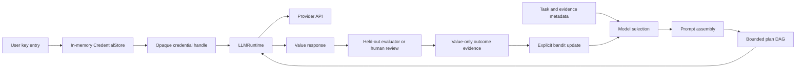

# Autonomous brain runtime

The autonomous brain is split into a deterministic decision kernel and an application-owned
provider runtime.



## Credential lifecycle

Applications collect provider keys themselves. The SDK supports three caller-owned entry points:

```python
from prism_sdk import CredentialStore, LLMRuntime, ProviderRequest, openai_provider
from prism_sdk.brain import AutonomousBrain, BrainLearningLedger

credentials = CredentialStore()
handle = credentials.prompt("openai")  # getpass: terminal input is not echoed

runtime = LLMRuntime(credentials)
runtime.register_provider(openai_provider())
response = runtime.invoke(
    "openai",
    ProviderRequest(
        model="gpt-5",
        messages=({"role": "user", "content": "Compile the next bounded research step."},),
    ),
    credential=handle,
)
credentials.revoke(handle)
```

The same `register(provider, value)` method is intended for a UI password field, and
`register_environment(provider, "OPENAI_API_KEY")` is intended for server deployments that use an
environment or secret-manager injection. The value is held only in process memory. Handles expose
only provider, opaque identifier, and `secret_persistence: in_memory_only`; they do not implement a
secret serialization path. Provider failures do not return upstream response bodies because a
proxy or upstream error can echo request headers.

The core brain and MCP tools never accept `api_key`, `secret`, `Authorization`, or an environment
variable value. They accept model metadata and opaque outcome references only. Do not put a handle
or a key into a plan's arbitrary `arguments` object; pass the handle to `LLMRuntime.invoke` at the
runtime boundary.

The OpenAI adapter targets the Responses API (`POST /v1/responses`) and Bearer authentication, as
described in the [OpenAI API reference](https://platform.openai.com/docs/api-reference/introduction)
and [quickstart](https://platform.openai.com/docs/quickstart/make-your-first-api-request). The
adapter sets no provider-side persistence option implicitly beyond the request shape; applications
must choose their provider data-retention posture separately.

## Decision loop

The `bioprism-brain` crate exposes six value-only operations through MCP:

- `brain_model_select` applies capability, context-window, quality, latency, and cost gates, then
  ranks eligible models with deterministic utility plus an exploration bonus.
- `brain_prompt_assemble` orders required and prioritized context under a hard input budget. It
  refuses when required material does not fit and reports optional omissions with a prompt digest.
- `brain_plan` validates an allow-listed dependency DAG, orders it deterministically, checks cost,
  and marks provider calls or external effects as approval-required. It never executes.
- `brain_bandit_select` uses caller-persisted UCB-style arm statistics. Unexplored arms receive an
  explicit exploration bonus and disabled arms are excluded.
- `brain_bandit_update` accepts one bounded evaluator reward and returns the next state. A provider
  response is never treated as a reward without an explicit evaluator update.
- `brain_outcome_record` binds a completed run, selected arm, and explicit evaluator assessment to
  the next bandit state. It emits a tamper-evident, value-only learning evidence record and never
  accepts provider response text, API keys, or credentials.

The state is caller-owned so a restart, replay, or audit can identify the exact model observations,
prompt digest, plan digest, response metadata, and reward that produced a decision. The current
bandit is an online adaptation kernel, not a claim that the system has learned a biological or
general-world policy. Rewards should be generated by a held-out evaluator, safety gate, or human
review process with its own provenance.

## Provider-neutral boundary

The current Python runtime supports:

- OpenAI Responses (`openai_provider()`);
- Anthropic Messages (`anthropic_provider()`); and
- OpenAI-compatible Chat Completions (`openai_compatible_provider(...)`).

All use the same `ProviderRequest` and `ProviderResponse` contract. The runtime does not follow
redirects, does not allow plain HTTP unless explicitly enabled for local/test use, bounds response
bytes, retries only classified transient failures, opens a per-provider circuit after repeated
failures, and can parse/validate bounded structured JSON locally. `AutonomousBrain.run` exposes
output limits, temperature, structured-output requirements, response schemas, and idempotency
keys without exposing credential material. Streaming and provider-native tool calling remain
separate runtime layers; they must preserve the same credential, approval, and value-only learning
boundaries.

## Run, evaluate, and learn

The model response is not self-rewarding. A caller owns the evaluator and persists only the
evidence returned by the Rust kernel:

```python
ledger = BrainLearningLedger("./state/brain-learning.jsonl")
result = brain.run(
    task="Summarize the bounded evidence packet.",
    model_selection=selection_request,
    prompt=prompt_request,
    plan=plan_request,
    credentials={"openai": handle},
    approve_provider_call=True,
    require_json=True,
    response_schema={
        "type": "object",
        "required": ["summary"],
        "properties": {"summary": {"type": "string", "minLength": 1}},
        "additionalProperties": False,
    },
)
brain.record_evaluator_outcome(
    result,
    bandit_state=bandit_state,
    evaluator_id="held-out-quality-v1",
    evaluator_version="1",
    reward=0.8,
    passed=True,
    ledger=ledger,
)
```

The caller may feed `ledger.latest_state()` into the next `brain_bandit_select` request after
reviewing the evaluator provenance. The ledger is append-only, bounded, fsynced per record, and
rejects secret-shaped fields. This is online bandit adaptation over explicit observations—not an
unbounded self-modifying policy and not a claim of general intelligence.

## Safety boundary

This is research/developer infrastructure. The brain does not diagnose, recommend treatment,
enroll participants, or grant clinical authority. A successful model invocation is an observation,
not a scientific or clinical claim. External tool execution must pass the existing capability,
mission, runtime-effect, safety, and approval gates.
