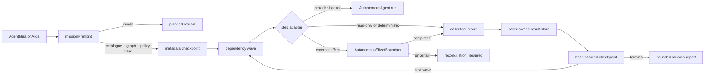

# Autonomous brain runtime

The autonomous brain is split into a deterministic decision kernel and an application-owned
provider runtime.

```mermaid
flowchart LR
    U[Protected UI or no-echo entry] --> CS[In-memory CredentialStore]
    D[Deployment environment or secret manager] --> CP[CredentialProvisioner]
    CP --> CS
    CS --> H[Opaque credential handle]
    H --> RT[LLMRuntime]
    RT --> P[Provider API]
    Q[Task and evidence metadata] --> MS[Model selection]
    MS --> CR[Cross-domain capability route]
    CR --> DP[Reviewed domain capability pack]
    CR --> PA[Prompt assembly with bounded tool schemas]
    DP --> PA
    PA --> PL[Bounded plan DAG]
    PL --> RT
    RT --> ST[Bounded SSE stream]
    ST --> O[Value response or typed tool intent]
    O --> MP[Structured mission proposal]
    MP --> MF[agent_mission preflight]
    MF --> MD[Caller dispatch approval]
    MD --> ME[Bounded multi-step executor]
    O --> EV[Held-out evaluator or human review]
    EV --> OE[Value-only outcome evidence]
    OE --> BU[Explicit bandit update]
    BU --> MS
```



## Credential lifecycle

Applications collect provider keys themselves. The SDK supports four caller-owned entry points:

```python
from prism_sdk import (
    CredentialStore,
    LLMRuntime,
    MissionPolicy,
    ProviderOnboarding,
    ProviderRequest,
    anthropic_provider,
    openai_provider,
)
from prism_sdk.brain import AutonomousBrain, BrainLearningLedger

credentials = CredentialStore()
runtime = LLMRuntime(credentials)
onboarding = ProviderOnboarding(runtime)
onboarding.register_provider(openai_provider())
onboarding.register_provider(anthropic_provider())
handle = onboarding.configure_from_prompt("openai")  # or configure_from_environment(...)
response = runtime.invoke(
    "openai",
    ProviderRequest(
        model="gpt-5",
        messages=({"role": "user", "content": "Compile the next bounded research step."},),
    ),
    credential=handle,
)
onboarding.revoke(handle)
```

For a UI request, browser session, or server job that may collect more than one provider key,
group the handles in a short-lived `CredentialSession`:

```python
import os

with onboarding.start_session(ttl_seconds=3_600) as session:
    session.configure_from_prompt("openai")
    session.configure_from_environment("anthropic", environ=os.environ)
    openai_handle = session.handle("openai")
    # pass only openai_handle to the provider runtime / brain call
    print(session.status().to_dict())  # redacted readiness only
```

Session expiry and `close()` revoke every handle created through the session. A deployment that
needs persistence should persist only a secret-manager reference outside this SDK and use
`configure_from_resolver(...)` to recreate short-lived handles after restart; the SDK never
persists the key or the reference.

`ProviderOnboarding` is the standard BYOK process. It requires non-secret provider transport
metadata first, then supports no-echo prompt entry, environment injection, protected UI
submission, or an external resolver callback for a secret-manager reference. `instructions()` is
the UI-facing contract: it reports whether the provider is registered, whether a credential is
ready, the next action, the supported input methods, and the provider's default environment
variable. It never returns a key. `status()` and `statuses()` return the same redacted readiness
(`register_provider`, `collect_user_credential`, or `ready`) without returning keys or handles.
`revoke()` removes the in-memory entry, and TTL expiry is purged before resolution or status
reporting. The value is held only in process memory. Handles expose only provider, opaque
identifier, source, expiry, and `secret_persistence: in_memory_only`; they do not implement a secret
serialization path. Provider failures do not return upstream response bodies because a proxy or
upstream error can echo request headers.

The application-level key intake process is therefore:

1. Register the provider's non-secret transport configuration during service startup.
2. Ask `onboarding.instructions(provider).to_dict()` (or
   `agent.credential_instructions(provider)`) for the redacted onboarding contract; a UI should
   render only that state and never put a key in browser-visible JSON.
3. Collect the key over the application's protected input path, or resolve it from the deployment's
   secret manager. For a UI submission, the raw value goes directly into
   `session.collect_user_credential(provider, value)`; the other paths are
   `configure_from_prompt`, `configure_from_environment`, or `configure_from_resolver`. It never
   goes into an LLM prompt, MCP argument, model catalogue, plan, learning ledger, or
   browser-visible JSON response.
4. Keep the returned handle server-side inside a short-lived `CredentialSession`, pass that handle
   only to `LLMRuntime`/`AutonomousBrain`, and expose `session.status()` or `onboarding.status()`
   to the UI as the readiness view.
5. Revoke the session after the request/job, or let its TTL expire. After a process restart, resolve
   the external reference again instead of attempting to serialize or restore the handle.

This means the SDK deliberately does not create a universal key-upload HTTP endpoint: the embedding
application owns authentication, TLS, CSRF protection, tenancy, rate limits, and secret-manager
permissions. The SDK owns the sensitive part after intake—non-echo collection helpers, bounded
in-memory lifetime, opaque handles, provider matching, expiry/revocation, and redacted readiness.

### Non-interactive deployment bootstrap

When no person enters a key, the deployment should register a source resolver during service
startup and let each process create fresh handles. `CredentialProvisioner` is the process-local
registry for that wiring. It accepts an environment variable name or a secret-manager reference
and callback, but its plan exposes only source labels and a reference digest. The reference and
callback are never placed in activation state, learning state, job metadata, or the provider
prompt.

```python
agent.register_provider(openai_provider())
agent.register_environment_credential_source("openai")

session, bootstrap = agent.start_provisioned_credential_session(
    providers=("openai",),
    ttl_seconds=3_600,
)
try:
    if not bootstrap.ready:
        raise RuntimeError(bootstrap.to_dict()["required_failures"])
    result = agent.run(
        task="review the next bounded implementation step",
        domain="coding",
        credentials=session,
        approve_provider_call=True,
    )
finally:
    session.close()
```

For a secret manager, replace the environment registration with the deployment's resolver
callback. The callback is invoked only inside the process that owns the session:

```python
agent.register_secret_manager_credential_source(
    "openai",
    "secret-manager://prod/aurora/openai",
    secret_manager.read,
    source_label="production provider credential",
)
session, bootstrap = agent.start_provisioned_credential_session(
    providers=("openai",),
    require_ready=True,
)
try:
    # The brain receives only session.handles(), never the reference or returned value.
    result = agent.run(
        task="produce a bounded implementation review",
        domain="coding",
        credentials=session,
        approve_provider_call=True,
    )
finally:
    session.close()
```

`agent.credential_provisioning_plan()` is the safe readiness contract for an operator or
deployment controller. `start_provisioned_credential_session()` fails closed on missing required
providers and returns a value-only receipt for each source attempt. Multiple sources are tried in
registration order, so an environment source can be a local-development path with a secret-manager
fallback; failed resolver messages are reduced to an error class. Re-registering a source with
`replace_existing=True` is the rotation path, while unregistering it does not silently revoke an
already-issued session.

The three agent-level `run_resumable_learning_job`, `run_resumable_workflow_job`, and
`run_resumable_cross_domain_job` wrappers apply the same bootstrap at each worker attempt. They
create a fresh session, inject only a transient handle mapping into the caller resolver result,
feed the current provider-health snapshot to the durable brain job, and close the session after
the attempt. A restarted worker therefore re-registers its deployment source and re-resolves a
fresh credential instead of restoring an expired handle from the job journal.

For a protected UI, the minimal request lifecycle is:

```python
with agent.start_credential_session(ttl_seconds=3_600) as session:
    # The application renders this redacted object before showing its password field.
    setup = session.instructions("openai").to_dict()
    if setup["next_action"] == "collect_user_credential":
        # `submitted_key` must come from the app's authenticated, encrypted form handler.
        session.collect_user_credential("openai", submitted_key, ttl_seconds=3_600)
    if session.instructions("openai").ready:
        result = agent.run(
            task="Bound the next research step",
            domain="research",
            credentials=session,
            approve_provider_call=True,
        )
```

The app should discard `submitted_key` after the call, keep only the live session server-side,
and call `session.close()` (provided automatically by the context manager) when the request or job
ends. This is an intake boundary, not a key verifier: the first approved provider invocation is
where provider authentication is tested, and any returned failure remains redacted.

The core brain and MCP tools never accept `api_key`, `secret`, `Authorization`, or an environment
variable value. They accept model metadata and opaque outcome references only. Do not put a handle
or a key into a plan's arbitrary `arguments` object; pass the handle to `LLMRuntime.invoke` at the
runtime boundary.

## Application composition and model inventory

The lower-level APIs intentionally make every decision input visible. An embedding application can
use `AutonomousAgent` when it wants one composition object that still preserves those boundaries:

```python
from prism_sdk import AutonomousAgent, ModelCatalogue, openai_provider

agent = AutonomousAgent(workspace, runtime, model_catalogue=ModelCatalogue([
    {
        "provider": "openai",
        "model": "gpt-5",
        "capabilities": ["reasoning", "code", "science"],
        "context_window_tokens": 128_000,
        "max_output_tokens": 16_000,
        "quality": 0.8,
        "reliability": 0.9,
        "latency_ms": 900,
        "cost_per_million_tokens": 10,
    }
]))
agent.register_provider(openai_provider())

with agent.start_credential_session(ttl_seconds=3_600) as session:
    session.configure_from_environment("openai")  # or protected UI / secret-manager resolver
    result = agent.run(
        task="review the next bounded implementation step",
        domain="coding",
        credentials=session,
        approve_provider_call=True,
    )
```

`AutonomousAgent` may also be constructed with caller-owned `BrainLearningLedger` and
`BrainEpisodicMemory` instances. `agent.learning_state()` resumes the latest value-only bandit
state or returns the explicit empty state used for first-run exploration; `run(..., learn=True)`
uses that state automatically unless the caller supplies another state. The ledger and memory
remain append-only/value-only persistence owned by the embedding application.

`ModelCatalogue` stores only deterministic model metadata and rejects credential-shaped metadata
fields; it is safe to populate before a user has supplied any key. `agent.readiness()` projects
provider registration, credential readiness, and model eligibility without exposing secret material.
For UI integrations, `agent.credential_status(provider)` and `agent.credential_statuses()` expose
the same redacted onboarding state, while `agent.start_credential_session()` creates the
request-scoped handle group. The application sends the entered value directly to
`session.collect_user_credential()` over its protected input boundary; no generic brain or MCP endpoint
accepts the raw key.

The TypeScript façade exposes the same onboarding idea through a domain-wide readiness audit:

```typescript
const report = await agent.readiness();
// twelve domain rows, model/provider gates, tool coverage, learning contexts, and next actions
```

`AutonomousAgent.readiness()` is provider-free and tool-free. It reads only caller-registered
provider metadata, in-memory opaque credential status, registered model declarations, persisted
health projections, and the optional live tool catalogue; it never calls a model-discovery
endpoint, sends a prompt, executes a tool, or returns a key. The report uses the shared
`bioprism-autonomous-agent-readiness/0.1` schema and emits one row for each of coding, browser,
data, science, biomedical, neuroscience, operations, enterprise, multi-agent, multimodal,
cross-domain, and evaluation. Each row includes required model capabilities, compatible and
eligible counts, missing tool names, a digest of the normalized learning context, and next
actions. `ready_for_caller_approval` means local gates pass; it does not authorize provider
invocation or external effects. Passing `candidates: []` is supported so an onboarding screen can
report `model_catalogue_required` before any model is configured. The report also distinguishes
provider registration, credential collection, capacity/capability gaps, and mixed `partial`
states instead of collapsing them into a misleading boolean.

If `learn=True` is supplied, the same
facade runs the explicit evaluator and caller-owned bandit state through the existing online
learning path; it does not turn a provider response into a reward automatically. An application
can still call `AutonomousTaskOrchestrator` directly when it needs to provide every candidate
mapping or policy field itself.

### Reviewed capability packs for every domain

The domain profile and workflow are joined by an `AutonomousDomainPack` for every built-in domain:
coding, browser, data, science, biomedical, neuroscience, operations, enterprise, multi-agent,
multimodal, cross-domain, and evaluation. A pack is a versioned, SHA-256-addressed contract
containing required model capabilities, reviewed tool capability labels, workflow and evaluator
identity, required evidence signals, planning principles, and review triggers.

```python
packs = agent.domain_packs()
coding_pack = agent.domain_pack("coding")
tool_plan = agent.domain_pack_tool_plan("coding")
```

`prepare()` binds `domain_pack_id`, `domain_pack_digest`, evidence requirements, review triggers,
and evaluator identity into transient selection context. The prompt receives the same redacted
contract as a required developer context block, and the plan includes the pack digest so a later
evaluator can identify the reviewed contract behind it. `prepare_auto()` and cross-domain fan-out
therefore carry a domain contract from provider-free route selection to execution.

When the agent automatically exposes registered domain tools, it first selects tools whose
declared capability matches the pack. If no registered tool matches, caller-defined tools remain
visible for compatibility and application-specific extensions; this fallback does not authorize
anything. Tool registration, provider approval, effect policy, and caller approval remain
independent gates. `agent.readiness()` reports the pack catalogue, registry digest, and per-domain
tool-capability coverage so a UI can show what is configured versus what is still missing.

The TypeScript registry now makes the task-level portfolio decision explicit through
`AutonomousDomainToolRegistry.planForTask()`. It walks the reviewed workflow stages for the
selected domains, chooses a bounded set of exact live tool names by stage coverage and deterministic
task relevance, and returns omissions when the catalogue, activation allow-list, or tool budget
cannot cover a stage. The task is hashed for the public plan; raw task text is not returned, and
the method performs no provider or tool call.

```typescript
const registry = await AutonomousDomainToolRegistry.create(liveCatalogue);
const portfolio = await registry.planForTask(
  "debug the repository, verify CI, and report reproducible findings",
  { domains: ["coding", "evaluation"], maxTools: 12 },
);
// Inspect portfolio.coverage and portfolio.omissions before execution.
// portfolio.authorization remains selection_does_not_authorize_tools_or_effects.
```

Each coverage row distinguishes `selected`, `activation_required`, `catalogue_missing`,
`provider_only`, and `capacity_limited`. A blueprint uses this portfolio by default for single
domain and cross-domain work; explicit caller tools remain compatibility input but are still
subject to activation, catalogue, provider, and effect gates. This keeps model-visible tools
small enough to be useful without converting discovery or selection into authority.

Packs do not contain task text, prompts, keys, provider payloads, tool arguments, or outputs. They
are reviewed planning and evidence metadata, not a source of truth. A production application can
replace a pack registry, but the orchestrator refuses to run when a pack is missing or its workflow
or evaluator mapping is inconsistent with the selected domain registries.

### Domain-specific evaluation and held-out replay

`DomainEvaluatorRegistry.with_builtin_autonomous_profiles()` adds an exact evaluator contract for
each of the twelve autonomous domains while retaining the original canonical engineering and
research evaluator keys for older control-plane callers. Autonomous learning prefers the exact
domain adapter and falls back to the profile's canonical evaluator only when a caller supplied a
legacy registry. Each specialized adapter has its own evaluator identity and required signals;
for example, browser work requires traceable evidence, source comparison, freshness reporting, and
claim-scope discipline, while operations requires safety, approval, rollback, and optional
observability evidence.

```python
from prism_sdk import DomainEvaluatorRegistry

evaluators = DomainEvaluatorRegistry.with_builtin_autonomous_profiles()
adapter = evaluators.resolve_for_autonomous_domain(
    "neuroscience",
    fallback_domain="biomedical",
)
decision = adapter.assess_value_only_input({
    "schema": "bioprism-brain-evaluator-input/0.1",
    "result_kind": "offline_replay",
    "run_id": "held-out-case-001",
    "evidence_digest": evidence_digest,
    "evidence": held_out_evidence,
})
```

Held-out replay still receives only caller-normalized signal values, reference digests, and
limitations. It never sees provider text, prompts, credentials, tool arguments, or tool outputs.
`BrainReplayEngine` can replay all twelve exact-domain contracts, compare expected decision
digests, and update a caller-owned bandit state. The evidence domain is allowed to carry the
legacy canonical alias, but the exact autonomous adapter remains the evaluator identity recorded
in the learning and replay receipt.

`resolve()` remains canonical-first for compatibility with older control-plane code. Autonomous
orchestration uses `resolve_for_autonomous_domain()` so overlapping names such as `data`,
`operations`, and `biomedical` receive their exact specialized contracts rather than silently
using the legacy canonical profile.

For restart-safe provider adaptation, give the agent a caller-owned `ProviderHealthLedger`:

```python
from prism_sdk import AutonomousAgent, ProviderHealthLedger

health = ProviderHealthLedger("state/provider-health.jsonl")
agent = AutonomousAgent(
    workspace,
    runtime,
    model_catalogue=catalogue,
    health_ledger=health,
)
```

The agent registers a value-only runtime observer that appends provider/model, success or
failure, latency, status code, circuit state, and bounded usage metadata. On every subsequent
`run()` it merges the latest historical `provider_health` and `model_health` overlays into model selection, while
preserving explicit caller overrides. Open circuits remain a hard gate until their recorded
expiry; expired historical circuits become closed and can be probed again. `health.to_dict()` and
`agent.readiness()` expose only this redacted operational summary. The ledger rejects secret-shaped
fields and never stores API keys, request messages, response text, headers, credential handles, or
model prompts. This is complementary to `BrainLearningLedger`: provider health describes
transport reliability, while evaluator rewards describe task quality and drive bandit adaptation.

The runtime also keeps a process-local value-only counter for immediate adaptation. Each completed
or refused invocation updates provider-level and provider/model-level attempts, successes,
failures, success rate, last/mean latency, status, circuit projection, and bounded token totals.
The provider view is available through `LLMRuntime.provider_status()` and the arm view through
`LLMRuntime.model_health_snapshot()` / `model_status()`. When the brain builds its next selection,
durable model evidence is preferred for an observed arm, then durable provider evidence, then the
live process equivalent. A capped-confidence blend nudges the specific model arm's reliability
and latency priors toward observed transport behavior. Twelve observations are enough to reach
the maximum 0.75 evidence weight, so a single transient failure cannot erase an
application-supplied prior. Model evidence is not an independent circuit: only the provider
circuit can hard-disable all sibling models. This update is transport evidence only: it never
becomes evaluator reward and cannot override capability, credential, cost, approval, or circuit
gates.

Failover refreshes the same live gate after every provider refusal. A model-specific timeout
disables only that arm for the bounded retry sequence, allowing a healthy sibling model on the
same provider to be selected. Transport, provider HTTP, or circuit failures remain provider-scoped.
If the runtime circuit opens, or the error is explicitly marked
`circuit_open`, all remaining arms for that provider are disabled for the bounded retry sequence
and the receipt records the post-failure circuit, consecutive failures, evidence count, success
rate, and gate decision. This prevents a circuit outage from being retried once per model while
still allowing a different healthy provider to continue when the caller's failover budget allows.

The same façade covers the long-horizon forms of autonomy. `prepare_cross_domain()` creates a
bounded specialist fan-out and synthesis blueprint; `run_cross_domain()` resolves catalogue
candidates and credential-session handles once, then applies the same provider-health overlay to
each child and the synthesis call. `run_workflow()` executes a checkpointable stage DAG and
automatically resumes the latest value-only bandit state, while `run_workflow_learning()` applies
one explicit evaluator update per completed stage and resumes from the latest ledger state unless
the caller supplies an override. This keeps single-task, staged, and cross-domain execution on
the same authorization, BYOK, model-selection, and learning boundaries.

For a real delayed-feedback deployment, call `brain.prepare_learning_episode(result, ledger=ledger)`
immediately after a provider, tool-loop, or mission result. The ledger stores a bounded evaluator
projection, the selected arm, and digest-bound identity only; it does not store the provider
response or the evidence packet. A later reviewer, evaluator worker, or reconciliation process can
load `ledger.pending_episodes()`, rehydrate its separately owned evidence, and call
`BrainOutcomeEvaluator.evaluate_episode(...)`. Settlement verifies the evidence digest, binds the
reward to the original selection/prompt/plan/outcome identity, advances the Rust bandit, and marks
the episode settled through the replay metadata. Reusing a settled identity is refused. If a first
run begins with `arms=[]`, the selected `provider/model` arm is bootstrapped before the update, so
the documented first-run exploration state is executable rather than a dead-end.

The application-facing equivalent keeps the brain behind the same `AutonomousAgent` boundary:

```python
episode = agent.prepare_learning_episode(
    completed_result,
    evidence=caller_owned_evidence,
    episode_id="job-123-attempt-0",
)
# Persist only episode.to_dict() in the application/job store. After restart:
decision, report = agent.settle_learning_episode(
    agent.restore_learning_episode(saved_episode),
    domain="coding",  # resolves the reviewed built-in evaluator
    evidence=caller_owned_evidence,
)
```

For delayed multi-step credit, `agent.prepare_learning_trajectory(...)` and
`agent.restore_learning_trajectory(...)` provide the same restart-safe boundary, while
`agent.settle_learning_trajectory(...)` requires one explicit evaluator for the whole ordered
sequence. This API works for every provider, tool-loop, mission, workflow, and cross-domain result;
the agent persists only value-only projections and replay digests, never keys, prompts, task text,
responses, tool arguments, or raw evidence.

`AutonomousAgent.run_cross_domain_learning()` applies this same loop between fan-out members and
the synthesis call. Child results are scored in declaration order, the next child receives the
updated value-only state, and synthesis receives all preceding updates. Evidence may be supplied
as a bounded mapping keyed by child id plus `synthesis`; without evidence, the evaluator remains
the only authority and can conservatively return a zero or incomplete reward. This is the generic
online-learning path for coding, browser, data, science, biomedical, neuroscience, operations,
enterprise, multi-agent, multimodal, evaluation, and cross-domain profiles; it does not infer a
reward from HTTP success or from the model's own claims.

The durable objective adapter closes the loop between these learners and goal state. Use
`AutonomousTaskOrchestrator.run_goal_learning_step(...)` for a single-domain goal and
`run_cross_domain_goal_learning_step(...)` for fan-out/fan-in goals. Both select the existing
online, trajectory, or bounded replan learner, pass explicit evaluator evidence into the bandit,
and settle the goal from three value-only digests: evaluator decisions, the next bandit state,
and progress/attempt identities. A caller-provided `cycle_id` is hashed into progress state so a
restart can correlate the same logical objective without putting task text, provider output,
replan instructions, credentials, or raw evidence in the goal ledger. The learning runner still
requires the normal model candidates, opaque credential handles, provider approval, and memory
boundaries; this adapter never creates or accepts a raw API key.

For multi-step credit assignment, use `brain.prepare_learning_trajectory(...)` to group ordered
provider, tool-loop, or mission results into a bounded value-only trajectory. A later evaluator can
settle it with `BrainOutcomeEvaluator.evaluate_trajectory(...)`; step `i` receives a clamped
discounted return-to-go (`reward_i + discount * return_(i+1)`) and an optional terminal reward. The
trajectory ledger remains restart-safe: each episode is registered before settlement, each replay
record binds `trajectory_id`, step index, raw reward, credited reward, and evidence digest, and a
settled or unregistered episode is refused. The raw provider response, prompt, task text,
credential handle, and evaluator evidence packet are never stored in the trajectory.

Use `run_adaptive_mission_learning_cycle(..., trajectory_discount=0.9)` when re-planning decisions
must happen between mission attempts but the bandit update should wait until the complete attempt
sequence is known. Use `run_workflow_trajectory_learning(...)` for a staged DAG and
`run_cross_domain_trajectory_learning(...)` for specialist fan-out plus synthesis. The latter
requires one caller-supplied evaluator identity for the whole trajectory so coding, data, and
synthesis rewards remain comparable; domain-specific rubrics should be composed into that
value-only evaluator by the application. These modes intentionally trade within-run state updates
for correct delayed credit and avoid double-counting immediate and terminal rewards.

The Rust bandit state now supports three auditable policy modes. The backward-compatible default is
`strategy: "ucb1"`; `strategy: "epsilon_greedy"` uses `epsilon` and a public `seed` to make every
exploration draw deterministic from the caller-owned generation and replayable from the selection
report; `strategy: "thompson_sampling"` converts bounded evaluator rewards into fractional Beta
posterior evidence and draws a deterministic per-arm posterior sample. Thompson selection emits
posterior alpha, beta, and sample values in the ranking so a caller can audit why exploration won.
The posterior is built only from explicit evaluator credit, adds the declared failure penalty to
the negative mass, and never treats provider transport success as a reward. Unknown strategies,
invalid epsilon values, non-finite rewards, disabled arms, and empty eligible sets are refused. A
policy choice remains routing evidence—not permission, truth, or a claim of biological
reinforcement learning.

Model selection also supports an optional `min_selection_confidence` floor. The kernel computes a
bounded normalized separation between the top two eligible ranks (a unique eligible model is
confidence `1.0`) and returns `abstained_low_selection_confidence` when the floor is not met.
Python and TypeScript forward the same floor before provider dispatch, so ambiguous model priors
become a review state rather than an overconfident call. This confidence is rank stability only,
never a probability that the selected model's answer is correct.

### Provider-free automatic domain routing

Explicit `run(..., domain=...)` remains the strongest integration boundary, but an application does
not always know the domain at intake. `AutonomousTaskRouter` provides a deterministic first pass
over the complete built-in catalogue (`coding`, `browser`, `data`, `science`, `biomedical`,
`neuroscience`, `operations`, `enterprise`, `multi_agent`, `multimodal`, `cross_domain`, and
`evaluation`):

```python
from prism_sdk import AutonomousAgent

proposal = agent.route(
    task="compare EEG and fMRI preprocessing choices for a reproducible study",
    min_confidence=0.25,
    min_margin=0.10,
)
print(proposal.to_dict())  # digests, fixed-term evidence, confidence, and abstention state

blueprint = agent.prepare_auto(
    task="write Python code for the dataset quality pipeline",
    allow_cross_domain=True,
)
```

The router matches only reviewed fixed vocabulary and profile labels. It never calls a provider,
stores the task text, grants a tool, or infers authorization. A strong separated match selects one
domain; close matches can select a bounded cross-domain fan-out; no evidence, low confidence, or
insufficient margin produces `abstained=true`. `prepare_auto()` converts a routed result into the
same normal blueprint and workflow contracts used by explicit execution, while an abstained result
contains no executable blueprint.

For an application that wants the route-and-execute convenience, `agent.run_auto(...)` uses the
same opaque credential session, provider approval, tool authorization, execution journal, health
ledger, and learning arguments as `run()`/`run_cross_domain()`. It returns
`status="route_review_required"` without making a provider call when routing abstains. The result
is a routing proposal, not a claim that classification is correct; callers should allow a human or
domain-specific classifier to override it before high-impact work.

The route catalogue is included in `agent.readiness()` as `route_catalogue`, alongside the domain
profiles and workflow contracts. This lets a UI explain the available routes without showing task
text, prompts, credentials, or provider payloads. The TypeScript SDK exposes the corresponding
`AutonomousRouteProposal`, `AutonomousAutoBlueprint`, and `AutonomousAutoResult` wire types.

### BYOK semantic routing and automatic planning

The fixed-vocabulary router is intentionally useful without a key, but it cannot understand a
new phrase merely because that phrase is absent from the reviewed catalogue. A caller that has
collected a provider key may opt into one additional, approval-gated classifier call:

```python
with agent.start_credential_session(ttl_seconds=3_600) as session:
    session.collect_user_credential("openai", protected_user_value)
    result = agent.run_auto(
        task="compare synaptic oscillation artifacts across two measurement protocols",
        credentials=session,
        approve_provider_call=True,
        semantic_routing=True,
    )
    if result.status == "route_review_required":
        send_to_review(result.to_dict())
```

`route_with_provider()` and `prepare_auto_with_provider()` pass the transient task and the
reviewed twelve-domain catalogue to a selected model under a strict JSON schema. The model must
score every domain, declare selected domains, and provide an abstention decision. The SDK fuses
those scores with the provider-free evidence, binds the resulting route digest into the normal
domain pack, evaluator, prompt, plan, and tool-selection context, and only then creates a
blueprint. `run_auto(..., semantic_routing=True)` performs the same routing step before normal
execution. The routing call and the eventual execution call each retain their own approval and
budget boundary.

For a routed single-domain task that should follow the domain workflow instead of one provider
decision, opt into the staged runner explicitly:

```python
result = agent.run_auto(
    task="fix the Rust tests in the repository",
    credentials=session,
    workflow_execution=True,
    workflow_max_stage_calls=2,  # persist result.result.checkpoint for continuation
    approve_provider_call=True,
)
```

The outer result remains `status="completed"` at the intake envelope while the nested workflow
may be `paused`, `approval_required`, or `stage_blocked`. Pass its caller-owned checkpoint back
through `workflow_checkpoint` to continue without replaying completed stages. Cross-domain routes
keep their specialist fan-out/synthesis path; they are never silently coerced into a
single-domain workflow. A provider planning proposal becomes executable only when the caller
passes a completed, non-review `AutonomousPlanRefinementResult` as `accepted_plan_refinement`.
The runner verifies its task, base-plan, workflow, and dependency digests, uses it only to choose
among currently-ready stages, and binds its digest into every checkpoint so a different plan
cannot be substituted during resume.

The automatic entrypoint can also perform that planning step itself when the caller opts into
`planning_mode="provider"`:

```python
result = agent.run_auto(
    task="fix the Rust tests in the repository",
    credentials=session,
    planning_mode="provider",
    workflow_max_stage_calls=2,
    approve_provider_call=True,
)
if result.status == "planning_review_required":
    send_to_review(result.planning.to_dict())
```

Provider planning is a separate, explicit model call after routing. For one domain it promotes
the request into the reviewed checkpointable workflow automatically; for a cross-domain route it
can reorder only the existing `route-*` specialists. The same provider approval is required for
both calls. Missing approval, malformed JSON, dependency disagreement, abstention, or
`review_required=true` returns `planning_review_required` with no execution result. A successful
non-review proposal is accepted only because the caller explicitly selected this planning mode;
the runner still verifies the task, workflow, domain-pack, and base-plan digests before any stage
or specialist call. The returned automatic result includes the metadata-only planning proposal
and `planning_mode`, while the planner transcript, task text, credentials, and provider payload
remain transient.

The same intake path exposes explicit online-learning choices. Use
`workflow_learning=True` with caller-supplied stage evidence to update the value-only bandit
after each completed stage; use `workflow_trajectory_learning=True` with a discount and optional
terminal reward when credit should wait for the assembled trajectory:

```python
result = agent.run_auto(
    task="fix the Rust tests in the repository",
    credentials=session,
    workflow_execution=True,
    workflow_learning=True,
    workflow_stage_evidence={
        "scope": {"signals": {"schema_valid": 1.0}},
        "inspect": {"signals": {"evidence_complete": 1.0}},
    },
    bandit_state=caller_owned_bandit_state,
    approve_provider_call=True,
)
```

Missing evidence is a conservative evaluator failure, never an inferred success. The two modes
are mutually exclusive, and `learn=True` is rejected for staged intake unless one of these
explicit modes is selected. This keeps provider transport success, task quality, and delayed
credit assignment separate while still allowing automatic intake to drive the full online loop.

For an application that wants one learning control across every automatic route, use
`learning_mode` instead of repeating route-specific flags:

```python
result = agent.run_auto(
    task="fix the Rust tests in the repository",
    credentials=session,
    learning_mode="online",  # off | online | trajectory
    evidence={"signals": {"tests_passed": True}},
    approve_provider_call=True,
)
```

After the provider-free route is known, `online` selects ordinary single-domain learning,
workflow learning when `workflow_execution=True`, or sequential cross-domain learning. It starts
from `agent.learning_state()` unless the caller supplies `bandit_state`. `trajectory` selects
discounted delayed credit for a staged workflow or cross-domain fan-out/synthesis and therefore
requires `workflow_execution=True` on a single-domain route. The selected mode is returned in
`result.to_dict()["learning_mode"]`. These shortcuts only select an existing evaluator loop:
they do not turn provider success into reward, invent evidence, or persist credentials.

Provider output never becomes authorization. Invalid JSON, missing domains, out-of-range scores,
provider disagreement, abstention, insufficient confidence, or insufficient margin all produce a
non-executable review result. A semantic route cannot add a domain, capability, tool, effect,
credential, or model permission outside the reviewed registries. `AutonomousSemanticRouteResult`
retains only bounded scores, route metadata, model identity, and digests; it explicitly excludes
the classifier transcript and task text. A caller can use `semantic_weight`, `max_domains`,
`allow_cross_domain`, contextual observations, the health overlay, and the persisted bandit state
to control how exploration and reliability affect the classifier invocation without allowing
learning to bypass safety gates.

Planning can be improved under the same BYOK boundary after a deterministic blueprint exists:

```python
blueprint = agent.prepare(
    task="fix the Rust tests in the repository",
    domain="coding",
)
refinement = agent.plan_with_provider(
    blueprint=blueprint,
    credentials=session,
    approve_provider_call=True,
)
if refinement.status != "completed" or refinement.review_required:
    send_to_review(refinement.to_dict())
```

The planning contract requires the model to return every existing workflow stage exactly once in
dependency-safe priority order, plus an optional focus subset. It cannot add or remove stages,
alter workflow or domain-pack identity, invent capabilities, or authorize any tool or effect.
`AutonomousPlanRefinementResult` retains only stage identifiers, confidence, model identity, and
digests; accepting the proposal remains an application decision. This keeps model-generated
planning useful for novel tasks while preserving deterministic workflow and caller approval as
the execution authority.

Cross-domain fan-out can use the same bounded planning boundary. The planner receives the
transient parent and child task context plus reviewed child workflow, domain-pack, capability,
and synthesis metadata. It may reorder and focus existing specialists, but it cannot add a
domain, alter a workflow, grant a tool, or authorize synthesis:

```python
cross_blueprint = agent.prepare_cross_domain(
    task="combine the implementation review with the migration-quality review",
    subtasks=(
        {"id": "engineering", "task": "review implementation risk", "domain": "coding"},
        {"id": "data", "task": "review schema and lineage risk", "domain": "data"},
    ),
)
refinement = agent.plan_cross_domain_with_provider(
    blueprint=cross_blueprint,
    credentials=session,
    approve_provider_call=True,
)
if refinement.status == "completed" and not refinement.review_required:
    result = agent.run_cross_domain(
        task="combine the implementation review with the migration-quality review",
        subtasks=(
            {"id": "engineering", "task": "review implementation risk", "domain": "coding"},
            {"id": "data", "task": "review schema and lineage risk", "domain": "data"},
        ),
        credentials=session,
        accepted_plan_refinement=refinement,
        approve_provider_call=True,
    )
```

Acceptance verifies the parent task digest, every child task and context digest, workflow and
domain-pack identities, and an exact one-time priority permutation. The accepted refinement
digest is included in each child context, synthesis context, execution result, and delayed
trajectory item. Without explicit acceptance, children retain declaration order. The planner
transcript and task text remain transient; returned planning and learning records retain only
child identifiers, bounded confidence, model identity, and digests.

The TypeScript façade exposes the same provider-planning boundary as explicit proposal methods:
`agent.planWithProvider(blueprint, { approveProviderCall: true, credential })` for a single
workflow and `agent.planCrossDomainWithProvider(crossBlueprint, { approveProviderCall: true,
credential })` for an existing fan-out. Approval is checked before provider dispatch; model
selection, credential readiness, health, retry, aggregate-budget, abort, and structured-output gates
remain active. `maxTotalCostUnits` creates a planning-local ceiling, while `costBudget` lets the
caller charge planning and subsequent execution to one shared accounting boundary. The returned
`cost_budget` contains only max/consumed/remaining numeric values, and zero or exhausted accounting
fails closed before transport. The TypeScript result is intentionally proposal-only: it contains
existing stage or child ids, bounded confidence, selected-model metadata, budget accounting, and
digests, and must be accepted and applied by the caller's workflow executor after rechecking the
blueprint digests. It never authorizes tools,
effects, credentials, new domains, or synthesis. Malformed structured output becomes a typed,
digest-only `provider_invalid` result, while credential and transport failures remain typed runtime
errors for application retry or review policy.

For direct provider invocation, `agent.planAndRun()` composes the same bounded sequence: route,
blueprint, provider planning proposal, explicit plan acceptance, and execution. Planning approval
(`planning.approveProviderCall`) and execution approval (`approveProviderCall`) are separate. The
method returns `plan_review_required` after a valid proposal unless `acceptPlan: true` is supplied;
there is no execution dispatch during that pause. A single caller-owned `AutonomousCostBudget`
may be supplied to both phases, and the accepted plan's digest is carried into the direct run
result. Cross-domain calls use the same API and carry the accepted child-order digest through
specialist fan-out and synthesis. Existing caller-held proposals can be applied directly with
`acceptedSingleDomainPlanRefinement` on `agent.run()` or
`acceptedCrossDomainPlanRefinement` on `agent.runCrossDomain()`.

On the TypeScript path, single-domain acceptance is supplied as
`acceptedPlanRefinement` to `AutonomousWorkflowExecutor.start()`/`resume()`, and cross-domain
acceptance is supplied as `acceptedCrossDomainPlanRefinement` to `runCrossDomain()`. The accepted
record must be completed, non-review, task/base-plan/workflow bound, and an exact dependency-safe
permutation of the existing stage or child ids. Its SHA-256 identity is written as
`plan_refinement_digest` in the checkpoint and execution result, carried as digest-only context to
stage, specialist, and synthesis calls, and copied into value-only learning episodes. Resume
requires the same identity; omitting it or substituting a different proposal fails before the next
provider dispatch. Without explicit acceptance, TypeScript retains declaration order and no plan
digest is persisted.

TypeScript blueprints bind the reviewed route identity explicitly: a single-domain
`AutonomousTaskBlueprint` carries `route_digest`, while a cross-domain blueprint carries the
parent route digest and repeats it in each specialist and synthesis blueprint. Passing a semantic
`routeOverride` into `agent.run()` therefore binds the same route identity into the executable
blueprint instead of silently rebuilding a deterministic route for the selected domain.

The durable single-domain executor can also compose the provider-assisted semantic router for
ambiguous intake. Set `semanticRouting.enabled` with its own `approveProviderCall` and keep the
ordinary `approveProviderCall` gate for stage execution. The returned route is a hypothesis bound
to the reviewed catalogue; disagreement, abstention, malformed output, or a cross-domain result
returns `route_review_required` before a stage is dispatched. New checkpoints retain the route
digest, and a caller-owned `routeOverride` is validated against both the task digest and its own
route metadata. When a worker resumes an existing job, the persisted domain and workflow identity
are authoritative, so the semantic classifier is not replayed implicitly. This applies to every
reviewed single-domain profile, including coding, browser, data, science, biomedical,
neuroscience, operations, enterprise, multi-agent, multimodal, and evaluation.

```typescript
const first = await executor.start(task, {
  candidates: agent.models(),
  semanticRouting: { enabled: true, approveProviderCall: true, allowCrossDomain: false },
  approveProviderCall: true,
  maxStages: 2,
});
const resumed = await executor.resume(first.job_id, task, {
  candidates: agent.models(),
  approveProviderCall: true,
});
```

The TypeScript façade also exposes a restart-safe cross-domain executor for work that cannot fit
inside one process call. `AutonomousCrossDomainExecutor` is intentionally separate from the
one-shot `runCrossDomain()` convenience method. Each invocation consumes a bounded step budget:
one specialist child or, after the ordered child prefix is complete, one synthesis call. Its
`AutonomousCrossDomainCheckpoint` is metadata-only and binds task, route, base-plan, accepted-plan,
execution-contract, ordered-child, result-digest, synthesis, and generation identities. Its event
chain is predecessor-linked and snapshot-verifiable. Prompts, task text, BYOK handles, provider
responses, tool arguments, evaluator evidence, and raw provider errors remain in the application
process or a caller-owned result resolver.

For ambiguous fan-out, the durable executor accepts `semanticRouting.enabled` with a separate
classifier approval. The semantic result is carried into blueprint construction through a
task- and route-digest-validated `routeOverride`, so selected child domains cannot be replaced by
a different deterministic route. Every new checkpoint binds the exact route digest. During
restart, the caller must rehydrate that reviewed route; the executor refuses to replay semantic
classification implicitly because the checkpoint intentionally stores only the route identity,
not the private classifier evidence. Disagreement, abstention, malformed output, and missing
classifier approval remain `route_review_required` before child dispatch. This preserves the same
route-bound contract for fan-outs spanning any reviewed domain pair.

The continuation boundary is deliberately strict. Before dispatching another child, the executor
requires the caller to rehydrate exactly the completed ordered prefix and verifies each result
digest against the checkpoint; optional child-envelope task/output digests are checked as a second
line of defense. It refuses a changed route, blueprint, accepted plan, model-selection/output
contract, or rehydrated result before provider dispatch. Approval pauses preserve the same next
child or synthesis item. Child failures are projected as bounded error metadata and a failed
checkpoint; the worker never upgrades a turn limit, authorization refusal, or provider exception
into a successful partial synthesis. After fan-out, `synthesize: false` leaves an explicit
`synthesis_pending` checkpoint, so a later process can perform only the fan-in step after restoring
caller-owned child results. This gives TypeScript and Python the same operational shape: bounded
steps, digest-bound replay, caller-owned payload retention, and no claim that a checkpoint itself
authorizes external effects.

An uncertain provider or effect outcome is a separate durable quarantine. The TypeScript executor
records `reconciliation_required` in the checkpoint rather than collapsing it into `paused`; the
next ordinary resume returns the same status before child-result rehydration and before provider
dispatch. This ordering matters after a crash because even rehydrating private child values can be
unnecessary work, while replaying the uncertain child or synthesis call can duplicate an external
effect. A caller that has inspected its own effect journal/system of record and established that a
retry is safe must opt in with `retryReconciliation: true`. The executor records a new linked
checkpoint generation and a `reconciliation_retry_authorized` event, then applies the normal
approval, model, credential, budget, tool, and effect gates again. The flag is an explicit replay
decision, not proof that the original dispatch did not happen; idempotency and reconciliation
remain application responsibilities.

For long-running fan-out, `BrainWorker` can execute one provider or tool-loop child per lease and
then one synthesis call. Submit a normal `BrainJobStore` packet with a caller-owned resolver and
select `execution_kind="cross_domain"`:

```python
def resolve(job_metadata):
    checkpoint = job_metadata.get("checkpoint", {}).get("cross_domain_checkpoint", {})
    completed = {
        child_id: result_cache[child_id]
        for child_id in checkpoint.get("completed_child_ids", [])
    }
    return {
        "blueprint": cross_blueprint,
        "model_candidates": model_candidates,
        "credentials": session.handles(),
        "completed_child_results": completed,
        "cross_domain_options": {
            "accepted_plan_refinement": accepted_refinement,
            "approve_provider_call": True,
        },
    }

worker = BrainWorker(
    brain,
    jobs,
    worker_id="cross-domain-worker",
    resolver=resolve,
    evaluator=None,
    bandit_state=caller_owned_bandit_state,
    execution_kind="cross_domain",
)
```

The resolver receives only public job metadata and must rehydrate completed child results from a
caller-owned cache. The journal stores child IDs, result digests, accepted-plan identity, the
next child, and synthesis state—not task text, prompts, credentials, or provider output. Each
rehydrated result is digest-checked before continuation. Provider approval parks the same item
without advancing the checkpoint; restart therefore resumes the next exact child or synthesis
step instead of replaying completed work. Effectful mission/tool work can be attached to the
TypeScript `AutonomousEffectBoundary` described below; cross-domain continuation still requires
the caller to persist and reconcile each effect ledger alongside its child-result cache.

### Held-out routing and planning evaluation

Use the held-out evaluators with caller-owned cases that are never passed as labels or reference
orders to the router or provider. Routing reports separate coverage from exact-match accuracy and
retain only case digests, route digests, and aggregate counts:

```python
from prism_sdk import (
    AutonomousRoutingHoldoutCase,
    AutonomousRoutingHoldoutEvaluator,
)

report = AutonomousRoutingHoldoutEvaluator(
    agent.orchestrator.router,
    evaluator_id="routing-holdout",
    evaluator_version="2026-08-19",
).evaluate(
    (
        AutonomousRoutingHoldoutCase(
            case_id="private-case-001",
            task=holdout_task,
            expected_domains=("neuroscience",),
        ),
    )
)
```

`AutonomousPlanHoldoutCase` additionally binds a provider planning proposal to the exact
workflow and base-plan digests before scoring stage-order fidelity. This prevents a result from
one domain, workflow version, or task from being counted against another. Both evaluators are
offline, do not invoke tools or providers, require the `holdout` split explicitly, and expose
`authorization="evaluation_only; no_tools_or_effects_authorized"`. They measure the decision
surface without becoming a second execution path or allowing a model to author its own reward.

### Restart-safe autonomous execution and tool outcome learning

Long-horizon autonomy has a second persistence layer in addition to provider health, episodic
memory, learning ledgers, and workflow checkpoints. `AutonomousExecutionJournal` is an append-only,
SHA-256 hash-chained JSONL journal for one execution envelope. It retains only an execution id,
domain/capability/risk labels, policy digest, bounded counters, tool/schema/argument/output
digests, evaluator identity, reward, and state transitions. It does not retain the task, prompt,
provider transcript, credentials, tool arguments, or tool outputs. The embedding application must
rehydrate those transient values and explicitly opt into a resume:

```python
from prism_sdk import (
    AutonomousAgent,
    AutonomousExecutionJournal,
    AutonomousExecutionPolicy,
)

journal = AutonomousExecutionJournal("state/autonomous-executions.jsonl")
policy = AutonomousExecutionPolicy(
    max_steps=64,
    max_provider_calls=16,
    max_provider_failovers=2,
    max_tool_calls=128,
    max_effectful_calls=0,       # read-only by default
    allow_side_effects=False,    # caller must opt in separately
    max_replans=4,
    max_cost_units=250,
)
agent = AutonomousAgent(
    workspace,
    runtime,
    model_catalogue=catalogue,
    tool_registry=tool_registry,
    execution_journal=journal,
    execution_policy=policy,
)

first = agent.run(
    task="inspect the bounded operational state",
    domain="operations",
    credentials=session,
    execution_id="ops-run-2026-08-19-001",
    execution_mode="tool_loop",
    approve_provider_call=True,
)

# Rehydrate the task/blueprint and short-lived credential session in the application, then:
resumed = agent.run(
    task="inspect the bounded operational state",
    domain="operations",
    credentials=session,
    execution_id="ops-run-2026-08-19-001",
    resume_execution=True,
    execution_mode="tool_loop",
    approve_provider_call=True,
)
```

Resuming is rejected unless `resume_execution=True`, the policy digest is identical, the
execution is non-terminal, and the journal hash chain verifies. Terminal runs cannot be replayed
as if they were unfinished. `agent.execution_state(id)` and `agent.execution_events(id)` expose
the redacted state machine for an operator UI; they never expose provider content. A journal is
not a transcript archive and cannot reconstruct a model conversation by itself.

The same policy controller is attached to every native domain-tool session. It admits bounded
tool intents before execution, fails closed when a budget or effect posture is exceeded, records
tool outcome digests, and shares metadata-only receipts across the agent's sessions. Read-only
tools can run when the policy allows; effectful tools require all three independent conditions:
the tool is declared effectful and approval-required, the execution policy explicitly enables a
positive effect budget, and the caller approval callback returns true. A model-generated tool call
never satisfies any of those conditions.

The TypeScript façade adds a second, stricter boundary for the moment a caller's effect executor
crosses into an external system. `AutonomousEffectBoundary` derives a deterministic effect
identity and idempotency key from the execution id, tool, call id, and argument digest. It
hash-chains `prepared`, `dispatching`, and `dispatched` metadata before entering the external
executor, then records `completed` or conservatively `uncertain`. A crash, timeout, or thrown
exception after the dispatch marker therefore cannot be retried blindly: the next invocation
returns `reconciliation_required` until a caller-owned resolver confirms the effect as completed,
failed, or explicitly safe to retry because it was not found. The resolver receives the redacted
effect record only; task text, arguments, outputs, credentials, provider responses, and raw error
bodies stay outside durable state. The executor receives the actual idempotency key so the external
system can enforce its own idempotency semantics; exactly-once behavior is never claimed by the
SDK alone.

```typescript
const effects = new InMemoryAutonomousEffectJournal();
const boundary = new AutonomousEffectBoundary({
  journal: effects,
  resolver: { resolve: (record) => effectStore.resolveById(record.effect_id) },
});
const agent = new AutonomousAgent(llm, {
  toolCatalogue,
  effectBoundary: boundary,
  toolExecutor: (tool, arguments_, effect) => effectStore.execute(
    tool.name,
    arguments_,
    effect?.idempotency_key,
  ),
});
```

`AutonomousEffectPersistenceCoordinator` flushes/restores the hash-checked snapshot through a
caller-owned database or object store. `AutonomousExecutionController` mirrors the effect state
as metadata-only `effect_reconciliation` events and moves the enclosing run to
`reconciliation_required` for an uncertain dispatch. Read-only domain tools do not create effect
rows; they remain protected by the ordinary tool-intent and approval journal. This protocol is
available for every built-in domain profile, including cross-domain specialist and synthesis runs,
but a durable job must still persist the effect ledger and result resolver in the embedding
application.

Provider calls use the same controller rather than a separate transport-only counter. Before a
request is sent, the selected provider/model, failover attempt, estimated token cost, and
invocation kind are admitted against `max_provider_calls`, `max_provider_failovers`, and
`max_cost_units`. After the runtime returns, the journal records only bounded usage counts,
latency, status/failure class, selection digest, request-id digest, and an outcome digest. Native
streaming and every continuation turn in a tool loop are accounted separately. A provider error
therefore becomes durable failover evidence without retaining the prompt, response, tool
arguments, credential handle, or upstream error body.

### TypeScript mission execution as a durable dependency runtime

The TypeScript SDK now has a local mission executor for applications that need an explicit
dependency graph to run inside the embedding process. This is distinct from the Rust-owned
`agent_mission` queue: the queue remains authoritative for remote jobs, while
`AutonomousMissionExecutor` is the caller-owned orchestration layer for a live TypeScript brain.
It is useful when a UI, worker, notebook, or service needs bounded continuation, local tool
adapters, or a durable handoff without giving the SDK ownership of the application's database.

The execution contract is:



`missionPreflight()` remains the first gate. The local executor additionally binds the live tool
catalogue digest to the checkpoint, validates every step domain against the twelve built-in
profiles, and rejects a changed graph, policy, or catalogue during resume. A serial mission runs
one step at a time. `parallel_waves` runs only dependency-independent steps and caps concurrency
at the caller's `max_parallelism` and the SDK's hard ceiling. Parallel completion timing cannot
change checkpoint ordering: step state is merged in declaration order and every persisted merge
advances the generation and digest chain contiguously.

Bindings are resolved only after prerequisite results are available. The resolver reads a value
from the caller-owned `AutonomousMissionResultStore`, verifies its result digest, extracts the
RFC 6901 source pointer, and writes it into the preflight-validated target pointer. The raw value
is passed transiently to the step adapter and is never serialized into the checkpoint, event
trace, snapshot, or error message. If the caller has not rehydrated the value after a restart,
the mission pauses with `recovery_required`; it does not call a tool with a placeholder.

Every step outcome is explicit: `succeeded`, `refused`, `failed`, `blocked`, `cancelled`,
`approval_required`, `reconciliation_required`, or `recovery_required`. The last three are
resumable states and retain the current wave. An approval pause therefore cannot be mistaken for
a successful provider call, and an uncertain external effect cannot be retried merely because a
worker restarted. The effect boundary's deterministic idempotency key remains the authority for
external retry safety.

For model-backed steps, `agentMissionStepExecutor()` composes this scheduler with
`AutonomousAgent.run()`. The provider still performs model selection and invocation, but the
adapter screens every tool call against the exact mission tool name and the digest of the
resolved arguments. This keeps planning and model choice flexible while preventing a provider
from adding a tool, changing a bound argument, or turning a mission proposal into new authority.
For deterministic adapters, applications can provide `executeStep` directly. For model-backed
learning, pass the existing `AutonomousLearningController` as the adapter's `learning` option.
Each completed provider step creates a stable, idempotent episode identity derived from the
mission and step unless the caller supplies an ID function; the checkpoint stores only that ID.
`settleAutonomousMissionLearning()` reconstructs the ordered successful episode list from the
checkpoint, requires an exact caller-supplied evaluator reward packet, and delegates discounted
return-to-go credit to the same online bandit used by direct, workflow, and cross-domain runs.
Approval pauses, refusals, failures, recovery states, and uncertain effects never create reward
episodes. The optional `onStepOutcome` callback remains useful for custom evaluator orchestration,
but network success, latency, model confidence, or a completed HTTP request is never treated as an
implicit reward.

The mission layer can also perform a provider-assisted semantic route review before dispatch. Pass
an `AutonomousAgent` to `AutonomousMissionExecutor` and set `semanticRouting.enabled` to bind the
mission goal to a reviewed route. The classifier has its own approval gate; its selected domains
must exactly cover the mission's explicit step domains, so semantic classification cannot silently
add or remove work. A successful route is persisted as `route_digest` in the metadata-only
checkpoint. On restart, the caller must supply the original `routeOverride`; the classifier is never
implicitly replayed against a changed provider, model, or prompt. Approval-required, abstained,
invalid, or disagreeing routes return `route_review_required` before a checkpoint or step dispatch
is created. `maxTotalCostUnits` is normalized into one caller-owned `AutonomousCostBudget` shared
by the classifier and provider-backed step adapters; the budget object is transient and never enters
mission persistence.

`runAutonomousMissionReplanCycle()` supplies the missing bounded feedback loop for durable
missions. It evaluates a terminal or partial attempt, settles its exact successful-step episode
rewards, and can schedule a new attempt when the evaluator explicitly requests a replan. Every
attempt gets a new mission ID, but the protected contract digest must remain identical for the
goal, policy, tools, arguments, domains, dependencies, bindings, claims, route review, workflow
binding, and effect authority. Only step objectives and the order of dependency-independent
declarations may change. The default replanner adds a credential-screened evaluator instruction
to the transient step objective; applications can provide a custom proposal callback that receives
the raw instruction only in memory. The returned cycle and optional `checkpointSink` retain the
instruction digest, evaluator digest, request digest, attempt status, and trajectory ID—not the
instruction, mission payload, evidence packet, or provider response. A hard three-replan ceiling
and preflight revalidation prevent an evaluator from widening execution authority.

Route and budget identity continue through that evaluator loop as well. Once a mission has an
approved semantic route, every replan attempt receives the same `routeOverride` and the orchestration
state records only its `route_digest`; semantic classification is never repeated implicitly. A
restart with a stored route digest requires caller-owned route rehydration before any attempt can
resume. `AutonomousCostBudget` exposes a digest-safe numeric snapshot so a cycle created from
`maxTotalCostUnits` cannot reset its aggregate spend ceiling when it advances to a new mission ID or
restarts in another process. Mismatched route or budget snapshots fail closed before provider
dispatch, while provider responses, instructions, arguments, and credentials remain transient.

For restart-safe orchestration, pass an `InMemoryAutonomousMissionReplanStateStore` in tests or a
caller-owned implementation backed by SQLite, Postgres, IndexedDB, or object storage. It stores
only the root identity, protected-contract digest, attempt/evaluation projections, learning
settlement projections, checkpoint digests, and a generation-linked state digest. Its explicit
phases are `execution_pending`, `evaluation_pending`, `replan_handoff`, and `terminal`. Saves are
idempotent for the same digest and otherwise require a contiguous generation pointing to the
previous state digest, so stale or forked workers fail closed.

The state store never serializes a proposal, mission arguments, provider output, evaluator
instruction, credentials, or raw evidence. After a restart on a non-root attempt,
`rehydrateMission` reconstructs the private mission and the SDK rechecks its identity, protected
contract, catalogue, policy, and preflight authorization. After a restart at `replan_handoff`,
`rehydrateReplanInstruction` restores transient guidance by digest; evaluation and already-settled
learning are not replayed. The executor checkpoint/result stores remain separate: the state table
is the orchestration cursor, while the executor store and caller result cache own wave metadata
and private values. `AutonomousMissionReplanPersistenceCoordinator` flushes/restores bounded,
hash-bound multi-root snapshots through a caller-owned `read()`/`write()` adapter.

The durable surface is intentionally metadata-only. Checkpoints and hash-chained events retain
mission/step IDs, contract digests, statuses, attempt numbers, bounded failure classes, result
digests, output byte counts, the next wave, and (for model-backed steps) a digest-only decision
receipt containing the route, plan, prompt, selected provider, selected model, and selection
digests. They do not retain task text, prompt messages, credentials, provider responses, tool
arguments, or raw tool outputs. Production deployments should use a transactional checkpoint
store and a separately access-controlled result store, flush snapshots through
`AutonomousMissionPersistenceCoordinator`, and rehydrate both the credential session and required
result values before resuming. The decision receipt is an audit correlation, not a replay
authorization: the live catalogue, credentials, approval, budget, and effect boundary are
revalidated on every resumed step.

`BrainRunResult.to_dict()` and `build_brain_evaluation_input()` expose these redacted provider
receipts to an explicit evaluator. Transport health continues to flow through
`ProviderHealthLedger`; task quality still requires the caller-owned evaluator and bandit update.
This separation prevents a fast HTTP success from being mistaken for a useful answer while still
letting selection adapt to reliability, cost, latency, and bounded observed usage.

Every Python brain result also carries a bounded `selection_audit` projection of the Rust
selector's ranking. It includes the selected arm, eligible/rejected counts, hard-gate reason
counts (for example missing capability, cost limit, open circuit, or unready credential), the
selected arm's exploration bonus and observed pulls, the runner-up score margin, and a routing
confidence heuristic. The heuristic combines score separation with observation coverage and is
explicitly labelled as routing stability rather than answer correctness. It cannot update the
bandit, authorize a provider call, or override a health/capability/cost gate. Failover attempt
metadata carries the audit digest and the same small stability summary, so an operator can see
why each candidate was tried without retaining task text or provider payloads. The audit is
available through `build_model_selection_audit()` for applications that want to inspect a
selection before invoking a provider, and it is included in the value-only evaluator input so a
held-out evaluator can diagnose routing quality without confusing routing confidence with reward.

Tool outcomes can be scored by an evaluator independent of the provider:

```python
from prism_sdk import AutonomousToolOutcomeEvaluator, BrainLearningLedger

evaluator = AutonomousToolOutcomeEvaluator(
    lambda safe_input: {
        "reward": 1.0 if safe_input["status"] == "executed" else -1.0,
        "passed": safe_input["status"] == "executed",
    },
    evaluator_id="operations-quality",
    evaluator_version="2026-08-19",
)
report = evaluator.evaluate_and_record(
    outcome_evidence,
    controller=tool_runtime.controller,
    bandit_state={"generation": 0, "arms": []},
    bandit_updater=update_tool_arm,
    ledger=BrainLearningLedger("state/learning.jsonl"),
)
```

The evaluator receives tool identity, status, schema digest, argument digest, output digest, and
caller-supplied safe evidence—not the argument or output itself. The optional bandit updater is
caller-owned and receives the same value-only projection. `AutonomousToolReplayCase` and
`AutonomousToolReplayEngine` replay those evaluator inputs across all built-in domains without
invoking a provider or tool, report evaluator disagreement, and return only decision digests,
domain counts, and the next bandit state. This gives model/tool routing an auditable online
learning loop while keeping reward authority outside the model and outside the action executor.

After a native tool loop, the façade can settle a selected live receipt batch in deterministic
order. This does not infer reward from `status="executed"`; the caller supplies independent,
safe evidence and receives the updated state for the next run:

```python
learning = agent.evaluate_tool_receipts(
    evaluator=tool_quality_evaluator,
    evidence={call_id: {"quality_gate": "passed"}},
    bandit_state=caller_owned_bandit_state,
    bandit_updater=update_tool_arm,
)
caller_owned_bandit_state = learning.next_bandit_state
```

Evidence keys may use the short `call_id` while IDs are unique within the selected batch. If a
provider reuses a call ID in a later execution, use the namespaced `execution_id:call_id` key;
the learning identity is always the execution/call pair, never the provider's local call ID alone.

The returned `AutonomousToolLearningReport` includes per-domain/status counts, evaluator and
decision digests, optional ledger recording metadata, and a batch digest. It never includes tool
arguments, output bodies, provider messages, credentials, or raw evaluator evidence. Receipts
from non-durable runs still carry an ephemeral execution id and the selected domain, so online
credit cannot silently fall into `cross_domain`; durable runs retain their journal-backed scope.

The OpenAI adapter targets the Responses API (`POST /v1/responses`) and Bearer authentication, as
described in the [OpenAI API reference](https://platform.openai.com/docs/api-reference/introduction)
and [quickstart](https://platform.openai.com/docs/quickstart/make-your-first-api-request). The
adapter sets no provider-side persistence option implicitly beyond the request shape; applications
must choose their provider data-retention posture separately.

## Transport control plane

The brain's durable Python orchestration and its MCP/HTTP transport now share one value-only
control-plane contract. The MCP server exposes:

- brain_job_submit: admits an idempotent, rehydratable job identity from a spec_digest,
  domain, capability, and risk class. It never accepts the task, prompt, plan, provider response,
  credential, or API key.
- brain_job_status and brain_job_events: return bounded state and cursorable
  SHA-256-prev-digest journal pages. The event journal is metadata-only and explicitly reports
  scope: mcp_process; restart-safe execution still belongs to BrainJobStore.
- brain_job_approval: moves a queued job into waiting_approval, or returns it to queued
  after a caller-authenticated authorization proof digest. The transport records that the proof
  was supplied but does not verify identity and never dispatches work.
- brain_model_health: records and projects provider/model status, latency, bounded quality,
  usage counts, registration posture, and credential readiness. A runtime can feed the resulting
  provider_health map into brain_model_select to hard-gate open circuits or unready providers,
  and can project the model rows into the selector's model_health map for adaptive arm-level
  reliability and latency evidence.
- brain_replay_evaluate: evaluates digest-bound normalized [0, 1] signals for the canonical
  evaluator domains and the twelve exact autonomous domain profiles, or an explicit custom domain
  profile. It is an offline evaluator only; it does not contact a provider or replay a domain tool.

The same tools are reachable through the existing /v1/tools/{name} HTTP route and stdio
tools/call. The typed Python bridge keeps the wire shape consistent:

`python
from prism_sdk import (
    BrainControlClient,
    BrainJobSubmission,
    BrainReplayRequest,
)

control = BrainControlClient.from_http(api)  # or BrainControlClient.from_mcp(client)
receipt = control.submit_job(
    BrainJobSubmission(
        idempotency_key="request-001",
        spec_digest="a" * 64,
        domain="engineering",
        capability="code_change",
        risk_class="reversible",
    )
)
job_id = receipt["job"]["job_id"]
control.replay(
    BrainReplayRequest(
        case_id=job_id,
        domain="engineering",
        capability="code_change",
        risk_class="reversible",
        signals={
            "schema_valid": True,
            "tests_passed": True,
            "evidence_complete": True,
        },
    )
)
`

Use ProviderOnboarding and LLMRuntime for the actual BYOK invocation. The normal sequence is:

1. register non-secret provider transport metadata;
2. collect a key from the embedding application's protected UI, no-echo prompt, environment, or
   secret-manager resolver;
3. hold the resulting opaque handle in a short-lived credential session;
4. select a model with value-only health and bandit observations;
5. assemble the prompt, preflight the plan, and obtain explicit effect approval;
6. invoke the provider with the handle at the runtime boundary; and
7. report only status, usage, latency, evaluator signals, and digests to the control plane before
   revoking or expiring the handle.

The Rust projection is bounded process state and intentionally does not pretend to be a durable
queue. A worker that must survive restart should submit the same metadata to BrainJobStore,
rehydrate the task/prompt/plan/evaluator from its own resolver, and use the MCP/HTTP projection
for operator visibility. This split prevents a public MCP endpoint from becoming an accidental
secret vault or transcript archive while keeping model selection, invocation, approvals, replay,
and online adaptation connected in one inspectable workflow.

## Decision loop

The `bioprism-brain` crate exposes the deterministic decision operations through MCP, and the
transport control plane above adds the job, approval, health, and replay lifecycle:

- `brain_model_select` applies capability, context-window, quality, latency, and cost gates, then
  ranks eligible models with deterministic utility plus an exploration bonus. Its optional
  `model_health` map is a typed, bounded transport-evidence input keyed by `provider/model`:
  evidence blends reliability and latency with confidence capped at 0.75, can demote a degraded
  sibling arm, and never becomes a model-level hard gate. `provider_health` remains the authority
  for provider registration, credential readiness, and provider circuits. A façade that has already
  blended the same evidence into model descriptors sets `prior_adjustment_applied` to prevent
  double-counting when forwarding the request to Rust.
- `brain_model_select_contextual` scopes online observations to a domain, capability, risk class,
  and optional task family. Exact context history overrides global history per arm; missing history
  falls back to global observations. The returned context digest is the caller-owned persistence
  join key.
- `brain_prompt_assemble` orders required and prioritized context under a hard input budget. It
  refuses when required material does not fit and reports optional omissions with a prompt digest.
- `brain_plan` validates an allow-listed dependency DAG, orders it deterministically, checks cost,
  and marks provider calls or external effects as approval-required. It never executes.
- `brain_bandit_select` uses caller-persisted UCB, epsilon-greedy, or deterministic Thompson arm
  statistics. Unexplored arms receive either an explicit UCB bonus or a Beta posterior draw, and
  disabled arms are excluded. Thompson rankings retain posterior alpha/beta/sample metadata for
  replay and audit. Supplying the optional
  `context_digest` and `context` selects the matching contextual arm ledger, with the global arm
  history used only as a cold-start fallback.
- `brain_bandit_update` accepts one bounded evaluator reward and returns the next state. Contextual
  updates require a canonical digest/context pair, persist under `contextual_states`, and cannot
  alter global or sibling-domain arms. A provider response is never treated as a reward without
  an explicit evaluator update.
- `brain_outcome_record` binds a completed run, selected arm, and explicit evaluator assessment to
  the next bandit state. It emits a tamper-evident, value-only learning evidence record and never
  accepts provider response text, API keys, or credentials. A caller may provide an
  `idempotency_key`; the MCP transport replays the original projection for that key while the
  returned bandit state retains a bounded credited-outcome receipt. Identical retries are no-ops,
  but a changed arm, context, reward, failure flag, or evaluator contract is refused. The
  transport cache is process-scoped; callers must persist the returned state for restart safety.

`provider_health` is a value-only map generated from the live runtime. For each registered provider
it carries circuit state, consecutive failure count, credential readiness, and (when observed)
bounded attempts, success rate, and latency evidence. `model_health` carries the same bounded
projection at the provider/model arm level and takes precedence over provider evidence for that
arm. The Python boundary may adjust model priors before sending the request and marks the forwarded
row as already applied; direct MCP/TypeScript callers can omit that marker and let the Rust kernel
perform the blend. The Rust selector treats an open circuit,
missing/revoked/expired credential, unregistered provider, or caller-ineligible provider as a hard
gate and keeps the refusal reason in the candidate ranking. Health is not a credential transport
and cannot be used to smuggle a key into the kernel.

The state is caller-owned so a restart, replay, or audit can identify the exact model observations,
prompt digest, plan digest, response metadata, context identity, and reward that produced a
decision. Rust, Python, and TypeScript use the same ordered JSON context identity for
domain/capability/risk/task-family labels, so remote settlement and local replay address the same
context row. The current bandit is an online adaptation kernel, not a claim that the system has
learned a biological or general-world policy. Rewards should be generated by a held-out evaluator,
safety gate, or human review process with its own provenance.

The returned bandit state includes at most 4096 value-only credited-outcome receipts. Each receipt
binds the derived run/outcome identity to its arm, reward, and failure flag. This closes the crash
window between a successful remote evaluator write and local episode settlement: a retry can reuse
the cached projection or the persisted receipt without incrementing pulls twice, while contradictory
evidence fails closed instead of being silently ignored.

The feedback path is closed when the application supplies `bandit_state` to an adaptive call (or
to `run_autonomous(..., learn=True)` / `run_workflow_learning(...)`). The selector projects the
current arm pulls, reward sums, failures, and disabled flags into its value-only observation
contract before choosing a provider. The evaluator then returns the next state; ordinary replans,
workflow stages, and durable worker continuations feed that new state into the next selection.
Thus a reward is not merely telemetry: it can change the next eligible arm while provider health,
capability, cost, latency, credentials, and explicit approval gates remain authoritative filters.

The high-level `AutonomousAgent` also exposes `domain_learning_state(domain, capability,
risk_class)`. It resolves the reviewed domain profile, computes the same stable contextual digest
used by model selection, and returns the latest evaluator-linked bandit state plus evaluator id,
version, and count metadata. `domain_learning_coverage()` and the readiness projection summarize
that hook for all twelve built-in domains, including untouched first-run exploration contexts.
These reads make per-domain learning explicit; they do not invent a reward, infer a model's domain
skill, or treat transport success as evaluator evidence.

### Restart-safe TypeScript decision cycles

The TypeScript façade now exposes the same autonomous boundary as a durable local orchestration
cursor. `runAutonomousDecisionCycle()` and
`runAutonomousCrossDomainDecisionCycle()` compose routing, model selection, prompt/plan assembly,
provider invocation, approval, evaluator feedback, memory, and online bandit settlement. Their
bounded replan variants, `runAutonomousReplanCycle()` and
`runAutonomousCrossDomainReplanCycle()`, add an evaluator-controlled loop with a hard three-replan
limit. A replan can add only a screened transient instruction; it cannot widen the reviewed route,
capability, tool set, budget, model gate, credential scope, effect authority, or domain set.

The same cycle APIs can run provider planning as an explicit phase before invocation. A caller sets
`providerPlanning` and receives a `plan_review_required` result containing a caller-owned,
dependency-closed proposal; no execution provider is dispatched until the caller supplies it as
`acceptedSingleDomainPlanRefinement` or `acceptedCrossDomainPlanRefinement`. Setting `acceptPlan:
true` is the convenience form for accepting a fresh proposal in the same call. Planning and
execution approvals remain separate, and one `AutonomousCostBudget` can charge both phases against
one aggregate ceiling.

The replan façade accepts a stable caller-owned `cycleId` and an
`AutonomousCycleReplanStateStore`. The metadata-only state machine is:

```text
execution_pending
       │ accepted plan and provider outcome are available
       ▼
evaluation_pending
       │ evaluator projection is persisted
       ▼
settlement_pending
       │ value-only learning is settled
       ├───────────────┐
       │ evaluator     │ terminal or replan limit
       │ requests more │
       ▼               ▼
replan_handoff      terminal
       │
       └── next bounded attempt
```

Every state is content-addressed and generation-linked to its predecessor. The state table keeps
only the task digest, mode, attempt/status rows, route/plan/selection/outcome/evaluation digests,
learning episode and trajectory IDs, settlement digests, context digests, and bounded terminal
status. It explicitly rejects task text, prompts, provider messages, tool arguments, evaluator
instructions, credentials, raw evaluator evidence, and raw learning payloads. Snapshot restore
validates field allow-lists, capacities, metadata depth, secret-shaped strings, every state digest,
and the aggregate snapshot digest before replacing in-memory rows.

Restart recovery is explicit rather than implicit. A worker provides `rehydrateRoute` to recover
the previously reviewed route by digest, `rehydrateRun` for a private provider outcome retained in
its own result store, `rehydrateEvaluation` when evaluation completed but learning settlement did
not, and `rehydrateReplanInstruction` for transient evaluator guidance at a replan handoff. The
SDK verifies every returned object against the durable digest before continuing, skips evaluator
replay for a persisted settlement, and returns a terminal projection without dispatching a
duplicate provider call. `InMemoryAutonomousCycleReplanStateStore` is a reference implementation;
`AutonomousCycleReplanPersistenceCoordinator` connects the state table to a caller's transactional
`read()`/`write()` adapter.

The ordinary decision-cycle entry points have a separate, smaller cursor for callers that do not
need replanning. `InMemoryAutonomousDecisionCycleStateStore` and
`AutonomousDecisionCyclePersistenceCoordinator` expose `route_pending`, `execution_pending`,
`planning_pending`, `evaluation_pending`, `settlement_pending`, and `terminal` phases for both single-domain and
cross-domain cycles. A stable `cycleId` is required when persistence is enabled. The cursor keeps
only task/route/plan/selection/outcome/evaluator/episode/trajectory/settlement digests and bounded
status metadata; it never stores the task, prompt, plan, provider response, tool arguments,
credentials, evaluator evidence, or final private result.

When a replan cycle pauses for plan review, its outer metadata ledger remains `execution_pending`
and stores the proposal digest on the attempt. This is a resumable approval boundary, not a claim
that execution happened. The next worker must rehydrate the reviewed route and provide the exact
accepted proposal before the cycle can dispatch; digest mismatches fail closed.

Ordinary-cycle recovery is callback-driven as well: `rehydrateRoute` restores a reviewed route,
`rehydrateRun` supplies a caller-owned provider result after an execution boundary,
`rehydrateEvaluation` supplies an evaluator packet after evaluation began, and `rehydrateResult`
supplies a terminal result. The TypeScript façade checks the callback's schema and content digests
against the cursor and refuses to guess by dispatching a provider again. Evaluated learning commits
use stable cycle-scoped idempotency keys, while cross-domain cycles preserve the reviewed trajectory
identity. This makes the same restart and privacy contract apply uniformly to coding, browser, data,
science, biomedical, neuroscience, operations, enterprise, multi-agent, multimodal, evaluation,
and explicit cross-domain work.

Provider-assisted semantic routing follows the same fail-closed boundary. If the worker stops before
the classifier returns a route, restored `route_pending` state does not silently replay that model
call. The caller must either provide `rehydrateRoute` for a reviewed route held in its own result
store or explicitly opt into `retrySemanticRoutingOnRestart: true`; the latter permits one new
classifier attempt only under the original approval, model-selection, and budget gates. A completed
route is persisted as a metadata-only route receipt and is rehydrated by its canonical task and
route digests before execution. Older raw-task route digests remain readable only through a bounded
migration check. Deterministic routes and explicit route overrides stay local and are not subject to
provider replay.

This cursor provides bounded restart coordination, not a distributed exactly-once transaction.
The provider result store, learning controller, effect boundary, and external systems of record
must use stable idempotency keys and reconcile a crash between their side effect and the cursor
commit. Ambiguous provider execution is resumed only with caller-owned rehydration or is retried
under the original approval/budget contract. The cross-domain variant persists the same lifecycle
while preserving exact specialist/synthesis episode coverage and delayed-credit trajectory
identity, so partial fan-out cannot invent a synthesis reward.

### TypeScript episodic recall on direct runs

The TypeScript `AutonomousAgent` also closes the memory loop for direct callers, not only the
durable decision-cycle façade. Supplying `memoryStore` on the agent or on `run()`/
`runCrossDomain()` derives bounded task-facet digests, retrieves matching value-only episodes,
and adds them to the prompt as low-priority advisory context. A completed or paused parent run
then records one digest-only episode; cross-domain specialists and synthesis inherit the recalled
projection but do not create child duplicates. `memoryRunId` is the caller-owned stable identity
for restart-safe idempotency, while `retrieveMemory` and `recordMemory` are explicit controls for
nested compositions.

The returned `memory` projection contains only retrieved/recorded episode identities, digests,
event identity, and a redacted error class. It never contains the task, prompt, provider response,
credential, tool argument, or tool result. Memory is advisory and cannot widen a reviewed route,
model candidate set, tool allow-list, budget, permission, or effect boundary. Retrieval and
recording failures are reported in that projection without converting an otherwise valid provider
outcome into a false success or replaying a provider call.

### Direct-run learning bridge

An ordinary single-domain `AutonomousAgent.run()` can now prepare a pending online-learning
episode by receiving `learning: controller` and a stable `learningEpisodeId`. Preparation occurs
only after a completed run has a selected provider/model and retains the same value-only run
identity used by the controller. The result exposes `learning_episode_status` and
`learning_episode_id`, allowing the caller to submit an independent evaluator packet to
`controller.settleRun()`; no reward is inferred from transport success, approval, or provider
self-report. An approval pause or incomplete result is `not_eligible`, while adapter failure is
explicitly `failed` without replaying or relabeling the valid provider outcome. The cross-domain
path retains its existing specialist/synthesis trajectory and delayed-credit semantics.

When the agent owns an episodic `memoryStore`, the learning controller adopts that store by
default, or callers can pass an explicit `memoryStore` to the controller. A completed direct run
links its pending learning episode to the value-only memory episode recorded for that run.
`settleRun()` applies the exact evaluator packet to both the online bandit and the linked memory
evaluation, exposing `memory_evaluation.status` as `recorded`, `not_linked`, `not_configured`, or
`failed`. Memory failure never converts valid bandit credit into a provider failure and never
causes a provider replay. A per-settlement `memoryStore` override is available when a run used a
different caller-owned store. Stable `memoryRunId` and `learningEpisodeId` values are the
restart-safe join keys.

Memory queries support `ranking: "relevance" | "quality" | "planning"`, `min_reward`, and
`require_plan_refinement`. Direct autonomous runs use advisory planning ranking by default: an
evaluated episode with an accepted plan-refinement digest is preferred, then evaluator quality,
then deterministic recency. `memoryRecall` selects another ranking policy. Recall remains
metadata-only context with an explicit non-authority warning; ranking cannot widen a route,
candidate set, tool portfolio, budget, permission, effect boundary, or evidence claim.

## Domain-aware autonomous task intake

Applications that do not want to hand-assemble every prompt and plan can use the high-level
orchestrator. It covers the twelve application domains exposed by the Python authoring layer:
`coding`, `browser`, `data`, `science`, `biomedical`, `neuroscience`, `operations`, `enterprise`,
`multi_agent`, `multimodal`, `cross_domain`, and `evaluation`. Each built-in profile contributes
domain-specific capability requirements, guardrails, a conservative risk class, and a mapping to
one of the five evidence-only evaluator families. The profile is a strategy scaffold, not a claim
that the model understands a domain or that the generated answer is true.

Each built-in profile is paired with a deterministic workflow strategy. The strategy is no longer
just a prompt label: it supplies dependency-ordered stages, stage capability requirements,
evidence outputs, route intents, completion criteria, and evaluator signal names. The current
strategies cover coding delivery, browser research, data quality analysis, scientific inquiry,
biomedical review, neuroscience analysis, operations change, enterprise governance, multi-agent
coordination, multimodal alignment, cross-domain synthesis, and evaluation reliability. A
workflow digest is carried into model selection, prompt assembly, planning, route requests, and
the public blueprint so a later review can identify exactly which planning contract was used.

```python
from prism_sdk import AutonomousBrain

brain = AutonomousBrain(workspace, runtime, memory=memory)
blueprint = brain.prepare_autonomous(
    task="Review the proposed data migration and list reversible checks.",
    domain="data",
    constraints=("do not execute writes", "show missing evidence"),
    desired_outputs=("risk register", "verification plan"),
    context={"migration": "warehouse-v2", "environment": "staging"},
)
print(blueprint.to_dict())  # task text is represented by a digest in this public projection

result = brain.run_autonomous(
    task="Review the proposed data migration and list reversible checks.",
    domain="data",
    model_candidates=model_catalogue,
    credentials={"openai": openai_handle},
    ledger=ledger,
    approve_provider_call=True,
)
```

The orchestrator builds a digest-bound contextual selection request, a bounded prompt with
explicit omission behavior, and a one-step provider-effect plan that the Rust planner validates.
It then delegates to `run_adaptive`, so provider registration, credential readiness, health
circuits, model failover, and caller-owned bandit observations remain active. The generated plan
uses the reserved `provider.invoke` effect and cannot execute until the caller supplies
`approve_provider_call=True`. `model_candidates` still belong to the deployment because pricing,
availability, quality priors, and capability labels are deployment-specific.

Every blueprint records one of three bounded execution modes:

* `provider` produces one provider response. This is the default and preserves the simple
  approval-gated answer path.
* `tool_loop` continues through native provider function calls. A caller may provide an explicit
  `provider_tools` tuple, or pass a `route_request` so the live capability router supplies the
  bounded schemas. Tool arguments are never executed by the brain; `tool_loop_options` must carry
  an application-owned `authorize_and_execute` callback, or a caller-supplied `MissionPolicy` can
  activate the built-in mission authorizer.
* `mission` promotes the provider proposal into the existing route/workflow executor and requires
  an explicit `MissionPolicy`. Dispatch remains separately gated by
`approve_mission_dispatch=True`.

When `require_json=True` and no response schema is supplied, the selected workflow generates a
bounded structured-output schema containing workflow identity, stage status, evidence strings,
uncertainty, summary, and next actions. A caller-provided schema still takes precedence. This
keeps structured output useful without pretending that a model-generated stage status is external
verification.

### Executing and resuming workflow stages

`run_autonomous` is the single-decision entrypoint. When a task needs a real multi-stage plan,
use the prepared blueprint with `run_workflow`:

```python
blueprint = brain.prepare_autonomous(
    task="Review the proposed implementation and produce a verified handoff.",
    domain="coding",
)
first_pass = brain.run_workflow(
    blueprint=blueprint,
    model_candidates=model_catalogue,
    credentials={"openai": openai_handle},
    approve_provider_call=True,
    run_id="review-42",
    max_stage_calls=2,       # bounded work per request; the rest becomes resumable
)

if first_pass.status == "paused":
    second_pass = brain.run_workflow(
        blueprint=blueprint,
        model_candidates=model_catalogue,
        credentials={"openai": openai_handle},
        checkpoint=first_pass.checkpoint,
        # run_id is recovered from the checkpoint when omitted
        approve_provider_call=True,
    )
```

The runner executes the strategy's dependency DAG, one stage at a time. A dependent stage is
eligible only after every declared dependency returned a structured `completed` status and
non-empty evidence. Each stage receives only bounded structured outputs from its completed
dependencies, plus the workflow, accepted-plan, and checkpoint digests. The provider response itself remains a
caller-returned result; it is not silently written to memory or the learning ledger.

The runner stops with an explicit status when a provider call needs approval, a model returns
malformed structured evidence, or a stage declares `blocked`, `proposed`, or `not_attempted`.
Completed-stage uncertainty is preserved as evidence for downstream stages; it is never silently
converted into a clean-pass signal.
`AutonomousWorkflowCheckpoint` contains only stage ids, statuses, evidence, uncertainty, bounded
structured outputs, and digests—never the raw task, credentials, provider messages, or transport
envelopes. Passing the checkpoint back verifies the task/workflow/run/accepted-plan identity and skips completed
stages. A blocked or proposed stage is not retried implicitly; the caller must pass
`retry_blocked=True` to make that decision explicit.

Stage execution can be paired with explicit online learning:

```python
learning = brain.run_workflow_learning(
    blueprint=blueprint,
    model_candidates=model_catalogue,
    credentials={"openai": openai_handle},
    approve_provider_call=True,
    bandit_state=bandit_state,
    ledger=ledger,
    memory=memory,
    stage_evidence={
        "scope": {"signals": {"schema_valid": 1.0}},
        "inspect": {"signals": {"evidence_complete": 1.0}},
    },
)
```

The built-in workflow evaluator scores only the signal names declared by the scheduled stage.
Every declared signal must reach the pass threshold; missing evidence yields a zero reward and a
replan request. Each completed stage gets its own evaluator decision and `brain_outcome_record`
update, so the selector can learn from stage-level outcomes rather than treating an entire
multi-stage run as one opaque reward. A caller may provide a custom `BrainOutcomeEvaluator` or a
domain evaluator registry, but the evaluator remains the only reward authority. Stage learning
does not automatically replay or mutate a completed stage: `learning_replan_requested` is an
explicit caller decision point, and the ledger/memory paths retain only value-only metadata and
digests. When more than one stage is requested in one call, the orchestrator checkpoints and
evaluates each stage before scheduling its dependent successor, so the successor sees the latest
bandit state rather than the state from the beginning of the workflow.

For work that genuinely spans domains, `prepare_cross_domain` and `run_cross_domain` provide a
bounded fan-out/fan-in path. Child tasks are prepared with their own domain workflow contracts,
run sequentially in declared order, and are synthesized by the `cross_domain` workflow only after
all children complete. Pending approval or child failure blocks synthesis by default; callers must
opt into `allow_partial=True` when partial synthesis is appropriate. Provider output is passed to
the synthesis prompt in process but is not implicitly written to episodic memory or the learning
ledger.

```python
result = brain.run_cross_domain(
    task="Combine engineering and data-quality review into one decision package.",
    subtasks=(
        {"id": "engineering", "domain": "coding", "task": "Review implementation risk."},
        {"id": "data", "domain": "data", "task": "Review schema and lineage risk."},
    ),
    model_candidates=model_catalogue,
    credentials={"openai": openai_handle},
    approve_provider_call=True,
)
```

Automatic intake can use the same fan-out path with explicit online learning. Set
`cross_domain_learning=True` when each completed child should update the value-only selector before
the next child and synthesis decision. Set `cross_domain_trajectory_learning=True` when all child
and synthesis outcomes should be scored as one delayed-credit trajectory. Both modes require a
caller-owned `bandit_state`, an explicit evaluator (or a domain evaluator registry for online
learning), and optional evidence keyed by the routed child ids plus `synthesis`:

```python
learning = agent.run_auto(
    task="write python code for the dataset pipeline",
    credentials=session,
    min_confidence=0.20,
    min_margin=0.10,
    cross_domain_learning=True,
    cross_domain_evaluator=quality_evaluator,
    cross_domain_evidence={
        "route-coding": {"signals": {"tests_passed": 1.0}},
        "route-data": {"signals": {"lineage_checked": 1.0}},
        "synthesis": {"signals": {"decision_traceable": 1.0}},
    },
    bandit_state=caller_owned_bandit_state,
    approve_provider_call=True,
)
```

The automatic route remains fail-closed: `learn=True` is not an implicit substitute for either
explicit mode, missing evaluator evidence is not inferred from provider success, and the
cross-domain evaluator cannot grant tools or effects. Sequential child updates are visible only as
bounded evaluation receipts and bandit metadata; provider output, task text, credentials, and raw
evidence remain outside the learning stores. Trajectory mode requires one evaluator identity so
delayed credit has stable semantics across every child and the final synthesis.

For evaluator-guided recovery, use the bounded replan mode. It executes a complete fan-out/fan-in
attempt, settles every child and synthesis episode through the delayed trajectory learner, and
only then allows a new attempt. The projected bandit state from attempt `n` is therefore the input
to model selection for attempt `n + 1`; no attempt can bypass the selector, approval boundary,
credential resolution, tool policy, or caller-owned effect callbacks. `max_replans` is bounded to
three, so the total number of provider attempts is at most four. A replan is not inferred from a
transport success or a low-quality-looking response: the caller's `BrainOutcomeEvaluator` must
explicitly return `replan_requested=True` and a bounded instruction.

The live result retains the caller-visible trajectory objects for local inspection, but
`to_dict()` and the replan memory path retain only evaluator values, digests, credited rewards,
episode identities, and execution metadata. The raw replan instruction is inserted into the next
attempt through one reserved developer prompt chunk, never as user context, and is not persisted
as an episodic lesson or evaluation field. It cannot introduce a domain, model, credential, tool,
approval, or external effect:

```python
replanned = agent.run_cross_domain_replan_learning(
    task="Coordinate engineering and data review with bounded recovery.",
    subtasks=(
        {"id": "engineering", "domain": "coding", "task": "Review implementation risk."},
        {"id": "data", "domain": "data", "task": "Review schema and lineage risk."},
    ),
    model_candidates=model_catalogue,
    credentials=session,
    evaluator=quality_evaluator,
    evidence={
        "engineering": {"signals": {"tests_passed": 1.0}},
        "data": {"signals": {"lineage_checked": 1.0}},
        "synthesis": {"signals": {"decision_traceable": 1.0}},
    },
    bandit_state=caller_owned_bandit_state,
    max_replans=2,
    trajectory_discount=0.75,
    approve_provider_call=True,
)
```

The same contract is available through automatic routing with
`cross_domain_replan_learning=True` and `cross_domain_replan_max_replans`. That flag is mutually
exclusive with the sequential and one-trajectory cross-domain modes, requires an explicit
`cross_domain_evaluator`, and refuses to run when the route is single-domain or abstained. A
terminal `completed` result means every settled decision passed and no further replan was
requested; `replan_limit_reached` is an explicit bounded stop, not an implicit success.

For a route spanning different quality rubrics, pass a `DomainEvaluatorRegistry` instead of
writing one bespoke callback. The SDK constructs a `CompositeDomainEvaluator` with one stable
outer evaluator identity for the trajectory, then routes each value-only decision by the
reviewed child or synthesis domain. Missing domain coverage fails closed as a zero-reward,
replan-requesting decision rather than silently applying the wrong rubric:

```python
registry = DomainEvaluatorRegistry.with_builtin_autonomous_profiles()
quality = CompositeDomainEvaluator.from_registry(
    registry,
    domains=("coding", "data", "cross_domain"),
)
replanned = agent.run_cross_domain_replan_learning(
    task="Coordinate engineering and data review.",
    subtasks=(
        {"id": "engineering", "domain": "coding", "task": "Review implementation risk."},
        {"id": "data", "domain": "data", "task": "Review lineage risk."},
    ),
    credentials=session,
    evaluator=quality,
    bandit_state=caller_owned_bandit_state,
    memory=memory,
    evidence=domain_evidence,
    approve_provider_call=True,
)
```

Replan durability is deliberately attempt-boundary based. Supplying `checkpoint_sink` receives a
metadata-only `AutonomousCrossDomainReplanCheckpoint` after trajectory settlement and before the
next provider attempt. Persist that checkpoint with the caller's latest value-only bandit state;
after a worker restart, pass the checkpoint, the matching state, and the caller-owned raw
continuation packet back to the same method. The SDK verifies task, base-plan, trajectory, outcome,
instruction-context, and learner-state digests before dispatching the next attempt. A checkpoint
never contains task text, provider output, credentials, evidence, or the raw replan instruction.

For example, a route-aware tool loop across any supported domain can be entered through the same
facade:

```python
loop = brain.run_autonomous(
    task="Inspect the current workspace and summarize its readiness.",
    domain="operations",
    execution_mode="tool_loop",
    model_candidates=model_catalogue,
    credentials={"openai": openai_handle},
    route_request={
        "needs": [{"id": "workspace-status", "query": "workspace status"}],
        "include_tools": True,
    },
    tool_loop_options={
        "authorize_and_execute": application_authorizer,
        "max_turns": 4,
        "max_tool_calls": 16,
    },
    approve_provider_call=True,
)
```

The route is evidence and schema discovery, not permission. With a callback-authorized loop, the
facade uses the route to derive provider tool schemas but does not require a mission-policy
intersection; when `enforce_route_tools=True`, it also narrows an already-registered provider tool
surface to the route's recommended tools in deterministic route order. The callback remains the
only effect authority. If `learn=True` is added with a
bandit state, tool-loop results enter the same evaluator, metadata-only episodic memory, explicit
`brain_outcome_record`, and bounded replan path as ordinary provider responses. Replanning can
change the prompt proposal only; it cannot add tools, credentials, permissions, or effects.
When a caller does not have a route query ready, `auto_route=True` derives a bounded query from the
prepared domain profile and capability; it still performs no dispatch and still requires the same
approval/callback boundary.

For provider-only tasks, explicit online learning is available through the same entrypoint:

```python
learning = brain.run_autonomous(
    task="Improve the code-review answer using the held-out review gate.",
    domain="coding",
    model_candidates=model_catalogue,
    credentials={"openai": openai_handle},
    approve_provider_call=True,
    learn=True,
    evaluator=held_out_evaluator,
    bandit_state=bandit_state,
    memory=memory,
    ledger=ledger,
    evidence={"gate": "review-42", "signals": {"tests_passed": 1.0}},
    max_replans=1,
)
```

This path performs one bounded provider call, passes only the value-only evaluation projection to
the evaluator, records the explicit reward through `brain_outcome_record`, writes a hash-chained
episode/evaluation pair, and uses the returned bandit state on a later call. A failed evaluator
decision can add one bounded replan context before the next proposal; it cannot add credentials,
tools, permissions, or effects. Memory stores the task digest, not the task text, and never stores
provider responses or keys. The same learning contract accepts a completed native tool loop and
records only loop status, counts, route identity, model identity, and digests. Mission tasks use
the same `run_autonomous` entrypoint with a caller `MissionPolicy`; when `learn=True`, the existing
durable mission learning cycle is selected and dispatch remains separately approval-gated.

For applications that want the Python facade to assemble this request from the live runtime and
ledger, `AutonomousBrain.run_adaptive(...)` is the normal entry point:

```python
result = brain.run_adaptive(
    task="summarize the selected evidence",
    model_candidates=[
        {
            "provider": "openai",
            "model": "gpt-5",
            "capabilities": ["reasoning", "structured_output"],
            "context_window_tokens": 128_000,
            "max_output_tokens": 8_000,
            "quality": 0.9,
            "latency_ms": 900,
            "cost_per_million_tokens": 10,
            "reliability": 0.98,
        },
    ],
    prompt={"max_input_tokens": 12_000},
    plan={"allowed_tools": ["provider.invoke"], "max_cost": 10},
    credentials={"openai": handle},
    ledger=ledger,
    context={"domain": "oncology", "capability": "evidence_summary", "risk_class": "high_review"},
    approve_provider_call=True,
)
```

The facade disables candidates whose provider transport is not registered or whose required
caller credential handle is absent, expired, revoked, or owned by another runtime, so the selector
returns an explainable no-eligible-model refusal instead of failing after selection.
`run_adaptive_tool_loop(...)` uses the same selection and learning path before entering the
route-aware authorization bridge; its
`tool_loop_options` can carry `mission_policy`, `route_request`, `provider_tools`, and explicit
dispatch approval. The model catalogue remains caller-supplied because model availability,
pricing, and quality priors are deployment-specific; provider keys never belong in that catalogue.

For the complete cross-domain path, `AutonomousBrain.run_adaptive_mission(...)` composes the
same contracts into one bounded operation:

```python
mission = brain.run_adaptive_mission(
    task="inspect the current platform and prepare a release evidence report",
    model_candidates=model_catalogue,
    prompt={"max_input_tokens": 12_000},
    plan={"allowed_tools": ["provider.invoke"], "max_cost": 10},
    credentials={"openai": handle},
    mission_policy=MissionPolicy(
        allowed_tools=("developer_platform_status", "release_audit"),
        max_steps=8,
        max_step_output_bytes=200_000,
        max_total_output_bytes=1_000_000,
    ),
    route_request={
        "needs": [{"id": "release", "query": "platform release evidence"}],
        "risk_class": "release_review",
    },
    ledger=ledger,
    approve_provider_call=True,
    approve_mission_dispatch=False,  # inspect preflight before enabling effects
)
```

The operation resolves the live capability route once, derives contextual selection labels from
that route, selects an eligible provider through the health-gated kernel, assembles the route into
the bounded prompt, validates the provider plan, parses the structured mission proposal, and sends
that proposal to `agent_mission` with `execute=false`. A caller can review `mission.preflight` and
then issue a deliberate second call with dispatch approval. Route candidates, mission allow-lists,
schemas, budgets, claims, evaluator bindings, and operations gates remain caller/server-owned; the
model cannot widen any of them.

If the selected provider refuses before the mission reaches preflight, the method records
metadata-only attempt evidence, disables that provider/model, and deterministically selects the
next eligible candidate. Once `agent_mission` dispatch starts, a later transport failure is
surfaced without replaying the proposal against another provider. This keeps cross-domain
failover useful while preventing duplicate external effects.

## Durable episodic memory and bounded learning cycles

`BrainEpisodicMemory` provides a restart-safe memory boundary for applications that want the
agent to improve across jobs. It stores only a caller-authored packet of run identity, context
labels, model identity, digests, bounded tags, digest-only task facets, safe lessons, and
provenance. It never accepts raw tasks, prompts, provider responses, tool arguments, credentials,
headers, or secret-shaped fields. The Python automatic execution façade derives at most 32
short identifier-like task facets locally and stores only their namespaced SHA-256 digests. When
the caller does not provide an exact memory query, those facets plus the selected domain,
capability, and risk class form a relevance gate, so unrelated recent episodes are not injected
into a new prompt. This is bounded lexical retrieval—not an embedding index, truth claim, or
authorization signal.
Episode records and evaluator updates are separate append-only SQLite events linked by a SHA-256
previous-digest chain:

```python
from prism_sdk import BrainEpisodicMemory, BrainOutcomeEvaluator

memory = BrainEpisodicMemory("state/brain-episodes.sqlite3", max_episodes=10_000)
evaluator = BrainOutcomeEvaluator(
    evaluate_release_result,
    evaluator_id="release-quality",
    evaluator_version="2026-08-19",
)
cycle = brain.run_adaptive_mission_learning_cycle(
    task="inspect the platform and prepare release evidence",
    model_candidates=model_catalogue,
    prompt={"max_input_tokens": 12_000},
    plan={"allowed_tools": ["provider.invoke"], "max_cost": 10},
    credentials={"openai": handle},
    mission_policy=mission_policy,
    evaluator=evaluator,
    bandit_state=bandit_state,
    ledger=ledger,
    memory=memory,
    memory_query={
        "domain": "engineering",
        "capability": "release_audit",
        "risk_class": "release_review",
        "limit": 8,
    },
    max_replans=1,
    mission_options={
        "context": {
            "domain": "engineering",
            "capability": "release_audit",
            "risk_class": "release_review",
        },
        "route_request": {"needs": [{"id": "release", "query": "release evidence"}]},
        "approve_provider_call": True,
        "approve_mission_dispatch": False,
    },
)
```

The cycle recalls prior episodes as non-authorizing developer context, runs the normal route and
health-gated model decision, passes the result to the held-out evaluator, records the explicit
reward through `brain_outcome_record`, appends the episode and evaluation to durable memory, and
uses the returned next bandit state for the next attempt. An evaluator may request a bounded
replan with a failure class and safe instruction. Replanning is allowed only before mission
dispatch; after `execute=true` has been sent, the cycle returns
`replan_blocked_after_dispatch` and never guesses whether an external effect happened. The
`max_replans` bound is capped by the SDK, and memory retrieval cannot widen tools, budgets,
claims, route candidates, credentials, or approval gates.

Memory can be independently inspected with `memory.retrieve(...)`, `memory.get(episode_id)`,
`memory.stats()`, and `memory.verify_integrity()`. `task_facet_digests(task)` exposes the same
deterministic digest projection for an explicit `MemoryQuery(task_facets=...)`; the original task
vocabulary is never returned by that helper. A deployment that needs stronger durability or
multi-tenant isolation should place the database behind its own encrypted storage, authorization,
backup, and retention controls; the SDK supplies bounded append/retrieval and provenance, not a
distributed database or an identity authority.

### Durable objective state across attempts

`AutonomousGoalLedger` is the objective-level state boundary above episodic memory and below an
application's orchestration policy. It stores a task digest, domain/capability/risk labels,
bounded evaluator-owned criterion digests, attempt budget, blockers, next-action digest, and a
small lifecycle state (`ready`, `running`, `paused`, `blocked`, `failed`, `completed`, or
`cancelled`). It never stores the goal text, prompt, provider response, tool arguments, credentials,
or raw criterion/evidence text. Every create/transition is optimistic-revision checked and appended
to a hash-chained SQLite event log, so a worker can resume an objective without confusing a stale
worker with current state.

Completion is fail-closed: every required criterion must be `satisfied` or `waived`, and retrying
after the bounded attempt budget is refused. Criterion evidence is caller/evaluator-owned and
represented only by a digest. The ledger is intentionally domain-neutral; instantiate it with the
same domain labels used by the built-in packs, then let the normal route, model selector, mission,
workflow, evaluator, and bandit layers supply the domain-specific meaning and authorization.

`AutonomousTaskOrchestrator.run_goal_step(...)` is the execution adapter for this boundary. It
creates or identity-checks the goal, reopens retryable `failed`/`blocked` state, claims one bounded
`running` attempt, calls the normal autonomous route/plan/model/provider path, and settles the
result into `paused`, `blocked`, `failed`, or `completed`. Approval pauses and provider exceptions
are therefore resumable states rather than implicit successes. Callers can pass evaluator-owned
criterion updates at settlement; a runtime `completed` result remains `paused` until all required
criteria are satisfied or waived. The returned provider result is transient, while the persisted
projection contains only the goal record and an outcome digest.

`AutonomousTaskOrchestrator.run_cross_domain_goal_step(...)` applies the same lifecycle to a
bounded fan-out/fan-in execution. The durable record is labeled `cross_domain`, while child task
text and specialist/synthesis outputs remain caller-owned and transient. The record can carry
separate outcome, evaluator, learning-state, and progress digests, allowing an evaluator or bandit
controller to be reconciled after restart without treating provider success as task quality.

## Resumable learning jobs

For work that must survive a worker restart, `BrainJobStore` adds a separate orchestration journal.
It persists an idempotency key, spec digest, domain labels, lease, attempt count, checkpoint,
approval state, and side-effect boundary. It deliberately does not persist the job specification:
the caller supplies a resolver that rehydrates the task, prompt, plan, evaluator evidence, and fresh
credential handles in process memory.

```python
from hashlib import sha256
from prism_sdk import BrainJobStore

spec_digest = sha256(b"release-evidence-v1").hexdigest()
with BrainJobStore("state/brain-jobs.sqlite3") as jobs:
    job, receipt = jobs.submit({
        "idempotency_key": "release-evidence-request-42",
        "spec_digest": spec_digest,
        "domain": "engineering",
        "capability": "release_audit",
        "risk_class": "release_review",
        "max_attempts": 3,
    })
```

`brain.run_resumable_learning_job(...)` claims the job, invokes the caller resolver with only the
spec-free job view, runs the normal adaptive mission/evaluator cycle, and checkpoints only cycle
status, attempt counts, replans, and outcome digests. An expired lease before dispatch is safely
requeued; an expired lease at or after dispatch becomes `reconciliation_required` and cannot be
claimed until an operator handles the uncertain external state. If the mission reaches
`mission_approval_required`, the worker creates a digest-bound approval request and returns
`waiting_approval`; it cannot mark the job succeeded on the strength of a proposal alone. Approval
releases the job back to `queued`, and the next resolver-backed attempt receives the durable
approval decision as an authorization to set `approve_mission_dispatch=True`. Any exception during
an active cycle is conservatively recorded as reconciliation-required because the process cannot
infer whether a remote effect began.

### Resolving an uncertain external effect

`reconciliation_required` is a quarantine, not a retry policy. A caller or operator must inspect
provider status, an idempotency receipt, a mission trace, or another authoritative external record
and submit only the evidence digest plus bounded value-only metadata. `BrainReconciliationRouter`
is explicit and idempotent:

```python
from prism_sdk import BrainControlPlane, BrainJobStore

with BrainJobStore("state/brain-jobs.sqlite3") as jobs:
    control = BrainControlPlane(jobs)
    receipt = control.reconciliations.resolve(
        job_id,
        outcome="succeeded",  # or "failed", "not_executed", "unknown"
        evidence_digest=provider_receipt_digest,
        evidence_kind="provider_status_receipt",
        operator="release-operator",
        reason="provider receipt confirms the request completed",
        metadata={"status_code": 200, "effect_absent": False},
    )
```

`succeeded` and `failed` close the job without replaying it. `unknown` records the review while
keeping the quarantine. Only `not_executed` may return the job to `queued`, and that decision
explicitly resets the side-effect boundary because the caller has verified that no external effect
was committed. Repeating the same decision is idempotent; a conflicting decision is refused. Raw
provider responses, prompts, task text, credentials, and trace bodies never enter the job journal.

### Durable workflow jobs

Mission learning jobs and staged workflow jobs use the same journal, but they have different
continuation contracts. A workflow job runs at most one provider-backed stage per lease. After a
successful stage, it writes the workflow checkpoint and bandit state, emits a `job_released` event,
and returns to `queued`; the next worker claims the job and continues from the completed-stage
set. This makes the stage DAG a real restart boundary rather than a caller convention.

```python
from prism_sdk import BrainJobStore, BrainWorker

def resolve_workflow(job):
    # Resolve the private task/blueprint and a fresh opaque handle from the application's
    # secret manager. The job argument contains only public metadata and checkpoint digests.
    blueprint = application_prepare_blueprint(job)
    return {
        "blueprint": blueprint,
        "model_candidates": application_model_catalogue(),
        "credentials": {"openai": application_resolve_handle("openai")},
        "workflow_options": {
            "approve_provider_call": application_provider_approval(job),
            "stage_evidence": application_stage_evidence(blueprint, job),
            "accepted_plan_refinement": application_accepted_plan(blueprint, job),
        },
    }

with BrainJobStore("state/brain-jobs.sqlite3") as jobs:
    worker = BrainWorker(
        brain,
        jobs,
        worker_id="workflow-worker-1",
        resolver=resolve_workflow,
        evaluator=None,                 # built-in workflow evaluator by default
        bandit_state=bandit_state,
        execution_kind="workflow_learning",
    )
    result = worker.run_once(job_id)
```

The resolver may return a previously persisted `checkpoint` as an
`AutonomousWorkflowCheckpoint` or its dictionary form. If the checkpoint fits the bounded job
record, the journal retains it under `workflow_checkpoint`; otherwise the caller must configure
`workflow_checkpoint_sink` on `BrainWorker` (or `checkpoint_sink` on
`run_resumable_workflow_job`). The sink receives the validated checkpoint and the job retains
only `checkpoint_storage="caller_owned"`, its content digest, completed/next stage ids, and the
value-only bandit state. The resolver is responsible for loading that external checkpoint after a
restart and returning it with the same digest. Structured stage output is never silently
truncated to satisfy the SQLite journal limit. If a provider plan was accepted, the resolver must
return the same dependency-closed `AutonomousPlanRefinementResult` on every continuation. The
worker records its digest at stage start and in the persisted checkpoint, and the workflow runner
rejects a missing, changed, or blueprint-incompatible plan before any resumed provider call.

Provider approval is a durable state transition. A stage that cannot invoke its provider returns
`waiting_approval`; `BrainApprovalRouter.approve(...)` releases the job to `queued`, while the
workflow checkpoint remains attached. On the next claim, the runner forces the approved provider
approval into the rehydrated options so a resolver cannot accidentally discard it. Mission-style
dispatch approval remains a separate scope and is only forwarded when that exact approval scope
was released. A workflow learning failure that requests a replan returns
`learning_replan_requested` and is not replayed implicitly; the resolver must explicitly set
`resume_after_replan=True` after revising its evidence or continuation policy.

All durable workflow job records remain metadata-only: no raw task, prompt, provider message,
credential handle, key, or evaluator payload is written to the job journal. A worker can therefore
be restarted with a new process and new short-lived BYOK handles while preserving the exact
workflow identity, checkpoint digest, stage-level outcome updates, approval history, and lease
recovery posture. If a lease expires after a possible external dispatch, the existing
`reconciliation_required` quarantine still wins over replay.

## Reusable domain evaluators

`DomainEvaluatorRegistry.with_builtin_profiles()` supplies one evidence-only contract for five
common domain families: `engineering`, `research`, `operations`, `data`, and `biomedical`. Each
profile has required normalized signal names, positive weights, a pass threshold, and an evaluator
identity/version. Applications provide boolean or `[0, 1]` signal values plus digest references;
the adapter returns a reward, pass/fail gate, failure class, evidence digest, and bounded replan
instruction. These profiles are policy scaffolds, not truth or clinical authorities—domain
applications remain responsible for producing and validating the signals.

```python
from prism_sdk import DomainEvaluatorRegistry

evaluators = DomainEvaluatorRegistry.with_builtin_profiles()
evaluator = evaluators.resolve("research")
evidence = evaluator.normalize_evidence({
    "domain": "research",
    "capability": "literature_review",
    "risk_class": "high_review",
    "signals": {
        "evidence_traceable": 1.0,
        "uncertainty_reported": 1.0,
        "claim_scope_respected": 1.0,
    },
    "references": ["a" * 64],
})
```

The adapter is a `BrainOutcomeEvaluator`, so it plugs directly into
`run_adaptive_mission_learning_cycle(...)` and retains the same secret-safe replay and explicit
bandit-update boundary across all five domains.

## Cross-process control plane and offline adaptation

`BrainControlPlane` exposes the durable job journal as a bounded cursor stream for worker
processes, dashboards, and operators. Every page carries the journal head digest and each event
retains its previous digest, so a consumer can detect a stale cursor or tampered state instead of
silently missing a transition. `BrainApprovalRouter` turns a running job into a durable, role-labelled
approval request; approval releases it back to `queued`, while denial terminally cancels it. Neither
operation grants identity or policy authority—the caller remains responsible for authenticating the
approver and deciding whether the requested scope is allowed.

```python
from prism_sdk import BrainControlPlane, BrainJobStore

with BrainJobStore("state/brain-jobs.sqlite3") as jobs:
    control = BrainControlPlane(jobs)
    page = control.events(after_sequence=operator_cursor, limit=64)
    for event in page.events:
        audit_sink.append(event.to_dict())
    operator_cursor = page.next_after

    pending = control.approvals.pending(limit=32)
    # The application authenticates the operator before calling approve/deny.
    if pending:
        control.approvals.approve(
            pending[0].job_id,
            approver="operator-42",
            reason="release gate reviewed",
        )
```

`BrainWorker` is a process-safe execution facade. Multiple workers may share the SQLite job
journal; the lease transaction chooses one owner, the heartbeat renews the lease while the
resolver and provider runtime work, and the existing preflight/dispatched boundary still decides
whether a crash is safe to replay. The resolver is where an application reconnects its secret
manager or `ProviderOnboarding` flow and creates fresh opaque `CredentialHandle` values. A person
does not put a key into the job packet, event stream, health database, or replay case.

```python
from prism_sdk import BrainModelHealthStore, BrainWorker

with BrainModelHealthStore("state/brain-health.sqlite3") as health:
    worker = BrainWorker(
        brain,
        jobs,
        worker_id="worker-us-central-1",
        resolver=resolve_job_from_application_secret_store,
        evaluator=evaluator,
        bandit_state=ledger.latest_state() or {"arms": []},
        ledger=ledger,
        health=health,
    )
    result = worker.run_once()
```

`BrainModelHealthStore` retains only provider/model identity, bounded status, latency, token counts,
quality reward, and outcome digests. It aggregates observations across workers and projects a
historical circuit signal back into the next model-selection request without overriding live
credential, registration, or capability gates. `LLMRuntime` can emit value-only invocation
observations; `BrainWorker` attaches a best-effort observer that records provider transport
failures even when a job never produces a final brain result. Observer failures cannot change
provider authorization or retry behavior. A provider that repeatedly fails can therefore be
excluded deterministically until an operator resets or replaces the health state.

`BrainReplayEngine` is the offline learning path. The caller rehydrates evidence from its own
retained source, supplies the exact evidence digest, and selects a registered evaluator version.
The engine recomputes decisions for engineering, research, operations, data, and biomedical cases,
reports pass rates/reward by domain, detects decision-digest drift, and can call a caller-owned
bandit updater with evidence-free metadata. It never reconstructs or replays a provider request and
never lets replayed evidence widen tools, credentials, budgets, or approval state.

```python
from prism_sdk import BrainReplayEngine

replay = BrainReplayEngine().replay(
    caller_rehydrated_cases,
    evaluators=DomainEvaluatorRegistry.with_builtin_profiles(),
    bandit_state=ledger.latest_state() or {"arms": []},
    bandit_updater=rust_bandit_update_from_value_only_metadata,
)
print(replay.to_dict()["by_domain"])
```

## Provider-neutral boundary

The current Python runtime supports:

- OpenAI Responses (`openai_provider()`);
- Anthropic Messages (`anthropic_provider()`); and
- OpenAI-compatible Chat Completions (`openai_compatible_provider(...)`), including reviewed
  presets for DeepSeek (`deepseek_provider()`), Groq (`groq_provider()`), Mistral
  (`mistral_provider()`), OpenRouter (`openrouter_provider()`), and xAI (`xai_provider()`).

The presets are transport metadata only. They register no key and make no network request. Each
uses the provider's documented OpenAI-compatible Chat Completions route, has a matching default
environment-variable name (`DEEPSEEK_API_KEY`, `GROQ_API_KEY`, `MISTRAL_API_KEY`,
`OPENROUTER_API_KEY`, or `XAI_API_KEY`), and can be overridden with a deployment-owned `base_url`
and `path` for a proxy or local gateway. The normal onboarding process is unchanged:

```python
from prism_sdk import AutonomousAgent, deepseek_provider

agent.register_provider(deepseek_provider())
with agent.start_credential_session() as session:
    session.configure_from_environment("deepseek")
    result = agent.run(
        task="compare the supplied evidence and state the uncertainty",
        domain="evaluation",
        credentials=session,
        approve_provider_call=True,
    )
```

The environment-variable path is only a convenience for the embedding application. The value
is immediately converted into an opaque in-memory handle and never enters model selection,
prompts, plans, tools, health records, or learning state.

Provider inventory discovery is available after the same protected key-entry step. It performs a
bounded authenticated `GET` against the provider's models endpoint (`/v1/models` by default, with
reviewed presets selecting their documented route), projects each row into a
`ProviderModelDescriptor`, and discards the raw body immediately. The descriptor can report model
identity, context/output limits, capabilities, modalities, and safe provider metadata; it never
contains the key or a raw authorization response. Discovery does not auto-register models and it
does not guess task quality, latency, or cost. Those are application-owned priors because only the
embedding application can benchmark its workload and choose its economic policy:

```python
descriptors = agent.discover_provider_model_descriptors("openrouter", session)
agent.register_discovered_models(
    descriptors,
    priors={
        "openrouter/openai/gpt-4o-mini": {
            "quality": 0.86,
            "latency_ms": 900,
            "cost_per_million_tokens": 150,
            # Provider metadata supplies these when available; explicit overrides are allowed.
            "reliability": 0.80,
        }
    },
)
```

For a live catalogue refresh, use `agent.reconcile_discovered_models(...)` after projecting the
provider inventory. It atomically replaces changed metadata, registers new arms, and retires stale
arms for the represented provider. Pass `providers=[provider]` when an empty inventory is
authoritative. The value-only receipt exposes `registered_model_ids`, `replaced_model_ids`, and
`removed_model_ids` without retaining provider responses or credentials.

Rows without an explicit `provider/model` prior are rejected instead of becoming silent routing
arms. This makes live availability useful to model selection while preserving the separation
between provider claims, local benchmarks, and autonomous decisions. Inventory-derived
capabilities are similarly limited to provider-visible facts such as tool calling, structured
output, modalities, and embeddings. Domain strengths such as `science`, `operations`, or
`coordination` must be explicitly declared by the application in the routing prior; the runtime
does not infer them from a model name. `catalogue.compatibility_report(...)` and the
`agent.readiness()["model_capability_coverage"]` projection show deterministic coverage for all
twelve domains without pretending that a compatible arm is credential-ready or correct. The
provider docs expose
these inventory surfaces as OpenAI-compatible model-list operations for [DeepSeek](https://api-docs.deepseek.com/api/list-models),
[Mistral](https://docs.mistral.ai/api/endpoint/models), and [OpenRouter](https://openrouter.ai/docs/api/api-reference/models/get-models);
the runtime keeps the route configurable for proxies and compatible gateways.

The TypeScript façade adds `agent.refreshModelCatalogue(specs, { credentialFor, maxParallel })` for
bounded multi-provider reconciliation. Each provider is updated atomically, so an unavailable
provider produces a redacted `partial` result without deleting healthy arms; the shared catalogue
then feeds the same capability, credential, health, and learning gates for all twelve domains,
workflow stages, cross-domain children, missions, and goals.

The TypeScript façade also exposes a restart-safe model projection through
`AutonomousModelCataloguePersistenceCoordinator`. `flush()` persists only normalized model
metadata and caller-owned priors, sealed by both a catalogue digest and a snapshot digest;
credentials, prompts, provider responses, raw inventory, and resolver references are structurally
excluded. `restore()` validates the full envelope, rejects duplicate or unsupported/secret-shaped
fields, and replaces the catalogue only after every row verifies. A failed restore leaves the
previous catalogue untouched. Applications can connect the persistence interface to a durable JSON
record, SQLite, IndexedDB, or another transactional store, then re-resolve user credentials into a
fresh in-memory session after restart. The restored catalogue is the same source used by readiness,
selection, workflow execution, cross-domain fan-out, mission execution, and goal learning across
all twelve built-in domains.

Provider transport health is persisted separately through
`LLMRuntimeHealthPersistenceCoordinator`. Its digest-bound projection contains only bounded
attempt/success/failure counters, latency/status metadata, and circuit deadlines; it never contains
credentials, headers, prompts, responses, tool payloads, or evaluator rewards. Register the same
provider transports before restoring it. Unknown providers, duplicate rows, inconsistent counters,
secret-shaped fields, and tampered digests fail closed without mutating the live runtime. This
transport ledger informs circuit and failover continuity, while the existing model-health ledger
continues to own evaluator-quality feedback and selection adaptation.

All use the same `ProviderRequest` and `ProviderResponse` contract. The runtime does not follow
redirects, does not allow plain HTTP unless explicitly enabled for local/test use, bounds response
bytes, retries only classified transient failures, opens a per-provider circuit after repeated
failures, and can parse/validate bounded structured JSON locally. `AutonomousBrain.run` exposes
output limits, temperature, structured-output requirements, response schemas, and idempotency
keys without exposing credential material. Streaming and provider-native tool calling are explicit
runtime layers. `invoke_stream()` parses SSE framing into bounded `ProviderStreamEvent` deltas,
while `collect_stream()` folds the same events into a normal `ProviderResponse`. Event bodies are
not retained as raw provider payloads; text, argument fragments, event count, total bytes, and
aggregate output are bounded. A partial stream is never replayed automatically, because replaying
after a provider has emitted a tool intent could duplicate a caller-visible action. The documented
OpenAI Responses stream events for output text and function-call argument deltas/finalization are
projected into this same contract; other providers use their native event names but expose no
secret-bearing raw event channel.

Structured output is negotiated at the wire boundary rather than pretending that every provider
shares one request field. OpenAI Responses uses `text.format` with either `json_object` or a strict
`json_schema`; Chat Completions uses `response_format`, with generic compatible-provider presets
defaulting to the broadly supported `json_object` mode. A gateway with verified JSON Schema support
can opt into `structured_output_mode="json_schema"`, while `"disabled"` keeps provider hints off and
retains the runtime's local bounded validation. Anthropic's adapter uses that local validation path
without sending an unsupported OpenAI field. This distinction matters for autonomous routing:
model discovery and provider configuration can describe capability support, but the runtime still
owns schema validation and refuses malformed structured output.

`ProviderTool` and `ProviderToolCall` implement the provider-native tool boundary for both
collected and streamed responses. MCP `tools/list` schemas can be converted into OpenAI Responses, OpenAI-
compatible Chat Completions, or Anthropic Messages wire shapes. Returned calls are parsed into
typed intents, and an unrequested call is refused. A call is never dispatched by `LLMRuntime`:
`AutonomousBrain.run_mission` converts routed calls into ordinary mission steps and sends them
through `agent_mission` preflight, caller-owned allow-lists, schema validation, budgets, and the
separate dispatch approval. Provider tool calls therefore improve model/tool selection without
creating a hidden execution channel.

`ProviderRequest.with_tool_results(...)` appends a caller-approved assistant/tool turn and
translates it into native continuation history: Responses receives `function_call` and
`function_call_output` items, Chat Completions receives an assistant `tool_calls` message followed
by `tool` messages, and Anthropic receives `tool_use` followed by `tool_result` content blocks.
For Responses, the runtime also retains the complete transient assistant output-item sequence
returned with the tool call, including reasoning items, before appending each approved
`function_call_output`. This preserves the provider's required context across stateless
continuations without placing raw provider items in public response projections or learning state.
`LLMRuntime.invoke_tool_loop(...)` bounds turns and total calls and requires a callback to return
one `ProviderToolResult(approved=True)` for every intent in order. A missing, refused, or malformed
result stops before the next provider request. `AutonomousBrain.run_tool_loop(...)` adds model
selection, prompt assembly, plan approval, and the existing credential boundary around that
primitive:

```python
from prism_sdk import ProviderTool, ProviderToolResult

loop = brain.run_tool_loop(
    task="inspect the current platform state",
    model_selection=selection_request,
    prompt={"max_input_tokens": 12_000},
    plan=provider_plan,
    credentials={"openai": handle},
    provider_tools=(ProviderTool("developer_platform_status"),),
    approve_provider_call=True,
    max_turns=4,
    authorize_and_execute=lambda calls: [
        ProviderToolResult(
            call_id=call.call_id,
            content=execute_after_policy_review(call),
            approved=True,
        )
        for call in calls
    ],
)
```

`run_adaptive_tool_loop(...)` may fail over between model candidates only while no tool
authorization has started. A provider refusal before authorization records metadata-only attempt
evidence, disables that provider/model for the next deterministic selection, and can continue with
the next eligible candidate. Once the authorization callback has been entered, any later provider
failure is surfaced without replaying the task against another provider. This is the important
side-effect boundary: a retry must never cause a second model to request or execute the same
caller-visible action.

The callback is application-owned: it should apply the same mission policy, schema validation,
approval, budgets, and audit/evaluator rules as `agent_mission`. For the standard path,
`authorize_and_execute` may be omitted when `mission_policy` is supplied; the brain then constructs
`MissionToolAuthorizer`. It requires each provider tool to be in the caller allow-list, in the
resolved route candidate set, and valid against any retained route schema before sending one
multi-step batch to `agent_mission`. It always previews with `execute=false`; only
`approve_mission_dispatch=True` permits the second `execute=true` request. The returned
`BrainToolLoopResult.authorization_receipts` retains bounded preflight/execution evidence and
structured step outputs, not opaque MCP envelopes or credentials. The runtime only transports the
approved result back to the model. A tool loop is therefore bounded continuation, not unrestricted
agent self-execution.

```python
loop = brain.run_tool_loop(
    task="audit the selected workspace capability",
    model_selection=selection_request,
    prompt={"max_input_tokens": 12_000},
    plan=provider_plan,
    credentials={"openai": handle},
    mission_policy=MissionPolicy(
        allowed_tools=("developer_platform_status",),
        max_steps=4,
        max_step_output_bytes=200_000,
        max_total_output_bytes=800_000,
    ),
    route_request={"needs": [{"id": "task", "query": "workspace capability audit"}]},
    approve_provider_call=True,
    approve_mission_dispatch=True,
)
```

The same route/authorizer path works for every tool returned by the live cross-domain catalogue;
domain-specific readiness, operations gates, and evidence contracts remain authoritative in the
Rust mission executor rather than being guessed by the model.

### Domain tool registry and BYOK application composition

The high-level `AutonomousAgent` façade can compose a caller-owned domain tool registry. This is
the process an embedding application uses after a person has completed provider onboarding:

1. Register only non-secret provider metadata and model candidates.
2. Collect the provider key through `ProviderOnboarding`/`CredentialSession`; pass only the opaque
   `CredentialHandle` to the agent.
3. Register each actual MCP/workspace tool with its domains, capability, exact input schema, and
   risk posture.
4. Let the agent expose only tools matching the current domain, plus deliberately shared
   `cross_domain` tools.
5. Supply an approval callback for effectful tools. Read-only tools may be automatically executed
   through the workspace adapter, while effectful tools remain refused without approval.

For a real MCP-backed workspace, use the bulk binding path after the application snapshots
`tools/list`. The catalogue owns the exact schemas; the application owns the policy mapping. Every
tool must be explicitly bound by default, so a newly exposed server tool cannot silently become
available to the model or inherit a guessed risk class:

```python
agent = AutonomousAgent(workspace, runtime, model_catalogue=model_catalogue)
agent.register_workspace_tools(
    {
        "developer_platform_status": {
            "domains": ["coding", "operations", "cross_domain"],
            "capability": "observability",
            "risk_class": "read_only",
            "read_only": True,
            "approval_required": False,
        },
        "release_apply": {
            "domains": ["coding", "operations"],
            "capability": "delivery",
            "risk_class": "external_effect",
            "read_only": False,
            "approval_required": True,
        },
    }
)
```

`register_workspace_tools()` reads `workspace.tool_catalogue()` when no catalogue snapshot is
provided, validates all bindings before mutating the registry, and wires the existing
caller-owned `workspace.tool()` adapter when available. Use `require_all=False` only when the
application intentionally wants a partial allow-list. Unknown binding names and duplicate
conflicts still fail closed. The resulting registry is provider-visible metadata; it does not
authorize a call, grant credentials, or bypass the read-only/effect approval boundary.

For an application that does not want to hand-author a 29-tool (or larger) mapping, the façade
also provides a reviewable onboarding plan. `plan_workspace_tool_bindings()` intersects the
current live catalogue with exact curated rows across all twelve built-in domains. It reports
per-domain coverage, missing capabilities, unclassified live tools, schema digests, and known
effectful rows. It never uses keyword matching, never assumes an unknown tool is safe, and never
mutates the registry:

```python
binding_plan = agent.plan_workspace_tool_bindings()

print(binding_plan["coverage"]["coding"])
print(binding_plan["unclassified_tools"])
print(binding_plan["review_required_bindings"])
```

Only read-only exact-profile rows appear in `proposed_bindings`. A human or application policy
layer chooses the names to accept, and the façade re-fetches/revalidates the catalogue digest,
profile digest, live schema digest, and curated posture before applying them:

```python
agent.register_workspace_bindings_from_plan(
    binding_plan,
    approved_tools=["repository_catalog", "developer_platform_status"],
)
```

This approval handoff is intentionally narrow: a changed live schema, edited plan row, stale
curated profile, unknown tool, or effectful row is rejected. Effectful rows such as ingestion,
mission dispatch, hub locking, and adaptive acquisition execution remain in
`review_required_bindings`; they require an explicit application binding plus the normal
runtime/mission approval callback. Applying a safe plan row only composes provider-visible
metadata—it does not execute a tool, grant the provider a credential, or authorize an effect.

For a UI or service that must survive a process restart, attach the redacted activation state to
the agent. The activation snapshot tracks provider readiness, catalogue/profile/plan digests,
approved exact tool names, pending review, and coverage for every built-in domain. It deliberately
does not track a `CredentialHandle`, credential id, key, secret-manager reference, task, prompt,
or provider payload. The store writes an atomic, digest-verified JSON snapshot:

```python
from prism_sdk import (
    AutonomousCapabilityActivation,
    AutonomousCapabilityActivationStore,
)

activation_store = AutonomousCapabilityActivationStore("state/aurora-activation.json")
previous = activation_store.load()
agent = AutonomousAgent(
    workspace,
    runtime,
    model_catalogue=model_catalogue,
    activation=AutonomousCapabilityActivation(state=previous),
)

binding_plan = agent.plan_workspace_tool_bindings()
agent.register_workspace_bindings_from_plan(
    binding_plan,
    approved_tools=["repository_catalog", "developer_platform_status"],
)
agent.save_activation(activation_store)
```

After a restart, the application recreates a protected `CredentialSession` and collects or
resolves keys again; it never attempts to restore credentials from the activation file. A changed
live catalogue moves the activation to `stale` and clears its prior approvals until the new plan
is reviewed. `ready` means that provider readiness and the approved metadata path are present; it
does not mean that an external effect is approved. `agent.activation_state()` and the
`activation` member of `agent.readiness()` are UI-safe status projections only.

The TypeScript façade now exposes the same activation lifecycle rather than leaving tool
admission as an application convention. A typical keyless startup sequence is:

```typescript
const activation = new AutonomousCapabilityActivation({ activationId: "workspace-01" });
const agent = new AutonomousAgent(llm, {
  activation,
  toolCatalogue: liveCatalogue,
  toolExecutor: executeCallerOwnedTool,
});

const posture = await agent.refreshActivation(); // no provider/tool calls
const registry = await AutonomousDomainToolRegistry.create(liveCatalogue);
const plan = await registry.plan();
renderActivationReview({ posture, plan });

agent.approveActivationBindings(
  plan,
  selectedReadOnlyNames,
  liveCatalogue.definitions.length,
);

const store = new AutonomousCapabilityActivationStore();
await agent.saveActivation(store);
await new AutonomousCapabilityActivationPersistenceCoordinator(
  store,
  callerOwnedJsonPersistence,
).flush();
```

`refreshActivation()` projects opaque provider readiness, computes one exact plan across all twelve
domains, and records only hashes, counts, statuses, and approved names. The runtime applies the
resulting allow-list to registry tools, caller-supplied `tools`, custom authorizers, and direct
tool execution. An activation plan never grants a provider credential or effect authority. A
catalogue/profile/plan digest change clears approvals and produces `stale`; `revokeActivation()`
closes every tool admission path. Restoring a snapshot restores metadata only—provider keys must
be collected again through the normal BYOK flow.

### Domain execution plans: the runtime handoff

Activation state is compiled into an explicit, non-executing domain execution plan. This is the
contract that turns reviewed configuration into runtime inputs without asking the model to
invent its own tool list or evidence standard:

```python
plan = agent.domain_execution_plan("coding")
all_plans = agent.execution_plans()

print(plan["status"])
print(plan["workflow"]["stages"])
print(plan["tools"]["registered"])
print(plan["models"]["candidates"])
print(plan["learning"]["context_digest"])
```

Each plan joins the selected domain profile, pack and digest, dependency-ordered workflow
stages, exact active/withheld tool names and schema digests, required and missing tool
capabilities, compatible model arms, redacted provider readiness, evaluator signals, evidence
outputs, review triggers, approval gates, and a stable bandit-learning scope. A stage is
`tool_ready` only when its declared capabilities map to active registered tools; the mapping may
use a reviewed exact adapter alias such as `repository_inspection -> debugging` or
`telemetry_projection -> observability`. Otherwise it is `provider_only_or_blocked`. Missing
tools are reported as a degraded capability, never silently replaced with an unclassified tool.

The `capabilities` section is the stage-level evidence contract. It is available directly through
`agent.domain_capabilities("coding")` or `agent.capability_plans()` and contains, for every
built-in domain capability, the exact adapter labels, required model capabilities, stage IDs,
evidence outputs, evaluator signals, review posture, active tool names, withheld tool names, and
an immutable contract digest. Adapter resolution is exact and reviewed; there is no fuzzy match
from a tool name or description. This makes the same runtime decision legible to a UI, a planner,
an evaluator, and the delayed-credit learning ledger.

For automatic task intake, `agent.capability_portfolio(task)` adds the missing task-level decision
without changing the underlying reviewed contracts. It walks the selected domains' workflow
stages, ranks exact live bindings by stage coverage, requested capability, local task relevance,
and read-only posture, and caps the result with `max_tools`. The task itself is never returned;
the portfolio carries only a task digest, catalogue/profile digests, selected names, omissions, and
coverage states. The method performs no provider or tool call:

```python
portfolio = agent.capability_portfolio(
    "debug the repository, verify CI, and report reproducible findings",
    domains=("coding", "evaluation"),
    max_tools=12,
)
print(portfolio["selected_tool_names"])
print(portfolio["coverage"])
```

Coverage explicitly distinguishes `selected`, `activation_required`, `catalogue_missing`,
`provider_only`, and `capacity_limited`. `run()`, workflow execution, and cross-domain façade
paths use this portfolio when the caller has not supplied explicit provider tools; a caller-owned
custom tool remains visible as a compatibility fallback when no reviewed portfolio candidate is
available. Activation can only narrow the result, and selection never authorizes provider access,
tool execution, or effects. The portfolio is sealed under
`bioprism-python-autonomous-capability-portfolio/0.1` and is separate from the older focused
`domain_capability_plan()` contract.

When the application already knows the capability, use focused dispatch to narrow provider-visible
tools and bind the evidence contract into the developer prompt:

```python
result = agent.run_capability(
    task="inspect the repository for the failing test's likely impact",
    domain="coding",
    capability="debugging",
    credentials=session,  # CredentialSession or opaque CredentialHandle values only
    approve_provider_call=True,
    execution_mode="tool_loop",
    tool_loop_options={"max_turns": 4},
)
```

`run_capability()` uses the same model selection, provider invocation, credential revalidation,
tool schema validation, effect approval, execution journal, and evaluator/learning handoff as
`run()`. It only narrows the tool set to exact aliases declared by the selected contract; it
cannot widen a recorded activation allow-list. A capability with no active adapter remains
`provider_only`, while a capability with a human checkpoint is `approval_gated`; neither state is
silently upgraded by model output or bandit preference. For an approval-gated capability, the
caller must pass `approve_capability=True`; this is intentionally separate from
`approve_provider_call=True`, because provider transport approval is not operational or business
approval.

Workflow execution compiles the same contract one stage at a time. Each stage receives an
`AutonomousWorkflowStageExecutionPlan` containing its exact objective, required capabilities,
selected and withheld tool names, model capability requirements, evidence outputs, evaluator
signals, approval posture, and immutable `stage_plan_digest`. The packet is included in the
reserved developer context, the checkpoint snapshot, and the value-only evaluator evidence. This
keeps later evaluation and learning tied to the approved stage boundary instead of treating a
provider response as proof that the stage's evidence contract was satisfied.

```python
workflow_run = agent.run_workflow(
    task="inspect, implement, and verify the requested change",
    domain="coding",
    credentials=session,
    approve_provider_call=True,
    approved_stage_ids=("approval",),  # only needed when the selected stage is gated
)

for stage in workflow_run.stage_results:
    print(stage.stage.id, stage.stage_execution_plan["stage_plan_digest"])
```

An approval-gated stage returns `status == "approval_required"` without invoking the provider or
executing a tool. The caller can review the stage packet and resume with that exact stage ID in
`approved_stage_ids`; provider approval remains a separate gate. Resumption rehydrates the
checkpoint and preserves the stage packet digest, selected tool names, and capability-contract
digests, so delayed-credit bandit updates can be scoped to the actual stage boundary. The packet
is metadata only: it never carries task text, arguments, provider output, credentials, or effect
authority.

`execution_plans()` compiles all twelve built-in domains for readiness dashboards and startup
diagnostics. The possible plan states are `ready`, `degraded_tool_coverage`, `provider_pending`,
`activation_review_required`, `stale`, `revoked`, and `model_gap`. A plan is descriptive only:
it does not invoke a provider, execute a tool, collect a key, or authorize an effect. When an
activation plan has been recorded, the runtime enforces its exact approved tool names before
constructing `provider_tools`; caller-supplied tool metadata cannot bypass that allow-list.
Provider selection still applies live provider registration, opaque credential readiness, circuit
health, capability matching, cost/latency bounds, and learned bandit state.

For normal `AutonomousAgent.run()`, `run_workflow()`, and cross-domain calls, the façade attaches
the bounded plan packet to a reserved developer context block and adds its digest and status to
model-selection overrides. The prompt receives the workflow/evidence contract and the model
selector receives the same plan identity, so evaluator feedback can be scoped to the domain,
workflow, tool registry, activation revision, and required model capabilities. The learning
ledger still requires independent evaluator evidence: provider success or a model's
self-reported completion is never treated as reward.

The registry is metadata and schema composition; it does not grant authority. A provider-generated
tool call is still an intent. `AutonomousDomainToolRuntime` validates the call against the exact
registered schema, rejects credential-shaped fields, applies the read-only/effect approval policy,
and invokes the caller-owned executor. A mixed batch containing one unapproved call is refused as
a batch so an approved call cannot partially execute around a denied sibling. The executor's
output is bounded and returned only as a provider continuation value. `AutonomousAgent.tool_receipts()`
returns call, schema, argument, and output digests plus status—never raw arguments, outputs,
provider payloads, or credentials.

```python
from prism_sdk import (
    AutonomousAgent,
    AutonomousDomainTool,
    AutonomousDomainToolRegistry,
    AutonomousDomainToolRuntime,
)

tools = AutonomousDomainToolRegistry()
tools.register_mcp_definition(
    {
        "name": "developer_platform_status",
        "description": "Read bounded workspace status.",
        "inputSchema": {
            "type": "object",
            "properties": {"scope": {"type": "string"}},
            "required": ["scope"],
            "additionalProperties": False,
        },
    },
    domains=("coding", "operations", "cross_domain"),
    capability="observability",
    read_only=True,
)
tools.register(
    AutonomousDomainTool(
        name="release_apply",
        domains=("coding", "operations"),
        capability="delivery",
        description="Apply an already reviewed release.",
        parameters={"type": "object", "additionalProperties": False},
        risk_class="external_effect",
        read_only=False,
        approval_required=True,
    )
)

agent = AutonomousAgent(workspace, runtime, tool_registry=tools)
result = agent.run(
    task="Inspect the current workspace and summarize readiness.",
    domain="operations",
    credentials={"openai": openai_handle},  # opaque handle, never a raw key
    execution_mode="tool_loop",
    approve_provider_call=True,
    tool_loop_options={"max_turns": 4, "max_tool_calls": 16},
)
print(agent.tool_receipts())
```

### Direct reviewed capability execution, observation projection, and restart replay

Native provider tool loops are useful when a model is deciding which registered tool to call.
Applications also need a deterministic seam for executing a capability that has already been
selected by a planner, workflow stage, queue, or human operator. Python exposes that seam through
`AutonomousAgent.execute_capability(...)` and the lower-level `AutonomousCapabilityRuntime`.
It accepts a bounded request containing the exact tool name, JSON arguments, workflow identity,
stage identity, input digest, optional subject/evidence digests, and an application idempotency
key. It never accepts a credential, provider payload, arbitrary executor, or effect authority.

```python
from prism_sdk import (
    AutonomousAgent,
    InMemoryAutonomousCapabilityJournalStore,
    builtin_autonomous_workflow_strategies,
    content_digest,
)

workflow = next(
    item for item in builtin_autonomous_workflow_strategies()
    if item.domain == "operations"
)
stage = workflow.stages[0]
journal = InMemoryAutonomousCapabilityJournalStore()
agent = AutonomousAgent(
    workspace,
    runtime,
    tool_registry=tools,
    capability_journal=journal,
)

request = {
    "call_id": "operations-call-1",
    "tool": "developer_platform_status",
    "arguments": {"scope": "workspace"},
    "workflow_context": {
        "domain": "operations",
        "workflow_id": workflow.workflow_id,
        "workflow_digest": workflow.workflow_digest,
        "stage_id": stage.id,
    },
    "input_digest": content_digest({"scope": "workspace"}),
    "subject_digest": None,
    "parent_evidence_digests": [],
    "replay_key": "operations-replay-1",
    "execution_id": "operations-execution-1",
}

result = agent.execute_capability(
    request,
    project_observations=lambda value, _request: [
        {
            "id": "operations-observation-1",
            "label": "observations",
            "kind": "fact",
            "status": "observed",
            "value_digest": content_digest(value),
        }
    ],
)
```

The runtime resolves the registered schema, enforces domain membership and the built-in
workflow-stage contract, applies the same read-only/effect approval policy as the provider tool
loop, and invokes only the caller-owned executor already configured on the agent. A successful
call returns its adapter value only to the current caller. The durable
`AutonomousCapabilityExecutionRecord` retains status, domain/workflow/stage identity, schema and
argument/output digests, bounded observation labels, evidence completeness, risk posture,
duration, and explicit non-claims. It does not retain arguments, output values, prompts, task
text, credentials, or provider transcripts. Observation projection is an evaluator handoff, not
a truth oracle: the projector can declare bounded fact/measurement/provenance/limitation/warning
rows, but it cannot grant authority or turn transport success into reward.

`execute_capability_batch(requests, max_parallelism=...)` provides the same contract for up to 64
requests and returns results in input order. Parallel requests use per-replay-key in-flight
deduplication, so identical concurrent requests dispatch once and receive one fresh result plus
replay views. Conflicting replay keys fail closed. Batch parallelism is capped at 16 and is only
a scheduling hint; it does not bypass approval, schema, domain, journal, or evaluator boundaries.

For restart safety, pass a caller-owned `AutonomousCapabilityJournalStore` such as
`InMemoryAutonomousCapabilityJournalStore` in tests or a persistence-backed implementation in a
worker. Journal entries are bounded, metadata-only, hash chained, and snapshot-verifiable. After
restoring the store, call `agent.restore_capability_journal()` (or
`AutonomousCapabilityRuntime.rehydrate()`). Completed and reconciliation-required outcomes become
replay barriers; approval, refusal, and failed attempts remain retryable records rather than
permanent locks. A post-restart replay returns `replay: "replayed"` with no adapter value and does
not invoke the executor again. `agent.capability_execution_evidence()` exposes the bounded
metadata history for an independent evaluator, which must supply the actual reward or pass/fail
decision before any bandit or online-learning update.

The capability-to-learning boundary is explicit through
`evaluate_capability_execution(...)` and `evaluate_capability_executions(...)`. These methods
accept either a transient execution result or its metadata-only record, project only
workflow/stage identity, capability and risk labels, input/subject/parent digests, output and
observation digests, evidence completeness, effect status, and bounded caller evidence, then pass
that projection to a caller-owned evaluator. The evaluator must declare the reward, pass/fail
decision, identity, and version; transport completion, `output_digest` presence, adapter latency,
or a model claim cannot create credit. Raw adapter values are never passed to the evaluator,
stored in the learning ledger, or included in the returned learning report.

Settlement is idempotent across evaluator restarts. A stable settlement digest binds the execution
request, metadata projection, evaluator identity/version, and evidence digest. If a
`BrainLearningLedger` already contains that settlement, the agent returns the persisted value-only
report and does not call the bandit updater again. The ledger therefore acts as the durable
cross-process replay barrier; the evaluator and caller-owned updater remain the authorities for
quality and policy. A `reconciliation_required` execution is deliberately ineligible until the
caller passes `allow_reconciliation=True` after independently resolving the external effect. This
prevents uncertain dispatches from being rewarded merely because a worker restarted or a retry
observed a transport-level success. Batch settlement preserves execution order and supports
evidence keyed by request digest (or a unique call ID), so all twelve built-in domains share the
same learning seam without sharing private payloads.

```python
learning = agent.evaluate_capability_executions(
    capability_results,
    evaluator=capability_quality_evaluator,
    evidence={result.record.request_digest: {"quality_gate": "passed"} for result in capability_results},
    bandit_state=caller_owned_bandit_state,
    bandit_updater=update_capability_arm,
    ledger=BrainLearningLedger("state/learning.jsonl"),
)
caller_owned_bandit_state = learning.next_bandit_state
```

The TypeScript façade exposes the same contract through `evaluateCapabilityExecution(...)` and
`evaluateCapabilityExecutions(...)`. A caller supplies an evaluator identity/version, an explicit
reward callback, and optionally a durable `AutonomousCapabilityLearningSettlementStore`. The
settlement receipt binds the capability request digest, execution-record digest, evaluator
identity, caller-evidence digest, outcome digest, and next bandit-state digest. A replay adopts
the persisted next state into a restarted `AutonomousOnlineLearner`; it does not dispatch the
adapter, rerun the evaluator, or increment the arm twice. Batch settlement is ordered and can
select a model/tool arm per record, so direct capabilities and provider decision cycles can feed
the same adaptation surface without retaining private execution values.

The TypeScript settlement store is restart-capable, not merely an in-process replay cache. Its
`AutonomousCapabilityLearningSnapshot` is a bounded, canonical SHA-256 image of sorted value-only
receipts. Snapshot validation checks exact schema keys, receipt identity, nested settlement
digests, next-bandit-state digests, duplicate settlement keys, capacity, and the explicit
`capability_payloads_excluded` retention marker before any row is restored. Applications pair an
`AutonomousCapabilityLearningSnapshotStore` with
`AutonomousCapabilityLearningPersistenceCoordinator` to read/write the image through their own
transactional database or object store. A failed or tampered restore is rejected before replacing
the live map, and a malformed receipt returned by a custom store is validated again before it can
be used as an idempotent replay barrier. The twelve built-in domains therefore share one
restart/replay contract while keeping adapter values and raw evaluator evidence outside the
learning journal.

For an effectful tool, provide `tool_runtime=AutonomousDomainToolRuntime(...)` with an approval
callback, or replace the default workspace adapter with an application executor that enforces
identity, scope, idempotency, and operator policy. The agent never derives approval from the model,
domain label, route recommendation, provider credential readiness, or bandit preference. `read_only`
is an explicit registration claim and should only be used for tools whose executor has no external
effect.

The adaptive loop can be combined with that standard authorizer:

```python
loop = brain.run_adaptive_tool_loop(
    task="inspect the current developer platform",
    model_candidates=model_catalogue,
    prompt={"max_input_tokens": 12_000},
    plan=provider_plan,
    credentials={"openai": handle},
    ledger=ledger,
    tool_loop_options={
        "mission_policy": MissionPolicy(
            allowed_tools=("developer_platform_status",),
            max_steps=4,
            max_step_output_bytes=200_000,
            max_total_output_bytes=800_000,
        ),
        "route_request": {"needs": [{"id": "task", "query": "developer platform status"}]},
        "approve_provider_call": True,
        "approve_mission_dispatch": True,
    },
)
```

## Run, evaluate, and learn

The model response is not self-rewarding. A caller owns the evaluator and persists only the
evidence returned by the Rust kernel:

```python
ledger = BrainLearningLedger("./state/brain-learning.jsonl")
result = brain.run(
    task="Summarize the bounded evidence packet.",
    model_selection=selection_request,
    prompt=prompt_request,
    plan=plan_request,
    credentials={"openai": handle},
    approve_provider_call=True,
    require_json=True,
    response_schema={
        "type": "object",
        "required": ["summary"],
        "properties": {"summary": {"type": "string", "minLength": 1}},
        "additionalProperties": False,
    },
)
brain.record_evaluator_outcome(
    result,
    bandit_state=bandit_state,
    evaluator_id="held-out-quality-v1",
    evaluator_version="1",
    reward=0.8,
    passed=True,
    ledger=ledger,
)
```

`record_evaluator_outcome` accepts the normal run, a bounded tool-loop result, or a mission result.
Continuation outcomes are joined to the original run with a new digest over status, turn counts,
tool-call counts, final provider/model identity, and request identity; provider text and opaque
tool envelopes are not persisted. This makes evaluator feedback usable for actual multi-domain
work without turning model self-report into reward.

For applications that evaluate several execution shapes, `BrainOutcomeEvaluator` provides the
standard adapter boundary. Its callback receives a bounded projection with the run identity,
selection/prompt/plan/outcome digests, provider status and usage counts, route identity, tool-loop
counts, mission preflight/execution counts, and optional caller-owned evidence. It never receives
the runtime credential, prompt text, provider response text, or opaque tool envelopes:

```python
from prism_sdk import BrainOutcomeEvaluator

quality_gate = BrainOutcomeEvaluator(
    lambda observation: {
        "reward": 0.9 if observation["evidence"]["schema_valid"] else 0.0,
        "passed": observation["evidence"]["schema_valid"],
        "failure_class": None if observation["evidence"]["schema_valid"] else "schema_invalid",
    },
    evaluator_id="held-out-quality-v2",
    evaluator_version="2026-08-18",
)

quality_gate.evaluate_and_record(
    brain,
    result,  # BrainRunResult, BrainToolLoopResult, or BrainMissionResult
    bandit_state=bandit_state,
    evidence={"schema_valid": True, "domain": "engineering"},
    ledger=ledger,
)
```

The adapter JSON-bounds and secret-scans evidence, computes its SHA-256 digest, and requires any
callback-supplied digest to match. Callback decisions are limited to reward/status fields and
value-only digests; arbitrary notes, answer copies, credentials, and unsupported fields are
rejected. The Rust kernel remains the final validator for the configured reward policy and
advances the caller-owned bandit state only after the explicit assessment is accepted. This
keeps domain-specific grading pluggable while preserving one replayable learning contract across
all catalogued domains.

`evaluate_and_record(...)` also writes a bounded replay envelope to the append-only ledger. The
envelope contains the result kind, run identity, evaluation-input/outcome/evidence digests, and
evaluator version—not the prompt, provider output, tool arguments, raw evidence, credential, or
secret-manager reference. `ledger.replays(run_id=..., evaluator_id=...)` returns those bounded
metadata records for audit, offline evaluator comparison, and subsequent contextual/bandit updates.
Replay metadata is rejected if it contains secret-shaped fields or exceeds the ledger's hard
16-KiB bound, so online learning has a durable join key without turning the learning store into a
transcript archive.

The caller may feed `ledger.latest_state()` into the next `brain_bandit_select` request after
reviewing the evaluator provenance. The ledger is append-only, bounded, fsynced per record, and
rejects secret-shaped fields. This is online bandit adaptation over explicit observations—not an
unbounded self-modifying policy and not a claim of general intelligence.

### TypeScript settlement recovery boundary

The TypeScript façade adds a durable settlement receipt layer for workers that can lose process
state between learner credit and cycle checkpointing. Construct
`AutonomousLearningController` with a caller-owned `settlementReceipts` implementation of
`AutonomousLearningSettlementReceiptStore`. The receipt key is stable by default for a single
episode (`episode:<episode_id>`); trajectory steps receive deterministic hashed keys, and a caller
can provide a stable trajectory-level `idempotencyKey`.

Each receipt binds four identities: the single episode or trajectory digest, the normalized
evaluator request, the settlement projection digest, and the operation kind. A matching replay
returns the exact prior value-only projection. A conflicting reward, evaluator contract, remote /
local mode, target identity, or digest fails closed. Receipt publication occurs before the
episode/trajectory store commit, so a transient commit failure can be retried: the local learner's
credited-outcome ledger recognizes the same outcome digest and does not add another pull, while a
remote outcome call receives the same idempotency key.

Receipts intentionally retain no task text, prompt, provider response, credentials, tool
arguments, raw evidence, or cross-domain result. A cross-domain settlement receipt stores only the
delayed-credit trajectory and per-episode value projections; the private cross-domain result must
be kept in caller-controlled storage and explicitly rehydrated after restart. Durable adapters
should atomically create a receipt for a key and keep the receipt store alongside the learning and
cycle journals, while private execution material remains in a separately access-controlled store.

The TypeScript façade also provides a caller-owned feedback outbox for deployments that need a
worker/restart boundary across evaluator, learner, and memory stores. `enqueueRunSettlement()` and
`enqueueTrajectorySettlement()` persist normalized evaluator values plus target/request digests;
`dispatchFeedback()` claims commands with a bounded lease, invokes the existing receipt-idempotent
settlement, and acknowledges the result by digest. The `AutonomousLearningFeedbackOutboxStore`
contract is intentionally adapter-shaped: production implementations should make `claim`,
`markApplied`, and `markFailed` conditional/atomic in the caller's database. Expired leases can be
claimed by another worker, transient failures use bounded backoff, and malformed/conflicting
commands fail closed. The outbox is value-only and never stores task text, prompts, provider
responses, credentials, tool arguments, or raw evidence, so replay after a crash can repair the
learning/memory commit without replaying provider work or double-crediting the bandit.

Decision cycles, replan cycles, workflow cycles, cross-domain fan-out, mission learning, and goal
learning can opt into the same boundary with `outbox: { workerId, leaseMs }` on their learning
options. They preserve their existing value-only settlement result after the command is applied;
the controller rehydrates the receipt rather than recomputing evaluator credit. This makes the
outbox a shared orchestration contract across all built-in domains and execution surfaces, rather
than a direct-run-only utility.

### Evidence integrity and independent evaluator mesh

The TypeScript workflow evaluator derives its evidence identity from a canonical packet: stage
identifiers are sorted, signal keys are normalized, and the blueprint's contextual learning
identity is included as value-only metadata. If a caller supplies `evidence_digest`, it must equal
the digest of that normalized packet. This makes evidence order-independent while refusing a
tampered or stale digest before any learner update. The packet deliberately excludes task text,
prompts, provider responses, credentials, tool arguments, and raw evaluator evidence.

`AutonomousEvaluatorMesh` provides an optional independent-evaluator gate for deployments that need
more than one quality signal. It requires two to eight evaluator members, calls each member against
the completed run, and projects only evaluator id/version, reward, pass/fail, failure class, and
feedback/evidence digests. The mesh accepts learning credit only when members agree on pass/fail and
failure class and the reward spread is within the configured bound. Member exceptions, malformed
outputs, and disagreement produce a value-only refusal status; they never silently become bandit
credit and never retain the underlying error or provider result. Because the mesh is defined over
the shared run contract, the same policy applies to all twelve built-in domains.

The TypeScript workflow supervisor can now make the retry transition automatically without making
the evaluator less authoritative. `runAutonomousWorkflowCycle()` accepts
`automaticReplan: true` with a bounded `maxReplans`; when a completed attempt fails its evaluator
gate and the caller did not already request a retry, the cycle derives a screened transient
instruction from missing, rejected, or below-threshold signal identifiers. It never includes
signal values, evidence bodies, task text, provider output, credentials, or tool arguments. A
retry receives a fresh child checkpoint and the reviewed workflow/tool/effect contract is carried
forward unchanged. With `maxReplans: 0`, the request is exposed as `completed_without_replan`
rather than dispatched. `autonomousWorkflowEvaluatorForDomain()` derives the exact evaluator ID,
version, signal vocabulary, weights, and threshold from the content-addressed built-in profile,
so all twelve domains use the same reviewed contract without copied configuration. When a
learning controller is present, an explicit cycle evaluator must be that controller's same
evaluator instance; evaluation and delayed-credit settlement therefore cannot silently use
different rubrics.

The Python façade exposes the same boundary as `AutonomousEvaluatorMesh`, a
`BrainOutcomeEvaluator` adapter that can be passed directly to `evaluate_and_record`, workflow or
mission learning, trajectory settlement, and value-only replay. Its members receive the same
projected evaluator input, including the canonical evidence digest, while the returned decision
contains only the mesh identity, bounded reward, status, and digests. `evaluate_detailed()` lets an
operator retain a refusal projection for review without turning disagreement or a member exception
into a learner update. This makes independent quality signals usable at the actual Python learning
boundary rather than leaving consensus as an audit-only helper.

## Structured decisions and multi-step work

`AutonomousBrain.run_mission(...)` is the bridge from a model response to the existing mission
executor. Supplying `route_request` makes the loop call the live cross-domain `capability_route`
catalogue before provider invocation. The route contributes a bounded, digest-bound packet of
candidate groups, domains, tools, and authoritative input schemas to the developer prompt, so the
model can plan against the actual workspace rather than an invented tool list. The packet reports
schema truncation explicitly and remains routing evidence, not permission.

```python
result = brain.run_mission(
    task="inspect the current developer platform and release evidence",
    model_selection=selection_request,
    prompt={"max_input_tokens": 12_000},
    plan=provider_plan,
    credentials={"openai": handle},
    mission_policy=MissionPolicy(
        allowed_tools=("developer_platform_status", "release_audit"),
        max_steps=8,
        max_step_output_bytes=200_000,
        max_total_output_bytes=1_000_000,
    ),
    route_request={
        "needs": [{"id": "task", "query": "developer platform release evidence"}],
        "max_tools": 32,
    },
    enforce_route_tools=True,
    approve_provider_call=True,
)
```

`enforce_route_tools=True` narrows the provider-visible tool schemas to the route's recommended
tools and intersects the caller's explicit allow-list with those tools; it never widens either
surface. Unresolved route needs fail closed by default, and the returned
`BrainMissionResult.route` preserves the route identity for review. The model response must still
contain JSON with a bounded `mission.steps` array, after which the proposal is sent to
`agent_mission` with `execute=false`. The caller owns the mission policy and allow-list; the model
cannot add tools, widen budgets, enable side effects, or provide evaluator claims. Only after
inspecting the preflight result may the caller request the second dispatch with
`approve_mission_dispatch=True`. The Rust executor then applies dependency ordering, schema checks,
bindings, output budgets, refusal propagation, cancellation, execution traces, and retained
workflow/evaluator lineage across every catalogued domain tool.

## Safety boundary

This is research/developer infrastructure. The brain does not diagnose, recommend treatment,
enroll participants, or grant clinical authority. A successful model invocation is an observation,
not a scientific or clinical claim. External tool execution must pass the existing capability,
mission, runtime-effect, safety, and approval gates.
