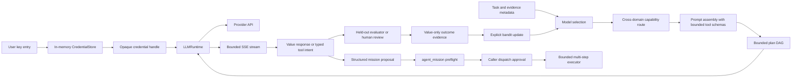

# Autonomous brain runtime

The autonomous brain is split into a deterministic decision kernel and an application-owned
provider runtime.



## Credential lifecycle

Applications collect provider keys themselves. The SDK supports three caller-owned entry points:

```python
from prism_sdk import (
    CredentialStore,
    LLMRuntime,
    MissionPolicy,
    ProviderOnboarding,
    ProviderRequest,
    anthropic_provider,
    openai_provider,
)
from prism_sdk.brain import AutonomousBrain, BrainLearningLedger

credentials = CredentialStore()
runtime = LLMRuntime(credentials)
onboarding = ProviderOnboarding(runtime)
onboarding.register_provider(openai_provider())
onboarding.register_provider(anthropic_provider())
handle = onboarding.configure_from_prompt("openai")  # or configure_from_environment(...)
response = runtime.invoke(
    "openai",
    ProviderRequest(
        model="gpt-5",
        messages=({"role": "user", "content": "Compile the next bounded research step."},),
    ),
    credential=handle,
)
onboarding.revoke(handle)
```

For a UI request, browser session, or server job that may collect more than one provider key,
group the handles in a short-lived `CredentialSession`:

```python
import os

with onboarding.start_session(ttl_seconds=3_600) as session:
    session.configure_from_prompt("openai")
    session.configure_from_environment("anthropic", environ=os.environ)
    openai_handle = session.handle("openai")
    # pass only openai_handle to the provider runtime / brain call
    print(session.status().to_dict())  # redacted readiness only
```

Session expiry and `close()` revoke every handle created through the session. A deployment that
needs persistence should persist only a secret-manager reference outside this SDK and use
`configure_from_resolver(...)` to recreate short-lived handles after restart; the SDK never
persists the key or the reference.

`ProviderOnboarding` is the standard BYOK process. It requires non-secret provider transport
metadata first, then supports no-echo prompt entry, environment injection, direct UI registration,
or an external resolver callback for a secret-manager reference. `status()` and `statuses()` return
redacted readiness (`register_provider`, `collect_user_credential`, or `ready`) without returning
keys or handles. `revoke()` removes the in-memory entry, and TTL expiry is purged before resolution
or status reporting. The value is held only in process memory. Handles expose only provider, opaque
identifier, source, expiry, and `secret_persistence: in_memory_only`; they do not implement a secret
serialization path. Provider failures do not return upstream response bodies because a proxy or
upstream error can echo request headers.

The core brain and MCP tools never accept `api_key`, `secret`, `Authorization`, or an environment
variable value. They accept model metadata and opaque outcome references only. Do not put a handle
or a key into a plan's arbitrary `arguments` object; pass the handle to `LLMRuntime.invoke` at the
runtime boundary.

The OpenAI adapter targets the Responses API (`POST /v1/responses`) and Bearer authentication, as
described in the [OpenAI API reference](https://platform.openai.com/docs/api-reference/introduction)
and [quickstart](https://platform.openai.com/docs/quickstart/make-your-first-api-request). The
adapter sets no provider-side persistence option implicitly beyond the request shape; applications
must choose their provider data-retention posture separately.

## Decision loop

The `bioprism-brain` crate exposes seven value-only operations through MCP:

- `brain_model_select` applies capability, context-window, quality, latency, and cost gates, then
  ranks eligible models with deterministic utility plus an exploration bonus.
- `brain_model_select_contextual` scopes online observations to a domain, capability, risk class,
  and optional task family. Exact context history overrides global history per arm; missing history
  falls back to global observations. The returned context digest is the caller-owned persistence
  join key.
- `brain_prompt_assemble` orders required and prioritized context under a hard input budget. It
  refuses when required material does not fit and reports optional omissions with a prompt digest.
- `brain_plan` validates an allow-listed dependency DAG, orders it deterministically, checks cost,
  and marks provider calls or external effects as approval-required. It never executes.
- `brain_bandit_select` uses caller-persisted UCB-style arm statistics. Unexplored arms receive an
  explicit exploration bonus and disabled arms are excluded.
- `brain_bandit_update` accepts one bounded evaluator reward and returns the next state. A provider
  response is never treated as a reward without an explicit evaluator update.
- `brain_outcome_record` binds a completed run, selected arm, and explicit evaluator assessment to
  the next bandit state. It emits a tamper-evident, value-only learning evidence record and never
  accepts provider response text, API keys, or credentials.

The state is caller-owned so a restart, replay, or audit can identify the exact model observations,
prompt digest, plan digest, response metadata, and reward that produced a decision. The current
bandit is an online adaptation kernel, not a claim that the system has learned a biological or
general-world policy. Rewards should be generated by a held-out evaluator, safety gate, or human
review process with its own provenance.

For applications that want the Python facade to assemble this request from the live runtime and
ledger, `AutonomousBrain.run_adaptive(...)` is the normal entry point:

```python
result = brain.run_adaptive(
    task="summarize the selected evidence",
    model_candidates=[
        {
            "provider": "openai",
            "model": "gpt-5",
            "capabilities": ["reasoning", "structured_output"],
            "context_window_tokens": 128_000,
            "max_output_tokens": 8_000,
            "quality": 0.9,
            "latency_ms": 900,
            "cost_per_million_tokens": 10,
            "reliability": 0.98,
        },
    ],
    prompt={"max_input_tokens": 12_000},
    plan={"allowed_tools": ["provider.invoke"], "max_cost": 10},
    credentials={"openai": handle},
    ledger=ledger,
    context={"domain": "oncology", "capability": "evidence_summary", "risk_class": "high_review"},
    approve_provider_call=True,
)
```

The facade disables candidates whose provider transport is not registered or whose required
caller credential handle is absent, so the selector returns an explainable no-eligible-model
refusal instead of failing after selection. `run_adaptive_tool_loop(...)` uses the same selection
and learning path before entering the route-aware authorization bridge; its
`tool_loop_options` can carry `mission_policy`, `route_request`, `provider_tools`, and explicit
dispatch approval. The model catalogue remains caller-supplied because model availability,
pricing, and quality priors are deployment-specific; provider keys never belong in that catalogue.

## Provider-neutral boundary

The current Python runtime supports:

- OpenAI Responses (`openai_provider()`);
- Anthropic Messages (`anthropic_provider()`); and
- OpenAI-compatible Chat Completions (`openai_compatible_provider(...)`).

All use the same `ProviderRequest` and `ProviderResponse` contract. The runtime does not follow
redirects, does not allow plain HTTP unless explicitly enabled for local/test use, bounds response
bytes, retries only classified transient failures, opens a per-provider circuit after repeated
failures, and can parse/validate bounded structured JSON locally. `AutonomousBrain.run` exposes
output limits, temperature, structured-output requirements, response schemas, and idempotency
keys without exposing credential material. Streaming and provider-native tool calling are explicit
runtime layers. `invoke_stream()` parses SSE framing into bounded `ProviderStreamEvent` deltas,
while `collect_stream()` folds the same events into a normal `ProviderResponse`. Event bodies are
not retained as raw provider payloads; text, argument fragments, event count, total bytes, and
aggregate output are bounded. A partial stream is never replayed automatically, because replaying
after a provider has emitted a tool intent could duplicate a caller-visible action. The documented
OpenAI Responses stream events for output text and function-call argument deltas/finalization are
projected into this same contract; other providers use their native event names but expose no
secret-bearing raw event channel.

`ProviderTool` and `ProviderToolCall` implement the provider-native tool boundary for both
collected and streamed responses. MCP `tools/list` schemas can be converted into OpenAI Responses, OpenAI-
compatible Chat Completions, or Anthropic Messages wire shapes. Returned calls are parsed into
typed intents, and an unrequested call is refused. A call is never dispatched by `LLMRuntime`:
`AutonomousBrain.run_mission` converts routed calls into ordinary mission steps and sends them
through `agent_mission` preflight, caller-owned allow-lists, schema validation, budgets, and the
separate dispatch approval. Provider tool calls therefore improve model/tool selection without
creating a hidden execution channel.

`ProviderRequest.with_tool_results(...)` appends a caller-approved assistant/tool turn and
translates it into native continuation history: Responses receives `function_call` and
`function_call_output` items, Chat Completions receives an assistant `tool_calls` message followed
by `tool` messages, and Anthropic receives `tool_use` followed by `tool_result` content blocks.
`LLMRuntime.invoke_tool_loop(...)` bounds turns and total calls and requires a callback to return
one `ProviderToolResult(approved=True)` for every intent in order. A missing, refused, or malformed
result stops before the next provider request. `AutonomousBrain.run_tool_loop(...)` adds model
selection, prompt assembly, plan approval, and the existing credential boundary around that
primitive:

```python
from prism_sdk import ProviderTool, ProviderToolResult

loop = brain.run_tool_loop(
    task="inspect the current platform state",
    model_selection=selection_request,
    prompt={"max_input_tokens": 12_000},
    plan=provider_plan,
    credentials={"openai": handle},
    provider_tools=(ProviderTool("developer_platform_status"),),
    approve_provider_call=True,
    max_turns=4,
    authorize_and_execute=lambda calls: [
        ProviderToolResult(
            call_id=call.call_id,
            content=execute_after_policy_review(call),
            approved=True,
        )
        for call in calls
    ],
)
```

The callback is application-owned: it should apply the same mission policy, schema validation,
approval, budgets, and audit/evaluator rules as `agent_mission`. For the standard path,
`authorize_and_execute` may be omitted when `mission_policy` is supplied; the brain then constructs
`MissionToolAuthorizer`. It requires each provider tool to be in the caller allow-list, in the
resolved route candidate set, and valid against any retained route schema before sending one
multi-step batch to `agent_mission`. It always previews with `execute=false`; only
`approve_mission_dispatch=True` permits the second `execute=true` request. The returned
`BrainToolLoopResult.authorization_receipts` retains bounded preflight/execution evidence and
structured step outputs, not opaque MCP envelopes or credentials. The runtime only transports the
approved result back to the model. A tool loop is therefore bounded continuation, not unrestricted
agent self-execution.

```python
loop = brain.run_tool_loop(
    task="audit the selected workspace capability",
    model_selection=selection_request,
    prompt={"max_input_tokens": 12_000},
    plan=provider_plan,
    credentials={"openai": handle},
    mission_policy=MissionPolicy(
        allowed_tools=("developer_platform_status",),
        max_steps=4,
        max_step_output_bytes=200_000,
        max_total_output_bytes=800_000,
    ),
    route_request={"needs": [{"id": "task", "query": "workspace capability audit"}]},
    approve_provider_call=True,
    approve_mission_dispatch=True,
)
```

The same route/authorizer path works for every tool returned by the live cross-domain catalogue;
domain-specific readiness, operations gates, and evidence contracts remain authoritative in the
Rust mission executor rather than being guessed by the model.

The adaptive loop can be combined with that standard authorizer:

```python
loop = brain.run_adaptive_tool_loop(
    task="inspect the current developer platform",
    model_candidates=model_catalogue,
    prompt={"max_input_tokens": 12_000},
    plan=provider_plan,
    credentials={"openai": handle},
    ledger=ledger,
    tool_loop_options={
        "mission_policy": MissionPolicy(
            allowed_tools=("developer_platform_status",),
            max_steps=4,
            max_step_output_bytes=200_000,
            max_total_output_bytes=800_000,
        ),
        "route_request": {"needs": [{"id": "task", "query": "developer platform status"}]},
        "approve_provider_call": True,
        "approve_mission_dispatch": True,
    },
)
```

## Run, evaluate, and learn

The model response is not self-rewarding. A caller owns the evaluator and persists only the
evidence returned by the Rust kernel:

```python
ledger = BrainLearningLedger("./state/brain-learning.jsonl")
result = brain.run(
    task="Summarize the bounded evidence packet.",
    model_selection=selection_request,
    prompt=prompt_request,
    plan=plan_request,
    credentials={"openai": handle},
    approve_provider_call=True,
    require_json=True,
    response_schema={
        "type": "object",
        "required": ["summary"],
        "properties": {"summary": {"type": "string", "minLength": 1}},
        "additionalProperties": False,
    },
)
brain.record_evaluator_outcome(
    result,
    bandit_state=bandit_state,
    evaluator_id="held-out-quality-v1",
    evaluator_version="1",
    reward=0.8,
    passed=True,
    ledger=ledger,
)
```

`record_evaluator_outcome` accepts the normal run, a bounded tool-loop result, or a mission result.
Continuation outcomes are joined to the original run with a new digest over status, turn counts,
tool-call counts, final provider/model identity, and request identity; provider text and opaque
tool envelopes are not persisted. This makes evaluator feedback usable for actual multi-domain
work without turning model self-report into reward.

For applications that evaluate several execution shapes, `BrainOutcomeEvaluator` provides the
standard adapter boundary. Its callback receives a bounded projection with the run identity,
selection/prompt/plan/outcome digests, provider status and usage counts, route identity, tool-loop
counts, mission preflight/execution counts, and optional caller-owned evidence. It never receives
the runtime credential, prompt text, provider response text, or opaque tool envelopes:

```python
from prism_sdk import BrainOutcomeEvaluator

quality_gate = BrainOutcomeEvaluator(
    lambda observation: {
        "reward": 0.9 if observation["evidence"]["schema_valid"] else 0.0,
        "passed": observation["evidence"]["schema_valid"],
        "failure_class": None if observation["evidence"]["schema_valid"] else "schema_invalid",
    },
    evaluator_id="held-out-quality-v2",
    evaluator_version="2026-08-18",
)

quality_gate.evaluate_and_record(
    brain,
    result,  # BrainRunResult, BrainToolLoopResult, or BrainMissionResult
    bandit_state=bandit_state,
    evidence={"schema_valid": True, "domain": "engineering"},
    ledger=ledger,
)
```

The adapter JSON-bounds and secret-scans evidence, computes its SHA-256 digest, and requires any
callback-supplied digest to match. Callback decisions are limited to reward/status fields and
value-only digests; arbitrary notes, answer copies, credentials, and unsupported fields are
rejected. The Rust kernel remains the final validator for the configured reward policy and
advances the caller-owned bandit state only after the explicit assessment is accepted. This
keeps domain-specific grading pluggable while preserving one replayable learning contract across
all catalogued domains.

The caller may feed `ledger.latest_state()` into the next `brain_bandit_select` request after
reviewing the evaluator provenance. The ledger is append-only, bounded, fsynced per record, and
rejects secret-shaped fields. This is online bandit adaptation over explicit observations—not an
unbounded self-modifying policy and not a claim of general intelligence.

## Structured decisions and multi-step work

`AutonomousBrain.run_mission(...)` is the bridge from a model response to the existing mission
executor. Supplying `route_request` makes the loop call the live cross-domain `capability_route`
catalogue before provider invocation. The route contributes a bounded, digest-bound packet of
candidate groups, domains, tools, and authoritative input schemas to the developer prompt, so the
model can plan against the actual workspace rather than an invented tool list. The packet reports
schema truncation explicitly and remains routing evidence, not permission.

```python
result = brain.run_mission(
    task="inspect the current developer platform and release evidence",
    model_selection=selection_request,
    prompt={"max_input_tokens": 12_000},
    plan=provider_plan,
    credentials={"openai": handle},
    mission_policy=MissionPolicy(
        allowed_tools=("developer_platform_status", "release_audit"),
        max_steps=8,
        max_step_output_bytes=200_000,
        max_total_output_bytes=1_000_000,
    ),
    route_request={
        "needs": [{"id": "task", "query": "developer platform release evidence"}],
        "max_tools": 32,
    },
    enforce_route_tools=True,
    approve_provider_call=True,
)
```

`enforce_route_tools=True` intersects the caller's explicit allow-list with the route's recommended
tools; it never widens that list. Unresolved route needs fail closed by default, and the returned
`BrainMissionResult.route` preserves the route identity for review. The model response must still
contain JSON with a bounded `mission.steps` array, after which the proposal is sent to
`agent_mission` with `execute=false`. The caller owns the mission policy and allow-list; the model
cannot add tools, widen budgets, enable side effects, or provide evaluator claims. Only after
inspecting the preflight result may the caller request the second dispatch with
`approve_mission_dispatch=True`. The Rust executor then applies dependency ordering, schema checks,
bindings, output budgets, refusal propagation, cancellation, execution traces, and retained
workflow/evaluator lineage across every catalogued domain tool.

## Safety boundary

This is research/developer infrastructure. The brain does not diagnose, recommend treatment,
enroll participants, or grant clinical authority. A successful model invocation is an observation,
not a scientific or clinical claim. External tool execution must pass the existing capability,
mission, runtime-effect, safety, and approval gates.
