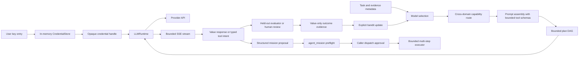

# Autonomous brain runtime

The autonomous brain is split into a deterministic decision kernel and an application-owned
provider runtime.



## Credential lifecycle

Applications collect provider keys themselves. The SDK supports three caller-owned entry points:

```python
from prism_sdk import (
    CredentialStore,
    LLMRuntime,
    MissionPolicy,
    ProviderOnboarding,
    ProviderRequest,
    anthropic_provider,
    openai_provider,
)
from prism_sdk.brain import AutonomousBrain, BrainLearningLedger

credentials = CredentialStore()
runtime = LLMRuntime(credentials)
onboarding = ProviderOnboarding(runtime)
onboarding.register_provider(openai_provider())
onboarding.register_provider(anthropic_provider())
handle = onboarding.configure_from_prompt("openai")  # or configure_from_environment(...)
response = runtime.invoke(
    "openai",
    ProviderRequest(
        model="gpt-5",
        messages=({"role": "user", "content": "Compile the next bounded research step."},),
    ),
    credential=handle,
)
onboarding.revoke(handle)
```

For a UI request, browser session, or server job that may collect more than one provider key,
group the handles in a short-lived `CredentialSession`:

```python
import os

with onboarding.start_session(ttl_seconds=3_600) as session:
    session.configure_from_prompt("openai")
    session.configure_from_environment("anthropic", environ=os.environ)
    openai_handle = session.handle("openai")
    # pass only openai_handle to the provider runtime / brain call
    print(session.status().to_dict())  # redacted readiness only
```

Session expiry and `close()` revoke every handle created through the session. A deployment that
needs persistence should persist only a secret-manager reference outside this SDK and use
`configure_from_resolver(...)` to recreate short-lived handles after restart; the SDK never
persists the key or the reference.

`ProviderOnboarding` is the standard BYOK process. It requires non-secret provider transport
metadata first, then supports no-echo prompt entry, environment injection, direct UI registration,
or an external resolver callback for a secret-manager reference. `status()` and `statuses()` return
redacted readiness (`register_provider`, `collect_user_credential`, or `ready`) without returning
keys or handles. `revoke()` removes the in-memory entry, and TTL expiry is purged before resolution
or status reporting. The value is held only in process memory. Handles expose only provider, opaque
identifier, source, expiry, and `secret_persistence: in_memory_only`; they do not implement a secret
serialization path. Provider failures do not return upstream response bodies because a proxy or
upstream error can echo request headers.

The application-level key intake process is therefore:

1. Register the provider's non-secret transport configuration during service startup.
2. Ask `onboarding.status(provider)` which action is required; a UI should show only that
   redacted state.
3. Collect the key over the application's protected input path, or resolve it from the deployment's
   secret manager. The raw value goes directly into `configure_from_prompt`, `register_value`,
   `configure_from_environment`, or `configure_from_resolver`; it never goes into an LLM prompt,
   MCP argument, model catalogue, plan, learning ledger, or browser-visible JSON response.
4. Keep the returned handle server-side inside a short-lived `CredentialSession`, pass that handle
   only to `LLMRuntime`/`AutonomousBrain`, and expose `session.status()` or `onboarding.status()`
   to the UI as the readiness view.
5. Revoke the session after the request/job, or let its TTL expire. After a process restart, resolve
   the external reference again instead of attempting to serialize or restore the handle.

This means the SDK deliberately does not create a universal key-upload HTTP endpoint: the embedding
application owns authentication, TLS, CSRF protection, tenancy, rate limits, and secret-manager
permissions. The SDK owns the sensitive part after intake—non-echo collection helpers, bounded
in-memory lifetime, opaque handles, provider matching, expiry/revocation, and redacted readiness.

The core brain and MCP tools never accept `api_key`, `secret`, `Authorization`, or an environment
variable value. They accept model metadata and opaque outcome references only. Do not put a handle
or a key into a plan's arbitrary `arguments` object; pass the handle to `LLMRuntime.invoke` at the
runtime boundary.

## Application composition and model inventory

The lower-level APIs intentionally make every decision input visible. An embedding application can
use `AutonomousAgent` when it wants one composition object that still preserves those boundaries:

```python
from prism_sdk import AutonomousAgent, ModelCatalogue, openai_provider

agent = AutonomousAgent(workspace, runtime, model_catalogue=ModelCatalogue([
    {
        "provider": "openai",
        "model": "gpt-5",
        "capabilities": ["reasoning", "code", "science"],
        "context_window_tokens": 128_000,
        "max_output_tokens": 16_000,
        "quality": 0.8,
        "reliability": 0.9,
        "latency_ms": 900,
        "cost_per_million_tokens": 10,
    }
]))
agent.onboarding.register_provider(openai_provider())

with agent.onboarding.start_session(ttl_seconds=3_600) as session:
    session.configure_from_environment("openai")  # or protected UI / secret-manager resolver
    result = agent.run(
        task="review the next bounded implementation step",
        domain="coding",
        credentials=session,
        approve_provider_call=True,
    )
```

`AutonomousAgent` may also be constructed with caller-owned `BrainLearningLedger` and
`BrainEpisodicMemory` instances. `agent.learning_state()` resumes the latest value-only bandit
state or returns the explicit empty state used for first-run exploration; `run(..., learn=True)`
uses that state automatically unless the caller supplies another state. The ledger and memory
remain append-only/value-only persistence owned by the embedding application.

`ModelCatalogue` stores only deterministic model metadata and rejects credential-shaped metadata
fields; it is safe to populate before a user has supplied any key. `agent.readiness()` projects
provider registration, credential readiness, and model eligibility without exposing secret material.
If `learn=True` is supplied, the same
facade runs the explicit evaluator and caller-owned bandit state through the existing online
learning path; it does not turn a provider response into a reward automatically. An application
can still call `AutonomousTaskOrchestrator` directly when it needs to provide every candidate
mapping or policy field itself.

For restart-safe provider adaptation, give the agent a caller-owned `ProviderHealthLedger`:

```python
from prism_sdk import AutonomousAgent, ProviderHealthLedger

health = ProviderHealthLedger("state/provider-health.jsonl")
agent = AutonomousAgent(
    workspace,
    runtime,
    model_catalogue=catalogue,
    health_ledger=health,
)
```

The agent registers a value-only runtime observer that appends provider/model, success or
failure, latency, status code, circuit state, and bounded usage metadata. On every subsequent
`run()` it merges the latest historical `provider_health` overlay into model selection, while
preserving explicit caller overrides. Open circuits remain a hard gate until their recorded
expiry; expired historical circuits become closed and can be probed again. `health.to_dict()` and
`agent.readiness()` expose only this redacted operational summary. The ledger rejects secret-shaped
fields and never stores API keys, request messages, response text, headers, credential handles, or
model prompts. This is complementary to `BrainLearningLedger`: provider health describes
transport reliability, while evaluator rewards describe task quality and drive bandit adaptation.

The same façade covers the long-horizon forms of autonomy. `prepare_cross_domain()` creates a
bounded specialist fan-out and synthesis blueprint; `run_cross_domain()` resolves catalogue
candidates and credential-session handles once, then applies the same provider-health overlay to
each child and the synthesis call. `run_workflow()` executes a checkpointable stage DAG and
automatically resumes the latest value-only bandit state, while `run_workflow_learning()` applies
one explicit evaluator update per completed stage and resumes from the latest ledger state unless
the caller supplies an override. This keeps single-task, staged, and cross-domain execution on
the same authorization, BYOK, model-selection, and learning boundaries.

### Restart-safe autonomous execution and tool outcome learning

Long-horizon autonomy has a second persistence layer in addition to provider health, episodic
memory, learning ledgers, and workflow checkpoints. `AutonomousExecutionJournal` is an append-only,
SHA-256 hash-chained JSONL journal for one execution envelope. It retains only an execution id,
domain/capability/risk labels, policy digest, bounded counters, tool/schema/argument/output
digests, evaluator identity, reward, and state transitions. It does not retain the task, prompt,
provider transcript, credentials, tool arguments, or tool outputs. The embedding application must
rehydrate those transient values and explicitly opt into a resume:

```python
from prism_sdk import (
    AutonomousAgent,
    AutonomousExecutionJournal,
    AutonomousExecutionPolicy,
)

journal = AutonomousExecutionJournal("state/autonomous-executions.jsonl")
policy = AutonomousExecutionPolicy(
    max_steps=64,
    max_provider_calls=16,
    max_provider_failovers=2,
    max_tool_calls=128,
    max_effectful_calls=0,       # read-only by default
    allow_side_effects=False,    # caller must opt in separately
    max_replans=4,
    max_cost_units=250,
)
agent = AutonomousAgent(
    workspace,
    runtime,
    model_catalogue=catalogue,
    tool_registry=tool_registry,
    execution_journal=journal,
    execution_policy=policy,
)

first = agent.run(
    task="inspect the bounded operational state",
    domain="operations",
    credentials=session,
    execution_id="ops-run-2026-08-19-001",
    execution_mode="tool_loop",
    approve_provider_call=True,
)

# Rehydrate the task/blueprint and short-lived credential session in the application, then:
resumed = agent.run(
    task="inspect the bounded operational state",
    domain="operations",
    credentials=session,
    execution_id="ops-run-2026-08-19-001",
    resume_execution=True,
    execution_mode="tool_loop",
    approve_provider_call=True,
)
```

Resuming is rejected unless `resume_execution=True`, the policy digest is identical, the
execution is non-terminal, and the journal hash chain verifies. Terminal runs cannot be replayed
as if they were unfinished. `agent.execution_state(id)` and `agent.execution_events(id)` expose
the redacted state machine for an operator UI; they never expose provider content. A journal is
not a transcript archive and cannot reconstruct a model conversation by itself.

The same policy controller is attached to every native domain-tool session. It admits bounded
tool intents before execution, fails closed when a budget or effect posture is exceeded, records
tool outcome digests, and shares metadata-only receipts across the agent's sessions. Read-only
tools can run when the policy allows; effectful tools require all three independent conditions:
the tool is declared effectful and approval-required, the execution policy explicitly enables a
positive effect budget, and the caller approval callback returns true. A model-generated tool call
never satisfies any of those conditions.

Provider calls use the same controller rather than a separate transport-only counter. Before a
request is sent, the selected provider/model, failover attempt, estimated token cost, and
invocation kind are admitted against `max_provider_calls`, `max_provider_failovers`, and
`max_cost_units`. After the runtime returns, the journal records only bounded usage counts,
latency, status/failure class, selection digest, request-id digest, and an outcome digest. Native
streaming and every continuation turn in a tool loop are accounted separately. A provider error
therefore becomes durable failover evidence without retaining the prompt, response, tool
arguments, credential handle, or upstream error body.

`BrainRunResult.to_dict()` and `build_brain_evaluation_input()` expose these redacted provider
receipts to an explicit evaluator. Transport health continues to flow through
`ProviderHealthLedger`; task quality still requires the caller-owned evaluator and bandit update.
This separation prevents a fast HTTP success from being mistaken for a useful answer while still
letting selection adapt to reliability, cost, latency, and bounded observed usage.

Tool outcomes can be scored by an evaluator independent of the provider:

```python
from prism_sdk import AutonomousToolOutcomeEvaluator, BrainLearningLedger

evaluator = AutonomousToolOutcomeEvaluator(
    lambda safe_input: {
        "reward": 1.0 if safe_input["status"] == "executed" else -1.0,
        "passed": safe_input["status"] == "executed",
    },
    evaluator_id="operations-quality",
    evaluator_version="2026-08-19",
)
report = evaluator.evaluate_and_record(
    outcome_evidence,
    controller=tool_runtime.controller,
    bandit_state={"generation": 0, "arms": []},
    bandit_updater=update_tool_arm,
    ledger=BrainLearningLedger("state/learning.jsonl"),
)
```

The evaluator receives tool identity, status, schema digest, argument digest, output digest, and
caller-supplied safe evidence—not the argument or output itself. The optional bandit updater is
caller-owned and receives the same value-only projection. `AutonomousToolReplayCase` and
`AutonomousToolReplayEngine` replay those evaluator inputs across all built-in domains without
invoking a provider or tool, report evaluator disagreement, and return only decision digests,
domain counts, and the next bandit state. This gives model/tool routing an auditable online
learning loop while keeping reward authority outside the model and outside the action executor.

The OpenAI adapter targets the Responses API (`POST /v1/responses`) and Bearer authentication, as
described in the [OpenAI API reference](https://platform.openai.com/docs/api-reference/introduction)
and [quickstart](https://platform.openai.com/docs/quickstart/make-your-first-api-request). The
adapter sets no provider-side persistence option implicitly beyond the request shape; applications
must choose their provider data-retention posture separately.

## Transport control plane

The brain's durable Python orchestration and its MCP/HTTP transport now share one value-only
control-plane contract. The MCP server exposes:

- brain_job_submit: admits an idempotent, rehydratable job identity from a spec_digest,
  domain, capability, and risk class. It never accepts the task, prompt, plan, provider response,
  credential, or API key.
- brain_job_status and brain_job_events: return bounded state and cursorable
  SHA-256-prev-digest journal pages. The event journal is metadata-only and explicitly reports
  scope: mcp_process; restart-safe execution still belongs to BrainJobStore.
- brain_job_approval: moves a queued job into waiting_approval, or returns it to queued
  after a caller-authenticated authorization proof digest. The transport records that the proof
  was supplied but does not verify identity and never dispatches work.
- brain_model_health: records and projects provider/model status, latency, bounded quality,
  usage counts, registration posture, and credential readiness. A runtime can feed the resulting
  provider_health map into brain_model_select to hard-gate open circuits or unready providers.
- brain_replay_evaluate: evaluates digest-bound normalized [0, 1] signals for engineering,
  research, operations, data, biomedical, or an explicit custom domain profile. It is an offline
  evaluator only; it does not contact a provider or replay a domain tool.

The same tools are reachable through the existing /v1/tools/{name} HTTP route and stdio
tools/call. The typed Python bridge keeps the wire shape consistent:

`python
from prism_sdk import (
    BrainControlClient,
    BrainJobSubmission,
    BrainReplayRequest,
)

control = BrainControlClient.from_http(api)  # or BrainControlClient.from_mcp(client)
receipt = control.submit_job(
    BrainJobSubmission(
        idempotency_key="request-001",
        spec_digest="a" * 64,
        domain="engineering",
        capability="code_change",
        risk_class="reversible",
    )
)
job_id = receipt["job"]["job_id"]
control.replay(
    BrainReplayRequest(
        case_id=job_id,
        domain="engineering",
        capability="code_change",
        risk_class="reversible",
        signals={
            "schema_valid": True,
            "tests_passed": True,
            "evidence_complete": True,
        },
    )
)
`

Use ProviderOnboarding and LLMRuntime for the actual BYOK invocation. The normal sequence is:

1. register non-secret provider transport metadata;
2. collect a key from the embedding application's protected UI, no-echo prompt, environment, or
   secret-manager resolver;
3. hold the resulting opaque handle in a short-lived credential session;
4. select a model with value-only health and bandit observations;
5. assemble the prompt, preflight the plan, and obtain explicit effect approval;
6. invoke the provider with the handle at the runtime boundary; and
7. report only status, usage, latency, evaluator signals, and digests to the control plane before
   revoking or expiring the handle.

The Rust projection is bounded process state and intentionally does not pretend to be a durable
queue. A worker that must survive restart should submit the same metadata to BrainJobStore,
rehydrate the task/prompt/plan/evaluator from its own resolver, and use the MCP/HTTP projection
for operator visibility. This split prevents a public MCP endpoint from becoming an accidental
secret vault or transcript archive while keeping model selection, invocation, approvals, replay,
and online adaptation connected in one inspectable workflow.

## Decision loop

The `bioprism-brain` crate exposes the deterministic decision operations through MCP, and the
transport control plane above adds the job, approval, health, and replay lifecycle:

- `brain_model_select` applies capability, context-window, quality, latency, and cost gates, then
  ranks eligible models with deterministic utility plus an exploration bonus.
- `brain_model_select_contextual` scopes online observations to a domain, capability, risk class,
  and optional task family. Exact context history overrides global history per arm; missing history
  falls back to global observations. The returned context digest is the caller-owned persistence
  join key.
- `brain_prompt_assemble` orders required and prioritized context under a hard input budget. It
  refuses when required material does not fit and reports optional omissions with a prompt digest.
- `brain_plan` validates an allow-listed dependency DAG, orders it deterministically, checks cost,
  and marks provider calls or external effects as approval-required. It never executes.
- `brain_bandit_select` uses caller-persisted UCB-style arm statistics. Unexplored arms receive an
  explicit exploration bonus and disabled arms are excluded.
- `brain_bandit_update` accepts one bounded evaluator reward and returns the next state. A provider
  response is never treated as a reward without an explicit evaluator update.
- `brain_outcome_record` binds a completed run, selected arm, and explicit evaluator assessment to
  the next bandit state. It emits a tamper-evident, value-only learning evidence record and never
  accepts provider response text, API keys, or credentials.

`provider_health` is a value-only map generated from the live runtime. For each registered provider
it carries circuit state, consecutive failure count, and whether the caller supplied a live
credential handle. The Rust selector treats an open circuit, missing/revoked/expired credential,
unregistered provider, or caller-ineligible provider as a hard gate and keeps the refusal reason in
the candidate ranking. Health is not a credential transport and cannot be used to smuggle a key into
the kernel.

The state is caller-owned so a restart, replay, or audit can identify the exact model observations,
prompt digest, plan digest, response metadata, and reward that produced a decision. The current
bandit is an online adaptation kernel, not a claim that the system has learned a biological or
general-world policy. Rewards should be generated by a held-out evaluator, safety gate, or human
review process with its own provenance.

The feedback path is closed when the application supplies `bandit_state` to an adaptive call (or
to `run_autonomous(..., learn=True)` / `run_workflow_learning(...)`). The selector projects the
current arm pulls, reward sums, failures, and disabled flags into its value-only observation
contract before choosing a provider. The evaluator then returns the next state; ordinary replans,
workflow stages, and durable worker continuations feed that new state into the next selection.
Thus a reward is not merely telemetry: it can change the next eligible arm while provider health,
capability, cost, latency, credentials, and explicit approval gates remain authoritative filters.

## Domain-aware autonomous task intake

Applications that do not want to hand-assemble every prompt and plan can use the high-level
orchestrator. It covers the twelve application domains exposed by the Python authoring layer:
`coding`, `browser`, `data`, `science`, `biomedical`, `neuroscience`, `operations`, `enterprise`,
`multi_agent`, `multimodal`, `cross_domain`, and `evaluation`. Each built-in profile contributes
domain-specific capability requirements, guardrails, a conservative risk class, and a mapping to
one of the five evidence-only evaluator families. The profile is a strategy scaffold, not a claim
that the model understands a domain or that the generated answer is true.

Each built-in profile is paired with a deterministic workflow strategy. The strategy is no longer
just a prompt label: it supplies dependency-ordered stages, stage capability requirements,
evidence outputs, route intents, completion criteria, and evaluator signal names. The current
strategies cover coding delivery, browser research, data quality analysis, scientific inquiry,
biomedical review, neuroscience analysis, operations change, enterprise governance, multi-agent
coordination, multimodal alignment, cross-domain synthesis, and evaluation reliability. A
workflow digest is carried into model selection, prompt assembly, planning, route requests, and
the public blueprint so a later review can identify exactly which planning contract was used.

```python
from prism_sdk import AutonomousBrain

brain = AutonomousBrain(workspace, runtime, memory=memory)
blueprint = brain.prepare_autonomous(
    task="Review the proposed data migration and list reversible checks.",
    domain="data",
    constraints=("do not execute writes", "show missing evidence"),
    desired_outputs=("risk register", "verification plan"),
    context={"migration": "warehouse-v2", "environment": "staging"},
)
print(blueprint.to_dict())  # task text is represented by a digest in this public projection

result = brain.run_autonomous(
    task="Review the proposed data migration and list reversible checks.",
    domain="data",
    model_candidates=model_catalogue,
    credentials={"openai": openai_handle},
    ledger=ledger,
    approve_provider_call=True,
)
```

The orchestrator builds a digest-bound contextual selection request, a bounded prompt with
explicit omission behavior, and a one-step provider-effect plan that the Rust planner validates.
It then delegates to `run_adaptive`, so provider registration, credential readiness, health
circuits, model failover, and caller-owned bandit observations remain active. The generated plan
uses the reserved `provider.invoke` effect and cannot execute until the caller supplies
`approve_provider_call=True`. `model_candidates` still belong to the deployment because pricing,
availability, quality priors, and capability labels are deployment-specific.

Every blueprint records one of three bounded execution modes:

* `provider` produces one provider response. This is the default and preserves the simple
  approval-gated answer path.
* `tool_loop` continues through native provider function calls. A caller may provide an explicit
  `provider_tools` tuple, or pass a `route_request` so the live capability router supplies the
  bounded schemas. Tool arguments are never executed by the brain; `tool_loop_options` must carry
  an application-owned `authorize_and_execute` callback, or a caller-supplied `MissionPolicy` can
  activate the built-in mission authorizer.
* `mission` promotes the provider proposal into the existing route/workflow executor and requires
  an explicit `MissionPolicy`. Dispatch remains separately gated by
`approve_mission_dispatch=True`.

When `require_json=True` and no response schema is supplied, the selected workflow generates a
bounded structured-output schema containing workflow identity, stage status, evidence strings,
uncertainty, summary, and next actions. A caller-provided schema still takes precedence. This
keeps structured output useful without pretending that a model-generated stage status is external
verification.

### Executing and resuming workflow stages

`run_autonomous` is the single-decision entrypoint. When a task needs a real multi-stage plan,
use the prepared blueprint with `run_workflow`:

```python
blueprint = brain.prepare_autonomous(
    task="Review the proposed implementation and produce a verified handoff.",
    domain="coding",
)
first_pass = brain.run_workflow(
    blueprint=blueprint,
    model_candidates=model_catalogue,
    credentials={"openai": openai_handle},
    approve_provider_call=True,
    run_id="review-42",
    max_stage_calls=2,       # bounded work per request; the rest becomes resumable
)

if first_pass.status == "paused":
    second_pass = brain.run_workflow(
        blueprint=blueprint,
        model_candidates=model_catalogue,
        credentials={"openai": openai_handle},
        checkpoint=first_pass.checkpoint,
        # run_id is recovered from the checkpoint when omitted
        approve_provider_call=True,
    )
```

The runner executes the strategy's dependency DAG, one stage at a time. A dependent stage is
eligible only after every declared dependency returned a structured `completed` status and
non-empty evidence. Each stage receives only bounded structured outputs from its completed
dependencies, plus the workflow and checkpoint digests. The provider response itself remains a
caller-returned result; it is not silently written to memory or the learning ledger.

The runner stops with an explicit status when a provider call needs approval, a model returns
malformed structured evidence, or a stage declares `blocked`, `proposed`, or `not_attempted`.
Completed-stage uncertainty is preserved as evidence for downstream stages; it is never silently
converted into a clean-pass signal.
`AutonomousWorkflowCheckpoint` contains only stage ids, statuses, evidence, uncertainty, bounded
structured outputs, and digests—never the raw task, credentials, provider messages, or transport
envelopes. Passing the checkpoint back verifies the task/workflow/run identity and skips completed
stages. A blocked or proposed stage is not retried implicitly; the caller must pass
`retry_blocked=True` to make that decision explicit.

Stage execution can be paired with explicit online learning:

```python
learning = brain.run_workflow_learning(
    blueprint=blueprint,
    model_candidates=model_catalogue,
    credentials={"openai": openai_handle},
    approve_provider_call=True,
    bandit_state=bandit_state,
    ledger=ledger,
    memory=memory,
    stage_evidence={
        "scope": {"signals": {"schema_valid": 1.0}},
        "inspect": {"signals": {"evidence_complete": 1.0}},
    },
)
```

The built-in workflow evaluator scores only the signal names declared by the scheduled stage.
Every declared signal must reach the pass threshold; missing evidence yields a zero reward and a
replan request. Each completed stage gets its own evaluator decision and `brain_outcome_record`
update, so the selector can learn from stage-level outcomes rather than treating an entire
multi-stage run as one opaque reward. A caller may provide a custom `BrainOutcomeEvaluator` or a
domain evaluator registry, but the evaluator remains the only reward authority. Stage learning
does not automatically replay or mutate a completed stage: `learning_replan_requested` is an
explicit caller decision point, and the ledger/memory paths retain only value-only metadata and
digests. When more than one stage is requested in one call, the orchestrator checkpoints and
evaluates each stage before scheduling its dependent successor, so the successor sees the latest
bandit state rather than the state from the beginning of the workflow.

For work that genuinely spans domains, `prepare_cross_domain` and `run_cross_domain` provide a
bounded fan-out/fan-in path. Child tasks are prepared with their own domain workflow contracts,
run sequentially in declared order, and are synthesized by the `cross_domain` workflow only after
all children complete. Pending approval or child failure blocks synthesis by default; callers must
opt into `allow_partial=True` when partial synthesis is appropriate. Provider output is passed to
the synthesis prompt in process but is not implicitly written to episodic memory or the learning
ledger.

```python
result = brain.run_cross_domain(
    task="Combine engineering and data-quality review into one decision package.",
    subtasks=(
        {"id": "engineering", "domain": "coding", "task": "Review implementation risk."},
        {"id": "data", "domain": "data", "task": "Review schema and lineage risk."},
    ),
    model_candidates=model_catalogue,
    credentials={"openai": openai_handle},
    approve_provider_call=True,
)
```

For example, a route-aware tool loop across any supported domain can be entered through the same
facade:

```python
loop = brain.run_autonomous(
    task="Inspect the current workspace and summarize its readiness.",
    domain="operations",
    execution_mode="tool_loop",
    model_candidates=model_catalogue,
    credentials={"openai": openai_handle},
    route_request={
        "needs": [{"id": "workspace-status", "query": "workspace status"}],
        "include_tools": True,
    },
    tool_loop_options={
        "authorize_and_execute": application_authorizer,
        "max_turns": 4,
        "max_tool_calls": 16,
    },
    approve_provider_call=True,
)
```

The route is evidence and schema discovery, not permission. With a callback-authorized loop, the
facade uses the route to derive provider tool schemas but does not require a mission-policy
intersection; the callback remains the only effect authority. If `learn=True` is added with a
bandit state, tool-loop results enter the same evaluator, metadata-only episodic memory, explicit
`brain_outcome_record`, and bounded replan path as ordinary provider responses. Replanning can
change the prompt proposal only; it cannot add tools, credentials, permissions, or effects.
When a caller does not have a route query ready, `auto_route=True` derives a bounded query from the
prepared domain profile and capability; it still performs no dispatch and still requires the same
approval/callback boundary.

For provider-only tasks, explicit online learning is available through the same entrypoint:

```python
learning = brain.run_autonomous(
    task="Improve the code-review answer using the held-out review gate.",
    domain="coding",
    model_candidates=model_catalogue,
    credentials={"openai": openai_handle},
    approve_provider_call=True,
    learn=True,
    evaluator=held_out_evaluator,
    bandit_state=bandit_state,
    memory=memory,
    ledger=ledger,
    evidence={"gate": "review-42", "signals": {"tests_passed": 1.0}},
    max_replans=1,
)
```

This path performs one bounded provider call, passes only the value-only evaluation projection to
the evaluator, records the explicit reward through `brain_outcome_record`, writes a hash-chained
episode/evaluation pair, and uses the returned bandit state on a later call. A failed evaluator
decision can add one bounded replan context before the next proposal; it cannot add credentials,
tools, permissions, or effects. Memory stores the task digest, not the task text, and never stores
provider responses or keys. The same learning contract accepts a completed native tool loop and
records only loop status, counts, route identity, model identity, and digests. Mission tasks use
the same `run_autonomous` entrypoint with a caller `MissionPolicy`; when `learn=True`, the existing
durable mission learning cycle is selected and dispatch remains separately approval-gated.

For applications that want the Python facade to assemble this request from the live runtime and
ledger, `AutonomousBrain.run_adaptive(...)` is the normal entry point:

```python
result = brain.run_adaptive(
    task="summarize the selected evidence",
    model_candidates=[
        {
            "provider": "openai",
            "model": "gpt-5",
            "capabilities": ["reasoning", "structured_output"],
            "context_window_tokens": 128_000,
            "max_output_tokens": 8_000,
            "quality": 0.9,
            "latency_ms": 900,
            "cost_per_million_tokens": 10,
            "reliability": 0.98,
        },
    ],
    prompt={"max_input_tokens": 12_000},
    plan={"allowed_tools": ["provider.invoke"], "max_cost": 10},
    credentials={"openai": handle},
    ledger=ledger,
    context={"domain": "oncology", "capability": "evidence_summary", "risk_class": "high_review"},
    approve_provider_call=True,
)
```

The facade disables candidates whose provider transport is not registered or whose required
caller credential handle is absent, expired, revoked, or owned by another runtime, so the selector
returns an explainable no-eligible-model refusal instead of failing after selection.
`run_adaptive_tool_loop(...)` uses the same selection and learning path before entering the
route-aware authorization bridge; its
`tool_loop_options` can carry `mission_policy`, `route_request`, `provider_tools`, and explicit
dispatch approval. The model catalogue remains caller-supplied because model availability,
pricing, and quality priors are deployment-specific; provider keys never belong in that catalogue.

For the complete cross-domain path, `AutonomousBrain.run_adaptive_mission(...)` composes the
same contracts into one bounded operation:

```python
mission = brain.run_adaptive_mission(
    task="inspect the current platform and prepare a release evidence report",
    model_candidates=model_catalogue,
    prompt={"max_input_tokens": 12_000},
    plan={"allowed_tools": ["provider.invoke"], "max_cost": 10},
    credentials={"openai": handle},
    mission_policy=MissionPolicy(
        allowed_tools=("developer_platform_status", "release_audit"),
        max_steps=8,
        max_step_output_bytes=200_000,
        max_total_output_bytes=1_000_000,
    ),
    route_request={
        "needs": [{"id": "release", "query": "platform release evidence"}],
        "risk_class": "release_review",
    },
    ledger=ledger,
    approve_provider_call=True,
    approve_mission_dispatch=False,  # inspect preflight before enabling effects
)
```

The operation resolves the live capability route once, derives contextual selection labels from
that route, selects an eligible provider through the health-gated kernel, assembles the route into
the bounded prompt, validates the provider plan, parses the structured mission proposal, and sends
that proposal to `agent_mission` with `execute=false`. A caller can review `mission.preflight` and
then issue a deliberate second call with dispatch approval. Route candidates, mission allow-lists,
schemas, budgets, claims, evaluator bindings, and operations gates remain caller/server-owned; the
model cannot widen any of them.

If the selected provider refuses before the mission reaches preflight, the method records
metadata-only attempt evidence, disables that provider/model, and deterministically selects the
next eligible candidate. Once `agent_mission` dispatch starts, a later transport failure is
surfaced without replaying the proposal against another provider. This keeps cross-domain
failover useful while preventing duplicate external effects.

## Durable episodic memory and bounded learning cycles

`BrainEpisodicMemory` provides a restart-safe memory boundary for applications that want the
agent to improve across jobs. It stores only a caller-authored packet of run identity, context
labels, model identity, digests, bounded tags, safe lessons, and provenance. It never accepts raw
tasks, prompts, provider responses, tool arguments, credentials, headers, or secret-shaped fields.
Episode records and evaluator updates are separate append-only SQLite events linked by a SHA-256
previous-digest chain:

```python
from prism_sdk import BrainEpisodicMemory, BrainOutcomeEvaluator

memory = BrainEpisodicMemory("state/brain-episodes.sqlite3", max_episodes=10_000)
evaluator = BrainOutcomeEvaluator(
    evaluate_release_result,
    evaluator_id="release-quality",
    evaluator_version="2026-08-19",
)
cycle = brain.run_adaptive_mission_learning_cycle(
    task="inspect the platform and prepare release evidence",
    model_candidates=model_catalogue,
    prompt={"max_input_tokens": 12_000},
    plan={"allowed_tools": ["provider.invoke"], "max_cost": 10},
    credentials={"openai": handle},
    mission_policy=mission_policy,
    evaluator=evaluator,
    bandit_state=bandit_state,
    ledger=ledger,
    memory=memory,
    memory_query={
        "domain": "engineering",
        "capability": "release_audit",
        "risk_class": "release_review",
        "limit": 8,
    },
    max_replans=1,
    mission_options={
        "context": {
            "domain": "engineering",
            "capability": "release_audit",
            "risk_class": "release_review",
        },
        "route_request": {"needs": [{"id": "release", "query": "release evidence"}]},
        "approve_provider_call": True,
        "approve_mission_dispatch": False,
    },
)
```

The cycle recalls prior episodes as non-authorizing developer context, runs the normal route and
health-gated model decision, passes the result to the held-out evaluator, records the explicit
reward through `brain_outcome_record`, appends the episode and evaluation to durable memory, and
uses the returned next bandit state for the next attempt. An evaluator may request a bounded
replan with a failure class and safe instruction. Replanning is allowed only before mission
dispatch; after `execute=true` has been sent, the cycle returns
`replan_blocked_after_dispatch` and never guesses whether an external effect happened. The
`max_replans` bound is capped by the SDK, and memory retrieval cannot widen tools, budgets,
claims, route candidates, credentials, or approval gates.

Memory can be independently inspected with `memory.retrieve(...)`, `memory.get(episode_id)`,
`memory.stats()`, and `memory.verify_integrity()`. A deployment that needs stronger durability or
multi-tenant isolation should place the database behind its own encrypted storage, authorization,
backup, and retention controls; the SDK supplies bounded append/retrieval and provenance, not a
distributed database or an identity authority.

## Resumable learning jobs

For work that must survive a worker restart, `BrainJobStore` adds a separate orchestration journal.
It persists an idempotency key, spec digest, domain labels, lease, attempt count, checkpoint,
approval state, and side-effect boundary. It deliberately does not persist the job specification:
the caller supplies a resolver that rehydrates the task, prompt, plan, evaluator evidence, and fresh
credential handles in process memory.

```python
from hashlib import sha256
from prism_sdk import BrainJobStore

spec_digest = sha256(b"release-evidence-v1").hexdigest()
with BrainJobStore("state/brain-jobs.sqlite3") as jobs:
    job, receipt = jobs.submit({
        "idempotency_key": "release-evidence-request-42",
        "spec_digest": spec_digest,
        "domain": "engineering",
        "capability": "release_audit",
        "risk_class": "release_review",
        "max_attempts": 3,
    })
```

`brain.run_resumable_learning_job(...)` claims the job, invokes the caller resolver with only the
spec-free job view, runs the normal adaptive mission/evaluator cycle, and checkpoints only cycle
status, attempt counts, replans, and outcome digests. An expired lease before dispatch is safely
requeued; an expired lease at or after dispatch becomes `reconciliation_required` and cannot be
claimed until an operator handles the uncertain external state. If the mission reaches
`mission_approval_required`, the worker creates a digest-bound approval request and returns
`waiting_approval`; it cannot mark the job succeeded on the strength of a proposal alone. Approval
releases the job back to `queued`, and the next resolver-backed attempt receives the durable
approval decision as an authorization to set `approve_mission_dispatch=True`. Any exception during
an active cycle is conservatively recorded as reconciliation-required because the process cannot
infer whether a remote effect began.

### Durable workflow jobs

Mission learning jobs and staged workflow jobs use the same journal, but they have different
continuation contracts. A workflow job runs at most one provider-backed stage per lease. After a
successful stage, it writes the workflow checkpoint and bandit state, emits a `job_released` event,
and returns to `queued`; the next worker claims the job and continues from the completed-stage
set. This makes the stage DAG a real restart boundary rather than a caller convention.

```python
from prism_sdk import BrainJobStore, BrainWorker

def resolve_workflow(job):
    # Resolve the private task/blueprint and a fresh opaque handle from the application's
    # secret manager. The job argument contains only public metadata and checkpoint digests.
    blueprint = application_prepare_blueprint(job)
    return {
        "blueprint": blueprint,
        "model_candidates": application_model_catalogue(),
        "credentials": {"openai": application_resolve_handle("openai")},
        "workflow_options": {
            "approve_provider_call": application_provider_approval(job),
            "stage_evidence": application_stage_evidence(blueprint, job),
        },
    }

with BrainJobStore("state/brain-jobs.sqlite3") as jobs:
    worker = BrainWorker(
        brain,
        jobs,
        worker_id="workflow-worker-1",
        resolver=resolve_workflow,
        evaluator=None,                 # built-in workflow evaluator by default
        bandit_state=bandit_state,
        execution_kind="workflow_learning",
    )
    result = worker.run_once(job_id)
```

The resolver may return a previously persisted `checkpoint` as an
`AutonomousWorkflowCheckpoint` or its dictionary form. If the checkpoint fits the bounded job
record, the journal retains it under `workflow_checkpoint`; otherwise the caller must configure
`workflow_checkpoint_sink` on `BrainWorker` (or `checkpoint_sink` on
`run_resumable_workflow_job`). The sink receives the validated checkpoint and the job retains
only `checkpoint_storage="caller_owned"`, its content digest, completed/next stage ids, and the
value-only bandit state. The resolver is responsible for loading that external checkpoint after a
restart and returning it with the same digest. Structured stage output is never silently
truncated to satisfy the SQLite journal limit.

Provider approval is a durable state transition. A stage that cannot invoke its provider returns
`waiting_approval`; `BrainApprovalRouter.approve(...)` releases the job to `queued`, while the
workflow checkpoint remains attached. On the next claim, the runner forces the approved provider
approval into the rehydrated options so a resolver cannot accidentally discard it. Mission-style
dispatch approval remains a separate scope and is only forwarded when that exact approval scope
was released. A workflow learning failure that requests a replan returns
`learning_replan_requested` and is not replayed implicitly; the resolver must explicitly set
`resume_after_replan=True` after revising its evidence or continuation policy.

All durable workflow job records remain metadata-only: no raw task, prompt, provider message,
credential handle, key, or evaluator payload is written to the job journal. A worker can therefore
be restarted with a new process and new short-lived BYOK handles while preserving the exact
workflow identity, checkpoint digest, stage-level outcome updates, approval history, and lease
recovery posture. If a lease expires after a possible external dispatch, the existing
`reconciliation_required` quarantine still wins over replay.

## Reusable domain evaluators

`DomainEvaluatorRegistry.with_builtin_profiles()` supplies one evidence-only contract for five
common domain families: `engineering`, `research`, `operations`, `data`, and `biomedical`. Each
profile has required normalized signal names, positive weights, a pass threshold, and an evaluator
identity/version. Applications provide boolean or `[0, 1]` signal values plus digest references;
the adapter returns a reward, pass/fail gate, failure class, evidence digest, and bounded replan
instruction. These profiles are policy scaffolds, not truth or clinical authorities—domain
applications remain responsible for producing and validating the signals.

```python
from prism_sdk import DomainEvaluatorRegistry

evaluators = DomainEvaluatorRegistry.with_builtin_profiles()
evaluator = evaluators.resolve("research")
evidence = evaluator.normalize_evidence({
    "domain": "research",
    "capability": "literature_review",
    "risk_class": "high_review",
    "signals": {
        "evidence_traceable": 1.0,
        "uncertainty_reported": 1.0,
        "claim_scope_respected": 1.0,
    },
    "references": ["a" * 64],
})
```

The adapter is a `BrainOutcomeEvaluator`, so it plugs directly into
`run_adaptive_mission_learning_cycle(...)` and retains the same secret-safe replay and explicit
bandit-update boundary across all five domains.

## Cross-process control plane and offline adaptation

`BrainControlPlane` exposes the durable job journal as a bounded cursor stream for worker
processes, dashboards, and operators. Every page carries the journal head digest and each event
retains its previous digest, so a consumer can detect a stale cursor or tampered state instead of
silently missing a transition. `BrainApprovalRouter` turns a running job into a durable, role-labelled
approval request; approval releases it back to `queued`, while denial terminally cancels it. Neither
operation grants identity or policy authority—the caller remains responsible for authenticating the
approver and deciding whether the requested scope is allowed.

```python
from prism_sdk import BrainControlPlane, BrainJobStore

with BrainJobStore("state/brain-jobs.sqlite3") as jobs:
    control = BrainControlPlane(jobs)
    page = control.events(after_sequence=operator_cursor, limit=64)
    for event in page.events:
        audit_sink.append(event.to_dict())
    operator_cursor = page.next_after

    pending = control.approvals.pending(limit=32)
    # The application authenticates the operator before calling approve/deny.
    if pending:
        control.approvals.approve(
            pending[0].job_id,
            approver="operator-42",
            reason="release gate reviewed",
        )
```

`BrainWorker` is a process-safe execution facade. Multiple workers may share the SQLite job
journal; the lease transaction chooses one owner, the heartbeat renews the lease while the
resolver and provider runtime work, and the existing preflight/dispatched boundary still decides
whether a crash is safe to replay. The resolver is where an application reconnects its secret
manager or `ProviderOnboarding` flow and creates fresh opaque `CredentialHandle` values. A person
does not put a key into the job packet, event stream, health database, or replay case.

```python
from prism_sdk import BrainModelHealthStore, BrainWorker

with BrainModelHealthStore("state/brain-health.sqlite3") as health:
    worker = BrainWorker(
        brain,
        jobs,
        worker_id="worker-us-central-1",
        resolver=resolve_job_from_application_secret_store,
        evaluator=evaluator,
        bandit_state=ledger.latest_state() or {"arms": []},
        ledger=ledger,
        health=health,
    )
    result = worker.run_once()
```

`BrainModelHealthStore` retains only provider/model identity, bounded status, latency, token counts,
quality reward, and outcome digests. It aggregates observations across workers and projects a
historical circuit signal back into the next model-selection request without overriding live
credential, registration, or capability gates. `LLMRuntime` can emit value-only invocation
observations; `BrainWorker` attaches a best-effort observer that records provider transport
failures even when a job never produces a final brain result. Observer failures cannot change
provider authorization or retry behavior. A provider that repeatedly fails can therefore be
excluded deterministically until an operator resets or replaces the health state.

`BrainReplayEngine` is the offline learning path. The caller rehydrates evidence from its own
retained source, supplies the exact evidence digest, and selects a registered evaluator version.
The engine recomputes decisions for engineering, research, operations, data, and biomedical cases,
reports pass rates/reward by domain, detects decision-digest drift, and can call a caller-owned
bandit updater with evidence-free metadata. It never reconstructs or replays a provider request and
never lets replayed evidence widen tools, credentials, budgets, or approval state.

```python
from prism_sdk import BrainReplayEngine

replay = BrainReplayEngine().replay(
    caller_rehydrated_cases,
    evaluators=DomainEvaluatorRegistry.with_builtin_profiles(),
    bandit_state=ledger.latest_state() or {"arms": []},
    bandit_updater=rust_bandit_update_from_value_only_metadata,
)
print(replay.to_dict()["by_domain"])
```

## Provider-neutral boundary

The current Python runtime supports:

- OpenAI Responses (`openai_provider()`);
- Anthropic Messages (`anthropic_provider()`); and
- OpenAI-compatible Chat Completions (`openai_compatible_provider(...)`).

All use the same `ProviderRequest` and `ProviderResponse` contract. The runtime does not follow
redirects, does not allow plain HTTP unless explicitly enabled for local/test use, bounds response
bytes, retries only classified transient failures, opens a per-provider circuit after repeated
failures, and can parse/validate bounded structured JSON locally. `AutonomousBrain.run` exposes
output limits, temperature, structured-output requirements, response schemas, and idempotency
keys without exposing credential material. Streaming and provider-native tool calling are explicit
runtime layers. `invoke_stream()` parses SSE framing into bounded `ProviderStreamEvent` deltas,
while `collect_stream()` folds the same events into a normal `ProviderResponse`. Event bodies are
not retained as raw provider payloads; text, argument fragments, event count, total bytes, and
aggregate output are bounded. A partial stream is never replayed automatically, because replaying
after a provider has emitted a tool intent could duplicate a caller-visible action. The documented
OpenAI Responses stream events for output text and function-call argument deltas/finalization are
projected into this same contract; other providers use their native event names but expose no
secret-bearing raw event channel.

`ProviderTool` and `ProviderToolCall` implement the provider-native tool boundary for both
collected and streamed responses. MCP `tools/list` schemas can be converted into OpenAI Responses, OpenAI-
compatible Chat Completions, or Anthropic Messages wire shapes. Returned calls are parsed into
typed intents, and an unrequested call is refused. A call is never dispatched by `LLMRuntime`:
`AutonomousBrain.run_mission` converts routed calls into ordinary mission steps and sends them
through `agent_mission` preflight, caller-owned allow-lists, schema validation, budgets, and the
separate dispatch approval. Provider tool calls therefore improve model/tool selection without
creating a hidden execution channel.

`ProviderRequest.with_tool_results(...)` appends a caller-approved assistant/tool turn and
translates it into native continuation history: Responses receives `function_call` and
`function_call_output` items, Chat Completions receives an assistant `tool_calls` message followed
by `tool` messages, and Anthropic receives `tool_use` followed by `tool_result` content blocks.
`LLMRuntime.invoke_tool_loop(...)` bounds turns and total calls and requires a callback to return
one `ProviderToolResult(approved=True)` for every intent in order. A missing, refused, or malformed
result stops before the next provider request. `AutonomousBrain.run_tool_loop(...)` adds model
selection, prompt assembly, plan approval, and the existing credential boundary around that
primitive:

```python
from prism_sdk import ProviderTool, ProviderToolResult

loop = brain.run_tool_loop(
    task="inspect the current platform state",
    model_selection=selection_request,
    prompt={"max_input_tokens": 12_000},
    plan=provider_plan,
    credentials={"openai": handle},
    provider_tools=(ProviderTool("developer_platform_status"),),
    approve_provider_call=True,
    max_turns=4,
    authorize_and_execute=lambda calls: [
        ProviderToolResult(
            call_id=call.call_id,
            content=execute_after_policy_review(call),
            approved=True,
        )
        for call in calls
    ],
)
```

`run_adaptive_tool_loop(...)` may fail over between model candidates only while no tool
authorization has started. A provider refusal before authorization records metadata-only attempt
evidence, disables that provider/model for the next deterministic selection, and can continue with
the next eligible candidate. Once the authorization callback has been entered, any later provider
failure is surfaced without replaying the task against another provider. This is the important
side-effect boundary: a retry must never cause a second model to request or execute the same
caller-visible action.

The callback is application-owned: it should apply the same mission policy, schema validation,
approval, budgets, and audit/evaluator rules as `agent_mission`. For the standard path,
`authorize_and_execute` may be omitted when `mission_policy` is supplied; the brain then constructs
`MissionToolAuthorizer`. It requires each provider tool to be in the caller allow-list, in the
resolved route candidate set, and valid against any retained route schema before sending one
multi-step batch to `agent_mission`. It always previews with `execute=false`; only
`approve_mission_dispatch=True` permits the second `execute=true` request. The returned
`BrainToolLoopResult.authorization_receipts` retains bounded preflight/execution evidence and
structured step outputs, not opaque MCP envelopes or credentials. The runtime only transports the
approved result back to the model. A tool loop is therefore bounded continuation, not unrestricted
agent self-execution.

```python
loop = brain.run_tool_loop(
    task="audit the selected workspace capability",
    model_selection=selection_request,
    prompt={"max_input_tokens": 12_000},
    plan=provider_plan,
    credentials={"openai": handle},
    mission_policy=MissionPolicy(
        allowed_tools=("developer_platform_status",),
        max_steps=4,
        max_step_output_bytes=200_000,
        max_total_output_bytes=800_000,
    ),
    route_request={"needs": [{"id": "task", "query": "workspace capability audit"}]},
    approve_provider_call=True,
    approve_mission_dispatch=True,
)
```

The same route/authorizer path works for every tool returned by the live cross-domain catalogue;
domain-specific readiness, operations gates, and evidence contracts remain authoritative in the
Rust mission executor rather than being guessed by the model.

### Domain tool registry and BYOK application composition

The high-level `AutonomousAgent` façade can compose a caller-owned domain tool registry. This is
the process an embedding application uses after a person has completed provider onboarding:

1. Register only non-secret provider metadata and model candidates.
2. Collect the provider key through `ProviderOnboarding`/`CredentialSession`; pass only the opaque
   `CredentialHandle` to the agent.
3. Register each actual MCP/workspace tool with its domains, capability, exact input schema, and
   risk posture.
4. Let the agent expose only tools matching the current domain, plus deliberately shared
   `cross_domain` tools.
5. Supply an approval callback for effectful tools. Read-only tools may be automatically executed
   through the workspace adapter, while effectful tools remain refused without approval.

The registry is metadata and schema composition; it does not grant authority. A provider-generated
tool call is still an intent. `AutonomousDomainToolRuntime` validates the call against the exact
registered schema, rejects credential-shaped fields, applies the read-only/effect approval policy,
and invokes the caller-owned executor. A mixed batch containing one unapproved call is refused as
a batch so an approved call cannot partially execute around a denied sibling. The executor's
output is bounded and returned only as a provider continuation value. `AutonomousAgent.tool_receipts()`
returns call, schema, argument, and output digests plus status—never raw arguments, outputs,
provider payloads, or credentials.

```python
from prism_sdk import (
    AutonomousAgent,
    AutonomousDomainTool,
    AutonomousDomainToolRegistry,
    AutonomousDomainToolRuntime,
)

tools = AutonomousDomainToolRegistry()
tools.register_mcp_definition(
    {
        "name": "developer_platform_status",
        "description": "Read bounded workspace status.",
        "inputSchema": {
            "type": "object",
            "properties": {"scope": {"type": "string"}},
            "required": ["scope"],
            "additionalProperties": False,
        },
    },
    domains=("coding", "operations", "cross_domain"),
    capability="observability",
    read_only=True,
)
tools.register(
    AutonomousDomainTool(
        name="release_apply",
        domains=("coding", "operations"),
        capability="delivery",
        description="Apply an already reviewed release.",
        parameters={"type": "object", "additionalProperties": False},
        risk_class="external_effect",
        read_only=False,
        approval_required=True,
    )
)

agent = AutonomousAgent(workspace, runtime, tool_registry=tools)
result = agent.run(
    task="Inspect the current workspace and summarize readiness.",
    domain="operations",
    credentials={"openai": openai_handle},  # opaque handle, never a raw key
    execution_mode="tool_loop",
    approve_provider_call=True,
    tool_loop_options={"max_turns": 4, "max_tool_calls": 16},
)
print(agent.tool_receipts())
```

For an effectful tool, provide `tool_runtime=AutonomousDomainToolRuntime(...)` with an approval
callback, or replace the default workspace adapter with an application executor that enforces
identity, scope, idempotency, and operator policy. The agent never derives approval from the model,
domain label, route recommendation, provider credential readiness, or bandit preference. `read_only`
is an explicit registration claim and should only be used for tools whose executor has no external
effect.

The adaptive loop can be combined with that standard authorizer:

```python
loop = brain.run_adaptive_tool_loop(
    task="inspect the current developer platform",
    model_candidates=model_catalogue,
    prompt={"max_input_tokens": 12_000},
    plan=provider_plan,
    credentials={"openai": handle},
    ledger=ledger,
    tool_loop_options={
        "mission_policy": MissionPolicy(
            allowed_tools=("developer_platform_status",),
            max_steps=4,
            max_step_output_bytes=200_000,
            max_total_output_bytes=800_000,
        ),
        "route_request": {"needs": [{"id": "task", "query": "developer platform status"}]},
        "approve_provider_call": True,
        "approve_mission_dispatch": True,
    },
)
```

## Run, evaluate, and learn

The model response is not self-rewarding. A caller owns the evaluator and persists only the
evidence returned by the Rust kernel:

```python
ledger = BrainLearningLedger("./state/brain-learning.jsonl")
result = brain.run(
    task="Summarize the bounded evidence packet.",
    model_selection=selection_request,
    prompt=prompt_request,
    plan=plan_request,
    credentials={"openai": handle},
    approve_provider_call=True,
    require_json=True,
    response_schema={
        "type": "object",
        "required": ["summary"],
        "properties": {"summary": {"type": "string", "minLength": 1}},
        "additionalProperties": False,
    },
)
brain.record_evaluator_outcome(
    result,
    bandit_state=bandit_state,
    evaluator_id="held-out-quality-v1",
    evaluator_version="1",
    reward=0.8,
    passed=True,
    ledger=ledger,
)
```

`record_evaluator_outcome` accepts the normal run, a bounded tool-loop result, or a mission result.
Continuation outcomes are joined to the original run with a new digest over status, turn counts,
tool-call counts, final provider/model identity, and request identity; provider text and opaque
tool envelopes are not persisted. This makes evaluator feedback usable for actual multi-domain
work without turning model self-report into reward.

For applications that evaluate several execution shapes, `BrainOutcomeEvaluator` provides the
standard adapter boundary. Its callback receives a bounded projection with the run identity,
selection/prompt/plan/outcome digests, provider status and usage counts, route identity, tool-loop
counts, mission preflight/execution counts, and optional caller-owned evidence. It never receives
the runtime credential, prompt text, provider response text, or opaque tool envelopes:

```python
from prism_sdk import BrainOutcomeEvaluator

quality_gate = BrainOutcomeEvaluator(
    lambda observation: {
        "reward": 0.9 if observation["evidence"]["schema_valid"] else 0.0,
        "passed": observation["evidence"]["schema_valid"],
        "failure_class": None if observation["evidence"]["schema_valid"] else "schema_invalid",
    },
    evaluator_id="held-out-quality-v2",
    evaluator_version="2026-08-18",
)

quality_gate.evaluate_and_record(
    brain,
    result,  # BrainRunResult, BrainToolLoopResult, or BrainMissionResult
    bandit_state=bandit_state,
    evidence={"schema_valid": True, "domain": "engineering"},
    ledger=ledger,
)
```

The adapter JSON-bounds and secret-scans evidence, computes its SHA-256 digest, and requires any
callback-supplied digest to match. Callback decisions are limited to reward/status fields and
value-only digests; arbitrary notes, answer copies, credentials, and unsupported fields are
rejected. The Rust kernel remains the final validator for the configured reward policy and
advances the caller-owned bandit state only after the explicit assessment is accepted. This
keeps domain-specific grading pluggable while preserving one replayable learning contract across
all catalogued domains.

`evaluate_and_record(...)` also writes a bounded replay envelope to the append-only ledger. The
envelope contains the result kind, run identity, evaluation-input/outcome/evidence digests, and
evaluator version—not the prompt, provider output, tool arguments, raw evidence, credential, or
secret-manager reference. `ledger.replays(run_id=..., evaluator_id=...)` returns those bounded
metadata records for audit, offline evaluator comparison, and subsequent contextual/bandit updates.
Replay metadata is rejected if it contains secret-shaped fields or exceeds the ledger's hard
16-KiB bound, so online learning has a durable join key without turning the learning store into a
transcript archive.

The caller may feed `ledger.latest_state()` into the next `brain_bandit_select` request after
reviewing the evaluator provenance. The ledger is append-only, bounded, fsynced per record, and
rejects secret-shaped fields. This is online bandit adaptation over explicit observations—not an
unbounded self-modifying policy and not a claim of general intelligence.

## Structured decisions and multi-step work

`AutonomousBrain.run_mission(...)` is the bridge from a model response to the existing mission
executor. Supplying `route_request` makes the loop call the live cross-domain `capability_route`
catalogue before provider invocation. The route contributes a bounded, digest-bound packet of
candidate groups, domains, tools, and authoritative input schemas to the developer prompt, so the
model can plan against the actual workspace rather than an invented tool list. The packet reports
schema truncation explicitly and remains routing evidence, not permission.

```python
result = brain.run_mission(
    task="inspect the current developer platform and release evidence",
    model_selection=selection_request,
    prompt={"max_input_tokens": 12_000},
    plan=provider_plan,
    credentials={"openai": handle},
    mission_policy=MissionPolicy(
        allowed_tools=("developer_platform_status", "release_audit"),
        max_steps=8,
        max_step_output_bytes=200_000,
        max_total_output_bytes=1_000_000,
    ),
    route_request={
        "needs": [{"id": "task", "query": "developer platform release evidence"}],
        "max_tools": 32,
    },
    enforce_route_tools=True,
    approve_provider_call=True,
)
```

`enforce_route_tools=True` intersects the caller's explicit allow-list with the route's recommended
tools; it never widens that list. Unresolved route needs fail closed by default, and the returned
`BrainMissionResult.route` preserves the route identity for review. The model response must still
contain JSON with a bounded `mission.steps` array, after which the proposal is sent to
`agent_mission` with `execute=false`. The caller owns the mission policy and allow-list; the model
cannot add tools, widen budgets, enable side effects, or provide evaluator claims. Only after
inspecting the preflight result may the caller request the second dispatch with
`approve_mission_dispatch=True`. The Rust executor then applies dependency ordering, schema checks,
bindings, output budgets, refusal propagation, cancellation, execution traces, and retained
workflow/evaluator lineage across every catalogued domain tool.

## Safety boundary

This is research/developer infrastructure. The brain does not diagnose, recommend treatment,
enroll participants, or grant clinical authority. A successful model invocation is an observation,
not a scientific or clinical claim. External tool execution must pass the existing capability,
mission, runtime-effect, safety, and approval gates.
