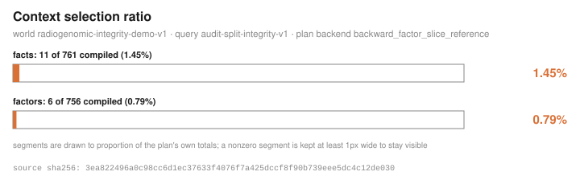
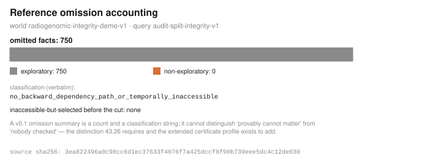
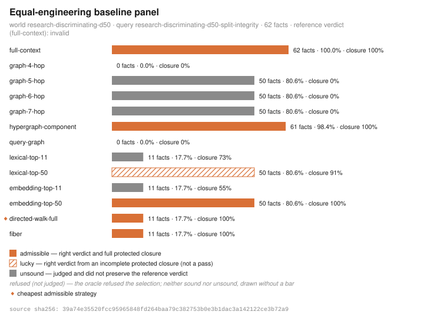
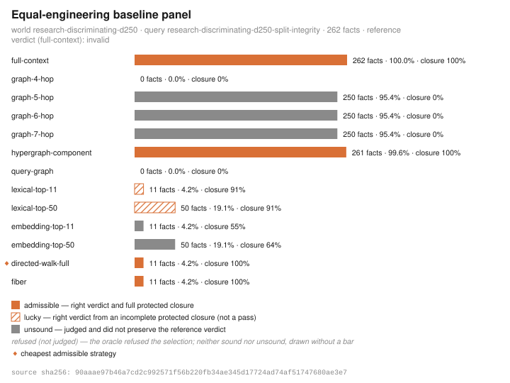
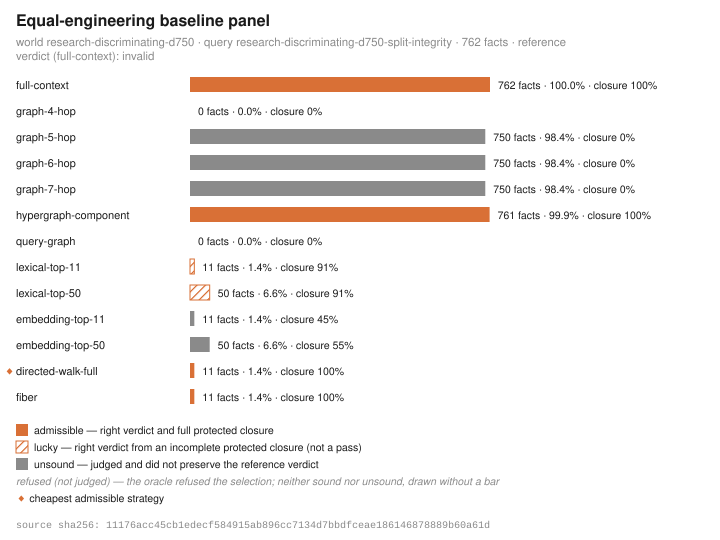
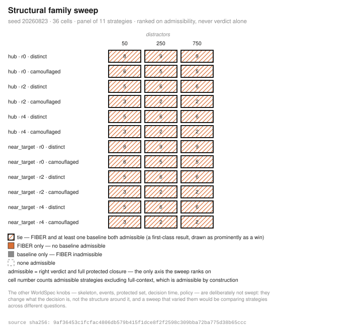
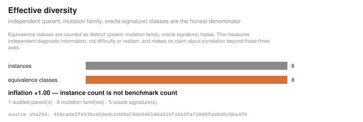

# Research dossier admissibility-under-distractor-pressure

## Question (recorded verbatim)

```text
Which context strategies remain admissible as distractor pressure and structural camouflage increase?
```

The runner executed the protocol below; it did not interpret the question. Whether these measurements bear on it is the reader's judgement.

- family: `discriminating`
- distractor points: 50, 250, 750
- seed: 20260823
- request digest: `336831b83c47f73fbf197b1b82d92afa8b2bebfd21f3fc05078d64e153b13e6e`
- dossier digest: `46a740c5396151064a075ae213acf50b2508e26e2cd72ec429c0b87beac02802`

## Protocol

| # | Step | Outcome | Artifacts |
|--:|---|---|---|
| 0 | anchor reference fixture | completed | reference-certificate |
| 1 | generate world (d=50) | completed | worldspec-d50, world-d50, query-d50 |
| 2 | compile fiber (d=50) | completed | certificate-d50, compile-trace-d50 |
| 3 | compare panel (d=50) | completed | comparison-d50 |
| 4 | generate world (d=250) | completed | worldspec-d250, world-d250, query-d250 |
| 5 | compile fiber (d=250) | completed | certificate-d250, compile-trace-d250 |
| 6 | compare panel (d=250) | completed | comparison-d250 |
| 7 | generate world (d=750) | completed | worldspec-d750, world-d750, query-d750 |
| 8 | compile fiber (d=750) | completed | certificate-d750, compile-trace-d750 |
| 9 | compare panel (d=750) | completed | comparison-d750 |
| 10 | sweep structural grid | completed | sweep-table |
| 11 | mutate base world (d=50) | completed | mutation-family, mutation-diversity |

## Findings

Every finding is level `observation` — the only level this runner can emit — and was derived by a fixed rule from the cited artifacts. Negative findings are first-class results and share this table's register with positive ones.

| Rule | Level | Claim | Supported by |
|---|---|---|---|
| reference_anchor | observation | the committed reference fixture compiles to the pinned cross-language parity certificate digest c0da17ffc80465258345c8a538171bfd868100cd883e9a20780a0dc5477e7ea4 | `3ea822496a0c98cc6d1ec37633f4076f7a425dccf8f90b739eee5dc4c12de030` |
| cheapest_admissible | negative observation | cheapest admissible strategy on world research-discriminating-d50 (62 facts total) is directed-walk-full at 11 facts (17.74% of world) | `39a74e35520fcc95965848fd264baa79c382753b0e3b1dac3a142122ce3b72a9` |
| fiber_tied_by_baseline | negative observation | tie on world research-discriminating-d50: fiber is admissible at 11 facts and so is directed-walk-full at 11 facts — fiber is not separated from the baseline panel on this world | `39a74e35520fcc95965848fd264baa79c382753b0e3b1dac3a142122ce3b72a9` |
| cheapest_admissible | negative observation | cheapest admissible strategy on world research-discriminating-d250 (262 facts total) is directed-walk-full at 11 facts (4.20% of world) | `90aaae97b46a7cd2c992571f56b220fb34ae345d17724ad74af51747680ae3e7` |
| fiber_tied_by_baseline | negative observation | tie on world research-discriminating-d250: fiber is admissible at 11 facts and so is directed-walk-full at 11 facts — fiber is not separated from the baseline panel on this world | `90aaae97b46a7cd2c992571f56b220fb34ae345d17724ad74af51747680ae3e7` |
| cheapest_admissible | negative observation | cheapest admissible strategy on world research-discriminating-d750 (762 facts total) is directed-walk-full at 11 facts (1.44% of world) | `11176acc45cb1edecf584915ab896cc7134d7bbdfceae186146878889b60a61d` |
| fiber_tied_by_baseline | negative observation | tie on world research-discriminating-d750: fiber is admissible at 11 facts and so is directed-walk-full at 11 facts — fiber is not separated from the baseline panel on this world | `11176acc45cb1edecf584915ab896cc7134d7bbdfceae186146878889b60a61d` |
| sweep_ties | negative observation | fiber is not separated in 36 of 36 sweep cells: at least one baseline is admissible alongside it (full-context excluded, admissible by construction) | `9af36453c1fcfac4806db579b415f1dce8f2f2598c309bba72ba775d38b65ccc` |
| mutation_yield | observation | metamorphic suite on parent research-discriminating-d50: 8 accepted, 0 rejected, 0 duplicate(s), yield 100%; 8 independent equivalence classes from 8 instances (inflation x1.00) — instance count is not benchmark count | `830ebe839e8ec2a69cfc21834427c659fdd24f9ae97e4650fc159e499237435b`, `459cada5fd43bcd69e9cbd88a79de040140dd15f1bb0fa72000fad8d0c06a4fb` |

## Figures

### Figure 1 — Selection ratio (reference fixture)



Source artifact `reference-certificate`, sha256 `3ea822496a0c98cc6d1ec37633f4076f7a425dccf8f90b739eee5dc4c12de030`. The figure's footer carries the same digest, computed over the exact value rendered.

### Figure 2 — Omission accounting (reference fixture)



Source artifact `reference-certificate`, sha256 `3ea822496a0c98cc6d1ec37633f4076f7a425dccf8f90b739eee5dc4c12de030`. The figure's footer carries the same digest, computed over the exact value rendered.

### Figure 3 — Baseline panel at 50 distractors



Source artifact `comparison-d50`, sha256 `39a74e35520fcc95965848fd264baa79c382753b0e3b1dac3a142122ce3b72a9`. The figure's footer carries the same digest, computed over the exact value rendered.

### Figure 4 — Baseline panel at 250 distractors



Source artifact `comparison-d250`, sha256 `90aaae97b46a7cd2c992571f56b220fb34ae345d17724ad74af51747680ae3e7`. The figure's footer carries the same digest, computed over the exact value rendered.

### Figure 5 — Baseline panel at 750 distractors



Source artifact `comparison-d750`, sha256 `11176acc45cb1edecf584915ab896cc7134d7bbdfceae186146878889b60a61d`. The figure's footer carries the same digest, computed over the exact value rendered.

### Figure 6 — Structural family sweep



Source artifact `sweep-table`, sha256 `9af36453c1fcfac4806db579b415f1dce8f2f2598c309bba72ba775d38b65ccc`. The figure's footer carries the same digest, computed over the exact value rendered.

### Figure 7 — Mutation effective diversity



Source artifact `mutation-diversity`, sha256 `459cada5fd43bcd69e9cbd88a79de040140dd15f1bb0fa72000fad8d0c06a4fb`. The figure's footer carries the same digest, computed over the exact value rendered.

## Limitations

- autonomous measurement science over synthetic decision worlds: every measurement in this dossier is over committed fixtures and seeded generators
- no biology or medicine, no literature or prior-work coverage, no external-world observation, and no release-level claims from fixture evidence
- the question is recorded verbatim and never interpreted: the runner executes the protocol; it does not understand the question
- oracle review is a human gate: this runner accepts nothing, approves nothing, and releases nothing
- the sweep does not vary decision-defining knobs (skeleton, events, protected set, decision time, policy): they change what the decision is, not the structure around it, and a sweep that varied them would be comparing strategies across different questions
- negative findings are first-class results: ties and null separations are reported in the same register as positive findings, and the repository's own headline finding is a tie
- research and developer infrastructure: it does not diagnose an individual, recommend treatment, triage care, enroll participants, or claim medical-device functionality

## Reproduction

The dossier is a deterministic function of the request document: rerunning `bioprism_research::run_research` on the request above reproduces every digest in this report. Worlds regenerate in-library — `bioprism_worldgen::generate` is a pure function of the spec, and the CLI's `world generate` exposes only the reference-like and discriminating presets at each preset's built-in seed:

```rust
let mut spec = bioprism_worldgen::WorldSpec::discriminating(50);
spec.seed = 20260823;
spec.world_id = "research-discriminating-d50".into();
let generated = bioprism_worldgen::generate(&spec);
let mut spec = bioprism_worldgen::WorldSpec::discriminating(250);
spec.seed = 20260823;
spec.world_id = "research-discriminating-d250".into();
let generated = bioprism_worldgen::generate(&spec);
let mut spec = bioprism_worldgen::WorldSpec::discriminating(750);
spec.seed = 20260823;
spec.world_id = "research-discriminating-d750".into();
let generated = bioprism_worldgen::generate(&spec);
```

With each generated pair written to `world-d<n>.json` / `query-d<n>.json` (the dossier inlines them when they fit the artifact cap, and pins their digests always):

```text
bioprism context compile --world world-d50.json --query query-d50.json
bioprism context compare --world world-d50.json --query query-d50.json
bioprism context compile --world world-d250.json --query query-d250.json
bioprism context compare --world world-d250.json --query query-d250.json
bioprism context compile --world world-d750.json --query query-d750.json
bioprism context compare --world world-d750.json --query query-d750.json
bioprism world sweep --seed 20260823   (the committed default grid; deliberately not reseeded by the request)
bioprism mutate family --world world-d50.json
```
